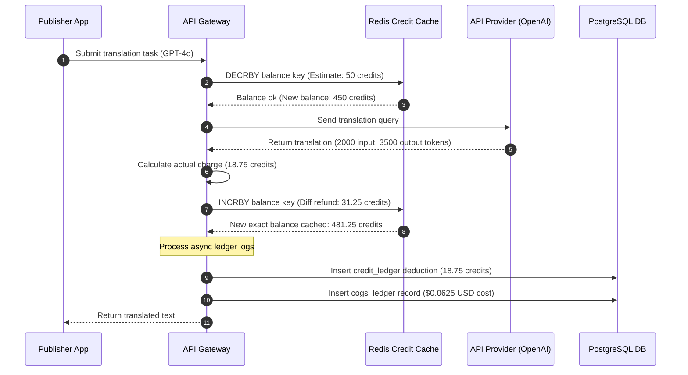

# Cost Estimation Model
## Purpose
This document establishes the financial architecture, unit economics, infrastructure costs, and API provider consumption metrics for the NewsOps Cloud platform. It specifies credit conversion frameworks and maps resource consumption to gross profit margin targets.

## Executive Summary
NewsOps Cloud maintains a strict gross margin target of >= 75% across all paid plans. Platform costs consist of Infrastructure Costs (Neon serverless Postgres database operations, Redis cache servers, Kubernetes microservices, AWS network egress) and API Provider Costs (OpenAI, Google Gemini, NVIDIA NIM, and translation API endpoints). To manage volatility in API costs, the platform utilizes a internal "Credits" model. One US Dollar ($1.00 USD) converts to 100 platform Credits. Dynamic AI routing chooses the most cost-efficient models based on tenant requirements and budget preferences, maximizing margins without sacrificing publishing quality.

## Vision
To build a sustainable, highly optimized SaaS billing platform with solid unit economics. By tracking and allocating infrastructure and AI cost metrics down to the single tenant and action level, NewsOps Cloud ensures that no cohort or user segment operates at a deficit.

## Scope
The scope of this model covers:
- **Infrastructure Cost Allocations**: Dynamic pricing calculators tracking database CPU-seconds, storage allocation, caching instances, and network data egress per tenant.
- **Third-Party API Tracking**: Telemetry layers auditing token consumption for OpenAI, Google Gemini, and NVIDIA NIM.
- **Credit Engine**: Conversion parameters, transactional ledgers, and pricing schemas.
- **Gross Margin Reporting**: Operational dashboards compiling COGS (Cost of Goods Sold) and calculating gross margins by tier, organization, and tenant cohort.

## Goals
1. Maintain average gross margins of >= 75% on the Pro tier, and >= 80% on the Enterprise tier.
2. Limit monthly Free tier infrastructure and AI processing costs to less than $1.50 per active tenant.
3. Compute and store tenant-specific cost allocations within 50ms of executing any AI request.
4. Provide auto-recharging credit accounts to prevent publication pipeline interruptions.

## Functional Requirements
- **Dynamic Cost Ledger**: Record exact token usage and compute the financial cost of every AI generation.
- **Credit-to-USD Conversion Engine**: Credit balances that update dynamically on payments or top-ups.
- **Dynamic AI Router Integration**: Routing rules that change destination LLM models based on real-time credit constraints.
- **Financial Analytics Panel**: Tenant-facing reports showing financial expenditures and credits remaining.
- **COGS Aggregator**: Background processing script compiling infrastructure footprints and outputting gross margin reports.

## Non-Functional Requirements
- **Deduction Latency**: Credit deductions must complete in less than 50ms to keep page generation speeds fast.
- **Transactional Parity**: Credit updates must be fully ACID-compliant to prevent double-spending or negative balances.
- **Auditability**: Complete tracking history of credit transactions to resolve billing disputes.
- **Security Validation**: Sign ledger updates cryptographically to prevent tampering.

## Business Rules
1. **Credit Exchange Rate**: $1.00 USD = 100 Platform Credits.
2. **API Provider Cost/Credit Matrix (per 1,000,000 tokens)**:
   - **OpenAI GPT-4o**: Cost: $5.00 input, $15.00 output. Pricing: 1,500 Credits input, 4,500 Credits output. (Gross Margin: 66.7%).
   - **Google Gemini 1.5 Pro**: Cost: $3.50 input, $10.50 output. Pricing: 1,000 Credits input, 3,000 Credits output. (Gross Margin: 65%).
   - **Google Gemini 1.5 Flash**: Cost: $0.35 input, $1.05 output. Pricing: 120 Credits input, 360 Credits output. (Gross Margin: 70.8%).
   - **NVIDIA NIM (Llama 3 70B)**: Cost: $0.80 input, $2.40 output. Pricing: 250 Credits input, 750 Credits output. (Gross Margin: 68%).
   - **Local models (vLLM / Llama 3 8B Hosted)**: Infrastructure compute cost: $0.10 flat rate/hour. Pricing: 5 Credits flat rate per 10,000 tokens. (Gross Margin: 80%+).
3. **Infrastructure Tenant Unit Baseline Cost**:
   - **Free Plan**: Allocated Infrastructure budget = $0.50/mo.
   - **Pro Plan**: Allocated Infrastructure budget = $15.00/mo.
   - **Enterprise Plan**: Custom dedicated resources, billed at Cost + 35% margin markup.
4. **Auto-Recharge Policy**: Tenants can opt-in to automatically purchase $20.00 (2,000 credits) whenever their credit balance drops below 500 credits.

## Actors
- **Billing Administrator**: Reviews system pricing schemas and adjusts credit parameters.
- **Financial Analyst**: Evaluates system margins and infrastructure cost allocations.
- **AI Integration Gateway**: Executes API requests and reports tokens consumed.
- **Tenant Administrator**: Controls billing setups and configures auto-recharge settings.

## User Stories
### Story 1: Monitoring Credit Consumption
As a **Tenant Administrator**, I want to view a breakdown of our credits spent on GPT-4o vs Llama-3-70B so that I can optimize our workflow prompts and manage publishing expenses.
### Story 2: Automatic Credit Recharge
As a **Tenant Administrator**, I want to set an automatic recharge trigger that buys 5,000 credits when our account falls below 1,000 credits so that our scheduled publishing queues do not fail overnight.
### Story 3: Cohort Profitability Analysis
As a **Financial Analyst**, I want to query a report comparing the total subscription revenue of Pro tenants with their actual API and infrastructure usage costs so that I can monitor platform gross margins.

## Acceptance Criteria
1. **Dynamic Routing Overage Mitigation**: If a user runs out of credits, the API gateway must intercept subsequent generative requests, reject them with a `402 Payment Required` code, and cancel the upstream API call.
2. **Transaction Immutability**: All modifications to the `credit_ledger` must include cryptographic checksums generated with SHA-256 using the organization's unique private key.
3. **Dynamic pricing updates**: The billing coordinator must allow runtime price adjustments for AI engines, taking effect for subsequent user API queries in less than 5 seconds.
4. **Financial Margin Thresholds**: If a cohort's gross margin drops below 70%, the system must generate a high-priority warning to the product operations team.

## Workflows
1. **Transactional Credit Deduction Workflow**:
   - User requests a translation task using the `GPT-4o` model.
   - The Gateway checks the organization's credit balance in the Redis cache.
   - If the balance is above the estimated cost, the task proceeds.
   - The translation task executes, using 2,000 input tokens and returning 3,500 output tokens.
   - The system records the API execution cost:
     - Actual API Cost: `(2,000 * 0.000005) + (3,500 * 0.000015) = $0.01 + $0.0525 = $0.0625 USD`.
     - Credit Charge: `(2,000 * 0.0015) + (3,500 * 0.0045) = 3 + 15.75 = 18.75 Credits`.
   - The credit service deducts 18.75 credits from the Redis cache.
   - The transaction is logged to `credit_transactions` and `cogs_ledger`.
   - The balance is updated, and a success response is returned to the user.

2. **Auto-Recharge Execution**:
   - During credit deduction, the service notices the remaining balance dropped to 480 credits (below the 500-credit trigger).
   - The system validates that the tenant has enabled auto-recharges.
   - The system makes an asynchronous call to the billing engine.
   - The billing engine requests Stripe to charge the registered card for $20.00 USD.
   - Upon successful transaction, the billing engine inserts an addition of 2,000 credits into the ledger.
   - The system updates the Redis balance and dispatches a confirmation receipt email.

## API Design

### 1. Retrieve Organization Balance and Ledger
View current credit balance, transaction history, and detailed token logs.
- **Endpoint**: `GET /api/v1/organizations/{org_id}/credits/ledger`
- **Headers**:
  - `Authorization: Bearer <JWT>`
- **Response Payload (`200 OK`)**:
```json
{
  "organization_id": "org_7720194-c",
  "current_credit_balance": 2450.50,
  "auto_recharge_enabled": true,
  "recharge_threshold_credits": 500.0,
  "recharge_amount_usd": 20.00,
  "transactions": [
    {
      "transaction_id": "tx_8819204-d",
      "timestamp": "2026-06-27T22:05:10Z",
      "type": "DEDUCTION",
      "amount_credits": -18.75,
      "resource_type": "AI_PROMPT_GENERATION",
      "details": {
        "model": "openai-gpt-4o",
        "input_tokens": 2000,
        "output_tokens": 3500
      }
    },
    {
      "transaction_id": "tx_8819102-a",
      "timestamp": "2026-06-25T10:14:00Z",
      "type": "PURCHASE",
      "amount_credits": 2000.00,
      "resource_type": "STRIPE_CHARGE",
      "details": {
        "stripe_charge_id": "ch_3Mv9182Ld",
        "amount_usd": 20.00
      }
    }
  ]
}
```

### 2. Purchase Manual Credit Pack
Add credits manually via the stripe card link.
- **Endpoint**: `POST /api/v1/organizations/{org_id}/credits/purchase`
- **Headers**:
  - `Authorization: Bearer <JWT>`
- **Request Payload**:
```json
{
  "amount_usd": 50.00,
  "payment_method_id": "pm_1Ls9012Ksd"
}
```
- **Response Payload (`200 OK`)**:
```json
{
  "transaction_id": "tx_8819300-k",
  "organization_id": "org_7720194-c",
  "purchased_credits": 5000.00,
  "new_balance": 7450.50,
  "status": "SUCCESS"
}
```

## Database Design
```sql
-- Dynamic pricing schemas for model providers
CREATE TABLE model_pricing_schemas (
    id UUID PRIMARY KEY DEFAULT gen_random_uuid(),
    model_name VARCHAR(100) UNIQUE NOT NULL, -- e.g., 'openai-gpt-4o'
    provider VARCHAR(50) NOT NULL, -- e.g., 'OpenAI', 'Google', 'Local'
    cost_per_million_input_usd NUMERIC(10, 4) NOT NULL,
    cost_per_million_output_usd NUMERIC(10, 4) NOT NULL,
    credit_charge_per_million_input NUMERIC(12, 4) NOT NULL,
    credit_charge_per_million_output NUMERIC(12, 4) NOT NULL,
    is_active BOOLEAN NOT NULL DEFAULT TRUE,
    updated_at TIMESTAMP WITH TIME ZONE DEFAULT CURRENT_TIMESTAMP
);

CREATE INDEX idx_pricing_schemas_active ON model_pricing_schemas(model_name) WHERE is_active = TRUE;

-- Transactional credit ledger
CREATE TABLE credit_ledger (
    id UUID PRIMARY KEY DEFAULT gen_random_uuid(),
    organization_id UUID NOT NULL REFERENCES tenant_organizations(id) ON DELETE CASCADE,
    transaction_type VARCHAR(50) NOT NULL, -- 'PURCHASE', 'DEDUCTION', 'REFUND', 'ADMIN_ADJUSTMENT'
    amount_credits NUMERIC(12, 4) NOT NULL,
    resulting_balance NUMERIC(12, 4) NOT NULL,
    description VARCHAR(255) NOT NULL,
    signature VARCHAR(64) NOT NULL, -- Cryptographic hash to verify row integrity
    created_at TIMESTAMP WITH TIME ZONE DEFAULT CURRENT_TIMESTAMP
);

CREATE INDEX idx_credit_ledger_org ON credit_ledger(organization_id, created_at);

-- COGS ledger to track real financial costs vs billed credits
CREATE TABLE cogs_ledger (
    id UUID PRIMARY KEY DEFAULT gen_random_uuid(),
    organization_id UUID NOT NULL REFERENCES tenant_organizations(id) ON DELETE CASCADE,
    cost_type VARCHAR(50) NOT NULL, -- 'AI_API_COST', 'INFRASTRUCTURE_COST'
    service_name VARCHAR(100) NOT NULL, -- e.g., 'openai-gpt-4o', 'neon-postgres-cpu'
    actual_cost_usd NUMERIC(12, 6) NOT NULL,
    billed_credits NUMERIC(12, 4) NOT NULL DEFAULT 0.0000,
    created_at TIMESTAMP WITH TIME ZONE DEFAULT CURRENT_TIMESTAMP
);

CREATE INDEX idx_cogs_ledger_type_time ON cogs_ledger(cost_type, created_at);
```

## UI Design
The credit control page is located in the billing section of the publisher workspace:
1. **Credit Status Card**:
   - Shows the primary balance in large font (e.g. **2,450.50 Credits**).
   - An equivalent dollar value estimate label ($24.51 USD equivalent).
   - A single-click "Buy Credits" button.
2. **Auto-Recharge Settings Form**:
   - A checkbox labeled **Enable Auto-Recharge**.
   - Input fields: "When balance falls below [500] credits" and "Automatically buy [$20.00] of credits".
   - Dropdown selection to pick the preferred payment method.
3. **Usage Chart Component**:
   - A stacked bar chart visualizing monthly credit consumption, color-coded by model provider (OpenAI, Gemini, NIM, Local models) to identify efficiency opportunities.

## Permissions
- `billing:credits:read`: Allow viewing balances and credit statement logs.
- `billing:credits:purchase`: Purchase additional credit packs.
- `billing:credits:adjust`: High-level admin adjustment permission (for operations support).
- `finance:reports:read`: Financial analyst access to COGS aggregates and margin statistics.

## Security
- **Idempotency Keys**: Credit purchases require unique uuid idempotency keys to prevent duplicate transactions if the client clicks the submit button twice.
- **Row Cryptographic Checks**: The `signature` field in the credit ledger checks that the row data has not been modified directly in the database.
- **Secure Transport**: Financial and billing tokens are transmitted using strict HTTPS with TLS 1.3.

## Performance
- **Redis Balance Caching**: Balance fields are cached in Redis under `tenant:credits:balance:{org_id}` using Redis strings with transactional increments.
- **Fast Deductions**: The API Gateway uses `DECRBY` calls on Redis keys, avoiding slow PostgreSQL updates for each processed word or token.
- **Buffered database flushes**: Deduction logs are held in a memory buffer and flushed to PostgreSQL in batches of 100 rows every 5 seconds.

## Monitoring
### Prometheus Metrics
- `newsops_credit_balance_total`: Gauge, monitors average credit balance by organization.
- `newsops_cogs_per_tenant_usd`: Gauge, tracks real-time USD costs accrued by tenants.
- `newsops_gross_margin_percentage`: Gauge, displays calculated gross margins across cohorts.

### Alerting Rules
- **LowMarginsAlert**: Trigger warning if rolling 24-hour average of `newsops_gross_margin_percentage` drops below 72%.
- **NegativeCreditBalance**: Trigger warning if any tenant's credit balance drops below -100 credits.

## Logging
- **Log Format**: JSON.
- **Log Levels**:
  - `INFO`: Normal credit top-ups and balance queries.
  - `WARN`: User enters low credit thresholds (<10% plan bounds).
  - `ERROR`: Payment failures, database writing failures, or invalid row signatures.
- **Log Context**: Includes `tenant_id`, `transaction_type`, `amount_usd`, `credits_deducted`, and `new_balance`.

## Error Handling
| Input/System Error Code | HTTP Status | Customer-Facing Message |
| :--- | :--- | :--- |
| `INSUFFICIENT_CREDITS` | 402 Payment Required | "You do not have enough credits to complete this task. Please recharge." |
| `PRICING_OUT_OF_SYNC` | 500 Internal Error | "Unable to calculate action cost. Please try again shortly." |
| `IDEMPOTENCY_KEY_REUSED` | 409 Conflict | "This transaction has already been submitted and processed." |
| `SIGNATURE_VALIDATION_FAILED` | 500 Internal Error | "Credit data integrity verification failed. Please contact support." |

## Edge Cases
- **Simultaneous Prompt Execution**: If a user runs multiple heavy translation loops in parallel, they could exceed their remaining balance before the first request finishes. Mitigation: Redis atomic `DECRBY` operations deduct estimated max credits at request start, returning the delta at request completion.
- **API Price Volatility**: Upstream providers could change pricing overnight. Mitigation: System uses a daily pricing sync job to pull upstream costs and alerts admins to adjust billing rules.
- **Database Partition Migration Failures**: Database migrations must update all shard ledgers consistently without interrupting balance updates.

## Future Improvements
1. **Automated Price Arbitrage**: Implement algorithms that check real-time upstream costs and automatically redirect queries to cheaper equivalent models.
2. **Token Futures Hedging**: Secure token-purchasing discount agreements with large model providers to guarantee pricing stability.
3. **Credit Rollover Policies**: Implement credit expiration configurations to optimize balance liability reporting.

## Mermaid Diagrams


## References
- System Infrastructure Layouts: [../02-architecture/system_architecture.md](../02-architecture/system_architecture.md)
- SaaS Subscriptions and Stripe: [../08-saas/billing_handlers.md](../08-saas/billing_handlers.md)
- Database Sharding Design: [../03-database/tenant_partitioning.md](../03-database/tenant_partitioning.md)
- AI Model Routing Specifications: [../04-ai/model_routing.md](../04-ai/model_routing.md)
