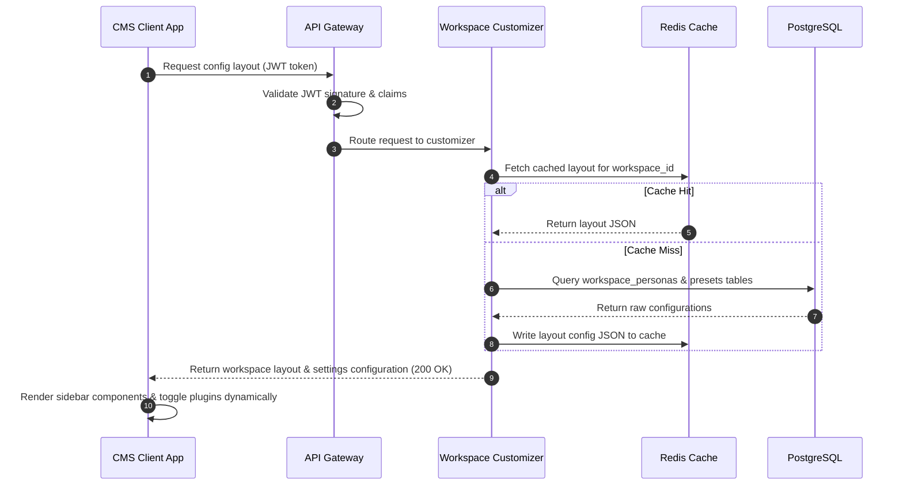

# Customer Personas & Workspace Customization

## Purpose
This document provides an in-depth analysis of the key customer personas for NewsOps Cloud (Local Newspapers, Independent Bloggers, Corporate PR Teams, and Media Agencies) and specifies the software design of the Persona-based Workspace Customizer & Onboarding Service (PWCOS). This service dynamically configures workspaces, UI layouts, publication paths, and security constraints based on the tenant's business profile.

## Executive Summary
To optimize user activation rates and reduce time-to-value, NewsOps Cloud does not rely on a generic, one-size-fits-all workspace. The PWCOS inspects the tenant's selected profile during registration and applies structural mutations to their workspace. This includes activating specific plugins (e.g., AP Wire feeds for newspapers, multi-client routing for agencies), modifying editor review gates, adjusting system performance allocations, and organizing the navigation layout to align with their natural day-to-day workflow.

## Vision
To establish an adaptive, user-centric publishing environment that conforms dynamically to the editor's operational model. By removing irrelevant tools and surfacing highly context-specific capabilities, the platform increases daily active retention and guides users through their publishing pipelines with zero initial learning curve.

## Scope
- **In Scope**:
  - User registration onboarding flow capturing publisher attributes.
  - Persona mapping repository defining specific presets, quotas, and workflows.
  - Dynamic UI configuration engine serving tailored sidebar hierarchies and layouts.
  - Feature flag integrations enabling/disabling tools like fact-checking or RSS syndicators based on persona.
  - Automated database configuration adjustments for multi-client workspaces (Agency sub-tenancies).
- **Out of Scope**:
  - Standard user profile management settings (avatar upload, email change).
  - Styling customizations outside of structural components (such as manual CSS themes per user).

## Goals
- Achieve an onboarding completion rate higher than 85% through personalized setup paths.
- Ensure workspace configuration payloads resolve in less than 50ms at runtime.
- Prevent workspace layout misconfigurations through centralized DB-driven validation rules.

## Functional Requirements
- **FR-1**: The onboarding engine must capture tenant attributes: size, primary channels (Web, Print, Social), and publishing frequency.
- **FR-2**: The system must map these attributes to one of four primary personas: `local_news`, `blogger`, `corporate_pr`, or `media_agency`.
- **FR-3**: Based on the mapped persona, the workspace initialization service must toggle specific CMS plugins (e.g., SEO, Translation, AP/Reuters API connectors).
- **FR-4**: Workspaces resolved as `corporate_pr` must have mandatory multi-step approval workflows enabled in the database, preventing direct bypass to live production publishing.
- **FR-5**: Workspaces resolved as `media_agency` must be provisioned with a client management module, enabling workspace aggregation and fast switching.

## Non-Functional Requirements
- **NFR-1 (Performance)**: Persona payload resolution must execute within 50ms to prevent lag during initial user dashboard boot.
- **NFR-2 (Maintainability)**: Persona configs must be stored as JSON data structures, allowing developers to update features and presets without deploying code updates.
- **NFR-3 (Security)**: Tenant-to-tenant switching for Media Agencies must validate authorization on every single request to prevent cross-workspace session hijacking.

## Business Rules
- **BR-1 (Local Newspaper)**: Defaults to high volume RSS & Wire integration. Print-to-digital layouts are prioritized. Multi-user role hierarchy is enforced (Reporter, Editor, Publisher).
- **BR-2 (Independent Blogger)**: Defaults to direct self-publishing. Substack/Ghost integrations are activated. Workflows bypass editor approvals.
- **BR-3 (Corporate PR)**: Strict compliance mode. AI generation requires mandatory bias/safety scanning. Direct external API syndication requires corporate officer approvals.
- **BR-4 (Media Agency)**: Master workspace holds billing configuration. Sub-workspaces are created for individual client accounts. Usage metrics (tokens, bandwidth) are tracked and segmented per client.

## Actors
- **Editor-in-Chief (Local Newspaper)**: Oversees reporters, manages local wire imports, schedules digital and print layouts.
- **Solopreneur Blogger**: Writes, designs, optimizes, and publishes posts single-handedly. Focuses heavily on direct email list monetization and SEO scores.
- **PR Director (Corporate PR)**: Ensures brand compliance, manages crisis communications, and schedules distribution across business networks.
- **Account Executive (Media Agency)**: Writes content for multiple customer clients, swapping contexts rapidly inside the CMS.

## User Stories
- **User Story 1**: As an Editor-in-Chief of a local newspaper, I want our team's workspace to pre-populate with active AP and Reuters wire integrations upon setup, so that we can immediately begin rewriting national stories for our local audience.
- **User Story 2**: As an Independent Blogger, I want to write an article and publish it to my website, Substack newsletter, and Twitter feed with a single click, without having to wait for corporate approval processes.
- **User Story 3**: As a PR Director, I want a strict policy configuration in our workspace that prevents any draft from going live without verification approval from both our Legal and Media Relations departments, protecting our brand reputation.
- **User Story 4**: As an Account Executive at a media agency, I want to select different client sub-workspaces from a single CMS account, ensuring my assets and client databases remain completely separated.

## Acceptance Criteria
- **AC-1**: When registering, if the user selects the "Corporate PR" persona, the system must set the `organization_settings.approval_gates` array to include `["legal", "editor_in_chief"]` and disable the direct-publish button in the Editor UI.
- **AC-2**: When an Agency user triggers a workspace context switch, the gateway must validate the user's master JWT against the destination workspace's membership database table. If unauthorized, the system must abort and return HTTP 403.
- **AC-3**: The UI layout endpoint `/api/v1/workspace/layout` must return a tailored JSON list of sidebar routes containing only persona-enabled items.

## Workflows

### Onboarding & Preset Application Flow
1. A new user completes registration at the register UI portal.
2. The user is prompted with an onboarding questionnaire: "Which option best describes your publishing operations?"
3. The user selects "Corporate PR Team".
4. The front-end calls `POST /api/v1/workspaces/onboard` with the selected option.
5. The PWCOS backend validates the input, calls `DB` to apply the `corporate_pr` preset parameters.
6. The system sets the workspace configurations: disables blogger direct publishing, enables brand safety scanner plugin, and establishes approval hierarchies.
7. The user is redirected to a personalized dashboard featuring a clean, compliance-first interface.

### Agency Client Switching Flow
1. An Agency user clicks the client selector dropdown in the navigation header.
2. The UI retrieves the list of authorized client workspaces via `GET /api/v1/workspace/clients`.
3. The user selects "Client B Workspace".
4. The UI requests a context switch via `POST /api/v1/workspace/switch` with payload `{"target_workspace_id": "ws_client_b"}`.
5. The API Gateway validates the tenant relationship, issues a new scoped session JWT token.
6. The UI reloads metadata and dynamically configures the dashboard for "Client B" style guidelines and API integrations.

## API Design

### 1. Submit Onboarding Survey & Resolve Persona
- **Endpoint**: `POST /api/v1/workspaces/onboard`
- **Request Payload**:
```json
{
  "workspace_id": "ws_abc123xyz",
  "business_type": "independent_blogger",
  "publishing_frequency": "daily",
  "distribution_channels": ["web", "substack", "twitter"],
  "team_size": 1
}
```
- **Response Payload (200 OK)**:
```json
{
  "workspace_id": "ws_abc123xyz",
  "resolved_persona": "blogger",
  "applied_presets": {
    "enabled_plugins": ["substack_sync", "twitter_publisher", "seo_analyzer"],
    "approval_required": false,
    "max_users": 1,
    "ai_tokens_quota": 5000000
  },
  "status": "configured"
}
```

### 2. Switch Agency Workspace Client Context
- **Endpoint**: `POST /api/v1/workspace/switch`
- **Headers**:
  - `Authorization: Bearer <master_agency_jwt>`
- **Request Payload**:
```json
{
  "target_workspace_id": "ws_client_999"
}
```
- **Response Payload (200 OK)**:
```json
{
  "status": "success",
  "switched_to": "ws_client_999",
  "session_token": "eyJhbGciOiJSUzI1NiIsInR5cCI6IkpXVCJ9.scoped_session_token_here",
  "workspace_layout": {
    "sidebar_navigation": ["editor", "media-library", "analytics"],
    "allowed_actions": ["articles:read", "articles:write", "publish:direct"]
  }
}
```

## Database Design

```sql
-- Persona-based Workspace Configuration Schema

CREATE TABLE personas (
    id VARCHAR(32) PRIMARY KEY,
    name VARCHAR(100) NOT NULL,
    description TEXT NOT NULL,
    created_at TIMESTAMP WITH TIME ZONE DEFAULT CURRENT_TIMESTAMP
);

CREATE TABLE persona_presets (
    id UUID PRIMARY KEY DEFAULT gen_random_uuid(),
    persona_id VARCHAR(32) NOT NULL REFERENCES personas(id),
    feature_flags JSONB NOT NULL DEFAULT '{}',
    default_limits JSONB NOT NULL DEFAULT '{}',
    navigation_layout JSONB NOT NULL DEFAULT '[]',
    created_at TIMESTAMP WITH TIME ZONE DEFAULT CURRENT_TIMESTAMP,
    updated_at TIMESTAMP WITH TIME ZONE DEFAULT CURRENT_TIMESTAMP
);

CREATE TABLE workspace_personas (
    workspace_id VARCHAR(64) PRIMARY KEY,
    persona_id VARCHAR(32) NOT NULL REFERENCES personas(id),
    custom_overrides JSONB NOT NULL DEFAULT '{}',
    created_at TIMESTAMP WITH TIME ZONE DEFAULT CURRENT_TIMESTAMP,
    updated_at TIMESTAMP WITH TIME ZONE DEFAULT CURRENT_TIMESTAMP
);

-- Indexing for quick configuration matching during route validation
CREATE INDEX idx_workspace_persona_lookup ON workspace_personas(workspace_id);
```

## UI Design
- **Workspace Onboarding Screen**:
  - Clean card-grid selection displaying 4 core personas:
    - **Local Newspaper**: Icon of newspaper. Subtitle: "Publishing news with wire inputs and editorial teams".
    - **Independent Blogger**: Icon of pen. Subtitle: "Write and share instantly to blogs and social profiles".
    - **Corporate PR**: Icon of building. Subtitle: "Enforce review compliance, legal approvals, and news wires".
    - **Media Agency**: Icon of folder-open. Subtitle: "Manage multiple clients and client billing in one place".
- **Tailored CMS Interfaces**:
  - *Blogger layout*: Focuses on distraction-free writing environment. The publishing panel features direct checkboxes for Substack, Medium, and Twitter.
  - *Corporate PR layout*: Introduces an "Approvals Pipeline" tracking rail on the editor screen. "Publish" is replaced with "Submit for Review".

## Permissions
The following RBAC permissions are configured:
- `workspace:configure`: Allows users to update default persona presets.
- `agency:switch`: Allows swapping between tenant sub-workspaces.
- `plugins:toggle`: Grants control over persona-resolved plugins list.
- `approvals:bypass`: Allows direct publishing (Blogger, Newspaper editor roles).

## Security
- **Cross-Tenant Validation**: In agency environments, client workspaces are separated logically in the database by tenant partitions. The JWT check middleware validates the claim `active_tenant_id` on every query transaction, appending it to PostgreSQL dynamic policies (RLS).
- **Preset Isolation**: Workspace preset payloads are strictly sanitized to ensure custom JavaScript cannot be injected via dynamic layout configuration variables.

## Performance
- **Target Response**: Layout configurations resolve under 30ms utilizing Redis hash caching (`HGETALL workspace:config:<id>`).
- **Cache Eviction**: The system invalidates cached layout presets only when a plugin toggle event is committed or when a custom override is processed.

## Monitoring
- **Prometheus Metrics**:
  - `newsops_persona_resolution_duration_seconds`: Time to execute onboarding persona logic.
  - `newsops_active_workspaces_by_persona`: Gauge recording workspace counts for each persona.
- **Alerts**:
  - `HighWorkspaceSwitchFailure`: Triggers if the system records more than 10 failed workspace context switch attempts (`403 Forbidden`) within a 5-minute interval.

## Logging
- **Log format**:
```json
{
  "timestamp": "2026-06-27T22:20:00.540Z",
  "level": "INFO",
  "service": "workspace-customizer",
  "event": "persona_presets_applied",
  "context": {
    "workspace_id": "ws_abc123xyz",
    "persona": "corporate_pr",
    "required_approvals": ["legal", "editor_in_chief"]
  }
}
```

## Error Handling
| Application Error Code | HTTP Status | Customer-Facing Error Message |
|:---|:---|:---|
| `ERR_PERSONA_NOT_FOUND` | 400 Bad Request | The specified onboarding persona is invalid. |
| `ERR_UNAUTHORIZED_SWITCH` | 403 Forbidden | You do not have permissions to access this client workspace. |
| `ERR_METADATA_UPGRADE_FAILED` | 500 Internal | Failed to apply workspace configs. Please retry. |

## Edge Cases
- **Persona Upgrade/Downgrade Mid-cycle**: If a blogger upgrades to an agency account, the PWCOS must retain existing blog drafts while establishing client sub-workspaces. This is handled by a database migration function that moves local drafts to the first client workspace (`Default Client`).
- **Invalid Custom Presets JSON**: If custom overrides break the JSON schema structure, the customizer service falls back to default persona configurations.

## Future Improvements
- **Automated Workspace Optimization**: Machine learning engine suggesting feature activation based on actual tool usage (e.g., if a blogger uses SEO tools frequently, the interface automatically highlights them).

## Mermaid Diagrams

### Persona Layout Initialization Sequence


## References
- [System Architecture](../../docs/02-architecture/README.md)
- [Database Schema](../../docs/03-database/README.md)
- [SaaS Engine Architecture](../../docs/08-saas/README.md)
