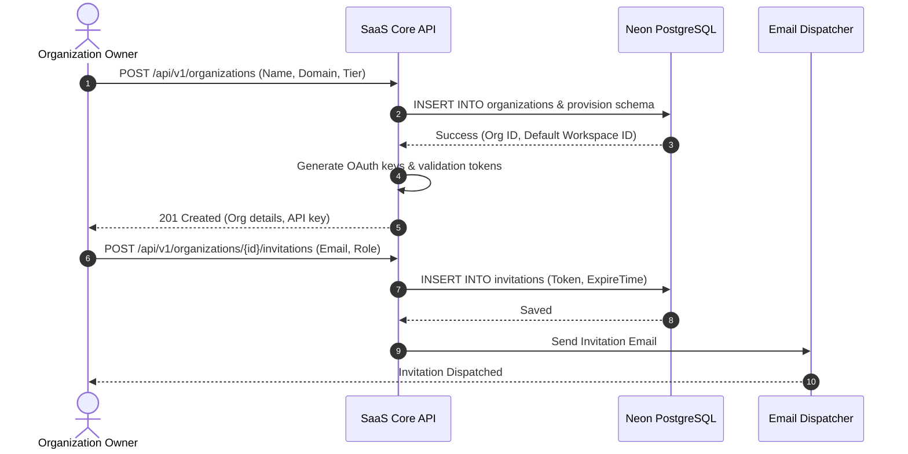
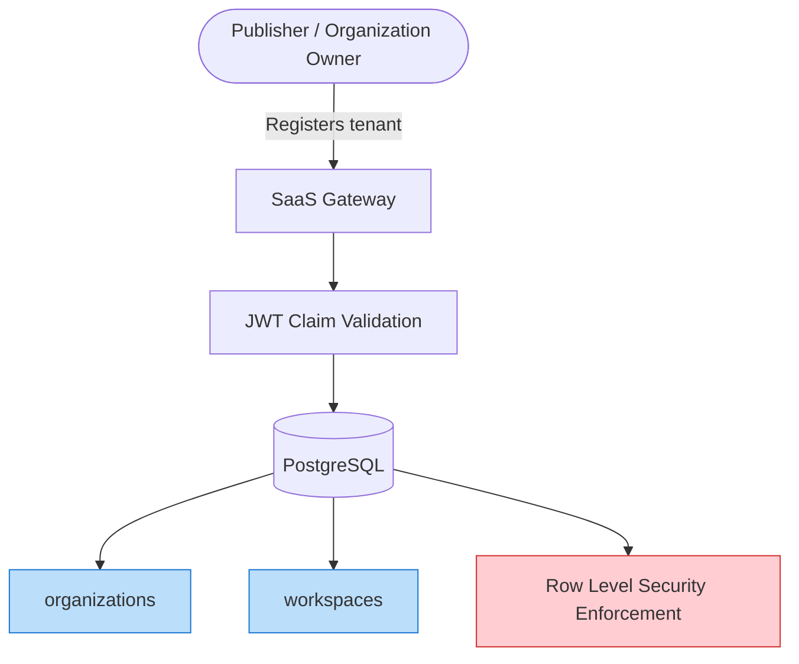

# NewsOps Cloud Executive Summary

## Purpose
This document provides the high-level strategic roadmap, business mission, and core product architecture of the NewsOps Cloud digital publishing operating system. It defines the software's functional scope, target customers, and technical indicators for project validation, ensuring alignment across business leadership, product managers, and engineering teams.

## Executive Summary
NewsOps Cloud is a multi-tenant, cloud-native digital publishing operating system (OS) that replaces legacy Content Management Systems (CMS) with an integrated AI operations environment. It streamlines content ingestion, fact-checking, collaborative writing, automated multi-channel scheduling, and credit-metered AI processing. By combining Neon PostgreSQL database partitioning, a multi-provider LLM router, and automated social publication workflows, NewsOps Cloud reduces publishing operational overhead while protecting data privacy and source provenance.

## Vision
To transform digital media operations from disjointed, plugin-heavy blogging platforms into a single, unified "NewsOps" runtime. In this paradigm, artificial intelligence serves not as an external writing assistant but as a native utility layer for clustering, optimization, and fact-checking—backed by strict human-in-the-loop controls and absolute source attribution.

## Scope
- **Target Segments**: Independent Journalists, Mid-sized Digital Newsrooms, Media Conglomerates, and Corporate Communications desks.
- **Core Modules**: Workspace Management, News Intelligence (scraping/clustering), Editorial Studio, Social Distribution, Billing/Credits Gateway.
- **Excluded**: Custom front-end site development hosting (NewsOps Cloud is a headless API and content distribution provider; rendering is delegated to tenant-owned Next.js/Remix heads via CDN).

## Goals
- **Market Impact**: Lower publication cycle times by 40% in the first 6 months of adoption.
- **Platform Performance**: Sustain a 99.99% core API uptime SLA.
- **Financial Architecture**: Achieve a 70% gross margin on credit-metered AI operations.
- **Integration**: Provide 100% test coverage for key distribution channel APIs (Meta Graph, LinkedIn, YouTube).

## Functional Requirements
- **Tenant Registration**: Self-service organization onboarding with sub-tenant partitioning.
- **Workspace Isolation**: Cryptographically verified boundaries for separate news desks.
- **Resource Limits**: Configurable storage, user count, and credit limits per subscription tier.
- **Human-in-the-Loop (HITL) Checkpoints**: Mandatory human validation gates before any content reaches distribution queues.

## Non-Functional Requirements
- **Tenant Separation**: Strict row-level security (RLS) in database tables.
- **Global Latency**: Core API reads must return in < 50ms at P95; writes must complete in < 150ms.
- **Scalability**: Support up to 10,000 active organizations and 100,000 concurrent editorial users without degradation.
- **Availability**: Standard cluster setup using multi-region Kubernetes deployments.

## Business Rules
- **Domain Verification**: Organizations must prove ownership of custom domains before registering corporate-branded workspaces.
- **Credit Allocation**: Unused subscription-included credits expire at the end of each billing cycle; purchased add-on credits roll over indefinitely.
- **Role Hierarchies**: Every workspace must have at least one designated "Workspace Administrator" who handles permissions and billing.

## Actors
- **Subscriber / Organization Owner**: Owns the primary billing account, purchases credits, and manages workspace partitions.
- **Editor**: Manages content schedules, assigns writers, and approves articles for distribution.
- **Writer / Journalist**: Discovers story ideas, drafts copy in the Collaborative Editor, and reviews AI optimization suggestions.
- **External Contributor**: Accesses a single assigned workspace to submit freelance drafts.

## User Stories
- As a Newsroom Editor, I want to invite freelance writers to a specific workspace and restrict their visibility to their own drafts, so that we can prevent leakage of investigative reporting before publication.
- As an Organization Owner, I want to monitor our workspace credit consumption in real-time on our dashboard, so that we do not unexpectedly exhaust our budget during high-volume news cycles.
- As a Writer, I want to import scrapings and research topics into the collaborative editor, so that I can draft stories with automatically generated inline source citations.

## Acceptance Criteria
- Tenant onboarding must provision a distinct database partition and log a success audit payload within 2.0 seconds.
- The organization billing dashboard must update credit balances within 1.0 second of an AI function call (e.g. translation, clustering) being resolved.
- Freeland drafts visibility must return a `403 Forbidden` error if accessed by users without specific workspace membership.

## Workflows
1. **Tenant Onboarding**:
   - User inputs organization details and custom domain.
   - Core API registers the organization entity, verifies the domain TXT records, and provisions neon database rows.
   - A workspace boundary is established, and the owner is assigned the `organizations:write` privilege.
2. **Workspace Invitation**:
   - Administrator creates an invite link specifying user email and role.
   - System registers the invitation, sends an email token, and logs the action.
   - Invitee clicks link, authenticates via JWT, and is added to the workspace.



## API Design

### Create Organization
- **Endpoint**: `POST /api/v1/organizations`
- **Headers**: `Content-Type: application/json`, `Authorization: Bearer <JWT>`
- **Request Body**:
```json
{
  "name": "Global News Network",
  "domain": "globalnews.net",
  "billing_tier": "Pro",
  "timezone": "America/New_York"
}
```
- **Response (201 Created)**:
```json
{
  "organization_id": "c13b52b9-22f9-47f9-82ee-fdcce2856f2c",
  "name": "Global News Network",
  "domain": "globalnews.net",
  "billing_tier": "Pro",
  "status": "active",
  "created_at": "2026-06-27T22:12:00Z"
}
```

### Retrieve Organization Billing Status
- **Endpoint**: `GET /api/v1/organizations/{id}/billing`
- **Headers**: `Authorization: Bearer <JWT>`
- **Response (200 OK)**:
```json
{
  "organization_id": "c13b52b9-22f9-47f9-82ee-fdcce2856f2c",
  "current_tier": "Pro",
  "credit_balance": 75800,
  "billing_cycle_end": "2026-07-27T00:00:00Z",
  "active_users": 14,
  "max_users": 25
}
```

## Database Design
To manage organizations and workspace isolation, the following schema is used:

```sql
CREATE TABLE organizations (
    id UUID PRIMARY KEY DEFAULT gen_random_uuid(),
    name VARCHAR(255) NOT NULL,
    domain VARCHAR(255) NOT NULL UNIQUE,
    billing_tier VARCHAR(50) NOT NULL DEFAULT 'Free',
    status VARCHAR(50) NOT NULL DEFAULT 'pending',
    created_at TIMESTAMP WITH TIME ZONE DEFAULT CURRENT_TIMESTAMP,
    updated_at TIMESTAMP WITH TIME ZONE DEFAULT CURRENT_TIMESTAMP
);

CREATE TABLE workspaces (
    id UUID PRIMARY KEY DEFAULT gen_random_uuid(),
    organization_id UUID NOT NULL REFERENCES organizations(id) ON DELETE CASCADE,
    name VARCHAR(255) NOT NULL,
    slug VARCHAR(100) NOT NULL,
    created_at TIMESTAMP WITH TIME ZONE DEFAULT CURRENT_TIMESTAMP,
    CONSTRAINT unique_org_workspace_slug UNIQUE(organization_id, slug)
);

CREATE TABLE user_workspaces (
    user_id UUID NOT NULL,
    workspace_id UUID NOT NULL REFERENCES workspaces(id) ON DELETE CASCADE,
    role VARCHAR(50) NOT NULL DEFAULT 'writer',
    created_at TIMESTAMP WITH TIME ZONE DEFAULT CURRENT_TIMESTAMP,
    PRIMARY KEY (user_id, workspace_id)
);

CREATE INDEX idx_organizations_domain ON organizations(domain);
CREATE INDEX idx_workspaces_organization ON workspaces(organization_id);
```

## UI Design
- **Workspace Selector**: Dropdown component in the top-left sidebar showing available workspaces.
- **Organization Settings Dashboard**: Tabbed interface with panels for General Details, Billing Details, Member Management, and API Credentials.
- **Role Assignment Table**: List of users with dropdown selectors for updating roles, and search filters for scanning members.

## Permissions
- `organizations:write`: Granted to Organization Owners and Platform Admins; allows changing domains and deletion.
- `organizations:read`: Read organization-wide attributes.
- `workspaces:manage`: Edit workspace layout, invite and revoke permissions of Writers/Contributors.

## Security
- **Data Encapsulation**: Neon PostgreSQL uses RLS filters matching the authenticated `user_workspaces.workspace_id`.
- **JWT Scope Enforcement**: Gateway rejects incoming tokens missing organization claims.
- **Input Sanitization**: HTML entity escaping on organization registration input blocks scripting attacks.

## Performance
- **Signup Speed**: Provisioning database schema paths within 2000ms.
- **Auth Cache**: Cache user memberships in Redis with a 5-minute TTL.
- **Concurrent TPS**: Peak target capacity of 100 tenant operations per second.

## Monitoring
- Prometheus Metric: `newsops_tenant_signups_total{status="success"}`
- Prometheus Metric: `newsops_tenant_signups_failed_total{reason="duplicate_domain"}`
- Alert Rule: Trigger PagerDuty alarm if `tenant_provisioning_duration_seconds > 5.0` for 3 consecutive calls.

## Logging
- **Sign-up Event Audit Log**:
```json
{
  "timestamp": "2026-06-27T22:12:35Z",
  "level": "INFO",
  "context": "onboarding_service",
  "event": "tenant_created",
  "payload": {
    "org_id": "c13b52b9-22f9-47f9-82ee-fdcce2856f2c",
    "domain": "globalnews.net",
    "tier": "Pro"
  }
}
```

## Error Handling
- **Duplicate Domain (409 Conflict)**: Returned if the requested domain matches an existing registered organization.
- **Credit Exhausted (402 Payment Required)**: Returned when credit balance drops below 0.
```json
{
  "error_code": "CREDIT_LIMIT_EXCEEDED",
  "message": "Your organization's credit balance is exhausted. Please replenish your credits to run further AI tasks.",
  "status_code": 402
}
```

## Edge Cases
- **Simultaneous Registration**: Handled by database transactional locking on the `organizations` unique index.
- **Staging vs. Production Domain Clash**: Handled by enforcing domain DNS verification checks before activation.

## Future Improvements
- Automated migration tool mapping Active Directory groups directly to NewsOps RBAC roles.
- Dynamic regional DB routing to place tenant data tables geographically close to their main publication hub.

## Mermaid Diagrams


## References
- [Business Directory Index](./index.md)
- [Monetization Strategy Technical Design](./monetization_strategy.md)
- [Legal and Compliance Policy](./legal_and_compliance.md)
