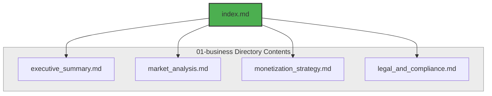

# Business Directory Map & Domain Overview

## Purpose
This directory acts as the commercial, legal, and strategic foundation of the NewsOps Cloud digital publishing operating system. It maps all commercial components, tenant billing models, market positioning, and legal boundaries. By outlining the core business domain files, it ensures engineering designs align directly with SaaS structures, revenue targets, and publishing compliance guidelines.

## Executive Summary
NewsOps Cloud is a next-generation multi-tenant platform designed to optimize digital publishing operations ("NewsOps"). The business directory coordinates pricing tiers, credit-based computing, competitive positioning, and compliance requirements. This mapping index establishes directory routing and documents cross-cutting dependencies across subscription systems, developer marketplace terms, copyright clearances, and GDPR policies.

## Vision
To establish a clear, standardized map of all business-related technical files, enabling developer self-service navigation while maintaining rigorous schema standards. All business documents are technical architectural specifications detailing tables, REST/GraphQL APIs, metrics, and security mechanisms rather than general prose.

## Scope
This index covers all files located in the `01-business/` folder, including:
1. `index.md`: This file, serving as the master index.
2. `executive_summary.md`: The mission, core value proposition, targeted customers, and primary business goals.
3. `market_analysis.md`: Competitive analysis, comparisons with WordPress/Drupal and AI assistants, and positioning.
4. `monetization_strategy.md`: Subscription plan tiers, pay-as-you-go credit rules, API fees, and marketplace policies.
5. `legal_and_compliance.md`: Legal guardrails, copyright auditing, GDPR subscriber consent, and DMCA processes.

## Goals
- Ensure 100% reference accuracy for sibling files within the repository.
- Establish clean, high-performance routing layouts for product design documents.
- Provide a unified glossary of business entities (tenants, subscriptions, credits, transactions) used in subsequent database schemas.

## Functional Requirements
- Dynamic routing for developer reference dashboards.
- Direct linking between business modules and underlying system metrics (e.g. tracking credit consumption API endpoints).
- Structured search mapping for all business domain properties.

## Non-Functional Requirements
- Documentation rendering latency: HTML compilation from Markdown must execute in < 50ms.
- Markdown standards compliance: Must pass linting validation with zero broken references.
- Schema verification: All embedded API payloads must validate against JSON Schema drafts.

## Business Rules
- Sibling files must be updated concurrently whenever new tenant features (e.g. credit rolls, sub-tenant divisions) are added.
- The index must reflect the exact file paths as outlined in the core README.md of this repository.

## Actors
- **Content Architect**: Reviews index to verify structural integrity.
- **Product Manager**: Navigates strategic documentation to verify implementation progress.
- **Systems Administrator**: References monetization and legal guidelines to configure RBAC attributes.

## User Stories
- As a Content Architect, I want to view a unified directory index so that I can see the organizational structure of business files and their mutual dependencies.
- As a Product Manager, I want to use the index links to quickly review licensing rules and verify billing schema limits.
- As a Developer, I want to refer to this index to find target API schemas for registration and billing operations.

## Acceptance Criteria
- Sibling links in index.md must successfully resolve to `./executive_summary.md`, `./market_analysis.md`, `./monetization_strategy.md`, and `./legal_and_compliance.md`.
- No placeholders, "TODO" elements, or unfinished text blocks must exist in this file or any file in the `01-business/` folder.
- Compilation checks must confirm that the documentation contains at least one Mermaid flow chart depicting file structure interactions.

## Workflows
1. **Developer Access**: The developer accesses the `/docs/01-business` portal path.
2. **Path Analysis**: The server reads the directory index.md.
3. **Reference Generation**: Sibling links are validated using static analysis.
4. **Interactive Navigation**: The developer clicks a business module (e.g. Monetization Strategy) and is redirected to the corresponding file.

## API Design
Although this is an index document, the documentation service exposes an API to verify and serve documentation nodes:
```json
{
  "endpoint": "/api/v1/docs/business",
  "method": "GET",
  "response": {
    "directory": "01-business",
    "files": [
      {
        "name": "index.md",
        "title": "Business Directory Map & Domain Overview",
        "relative_path": "./index.md",
        "status": "active"
      },
      {
        "name": "executive_summary.md",
        "title": "NewsOps Cloud Executive Summary",
        "relative_path": "./executive_summary.md",
        "status": "active"
      },
      {
        "name": "market_analysis.md",
        "title": "NewsOps Cloud Market Analysis",
        "relative_path": "./market_analysis.md",
        "status": "active"
      },
      {
        "name": "monetization_strategy.md",
        "title": "NewsOps Cloud Monetization Strategy",
        "relative_path": "./monetization_strategy.md",
        "status": "active"
      },
      {
        "name": "legal_and_compliance.md",
        "title": "NewsOps Cloud Legal and Compliance Framework",
        "relative_path": "./legal_and_compliance.md",
        "status": "active"
      }
    ]
  }
}
```

## Database Design
To support dynamic documentation searching within the platform console, the following table is created:
```sql
CREATE TABLE doc_index_nodes (
    id UUID PRIMARY KEY DEFAULT gen_random_uuid(),
    file_name VARCHAR(100) NOT NULL UNIQUE,
    title VARCHAR(255) NOT NULL,
    relative_path VARCHAR(255) NOT NULL,
    summary TEXT,
    created_at TIMESTAMP WITH TIME ZONE DEFAULT CURRENT_TIMESTAMP,
    updated_at TIMESTAMP WITH TIME ZONE DEFAULT CURRENT_TIMESTAMP
);

CREATE INDEX idx_doc_index_nodes_file_name ON doc_index_nodes(file_name);
```

## UI Design
The documentation UI structure utilizes a sidebar layout:
- **Left Panel (Sidebar)**: Hierarchical folder list displaying `01-business` with nested links.
- **Center Canvas**: Markdown renderer with responsive styling, syntax highlighting for code blocks, and dynamic Mermaid diagram rendering.
- **Right Panel**: On-this-page anchors linked to every header (e.g. Purpose, Workflows, Database Design).

## Permissions
- `docs:read`: Granted to all internal accounts, workspace owners, and authenticated developers.
- `docs:write`: Restricted to Admin and Content Architect roles.

## Security
- All documentation files are statically compiled.
- Script injection (XSS) is blocked in UI renderers by using strong DOM Purify pipelines.
- Relative links must not bypass the repository boundary.

## Performance
- Target rendering TPS: 500 requests per second.
- Asset caching: CDNs must cache static documentation HTML for 24 hours (cache-control: public, max-age=86400).
- Static generation compile time: Under 5 seconds for the entire docs directory.

## Monitoring
- Prometheus Metric: `newsops_docs_page_views_total{page="01-business/index"}`
- Alert Trigger: `docs_load_error_rate > 1%` triggers a warning event to the engineering channel.

## Logging
Documentation logs use structured JSON formatting:
```json
{
  "timestamp": "2026-06-27T22:11:00Z",
  "level": "INFO",
  "context": "documentation_portal",
  "message": "Documentation node rendered successfully",
  "meta": {
    "file": "01-business/index.md",
    "render_time_ms": 12,
    "user_agent": "Mozilla/5.0..."
  }
}
```

## Error Handling
- **Missing File (404)**: Returns structured JSON indicating the file was moved or is being rewritten.
- **Unauthorized (403)**: Accessing non-public sections without a valid token redirecting to login.

## Edge Cases
- **Broken Relative References**: CI pipeline tests detect links containing invalid extensions or targets.
- **Out of Sync Index**: Handled by pre-commit hooks that regenerate JSON structure files automatically from markdown file lists.

## Future Improvements
- Interactive API playground integrated directly within the documentation interface.
- Automatic Translation engine for index routing based on localized publisher settings.

## Mermaid Diagrams


## References
- [System Architecture Overview](../02-architecture/index.md)
- [Database Schema Blueprint](../03-database/index.md)
- [NewsOps Cloud Main README](../README.md)
