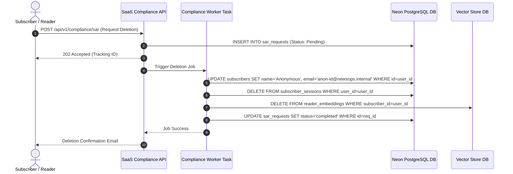
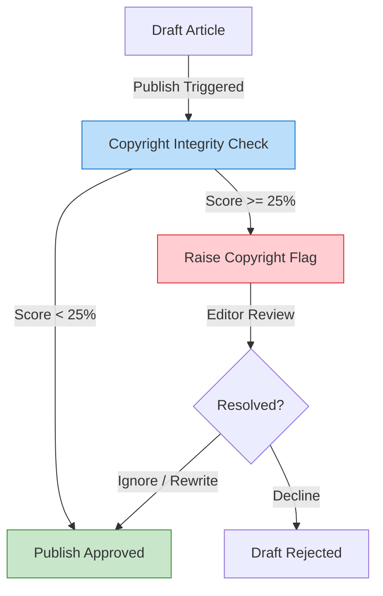

# NewsOps Cloud Legal and Compliance Framework

## Purpose
This document specifies the legal, regulatory, and data compliance architecture for NewsOps Cloud. It outlines the technical patterns required to support GDPR/CCPA subscriber data requests, copyright auditing, plagiarism checks, and DMCA safe harbor protections.

## Executive Summary
Operating an AI-integrated, multi-tenant digital publishing platform requires compliance with data privacy regulations (GDPR/CCPA) and copyright laws. NewsOps Cloud mitigates publisher liability through three key mechanisms:
1. **Source Provenance Tracker**: Cryptographically logs every prompt, scraped URL, and LLM output block to prove content origins.
2. **Privacy Pipeline**: Automates Subject Access Requests (SAR) and "Right to be Forgotten" deletions across PostgreSQL, Redis, and Vector databases.
3. **Intellectual Property Shield**: Automated copyright checks to identify potential plagiarism before articles are published.

## Vision
To build an editorially defensible publishing platform where source transparency is built into the architecture. By tracking the lineage of every paragraph from raw scraper data to the finished article, NewsOps Cloud helps publishers protect themselves against defamation and copyright infringement claims.

## Scope
- **Data Privacy**: GDPR and CCPA compliance for subscriber comments, profiles, and activities.
- **Copyright Protections**: Ingestion checks for crawled source files, plagiarism warnings, and DMCA registry files.
- **AI Safety Regulations**: Aligning metadata logs with the requirements of the EU AI Act.

## Goals
- **Zero Legal Violations**: Achieve a 100% compliance rate on data privacy audit tests.
- **SLA Enforcement**: Complete "Right to be Forgotten" data deletions within 7 days (well within the GDPR 30-day requirement).
- **Audit Speed**: Compile source provenance reports in under 3.0 seconds.

## Functional Requirements
- **GDPR Subject Access Request (SAR) Engine**: Query, compile, and package all data related to a user into a secure ZIP file.
- **Right to be Forgotten Orchestrator**: Delete or anonymize subscriber records across all platform datastores.
- **Plagiarism Engine Integration**: Check drafted content against a database of source articles.
- **Provenance Recorder**: Automatically generate and store cryptographic hashes of prompts and sources.

## Non-Functional Requirements
- **Data Encryption**: Encrypt PII fields (emails, IP addresses, names) at rest using AES-256-GCM.
- **Log Immutability**: Store compliance audit logs in an append-only format, verified with SHA-256 hashes.
- **Query Performance**: Plagiarism checking of a 1,000-word article must complete in under 200ms.

## Business Rules
- **Attribution Rule**: Any article utilizing AI-generated paragraphs must retain links to the source documents used for training or RAG (Retrieval-Augmented Generation).
- **Scribbled Analytics**: Anonymize subscriber IPs and user-agent metadata in analytics databases within 24 hours of capture.
- **Review Threshold**: Block automated publication of articles with a plagiarism score above 25% until reviewed by an editor.

## Actors
- **Subscriber / Reader**: Requests data exports or account deletions.
- **Compliance Officer**: Audits platform tracking logs and responds to legal disputes.
- **Journalist / Editor**: Reviews copyright flags on drafts.
- **Legal Counsel**: Retrieves provenance records during litigation.

## User Stories
- As a Reader, I want to request the complete deletion of my account and comments, so that my personal data is removed from the publisher's databases under GDPR.
- As a Compliance Officer, I want to export a provenance audit log for a contested article, so that we can verify the sources and prompts used during drafting.
- As an Editor, I want to receive a real-time warning if a writer's draft overlaps significantly with a crawled article, so that we can prevent plagiarism before publication.

## Acceptance Criteria
- Subject Access Request exports must compile to a standard JSON layout containing profile details, comment history, and active session listings.
- Data deletion requests must remove all PII from active databases and anonymize historical logs within 7 days.
- Provenance checks must generate a SHA-256 hash containing: `hash(prompt + source_url + output_text)`.

## Workflows
1. **Right to be Forgotten Execution**:
   - Subscriber submits a deletion request.
   - Compliance service logs the request and changes status to `processing`.
   - The system initiates deletion tasks across the main database, Redis cache, and vector store.
   - Script removes PII from the `subscribers` table and anonymizes comments (author changed to `Anonymous`).
   - Task logs completion, registers audit details, and notifies the compliance officer.
2. **Article Provenance Recording**:
   - Writer executes an AI-rewrite task.
   - AI router logs prompt parameters, model version, and crawled source references.
   - The compliance engine generates a hash of this record and saves it in `provenance_records`.
   - The hash is linked to the draft version in PostgreSQL.



## API Design

### Request Subject Access Export
- **Endpoint**: `POST /api/v1/compliance/sar`
- **Headers**: `Content-Type: application/json`, `Authorization: Bearer <JWT>`
- **Request Body**:
```json
{
  "subscriber_email": "reader@example.com",
  "request_type": "export"
}
```
- **Response (202 Accepted)**:
```json
{
  "request_id": "sar_01h8v9c2df9657c1bc7e2d19aa",
  "status": "pending",
  "message": "Subject access request received. Compiling data export package.",
  "created_at": "2026-06-27T22:15:00Z"
}
```

### Check Article Copyright Integrity
- **Endpoint**: `POST /api/v1/compliance/copyright-check`
- **Headers**: `Content-Type: application/json`, `Authorization: Bearer <JWT>`
- **Request Body**:
```json
{
  "article_id": "art_73b52b9-22f9-47f9-82ee-fdcce2856f2c",
  "content_text": "NewsOps Cloud is a next-generation publishing system..."
}
```
- **Response (200 OK)**:
```json
{
  "article_id": "art_73b52b9-22f9-47f9-82ee-fdcce2856f2c",
  "plagiarism_score": 0.12,
  "status": "passed",
  "matched_sources": [
    {
      "url": "https://techchronicle.com/newsops-launch",
      "overlap_percentage": 0.12
    }
  ]
}
```

## Database Design
To manage legal auditing, data privacy requests, and copyright checks, the following schemas are used:

```sql
CREATE TABLE provenance_records (
    id UUID PRIMARY KEY DEFAULT gen_random_uuid(),
    article_id UUID NOT NULL,
    model_provider VARCHAR(100) NOT NULL, -- e.g., 'openai', 'gemini'
    model_version VARCHAR(100) NOT NULL,
    prompt_text TEXT NOT NULL,
    generated_text TEXT NOT NULL,
    source_metadata JSONB DEFAULT '{}'::jsonb, -- Array of source URLs, crawl timestamps
    record_hash CHAR(64) NOT NULL, -- SHA-256 checksum
    created_at TIMESTAMP WITH TIME ZONE DEFAULT CURRENT_TIMESTAMP
);

CREATE TABLE sar_requests (
    id UUID PRIMARY KEY DEFAULT gen_random_uuid(),
    subscriber_id UUID NOT NULL,
    request_type VARCHAR(50) NOT NULL, -- 'export', 'delete'
    status VARCHAR(50) NOT NULL DEFAULT 'pending', -- 'pending', 'processing', 'completed', 'failed'
    completed_at TIMESTAMP WITH TIME ZONE,
    created_at TIMESTAMP WITH TIME ZONE DEFAULT CURRENT_TIMESTAMP
);

CREATE TABLE copyright_flags (
    id UUID PRIMARY KEY DEFAULT gen_random_uuid(),
    article_id UUID NOT NULL,
    score NUMERIC(5, 2) NOT NULL,
    details JSONB NOT NULL,
    reviewer_id UUID,
    resolution VARCHAR(50) DEFAULT 'unresolved', -- 'unresolved', 'ignored', 'rewritten'
    resolved_at TIMESTAMP WITH TIME ZONE,
    created_at TIMESTAMP WITH TIME ZONE DEFAULT CURRENT_TIMESTAMP
);

CREATE INDEX idx_provenance_article ON provenance_records(article_id);
CREATE INDEX idx_sar_subscriber ON sar_requests(subscriber_id);
```

## UI Design
- **Compliance Center**: Dashboard displaying pending GDPR requests, active audit warnings, and copyright flags.
- **Article Warnings Banner**: Alert banner displaying plagiarism risks directly inside the collaborative editor workspace.
- **Data Export Portal**: Secure interface where readers authenticate to download their personal data packages.

## Permissions
- `compliance:read`: Access compliance dashboard and export audit files.
- `compliance:write`: Update copyright resolutions and clear editorial flags.
- `data:delete`: Perform deletion actions across workspaces and databases.

## Security
- **PII Encryption**: Store emails, phone numbers, and profile details using cryptographic envelope encryption keys.
- **Audit Log Verification**: Maintain an independent system service to verify SHA-256 hashes of compliance tables.
- **Rate Limiting**: Limit SAR submission endpoints to 1 request per user per day to prevent system resource drain.

## Performance
- **SAR Processing**: Compile data files asynchronously using lower priority task queues.
- **Overlapping Ingestion**: Use indexing on web crawled content tables to search text overlays within 200ms.

## Monitoring
- Prometheus Metric: `newsops_compliance_sar_total{type="delete"}`
- Prometheus Metric: `newsops_copyright_flags_triggered_total`
- Alert Rule: Send alarm to legal team if `sar_requests_pending_duration_days > 7`.

## Logging
Detailed JSON compliance tracking records are required:
```json
{
  "timestamp": "2026-06-27T22:15:30Z",
  "level": "WARN",
  "context": "compliance_service",
  "message": "High plagiarism risk detected during pre-publication check",
  "meta": {
    "article_id": "art_73b52b9-22f9-47f9-82ee-fdcce2856f2c",
    "score": 0.42,
    "matched_source": "https://externalpress.com/story-draft-url"
  }
}
```

## Error Handling
- **GDPR SLA Exception**: If a deletion fails to complete within 5 days, a ticket is routed to compliance administration.
- **Source Verification Timeout**: If the plagiarism check times out, the draft status changes to `pending_verification` instead of passing automatically.

## Edge Cases
- **Archived Comments**: GDPR requests require removing names and emails, but comments are retained and anonymized to keep conversational threads readable.
- **Sync Failures**: If the vector DB is offline during a deletion request, the job is queued in a persistent dead-letter queue for retry.

## Future Improvements
- Cryptographic proof generation on a decentralized ledger for verification of investigative reporting sources.
- Smart contracts mapping to licenses for automated copyright royalty payouts.

## Mermaid Diagrams


## References
- [Business Directory Index](./index.md)
- [Monetization Strategy Technical Design](./monetization_strategy.md)
- [Database Schema Blueprint](../03-database/index.md)
