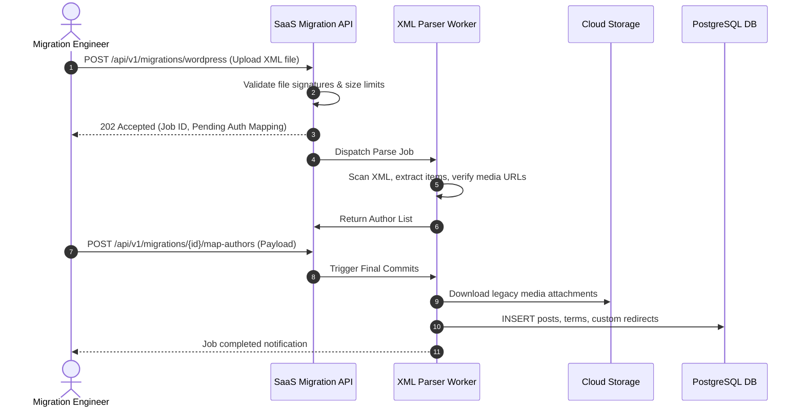
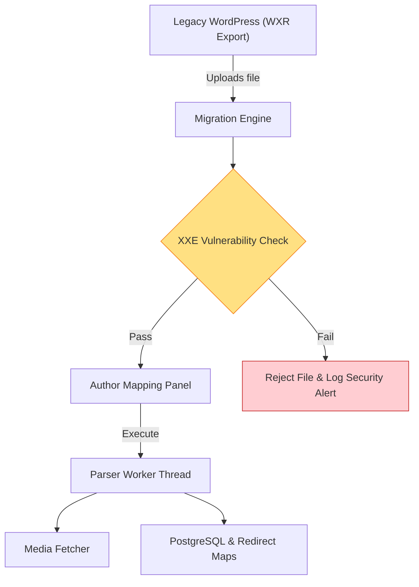

# NewsOps Cloud Market Analysis

## Purpose
This document analyzes the digital publishing competitive landscape, detailing the limitations of legacy Content Management Systems (CMS) and independent AI writing assistants. It establishes the positioning of NewsOps Cloud and specifies the migration adapters needed to ingest content from platforms like WordPress and Drupal.

## Executive Summary
The digital media landscape is split between traditional, non-intelligent CMS platforms (e.g. WordPress, Drupal) and standalone AI generation tools (e.g. Jasper, Copy.ai). Traditional CMSs rely on complex plugin stacks that degrade security and performance. Standalone AI utilities lack publishing workflows, search verification, and multi-channel publication pipelines. NewsOps Cloud fills this gap by offering a headless, AI-orchestrated digital publishing OS that automates the news lifecycle from discovery to social distribution.

## Vision
To establish NewsOps Cloud as the standard operating environment for modern media. By integrating fact-checking models, collaborative editing workspace grids, and a multi-provider LLM router, the platform eliminates the need for copy-pasting across isolated systems, enabling journalists to write and verify content securely within one environment.

## Scope
- **Analyzed Competitors**: Legacy monolithic CMS (WordPress, Drupal), Headless CMS (Contentful, Strapi), and AI Copilots (Jasper, Copy.ai).
- **Positioning Focus**: Multi-tenant scalability, native credit-metered AI integration, source citation tracing, and omni-channel automation.
- **Migration Pipeline Scope**: Ingestion of WordPress Extended RSS (WXR) XML structures and Drupal SQL schema files.

## Goals
- **Workflow Reduction**: Reduce steps required to draft, fact-check, optimize, and syndicate stories by 60%.
- **Migration Ease**: Enable a WordPress-to-NewsOps migration to be completed in < 15 minutes for databases under 50,000 articles.
- **Adoption Cost**: Lower monthly operational plugin maintenance costs for newsrooms by 80%.

## Functional Requirements
- **WXR Content Importer**: Parse and ingest WordPress XML exports, mapping categories, tags, pages, posts, and metadata.
- **Media Downloader Service**: Fetch, optimize, and store historical attachments into the cloud asset manager.
- **Redirection Manager**: Automatically write 301 redirection maps for SEO page continuity.
- **Author Mapping Grid**: Map legacy user records to NewsOps workspace user entities.

## Non-Functional Requirements
- **Importer Performance**: Process and write legacy posts at a rate of > 100 posts per second.
- **Secure XML Parsing**: Disable inline DTD processing to protect against XML External Entity (XXE) vulnerabilities.
- **Asset Resiliency**: Media downloader must handle remote network drops with exponential backoff retries.

## Business Rules
- **No Duplicate Slugs**: If a legacy post slug conflicts with an active post, the importer must append a chronological suffix (e.g. `-v2`).
- **Unverified Media Fallback**: If an external image URL fails to resolve after 5 retry attempts, it must be logged and replaced with a default system media placeholder.
- **SEO Title Preservation**: Meta descriptions and SEO titles from legacy databases must be saved in post metadata fields.

## Actors
- **Media CTO**: Evaluates market advantages and initiates platform-wide migration scripts.
- **Migration Engineer**: Configures XML mappings and resolves database import conflicts.
- **Newsroom Manager**: Monitors the speed and coverage of content ingestion jobs.

## User Stories
- As a Media CTO, I want to import our entire WordPress catalog of 100,000 articles using an automated script, so that we can shut down our legacy servers without losing organic search traffic.
- As a Migration Engineer, I want to map legacy authors to our new workspace team roles, so that all historical content maintains proper writer bylines.
- As a Newsroom Manager, I want the importer to extract legacy image URLs and save them directly in the asset manager database, so that our media archive remains intact.

## Acceptance Criteria
- The WXR XML parser must reject files containing custom DOCTYPE declarations to block entity resolution exploits.
- Redirection maps must automatically log legacy URL structures to prevent organic search degradation.
- The author mapping interface must show all unassigned authors and block migration execution if roles remain unallocated.

## Workflows
1. **Migration Execution**:
   - Migration Engineer uploads the WordPress WXR XML file to the platform.
   - The platform starts an asynchronous migration job, returning a tracking ID.
   - The XML parser extracts posts, terms, and attachments.
   - The system displays the Author Mapping Grid.
   - The engineer maps legacy profiles to active user IDs.
   - The background queue writes the documents to PostgreSQL and downloads media assets.



## API Design

### Initiate WordPress Import
- **Endpoint**: `POST /api/v1/migrations/wordpress`
- **Headers**: `Content-Type: multipart/form-data`, `Authorization: Bearer <JWT>`
- **Form Data**:
  - `file`: `<WXR XML file binary>`
  - `workspace_id`: `"w53b52b9-22f9-47f9-82ee-fdcce2856f2d"`
- **Response (202 Accepted)**:
```json
{
  "job_id": "job_01h8v9a2bf8547a1bc7e2d19f2",
  "status": "parsing",
  "extracted_posts_count": 0,
  "authors_detected": [],
  "created_at": "2026-06-27T22:13:00Z"
}
```

### Complete Author Mapping
- **Endpoint**: `POST /api/v1/migrations/{id}/map-authors`
- **Headers**: `Content-Type: application/json`, `Authorization: Bearer <JWT>`
- **Request Body**:
```json
{
  "mappings": [
    {
      "legacy_username": "john_doe_wp",
      "target_user_id": "u13b52b9-22f9-47f9-82ee-fdcce2856f2c"
    },
    {
      "legacy_username": "admin_wp",
      "target_user_id": "u98b52b9-22f9-47f9-82ee-fdcce2856f9f"
    }
  ]
}
```
- **Response (200 OK)**:
```json
{
  "job_id": "job_01h8v9a2bf8547a1bc7e2d19f2",
  "status": "processing",
  "message": "Author mapping verified. Migration processing in progress."
}
```

## Database Design
To handle content ingestion and migration workflows, the following tables are defined:

```sql
CREATE TABLE migration_jobs (
    id UUID PRIMARY KEY DEFAULT gen_random_uuid(),
    workspace_id UUID NOT NULL,
    source_platform VARCHAR(50) NOT NULL, -- 'wordpress', 'drupal'
    status VARCHAR(50) NOT NULL DEFAULT 'uploaded', -- 'uploaded', 'parsing', 'pending_mapping', 'processing', 'completed', 'failed'
    total_records INT DEFAULT 0,
    processed_records INT DEFAULT 0,
    log_file_url VARCHAR(512),
    created_at TIMESTAMP WITH TIME ZONE DEFAULT CURRENT_TIMESTAMP,
    updated_at TIMESTAMP WITH TIME ZONE DEFAULT CURRENT_TIMESTAMP
);

CREATE TABLE legacy_redirects (
    id UUID PRIMARY KEY DEFAULT gen_random_uuid(),
    workspace_id UUID NOT NULL,
    legacy_url_path VARCHAR(512) NOT NULL,
    target_slug VARCHAR(255) NOT NULL,
    created_at TIMESTAMP WITH TIME ZONE DEFAULT CURRENT_TIMESTAMP,
    CONSTRAINT unique_workspace_legacy_url UNIQUE(workspace_id, legacy_url_path)
);

CREATE INDEX idx_migration_jobs_workspace ON migration_jobs(workspace_id);
CREATE INDEX idx_legacy_redirects_lookup ON legacy_redirects(workspace_id, legacy_url_path);
```

## UI Design
- **Upload File Dropzone**: Drag-and-drop boundary with progress bar and file validation.
- **Author Configuration Matrix**: Table layout with left column showing legacy author names, and right column with user selectors for resolving roles.
- **Migration Terminal Console**: Log console streaming JSON output and record progress indicators.

## Permissions
- `migrations:write`: Access migration creation endpoints.
- `migrations:read`: View migration jobs and retrieve progress logs.

## Security
- **XXE Prevention**: Strict configuration of the XML parser to block external reference resolution:
  ```python
  parser = etree.XMLParser(resolve_entities=False, no_network=True)
  ```
- **File Validation**: Restrict file type uploads to `.xml` and `.sql` and maximum size to 2GB.
- **Media Download Validation**: Enforce that downloaded media URLs match valid image/video file extensions and block requests targeting internal hostnames.

## Performance
- **Database Inserts**: Batch INSERT queries of 500 records to limit transactional overhead on Neon PostgreSQL.
- **Concurrency**: Run media downloads using pools of 20 async workers to minimize network delays.
- **Redirection Check Latency**: Redis caching of `legacy_redirects` matches to verify routes in < 2ms.

## Monitoring
- Prometheus Metric: `newsops_migration_duration_seconds{platform="wordpress"}`
- Prometheus Metric: `newsops_migration_imported_items_total`
- Alert Rule: Alert slack channel if `migration_job_failures_total > 5` in 1 hour.

## Logging
Migration jobs require detailed audit traces:
```json
{
  "timestamp": "2026-06-27T22:13:40Z",
  "level": "INFO",
  "context": "migration_service",
  "job_id": "job_01h8v9a2bf8547a1bc7e2d19f2",
  "message": "Migration record parsed successfully",
  "meta": {
    "legacy_id": 4022,
    "title": "Investigative Report On Tech Ecosystems",
    "status": "imported",
    "attachments_count": 4
  }
}
```

## Error Handling
- **Malformed XML (400 Bad Request)**: Triggered when parsing fails due to syntax errors in the source file.
- **Mapping Mismatch (422 Unprocessable Entity)**: Returned if targeted user mapping profiles do not exist in the workspace.

## Edge Cases
- **Self-Referential Links**: Links within WordPress pointing to the legacy domain must be rewritten during ingestion using target organization variables.
- **Shortcode Ingestion**: Legacy shortcodes (e.g. `[gallery]`) are extracted and wrapped in compatibility block fields to prevent page breaking on output.

## Future Improvements
- Automated translation engine mapping legacy custom fields directly to structured JSON attributes.
- Dynamic web scrapper import interface for platforms that lack database exports.

## Mermaid Diagrams


## References
- [Business Directory Index](./index.md)
- [Monetization Strategy Technical Design](./monetization_strategy.md)
- [Database Schema Blueprint](../03-database/index.md)
