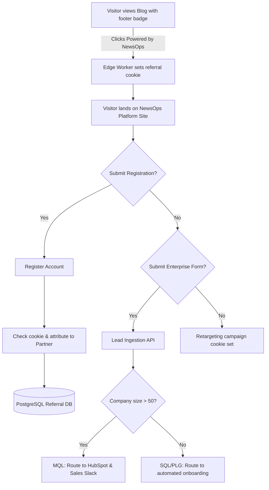

# Marketing and Acquisition Strategy
## Purpose
This document outlines the marketing methodology, target niches, user acquisition loops, and sales pipelines for NewsOps Cloud. It details the programmatic systems and platform features designed to drive viral sign-ups, organic traffic growth, and enterprise conversions.

## Executive Summary
NewsOps Cloud uses a product-led growth (PLG) model combined with targeted B2B enterprise sales. We target three core niches: Independent Publishers & Substack writers, Mid-Market Digital Media Outlets, and Corporate PR & Communications teams. Acquisition relies on three primary loops: Programmatic Content Hubs (SEO-optimized resource templates), Guest Post publishing engines, and Custom Domain Referrals (viral badges on free tenant sites). Lead generation flows automatically into a tiered sales funnel, where prospects are nurtured from initial contact to active trial and enterprise agreement.

## Vision
To establish NewsOps Cloud as the default publishing platform for creators and corporate communications by turning published content into an engine for user acquisition.

## Scope
The scope of this strategy includes:
- **Product-Led Growth (PLG) Loops**: Custom domain referrers, "Powered by NewsOps" dashboard integrations, and sharing systems.
- **Affiliate and Partner Marketing**: Payout frameworks, links tracking, and partner portal metrics.
- **Programmatic SEO & Content Hubs**: Auto-generation of documentation, media templates, and news taxonomy landing pages.
- **Sales Funnel and Lead Management**: CRM APIs, automated lead scoring, and trial outreach triggers.

## Goals
1. Achieve a virality coefficient (K-factor) of >= 2.5% for all Free tier publishing instances.
2. Generate 100,000 monthly organic search sessions via programmatic SEO content hubs within 12 months.
3. Convert at least 15% of Free tier users to Pro plans using in-app feature prompts and contextual billing upgrades.
4. Scale corporate lead response times to less than 15 minutes through automated webhook distribution to B2B CRM systems.

## Functional Requirements
- **Viral Referral Badges**: Enforced rendering of customizable referral tags in the footer of all websites hosted under Free plans.
- **Affiliate Campaign Tracking**: System for generating tracking codes, attributing sign-ups, and computing commissions.
- **Dynamic Programmatic SEO Pages**: Templates that render news analytics, trends, and formatting guides to capture search traffic.
- **Lead Capture and Routing Engine**: Contact forms that send lead details to CRM platforms (HubSpot/Salesforce) and trigger Slack alerts.
- **In-App Upgrade Triggers**: Popups and feature lock overlays appearing when users interact with gated Pro/Enterprise capabilities.

## Non-Functional Requirements
- **Page Load Latency**: Programmatic SEO landing pages must load in under 800ms (FCP) to maximize search ranking metrics.
- **Attribution Reliability**: Cookies for referral tracking must persist for 60 days, operating across subdomains.
- **CRM Integration Sync**: Webhook synchronization of new leads to CRM platforms must resolve within 5 seconds of form submission.
- **Visual Responsiveness**: Gated features must present clean, fast-loading modal options without causing layout shifts.

## Business Rules
1. **Custom Domain Referrers**: Sites hosted on the Free tier must display a footer badge stating "Powered by NewsOps". Removing or hiding this badge requires upgrading to the Pro plan.
2. **Affiliate Program Terms**:
   - 20% recurring monthly payout for the first 12 months of any referred customer's subscription.
   - Payouts occur on the 15th of each month for earnings that have passed a 30-day refund clearance window.
   - Self-referrals (signing up using one's own link) are prohibited and monitored by fraud detection systems.
3. **Enterprise Lead Classification**:
   - *Marketing Qualified Lead (MQL)*: Any user from an organization with >50 employees downloading an editorial strategy guide.
   - *Sales Qualified Lead (SQL)*: An MQL request for a custom demo, or an account exceeding 100 drafts on a Free tier plan.

## Actors
- **Content Reader**: A public visitor reading a news article on a tenant's blog who interacts with the referral badge.
- **Affiliate Partner**: A marketing professional driving sign-ups via custom tracking links.
- **Sales Representative**: A NewsOps staff member who contacts high-volume prospects.
- **System Marketing Daemon**: Runs SEO generation schedules and handles lead routing tasks.

## User Stories
### Story 1: Viral Badge Referral
As a **Content Reader** browsing a tech blog hosted on NewsOps, I want to click the footer badge to learn about the platform and sign up for my own account with my referrer automatically attributed.
### Story 2: Managing Affiliate Commissions
As an **Affiliate Partner**, I want to log into a partner portal and view my click-through rates, active sign-ups, pending commissions, and historical payouts so that I can optimize my promotional campaigns.
### Story 3: Enterprise Lead Escalation
As a **Sales Representative**, I want to receive an instant Slack notification when a publisher from a large media firm runs a trial upgrade check so that I can reach out to offer them dedicated enterprise resources.

## Acceptance Criteria
1. **Footer Badge Enforce**: The platform's template rendering system must check the tenant's plan status at compile-time and block build deployment if a Free plan site has removed the `newsops-referral-footer` tag.
2. **Attribution Cookie Integrity**: The referral tracking script must set a secure, SameSite=Lax cookie containing the referrer ID. This cookie must persist for 60 days unless overwritten by a newer referral link.
3. **Automated MQL Routing**: Upon submitting a contact request, if the user's email domain corresponds to a corporate domain with >50 employees, the system must trigger a HubSpot contact sync within 5 seconds.
4. **Affiliate Commission Validation**: The system must run a monthly ledger audit to cross-reference transactions, verify zero chargebacks, and approve payouts for matching affiliate accounts.

## Workflows
1. **Visitor Acquisition & Lead Conversion**:
   - A reader visits a tenant's blog and clicks the "Powered by NewsOps" footer badge.
   - The browser lands on `newsops.com/?ref=tenant_id` and sets a tracking cookie.
   - The visitor reads the programmatic SEO page explaining newsroom tools.
   - The visitor signs up for a Free account.
   - The attribution service registers the signup, link performance metrics are updated, and the partner gets credited.
   - At month-end, the tenant upgrades to the Pro tier ($149/mo).
   - The partner is awarded a $29.80 credit in the affiliate ledger.

2. **Lead Routing and Pipeline Triage**:
   - A prospect submits a request via the "Contact Sales" form.
   - The lead capture API receives the data and executes a reverse-IP lookup to identify corporate size and location.
   - If the firm is classified as an enterprise target:
     - The lead is pushed to HubSpot.
     - A Slack alert is dispatched to the enterprise sales channel.
     - An automated scheduler invites the prospect to select a demo meeting time.
   - If the firm is below target size:
     - The lead is added to an automated email marketing drip campaign.
     - An automated onboarding assistant guides them toward starting a standard Pro trial.

## API Design

### 1. Capture Leads from Marketing Forms
Ingest marketing leads, parse coordinates, and route to internal queues and CRMs.
- **Endpoint**: `POST /api/v1/marketing/leads`
- **Headers**:
  - `Content-Type: application/json`
- **Request Payload**:
```json
{
  "full_name": "Sarah Jenkins",
  "email": "sarah.jenkins@hearstmedia.com",
  "company_name": "Hearst Communications",
  "phone": "+1-555-0199",
  "estimated_monthly_crawls": 15000,
  "lead_source": "custom_domain_referral",
  "referring_tenant_id": "org_5510294-b",
  "utm_parameters": {
    "utm_source": "footer_badge",
    "utm_medium": "referral",
    "utm_campaign": "viral_growth_loop"
  }
}
```
- **Response Payload (`201 Created`)**:
```json
{
  "lead_id": "led_3319024-f",
  "status": "QUALIFIED_MQL",
  "routed_to": "HubSpot Enterprise Queue",
  "created_at": "2026-06-27T22:25:00Z"
}
```

### 2. Retrieve Affiliate Dashboard Statistics
Fetch campaign performance logs, clicks, signups, and commission details.
- **Endpoint**: `GET /api/v1/marketing/affiliates/{partner_id}/stats`
- **Headers**:
  - `Authorization: Bearer <JWT>`
- **Response Payload (`200 OK`)**:
```json
{
  "partner_id": "prt_4410294-m",
  "referral_code": "NEWSROOMPRO",
  "metrics": {
    "total_clicks": 14200,
    "total_signups": 840,
    "active_customers": 92,
    "conversion_rate_percentage": 5.92
  },
  "earnings": {
    "pending_clearance_usd": 420.50,
    "available_payout_usd": 1280.00,
    "historical_payouts_usd": 15400.00
  },
  "recent_signups": [
    {
      "signup_date": "2026-06-26T18:40:00Z",
      "status": "TRIAL",
      "projected_commission_usd": 0.00
    },
    {
      "signup_date": "2026-06-20T11:15:00Z",
      "status": "PAID_PRO",
      "projected_commission_usd": 29.80
    }
  ]
}
```

## Database Design
```sql
-- Affiliate partner account data
CREATE TABLE affiliate_partners (
    id UUID PRIMARY KEY DEFAULT gen_random_uuid(),
    user_id UUID UNIQUE NOT NULL REFERENCES auth_users(id) ON DELETE CASCADE,
    referral_code VARCHAR(50) UNIQUE NOT NULL,
    paypal_or_payout_email VARCHAR(255) NOT NULL,
    status VARCHAR(50) NOT NULL DEFAULT 'ACTIVE', -- ACTIVE, SUSPENDED, PENDING_REVIEW
    created_at TIMESTAMP WITH TIME ZONE DEFAULT CURRENT_TIMESTAMP
);

CREATE INDEX idx_affiliates_code ON affiliate_partners(referral_code);

-- Signups and leads tracking table
CREATE TABLE marketing_referral_logs (
    id UUID PRIMARY KEY DEFAULT gen_random_uuid(),
    referrer_partner_id UUID REFERENCES affiliate_partners(id) ON DELETE SET NULL,
    referred_organization_id UUID UNIQUE REFERENCES tenant_organizations(id) ON DELETE SET NULL,
    cookie_token VARCHAR(255) NOT NULL,
    utm_source VARCHAR(100),
    utm_medium VARCHAR(100),
    utm_campaign VARCHAR(100),
    click_timestamp TIMESTAMP WITH TIME ZONE NOT NULL,
    signup_timestamp TIMESTAMP WITH TIME ZONE DEFAULT CURRENT_TIMESTAMP
);

CREATE INDEX idx_referrals_partner ON marketing_referral_logs(referrer_partner_id);

-- Sales Leads pipeline for enterprise deals
CREATE TABLE sales_leads (
    id UUID PRIMARY KEY DEFAULT gen_random_uuid(),
    full_name VARCHAR(150) NOT NULL,
    email VARCHAR(255) NOT NULL,
    company_name VARCHAR(255) NOT NULL,
    lead_score INT DEFAULT 0,
    status VARCHAR(50) NOT NULL DEFAULT 'NEW', -- NEW, MQL, SQL, CONTACTED, TRIAL_DEMO, CLOSED_WON, CLOSED_LOST
    crm_integration_id VARCHAR(255),
    assigned_sales_rep UUID,
    created_at TIMESTAMP WITH TIME ZONE DEFAULT CURRENT_TIMESTAMP,
    updated_at TIMESTAMP WITH TIME ZONE DEFAULT CURRENT_TIMESTAMP
);

CREATE INDEX idx_sales_leads_score ON sales_leads(lead_score DESC);
CREATE INDEX idx_sales_leads_status ON sales_leads(status);
```

## UI Design
Marketing configurations and analytics are rendered in the partner workspace:
1. **Partner Portal Dashboard**:
   - Graphic metrics blocks displaying **Clicks**, **Free Signups**, **Paid Upgrades**, and **Commission Balance**.
   - A copy-to-clipboard widget showing the partner's referral URL: `https://newsops.com/ref?code=NEWSROOMPRO`.
   - A billing panel showing past payouts, payout method fields, and minimum transfer thresholds.
2. **Lead Intake Form Component**:
   - Styled fields for email, company name, and publishing volume, matching CSS design system tokens.
   - Validation states: invalid email syntax highlights red; successful submission reveals a calendar scheduler directly on-page.
3. **Footer Referral Customizer**:
   - Available to Pro subscribers who want to display their referral badges on their sites to generate extra income.
   - Toggle selectors let publishers position the badge (bottom-left, bottom-center, bottom-right) and style its background (light, dark, system-default).

## Permissions
- `marketing:campaigns:write`: Admin permission to design and publish programmatic SEO templates.
- `affiliates:payouts:approve`: Finance department permission to authorize monthly commission payments.
- `leads:read`: Access to sales lead spreadsheets and pipeline databases.
- `leads:write`: Create or update sales lead pipelines.

## Security
- **Anti-Self-Referral Validation**: Signup checking algorithms compare billing cards, hardware finger-prints, and network IPs to block users from claiming commissions on their own accounts.
- **CSRF Token Guards**: All lead capture endpoints enforce CSRF checking to prevent bot spam.
- **Input Sanitization**: Lead form inputs are sanitized to block XSS payloads or SQL injections.

## Performance
- **Edge Cache Redirection**: Referral links are resolved at CDN Edge Nodes (e.g., Cloudflare Workers) in less than 50ms, setting cookies and redirecting visitors without hitting origin database architectures.
- **Programmatic SEO Pre-Rendering**: Dynamic landing pages are pre-compiled and served from S3 static locations, achieving sub-500ms TTFB metrics.
- **Async Lead Shipping**: Leads submitted through forms are buffered in Redis queues, allowing rapid page transitions for users while sending CRM updates in background worker tasks.

## Monitoring
### Prometheus Metrics
- `newsops_referral_signups_total`: Counter, tracks sign-ups attributed to partners or domain links.
- `newsops_conversion_funnel_ratio`: Gauge, monitors lead conversion rates across stages.
- `newsops_acquisition_cost_usd`: Gauge, tracks cumulative spending vs paid conversions.

### Alerting Rules
- **ReferralFraudSpike**: Alert if more than 50 signups occur from the same IP network using a single affiliate link within 1 hour.
- **CRMIntegrationOutage**: Alert if lead delivery webhooks fail continuously for 15 minutes.

## Logging
- **Log Format**: JSON.
- **Log Levels**:
  - `INFO`: Valid referrals, cookie registrations, and form submissions.
  - `WARN`: High-frequency clicks from single IPs (potential bots).
  - `ERROR`: CRM synchronization timeouts or database ledger calculation failures.
- **Log Context**: Includes `partner_id`, `referred_org_id`, `lead_status`, `utm_source`, and `client_ip`.

## Error Handling
| Input/System Error Code | HTTP Status | Customer-Facing Message |
| :--- | :--- | :--- |
| `REFERRAL_EXPIRED` | 400 Bad Request | "This referral program campaign code has expired." |
| `INVALID_CAMPAIGN` | 422 Unprocessable | "The provided tracking code format is invalid." |
| `AFFILIATE_BLOCKED` | 403 Forbidden | "This affiliate account is suspended due to policy violations." |
| `LEAD_SUBMISSION_TIMEOUT` | 504 Gateway Timeout | "The contact system is busy. Your request is buffered and will process shortly." |

## Edge Cases
- **Adblockers Blocking Tracking Cookies**: If a reader's browser blocks the marketing script, cookies cannot be set. Mitigation: The platform uses first-party subdomains (e.g., `analytics.newsops.com`) to bypass third-party cookie restrictions.
- **Concurrent Referrer Hits**: If a reader clicks multiple different partner links, the system credits the *last click* within the 60-day window.
- **Duplicate Lead Ingestion**: If a customer fills out the contact form multiple times, the system matches their email address and merges the activities into a single CRM contact history.

## Future Improvements
1. **Machine Learning Lead Scoring**: Run AI engines on leads to forecast trial-to-paid conversion probability, routing high-score deals directly to experienced sales reps.
2. **Dynamic Landing Page Personalization**: Personalize homepage messaging based on the referrer's publisher type (e.g., displaying newsletter stats for writers, API scales for tech firms).
3. **Automated Payout Rails**: Integrate Wise or Stripe Connect to automate international affiliate payouts directly to banking networks.

## Mermaid Diagrams


## References
- System Subscriptions API Specs: [../09-api/subscriptions.md](../09-api/subscriptions.md)
- SaaS Metrics System: [../08-saas/telemetry.md](../08-saas/telemetry.md)
- Global CDN Router Layouts: [../11-devops/cdn.md](../11-devops/cdn.md)
- Database Core Models: [../03-database/core_schemas.md](../03-database/core_schemas.md)
