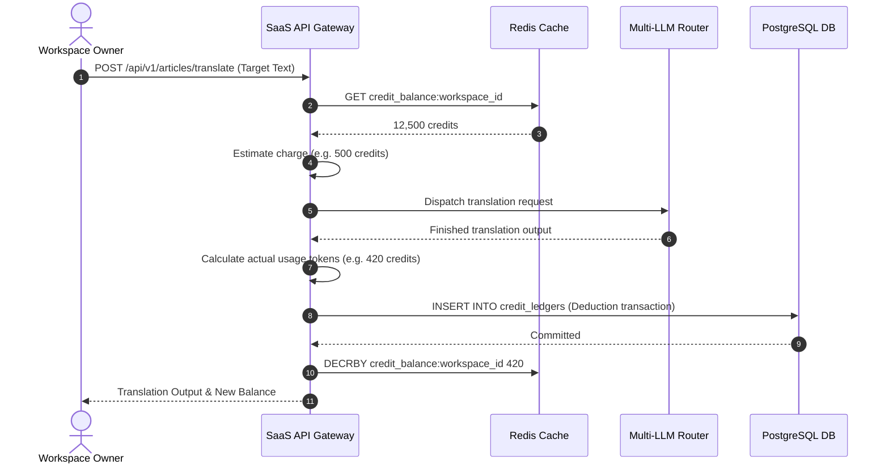
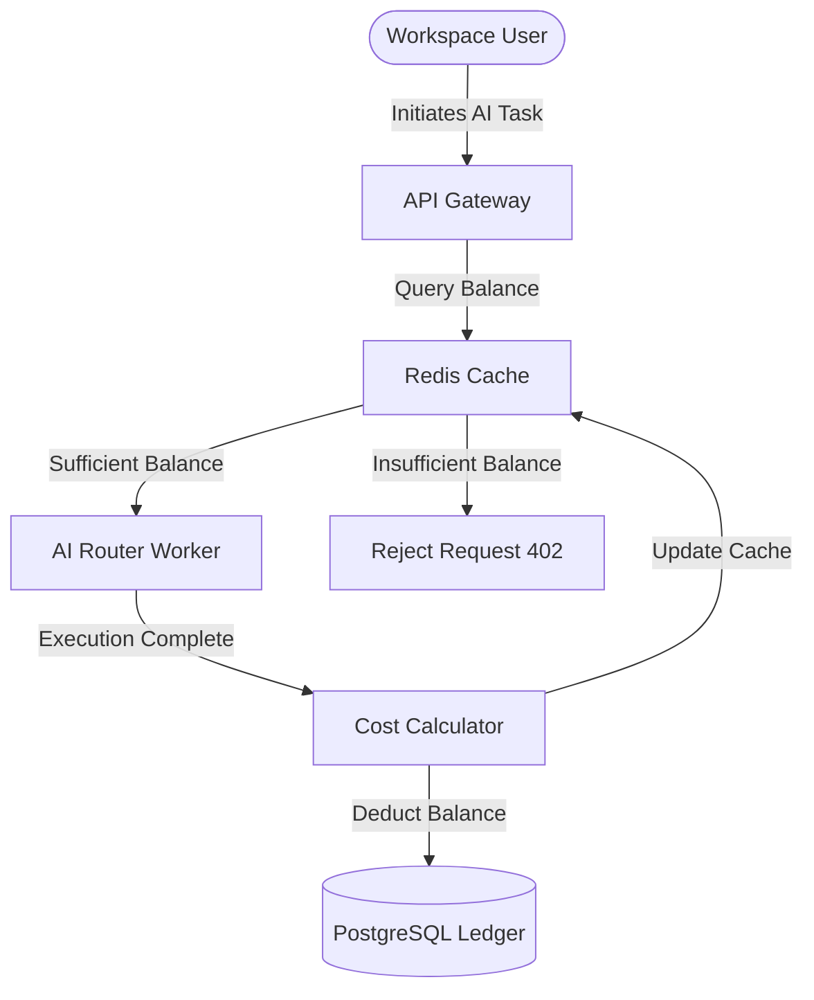

# NewsOps Cloud Monetization Strategy

## Purpose
This document details the financial architecture, billing tiers, metered AI credit mechanics, API fees, and developer marketplace revenue models for NewsOps Cloud. It outlines the technical systems required to charge tenants and pay out marketplace developers.

## Executive Summary
NewsOps Cloud employs a multi-faceted monetization model designed to capture revenue from workspaces of all sizes. The model comprises:
1. **Subscription Tiers**: SaaS tiers (Free, Pro, Enterprise) regulating user seat limits, storage, and feature availability.
2. **AI Credits**: A consumption-based credit model for calling LLMs, translation, and media processors.
3. **API Keys**: Usage fees for headless API usage.
4. **Marketplace Share**: A platform commission (20%) on third-party plugin sales.
All financial events are logged to an append-only ledger synchronized with Stripe.

## Vision
To establish a cost-predictive, zero-waste billing system. Publishers only pay for the computational power they use, avoiding expensive flat-rate packages, while developers are incentivized to build plugins for the NewsOps ecosystem via a transparent 80/20 revenue distribution split.

## Scope
- **Subscription Billing**: Monthly/annual recurring billing engine via Stripe Billing.
- **Computational Metering**: Real-time tracking of AI token routing, translation characters, and image extraction.
- **Marketplace Ledger**: Billing models for third-party developer integrations, plugins, and custom scrapers.

## Goals
- **System Uptime**: 100% availability of the billing gateway and webhook processing pipeline.
- **Transaction Consistency**: Guaranteed ACID transactional safety across all ledger records.
- **Billing Latency**: Less than 10ms database verification overhead per metered request.

## Functional Requirements
- **Stripe Webhook Handler**: Process subscription renewals, card updates, and checkout events.
- **Credit Balance Manager**: Allocate, deduct, and track balances.
- **Add-On Purchase Engine**: Self-service credit purchase portal.
- **Seller Payout Manager**: Orchestrate Stripe Connect transfers for marketplace developers.

## Non-Functional Requirements
- **Precision**: Store currency values in the database using 6-decimal-place precision (`NUMERIC(12, 6)`).
- **Scale**: Metering gateway must support up to 5,000 credit checks/deductions per second.
- **Auditability**: Lock history entries to prevent modification of previous ledger states.

## Business Rules
- **Free Plan Quota**: Capped at 3 users, 1 workspace, and 2,000 monthly credits. Unused credits expire.
- **Pro Plan Rollover**: Capped at 50,000 monthly credits. Unused purchased add-on credits roll over indefinitely, whereas plan credits do not.
- **Marketplace Splits**: Creators receive 80% of purchase costs, and the platform retains 20%.

## Actors
- **Workspace Owner**: Pays subscriptions, checks usage, and purchases credits.
- **Third-Party Developer**: Publishes plugins, sets prices, and tracks earnings.
- **Stripe Engine**: Communicates external payment completions to NewsOps.
- **Finance Auditor**: Audits ledger consistency and verifies earnings statements.

## User Stories
- As a Workspace Owner, I want my monthly subscription credits to deposit automatically at the start of each billing cycle, so that our team's AI-assisted publishing does not pause.
- As a Developer, I want to connect my Stripe account to the platform, so that I can automatically receive my monthly 80% commission payouts.
- As a Workspace Owner, I want to enable auto-recharging on our credit balance, so that our automated news ingestion keeps working during high-traffic breaking stories.

## Acceptance Criteria
- Billing cycles must run on a strict 30-day cron, and credit allocations must match plan definitions.
- Balance audits must cross-reference Stripe checkouts with ledger inputs, triggering an alert on mismatch.
- Payout calculations must use PostgreSQL transaction locks to ensure zero duplicate payment transfers.

## Workflows
1. **Subscription Upgrading**:
   - Owner selects Pro plan in the dashboard.
   - Portal redirects to Stripe Checkout.
   - User completes payment; Stripe dispatches a `customer.subscription.updated` webhook.
   - SaaS engine parses webhook, validates signature, modifies subscription record in PostgreSQL, and credits the ledger.
2. **AI Action Metering**:
   - Editor triggers translation.
   - API gateway verifies token and reads balance from Redis.
   - If balance > cost, request is routed to the AI router.
   - AI router completes translation, calculates final credit cost, and commits deduction to database and Redis.



## API Design

### Modify Subscription Plan
- **Endpoint**: `POST /api/v1/billing/subscriptions/change`
- **Headers**: `Content-Type: application/json`, `Authorization: Bearer <JWT>`
- **Request Body**:
```json
{
  "workspace_id": "w53b52b9-22f9-47f9-82ee-fdcce2856f2d",
  "target_tier": "Pro",
  "payment_method_id": "pm_1Hh7wB2eZvKYlo2C7Y..."
}
```
- **Response (200 OK)**:
```json
{
  "workspace_id": "w53b52b9-22f9-47f9-82ee-fdcce2856f2d",
  "status": "active",
  "tier": "Pro",
  "billing_cycle_end": "2026-07-27T22:14:00Z"
}
```

### Purchase Credit Pack
- **Endpoint**: `POST /api/v1/billing/credits/buy`
- **Headers**: `Content-Type: application/json`, `Authorization: Bearer <JWT>`
- **Request Body**:
```json
{
  "workspace_id": "w53b52b9-22f9-47f9-82ee-fdcce2856f2d",
  "credit_amount": 100000,
  "payment_method_id": "pm_1Hh7wB2eZvKYlo2C7Y..."
}
```
- **Response (200 OK)**:
```json
{
  "transaction_id": "txn_01h8v9b5c32890aefd9b5c4210",
  "workspace_id": "w53b52b9-22f9-47f9-82ee-fdcce2856f2d",
  "purchased_credits": 100000,
  "new_balance": 112500,
  "amount_paid_usd": 100.00
}
```

## Database Design
To handle billing, subscriptions, and consumed credit history, the following tables are required:

```sql
CREATE TABLE subscriptions (
    id UUID PRIMARY KEY DEFAULT gen_random_uuid(),
    workspace_id UUID NOT NULL UNIQUE,
    stripe_subscription_id VARCHAR(255) UNIQUE,
    tier VARCHAR(50) NOT NULL DEFAULT 'Free',
    status VARCHAR(50) NOT NULL DEFAULT 'active', -- 'active', 'past_due', 'canceled'
    current_period_start TIMESTAMP WITH TIME ZONE,
    current_period_end TIMESTAMP WITH TIME ZONE,
    created_at TIMESTAMP WITH TIME ZONE DEFAULT CURRENT_TIMESTAMP
);

CREATE TABLE credit_ledgers (
    id UUID PRIMARY KEY DEFAULT gen_random_uuid(),
    workspace_id UUID NOT NULL,
    transaction_type VARCHAR(50) NOT NULL, -- 'allocation', 'purchase', 'deduction', 'refund'
    amount INT NOT NULL, -- negative for deductions, positive for allocations
    description VARCHAR(255) NOT NULL,
    reference_id VARCHAR(255), -- API request tracking ID or Stripe Charge ID
    created_at TIMESTAMP WITH TIME ZONE DEFAULT CURRENT_TIMESTAMP
);

CREATE TABLE marketplace_sales (
    id UUID PRIMARY KEY DEFAULT gen_random_uuid(),
    plugin_id UUID NOT NULL,
    buyer_workspace_id UUID NOT NULL,
    seller_id UUID NOT NULL,
    gross_amount NUMERIC(12, 6) NOT NULL,
    platform_fee NUMERIC(12, 6) NOT NULL,
    developer_share NUMERIC(12, 6) NOT NULL,
    payout_status VARCHAR(50) NOT NULL DEFAULT 'pending', -- 'pending', 'paid', 'failed'
    stripe_transfer_id VARCHAR(255) UNIQUE,
    created_at TIMESTAMP WITH TIME ZONE DEFAULT CURRENT_TIMESTAMP
);

CREATE INDEX idx_credit_ledgers_workspace ON credit_ledgers(workspace_id);
CREATE INDEX idx_marketplace_sales_seller ON marketplace_sales(seller_id);
```

## UI Design
- **Billing Tier Cards**: Pricing dashboard showing differences in user seats, memory caps, and baseline credits.
- **Deductions Audit Table**: A detailed history view of credit deductions with time, description, and cost fields.
- **Developer Payout Panel**: Graphs showing plugin purchases, gross profits, platform deductions, and transfer histories.

## Permissions
- `billing:read`: Access invoice files and view usage analytics.
- `billing:write`: Modify subscription tier settings and authorize pack checkouts.
- `marketplace:developer`: Access developer sales graphs and manage payout configurations.

## Security
- **Stripe Webhook Verification**: Rejects payloads without signature headers:
  ```python
  stripe.Webhook.construct_event(payload, sig_header, endpoint_secret)
  ```
- **Append-Only Ledger**: Revoke database `UPDATE` and `DELETE` access on `credit_ledgers` for applications, limiting actions to `INSERT` and `SELECT`.
- **API Key Scoping**: Restrict usage tracking tokens from calling core configuration functions.

## Performance
- **Deduction Caching**: Read credit bounds via Redis hashes, reducing database load on active operations.
- **Ledger Ingestion**: Asynchronous batch insert queue to persist balance deductions in PostgreSQL.

## Monitoring
- Prometheus Metric: `newsops_active_subscriptions_count{tier="Pro"}`
- Prometheus Metric: `newsops_billing_webhook_latency_seconds`
- Alert Rule: Alert pager system if `newsops_failed_billing_webhooks_total > 0`.

## Logging
Detailed transactional JSON metrics are required:
```json
{
  "timestamp": "2026-06-27T22:14:15Z",
  "level": "INFO",
  "context": "billing_service",
  "transaction_id": "txn_01h8v9b5c32890aefd9b5c4210",
  "message": "Billing ledger committed",
  "meta": {
    "workspace_id": "w53b52b9-22f9-47f9-82ee-fdcce2856f2d",
    "amount": -420,
    "current_balance": 12080,
    "activity": "article_translation"
  }
}
```

## Error Handling
- **Declined Card (402 Payment Required)**: Returned if the payment checkout fails.
- **Deduction Collision (409 Conflict)**: Triggered when concurrent executions cause balance overdraft conditions.

## Edge Cases
- **Simultaneous Ledger Deductions**: Handled by executing balance check and decrement operations atomically in Redis:
  ```lua
  local balance = tonumber(redis.call('get', KEYS[1]))
  local cost = tonumber(ARGV[1])
  if balance >= cost then
    return redis.call('decrby', KEYS[1], cost)
  else
    return -1
  end
  ```
- **Webhook Out-of-Order**: Stripe events checked against `created_at` timestamp metadata to block older events overwriting newer ones.

## Future Improvements
- Predictive usage forecasting to suggest optimal credit pack purchases.
- Integrated team budget caps to set max monthly credit limits per user role.

## Mermaid Diagrams


## References
- [Business Directory Index](./index.md)
- [Executive Summary](./executive_summary.md)
- [Database Schema Blueprint](../03-database/index.md)
