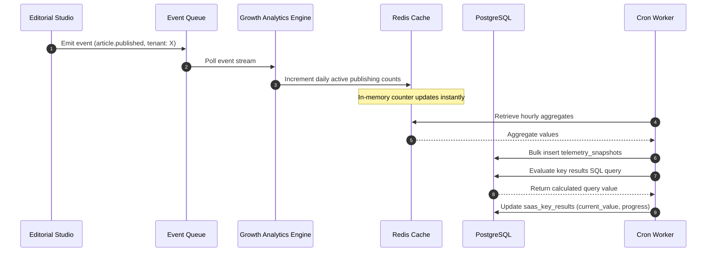

# OKR Framework & SaaS Growth Mapping

## Purpose
The purpose of this document is to define the Objectives and Key Results (OKRs) framework for NewsOps Cloud and specify the design of the Growth Analytics Engine (GAE). This engine aggregates telemetry, product usage, financial billing data, and customer success interactions into unified business metrics, mapping engineering outcomes directly to SaaS growth vectors (MRR, Churn, LTV, and CAC).

## Executive Summary
NewsOps Cloud operates on a multi-tenant SaaS model where software performance directly influences subscription growth, retention, and operating costs. This document details the software design for the system that tracks these linkages. The GAE ingests real-time events from editorial workspaces, API gateways, and the Stripe billing platform, translating system-level activity into objective progress. This integration ensures business executives, product managers, and engineering leads can monitor organizational health against strict key results.

## Vision
To establish an automated, continuous feedback loop where software performance, editor engagement, and content distribution metrics dynamically inform business OKRs. By bridging the gap between infrastructure behavior and unit economics, NewsOps Cloud targets data-driven growth, rapid platform expansion, and optimized cloud spend.

## Scope
- **In Scope**:
  - Ingestion pipeline for system and user activity events (logins, article creations, syndication attempts, AI tokens consumed).
  - Stripe webhook processing framework for real-time MRR, ARR, NRR, and LTV calculations.
  - CRUD APIs for OKR objective and key result configurations.
  - Dynamic key result calculation via telemetry adapters.
  - Tenant-level and global system-wide metrics dashboards.
- **Out of Scope**:
  - Double-entry accounting system (handled by external accounting software).
  - Employee performance appraisal and compensation management systems.

## Goals
- Compute SaaS growth unit economics (MRR, NRR, LTV, CAC) with 100% financial reconciliation.
- Keep latency for analytics queries below 150ms for a rolling 90-day window.
- Automate key result status updates through scheduled database query execution.
- Maintain 99.99% availability of the event ingestion gateway.

## Functional Requirements
- **FR-1**: The system must ingest raw telemetry event payloads from the NewsOps Gateway (e.g., `article.published`, `ai_token.consumed`, `session.created`).
- **FR-2**: The system must process billing webhooks to record subscription upgrades, downgrades, and churn events.
- **FR-3**: Administrators must be able to configure Objectives, target values, weights, and associate Key Results with specific telemetry metrics.
- **FR-4**: The dashboard must compute and visualize Net Revenue Retention (NRR) monthly.
- **FR-5**: The system must enforce multi-tenant isolation, ensuring organization admins only see metrics related to their tenant.

## Non-Functional Requirements
- **NFR-1 (Performance)**: The metrics ingestion endpoint must process up to 10,000 events/sec with a P95 latency under 20ms.
- **NFR-2 (Scalability)**: Metrics store must scale horizontally to handle up to 100 TB of timeseries event records without performance degradation.
- **NFR-3 (Availability)**: The GAE collection microservice must achieve 99.99% uptime.
- **NFR-4 (Security)**: All financial data must be encrypted at rest using AES-256-GCM.
- **NFR-5 (Accuracy)**: Dollar values must be stored in cents as integer values to prevent floating-point calculation errors.

## Business Rules
- **BR-1**: Monthly Recurring Revenue (MRR) is calculated as the sum of all active subscription tier prices normalized to a 30-day billing cycle.
- **BR-2**: A tenant is flagged with an "At-Risk" status if their active publisher count drops below 25% of their rolling 30-day average for 7 consecutive days.
- **BR-3**: Customer Acquisition Cost (CAC) calculations must include marketing spend inputs and sales commission logs retrieved from the CRM API.
- **BR-4**: Access to global SaaS metrics (cross-tenant MRR/churn) is restricted to the `system:superadmin` role.

## Actors
- **Publisher Admin**: Configures internal team OKRs and monitors workspace engagement and subscription costs.
- **NewsOps Executive**: Monitors platform-wide financial health, aggregate churn, and customer success response times.
- **Stripe billing connector**: Asynchronous system agent delivering billing events.
- **Telemetry Producer**: Internal microservices (Editorial Studio, AI Router) pushing event tracking logs.

## User Stories
- **User Story 1**: As a Publisher Admin, I want to define a Key Result to "Reduce average AI translation cost per article below $0.05" so that I can automatically monitor our usage against our budget constraint.
- **User Story 2**: As a NewsOps Executive, I want to view a real-time dashboard of Monthly Recurring Revenue (MRR) and Net Revenue Retention (NRR) so that I can report accurate numbers during investor briefings.
- **User Story 3**: As a DevOps Lead, I want to correlate system response latency metrics with user session duration so that I can prove that faster page load speeds directly increase editorial productivity.

## Acceptance Criteria
- **AC-1**: When an admin configures an OKR with a SQL query-backed Key Result, the system must validate the query against a read-replica schema and reject any queries containing write operations (e.g., `INSERT`, `UPDATE`, `DELETE`, `DROP`).
- **AC-2**: The NRR calculation formula must be verified mathematically: `((Beginning MRR + Expansion MRR - Contraction MRR - Churned MRR) / Beginning MRR) * 100` and must execute correctly even when Churned MRR matches Beginning MRR (division by zero mitigation).
- **AC-3**: A dashboard query for a 90-day date range must return the complete dataset within 150ms when accessed by an authorized tenant admin.

## Workflows
1. **OKR Configuration and Verification Flow**:
   ```
   [Publisher Admin] -> (Inputs Objective & Key Result Details) -> [UI Panel]
   [UI Panel] -> (POST /api/v1/analytics/okrs) -> [API Gateway]
   [API Gateway] -> (Authorize: okrs:write) -> [GAE Service]
   [GAE Service] -> (Dry-Run Metric SQL) -> [Read-Replica DB]
   [Read-Replica DB] -> (Result Schema Validated) -> [GAE Service]
   [GAE Service] -> (Write OKR Configuration) -> [Primary DB]
   [GAE Service] -> (201 Created Status) -> [Publisher Admin]
   ```
2. **Telemetry Aggregation Flow**:
   ```
   [Editorial Studio CMS] -> (Emit event: article.published) -> [Kafka Topic: telemetry-events]
   [Kafka Topic: telemetry-events] -> (Consume) -> [GAE Engine]
   [GAE Engine] -> (Parse payload & resolve tenant_id) -> [Timeseries Partition]
   [GAE Engine] -> (Increment daily counters) -> [Redis Cache]
   [Cron Worker] -> (Sync Redis Cache to PostgreSQL hourly) -> [Primary DB]
   ```

## API Design

### 1. Create a SaaS OKR
- **Endpoint**: `POST /api/v1/analytics/okrs`
- **Headers**:
  - `Content-Type: application/json`
  - `Authorization: Bearer <jwt_token>`
- **Request Payload**:
```json
{
  "organization_id": "org_987654321",
  "title": "Optimize Collaborative Editorial Output",
  "description": "Increase team publishing velocity while keeping AI costs down",
  "target_quarter": "2026-Q3",
  "key_results": [
    {
      "title": "Reduce average article publication duration",
      "metric_identifier": "telemetry.article.duration_minutes",
      "target_value": 15.0,
      "current_value": 45.0,
      "operator": "LESS_THAN_OR_EQUAL_TO",
      "weight": 0.50
    },
    {
      "title": "Maintain AI generation cost per story",
      "metric_identifier": "billing.ai.cost_per_story_cents",
      "target_value": 4.0,
      "current_value": 8.5,
      "operator": "LESS_THAN_OR_EQUAL_TO",
      "weight": 0.50
    }
  ]
}
```
- **Response Payload (201 Created)**:
```json
{
  "okr_id": "okr_uuid_1111_2222",
  "organization_id": "org_987654321",
  "status": "active",
  "progress_percentage": 0.0,
  "created_at": "2026-06-27T22:15:00Z",
  "updated_at": "2026-06-27T22:15:00Z"
}
```

### 2. Retrieve SaaS Growth Metrics
- **Endpoint**: `GET /api/v1/analytics/growth?start_date=2026-04-01&end_date=2026-06-30`
- **Headers**:
  - `Authorization: Bearer <jwt_token>`
- **Response Payload (200 OK)**:
```json
{
  "currency": "USD",
  "time_granularity": "monthly",
  "metrics": [
    {
      "period": "2026-04",
      "mrr_cents": 12500000,
      "arr_cents": 150000000,
      "nrr_percentage": 112.5,
      "cac_cents": 45000,
      "ltv_cents": 180000,
      "churn_rate_percentage": 1.2
    },
    {
      "period": "2026-05",
      "mrr_cents": 13800000,
      "arr_cents": 165600000,
      "nrr_percentage": 114.2,
      "cac_cents": 42000,
      "ltv_cents": 195000,
      "churn_rate_percentage": 0.95
    }
  ]
}
```

## Database Design

```sql
-- GAE (Growth Analytics Engine) Schema

CREATE TABLE saas_okrs (
    id UUID PRIMARY KEY DEFAULT gen_random_uuid(),
    organization_id VARCHAR(64) NOT NULL,
    title VARCHAR(255) NOT NULL,
    description TEXT,
    target_quarter VARCHAR(10) NOT NULL,
    progress_percentage NUMERIC(5, 2) DEFAULT 0.00,
    status VARCHAR(32) NOT NULL DEFAULT 'active',
    created_at TIMESTAMP WITH TIME ZONE DEFAULT CURRENT_TIMESTAMP,
    updated_at TIMESTAMP WITH TIME ZONE DEFAULT CURRENT_TIMESTAMP
);

CREATE TABLE saas_key_results (
    id UUID PRIMARY KEY DEFAULT gen_random_uuid(),
    okr_id UUID NOT NULL REFERENCES saas_okrs(id) ON DELETE CASCADE,
    title VARCHAR(255) NOT NULL,
    metric_identifier VARCHAR(100) NOT NULL,
    target_value NUMERIC(15, 4) NOT NULL,
    current_value NUMERIC(15, 4) NOT NULL DEFAULT 0.00,
    operator VARCHAR(32) NOT NULL CHECK (operator IN ('GREATER_THAN_OR_EQUAL_TO', 'LESS_THAN_OR_EQUAL_TO', 'EQUAL_TO')),
    weight NUMERIC(3, 2) NOT NULL DEFAULT 1.00,
    created_at TIMESTAMP WITH TIME ZONE DEFAULT CURRENT_TIMESTAMP,
    updated_at TIMESTAMP WITH TIME ZONE DEFAULT CURRENT_TIMESTAMP
);

CREATE TABLE telemetry_snapshots (
    id BIGSERIAL PRIMARY KEY,
    organization_id VARCHAR(64) NOT NULL,
    metric_name VARCHAR(100) NOT NULL,
    value NUMERIC(15, 4) NOT NULL,
    timestamp TIMESTAMP WITH TIME ZONE DEFAULT CURRENT_TIMESTAMP
);

-- Indexes for fast analytics queries
CREATE INDEX idx_okrs_org ON saas_okrs(organization_id);
CREATE INDEX idx_key_results_okr ON saas_key_results(okr_id);
CREATE INDEX idx_telemetry_lookup ON telemetry_snapshots(organization_id, metric_name, timestamp DESC);
```

## UI Design
- **Workspace Analytics Layout**:
  - **Sidebar**: Growth analytics navigation (OKRs, Subscriptions, Usage Reports, Telemetry logs).
  - **Core Cards Row**: Displays metrics indicators: MRR ($), Churn (%), LTV ($), and AI Cost ($). Green/Red indicator arrows denote trends.
  - **Active OKR Panel**: Dynamic list view of active objectives. Clicking an objective expands it to reveal nested Key Results, complete with progress bars and status tags (`On Track`, `At Risk`, `Achieved`).
  - **Metric Graph Component**: Recharts line-graph displaying daily telemetry snapshots compared with the target metric goal line.
  - **Interactive Filter**: Date-range selector presets (Last 30 Days, Q1, Q2, Year-to-Date).

## Permissions
Access control is implemented via role-based access tokens matching these permissions:
- `organizations:read`: Read workspace information.
- `analytics:read`: Read metrics snapshots and general KPI calculations.
- `okrs:read`: Read objectives and key results.
- `okrs:write`: Create, modify, or archive OKRs and target key results.
- `billing:read`: Access detailed financial calculations and historical MRR metrics.

## Security
- **Dynamic Query Sanitization**: Telemetry adapters do not allow free-form user SQL queries. Telemetry queries map to predefined stored procedures or specific parameter-driven aggregate views.
- **Cross-Tenant Prevention**: Database queries execute using a multi-tenant scope, appending `WHERE organization_id = current_user_org_id()` automatically at the gateway router layer.
- **Token Validation**: JSON Web Tokens (JWT) are validated signature-wise using RS256, and must possess the custom `org` claim and appropriate scope claims.

## Performance
- **Dashboard Response**: Maximum 150ms.
- **Write Throughput**: Target 5,000 TPS on ingestion gateway via Kafka buffer.
- **Caching**: Aggregated monthly MRR, NRR, and churn tables are cached in Redis with a 2-hour TTL. Telemetry points are written to memory buffers and flushed asynchronously to lower disk I/O.

## Monitoring
- **Prometheus Metrics**:
  - `newsops_gae_ingest_requests_total`: Total event ingestion requests received.
  - `newsops_gae_ingest_latency_seconds`: Latency distribution of telemetry ingestion.
  - `newsops_okr_evaluations_failed_total`: Count of failures during cron OKR evaluations.
- **Alert Triggers**:
  - `IngestLatencyHigh`: Alert triggers if `gae_ingest_latency_seconds` P99 > 100ms for more than 5 minutes.
  - `OKREvaluationFailure`: Alert triggers if `okr_evaluations_failed_total` increments during the hourly cron worker execution.

## Logging
JSON structured logs are exported to OpenSearch:
- **Log format**:
```json
{
  "timestamp": "2026-06-27T22:15:30.125Z",
  "level": "INFO",
  "service": "growth-analytics-engine",
  "event": "okr_progress_updated",
  "context": {
    "organization_id": "org_987654321",
    "okr_id": "okr_uuid_1111_2222",
    "old_progress": 45.50,
    "new_progress": 55.20
  }
}
```

## Error Handling
| Application Error Code | HTTP Status | Customer-Facing Error Message |
|:---|:---|:---|
| `ERR_ANALYTICS_FORBIDDEN` | 403 Forbidden | You do not have permissions to access financial growth telemetry. |
| `ERR_INVALID_METRIC_TARGET` | 400 Bad Request | The specified key result metric identifier is invalid or unsupported. |
| `ERR_DATABASE_TIMEOUT` | 504 Gateway Timeout | The query took too long to execute. Please narrow your date range. |
| `ERR_STRIPE_WEBHOOK_MISMATCH` | 422 Unprocessable | The signature verification failed on the incoming billing webhook. |

## Edge Cases
- **Zero Divisor on Churn Rate**: When zero subscriptions drop in a month, the system sets churn rate explicitly to `0.00%` rather than attempting a calculation.
- **Stripe Out-of-Order Events**: If a `customer.subscription.updated` event arrives after a `customer.subscription.deleted` event due to network delay, the GAE discards the update by tracking event timestamps (`evt_created_at`) stored alongside tenant billing logs.
- **Replica Lag**: During high write cycles, metrics computation queries run against read replicas. If replica lag exceeds 10 seconds, the GAE falls back to the primary database instance to prevent displaying stale financial targets.

## Future Improvements
- **Predictive Churn Forecasting**: Integrate a PyTorch-based neural net model to evaluate publisher login patterns and forecast churn probabilities.
- **Auto-Budget Optimization**: Connect the AI orchestrator limits directly to active OKRs, automatically capping token usage if costs approach business bounds.

## Mermaid Diagrams

### Telemetry & OKR Sync Pipeline


## References
- [System Architecture](../../docs/02-architecture/README.md)
- [Database Schema](../../docs/03-database/README.md)
- [SaaS Engine Architecture](../../docs/08-saas/README.md)
