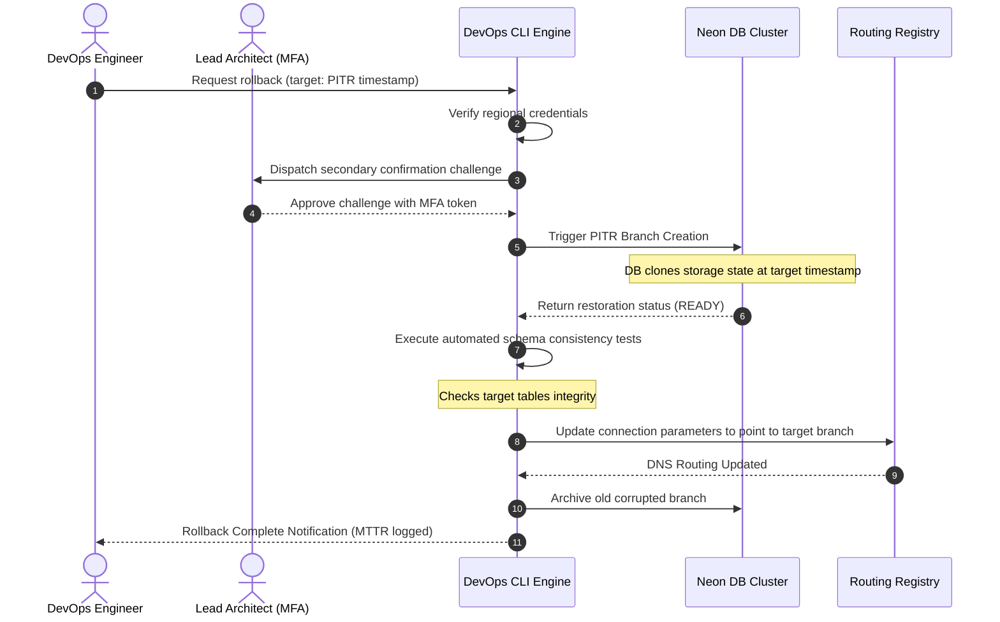

# Operational Playbooks
## Purpose
This document details standard operating procedures (SOPs) and incident playbooks for NewsOps Cloud. It establishes processes for customer support, content moderation (DMCA takedowns and TOS violations), tenant database migrations, database recovery rollbacks, and payment failures.

## Executive Summary
Operational stability and safety are critical to the NewsOps Cloud ecosystem. This playbook establishes clear procedures for support engineers, moderators, and DevOps staff to handle both routine maintenance and critical incidents. Each section outlines the step-by-step recovery workflow, required access permissions, security validations, and monitoring parameters. By following these procedures, teams can minimize system downtime and maintain regulatory compliance.

## Vision
To build a highly resilient operational model where critical issues (such as payment failures, data migration requests, copyright infringements, or system crashes) are resolved using documented, reproducible, and auditable procedures.

## Scope
This playbook applies to the following operations:
- **Customer Support**: Ticket prioritization, triage, and escalation channels.
- **Content Moderation**: Reviewing and processing DMCA and TOS violation reports.
- **Tenant Migrations**: Transferring tenant metadata and workspaces across regional database nodes.
- **Database Rollbacks**: Restoring database clusters to target snapshots after failed system upgrades or data corruption events.
- **Dunning Management**: Handling failed subscription payments and system suspensions.

## Goals
1. Resolve critical support tickets within defined SLA response periods.
2. Complete DMCA and content takedowns in less than 24 hours to comply with safe-harbor legal provisions.
3. Migrate large tenant databases (up to 100 GB) with less than 60 seconds of read-only downtime.
4. Execute emergency database rollbacks to a clean restore point in less than 15 minutes.
5. Standardize automated payment retry sequences to recover at least 85% of failed subscriptions before suspension.

## Functional Requirements
- **Content Moderation Dashboard**: Interface for reviewing flagged posts, processing takedowns, and tracking DMCA claims.
- **Automated Tenant Migration Runner**: Command-line and API dashboard that automates data exports, syncs schema states, updates DNS mappings, and runs checksum validation.
- **Database Snapshot Controller**: Tooling integrated with Neon serverless postgres to trigger, test, and restore point-in-time database snapshots.
- **Dunning Retries Engine**: Integration with Stripe Billing to trigger a multi-step retry, email warning, and suspension loop.
- **Audit Logging System**: Immutable log recorder tracking all administrative operations, including rollbacks and content takedowns.

## Non-Functional Requirements
- **Moderation Log Immutability**: Action records in moderation tables must use database triggers that block updates or deletions.
- **Database Rollback Integrity**: Restorations must achieve zero data corruption, verified by checksum parity checks on key system tables.
- **Migration Network Bandwidth**: Cross-region transfers must utilize encrypted tunnels with bandwidth guarantees of >= 1 Gbps.
- **Zero-Downtime Retries**: Billing system checks must run asynchronously to avoid impacting publishing operations.

## Business Rules
1. **DMCA Takedown Rule**: Upon receipt of a valid DMCA request:
   - Target content must be set to `STATUS = 'MODERATED'` immediately (making it inaccessible to the public).
   - The publisher must receive an email notification detailing the claim and options for a counter-notice.
2. **Dunning Retention Sequence**:
   - *Day 1 (Failed Payment 1)*: Account status becomes `PAST_DUE`. Retry payment. Send notification email.
   - *Day 3 (Failed Payment 2)*: Retry payment. Send warning. Restrict user seat additions.
   - *Day 5 (Failed Payment 3)*: Retry payment. Disable generative AI capabilities (limit to read-only views).
   - *Day 7 (Failed Payment 4)*: Subscription is suspended (`STATUS = 'SUSPENDED'`). Set tenant database shard to read-only mode.
3. **Database Rollback Approval**: Executing a database rollback requires secondary verification. An engineer can propose the change, but it must be approved by the Lead DevOps Architect or Chief Security Officer.

## Actors
- **Support Agent**: triages and handles customer support tickets.
- **Content Moderator**: Reviews abuse reports and executes takedowns.
- **DevOps Engineer**: Initiates migrations and executes database rollbacks.
- **Billing Processor**: Automated engine that manages Stripe webhook actions and subscription statuses.
- **Security Officer**: Approves high-impact operations.

## User Stories
### Story 1: Handling a DMCA Takedown
As a **Content Moderator**, I want to receive a flagged copyright violation alert, review the original article and source material, and flag the post as moderated with a single click so that the platform complies with safe harbor regulations.
### Story 2: Seamless Shard Migration
As a **DevOps Engineer**, I want to move an expanding organization's database partition from a shared instance to a dedicated Neon database instance without data loss, keeping service interruption under 1 minute.
### Story 3: Reclaiming Past-Due Revenue
As a **Billing Processor**, I want to automatically transition a tenant through dunning stages when their credit card fails, sending notifications and restricting features before suspension.

## Acceptance Criteria
1. **Takedown Access Block**: Moderated articles must return a `451 Unavailable For Legal Reasons` status code and render a standard legal notice page within 1 second of action execution.
2. **Migration Data Parity**: Post-migration database tables must match original records exactly, verified using automated sha256 checksums before updating DNS records.
3. **Rollback Performance Limits**: Point-in-Time Recovery (PITR) commands must resolve and successfully bring the database cluster back online in under 15 minutes.
4. **Dunning Action Enforcement**: Transitioning a subscription to a suspended status must block write operations for the tenant's users within 10 seconds.

## Workflows
1. **Database Rollback SOP**:
   - An engineer detects data corruption following a bad release.
   - The engineer requests a rollback via the CLI tool, specifying the target timestamp (e.g., `2026-06-27T21:40:00Z`).
   - The CLI blocks execution and prompts for a secondary DevOps lead token.
   - The DevOps lead reviews the request and enters their authorization token.
   - The CLI initiates a Neon point-in-time recovery action, creating a new branch of the database at the target timestamp.
   - The system executes health-checks against the recovered branch database.
   - If health-checks pass, the system updates primary routing DNS settings to point to the new branch.
   - The old corrupted database is archived for analysis, and a Slack notification confirms the recovery.

2. **Tenant Shard Migration Procedure**:
   - A tenant exceeds Pro resource allocations, requiring migration to a dedicated database shard.
   - The DevOps engine schedules the migration window and sends a tenant notification.
   - At the scheduled window, the system switches the tenant's current database partition to read-only mode.
   - The migration daemon runs `pg_dump` to capture data state.
   - The daemon streams the database dump to the target database instance.
   - The daemon executes checksum comparisons between source and target databases.
   - If checksums match, the daemon updates the tenant's routing tables in PostgreSQL and Redis.
   - The system switches the target database back to read-write mode.
   - The system routes all new tenant connections to the target database.

## API Design

### 1. File a Content Moderation Report
Allows public users or copyright holders to report content violations.
- **Endpoint**: `POST /api/v1/moderation/reports`
- **Headers**:
  - `Content-Type: application/json`
- **Request Payload**:
```json
{
  "article_id": "art_2210948-e",
  "reporter_email": "legal@copyrightcorp.com",
  "report_type": "COPYRIGHT_DMCA",
  "evidence_url": "https://copyrightcorp.com/original-article.html",
  "additional_details": "The entire second paragraph is copied without attribution."
}
```
- **Response Payload (`201 Created`)**:
```json
{
  "report_id": "rep_9918204-b",
  "status": "SUBMITTED",
  "created_at": "2026-06-27T22:30:00Z"
}
```

### 2. Trigger Tenant Database Migration
DevOps endpoint to initiate cross-region tenant partition transfer.
- **Endpoint**: `POST /api/v1/ops/migrations`
- **Headers**:
  - `Authorization: Bearer <JWT>`
  - `X-DevOps-MFA-Token: 994821`
- **Request Payload**:
```json
{
  "tenant_id": "org_4410294-a",
  "source_host": "shared-db-us-east-1.neon.tech",
  "target_host": "dedicated-db-us-east-1.neon.tech",
  "allow_downtime_seconds": 60
}
```
- **Response Payload (`202 Accepted`)**:
```json
{
  "migration_job_id": "mig_8819024-g",
  "status": "QUEUED",
  "estimated_duration_seconds": 45,
  "created_at": "2026-06-27T22:32:00Z"
}
```

## Database Design
```sql
-- Content Moderation Reports Table
CREATE TABLE content_moderation_reports (
    id UUID PRIMARY KEY DEFAULT gen_random_uuid(),
    article_id UUID NOT NULL REFERENCES articles(id) ON DELETE CASCADE,
    reporter_email VARCHAR(255) NOT NULL,
    report_type VARCHAR(50) NOT NULL, -- 'COPYRIGHT_DMCA', 'TOS_VIOLATION', 'SPAM', 'HARASSMENT'
    evidence_url TEXT,
    additional_details TEXT,
    status VARCHAR(50) NOT NULL DEFAULT 'PENDING', -- PENDING, APPROVED, REJECTED
    moderated_by UUID,
    created_at TIMESTAMP WITH TIME ZONE DEFAULT CURRENT_TIMESTAMP,
    updated_at TIMESTAMP WITH TIME ZONE DEFAULT CURRENT_TIMESTAMP
);

CREATE INDEX idx_moderation_reports_status ON content_moderation_reports(status);

-- Immutable Moderation Audit Log (Trigger blocks updates/deletions)
CREATE TABLE moderation_audit_logs (
    id UUID PRIMARY KEY DEFAULT gen_random_uuid(),
    report_id UUID REFERENCES content_moderation_reports(id) ON DELETE SET NULL,
    article_id UUID NOT NULL,
    action_taken VARCHAR(100) NOT NULL, -- e.g., 'TAKEDOWN', 'RESTORATION', 'DISMISSAL'
    performed_by UUID NOT NULL,
    action_timestamp TIMESTAMP WITH TIME ZONE DEFAULT CURRENT_TIMESTAMP
);

-- Migration Tracking Jobs
CREATE TABLE tenant_migration_jobs (
    id UUID PRIMARY KEY DEFAULT gen_random_uuid(),
    tenant_id UUID NOT NULL REFERENCES tenant_organizations(id) ON DELETE CASCADE,
    source_host VARCHAR(255) NOT NULL,
    target_host VARCHAR(255) NOT NULL,
    status VARCHAR(50) NOT NULL DEFAULT 'PENDING', -- PENDING, IN_PROGRESS, COMPLETED, FAILED
    source_checksum VARCHAR(64),
    target_checksum VARCHAR(64),
    downtime_seconds NUMERIC(10, 2),
    error_message TEXT,
    created_at TIMESTAMP WITH TIME ZONE DEFAULT CURRENT_TIMESTAMP,
    updated_at TIMESTAMP WITH TIME ZONE DEFAULT CURRENT_TIMESTAMP
);

CREATE INDEX idx_tenant_migrations_status ON tenant_migration_jobs(status);
```

## UI Design
Operations and moderation interfaces are split into secure workspaces:
1. **Moderation Queue View**:
   - A list displaying pending moderation reports, color-coded by urgency (DMCA reports are flagged red).
   - Side-by-side comparison pane showing original reported text vs evidence text.
   - Large primary action buttons: **Approve Takedown** and **Dismiss Report**.
2. **Migration Control Panel**:
   - Tabular view listing database shard loads and capacity limits.
   - A multi-step **Migration Wizard** tracking pipeline status (Exporting, Copying, Verifying, DNS Update, Complete).
   - An emergency abort button remains active until the final DNS switch step is reached.
3. **Billing Dunning Center**:
   - A dashboard showing accounts in dunning states (past due, restricted, suspended).
   - Action triggers to override dunning sequences manually for specific accounts.

## Permissions
- `moderator:takedown:apply`: Review flagged content and perform takedown operations.
- `ops:db:rollback`: Trigger point-in-time recovery processes (requires DevOps MFA).
- `ops:tenant:migrate`: Execute data movements and database partition transfers.
- `billing:dunning:override`: Change or delay automated payment retry schedules.

## Security
- **MFA Challenge Gate**: High-risk functions like database rollbacks and shard migrations require a secondary MFA confirmation token.
- **IP Restrictions**: Database recovery tools are accessible only when connected to the company's secure internal VPN.
- **Secure Encrypted Shard Migration**: System database dumps are encrypted in transit using TLS 1.3 and stored with AES-256 encryption at rest.

## Performance
- **Read-Only Lock Strategy**: Shard migrations lock database writes, but read queries continue to serve visitors from replica databases.
- **Fast Local Dump**: Database migrations use fast streaming utilities (`pg_dump` piped directly into `pg_restore`) to bypass disk write bottlenecks.
- **Neon Serverless Branching**: Point-in-time rollbacks use Neon serverless postgres branching, completing restores in seconds regardless of database size.

## Monitoring
### Prometheus Metrics
- `newsops_moderation_takedowns_total`: Counter, tracks the count of articles taken down due to violations.
- `newsops_migration_duration_seconds`: Histogram, records migration run durations.
- `newsops_dunning_stage_count`: Gauge, tracks the count of accounts in different dunning stages.
- `newsops_db_rollback_duration_seconds`: Gauge, measures recovery rollback duration.

### Alerting Rules
- **DunningSpikeAlert**: Trigger warning if the number of accounts in dunning status increases by 25% over a 24-hour period.
- **MigrationFailureAlert**: Trigger warning if a database migration job fails or returns a checksum mismatch.
- **RollbackInitiated**: Trigger an emergency alert if any point-in-time recovery job starts.

## Logging
- **Log Format**: JSON.
- **Log Levels**:
  - `INFO`: Support ticket updates, moderation report submissions, and payment retries.
  - `WARN`: Failed payments, dunning level transitions, and migration warnings.
  - `ERROR`: DB migration failures, invalid backup checksums, or moderation blockages.
  - `FATAL`: DB corruption events, unauthorized rollback attempts.
- **Log Context**: Always includes `operator_id`, `tenant_id`, `process_id`, `timestamp`, and `client_ip`.

## Error Handling
| Input/System Error Code | HTTP Status | Customer-Facing Message |
| :--- | :--- | :--- |
| `ROLLBACK_FORBIDDEN` | 403 Forbidden | "Secondary approval verification is required to trigger this rollback." |
| `MIGRATION_CHECKSUM_MISMATCH` | 500 Internal Error | "Data checksum validation failed. The migration has been aborted." |
| `TAKEDOWN_ALREADY_PROCESSED` | 409 Conflict | "This moderation claim has already been resolved." |
| `DUNNING_SUSPENSION_ACTIVE` | 402 Payment Required | "Your workspace has been suspended due to consecutive payment failures. Please update billing." |

## Edge Cases
- **Database Schema Incompatibility during Rollback**: If a rollback goes past a schema change, older application services may fail. Mitigation: Deployment procedures require schema changes to maintain backward compatibility for at least 2 database versions.
- **Concurrent Writes during Migration Lock**: If a user submits an article after the read-only lock is enabled, the request returns a `423 Locked` code, and the content is saved in the browser's local storage for recovery.
- **Stripe Failure during Payment Retries**: If Stripe API goes down during a payment retry, the retry loop is paused, preventing accounts from being suspended due to processing issues.

## Future Improvements
1. **Automated Rollback Verification**: Implement automated test suites that spin up temporary database branches and verify system functionality before executing updates.
2. **AI Moderation Assessor**: Use machine learning classifiers to flag potential copyright and TOS violations before content is published.
3. **Live Warm DB Migration**: Implement logical replication pipelines to migrate tenant databases with zero write downtime.

## Mermaid Diagrams


## References
- System Database Sharding: [../03-database/tenant_partitioning.md](../03-database/tenant_partitioning.md)
- SaaS Billing Handlers: [../08-saas/billing_handlers.md](../08-saas/billing_handlers.md)
- Global CDN DNS Mappings: [../11-devops/cdn.md](../11-devops/cdn.md)
- API Core Handlers: [../09-api/core_handlers.md](../09-api/core_handlers.md)
