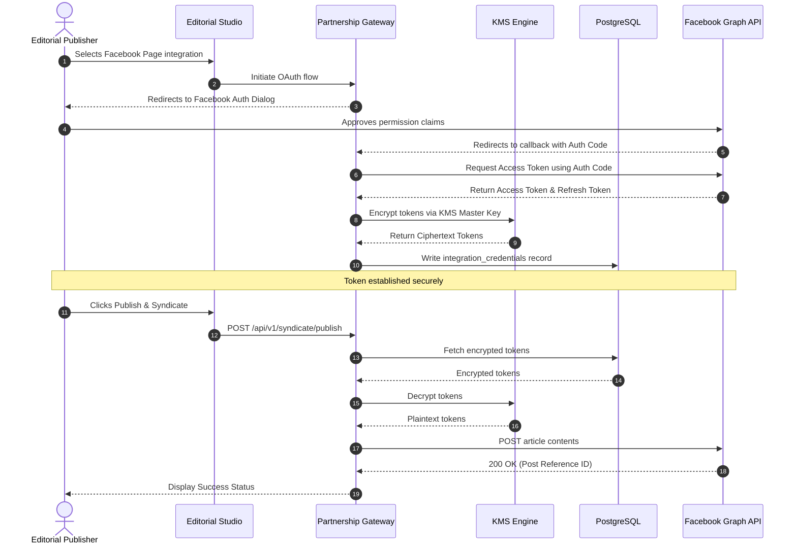

# Partnership Integration & Syndication Gateway

## Purpose
This document specifies the software design of the Partnership Integration & Syndication Gateway (PISG). This component handles connections, security parameters, and data format mapping between NewsOps Cloud and third-party partners, including news agencies (AP, Reuters), programmatic ad networks (Google Ad Manager), social media platforms (Meta, LinkedIn, Twitter), and syndication networks.

## Executive Summary
Integrating with external partnerships is vital for digital publishers to source raw content, monetize articles, and distribute published news stories. The PISG microservice acts as an isolated integration broker. It abstracts third-party API complexities via a unified adapter pattern, manages OAuth2 credential state machines, and enforces strict rate limits, preventing third-party performance issues from affecting the main CMS application database or editorial interfaces.

## Vision
To build a secure, highly scalable integration gateway that acts as the universal adapter for digital publishing. By decoupling integration logic from the core editorial repository, NewsOps Cloud enables continuous partner feature rollouts, resilient queue-based syndication, and highly reliable programmatic ad injection.

## Scope
- **In Scope**:
  - Ingestion workers for news wires (Associated Press RSS/Atom/JSON feeds, Reuters API).
  - Outbound publishing connectors (Meta Graph API, LinkedIn Share API, Twitter v2 API, custom RSS/Atom feeds).
  - OAuth2 credential lifecycle manager (Authorization, token storage, token refresh worker).
  - Ad injection manager injecting script-level header bidding setups (Google Ad Manager, Prebid.js configurations) on tenant-hosted pages.
- **Out of Scope**:
  - Real-time bidding (RTB) engine implementation (outsourced to external demand-side platforms).
  - Custom UI dashboard components for individual third-party tools (handled by unified integration settings).

## Goals
- Syndicate articles to social endpoints within 2 seconds of human publishing confirmation.
- Ingest and process wire stories from AP and Reuters under 10 seconds from their source feed release.
- Secure all client integration tokens using envelope encryption, ensuring plain-text keys are only accessible in memory during active API requests.

## Functional Requirements
- **FR-1**: The system must provide secure OAuth2 authorization endpoints for linking organization profiles to social channels.
- **FR-2**: The wire sync worker must poll AP and Reuters feeds at configurable intervals and parse inbound articles into draft templates.
- **FR-3**: Ingested wire drafts must preserve structural metadata, including author, original source URL, publication time, and copyright notices.
- **FR-4**: The syndication pipeline must process outgoing posts asynchronously using an message queue to prevent UI blockages.
- **FR-5**: Ad injection logic must dynamically modify article HTML to add structured Google Ad Manager slot tags without corrupting article body code blocks.

## Non-Functional Requirements
- **NFR-1 (Security)**: Storage of OAuth2 tokens must use AES-256 envelope encryption. Master key management must reside in AWS KMS or HashiCorp Vault.
- **NFR-2 (Fault Tolerance)**: Implement a circuit breaker pattern (e.g., Polly or Resilience4j) to automatically stop calls to external APIs when error rates exceed 50% over a 2-minute window.
- **NFR-3 (Extensibility)**: All outbound social engines must implement a common interface `ISocialAdapter`, facilitating the addition of new social channels with zero modifications to core publishing flows.

## Business Rules
- **BR-1**: Ingested wire stories are read-only and cannot be updated directly; they must be cloned into workspace-specific drafts.
- **BR-2**: Outbound social posts must adhere to the formatting guidelines of each specific network (e.g., Twitter character limit constraint: 280 characters).
- **BR-3**: Programmatic ads must not override user layout configurations. Ad containers must adhere to the `IAB (Interactive Advertising Bureau)` standardized placements.

## Actors
- **Content Writer**: Search and convert incoming wire feed articles into editable workspace drafts.
- **System Scheduler**: Chronologically polls incoming wire feeds and runs token renewal procedures.
- **Syndication Worker**: Processes outbound queue payloads and calls external partner APIs.
- **Ad Specialist**: Sets up monetization targets and Google Ad Manager slot IDs.

## User Stories
- **User Story 1**: As a Content Writer for a local newspaper, I want to browse a feed of recent AP wire stories, preview the contents, and click "Clone to Draft" so I can localize the story structure for our readers.
- **User Story 2**: As an Ad Specialist, I want to paste my Google Ad Manager network ID into my site configuration page so that standardized ad slots are automatically generated in our article templates.
- **User Story 3**: As a Content Publisher, I want to publish an article and automatically trigger cross-posting to Facebook, LinkedIn, and our partner publisher RSS feeds, eliminating manual copy-pasting.

## Acceptance Criteria
- **AC-1**: Token decryption must happen dynamically in the application layer. Database queries targeting `integration_credentials` must return only encrypted strings to database operators.
- **AC-2**: The wire synchronization service must deduplicate articles based on unique source identifiers (e.g., `wire_message_id`), ensuring duplicate drafts are never created.
- **AC-3**: Outgoing social syndication calls that fail due to rate limits (`429 Too Many Requests`) must be retried with exponential backoff up to 5 times before status is updated to `Failed`.

## Workflows

### Inbound News Wire Ingestion Workflow
```
[External Wire (AP/Reuters)] -> (JSON Feed Release) -> [Wire Sync Scheduler]
[Wire Sync Scheduler] -> (Retrieve feed content) -> [PISG Ingest Worker]
[PISG Ingest Worker] -> (Sanitize and parse feed metadata) -> [Schema Map]
[Schema Map] -> (Check duplicate wire_message_id) -> [DB Replica]
[Schema Map] -> (Write parsed record as Draft Template) -> [Primary DB]
```

### Outbound Syndication Execution Workflow
```
[Publisher Admin] -> (Clicks Publish Article) -> [CMS Studio]
[CMS Studio] -> (Emit: article.syndicate event) -> [Kafka Topic: social-queue]
[Kafka Topic: social-queue] -> (Read Event) -> [PISG Syndication Worker]
[PISG Syndication Worker] -> (Decrypt Client API Access Token) -> [Vault/KMS]
[Vault/KMS] -->> [PISG Syndication Worker]: Plaintext Credentials
[PISG Syndication Worker] -> (POST request to Facebook/LinkedIn) -> [Social Platform API]
[Social Platform API] -->> [PISG Syndication Worker]: 200 OK (Post Reference ID)
[PISG Syndication Worker] -> (Write success log & reference to job table) -> [Primary DB]
```

## API Design

### 1. Register Integration Credentials
- **Endpoint**: `POST /api/v1/integrations/credentials`
- **Headers**:
  - `Content-Type: application/json`
  - `Authorization: Bearer <jwt_token>`
- **Request Payload**:
```json
{
  "workspace_id": "ws_abc123xyz",
  "provider": "google_ad_manager",
  "client_id": "gam_client_id_val",
  "client_secret": "gam_client_secret_val",
  "auth_token": "ya29.a0AfB_token_value",
  "refresh_token": "1//04_refresh_token_value",
  "token_expiry": "2026-06-27T23:20:00Z",
  "meta_config": {
    "network_code": "12345678",
    "ad_units": ["leaderboard", "sidebar_rectangle", "in_article_native"]
  }
}
```
- **Response Payload (200 OK)**:
```json
{
  "integration_id": "intg_uuid_5555_6666",
  "workspace_id": "ws_abc123xyz",
  "provider": "google_ad_manager",
  "status": "active",
  "updated_at": "2026-06-27T22:20:00Z"
}
```

### 2. Trigger Outbound Content Syndication
- **Endpoint**: `POST /api/v1/syndicate/publish`
- **Request Payload**:
```json
{
  "article_id": "art_uuid_9999_8888",
  "destinations": [
    {
      "platform": "facebook",
      "target_page_id": "fb_page_123456"
    },
    {
      "platform": "linkedin",
      "target_organization_id": "li_org_7890"
    }
  ]
}
```
- **Response Payload (202 Accepted)**:
```json
{
  "job_id": "job_uuid_7777_8888",
  "article_id": "art_uuid_9999_8888",
  "status": "queued",
  "queued_at": "2026-06-27T22:20:05Z"
}
```

## Database Design

```sql
-- Partnership & Integration Gateway Database Schema

CREATE TABLE integration_credentials (
    id UUID PRIMARY KEY DEFAULT gen_random_uuid(),
    workspace_id VARCHAR(64) NOT NULL,
    provider VARCHAR(50) NOT NULL,
    client_id VARCHAR(255) NOT NULL,
    encrypted_client_secret TEXT NOT NULL,
    encrypted_auth_token TEXT NOT NULL,
    encrypted_refresh_token TEXT,
    token_expiry TIMESTAMP WITH TIME ZONE,
    meta_config JSONB NOT NULL DEFAULT '{}',
    is_active BOOLEAN DEFAULT TRUE,
    created_at TIMESTAMP WITH TIME ZONE DEFAULT CURRENT_TIMESTAMP,
    updated_at TIMESTAMP WITH TIME ZONE DEFAULT CURRENT_TIMESTAMP
);

CREATE TABLE wire_feeds (
    id UUID PRIMARY KEY DEFAULT gen_random_uuid(),
    wire_provider VARCHAR(50) NOT NULL, -- 'ap', 'reuters'
    wire_message_id VARCHAR(255) NOT NULL UNIQUE,
    title VARCHAR(255) NOT NULL,
    body_text TEXT NOT NULL,
    source_metadata JSONB NOT NULL DEFAULT '{}',
    ingested_at TIMESTAMP WITH TIME ZONE DEFAULT CURRENT_TIMESTAMP
);

CREATE TABLE syndication_jobs (
    id UUID PRIMARY KEY DEFAULT gen_random_uuid(),
    workspace_id VARCHAR(64) NOT NULL,
    article_id VARCHAR(64) NOT NULL,
    platform VARCHAR(50) NOT NULL,
    status VARCHAR(32) NOT NULL DEFAULT 'queued',
    external_post_id VARCHAR(255),
    error_message TEXT,
    created_at TIMESTAMP WITH TIME ZONE DEFAULT CURRENT_TIMESTAMP,
    updated_at TIMESTAMP WITH TIME ZONE DEFAULT CURRENT_TIMESTAMP
);

-- Index mappings for integration updates and feed lookups
CREATE INDEX idx_integration_lookup ON integration_credentials(workspace_id, provider);
CREATE INDEX idx_wire_message ON wire_feeds(wire_message_id);
CREATE INDEX idx_syndication_jobs ON syndication_jobs(workspace_id, article_id);
```

## UI Design
- **Integration Management Hub**:
  - Grid list displaying partner cards (Associated Press, Reuters, Meta Graph, LinkedIn, Google Ad Manager).
  - Cards include a color-coded status badge (`Connected` - green, `Disconnected` - gray, `Auth Failed` - red).
  - Clicking on a card expands the credential settings configuration panel containing token input text boxes, checkbox toggles for auto-syndication, and a "Verify Connection" diagnostic utility.
  - Integration job log table displaying chronological execution history: Date, Destination, Job Type, and Execution Status.

## Permissions
Access to gateway configurations maps to the following permissions:
- `integrations:read`: Allow checking integration statuses.
- `integrations:write`: Allow creating or renewing authentication credentials.
- `wire:ingest`: Allow importing and converting wire posts to workspace drafts.
- `syndicate:post`: Allow triggering outbound syndication jobs.

## Security
- **Envelope Encryption**: Raw integration secrets are encrypted at the API server before entering database memory. An encryption helper module generates data keys using KMS keys, storing only the encrypted credentials and key metadata in PostgreSQL.
- **IP Whitelisting**: External outbound syndication requests originate from a specific set of static IP addresses, enabling customers to restrict access control on their corporate network resources.
- **CSRF Protection**: State parameters used during the OAuth2 redirect sequences are cryptographically verified to prevent cross-site request forgery attacks.

## Performance
- **Aggregated Latency**: Database decryption queries run inside 5ms. Internal API processing overhead is kept below 15ms.
- **Concurrency**: Up to 1,000 parallel syndication tasks are processed concurrently using worker threads running on Node.js/TypeScript.
- **Caching**: OAuth2 access tokens are stored in Redis with an expiration value matched to the provider's token lifetime, avoiding repeated database decryptions.

## Monitoring
- **Prometheus Metrics**:
  - `newsops_pisg_syndication_jobs_total`: Count of social posts processed.
  - `newsops_pisg_api_errors_total`: Count of external API failures labeled by provider.
  - `newsops_pisg_token_refreshes_total`: Count of automated OAuth2 token renew cycles.
- **Alerts**:
  - `HighIntegrationFailureRate`: Triggered if `pisg_api_errors_total` metrics represent > 10% of total outbound requests over a rolling 15-minute window.

## Logging
Structured logging format:
```json
{
  "timestamp": "2026-06-27T22:20:10.880Z",
  "level": "ERROR",
  "service": "partnership-gateway",
  "event": "syndication_failed",
  "context": {
    "workspace_id": "ws_abc123xyz",
    "article_id": "art_uuid_9999_8888",
    "platform": "facebook",
    "http_status": 403,
    "error_response": "The permission permissions have been modified or revoked by the page administrator."
  }
}
```

## Error Handling
| Application Error Code | HTTP Status | Customer-Facing Error Message |
|:---|:---|:---|
| `ERR_EXPIRED_CREDENTIALS` | 400 Bad Request | The integration access token has expired and could not be renewed. Please reconnect. |
| `ERR_EXTERNAL_RATE_LIMIT` | 429 Too Many Requests | The destination platform is rate-limiting requests. Your post has been queued. |
| `ERR_SYNDICATION_BAD_PAYLOAD` | 422 Unprocessable | The article does not meet the destination network content constraints. |

## Edge Cases
- **Revoked OAuth Tokens**: If a user revokes NewsOps permissions via their Facebook/LinkedIn settings panel, the outbound worker receives a `401 Unauthorized`. The gateway immediately sets `is_active` to `FALSE` in `integration_credentials` and triggers an urgent warning notification to the workspace dashboard.
- **HTML Content Size Discrepancy**: If an article's layout contains massive high-res photo arrays, social platform APIs (like Twitter or LinkedIn) might reject payload requests. The adapter intercepts payload generations, automatically resizing and uploading media assets to NewsOps S3 buckets before publishing.

## Future Improvements
- **Automated Cross-Channel Formatting**: Integrate an AI processing module to rewrite main articles into different social formats (e.g., generate a thread for Twitter, a professional snippet for LinkedIn, and an outline for Facebook) automatically before executing syndication.

## Mermaid Diagrams

### OAuth Authorization & Content Syndication Flow


## References
- [System Architecture](../../docs/02-architecture/README.md)
- [Database Schema](../../docs/03-database/README.md)
- [API Specifications](../../docs/09-api/README.md)
