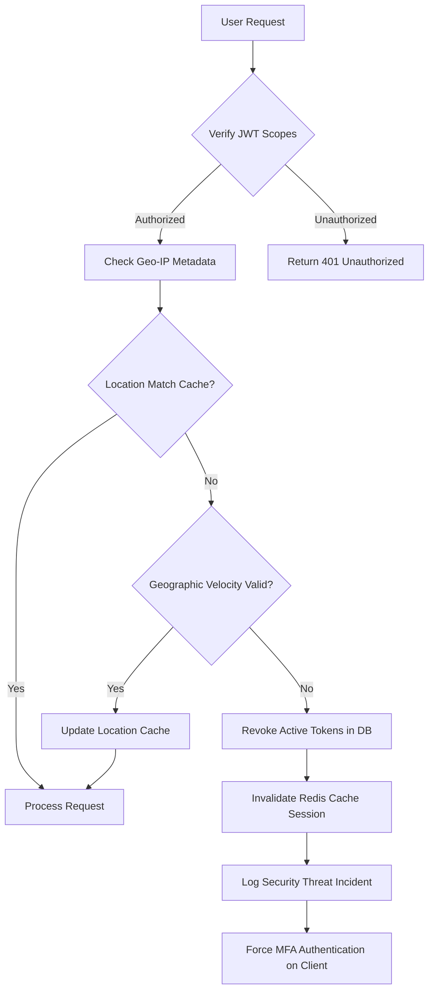

# Automated Risk Mitigation & Incident Response

## Purpose
This document specifies the software design of the Automated Risk Mitigation & Incident Response Service (ARMIRS) for NewsOps Cloud. The service acts as an automated governance layer, handling real-time risks such as data breaches, AI-generated content inaccuracies (hallucinations), social network platform bans, payment service interruptions, and customer churn metrics.

## Executive Summary
Operational continuity is key for enterprise digital publishing platforms. ARMIRS integrates monitoring loops and circuit breakers across database authorization tokens, content generation models, billing systems, and outbound social channels. When anomaly metrics cross defined risk thresholds, the service triggers automated mitigations, such as rotation of suspected user sessions, dynamic routing of payments to alternative gateways, and pausing publishing pipelines to avoid social platform bans.

## Vision
To establish a completely self-healing system state that dynamically monitors operational conditions, shielding publishers from external network dependencies, transaction failures, and reputational damage due to AI inaccuracies.

## Scope
- **In Scope**:
  - Automated session termination and API credential revocation based on usage anomalies.
  - Fact-checking and accuracy rating pipeline (hallucination checks) within the Editorial Studio.
  - Social channel publishing proxy rotation, rate-limit queue buffers, and ban detection.
  - Payment gateway routing logic (automatic failover between Stripe and Adyen).
  - Analytics-driven customer churn risk scoring and customer retention discount hooks.
- **Out of Scope**:
  - System server backup restoration (managed by Terraform/Kubernetes state managers).
  - Legal negotiation processes with social platforms for account reinstatements.

## Goals
- Complete automated payment gateway failover redirection in under 30 seconds during outages.
- Maintain a false-positive credential lockout rate of less than 0.01%.
- Limit fact-verification latency impact on the editing flow to under 3 seconds.

## Functional Requirements
- **FR-1**: The system must track active user logins and revoke tokens if simultaneous sessions emerge from disparate geographic locations.
- **FR-2**: The Editor UI must execute a verification task through ARMIRS before moving any AI-assisted article to an `Approved` state.
- **FR-3**: In the event of a social platform API returning status codes indicating account suspension or rate limits, the system must set the integration status to `paused` and queue pending posts.
- **FR-4**: The billing gateway must monitor Stripe response codes and automatically fall back to Adyen if transaction errors exceed 10% in a 5-minute interval.
- **FR-5**: Calculate daily user activity and compute a Churn Risk Score, alerting Customer Success representatives if the score breaches 75%.

## Non-Functional Requirements
- **NFR-1 (Availability)**: The payment routing failover service must run on a geographically redundant infrastructure to remain available if primary databases fail.
- **NFR-2 (Performance)**: Telemetry processing for Churn Risk calculation must execute asynchronously in a background queue to prevent impacts on transactional databases.
- **NFR-3 (Security)**: Dynamic API token rotation must comply with OAuth2 RFC parameters, ensuring no tokens are logged in plain-text format.

## Business Rules
- **BR-1**: Articles flagged with an AI Accuracy score below 80% cannot be published without manual overriding by a user holding `editor:chief` permissions.
- **BR-2**: Failed subscription renewals must trigger an automated dunning sequence over a 14-day grace period before workspace service downgrades are applied.
- **BR-3**: Payment failovers must only shift credit card processing; subscription database records remain synchronized as the single source of truth.

## Actors
- **Lead Editor**: Inspects flagged low-accuracy drafts and can input publish overrides.
- **Security Officer**: Configures threshold limits for token revocation and logs suspicious session activities.
- **Payment Gateway Router**: System agent routing customer transaction payloads.
- **Churn Retention Engine**: Processes tenant metrics and initiates automated coupon discounts.

## User Stories
- **User Story 1**: As a Lead Editor, I want the system to scan AI-written articles for inaccuracies, highlighting dubious claims and providing reference links, so that our team maintains factual integrity.
- **User Story 2**: As a Publisher Admin, I want the billing engine to failover to our secondary processor during primary gateway downtime, so that our subscribers' monthly renewals continue without interruption.
- **User Story 3**: As a Social Manager, I want the publishing system to detect rate-limit bans from Meta and queue our outbound posts automatically, rather than dropping the articles or causing API locks.
- **User Story 4**: As a Customer Success Manager, I want to receive an alert when a tenant's usage metrics drop significantly, so that I can reach out and prevent cancellation before they churn.

## Acceptance Criteria
- **AC-1**: When primary payment endpoint timeouts exceed 5,000ms for 3 consecutive calls, the system must route subsequent transaction payloads to the secondary provider API.
- **AC-2**: The content scanner must return an accuracy score payload containing facts, confidence score, and references within 3,000ms for an article containing up to 2,000 words.
- **AC-3**: If a user credentials check detects API requests from two different countries within a 1-hour window, the security agent must immediately revoke that token, log out all active sessions, and write an entry to `audit_logs`.

## Workflows

### Payment Gateway Outage & Automated Failover Workflow
```
[Billing Client] -> (Process Renewal) -> [Payment Gateway Router]
[Payment Gateway Router] -> (Call Stripe API) -> [Stripe Server]
[Stripe Server] -->> [Payment Gateway Router]: (Timeout/503 Service Unavailable)
[Payment Gateway Router] -> (Increment Fail Count) -> [Redis Cache]
Note over Payment Gateway Router: Fail Count crosses 3-strike threshold
[Payment Gateway Router] -> (Swap Route Configuration flag to Adyen) -> [DB Primary]
[Payment Gateway Router] -> (Call Adyen API with payment details) -> [Adyen Server]
[Adyen Server] -->> [Payment Gateway Router]: (200 OK - Authorized)
[Payment Gateway Router] -> (Emit: GatewayFailoverEvent) -> [Security Logs]
[Payment Gateway Router] -->> [Billing Client]: (Success Status)
```

### AI Accuracy Scan Pipeline Workflow
```
[Editor UI] -> (Clicks Approve Draft) -> [CMS core]
[CMS core] -> (POST /api/v1/risk/evaluate-content) -> [ARMIRS Content Scanner]
[ARMIRS Content Scanner] -> (Extract key assertions) -> [LLM Fact Extractor]
[LLM Fact Extractor] -> (Execute similarity search) -> [Vector DB / Search Web API]
[ARMIRS Content Scanner] -> (Cross-reference claims & compute accuracy score) -> [Score Engine]
alt Score < 80
    [ARMIRS Content Scanner] -->> [Editor UI]: (Error 422 - Low Accuracy Flagged)
else Score >= 80
    [ARMIRS Content Scanner] -> (Update database status to Approved) -> [Primary DB]
    [ARMIRS Content Scanner] -->> [Editor UI]: (Success - Approved)
end
```

## API Design

### 1. Evaluate Article for Accuracy and Hallucinations
- **Endpoint**: `POST /api/v1/risk/evaluate-content`
- **Request Payload**:
```json
{
  "article_id": "art_uuid_abc123",
  "content": "NewsOps Cloud launches integration with Nvidia NIM on June 27, 2026, delivering sub-10ms model execution rates.",
  "metadata": {
    "has_ai_elements": true,
    "model_used": "gpt-4o-2026"
  }
}
```
- **Response Payload (200 OK)**:
```json
{
  "article_id": "art_uuid_abc123",
  "accuracy_score": 94.50,
  "status": "passed",
  "hallucination_detected": false,
  "scanned_assertions": [
    {
      "assertion": "NewsOps Cloud integrated Nvidia NIM on June 27, 2026",
      "status": "verified",
      "confidence": 0.98,
      "reference_source": "https://press.newsops.com/releases/nvidia-nim-integration"
    },
    {
      "assertion": "Delivering sub-10ms model execution rates",
      "status": "unverified",
      "confidence": 0.60,
      "reference_source": null
    }
  ]
}
```

### 2. Manual Trigger of Payment Gateway Failover
- **Endpoint**: `POST /api/v1/risk/failover-payment`
- **Headers**:
  - `Authorization: Bearer <superadmin_jwt>`
- **Request Payload**:
```json
{
  "force_failover": true,
  "target_gateway": "adyen",
  "reason": "Stripe API latency spikes observed globally"
}
```
- **Response Payload (200 OK)**:
```json
{
  "status": "success",
  "active_gateway": "adyen",
  "changed_at": "2026-06-27T22:25:00Z",
  "affected_transactions_in_queue": 14
}
```

## Database Design

```sql
-- Automated Risk Mitigation & Incident Response Schema

CREATE TABLE payment_gateway_health (
    id SERIAL PRIMARY KEY,
    gateway_name VARCHAR(50) NOT NULL, -- 'stripe', 'adyen'
    is_active BOOLEAN DEFAULT TRUE,
    consecutive_failures INT DEFAULT 0,
    average_latency_ms INT DEFAULT 0,
    last_checked_at TIMESTAMP WITH TIME ZONE DEFAULT CURRENT_TIMESTAMP,
    updated_at TIMESTAMP WITH TIME ZONE DEFAULT CURRENT_TIMESTAMP
);

CREATE TABLE risk_assessments (
    id UUID PRIMARY KEY DEFAULT gen_random_uuid(),
    article_id VARCHAR(64) NOT NULL,
    accuracy_score NUMERIC(5, 2) NOT NULL,
    assessment_payload JSONB NOT NULL DEFAULT '{}',
    is_overridden BOOLEAN DEFAULT FALSE,
    overridden_by VARCHAR(64),
    created_at TIMESTAMP WITH TIME ZONE DEFAULT CURRENT_TIMESTAMP
);

CREATE TABLE churn_risk_scores (
    id UUID PRIMARY KEY DEFAULT gen_random_uuid(),
    workspace_id VARCHAR(64) NOT NULL UNIQUE,
    churn_probability_score NUMERIC(5, 2) NOT NULL,
    contributing_factors JSONB NOT NULL DEFAULT '{}',
    last_updated_at TIMESTAMP WITH TIME ZONE DEFAULT CURRENT_TIMESTAMP
);

-- Indexing for real-time monitoring and overrides lookup
CREATE INDEX idx_risk_article ON risk_assessments(article_id);
CREATE INDEX idx_churn_score ON churn_risk_scores(churn_probability_score DESC);
CREATE INDEX idx_gateway_status ON payment_gateway_health(gateway_name, is_active);
```

## UI Design
- **Security & Risk Dashboard**:
  - **Outage Indicators Panel**: Displays heartbeat charts for billing connectors (Stripe, Adyen) and social APIs (Meta, LinkedIn).
  - **Accuracy Config Grid**: Drag sliders to customize the organization's minimum accuracy scores (e.g., General News: 80%, Financial News: 95%).
  - **Risk Override Console**: Displays list of articles flagged as `Low Accuracy`. Administrators can review flagged assertions side-by-side with source references and choose to "Publish Override" or "Reject".
  - **CS Churn Watchlist**: Table highlighting organizations with Churn Risk > 70%, with buttons to trigger custom discounts or contact client support.

## Permissions
Access control policies use these permissions:
- `risk:read`: Read assessments and system status logs.
- `risk:write`: Update threshold settings and risk profiles.
- `payment:failover`: Manually trigger gateway switches.
- `content:bypass_checks`: Override low-accuracy blockages to publish articles.

## Security
- **Data Encryption**: Financial parameters and customer transaction records processed during failovers are run over TLS 1.3, encrypted inside the memory database, and stored with fields masked.
- **Credential Suspensions**: Compromised keys are revoked by altering key mappings in Redis caches, triggering immediate session termination across all active instances.

## Performance
- **Throughput**: ARMIRS can process up to 200 concurrent accuracy scans utilizing specialized workers.
- **Failover Routing Overhead**: The routing logic introduces less than 5ms overhead to the billing pipeline.

## Monitoring
- **Prometheus Metrics**:
  - `newsops_armirs_active_payment_gateway`: Gauge (1 for Stripe, 2 for Adyen).
  - `newsops_armirs_fact_check_duration_seconds`: Verification processing time histogram.
  - `newsops_armirs_revoked_sessions_total`: Counter recording compromised user lockouts.
- **Alerts**:
  - `PaymentGatewayFailover`: Critical alert if the system pivots to the secondary billing gateway.
  - `AIAccuracyWarning`: Warning if consecutive AI articles fall below the 60% accuracy threshold.

## Logging
Structured JSON logging for risk incidents:
```json
{
  "timestamp": "2026-06-27T22:25:30.450Z",
  "level": "WARN",
  "service": "risk-management-engine",
  "event": "compromised_session_lockout",
  "context": {
    "user_id": "usr_998877",
    "workspace_id": "ws_abc123xyz",
    "reason": "Simultaneous sessions detected in Germany and United States",
    "action_taken": "all_tokens_revoked"
  }
}
```

## Error Handling
| Application Error Code | HTTP Status | Customer-Facing Error Message |
|:---|:---|:---|
| `ERR_ACCURACY_CHECK_FAILED` | 422 Unprocessable | The article's factual accuracy score is too low. Please verify claims or request editor override. |
| `ERR_PAYMENT_GATEWAY_OUTAGE` | 503 Service Unavailable | The primary payment gateway is experiencing issues. Routing payment through fallback... |
| `ERR_TOKEN_ROTATION_LIMIT` | 429 Too Many Requests | Credential rotation rate limit exceeded. Please try again in 1 hour. |

## Edge Cases
- **Simultaneous Outage of Both Gateways**: If both Stripe and Adyen reject transactions, the system moves the billing pipeline to an "Offline Queueing Mode", saving customer details securely, granting temporary 3-day premium access, and retrying payment collection once upstream services recover.
- **False-Positive Lockouts**: If a user switches VPN regions quickly, they might trigger the geographic threat protection rule. The UI redirects the user to a multi-factor authentication (MFA) challenge page to recover their session rather than executing a hard account lock.

## Future Improvements
- **Federated Fact Checking**: Integrate decentralised consensus networks and fact networks to cross-check real-time assertions instantly, reducing LLM scanning biases.

## Mermaid Diagrams

### Automated Session Revocation & Threat Protection Flow


## References
- [System Architecture](../../docs/02-architecture/README.md)
- [Database Schema](../../docs/03-database/README.md)
- [SaaS Engine Architecture](../../docs/08-saas/README.md)
- [Security Matrix](../../docs/10-security/README.md)
