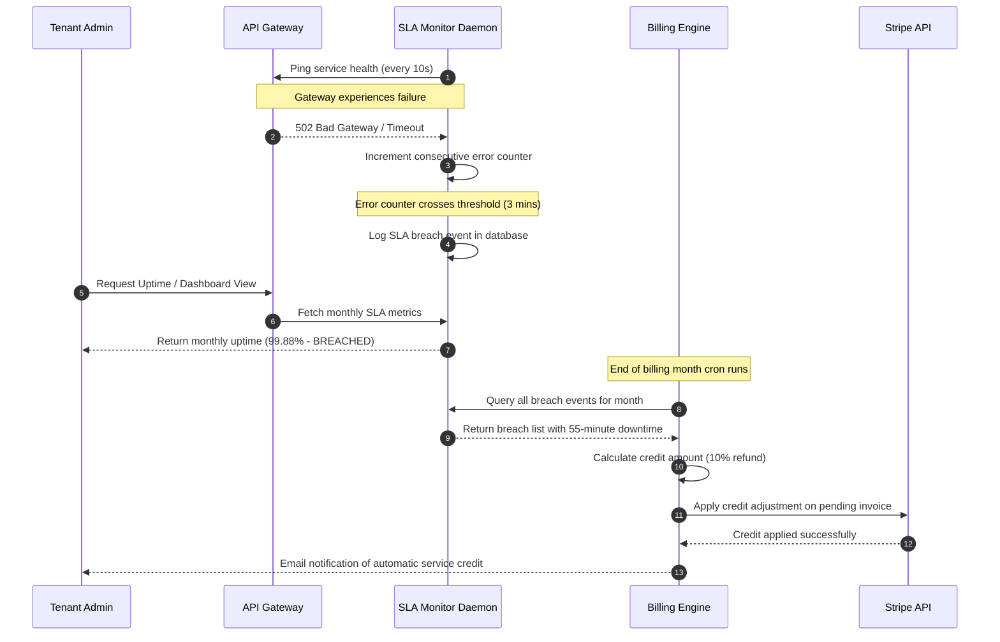

# Service Level Agreements
## Purpose
This document establishes the official Service Level Agreements (SLAs) for the NewsOps Cloud digital publishing platform. It defines operational thresholds, performance guarantees, and compensation structures for tenants across various subscription tiers. The agreements outlined herein ensure platform reliability, data security, resource predictability, and prompt customer support.

## Executive Summary
NewsOps Cloud guarantees 99.9% uptime for Pro tier subscribers and 99.99% uptime for Enterprise tier subscribers. Uptime is measured monthly across core services, including content scrapers, collaborative editors, the multi-provider AI router, and publishing endpoints. Document generation and translation tasks are governed by sub-second latency thresholds. Support response times scale from a maximum of 24 hours (Free) down to 1 hour (Enterprise). Tenant isolation is verified by automated zero-leakage constraints enforced at the database and networking layers. Financial credits are automatically calculated and applied in the event of validated breaches.

## Vision
To provide modern publishing teams and enterprise media operations with a highly available, ultra-low-latency, and safe publishing OS. By making SLAs transparent, verifiable, and programmatically monitored, NewsOps Cloud builds confidence and establishes itself as a mission-critical utility for public-facing communications.

## Scope
This SLA applies to all production environments of NewsOps Cloud, specifically:
- **Core SaaS Gateways and APIs**: Identity, RBAC, organizations, and billing.
- **News Intelligence Engines**: Crawlers, RSS parsers, topic clustering, and verification.
- **Editorial Studio**: Collaborative canvas editor, asset storage, and translation.
- **AI Router & Pipelines**: NVIDIA NIM, OpenAI, Google Gemini, and local vLLM routing.
- **Social Publishing Services**: Scheduling queues and platform publishing adapters.
- **Support Operations**: Support ticketing desks and incident response channels.

It does not cover sandbox, staging, or local development environments.

## Goals
1. Maintain monthly API and system availability above 99.99% for Enterprise tenants.
2. Limit P99 editorial document translation and summarization pipeline processing latencies to less than 1,500 milliseconds.
3. Guarantee support response times within 60 minutes for high-priority Enterprise incidents.
4. Enforce mathematical zero-leakage tenant isolation with daily automated verify audits.
5. Provide automatic service credits matching service degradation levels.

## Functional Requirements
- **Automated SLA Monitoring**: Continuous ingestion of heartbeat checks, API ping rates, and response latencies to measure uptime.
- **SLA Breach Alerts**: Immediate notification pipelines to the operations team when performance metrics approach or cross SLA limits.
- **Support Ticket Escalation Engine**: Automated state tracker that alerts engineers and support managers when ticket response times approach SLA limits.
- **Automated Service Credits**: System integration with Stripe billing to compute and apply refunds/credits when SLA violations are verified.
- **SLA Compliance Dashboard**: Tenant-facing panel displaying current and historical uptime, API performance, and ticket resolution statistics.

## Non-Functional Requirements
- **High Availability**: Redundant regional clustering with auto-failovers within 15 seconds.
- **Low Monitoring Overhead**: Monitoring agents must consume less than 1% CPU and introduce less than 1ms overhead to API routes.
- **Tamper-Proof Audit Logs**: Storage of SLA breaches in read-only tables to prevent tampering or deletions.
- **Data Parity Verification**: Daily consistency checks to verify database row isolation levels across tenants.
- **Highly Accurate Time-Sync**: Infrastructure clocks must synchronize via Network Time Protocol (NTP) with sub-millisecond drift.

## Business Rules
1. **Downtime Definiton**: System downtime is defined as a state where a tenant's authorized users cannot authenticate, write articles, or execute publishing actions, measured in consecutive minutes.
2. **Exclusions**: Scheduled maintenance (notified at least 48 hours in advance), force majeure events, and failures of third-party networks (e.g., global internet backbone outages, direct outages of social media networks like Facebook's API) are excluded from downtime calculations.
3. **Service Credit Structure**:
   - Monthly Uptime < SLA Target but >= 99.0%: 10% of monthly subscription fee credited.
   - Monthly Uptime < 99.0% but >= 95.0%: 25% of monthly subscription fee credited.
   - Monthly Uptime < 95.0%: 100% of monthly subscription fee credited.
4. **Support Ticket Priorities**:
   - *P1 (Critical)*: Platform down, no publishing possible. SLA: 1 hr (Enterprise), 4 hrs (Pro).
   - *P2 (High)*: Core features (e.g., AI translation) malfunctioning, workarounds exist. SLA: 4 hrs (Enterprise), 8 hrs (Pro).
   - *P3 (Normal)*: Non-blocking bugs or UI layout issues. SLA: 12 hrs (Enterprise), 24 hrs (Pro).

## Actors
- **Organization Owner**: The primary tenant administrator who monitors billing, requests SLA credits, and manages users.
- **Support Engineer**: The customer support staff member responsible for ticket triage and resolution within SLA guidelines.
- **SLA Monitor Daemon**: The internal automated background runner that evaluates performance metrics, checks tenant isolation integrity, and creates breach logs.
- **Billing Manager**: The financial administrator who reviews SLA credit requests and approves payouts.

## User Stories
### Story 1: Tracking SLA Compliance
As an **Organization Owner**, I want to view a real-time SLA compliance dashboard showing API latencies and monthly uptime statistics so that I can verify that NewsOps Cloud is meeting its contract guarantees.
### Story 2: Requesting Service Credits
As a **Billing Manager**, I want to receive an automated notification and invoice draft reflecting service credits when the monthly uptime falls below 99.9% so that I do not have to manually calculate and submit credit claims.
### Story 3: Support SLA Escalation
As a **Support Engineer**, I want the ticketing system to automatically elevate ticket visibility and send a Slack warning when a P1 ticket is 15 minutes away from breaching the response SLA so that I can intervene immediately.

## Acceptance Criteria
1. **API Availability Threshold**: The system must log and report availability using ping checks every 10 seconds. The monthly cumulative availability percentage must exceed 99.9% for Pro and 99.99% for Enterprise.
2. **Latency Guarantee Limits**: Page translation tasks and collaborative text synchronizations must verify P99 execution time <= 1,200ms under a load of up to 500 requests per second.
3. **Downtime Credit Automation**: If the SLA Monitor Daemon logs a validated breach, it must trigger a payload to the billing API to enqueue a credit invoice in Stripe within 24 hours of the billing cycle end.
4. **Isolation Breach Containment**: Daily cross-tenant database isolation checks must return exactly zero leaking records, or otherwise trigger an immediate severity-0 page to the security operations center.

## Workflows
1. **SLA Breach Detection and Credit Workflow**:
   - The SLA Monitor Daemon queries database API logs and ping monitors every 5 minutes.
   - It detects that the API cluster was unresponsive for 45 consecutive minutes.
   - The daemon generates an entry in the `sla_breaches` table.
   - At the end of the billing month, a billing cron evaluates all `sla_breaches` for the tenant.
   - The cron calculates the credit amount according to the business rules.
   - The system calls the Stripe API to apply a credit balance to the tenant's next invoice.
   - An automated email is sent to the tenant's Organization Owner notifying them of the credit.

2. **Support Ticket SLA Triage and Escalation**:
   - A tenant submits a P1 support ticket through the platform UI.
   - The ticketing engine saves the ticket and starts an SLA countdown timer (60 minutes for Enterprise).
   - If the ticket is unassigned after 15 minutes, an alert is dispatched to the Support Lead.
   - If the ticket has no response after 45 minutes, the system triggers an emergency notification to the on-call engineer via PagerDuty.
   - Once the engineer posts a response, the SLA timer stops, and the actual response duration is recorded for SLA compliance dashboards.

## API Design

### 1. Get Tenant SLA Metrics
Retrieve current billing month SLA statistics, including uptime and response times.
- **Endpoint**: `GET /api/v1/organizations/{org_id}/sla/metrics`
- **Headers**:
  - `Authorization: Bearer <JWT>`
- **Response Payload (`200 OK`)**:
```json
{
  "organization_id": "org_9872910-a",
  "billing_cycle_start": "2026-06-01T00:00:00Z",
  "billing_cycle_end": "2026-06-30T23:59:59Z",
  "tier": "Enterprise",
  "uptime_guarantee_percentage": 99.99,
  "actual_uptime_percentage": 99.994,
  "total_downtime_minutes": 2.5,
  "latencies": {
    "api_p50_ms": 42,
    "api_p90_ms": 95,
    "api_p99_ms": 182,
    "translation_p99_ms": 1150
  },
  "support_tickets": {
    "total_submitted": 12,
    "sla_breaches": 0,
    "average_response_time_minutes": 18.4
  },
  "sla_status": "COMPLIANT"
}
```

### 2. Report SLA Breach / Claim Service Credit
Allows a tenant administrator to manually claim a credit if they identify a mismatch in uptime reporting.
- **Endpoint**: `POST /api/v1/organizations/{org_id}/sla/claims`
- **Headers**:
  - `Authorization: Bearer <JWT>`
- **Request Payload**:
```json
{
  "start_time": "2026-06-15T14:10:00Z",
  "end_time": "2026-06-15T15:05:00Z",
  "affected_service": "Editorial Editor",
  "description": "Collaborative canvas returned 502 Bad Gateway errors continuously for 55 minutes."
}
```
- **Response Payload (`201 Created`)**:
```json
{
  "claim_id": "clm_5510294-b",
  "organization_id": "org_9872910-a",
  "status": "UNDER_REVIEW",
  "created_at": "2026-06-27T22:15:00Z",
  "estimated_credit_usd": 125.00
}
```

## Database Design
```sql
-- SLA Breaches table to log downtime events
CREATE TABLE sla_breaches (
    id UUID PRIMARY KEY DEFAULT gen_random_uuid(),
    organization_id UUID NOT NULL REFERENCES tenant_organizations(id) ON DELETE CASCADE,
    service_name VARCHAR(100) NOT NULL,
    start_time TIMESTAMP WITH TIME ZONE NOT NULL,
    end_time TIMESTAMP WITH TIME ZONE NOT NULL,
    duration_minutes NUMERIC(10, 2) GENERATED ALWAYS AS (EXTRACT(EPOCH FROM (end_time - start_time))/60) STORED,
    impact_level VARCHAR(50) NOT NULL, -- e.g., DEGRADED, PARTIAL_OUTAGE, TOTAL_OUTAGE
    created_at TIMESTAMP WITH TIME ZONE DEFAULT CURRENT_TIMESTAMP
);

CREATE INDEX idx_sla_breaches_org_time ON sla_breaches(organization_id, start_time);

-- SLA Claims table for manually requested credits
CREATE TABLE sla_claims (
    id UUID PRIMARY KEY DEFAULT gen_random_uuid(),
    organization_id UUID NOT NULL REFERENCES tenant_organizations(id) ON DELETE CASCADE,
    claim_details JSONB NOT NULL,
    status VARCHAR(50) NOT NULL DEFAULT 'UNDER_REVIEW', -- UNDER_REVIEW, APPROVED, REJECTED
    approved_by UUID,
    credit_amount_usd NUMERIC(12, 4) DEFAULT 0.0000,
    created_at TIMESTAMP WITH TIME ZONE DEFAULT CURRENT_TIMESTAMP,
    updated_at TIMESTAMP WITH TIME ZONE DEFAULT CURRENT_TIMESTAMP
);

CREATE INDEX idx_sla_claims_status ON sla_claims(status);

-- Tenant isolation verification audits
CREATE TABLE tenant_isolation_audits (
    id UUID PRIMARY KEY DEFAULT gen_random_uuid(),
    audit_timestamp TIMESTAMP WITH TIME ZONE DEFAULT CURRENT_TIMESTAMP,
    records_checked BIGINT NOT NULL,
    leakage_detected BOOLEAN NOT NULL DEFAULT FALSE,
    audit_log_payload JSONB NOT NULL
);

CREATE INDEX idx_isolation_audits_leakage ON tenant_isolation_audits(leakage_detected);
```

## UI Design
The SLA monitoring and ticketing interfaces are designed as clean, web-accessible panels within the NewsOps SaaS Admin settings:
1. **SLA Dashboard Component**:
   - A grid layout displaying three main KPI cards: **Current Month Availability**, **P99 API Latency**, and **Support SLA Success Rate**.
   - An interactive time-series line chart showing ping latency over the last 30 days.
   - A tabular list of any recorded system incidents or maintenance windows with status indicators.
2. **Support Ticket SLA View**:
   - Within the ticket detail view, a visible **SLA Countdown Timer** countdown bar is shown at the top.
   - The bar changes color: green if >50% SLA time remains, yellow if 15-50% remains, and flashing red if <15% remains or if breached.
3. **Billing and Credits Panel**:
   - Displays current subscription invoice draft.
   - Includes a section titled **Service Credits Applied** detailing any automatic discounts triggered by SLA breaches.

## Permissions
- `sla:read`: View organizational uptime stats, latency metrics, and historical claims.
- `sla:claim`: Create new SLA claims manually if an incident is missed.
- `sla:write`: Allow SaaS operations/admin users to create, delete, or override SLA records.
- `sla:audit`: Execute or review the output of tenant isolation runs.

## Security
- **Data Isolation checks**: Row-Level Security (RLS) is applied to all database tables. The `tenant_isolation_audits` execute as high-privilege read-only operations to verify cross-tenant boundaries.
- **Input Validation**: All claims forms validate and sanitize start/end timestamps to prevent SQL injection or overflow attacks.
- **Rate Limiting**: The public API endpoints for metrics are rate-limited to 60 requests/minute per tenant to prevent DoS attacks on telemetry databases.

## Performance
- **Aggregated Metric Caching**: Telemetry metrics are compiled asynchronously and cached in Redis with a 5-minute Time-To-Live (TTL) to avoid running heavy SQL aggregation queries on the live OLTP database during user page loads.
- **Telemetry Processing**: OpenTelemetry collectors handle log parsing.
- **Database Partitioning**: The telemetry logs database is partitioned by day, facilitating fast range queries and rolling discards.

## Monitoring
### Prometheus Metrics
- `newsops_system_uptime_ratio`: Gauge, tracks uptime percentage by service.
- `newsops_api_latency_seconds`: Histogram, tracks HTTP response latencies.
- `newsops_ticket_breach_count`: Counter, increments when a support SLA response target is missed.
- `newsops_isolation_leakage_events_total`: Counter, tracks any failures in cross-tenant data boundaries.

### Alerting Rules
- **HighLatency Alert**: Trigger if P99 API latency > 300ms for more than 5 minutes.
- **UptimeDrop Alert**: Trigger if service uptime drops below 99.9% within any rolling 1-hour window.
- **TicketSLAThreat Alert**: Trigger when any P1 support ticket is within 15 minutes of breach.

## Logging
- **Log Format**: JSON structure to allow ingestion into Loki/Elasticsearch.
- **Log Levels**:
  - `INFO`: Regular ping checks and dashboard requests.
  - `WARN`: Single API timeouts or support tickets near SLA expiration.
  - `ERROR`: System downtime detected or support ticket breach confirmed.
  - `FATAL`: Tenant isolation leakage detected.
- **Log Context**: Always includes `tenant_id`, `user_id`, `service_name`, and `correlation_id` fields.

## Error Handling
| Input/System Error Code | HTTP Status | Customer-Facing Message |
| :--- | :--- | :--- |
| `SLA_METRIC_FAIL` | 500 Internal Error | "Unable to retrieve current SLA statistics. Please try again later." |
| `CLAIM_INVALID_TIME` | 400 Bad Request | "The provided start time cannot be in the future or exceed 30 days in the past." |
| `CLAIM_ALREADY_EXISTS` | 409 Conflict | "An active claim already covers this downtime window." |
| `TICKET_NOT_FOUND` | 404 Not Found | "The requested ticket could not be resolved." |
| `ISOLATION_AUDIT_ERROR` | 500 Internal Error | "An internal verification failure occurred. The administrator has been paged." |

## Edge Cases
- **Split-Brain DB State**: In a multi-region DB failover, metric tracking database engines might conflict on actual downtime duration. Mitigation: Regional metrics engines publish timestamps to a centralized, consensus-backed logs cluster (e.g., Raft-based state store).
- **API Provider Cascade Failures**: If NVIDIA NIM or OpenAI is down, the AI Router fails over to local models. Because the platform continues functioning, this is logged as a *partial degradation*, not *downtime*.
- **Rate Limit Hits**: If a tenant exceeds their authorized rate limit, the API returns a `429 Too Many Requests`. These blocked requests do not count toward system availability or latency breaches.

## Future Improvements
1. **Decentralized SLA Verification**: Implement smart contracts to automatically release escrowed subscription fees as service credits upon verified uptime breaches.
2. **Predictive SLA Defense**: Utilize machine learning to forecast traffic surges and provision Kubernetes pods proactively before latency thresholds are breached.
3. **Fine-Grained Isolation Monitoring**: Implement automated eBPF network sniffers to continuously verify that no network packet crosses tenant boundaries.

## Mermaid Diagrams


## References
- System Architecture Design: [../02-architecture/system_architecture.md](../02-architecture/system_architecture.md)
- Multi-Tenant Database Partitioning: [../03-database/tenant_partitioning.md](../03-database/tenant_partitioning.md)
- SaaS Metrics and Telemetry: [../08-saas/telemetry.md](../08-saas/telemetry.md)
- DevOps Monitoring Setup: [../11-devops/monitoring.md](../11-devops/monitoring.md)
