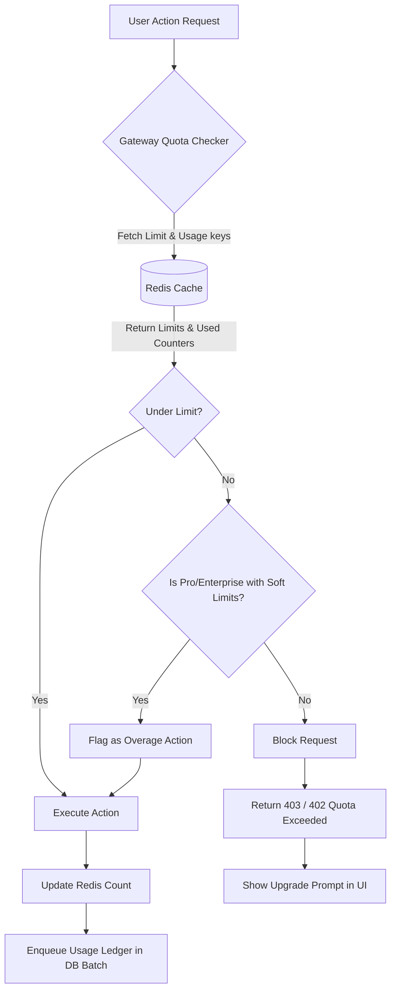

# Tenant Tiering Model
## Purpose
This document specifies the multi-tenant feature structures, subscription tiers, and resource utilization limits for the NewsOps Cloud platform. It defines the mapping of capabilities (users, storage, web crawls, social channels, and AI tokens) across the Free, Pro, and Enterprise plans, and details the infrastructure mechanisms used to monitor and enforce these limits.

## Executive Summary
NewsOps Cloud uses a multi-tier SaaS model to accommodate different publishing operations. The Free tier serves independent creators with basic tools and small limits (1 user, 1 GB storage, 100 crawls/month, 2 social channels, and 10,000 AI tokens). The Pro tier serves professional newsrooms (10 users, 50 GB storage, 5,000 crawls/month, 10 social channels, and 500,000 AI tokens). The Enterprise tier offers customizable high-volume limits, advanced compliance, dedicated databases, and direct API access. Limits are monitored in real-time by a Redis-backed gating engine and integrated with Stripe for overage charges.

## Vision
To establish a clear, frictionless pathway from basic developer and independent writer trial periods to large-scale, high-throughput enterprise media environments. By enforcing quotas programmatically and providing transparent usage analytics, we ensure predictable billing and optimized resource distribution.

## Scope
The scope of this model includes:
- **Feature Access Controls**: Feature gates for advanced translation, SEO optimization, and workflow custom-scheduling.
- **Resource Limit Monitors**: Live counters for data storage, user seats, web crawler requests, social publishing targets, and AI model routing tokens.
- **Billing Event Generation**: Interface layers converting usage overages into Stripe line items.
- **Quota Exceeded Enforcement**: Gating components that block user actions when plan limits are reached without upgrading.

## Goals
1. Implement a low-latency (less than 5ms check time) quota verification mechanism.
2. Automate user self-service billing upgrades, plan migrations, and seat purchasing.
3. Keep the platform's cost-to-serve for the Free tier below $1.50 per month through aggressive resource constraints.
4. Protect core platform database performance by blocking scrapers and publishers that exceed set limits.

## Functional Requirements
- **Tier-Based Gating Engine**: Dynamic feature toggle checks inside the API gateway and application layers.
- **Real-Time Limit Gauges**: Web interfaces showing real-time token, crawl, and storage consumption.
- **Automatic Overage Notifications**: Email and dashboard warning banners when usage reaches 80% and 100% of limits.
- **Seamless Upgrade Workflow**: Auto-updating permissions and database quotas within seconds of a successful credit card payment.
- **Enterprise Limit Overrides**: Admin controls to adjust limit parameters manually for custom agreements.

## Non-Functional Requirements
- **Check Latency**: Every restricted action check must complete in less than 5ms, using localized cache Lookups.
- **Resilience**: Gating engine failures must fail-safe (allow actions temporarily and log warnings) to avoid blocking paying users.
- **Scale**: The gating service must support up to 5,000 verification requests per second (TPS).
- **Consistency**: Quota usage updates must resolve within 1 second across regional app nodes.

## Business Rules
1. **Tier Limits Matrix**:
   - **Free Plan**: $0/mo. 1 User Seat. 1 GB Storage. 100 Scraper Crawls/mo. 2 Social Publishing Channels. 10,000 AI Tokens/mo.
   - **Pro Plan**: $149/mo. 10 User Seats ($10/seat/mo extra). 50 GB Storage ($2/GB/mo extra). 5,000 Scraper Crawls/mo. 10 Social Publishing Channels. 500,000 AI Tokens/mo.
   - **Enterprise Plan**: Custom Pricing (Starts at $999/mo). Unlimited/Custom Seats. Unlimited/Custom Storage. Custom Crawl Limits. Custom Social Channels. Custom AI Token allocations.
2. **Overage Rates**: Pro plan users can consume overages:
   - Extra web crawls: $0.05 per crawl.
   - Extra AI tokens: $0.15 per 10,000 tokens.
   - Extra storage: $0.20 per GB.
3. **Hard vs. Soft Limits**: User seats and social channels are hard limits (cannot exceed without upgrading). Crawls, storage, and AI tokens are soft limits for Pro/Enterprise (overages billed at end of month) but hard limits for Free (actions blocked upon exhaustion).

## Actors
- **Free Tier Publisher**: Independent writer utilizing free capabilities.
- **Pro Team Administrator**: Oversees a professional team, manages seats, and monitors overage expenses.
- **Enterprise Ops Director**: Configures custom allocations and manages corporate security integrations.
- **Gateway Limit Checker**: Automated system middleware executing authorization and limit checks.

## User Stories
### Story 1: Upgrading Plan to Expand Team
As a **Pro Team Administrator**, I want to invite an 11th editor to our workspace and immediately purchase an additional seat so that they can begin writing articles without delay.
### Story 2: Warning Banner at 80% Quota
As a **Free Tier Publisher**, I want to see a warning banner in my dashboard when I hit 80% of my AI token limit for the month so that I can manage my usage or choose to upgrade to Pro.
### Story 3: Enterprise Quota Override
As an **Enterprise Ops Director**, I want to negotiate and have our account administrator configure a custom limit of 20,000 crawls per month without migrating to a new billing tier.

## Acceptance Criteria
1. **Action Interception**: If a Free tier user attempts to run a 101st web crawl, the API gateway must block the request with a `403 Forbidden` response and return a structured quota error message.
2. **Upgrade Propagation Delay**: Following a webhook payment success event from Stripe, the tenant's cache limits configuration must refresh in Redis in less than 3,000 milliseconds.
3. **Overage Ledger Entry**: Any Pro tenant overage (such as executing a crawl past the 5,000 limit) must generate a ledger record in the database within 500ms of transaction execution.
4. **Active Seat Enforcement**: If the active user count in a tenant equals the seat limit, the invitation system must block additional invites from being dispatched.

## Workflows
1. **Request Gating Workflow**:
   - User initiates a request to run an AI-powered article translation.
   - The Gateway Limit Checker intercepts the request and reads the tenant ID.
   - The checker retrieves the tenant's current plan and usage status from the Redis cache.
   - If the usage is below the plan limit (e.g., tokens used: 340,000 / 500,000):
     - The request is allowed.
     - The AI pipeline executes.
     - The pipeline calculates the token count used.
     - The Gateway updates the usage counter in Redis and logs a usage ledger transaction to PostgreSQL.
   - If the usage exceeds the limit:
     - The Gateway checks if the tenant has enabled soft-limit overages (Pro/Enterprise).
     - If yes, the request is allowed, and an overage record is created.
     - If no (or Free tier), the request is blocked, returning a `402 Payment Required` or `403 Forbidden` status.

2. **Self-Service Upgrade and Cache Sync**:
   - The Team Administrator accesses the billing page and clicks "Upgrade to Pro".
   - The UI redirects the user to Stripe Checkout.
   - The user completes the payment.
   - Stripe emits a `checkout.session.completed` webhook.
   - The NewsOps SaaS billing engine verifies the webhook payload.
   - The engine updates the tenant's subscription status in PostgreSQL.
   - The engine flushes and updates the tenant's quota keys in Redis.
   - The UI displays an "Upgrade Successful" notification and unlocks all Pro features.

## API Design

### 1. Retrieve Current Tenant Quotas and Usage
Get active plan limits, current usage metrics, and current billing cycle status.
- **Endpoint**: `GET /api/v1/organizations/{org_id}/billing/usage`
- **Headers**:
  - `Authorization: Bearer <JWT>`
- **Response Payload (`200 OK`)**:
```json
{
  "organization_id": "org_4410294-a",
  "billing_cycle_start": "2026-06-01T00:00:00Z",
  "billing_cycle_end": "2026-06-30T23:59:59Z",
  "plan_name": "Pro",
  "seat_limits": {
    "allocated_seats": 10,
    "active_users": 8,
    "max_allowed": 10
  },
  "usage_metrics": {
    "storage_bytes": {
      "limit": 53687091200,
      "used": 42949672960,
      "overage_allowed": true,
      "overage_rate_usd_per_gb": 0.20
    },
    "web_crawls": {
      "limit": 5000,
      "used": 5120,
      "overage_allowed": true,
      "overage_rate_usd_per_unit": 0.05
    },
    "social_channels": {
      "limit": 10,
      "used": 6,
      "overage_allowed": false
    },
    "ai_tokens": {
      "limit": 500000,
      "used": 482910,
      "overage_allowed": true,
      "overage_rate_usd_per_10k": 0.15
    }
  }
}
```

### 2. Update Limit Overrides (Admin Only)
Adjust quotas and override parameters for a specific tenant.
- **Endpoint**: `PUT /api/v1/admin/organizations/{org_id}/limits`
- **Headers**:
  - `Authorization: Bearer <JWT>`
- **Request Payload**:
```json
{
  "custom_web_crawl_limit": 15000,
  "custom_ai_token_limit": 2000000,
  "custom_storage_bytes_limit": 107374182400,
  "override_reason": "Custom Enterprise SLA Addendum - Section 4"
}
```
- **Response Payload (`200 OK`)**:
```json
{
  "organization_id": "org_4410294-a",
  "updated_at": "2026-06-27T22:20:00Z",
  "updated_by": "usr_9981290-x",
  "custom_web_crawl_limit": 15000,
  "custom_ai_token_limit": 2000000,
  "custom_storage_bytes_limit": 107374182400
}
```

## Database Design
```sql
-- Subscription plans definition
CREATE TABLE subscription_plans (
    id UUID PRIMARY KEY DEFAULT gen_random_uuid(),
    name VARCHAR(50) UNIQUE NOT NULL, -- e.g., 'Free', 'Pro', 'Enterprise'
    base_price_monthly NUMERIC(10, 2) NOT NULL,
    user_seat_limit INT NOT NULL,
    storage_limit_bytes BIGINT NOT NULL,
    crawl_limit_monthly INT NOT NULL,
    social_channels_limit INT NOT NULL,
    ai_token_limit_monthly INT NOT NULL,
    soft_limits_enabled BOOLEAN NOT NULL DEFAULT FALSE,
    created_at TIMESTAMP WITH TIME ZONE DEFAULT CURRENT_TIMESTAMP
);

-- Tenant subscription association
CREATE TABLE tenant_subscriptions (
    id UUID PRIMARY KEY DEFAULT gen_random_uuid(),
    organization_id UUID UNIQUE NOT NULL REFERENCES tenant_organizations(id) ON DELETE CASCADE,
    plan_id UUID NOT NULL REFERENCES subscription_plans(id),
    status VARCHAR(50) NOT NULL DEFAULT 'ACTIVE', -- ACTIVE, TRIAL, PAST_DUE, SUSPENDED
    stripe_subscription_id VARCHAR(255) UNIQUE,
    current_period_start TIMESTAMP WITH TIME ZONE NOT NULL,
    current_period_end TIMESTAMP WITH TIME ZONE NOT NULL,
    created_at TIMESTAMP WITH TIME ZONE DEFAULT CURRENT_TIMESTAMP,
    updated_at TIMESTAMP WITH TIME ZONE DEFAULT CURRENT_TIMESTAMP
);

CREATE INDEX idx_tenant_subscriptions_org ON tenant_subscriptions(organization_id);

-- Custom overrides for tenant limits
CREATE TABLE tenant_limit_overrides (
    id UUID PRIMARY KEY DEFAULT gen_random_uuid(),
    organization_id UUID UNIQUE NOT NULL REFERENCES tenant_organizations(id) ON DELETE CASCADE,
    custom_user_seat_limit INT,
    custom_storage_limit_bytes BIGINT,
    custom_crawl_limit_monthly INT,
    custom_social_channels_limit INT,
    custom_ai_token_limit_monthly INT,
    override_reason TEXT NOT NULL,
    updated_by UUID NOT NULL,
    updated_at TIMESTAMP WITH TIME ZONE DEFAULT CURRENT_TIMESTAMP
);

-- Usage ledger tracking resource usage mutations
CREATE TABLE resource_usage_ledger (
    id UUID PRIMARY KEY DEFAULT gen_random_uuid(),
    organization_id UUID NOT NULL REFERENCES tenant_organizations(id) ON DELETE CASCADE,
    resource_type VARCHAR(50) NOT NULL, -- 'AI_TOKENS', 'CRAWLS', 'STORAGE'
    quantity BIGINT NOT NULL,
    is_overage BOOLEAN NOT NULL DEFAULT FALSE,
    stripe_invoice_item_id VARCHAR(255),
    logged_at TIMESTAMP WITH TIME ZONE DEFAULT CURRENT_TIMESTAMP
);

CREATE INDEX idx_resource_ledger_org_type ON resource_usage_ledger(organization_id, resource_type, logged_at);
```

## UI Design
The system manages tenant billing configurations using simple, grid-aligned workspace interfaces:
1. **Usage Meters Panel**:
   - Displays a layout featuring individual progress bars for: **User Seats**, **Storage**, **AI Tokens**, and **Web Crawls**.
   - Progressive bar colors signal quota pressure: green (under 75%), orange (75-90%), and red (above 90% or limits exceeded).
   - An "Upgrade" button is placed at the top-right of the dashboard container when limitations are reached.
2. **Billing Settings Plan Grid**:
   - A standard comparative table mapping plans (Free, Pro, Enterprise) against list limits and rates.
   - Active plan card is highlighted with a checkmark badge.
   - Action buttons trigger dynamic checkout workflows depending on the targeted tier.

## Permissions
- `billing:view`: Access current invoices, usage levels, and plan statuses.
- `billing:subscribe`: Allow updating payment methods and executing tier upgrades.
- `limits:override`: Access admin endpoints to change default plan quotas for specific organizations.
- `tenant:usage:read`: Allow internal APIs to query the ledger to check limits.

## Security
- **Token Verification**: User subscription plan and feature permissions are embedded directly into signed JWT claims, reducing database lookups.
- **Cryptographic Signature**: Stripe webhook events must be validated using Stripe webhook secrets before executing database mutations.
- **Input Sanitization**: Numeric overrides submitted through admin consoles must pass boundary checks (e.g., negative quotas are blocked).

## Performance
- **Redis Gating Cache**: Quota counters are kept in Redis using hash maps with keys: `tenant:limits:{org_id}` and `tenant:usage:{org_id}`.
- **Fast Lookup**: Gateway uses pipelines to pull limits and usages, verifying permissions in less than 2ms.
- **Batch Processing**: Usage tracking entries are collected in local process queues and committed to the PostgreSQL `resource_usage_ledger` in batches of up to 100 entries to avoid transaction contention.

## Monitoring
### Prometheus Metrics
- `newsops_tenant_quota_hits_total`: Counter, tracks actions blocked due to quota exhaustion, labeled by `organization_id` and `resource_type`.
- `newsops_tenant_tier_count`: Gauge, counts active tenants segmented by plan level (`free`, `pro`, `enterprise`).
- `newsops_billing_invoice_failures_total`: Counter, tracks transaction errors on Stripe.

### Alerting Rules
- **HighQuotaFailures**: Alert if `newsops_tenant_quota_hits_total` spikes past 500 failures in a 5-minute interval.
- **StripeWebhookFailures**: Alert if Stripe webhook ingestion endpoint records a 5xx error status for more than 3 consecutive retries.

## Logging
- **Log Format**: Structured JSON.
- **Log Levels**:
  - `INFO`: Normal limit queries and upgrades.
  - `WARN`: User hits 80% and 90% quota thresholds.
  - `ERROR`: Blocked action due to quota breach (Free tier) or billing validation failure.
- **Log Context**: Includes `tenant_id`, `plan_name`, `resource_type`, `current_limit`, and `attempted_quantity`.

## Error Handling
| Input/System Error Code | HTTP Status | Customer-Facing Message |
| :--- | :--- | :--- |
| `QUOTA_EXCEEDED` | 403 Forbidden | "You have reached your tier limit for this action. Please upgrade your plan." |
| `UPGRADE_REQUIRED` | 402 Payment Required | "Access to this feature requires a Pro or Enterprise subscription." |
| `PAYMENT_FAILED` | 400 Bad Request | "Your payment method could not be processed. Please update billing details." |
| `LIMIT_OVERRIDE_OUT_OF_BOUNDS` | 422 Unprocessable | "Custom limits cannot be less than current resource consumption." |

## Edge Cases
- **Stripe Webhook Outage**: If Stripe fails to deliver a subscription confirmation webhook, the user is temporarily blocked from accessing Pro resources despite paying. Mitigation: Provide a manual "Sync Stripe Account" button in the UI that makes a direct query to Stripe API to check status.
- **Race Condition on Quota Consumption**: Multiple parallel crawlers could request quota checks simultaneously when 1 unit remains. Mitigation: Redis checks use `DECRBY` operations atomically, returning negative values immediately if quota is breached.
- **Enterprise DB Separation**: If an Enterprise customer requires a separate physical database, migration code must export their partition and configure regional DNS endpoints safely.

## Future Improvements
1. **Dynamic Add-Ons Marketplace**: Allow customers to purchase individual standalone packs (e.g., +10,000 crawls for $30) without modifying their base plan tier.
2. **AI-Powered Limit Forecasting**: Analyze historical usage patterns to predict when a tenant will breach limits, advising them to scale limits automatically.
3. **Multi-Region Quota Replication**: Real-time sync of Redis quota databases across multiple geographic regions with sub-10ms lag.

## Mermaid Diagrams


## References
- Database Partitioning Guidelines: [../03-database/tenant_partitioning.md](../03-database/tenant_partitioning.md)
- SaaS Metrics System: [../08-saas/telemetry.md](../08-saas/telemetry.md)
- API Limit Middleware Code: [../09-api/middleware.md](../09-api/middleware.md)
- Stripe Webhook Handlers: [../08-saas/billing_handlers.md](../08-saas/billing_handlers.md)
