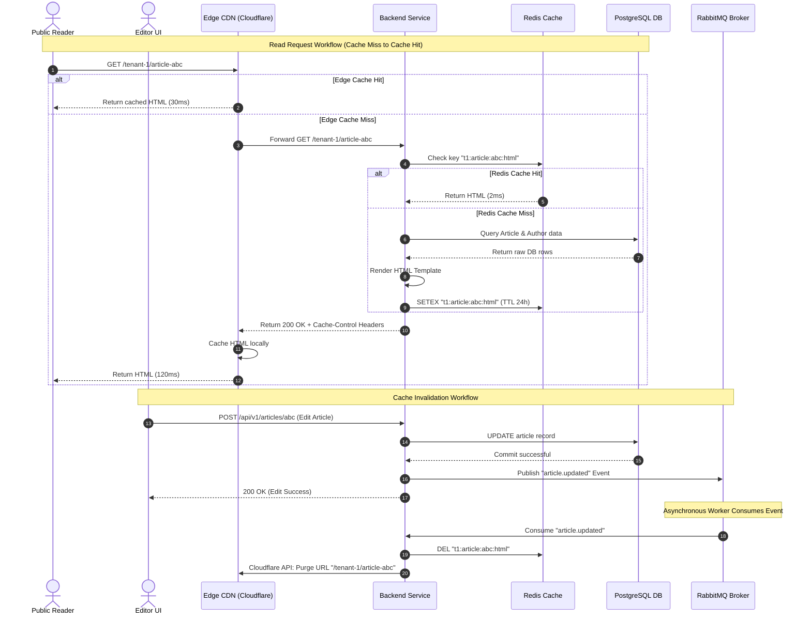

# Caching Strategy
## Purpose
This document defines the multi-tiered caching architecture for the NewsOps Cloud digital publishing platform. It establishes the design patterns, configuration parameters, and invalidation mechanisms required to achieve sub-second page loads, high horizontal scalability, and low database load under intensive read traffic, while ensuring strict data consistency across multi-tenant deployments.

## Executive Summary
NewsOps Cloud employs a layered caching architecture that spans the client, edge CDN, application layer, and database query layers. Publicly accessible resources (such as published news articles and media feeds) are aggressively cached at the edge using Cloudflare CDN with custom cache-control headers. Internal application-level read requests are accelerated using a Redis cache store using a cache-aside pattern managed by custom Python decorators. Cache invalidation is event-driven; state changes in the database trigger immediate, selective purges of both Redis and CDN edge caches to prevent stale content delivery without over-invalidating unrelated assets.

## Vision
The vision is to treat caching as a core, non-intrusive component of the NewsOps Cloud architecture where the system defaults to serving from memory or the edge. The database is shielded from repetitive read queries, allowing the system to handle viral traffic spikes (e.g., breaking news events) without scaling core database instances, while maintaining strict consistency boundaries where edits are visible globally within milliseconds.

## Scope
The scope of this caching strategy covers:
1. **Edge CDN Layer**: Cloudflare integration, custom caching rules, and Edge Worker routing.
2. **HTTP Protocol Layer**: Cache-Control, Surrogate-Control, and ETag header management.
3. **Application Cache Layer**: Redis cache topology (Sentinel/Cluster), namespace isolation, and eviction policies.
4. **Code-Level Cache Patterns**: Decorator-based caching for services and repository layers in the backend.
5. **Cache Invalidation Pipeline**: Event-driven purge mechanics via Redis Pub/Sub, RabbitMQ queues, and Cloudflare Purge APIs.
6. **Bypass Rules**: Session-aware and paywall-aware cache bypassing.

## Goals
- **Minimize Read Latency**: Achieve edge response times of < 50ms and internal cache-hit read latencies of < 5ms.
- **Reduce Database Query Load**: Achieve a database read query bypass rate of > 90% for typical tenant workloads.
- **Maintain Cache Integrity**: Ensure that content updates (articles, layouts, configurations) are reflected globally within 1,000 milliseconds.
- **Zero-Downtime Resilience**: Ensure the application degrades gracefully to the database if the caching cluster becomes unavailable.

## Functional Requirements
- **Tenant Isolation**: The caching layer must isolate cache keys per tenant, preventing any cross-tenant data leakage.
- **Dynamic Content Invalidation**: The system must automatically invalidate specific cached pages, feeds, and queries when an editor modifies an article, category, or site layout.
- **Manual Cache Control**: Administrators and authorized editors must have the ability to manually purge caches for specific domains, URLs, or tag groups via the admin panel.
- **Paywall and Session Detection**: The caching layer must dynamically distinguish between anonymous readers (serve cached public pages) and authenticated subscribers (serve customized or paywalled content).
- **Scheduled Feeds Caching**: RSS and JSON feeds must be cached with short TTLs (Time-To-Live) and automatically rebuilt in the background on cache miss.

## Non-Functional Requirements
- **High Availability**: The Redis caching cluster must have a target availability of 99.95%, utilizing master-replica configurations with auto-failover.
- **Consistent Namespace Keying**: Keys must follow a strict colon-separated syntax containing the tenant identifier and entity versioning.
- **Fail-Soft Degradation**: Cache timeouts, connection failures, or OOM (Out Of Memory) states must log errors, fallback transparently to the database, and trigger alerts without interrupting the user response.
- **Scalable Purge Rate**: The CDN cache invalidation pipeline must support up to 500 purge requests per second.

## Business Rules
- **Draft Exclusions**: Draft, preview, and unpublished content must never be stored in public-facing Redis caches or CDN edges.
- **Paywall Consistency**: Paywalled content cached at the edge must verify user authorization via lightweight Cloudflare Workers executing sub-requests to the Identity provider before returning the payload.
- **Rate-Limiting Cache**: API rate-limiting counters must be stored in a dedicated, non-volatile Redis database instance to ensure security rules are not cleared during general cache flushes.

## Actors
- **Public Reader**: Hits the CDN edge and retrieves cached HTML pages or media assets.
- **Subscriber**: Hits the CDN edge, triggers lightweight authorization verification, and receives customized cached articles.
- **Editor / Writer**: Publishes or updates articles, triggering the cache invalidation workflows.
- **Tenant Administrator**: Initiates manual purges and views cache performance dashboards.
- **Cache Monitor Service**: Background agent tracking hit ratios, eviction rates, and cluster health.

## User Stories
- **Story 1 - Speed**: As a Public Reader browsing a trending news article, I want the page to load under 100ms so that I remain engaged and do not experience slow page transitions.
- **Story 2 - Live Correction**: As an Editor publishing a corrections update to an active breaking news story, I want the corrected text to be immediately visible to all readers globally within 1 second so that the publication maintains its journalistic credibility.
- **Story 3 - Control**: As a Tenant Administrator, I want to purge the cache of the `/sports` category page after changing the homepage layout, so that I can see the new layout without waiting for the default TTL to expire.

## Acceptance Criteria
- **AC-1 (Edge Hit Rate)**: The CDN edge cache hit rate for anonymous traffic must exceed 95% within 10 minutes of a high-traffic news event.
- **AC-2 (Invalidation Latency)**: When an article is updated, a call to the CDN cache purge API must be executed and succeed in clearing the specific URL and its associated surrogate key tags across all edge nodes in <= 800ms.
- **AC-3 (Redis Failover Time)**: If the Redis master node crashes, the Sentinel must promote a replica to master and re-establish write capabilities in <= 10 seconds, with the application retrying failed connections gracefully.
- **AC-4 (Decorator Resilience)**: The application caching decorator must catch connection exceptions, log a warning, fetch direct data from the database, and return it to the user in <= 250ms under peak load conditions.

## Workflows
### Step-by-Step Read Request Workflow
1. A Public Reader requests `https://newsops.cloud/tenant-1/article-abc`.
2. The request hits the Cloudflare CDN Edge.
3. **CDN Cache Check**:
   - *Hit*: If the page is cached and valid, Cloudflare returns the HTML payload immediately (End of flow).
   - *Miss*: If the page is not cached, the request is forwarded to the NewsOps Cloud application gateway.
4. The gateway routes the request to the Content Delivery Microservice.
5. **Application Cache Check (Redis)**:
   - The handler checks Redis using key `t1:article:abc:html`.
   - *Hit*: The HTML is retrieved from Redis and returned to the CDN with appropriate HTTP headers (`Cache-Control: public, max-age=3600, s-maxage=86400`). The CDN caches it and returns it to the reader (End of flow).
   - *Miss*: The handler queries the PostgreSQL database for the article metadata, content, and author profiles.
6. The database returns the raw records.
7. The application compiles the template, writes the resulting HTML to Redis with a TTL of 24 hours, and returns it to the CDN.
8. The CDN stores the page in its edge cache and responds to the reader.

### Step-by-Step Cache Invalidation Workflow
1. An Editor submits an update to `article-abc` using the Editorial Studio UI.
2. The Editorial API updates the database record in PostgreSQL.
3. Upon commit, the database trigger or the repository layer publishes an event to the RabbitMQ exchange: `exchange.editorial` with routing key `article.updated`.
4. The Cache Invalidation Service consumes the event:
   - It extracts the `tenant_id` (`t1`) and the `article_id` (`abc`).
   - It constructs the Redis key `t1:article:abc:html` and issues a `DEL` command.
   - It retrieves the list of associated index pages (e.g., homepage, category page `t1:category:news`) and deletes their Redis cache entries.
   - It issues an API request to Cloudflare to purge the URL `https://newsops.cloud/tenant-1/article-abc` and any URLs associated with Surrogate Key `t1-art-abc`.
5. Cloudflare invalidates the edge cache across all globally distributed Points of Presence (PoPs).
6. Subsequent requests from readers trigger a cache miss and rebuild the cache with the new data.

## API Design
### 1. Purge Cache by URL
Deletes a specific URL from the Edge CDN and application Redis caches.

- **Endpoint**: `POST /api/v1/cache/purge-url`
- **Method**: `POST`
- **Headers**:
  - `Content-Type: application/json`
  - `Authorization: Bearer <jwt_token>`
  - `X-Tenant-ID: tenant-1`
- **Request Payload**:
  ```json
  {
    "urls": [
      "https://newsops.cloud/tenant-1/article-abc",
      "https://newsops.cloud/tenant-1/section/politics"
    ]
  }
  ```
- **Response Payload (Success)**:
  ```json
  {
    "status": "success",
    "purged_count": 2,
    "transaction_id": "tx_purge_98234710298",
    "details": {
      "redis": "completed",
      "cdn": "pending_propagation",
      "estimated_propagation_seconds": 0.8
    }
  }
  ```
- **Response Payload (Failure)**:
  ```json
  {
    "status": "error",
    "error_code": "CACHE_PURGE_FAILED",
    "message": "Failed to authenticate with downstream CDN provider",
    "details": {
      "downstream_status": 502,
      "downstream_message": "Bad Gateway from Cloudflare API"
    }
  }
  ```

### 2. Purge Cache by Surrogate Key (Cache-Tag)
Purges all cached pages that have been tagged with a specific surrogate key tag.

- **Endpoint**: `POST /api/v1/cache/purge-tag`
- **Method**: `POST`
- **Headers**:
  - `Content-Type: application/json`
  - `Authorization: Bearer <jwt_token>`
  - `X-Tenant-ID: tenant-1`
- **Request Payload**:
  ```json
  {
    "tags": [
      "t1-art-abc",
      "t1-author-john-doe"
    ]
  }
  ```
- **Response Payload (Success)**:
  ```json
  {
    "status": "success",
    "purged_tags": [
      "t1-art-abc",
      "t1-author-john-doe"
    ],
    "message": "Purge requests submitted successfully"
  }
  ```

### HTTP Headers Output Spec (Response from application server)
When serving pages, the application server returns these caching instructions:
```http
HTTP/1.1 200 OK
Content-Type: text/html; charset=UTF-8
Cache-Control: public, max-age=60, s-maxage=86400, stale-while-revalidate=300
Surrogate-Key: t1-art-abc t1-author-john-doe t1-cat-politics
ETag: W/"50b1c3b4e-98172"
X-Cache-Status: MISS
```

## Database Design
Although the cache resides in-memory, metadata tracking of cache keys, invalidation logs, and surrogate key mappings are modeled in the database to coordinate cluster invalidations and audit purges.

```sql
-- Cache Configuration Table
CREATE TABLE public.tenant_cache_configs (
    id UUID PRIMARY KEY DEFAULT gen_random_uuid(),
    tenant_id VARCHAR(50) NOT NULL UNIQUE,
    default_ttl_seconds INT NOT NULL DEFAULT 86400,
    edge_ttl_seconds INT NOT NULL DEFAULT 31536000,
    stale_while_revalidate_seconds INT NOT NULL DEFAULT 600,
    caching_enabled BOOLEAN NOT NULL DEFAULT TRUE,
    created_at TIMESTAMP WITH TIME ZONE NOT NULL DEFAULT NOW(),
    updated_at TIMESTAMP WITH TIME ZONE NOT NULL DEFAULT NOW()
);

-- Index for fast tenant lookup
CREATE UNIQUE INDEX idx_cache_config_tenant ON public.tenant_cache_configs(tenant_id);

-- Cache Invalidation Audit Log (for debugging and consistency reconciliation)
CREATE TABLE public.cache_invalidation_logs (
    id UUID PRIMARY KEY DEFAULT gen_random_uuid(),
    tenant_id VARCHAR(50) NOT NULL,
    initiator_id UUID REFERENCES public.users(id) ON DELETE SET NULL,
    invalidation_type VARCHAR(20) NOT NULL, -- 'URL', 'TAG', 'GLOBAL'
    payload JSONB NOT NULL,                 -- List of tags or URLs
    status VARCHAR(20) NOT NULL,            -- 'PENDING', 'SUCCESS', 'FAILED'
    retry_count INT NOT NULL DEFAULT 0,
    error_message TEXT,
    created_at TIMESTAMP WITH TIME ZONE NOT NULL DEFAULT NOW()
);

CREATE INDEX idx_invalidation_log_created ON public.cache_invalidation_logs(created_at DESC);
CREATE INDEX idx_invalidation_log_tenant ON public.cache_invalidation_logs(tenant_id);
```

## UI Design
The Tenant Administration dashboard includes a **Caching & Optimization** panel.
1. **Component Layout**:
   - **Header**: Displays caching health, hit ratios (Edge and Application), and active Redis memory.
   - **Metric Widgets**: Three cards showing CDN Hit Ratio (%), Redis Eviction Rate, and Cache Size (MB).
   - **Purge Panel**:
     - Radio button selector: "Purge by URL" vs. "Purge by Tag (Surrogate Key)" vs. "Purge Everything".
     - Text Area input for list of URLs or tags (one per line).
     - "Submit Purge Request" button (triggers confirmation modal).
   - **Cache Rules List**: Table showing custom TTL rules per path pattern.

2. **Actions**:
   - Entering URLs and clicking "Submit Purge" pops up a warning: *"This will force the CDN and Redis to reload this page from the database on next request."*
   - Clicking confirm highlights a success banner with `transaction_id`.

3. **States**:
   - **Loading State**: Displays skeleton screens on metric widgets.
   - **Pending State**: Button shows spinner while calling `/purge-url`.
   - **Error State**: Displays red notification badge with the specific API failure reason (e.g. "Rate limit hit on Cloudflare API").

## Permissions
- `cache:read_stats`: Allows users to view cache hit/miss dashboards and stats.
- `cache:purge`: Allows users to execute URL and tag purges.
- `cache:purge_all`: Allows users to initiate a complete cache flush for their tenant domain.
- `cache:manage_config`: Allows users to modify TTL and caching rules in the tenant settings.

## Security
- **Cache Poisoning Mitigation**: Ensure the application server validates incoming headers (`Host`, `X-Forwarded-Host`) before caching dynamic URLs, preventing attackers from injecting malicious host headers.
- **Paywall Leakage Prevention**: Paywall assets must require signed cookies or token verification at the edge CDN (using an Edge worker authorization hook) before releasing cached HTML fragments.
- **Credential Protection**: Redis clusters must run within a private VPC, require TLS 1.3 connectivity, and authenticate using strong ACL usernames and passwords.
- **Purge Endpoint Protection**: Rate limit cache purge APIs to a maximum of 60 requests per minute per user to prevent Denial of Service (DoS) of backend database resources via repeated cache clearing.

## Performance
- **Target Latencies**:
  - Edge cache hits: <= 30ms (95th percentile).
  - Redis cache hits: <= 2ms (99th percentile).
  - Cache misses / DB queries: <= 150ms.
- **Target Throughput (TPS)**:
  - Cache Read Operations: 15,000 requests per second.
  - Invalidation Writes: 200 operations per second.
- **Eviction Strategy**: Redis must be configured with `maxmemory-policy volatile-lru` (Least Recently Used with TTL set) or `allkeys-lru` to prevent memory exhaustion by dropping older caches.

## Monitoring
Prometheus metrics recorded by backend middleware and Redis exporter:
- `newsops_cache_requests_total{tenant_id, layer, status}`: Tracks hit/miss counts where `layer` is 'redis' or 'cdn', and `status` is 'hit' or 'miss'.
- `newsops_cache_invalidation_duration_seconds`: Histogram measuring time to execute purge pipeline.
- `redis_connected_clients`: Number of client connections to Redis instances.
- `redis_used_memory_bytes`: Current memory consumption of Redis.

*Alert Trigger rules*:
- **Trigger**: `(newsops_cache_requests_total{status="miss"} / newsops_cache_requests_total) > 0.35` for 5 consecutive minutes.
  - *Action*: Alert critical: Cache Hit Ratio dropped below 65%.
- **Trigger**: `redis_used_memory_bytes / redis_total_system_memory_bytes > 0.90`
  - *Action*: Alert warning: Redis cache approaching out-of-memory threshold.

## Logging
Structured JSON logs written to standard output for log aggregators (e.g., Vector/Grafana Loki):
- **Info Level Log (Cache Hit)**:
  ```json
  {"timestamp":"2026-06-27T22:15:30Z","level":"info","logger":"cache_middleware","message":"Cache hit at Redis layer","tenant_id":"tenant-1","cache_key":"t1:article:abc:html","elapsed_ms":1.2}
  ```
- **Warn Level Log (Redis Connection Failure)**:
  ```json
  {"timestamp":"2026-06-27T22:15:35Z","level":"warning","logger":"redis_client","message":"Redis connection timed out; falling back to DB","tenant_id":"tenant-1","error":"Timeout connecting to 10.0.3.50:6379","elapsed_ms":200.0}
  ```
- **Error Level Log (Purge Failure)**:
  ```json
  {"timestamp":"2026-06-27T22:15:40Z","level":"error","logger":"cache_purge_service","message":"Failed to propagate Cloudflare cache purge request","tenant_id":"tenant-1","purge_transaction":"tx_purge_98234710298","error":"Forbidden: Invalid API Token","elapsed_ms":450.0}
  ```

## Error Handling
| Internal Error Code | Triggering Scenario | HTTP Status | Customer-Facing Message |
|:---|:---|:---|:---|
| `CACHE_CONN_ERROR` | Application cannot connect to Redis cluster | 200 (Degraded) | "System is currently experiencing high load; pages may load slower than usual." (Serves from DB) |
| `CACHE_PURGE_DENIED` | User without `cache:purge` permissions tries to clear URLs | 403 Forbidden | "You do not have the required permissions to clear the system cache." |
| `CACHE_RATE_LIMIT` | Exceeded CDN purge API limits (Cloudflare rate limits) | 429 Too Many Requests | "Cache clearing requests are rate-limited. Please wait 1 minute before trying again." |
| `CACHE_INVALID_URL` | User attempts to purge an invalid domain or non-tenant path | 400 Bad Request | "The provided URL is invalid or does not belong to your active organization." |

## Edge Cases
- **Cache Stampede (Thundering Herd)**: When a highly popular key (e.g., home page) expires, thousands of concurrent requests might hit the database at once. *Mitigation*: Implement mutex locking (using Redis distributed locks/Redlock or local process semaphore) so that only the first thread executes the DB query and builds the cache, while other requests block or serve stale-while-revalidate content.
- **Upstream CDN Timeout**: When purging via API, Cloudflare might time out. *Mitigation*: The Invalidation Service queues purge actions in RabbitMQ with a Dead Letter Queue (DLQ) and retry policies using exponential backoff up to 5 times before alerting operations.
- **Redis OOM Evictions**: If Redis runs out of memory, crucial transient session metadata could be evicted. *Mitigation*: Separate cache Redis from session/rate-limiting Redis. Configure cache Redis to evict data based on LRU, while session Redis returns an error on writes rather than evicting user data.

## Future Improvements
- **Stale-While-Revalidate at the Edge**: Write a Cloudflare worker that serves stale content instantly from Cloudflare KV while executing a background sub-request to check for updates, reducing initial TTFB (Time to First Byte) to < 10ms.
- **Real-Time Client Notification (HTTP Push)**: Send SSE (Server-Sent Events) or WebSocket notifications to clients when an article has been updated, allowing the browser to refresh local views without a full reload.

## Mermaid Diagrams
### Cache Read and Invalidation Lifecycles


## References
- [System Architecture Overview](../02-architecture/system_architecture.md)
- [Database Schema Definitions](../03-database/schemas.md)
- [DevOps CDN Configurations](../11-devops/cdn_configurations.md)
