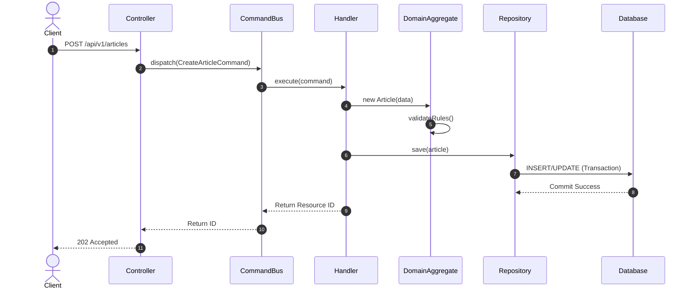

# Design Patterns
## Purpose
This document establishes the concrete code implementation patterns, coding guidelines, and software engineering principles governing the NewsOps Cloud codebase. It serves as a practical guide for backend engineers to write testable, decoupled, and highly maintainable application logic.

## Executive Summary
To prevent the modular monolith from devolving into a "big ball of mud," NewsOps Cloud enforces strict architectural separation of concerns. This is achieved by combining Domain-Driven Design (DDD) principles—specifically Aggregate Roots and Repositories—with NestJS's Dependency Injection framework. Complex transactions are handled via Command Query Responsibility Segregation (CQRS) workflows. These workflows isolate data modification from data retrieval, ensuring the platform remains performant under write-intensive publishing loads.

## Vision
The code vision is to decouple core business logic (the "domain") completely from infrastructure details, databases, and frameworks. By keeping the domain pure and relying on interfaces, NewsOps Cloud ensures that database systems, message queues, and external APIs can be swapped or refactored without modifying core business rules.

## Scope
This document covers:
- Dependency Injection (DI) configuration and lifetime scopes in NestJS.
- Strict compliance metrics for SOLID design guidelines.
- The Repository pattern implementation using TypeORM and pure domain interfaces.
- Command Query Responsibility Segregation (CQRS) command/query routing.
- Aggregate Roots and entity encapsulation rules.

It does not cover front-end design patterns, CSS methodologies, or infrastructural deployment scripts.

## Goals
- **Decoupled Architecture**: Domain models must have zero dependencies on TypeORM, NestJS decorators, or database-specific entities.
- **High Testability**: Unit test coverage for domain logic must be maintained at $\ge 90\%$.
- **CQRS Separation**: Complex write commands must be processed independently of simple read queries.
- **Atomic Consistency**: Write operations must occur on Aggregate Roots, guaranteeing transactional boundaries.

## Functional Requirements
- **Constructor Injection**: All dependencies within NestJS modules must be injected via constructors rather than properties.
- **Interface Segregation**: Repositories must implement interfaces defined in the domain layer, making the infrastructure layer a pluggable detail.
- **CQRS Bus Routing**: The application must route write operations through a Command Bus and read operations through a Query Bus.

## Non-Functional Requirements
- **Command Dispatch Overhead**: The memory latency introduced by the NestJS CQRS command bus must be $< 3\text{ ms}$.
- **Unit Test Execution Speed**: The entire unit test suite for any single domain module must complete in $< 5\text{ seconds}$.
- **Boot Time**: Application bootstrap and DI graph construction must complete in $< 10\text{ seconds}$ on standard container instances.

## Business Rules
- **Aggregate Root Encapsulation**: Child entities (e.g., `ArticleTag`, `ArticleTranslation`) must never be updated or saved directly through database queries. They must only be accessed and mutated through their parent Aggregate Root (`Article`).
- **No Shared Entities**: A domain module cannot directly query or import another module's SQL entity. Interaction must occur via the module's public API or events.
- **Immutable Commands**: CQRS Command payloads must be read-only structures with private/readonly fields.

## Actors
- **Backend Engineer**: Implements classes, writes unit tests, and complies with SOLID principles.
- **Tech Lead**: Reviews code architecture and ensures Aggregate boundaries are respected.
- **QA Automation Engineer**: Assesses functional entry points created by the CQRS structure.

## User Stories
- **User Story 1**: As a Backend Developer, I want to use constructor-based Dependency Injection so that I can inject mocked interfaces during unit testing without bootstrapping the database.
- **User Story 2**: As a Tech Lead, I want to routing all content updates through a Command Bus so that we can easily plug in auditing interceptors and transactional transaction boundaries.
- **User Story 3**: As a Domain Architect, I want to define the `Article` entity as an Aggregate Root so that publishing constraints (e.g., only verified editors can transition status to active) are evaluated in-memory and enforced atomically.

## Acceptance Criteria
- Unit tests for domain logic must run without initializing any DB connection or NestJS container (100% mocked dependencies).
- Direct import of TypeORM database decorators (e.g., `@Entity`, `@Column`) inside domain entity files (located in `src/domain/*`) is forbidden and must fail compile checks.
- Every CQRS handler must wrap write operations in a transaction block, rolling back fully if any step fails.

## Workflows
### Write-Side CQRS Execution Workflow
1. **Controller Ingestion**: The client POSTs a new article to `/api/v1/articles`.
2. **Command Dispatch**: The controller constructs a read-only `CreateArticleCommand` and dispatches it via the `CommandBus`.
3. **Guard & Pipe Validation**: NestJS pipes validate the command payload using decorators.
4. **Handler Execution**: The `CreateArticleHandler` catches the command, starts a database transaction, and instantiates a new `Article` Aggregate Root.
5. **Domain Processing**: The Aggregate Root runs its business rules (e.g., validates slug uniqueness) and changes its internal state.
6. **Repository Invocation**: The handler passes the mutated Aggregate Root to `ArticleRepository.save()`.
7. **Infrastructure Conversion**: The SQL Repository adapter maps the pure domain model into a SQL entity and commits the transaction to Postgres.
8. **Event Trigger**: The handler dispatches a `ArticleCreatedEvent` to the event stream, then returns the new ID to the controller.

## API Design
### CQRS Write API: Article Creation
* **URL**: `/api/v1/articles`
* **Method**: `POST`
* **Request Payload**:
```json
{
  "title": "Breaking News: Modular Monolith Scaling",
  "content": "This is a detailed analysis of NestJS scaling patterns...",
  "authorId": "a9a3b6f0-ea21-4f11-8209-7e45ad9e6022",
  "tags": ["architecture", "nestjs", "cloud"]
}
```
* **Response Payload (202 Accepted)**:
```json
{
  "commandId": "e22fa6b3-6c8a-4933-bf9b-3ee72465d8a9",
  "resourceId": "8f895cba-7a2e-4b68-8a8b-12d8a4392ef4",
  "status": "Accepted",
  "timestamp": "2026-06-27T22:15:30Z"
}
```

## Database Design
In keeping with DDD patterns, database mapping is encapsulated within the infrastructure layer. 

### Aggregate Root Mapping
- **Entity**: `articles` (Aggregate Root)
  - `id`: UUID (Primary Key)
  - `title`: VARCHAR(255)
  - `slug`: VARCHAR(255) (Unique Index)
  - `status`: VARCHAR(50)
  - `version`: INT (Used for optimistic locking: `LOCK_VERSION`)
- **Child Entity**: `article_translations`
  - `id`: UUID (Primary Key)
  - `article_id`: UUID (Foreign Key referencing `articles.id` ON DELETE CASCADE)
  - `locale`: VARCHAR(5)
  - `translated_content`: TEXT

The translation entity has no standalone repository. It is saved automatically when `ArticleRepository.save(article)` is executed.

## UI Design
To visualize code layout compliance, developers inspect the module directory layout:

```
src/article/
├── domain/
│   ├── entities/          # Pure aggregates (Article.ts)
│   ├── exceptions/        # Business rule exceptions
│   ├── repositories/      # Repository interfaces (IArticleRepository.ts)
│   └── value-objects/     # Immutable domain values (Slug.ts)
├── application/
│   ├── commands/          # CQRS Commands & Handlers
│   ├── queries/           # CQRS Queries & Handlers
│   └── events/            # Domain events
├── infrastructure/
│   ├── entities/          # TypeORM SQL Entities
│   └── repositories/      # Concrete SQL Repositories
└── article.module.ts      # NestJS DI wiring module
```

## Permissions
Execution of CQRS commands is governed by RBAC markers:
- `@RequirePermission('articles:create')`: Attached to command handlers to authorize users before transaction initialization.
- `@RequirePermission('articles:publish')`: Attached to specialized publish commands.

## Security
- **Strict Payload Validation**: `class-validator` enforces strict type checking (e.g., `@IsUUID()`, `@IsString()`, `@MaxLength(255)`) on command models prior to dispatch.
- **SQL Injection Prevention**: Repositories use parameterized queries via TypeORM's query builder. Raw query execution is prohibited.
- **Optimistic Locking**: Writing to aggregate roots enforces version tracking. If `version` in database is higher than the version read by the transaction, an `AggregateConflictException` is thrown, avoiding lost updates.

## Performance
- **Optimistic Locking Overhead**: Optimistic locking adds $<1\text{ ms}$ query execution overhead.
- **CQRS Bus Routing Limit**: The memory footprint of command and query buses must not exceed 2% of total container memory.
- **Garbage Collection**: Domain models are garbage collected immediately after request-response lifecycle completion, maintaining average memory footprint at $< 150\text{ MB}$ per application container.

## Monitoring
- **Prometheus Metric**: `cqrs_command_execution_duration_seconds` (Histogram tracking latency of command execution).
- **Prometheus Metric**: `cqrs_command_failures_total` (Counter tracking failed command executions categorized by exception types).
- **Alert Trigger**: Trigger Slack warning if `cqrs_command_failures_total` increases by $>5\%$ in a 5-minute window.

## Logging
Logging format enforces clean trace identification:
* **Log Pattern**: `{"timestamp": "%ISO8601%", "context": "CommandHandler", "command": "CreateArticleCommand", "id": "e22fa6b3", "state": "COMPLETED", "duration_ms": 42}`
* **Error Level**: `ERROR` for command business validation failures, `CRITICAL` for database transaction rollbacks.

## Error Handling
| Internal Exception | HTTP Status | Customer-Facing Message |
|:---|:---|:---|
| `DomainValidationException` | 400 Bad Request | Invalid input parameters provided. Please check domain constraints. |
| `AggregateConflictException` | 409 Conflict | The resource was modified by another request. Please reload and try again. |
| `RepositoryInaccessibleException` | 503 Service Unavailable | Database connection failed. Please retry shortly. |

## Edge Cases
- **Simultaneous Writes (Race Conditions)**: Two authors edit the same article concurrently. The first write succeeds and increments the entity version to `2`. The second write fails because it attempts to update version `1` to `2`. The system catches `AggregateConflictException` and returns a 409 HTTP status, preventing data loss.
- **Nested Domain Events**: Domain events triggered during command processing are accumulated in-memory and only published to the external queue *after* the database transaction commits successfully.

## Future Improvements
- **Outbox Pattern Service**: Transition from direct event publication in the handler to an outbox pattern, saving outbound events in an `outbox` database table within the same transaction to guarantee reliable delivery.
- **Read-Model Database Syncing**: Move read-side queries entirely to a read-optimized Elasticsearch index, leaving Postgres solely for write-side Aggregate mutations.

## Mermaid Diagrams
### CQRS Write-Side & Read-Side Sequences


## References
- System Topologies & Layers: [system_architecture.md](./system_architecture.md)
- Directory Index and Map: [index.md](./index.md)
- Event-Driven Queues: [event_driven_design.md](./event_driven_design.md)
