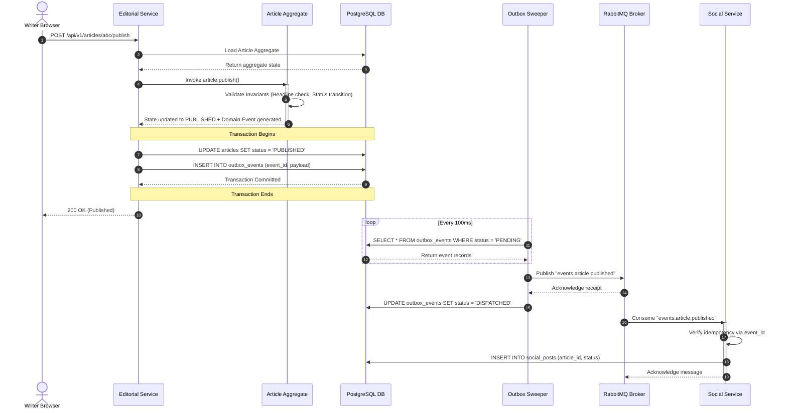
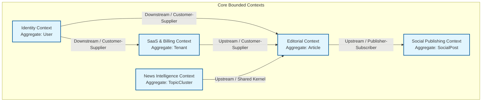

# Domain Driven Design
## Purpose
This document establishes the Domain-Driven Design (DDD) model and context mappings for the NewsOps Cloud digital publishing platform. It defines the boundaries of core domains, subdomains, and bounded contexts. Additionally, it specifies aggregate roots, internal entities, value objects, and the domain event interfaces required to ensure clean modularity and event-driven decoupling across the microservices ecosystem.

## Executive Summary
NewsOps Cloud is designed around modular, decoupled subdomains representing distinct business capabilities. By mapping out bounded contexts, we isolate domain logic and establish clear API and messaging contracts. The core domains include Identity & Access Management, SaaS & Billing, Editorial Studio, News Intelligence, and Social Distribution. Within these contexts, entities and aggregates (such as the `Article` or `Tenant`) maintain business invariants, while immutable value objects (like `EmailAddress` or `Money`) model critical domain data. Interactions between bounded contexts occur exclusively via asynchronous domain events using an Outbox pattern.

## Vision
The vision is to establish a domain model that aligns engineering codebases with real-world publishing workflows. By enforcing strict boundaries between contexts and preventing database-level coupling, the system permits individual service teams to refactor, scale, and deploy services independently, while ensuring that the overall digital publishing platform remains highly resilient, maintainable, and aligned with organizational objectives.

## Scope
The scope of this domain-driven design specification covers:
1. **Bounded Context Mapping**: Defining the domains, subdomains, and their communication patterns.
2. **Aggregate Roots & Entities**: Modelling the boundaries and identifiers for primary business objects.
3. **Value Objects**: Specifying immutable structures representing attributes without unique identities.
4. **Domain Event Interface**: Standardizing cross-context asynchronous messaging.
5. **Transactional Outbox Pattern**: Ensuring transactional consistency between state changes and event propagation.

## Goals
- **Decoupled Development**: Establish zero direct cross-context database dependency, forcing communication through public APIs or events.
- **Enforce Business Invariants**: Guarantee that aggregate roots manage all modifications of nested entities in a single ACID transaction.
- **Ubiquitous Language**: Standardize terminology (e.g. Tenant, Organization, Article, Revision, SocialPost) across code, databases, and product specifications.
- **Optimize Event Overhead**: Ensure domain event serialization and dispatch latencies add <= 5ms to write paths.

## Functional Requirements
- **Outbox Event Ingestion**: Automatically write domain events to an `outbox` database table within the same transaction that modifies the aggregate root state.
- **Invariant Enforcement**: The aggregate root must validate state transition logic (e.g., an `Article` cannot be published unless it contains at least one approved revision).
- **Asynchronous Event Routing**: Dispatch outbox events to the message broker (RabbitMQ) using specialized background sweepers.
- **Idempotent Consumption**: Subscribing contexts must check event IDs to prevent duplicate processing of the same event.

## Non-Functional Requirements
- **Context Isolation**: Services within distinct bounded contexts must utilize separate databases (or logically isolated schemas in multi-tenant Neon clusters).
- **Event Envelope Standardization**: Every domain event must adhere to a standardized JSON schema containing metadata headers (event ID, timestamp, tenant ID, origin).
- **Serialization Performance**: Outbox processing workers must run continuously, polling the outbox tables at 100ms intervals to keep transmission latency under 1 second.
- **Weak Coupling Relationships**: Context mappings must utilize clean patterns (e.g. Anti-Corruption Layers (ACL) when interfacing with legacy or external integrations).

## Business Rules
- **State Modification Bounds**: Client operations must never modify nested entities inside an aggregate root directly. All updates must flow through public methods exposed by the aggregate root.
- **Reference Constraints**: Aggregates in different bounded contexts can refer to each other only by ID (e.g., a `SocialPost` contains an `article_id` string, not a direct memory or foreign key reference to the `Article` aggregate).
- **Audit Logging**: Any state transition of the `Article` aggregate (e.g., from `InReview` to `Approved`) must register a domain event for historical logging.

## Actors
- **Content Writer**: Interacts with the Editorial Context to create and revise articles.
- **Social Media Coordinator**: Interacts with the Social Context to schedule and publish posts.
- **Organization Administrator**: Interacts with the SaaS/Billing Context to modify membership tiers and quotas.
- **AI Agent**: Interacts with the News Intelligence Context to parse news feeds and generate summaries.
- **Event Bus Dispatcher**: Internal system actor routing domain events between contexts.

## User Stories
- **Story 1 - Publishing Flow**: As a Content Writer, I want my finalized draft to trigger a validation check within the `Article` aggregate so that I cannot publish an incomplete story that lacks an author or headline.
- **Story 2 - Social Automation**: As a Social Media Coordinator, I want to queue a social media post automatically when an editor marks an article as published, without the CMS having to connect directly to the Facebook or LinkedIn API servers.
- **Story 3 - Usage Quotas**: As an Organization Administrator, I want our tenant storage limit to update automatically in the billing context when we upgrade our subscription plan, so that authors can immediately upload larger media files.

## Acceptance Criteria
- **AC-1 (Outbox Transaction)**: When an Article is updated, the writing operation must roll back completely if writing the corresponding `ArticlePublished` event to the `outbox_events` table fails.
- **AC-2 (Aggregate Isolation)**: Direct SQL joins across database boundaries (e.g., joining an `articles` table with a `billing_plans` table) are prohibited. All cross-boundary lookups must be resolved via API requests or cached replication tables.
- **AC-3 (Invariant Validation)**: The system must block attempts to transition an Article aggregate status directly from `Draft` to `Published` without going through the mandatory `InReview` check, raising a domain exception.
- **AC-4 (Event Idempotency)**: The consumer layer in the Social Context must drop incoming messages without executing actions if the `event_id` exists in the local `processed_events` table.

## Workflows
### Step-by-Step Cross-Context Editorial and Social Publishing Workflow
1. **Initiate Update**: A Content Writer clicks "Publish Article" in the Editorial Studio interface.
2. **Execute Domain Business Logic**:
   - The system retrieves the `Article` aggregate root from the database.
   - The application calls the `article.publish()` method on the aggregate.
   - The aggregate verifies its invariants: checks if the body is not empty, if an author is assigned, and if it is currently in `InReview` status.
3. **Commit Transaction**:
   - If invariants pass, the aggregate updates its status state to `Published`.
   - The repository layer creates an `ArticlePublishedEvent` payload.
   - The database transaction begins:
     - The system saves the updated `Article` aggregate state to the `articles` table.
     - The system inserts the serialized `ArticlePublishedEvent` into the `outbox_events` table.
     - The transaction is committed to PostgreSQL.
4. **Process Outbox**:
   - A background Outbox Sweeper worker polls the `outbox_events` table, reading the new record.
   - The sweeper publishes the event payload to the RabbitMQ exchange: `exchange.editorial` using routing key `events.article.published`.
   - Upon receiving confirmation from the broker, the sweeper marks the outbox record as `DISPATCHED`.
5. **Consume Event**:
   - The Social Distribution service consumes the `events.article.published` event from RabbitMQ.
   - The consumer verifies that the event has not been processed yet (idempotency check).
   - The service creates a new `SocialPost` aggregate in the Social Context containing the target `article_id`.
   - The system commits the new `SocialPost` state, placing it in the publishing queue scheduler.



## API Design
### Cross-Context Domain Event Envelope Schema
Domain events routed via RabbitMQ use this standardized structure:

- **Routing Key**: `events.article.published`
- **Exchange**: `exchange.editorial`
- **Payload Schema**:
  ```json
  {
    "event_id": "9c12a8b9-50c2-473d-bd83-f32bf5271a39",
    "event_type": "ArticlePublished",
    "timestamp": "2026-06-27T22:25:00Z",
    "tenant_id": "tenant-1",
    "origin_context": "EditorialContext",
    "schema_version": "1.0",
    "payload": {
      "article_id": "8c7f99d9-69b5-4422-95ab-f32bf5273d42",
      "organization_id": "org-1",
      "headline": "Breaking News: Major Architectural Update Released",
      "slug": "breaking-news-architectural-update",
      "author_id": "user-4829",
      "published_at": "2026-06-27T22:24:58Z",
      "primary_category": "technology",
      "thumbnail_url": "https://cdn.newsops.cloud/tenant-1/org-1/2026/06/thumb.jpg"
    }
  }
  ```

### Value Object Representation: Money (Billing Context)
JSON format demonstrating how value objects are nested inside entity models:
```json
{
  "amount": 29900,
  "currency": "USD",
  "formatted": "$299.00"
}
```

## Database Design
Schema models for the domain event outbox tables and tracking definitions:

```sql
-- Transactional Outbox Table for Domain Events
CREATE TABLE public.outbox_events (
    id UUID PRIMARY KEY DEFAULT gen_random_uuid(),
    event_id UUID NOT NULL UNIQUE,
    event_type VARCHAR(100) NOT NULL,
    tenant_id VARCHAR(50) NOT NULL,
    origin_context VARCHAR(100) NOT NULL,
    payload JSONB NOT NULL,
    status VARCHAR(20) NOT NULL DEFAULT 'PENDING', -- 'PENDING', 'DISPATCHED', 'FAILED'
    retry_count INT NOT NULL DEFAULT 0,
    error_log TEXT,
    created_at TIMESTAMP WITH TIME ZONE NOT NULL DEFAULT NOW(),
    processed_at TIMESTAMP WITH TIME ZONE
);

CREATE INDEX idx_outbox_status_created ON public.outbox_events(status, created_at ASC);
CREATE INDEX idx_outbox_tenant ON public.outbox_events(tenant_id);

-- Idempotent Consumer Log (for incoming duplicate detection)
CREATE TABLE public.processed_domain_events (
    event_id UUID PRIMARY KEY,
    consumer_context VARCHAR(100) NOT NULL,
    processed_at TIMESTAMP WITH TIME ZONE NOT NULL DEFAULT NOW()
);

CREATE INDEX idx_processed_events_time ON public.processed_domain_events(processed_at DESC);
```

## UI Design
Developers inspect domain event flows via the **DDD Domain Event Monitor** admin panel.
1. **Component Layout**:
   - **Context Map Health Grid**: A status dashboard showing the count of events passing through each context boundary (Editorial, Billing, Social, Identity).
   - **Outbox Queue Panel**: Lists the current outbox queue length and retry counts. Shows a warning indicator if pending items exceed 100.
   - **Event Log Table**: Lists dispatched events with column fields: `Time`, `Context`, `Event Type`, `Tenant`, `Status` (Dispatched, Pending, Failed).
   - **JSON Inspector Details**: Sidebar rendering the complete event envelope payload of a selected row. Includes a "Re-queue Event" action button.

2. **Actions**:
   - Selecting a failed event and clicking "Re-queue" resets the outbox record's state to `PENDING` and sets `retry_count = 0`.

3. **States**:
   - **Healthy State**: Counters show low delivery latency (average < 100ms) with green indicators.
   - **Warning State**: Queue size counters blink red when the outbox processing service becomes unavailable.

## Permissions
- `ddd:read_events`: Access event logging, payloads, and mapping diagnostics.
- `ddd:retry_events`: Permits developers to force resubmission of failed outbox items.
- `ddd:manage_schemas`: Modify or register new domain event schema contracts.

## Security
- **Event Signature Verification**: Event payloads can be cryptographically signed using an HMAC secret. Consumer contexts validate this signature to guarantee the message was sent by an authorized backend microservice.
- **Sensitive Data Scrubbing**: Ensure value objects containing PII (Personally Identifiable Information, e.g. email addresses, phone numbers) are encrypted or omitted from public domain event logs unless required by downstream systems.
- **SQL Outbox Injection Prevention**: Use parameterized query libraries when writing events to the database outbox tables.

## Performance
- **Target Latencies**:
  - Serialization to JSON payload: <= 1.5ms.
  - Outbox database write: <= 2ms.
  - Event dispatch loop: <= 100ms.
- **Throughput Capacity**: The Outbox Sweeper must support processing up to 3,000 events/second using batch operations (`UPDATE` with `RETURNING`).

## Monitoring
Prometheus domain metrics:
- `newsops_ddd_outbox_queue_length`: Total pending outbox events count.
- `newsops_ddd_events_dispatched_total{context, event_type}`: Total counter of events processed.
- `newsops_ddd_dispatch_failures_total{reason}`: Count of delivery failures to the broker.

*Alert Trigger Rules*:
- **Trigger**: `newsops_ddd_outbox_queue_length > 500` for 2 minutes.
  - *Action*: Alert warning: Domain event outbox queue size is backing up.
- **Trigger**: `newsops_ddd_dispatch_failures_total > 10` in 5 minutes.
  - *Action*: Alert critical: High failure rate in broker connection.

## Logging
Structured JSON logging configurations:
- **Info Level Log (Outbox Logged)**:
  ```json
  {"timestamp":"2026-06-27T22:25:01Z","level":"info","logger":"outbox_publisher","message":"Domain event written to outbox","event_id":"9c12a8b9-50c2-473d-bd83-f32bf5271a39","event_type":"ArticlePublished"}
  ```
- **Info Level Log (Broker Delivery)**:
  ```json
  {"timestamp":"2026-06-27T22:25:02Z","level":"info","logger":"outbox_sweeper","message":"Domain event sent to broker exchange","event_id":"9c12a8b9-50c2-473d-bd83-f32bf5271a39","routing_key":"events.article.published"}
  ```
- **Error Level Log (Schema Violation)**:
  ```json
  {"timestamp":"2026-06-27T22:25:03Z","level":"error","logger":"event_validator","message":"Incoming domain event failed schema validation","event_id":"9c12a8b9-50c2-473d-bd83-f32bf5271a39","error":"Field 'author_id' is missing"}
  ```

## Error Handling
| Internal Error Code | Triggering Scenario | HTTP Status | Customer-Facing Message |
|:---|:---|:---|:---|
| `DDD_INVARIANT_VIOLATION` | Aggregate checks fail during execution | 422 Unprocessable Entity | "Action aborted. The article does not meet the requirements for publishing." |
| `OUTBOX_WRITE_FAILED` | Database transaction failure saving the event | 500 Internal Error | "An error occurred while saving. Please try again in a few moments." |
| `EVENT_DUPLICATE` | Consumer receives an event ID that was already processed | 200 OK | "Event already processed. Skipping execution." (Ignored by consumer) |
| `SCHEMA_REGISTRY_ERROR` | Event validator cannot connect to the schema definition registry | 502 Bad Gateway | "Internal system sync issue. SRE team has been notified." |

## Edge Cases
- **Outbox Worker Crashing Mid-Dispatch**: The sweeper sends the event to RabbitMQ, but crashes before updating the outbox database status to `DISPATCHED`. *Mitigation*: Enable message acknowledgments in RabbitMQ. When restarting, the worker will reread the `PENDING` item and republish it. The consumer must rely on its local `processed_domain_events` uniqueness checks to guarantee at-least-once processing safety.
- **Aggregate Deletions and Eventual Consistency**: An editor deletes a category, but the social scheduler still holds articles associated with it. *Mitigation*: Cascade updates asynchronously. When a Category is deleted, publish a `CategoryDeleted` event, prompting the Social Context to adjust or un-queue affected social articles.
- **Version Skew in Event Schema**: Deploying a new service changes the `ArticlePublished` schema, but older subscriber contexts are still running. *Mitigation*: Enforce backward-compatible event mutations (only adding optional fields). For major changes, register a new version label (e.g. `schema_version: "2.0"`) and run secondary handlers in parallel.

## Future Improvements
- **Event Sourcing Implementation**: Transition the core Billing and Editorial Revision contexts to full event-sourced architectures, storing state as a sequence of events rather than snapshots to capture detailed histories.
- **Dynamic Context Topology Mapping**: Build automated visual maps of the platform by parsing domain event logs, letting engineers audit bounded context interactions dynamically.

## Mermaid Diagrams
### Context Mapping Diagram


## References
- [Database Schema Implementations](../03-database/schemas.md)
- [Caching Strategy and Invalidation Hooks](../02-architecture/caching_strategy.md)
- [SaaS Engine Architecture Specifications](../08-saas/index.md)
