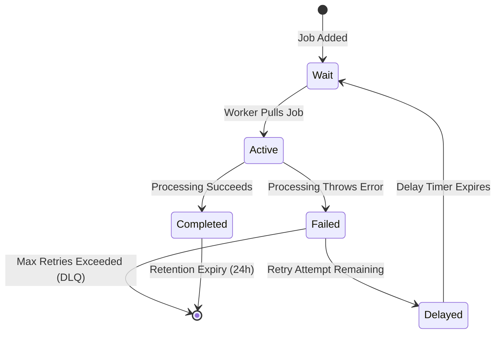

# Event-Driven Design
## Purpose
This document specifies the event-driven architecture, background processing systems, and messaging models of the NewsOps Cloud platform. It details the utilization of BullMQ and Redis to execute non-blocking, asynchronous tasks, guaranteeing high reliability, performance, and eventual consistency across domain boundaries.

## Executive Summary
To maintain responsive user interfaces and handle resource-intensive workflows (such as media processing, newsletter delivery, and search index updates), NewsOps Cloud delegates work to background job queues. The queue infrastructure is built on BullMQ, a Node.js queue library backed by Redis. Queues are split by domain and service level, allowing fine-grained control over concurrency limits, retry behavior, and system resource allocation.

## Vision
The long-term vision is to transition from an internal memory-backed event dispatcher to a fully decoupled event backbone. By standardizing event payloads, establishing strict JSON schema validation, and isolating workers from application entry points, the system remains prepared to swap or extend its transport layers (e.g., to Apache Kafka or RabbitMQ) without modifying the downstream consumer code.

## Scope
This document covers:
- The BullMQ queue names, responsibilities, and priority levels.
- Concurrency thresholds and worker scaling rules.
- Job retry strategies, backoff functions, and Dead Letter Queue (DLQ) policies.
- JSON schema validations for event models.
- Redis key topologies and memory utilization controls.

It does not cover basic Redis cluster installation steps or front-end event dispatchers (e.g., WebSockets).

## Goals
- **System Responsiveness**: Decouple slow transactions from the HTTP request loop, keeping API response times under $120\text{ ms}$.
- **At-Least-Once Delivery**: Guarantee that critical events (e.g., billing, publishing notifications) are processed successfully at least once.
- **Worker Isolation**: Ensure failures in background task processing do not affect the main application's web thread pools.
- **Idempotency**: Prevent duplicate executions by implementing deterministic job ID keys.

## Functional Requirements
- **Payload Validation Interceptor**: All incoming queue jobs must pass validation checks against registered schema definitions prior to processing.
- **Automatic Failure Recovery**: If a worker crashes or fails, the job must automatically transition to a delayed state for retry.
- **Manual Reprocessing Endpoint**: Operational teams must have access to endpoints to retrieve, inspect, and trigger retries for failed jobs.

## Non-Functional Requirements
- **Queue Propagation Latency**: Time from event dispatch to worker execution start must be $< 15\text{ ms}$ under nominal load.
- **Worker Throughput Capacity**: The queue workers must process a combined volume of at least 3,000 tasks per second.
- **Lock Management**: Job locks must be renewed automatically every 30 seconds to prevent workers from stalling.

## Business Rules
- **Exponential Backoff**: Transient errors (e.g., API rate limits, database lock timeouts) must use exponential backoff starting at 2,000 milliseconds.
- **Maximum Attempt Limits**: Non-critical jobs (e.g., analytics sync) are allowed a maximum of 3 retries. Critical jobs (e.g., payment webhooks) are allowed 5 retries.
- **Job Retention Timelines**: Completed jobs must be deleted from Redis after 24 hours to conserve memory. Failed jobs must be retained for 7 days for troubleshooting.

## Actors
- **Background Worker**: Node.js micro-process that consumes jobs from BullMQ.
- **DevOps Engineer**: Configures Redis memory allocations, sentinel failovers, and worker pod counts.
- **Backend Developer**: Writes job consumers, defines event schemas, and dispatches events.

## User Stories
- **User Story 1**: As a Backend Developer, I want to define a strict JSON schema for the `article.transcode` event so that I can prevent malformed payloads from breaking downstream workers.
- **User Story 2**: As an Operations Engineer, I want to restrict the notification queue worker concurrency to 5 active jobs per pod so that we do not overload external transactional email providers.
- **User Story 3**: As a Content Editor, I want my dashboard to immediately report "Publishing Started" while heavy S3 uploads and CDN invalidations run in the background, so that I don't have to wait on a loading screen.

## Acceptance Criteria
- BullMQ workers must validate job payloads using a Zod validator class; jobs with invalid payloads must be rejected immediately without execution attempts.
- The retry strategy must double the delay period on each failure (e.g., 2s, 4s, 8s, 16s, 32s).
- If a job exceeds its maximum retry count, it must be moved to the `failed` state and publish a slack alert metadata payload.

## Workflows
### BullMQ Job Lifecycle Workflow
1. **Instantiation**: A client triggers an action (e.g., uploading an article thumbnail).
2. **Payload Construction**: The application constructs a payload with a unique ID (`idempotency_key`).
3. **Queue Ingress**: The application pushes the job onto the `media-processing` queue.
4. **Redis Storage**: Redis registers the job in a sorted set (`bull:media:waiting`), maintaining priority order.
5. **Worker Pickup**: An idle `media-worker` instances pulls the job, sets a lock, and updates the status to `active`.
6. **Payload Validation**: The worker runs validation. If it fails, the job transitions to `failed` and terminates.
7. **Task Execution**: The worker downscales the image and pushes it to AWS S3.
8. **Completion**: If successful, the worker removes the lock, moves the job to `completed`, and updates the database.

## API Design
### Queue Management & Retry API
Used by developers and operation tools to manage failed tasks.

* **URL**: `/api/v1/queues/:queueName/jobs/:jobId/retry`
* **Method**: `POST`
* **Headers**:
  * `Authorization: Bearer <JWT>`
* **Response Payload (200 OK)**:
```json
{
  "queue": "media-processing",
  "jobId": "job_d9834b6c-c9d2-4322-901b",
  "status": "retrying",
  "originalAttemptCount": 3,
  "scheduledTimestamp": "2026-06-27T22:16:00Z"
}
```

* **Error Response (404 Not Found)**:
```json
{
  "statusCode": 404,
  "message": "Job job_d9834b6c-c9d2-4322-901b was not found in queue media-processing",
  "error": "Not Found"
}
```

## Database Design
BullMQ relies on Redis data structures rather than relational tables. The system utilizes specific key patterns inside the shared Redis cluster:

### Redis Keyspace Design (Namespace: `newsops-queues`)
- **Job Data Hash**: `bull:newsops-queues:media:jobs:<jobId>`
  - Contains fields: `name`, `data` (JSON payload), `opts` (retry configurations), `attemptsMade`, `failedReason`.
- **Waiting Queue (List)**: `bull:newsops-queues:media:wait`
  - List of job IDs waiting to be executed.
- **Active Queue (List)**: `bull:newsops-queues:media:active`
  - List of job IDs currently processing.
- **Delayed Jobs (Sorted Set)**: `bull:newsops-queues:media:delayed`
  - Sorted set where score is the epoch time when the job should run.
- **Failed Jobs (Set)**: `bull:newsops-queues:media:failed`
  - Set containing IDs of failed jobs.

## UI Design
To monitor queues, NewsOps Cloud exposes the `Bull-Board` operational dashboard:
- **Queue Overview Matrix**: Shows job count distributions across states: Active, Waiting, Completed, Failed, Delayed, and Paused.
- **Worker Load Indicator**: Displays active worker count per queue and processing speeds.
- **Failures Inspect Panel**: Lists stack traces of failed jobs, allowing administrators to click a button to edit payload parameters and trigger immediate retries.

## Permissions
Access to read queue states and manage jobs:
- `queues:read`: Permits viewing queue counts and job lists.
- `queues:manage`: Permits retrying, pausing, or deleting jobs inside the queues.

## Security
- **Secure Redis Connections**: Redis connections require strong passwords via the `AUTH` command and must be encrypted via TLS.
- **Payload Sanitization**: Workers must strip hazardous shell characters and sanitize input payloads to prevent command execution vulnerabilities.
- **No Sensitive Data**: Avoid queueing raw passwords or unencrypted credit card details; use secure reference tokens instead.

## Performance
- **Max Memory Limit**: The Redis instance runs with a `maxmemory` policy of `noeviction` for queue namespaces, guaranteeing jobs are not discarded under memory pressure.
- **Job Compression**: Payloads larger than $50\text{ KB}$ are compressed using gzip before serialization to minimize Redis memory footprint.
- **Concurrency Configurations**: 
  - `media-processing`: 5 workers per pod (CPU-bound).
  - `notifications`: 50 workers per pod (I/O-bound).

## Monitoring
- **Prometheus Metric**: `bullmq_queue_waiting_jobs` (Gauge tracking count of waiting jobs).
- **Prometheus Metric**: `bullmq_worker_execution_time_seconds` (Histogram monitoring worker runtime durations).
- **Alert Trigger**: Trigger Slack warning if `bullmq_queue_waiting_jobs > 500` for longer than 5 minutes.

## Logging
Structured worker log layout:
* **Log Pattern**: `{"timestamp": "%ISO8601%", "context": "QueueWorker", "queue": "media", "jobId": "job_d9834b6c", "attempt": 2, "message": "Starting image resizing task", "metadata": {"fileSize": 102432}}`
* **Error Level**: `WARN` for failed attempts, `ERROR` for ultimate job failures.

## Error Handling
| Internal Worker Exception | Strategy | Customer-Facing Action |
|:---|:---|:---|
| `TimeoutError` | Retry (Exponential Backoff) | Automated. System retries task. |
| `ValidationError` | Move directly to Failed (No Retry) | Admin notified to correct payload metadata. |
| `ThirdPartyApiBlocked` | Rate-limit delay (Wait 1 minute) | Worker delays queue consumption rate. |

## Edge Cases
- **Stalled Jobs (Worker Crash)**: If a worker process exits abruptly (e.g. Out of Memory error), the Redis lock expires after 30 seconds. BullMQ's active job checking mechanism identifies the stalled job, increments the stalled counter, and moves it back to `wait` or `failed`.
- **Redis Node Outage**: If the primary Redis replica crashes, NestJS queue connections auto-reconnect to the promoted master within 15 seconds, buffering new jobs locally in memory during the switch.

## Future Improvements
- **Service Auto-Scaling Workers**: Scale worker containers dynamically using Kubernetes KEDA based on the count of active/waiting jobs.
- **Schema Registry Sync**: Integrate dynamic schema validation with an external Schema Registry (e.g. Confluent or custom) to support multi-version event compatibility.

## Mermaid Diagrams
### BullMQ Job State Machine


## References
- Structural Map and Index: [index.md](./index.md)
- NestJS Monolith Architecture: [system_architecture.md](./system_architecture.md)
- Patterns & DI Rules: [design_patterns.md](./design_patterns.md)
