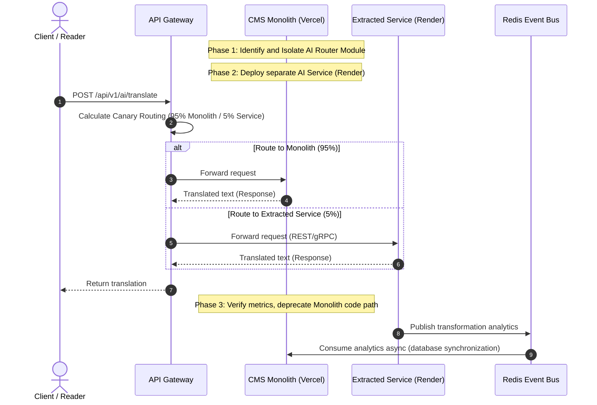

# Future-Proofing Plan and Technical Debt Management

## Purpose
This document establishes the technical governance roadmap, compiler/runtime upgrade protocols, monolithic-to-microservices decomposition playbook, and technical debt management practices for the NewsOps Cloud digital publishing platform. It serves as a guide for engineering leads to maintain system viability, performance, and security over a multi-year product life cycle.

## Executive Summary
Software systems naturally degrade over time if changes are not managed proactively. To prevent architectural rot, NewsOps Cloud adopts an active "Future-Proofing Plan". This framework specifies standard procedures for upgrading critical dependencies (Node.js, Next.js, Prisma), establishes a domain-driven roadmap for decomposing the MVP monolith into autonomous microservices, and institutes a formal process for tracking and paying down technical debt. By integrating technical debt metrics directly into the development cycle, the platform guarantees long-term maintainability while scaling.

## Vision
The vision of the NewsOps Cloud codebase is one of continuous evolution. Rather than waiting for system failures to trigger major rewrites, the codebase undergoes continuous, incremental refactoring and automated upgrades. This guarantees that news operations run on modern, secure, and performant frameworks at all times.

## Scope
This architectural plan covers:
1. **Runtime & Compiler Upgrade Pathways**: Protocols for upgrading Node.js LTS, Next.js, and Prisma ORM.
2. **Microservices Decomposition Playbook**: Transition routes to isolate core engines (Ingestion, AI Router, Publishing) into independent services.
3. **Technical Debt Management**: Systems to audit, catalog, and prioritize code quality fixes.
4. **API Versioning & Deprecation Schedule**: Policies for managing API life cycles.

This plan excludes product feature definitions, focus groups, and customer acquisition roadmaps, concentrating strictly on backend and system engineering hygiene.

## Goals
- **Zero-Downtime Upgrades**: Keep core dependencies updated with zero operational service interruption.
- **Microservices Extraction**: Define clear architectural boundaries so that modules can be extracted into microservices without rewriting code.
- **Maintain Technical Debt Ceilings**: Ensure the Technical Debt Ratio (TDR) stays below 5% across all code modules.
- **Enforce Security Patching**: Require all critical security vulnerabilities (CVEs) to be patched and deployed within 48 hours of detection.

## Functional Requirements
1. **Automated Dependency Auditing**: The CI/CD pipeline must run vulnerability scanners (e.g., `npm audit`, Snyk) on every commit and auto-block builds containing high or critical issues.
2. **Dynamic API Version Routing**: The API Gateway must parse incoming version request headers (e.g., `Accept: application/vnd.newsops.v2+json`) and route requests to corresponding version controllers.
3. **Refactoring Gatekeepers**: Static code analysis tools (ESLint, SonarQube) must evaluate code complexity and enforce boundaries, preventing circular dependencies between domain folders.
4. **Telemetry of Deprecated Routes**: Access to deprecated API endpoints must increment telemetry counters to notify the platform which tenants are still relying on legacy models.

## Non-Functional Requirements
1. **Upgrade Testing Overhead**: Test coverage must be maintained above 85% to ensure that compiler/runtime upgrades do not introduce silent regression bugs.
2. **Monolith Boot Latency**: Ensure the monolithic engine retains a fast startup time (under 5.0 seconds in containerized setups) to allow swift scaling operations.
3. **Deployment Separation**: The microservices transition path must support canary deployments, allowing traffic to be routed progressively (e.g., 1%, 10%, 100%) to newly extracted services.

## Business Rules
1. **Refactoring Budget**: 20% of engineering resources in every sprint must be dedicated to resolving issues logged in the Technical Debt Registry.
2. **API Deprecation Window**: Legacy API versions must remain supported for a minimum of 180 days following a formal deprecation announcement before retirement.
3. **Upgrade Cadence**: Node.js and Next.js major upgrades must be evaluated and scheduled within 90 days of their official stable release.

## Actors
- **Software Architect**: Designs service boundaries and establishes upgrade patterns.
- **Lead Software Engineer**: Conducts refactoring tasks and implements upgrades.
- **Release Manager**: Coordinates deployment schedules and manages deprecation timelines.
- **Security Auditor**: Verifies code integrity and scans for package vulnerabilities.

## User Stories
1. **Dependency Modernization**: As a Lead Software Engineer, I want to upgrade the Prisma ORM to the latest major version so that we can leverage new query performance improvements without breaking existing database queries.
2. **Monolith Extraction**: As a Software Architect, I want to isolate the AI Orchestration layer into its own microservice so that we can scale it independently of the CMS editorial dashboard.
3. **API Version Transition**: As a Release Manager, I want to monitor who is still hitting version 1 of our webhook ingestion endpoint so that we can help those customers migrate to version 2 before we retire the old code.

## Acceptance Criteria
1. **Technical Debt Threshold**: The platform's automated static analysis must calculate the Technical Debt Ratio (TDR = Remediation Effort / Development Effort) to be less than `5%` to allow release compilation.
2. **API Deprecation Alerts**: When a client calls a deprecated API endpoint, the response headers must include `Warning: 299 - "Deprecated API version, support ends on YYYY-MM-DD"` and log the caller.
3. **Canary Routing Accuracy**: The traffic routing layer must route traffic to newly extracted microservices in precise increments (e.g., `1%` intervals) without dropping active connections.
4. **Downtime Migration Ceiling**: Schema updates requiring schema alterations on high-traffic tables (e.g., `articles`) must utilize online migrations (e.g., pg-online-schema-change) to guarantee `zero downtime`.

## Workflows

### 1. Monolith-to-Microservice Decomposition (Decomposition Playbook)
- **Identify Target**: Identify a heavy module (e.g., `AI Router`) inside the monolithic codebase.
- **Establish Module Boundary**: Enforce strict isolation. The module must only access other monolith domains via internal interfaces (Services/Event Emitters), never via direct database imports.
- **Create Standalone Service**: Extract the code into a separate project directory, implementing identical interfaces using gRPC or HTTP REST.
- **Configure Database Isolation**: Fork or partition database access. The new service must not read or write to tables owned by the monolith; it must query the monolith API or use a dedicated database replica.
- **Implement Sidecar Proxy**: Deploy the new service behind the API Gateway.
- **Phase Traffic**: Direct 5% of requests to the new service, monitoring error rates. Scale to 100% over 7 days.
- **Clean Up**: Remove the legacy code paths from the monolithic repository.

### 2. Dependency Upgrade Workflow
- **Create Upgrade Branch**: Generate a separate branch `upgrade/nextjs-vX`.
- **Run Dependency Update**: Upgrade package manifest values.
- **Resolve Types & Compilation errors**: Fix breaking changes using automated codemods where available.
- **Run Test Suite**: Run unit, integration, and E2E contract tests.
- **Benchmark Performance**: Verify compilation times, bundle sizes, and API latencies against the Performance Budget limits.
- **Submit for Review**: Require sign-off from both Security and Architecture leads before staging deployment.

## API Design

### 1. Register and Track Technical Debt
- **Method**: `POST`
- **Path**: `/api/v1/architecture/tech-debt`
- **Headers**:
  - `Content-Type`: `application/json`
  - `Authorization`: `Bearer JWT_TOKEN`
- **Request Body**:
```json
{
  "module_name": "editorial-cms-editor",
  "issue_description": "Legacy collaborative editor lacks multi-document lock mechanisms, causing sync collisions.",
  "severity": "high",
  "remediation_estimate_hours": 24.0,
  "file_paths": [
    "src/modules/editorial/editor.ts",
    "src/modules/editorial/sync.ts"
  ]
}
```
- **Response (201 Created)**:
```json
{
  "status": "success",
  "debt_id": "debt_uuid_998877",
  "technical_debt_ratio": 4.15,
  "created_at": "2026-06-27T17:15:00Z"
}
```

### 2. Query Active API Versions and Deprecations
- **Method**: `GET`
- **Path**: `/api/v1/architecture/api-lifecycle`
- **Headers**:
  - `Authorization`: `Bearer JWT_TOKEN`
- **Response (200 OK)**:
```json
{
  "current_active_versions": ["v1", "v2"],
  "lifecycle_rules": [
    {
      "version": "v1",
      "status": "deprecated",
      "announced_at": "2026-01-01T00:00:00Z",
      "sunset_date": "2026-08-31T23:59:59Z",
      "replacement_version": "v2",
      "hits_last_30_days": 12450
    },
    {
      "version": "v2",
      "status": "active",
      "announced_at": "2026-01-01T00:00:00Z",
      "sunset_date": null,
      "replacement_version": null,
      "hits_last_30_days": 894520
    }
  ]
}
```

## Database Design

### Schema Design
The governance tracking components require schemas to keep track of active architectural status and code metrics:

```sql
-- Technical Debt Log Table
CREATE TABLE system_technical_debts (
    id UUID PRIMARY KEY DEFAULT gen_random_uuid(),
    module_name VARCHAR(150) NOT NULL,
    issue_description TEXT NOT NULL,
    severity VARCHAR(50) NOT NULL CHECK (severity IN ('low', 'medium', 'high', 'critical')),
    remediation_estimate_hours DECIMAL(6,2) NOT NULL,
    file_paths TEXT[] NOT NULL,
    status VARCHAR(50) NOT NULL DEFAULT 'open', -- 'open', 'in_progress', 'resolved'
    logged_at TIMESTAMP WITH TIME ZONE DEFAULT CURRENT_TIMESTAMP,
    resolved_at TIMESTAMP WITH TIME ZONE
);

CREATE INDEX idx_techdebt_status_severity ON system_technical_debts(status, severity);

-- API Version Deprecation Trackers
CREATE TABLE api_version_telemetry (
    id UUID PRIMARY KEY DEFAULT gen_random_uuid(),
    api_path VARCHAR(255) NOT NULL,
    api_version VARCHAR(20) NOT NULL,
    tenant_id UUID NOT NULL,
    request_counter INT DEFAULT 1,
    last_requested_at TIMESTAMP WITH TIME ZONE DEFAULT CURRENT_TIMESTAMP,
    CONSTRAINT unique_path_version_tenant UNIQUE (api_path, api_version, tenant_id)
);

CREATE INDEX idx_api_telemetry_version ON api_version_telemetry(api_version);
```

## UI Design
To visualize code health and migration schedules, NewsOps includes an "Architecture & Maintenance" panel.

### Component Structure
1. **Technical Debt Dashboard**: Displays the total accumulated refactoring backlog in hours. Includes a line chart tracking the TDR percentage over sprints.
2. **Decomposition Status Map**: A node diagram demonstrating dependencies between core modules. Extracted microservices are highlighted in green, while monolithic modules are orange.
3. **Deprecation Telemetry Tracker**: A table showing active callers of deprecated endpoints, sorted by tenant ID and request volume.
4. **Upgrade Coordinator**: Integrates with npm packages, displaying current compiler and runtime versions, highlighting available security patches.

## Permissions
Governance settings require the highest level of authorization:
- `System Architect / Super Administrator`:
  - `system:upgrade` (Allows executing updates and deprecating endpoints)
  - `techdebt:read`
  - `techdebt:write`
- `Lead Software Engineer`:
  - `techdebt:read`
  - `techdebt:write`

## Security
1. **Upgrade Integrity checks**: During compiler/dependency updates, the lockfiles (`package-lock.json` or `pnpm-lock.yaml`) must be checked for checksum verification. Package lock mutation is forbidden in PR branches unless audited.
2. **Dynamic Vulnerability Blocking**: Integrate SonarQube / Dependabot alerts. Any code pull request that introduces dependencies with known CVEs exceeding a CVSS rating of `7.0` is blocked at the gateway.
3. **Token Scoping During Migration**: When extracting microservices, tokens passed between services must be scoped strictly using mutual TLS (mTLS) or localized micro-service JWT credentials.

## Performance
- **Deprecated Endpoint Throttling**: Deprecated API endpoints are subject to dynamic rate limits (`50% lower` than active endpoints) to incentivize tenants to migrate.
- **Canary Overhead Management**: Routing proxies must run routing calculations within `3ms` using lightweight edge handlers.
- **Database Partition Separation**: During database separation (decomposition), cross-service joins are blocked. Aggregate performance metrics must be built using async event data duplication.

## Monitoring
We monitor dependency and code health via SonarQube metrics and runtime checks:
- `newsops_technical_debt_hours`: Gauge tracking estimated remediation time.
- `newsops_deprecated_api_hits_total{version, tenant_id}`: Counter tracking requests to legacy APIs.
- `newsops_service_cpu_utilization_ratio{service_name}`: Compares monolithic vs. extracted service CPU consumption.

### Alert Triggers
- **Refactoring Overdue Alert**: Fires if `newsops_technical_debt_hours` exceeds 200 hours.
- **Sunsetting Critical Call**: Fires if an API version with < 30 days remaining before sunset receives > 1,000 calls/day.

## Logging
Logging records warn when legacy code paths are accessed:
```json
{
  "timestamp": "2026-06-27T17:18:00.654Z",
  "level": "WARN",
  "context": "api-gateway-lifecycle",
  "api_version": "v1",
  "api_path": "/api/v1/integrations/webhooks/ingest",
  "caller_tenant": "tenant_uuid_12345",
  "sunset_date": "2026-08-31T23:59:59Z",
  "message": "Access to deprecated API version detected."
}
```

## Error Handling

| System Error Code | Source Component | HTTP Status | Customer-Facing Message |
| :--- | :--- | :--- | :--- |
| `ERR_API_VERSION_RETIRED` | API Gateway | 410 Gone | The API version requested has been permanently retired. Please upgrade to v2. |
| `ERR_VERSION_MISMATCH` | App Compiler | 500 Internal Server Error | Internal configuration mismatch. Runtime engine does not support this version. |
| `ERR_REFUSED_BY_LINTER` | CI/CD Runner | 400 Bad Request | Code merge blocked due to Technical Debt Ratio limit violation. |
| `ERR_MIGRATION_LOCK` | Database Engine | 503 Service Unavailable | Database is running schema updates. Temporary read-only lock active. |

## Edge Cases
1. **Breaking Database Migrations**: A database migration removes a column used by old versions of the code still running on older pods. To resolve this, we enforce a **Three-Phase Migration Process**:
   - *Phase 1*: Deploy code that stops writing to/reading from the column but keeps it in place.
   - *Phase 2*: Run the database migration to remove database constraints and set the column to nullable.
   - *Phase 3*: Run the database migration to drop the column once all instances of Phase 1 code are active.
2. **Circular Dependencies During Extraction**: If module A and module B reference each other's database models, direct microservice extraction fails. To resolve this, code paths must be rewritten to communicate asynchronously using an intermediate Event Broker before the extraction starts.
3. **Framework Locking**: If a dependency update breaks third-party plugins, developers can declare exception flags in `package.json` configurations. However, exceptions are valid for a maximum of one minor release cycle.

## Future Improvements
1. **Automated Codemod Generation**: Implement localized codemods (using JSCodeShift) to automatically transform outdated Javascript/Typescript files to modern syntax.
2. **gRPC Interface Standardization**: Transition internal microservices communication from REST to gRPC over HTTP/2, reducing internal serialization latency to under 1ms.
3. **Database Federation**: Shift from single PostgreSQL instances with schemas to a federated database topology, giving each extracted microservice a completely isolated database store.

## Mermaid Diagrams

### Monolith to Microservice Decomposition Pattern



## References
- [System Architecture](../02-architecture/index.md)
- [Performance Budget](../02-architecture/performance_budget.md)
- [Zero Cost MVP Architecture](../02-architecture/zero_cost_mvp_architecture.md)
