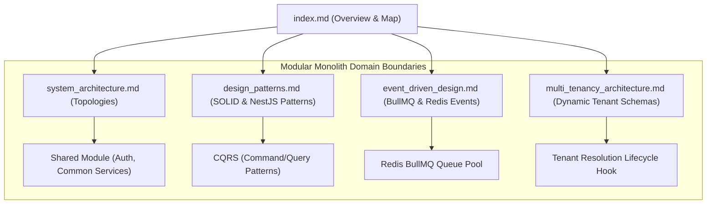

# Architecture Overview
## Purpose
This document serves as the primary index and navigational map for the `02-architecture` directory within the NewsOps Cloud digital publishing operating system's technical documentation. Its purpose is to outline the structural blueprint, establish domain boundaries, and provide an overview of the system's foundational design concepts, ensuring developers, architects, and operators can quickly locate critical technical details.

## Executive Summary
NewsOps Cloud is engineered as a highly scalable, multi-tenant digital publishing platform. To manage complexity and facilitate team autonomy, the platform utilizes a NestJS-based modular monolith pattern. This approach allows logical isolation of core business capabilities—such as user management, content authoring, asset distribution, and analytics—while maintaining a single deployment artifact. This documentation directory maps out the engineering standards, patterns, event-driven infrastructure, and multi-tenancy models that allow this monolith to operate efficiently and scale seamlessly into a microservices topology when required.

## Vision
The architectural vision for NewsOps Cloud is to provide a zero-downtime, sub-second latency publishing engine that combines the developer velocity of a monolith with the operational scaling characteristics of microservices. By enforcing rigid boundaries at the NestJS module level and relying on asynchronous messaging (via BullMQ and Redis) for cross-domain communication, the system can dynamically split into independent, containerized services without requiring major code refactoring.

## Scope
The architecture documentation covers:
1. **System Topology & Physical Deployment** (`system_architecture.md`): Modular monolith structure, deployment layers, shared data stores, and microservice transition strategies.
2. **Design Patterns** (`design_patterns.md`): Dependency injection, SOLID compliance, Repository patterns, CQRS, and aggregate roots.
3. **Event-Driven Design** (`event_driven_design.md`): Queueing topologies, BullMQ, job lifecycles, and serialization models.
4. **Multi-Tenancy Architecture** (`multi_tenancy_architecture.md`): Tenant isolation patterns, dynamic schema routing, and middleware request lifecycles.

It specifically excludes functional business code, product feature specs (found in `01-business`), and low-level devops deployment configuration files.

## Goals
- **Maintainability**: Maintain dependency-cruiser validation with zero cyclic dependencies between modules.
- **Microservices Readiness**: Ensure any NestJS module can be extracted into a separate service with less than 24 engineering hours of refactoring.
- **Tenant Isolation**: Achieve 100% database/schema-level logical segregation for Enterprise-tier tenants.
- **Event-Driven Resilience**: Maintain message delivery guarantees with automatic retry schedules and Dead Letter Queue (DLQ) ingestion.

## Functional Requirements
- **Directory Verification**: The documentation build pipeline must verify that all four sub-files are referenced and reachable.
- **Architectural Mapping**: The system must provide a programmatic `/api/v1/architecture/modules` endpoint that returns the runtime dependency tree of the NestJS modular application.
- **Dependency Cruising**: Automatic checks must scan pull requests to verify no cross-module database joins or forbidden imports occur.

## Non-Functional Requirements
- **Documentation Build Speed**: mkdocs compile time for the architecture suite must be under 15 seconds.
- **Module Endpoint Latency**: The architecture catalog metadata endpoint must respond in $< 50\text{ ms}$ under 500 concurrent requests.
- **Diagram Readability**: All architectural flowcharts must use standardized Mermaid syntax conforming strictly to the repository's rendering engine.

## Business Rules
- **ADR Process**: Any significant deviation from these architectural patterns must be documented via an Architecture Decision Record (ADR) and approved by the Architecture Review Board (ARB).
- **Module Independence**: No NestJS module may import services from another module directly unless it is a designated `SharedModule`. Dynamic data fetching must occur via events or internal commands.
- **Database Schema Ownership**: Each module owns its schema tables. No cross-module database tables may be queried via SQL joins.

## Actors
- **Backend Developer**: Contributes code, implements design patterns, and follows the architectural guidelines.
- **DevOps/SRE Engineer**: Oversees deployment topologies, Redis configurations, and monitoring setups.
- **System Architect**: Defines modular boundaries, reviews ADRs, and ensures the code conforms to structural goals.
- **Security Auditor**: Validates tenant isolation logic and access control models.

## User Stories
- **User Story 1**: As a Backend Developer, I want to review the directory map and core patterns so that I can properly structure a new publishing module without violating monolithic boundaries.
- **User Story 2**: As a DevOps Engineer, I want to understand the deployment layout and shared Redis/database boundaries so that I can configure adequate autoscaling groups and connection pool sizing.
- **User Story 3**: As a System Architect, I want to query a unified API endpoint mapping the modular dependency tree so that I can visualize and monitor the internal software architecture in our internal developer portal (e.g., Backstage).

## Acceptance Criteria
- The index page must accurately link to all four sub-documents using valid relative paths.
- The module registry API must return a JSON representation of all NestJS modules, their imported modules, and event subscriptions with a schema validation success rate of 100%.
- System tests must verify that no cycle is introduced into the NestJS dependency graph, failing the CI/CD pipeline if a cycle index $> 0$ is detected.

## Workflows
1. **Module Scaffolding Workflow**:
   - A developer creates a new domain directory using the CLI generator.
   - The CLI generator automatically appends a module descriptor to the dynamic architecture registry.
   - CI runs a verification workflow utilizing `dependency-cruiser` to confirm the new module adheres to domain boundaries.
2. **Metadata Cataloging Workflow**:
   - At system boot, the NestJS `DiscoveryService` scans all registered controllers, resolvers, and modules.
   - The system populates an in-memory graph representation of the architecture topology.
   - The `/api/v1/architecture/modules` endpoint serves this cached graph representation to developer consoles.

## API Design
### System Architecture Module Registry
Endpoint to fetch the runtime registration and boundary configuration of all active domains.

* **URL**: `/api/v1/architecture/modules`
* **Method**: `GET`
* **Headers**:
  * `Authorization: Bearer <JWT>`
  * `X-Tenant-ID: system`
* **Response Payload (200 OK)**:
```json
{
  "system": "NewsOps Cloud",
  "version": "1.4.0",
  "modules": [
    {
      "name": "AuthModule",
      "boundaryType": "Shared",
      "dependencies": [],
      "exports": ["AuthService", "JwtStrategy"],
      "eventsPublished": ["auth.user.logged_in"],
      "eventsSubscribed": []
    },
    {
      "name": "ArticleModule",
      "boundaryType": "Domain",
      "dependencies": ["AuthModule", "SharedModule"],
      "exports": ["ArticleService"],
      "eventsPublished": ["article.created", "article.published"],
      "eventsSubscribed": ["tenant.schema.migrated"]
    }
  ]
}
```

* **Error Response (403 Forbidden)**:
```json
{
  "statusCode": 403,
  "message": "Access denied: Architecture metadata requires system-level authorization.",
  "error": "Forbidden"
}
```

## Database Design
To catalog architecture definitions dynamically, the architecture registry uses the following relational tables in the master administrative database:

### `system_modules` Table
Holds the metadata of each registered NestJS module in the monolith.
* `id`: UUID (Primary Key, Index)
* `name`: VARCHAR(100) (Unique, Index)
* `boundary_type`: VARCHAR(50) (e.g., 'Domain', 'Shared', 'Infrastructure')
* `description`: TEXT
* `created_at`: TIMESTAMP WITH TIME ZONE

### `module_dependencies` Table
Maps dependencies between modules to trace architectural violations.
* `parent_module_id`: UUID (Foreign Key to `system_modules`, Index)
* `child_module_id`: UUID (Foreign Key to `system_modules`, Index)

## UI Design
The Developer Portal architecture visualizer consists of:
- **Module Topology Graph**: An interactive node-based graph rendering modules and their relationships. Clicking a node displays exported classes, events, and DB tables.
- **Boundary Violation Panel**: Red alerts showing any imports that cross domains illegally (e.g., `ArticleModule` importing `BillingService` directly instead of publishing a billing event).
- **Metric Badges**: Real-time indicators showing test coverage, cyclomatic complexity, and microservice transition readiness score.

## Permissions
Access to architecture governance metadata is restricted to system administrators and lead architects:
- `architecture:read`: Grants access to fetch modular topology maps.
- `architecture:write`: Grants access to register new system modules or alter boundary configurations dynamically.

## Security
- **Data Protection**: The topology API does not expose source code directories, internal IP addresses, or secrets.
- **Access Control**: Requests are authenticated via JSON Web Tokens (JWT) validating the client has administrative scopes.
- **Input Validation**: No inputs are accepted on the architecture GET API, mitigating injection vectors.

## Performance
- **Response Time**: Target latency for `/api/v1/architecture/modules` is $< 30\text{ ms}$.
- **Caching**: The topology graph is generated once at application bootstrap and cached indefinitely in memory. Cache invalidation occurs only on application redeployment.
- **TPS Limit**: The endpoint is throttled to 20 requests per minute per IP to prevent DDoS attempts.

## Monitoring
- **Prometheus Metric**: `architecture_catalog_requests_total` (counter tracing hits to the topology registry).
- **Prometheus Metric**: `architecture_boundary_violations` (gauge indicating number of active cyclic dependencies in the codebase).
- **Alert Trigger**: If `architecture_boundary_violations > 0` during a CI run, trigger a critical Slack and PagerDuty alert to the Architecture Review Board.

## Logging
Logging formatting uses structured JSON format:
* **Log Pattern**: `{"timestamp": "%ISO8601%", "level": "WARN", "context": "ArchRegistry", "message": "Cyclic dependency detected between ArticleModule and CommentModule", "metadata": {"cycle": ["ArticleModule", "CommentModule", "ArticleModule"]}}`
* **Error Level**: `ERROR` for cycles, `WARN` for deprecated module imports, `INFO` for topology graph construction success.

## Error Handling
| Internal Error Code | HTTP Status | Customer-Facing Message |
|:---|:---|:---|
| `ERR_CYCLE_DETECTED` | 500 Internal Error | A circular dependency was detected in the system module topology. Deployment halted. |
| `ERR_FORBIDDEN_IMPORT` | 400 Bad Request | Invalid module import path. Please refer to design_patterns.md for boundary rules. |
| `ERR_TENANT_CONTEXT_MISSING` | 401 Unauthorized | Multi-tenancy context is missing. Action must specify a valid tenant header. |

## Edge Cases
- **Dynamic Module Loading**: If a tenant-specific module is dynamically registered at runtime, the in-memory registry must lock the cache, recompute the graph safely using a read-write mutex lock, and reload the topology map to avoid race conditions.
- **CI Dependency Divergence**: When multiple pull requests merge simultaneously, cyclic checks are enforced at merge-train levels to guarantee main branch integrity.

## Future Improvements
- **Automated Monolith-to-Microservice CLI Tool**: An automated generator that extracts a defined NestJS domain module, sets up its own `main.ts`, bundles its TypeORM connections, maps event-driven ports to microservice entrypoints, and generates a Dockerfile automatically.
- **Live Event Mapping**: Integrates dynamic OpenTelemetry tracing with the architecture map to highlight active message volume routes in real time.

## Mermaid Diagrams
Below is the dependency topology flow mapping the relationship of documents and modules:



## References
- System Topology & Deployment Details: [system_architecture.md](./system_architecture.md)
- NestJS & SOLID Design Guidelines: [design_patterns.md](./design_patterns.md)
- BullMQ Event Queueing Models: [event_driven_design.md](./event_driven_design.md)
- Dynamic Multitenancy and Routing: [multi_tenancy_architecture.md](./multi_tenancy_architecture.md)
