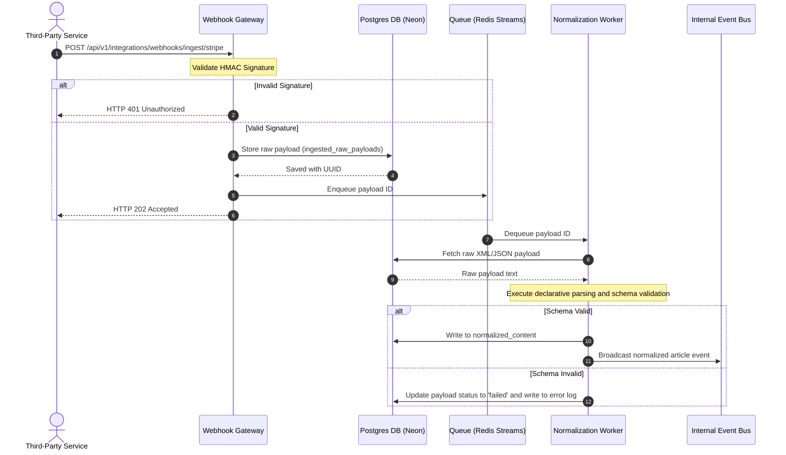

# Integration Design with Third-Party Networks

## Purpose
This document specifies the integration architecture, protocols, and data flow pipelines for connecting the NewsOps Cloud digital publishing platform to third-party news sources, wire services, social media networks, and external SaaS platforms. It details webhook ingestion, SOAP proxies for legacy wire services, REST polling workers, and the ingestion-to-normalization message pipelines.

## Executive Summary
NewsOps Cloud requires seamless, resilient, and multi-tenant integrations with a wide variety of third-party networks. These integrations span modern platforms using REST and Webhooks (such as Meta Graph API, LinkedIn API, Stripe) and legacy wire services using SOAP or XML/TCP feeds (such as the Associated Press WebFeeds and Reuters Media Express). This document establishes a unified, event-driven integration architecture. By utilizing message queues, secure proxy wrappers, and a declarative normalization engine, the system ensures that disparate third-party data structures are converted into a standardized, internal format without blocking CMS core operations or risking security breaches.

## Vision
The vision of the integration architecture is to provide an extensible, highly reliable, and near-zero latency pipeline that abstracts the complexities of third-party APIs. Editors and automated agents should interact with a single, clean content model, regardless of whether the source content was pushed via a webhook, pulled via a legacy SOAP endpoint, or scraped from an RSS feed.

## Scope
This design covers:
1. Webhook ingestion gateways with validation engines (HMAC, signature verification).
2. REST polling engines for RSS feeds, custom APIs, and rate-limited platforms.
3. SOAP proxy wrappers translating legacy wire service requests into RESTful paradigms.
4. Normalization pipelines powered by schema-based transformation rules.
5. Error-handling, dead-letter queuing (DLQ), and manual reprocessing mechanics.

This design excludes the details of core database persistence engines and UI collaborative editors, focusing entirely on the boundaries and data ingestion pipelines.

## Goals
- **High Throughput / Low Latency**: Process webhooks in under 100ms at the gateway and normalize messages in under 500ms.
- **Resilience**: Guarantee at-least-once delivery using message queues, retries, and dead-letter queues.
- **Security**: Eliminate vulnerabilities like XML External Entity (XXE) injection from SOAP payloads and validate all webhook payload signatures.
- **Maintainability**: Enable new integrations to be added via declarative schema configuration instead of writing custom parser code.

## Functional Requirements
1. **Dynamic Webhook Gateways**: The system must expose tenant-specific webhook endpoints that authenticate payloads using provider-specific signatures (e.g., Stripe-Signature, GitHub-Signature, custom HMAC-SHA256 tokens).
2. **SOAP Web Service Wrappers**: The system must proxy requests to legacy SOAP-based news wires (e.g., AP WebFeeds), handling WS-Security headers, XML formatting, and converting the responses into clean JSON formats.
3. **REST/RSS Polling Daemon**: A distributed scheduler must run periodic polling tasks across registered endpoints (e.g., RSS, Atom, REST feeds) respecting HTTP caching headers (`ETag`, `Last-Modified`) and back-off parameters.
4. **Declarative Normalization Pipeline**: Raw data ingested from any source must pass through a schema-based mapper that aligns properties (e.g., raw titles, HTML bodies, creator IDs, published timestamps) with the core NewsOps schema.
5. **Dead-Letter Queue & Reprocessing**: Any payload that fails validation, parsing, or normalization must be logged, sent to a dead-letter queue, and made available for manual editing and reprocessing through a central operator UI.

## Non-Functional Requirements
1. **Throughput Capacity**: The webhook gateway must handle a sustained load of 2,000 Transactions Per Second (TPS) with peak surges up to 5,000 TPS.
2. **Reliability & Availability**: Ingestion services must achieve 99.99% availability, utilizing autoscaling ingress nodes.
3. **Message Ordering**: For specific updates (e.g., content edits), the system must preserve event sequence order per source entity ID using partitioned queues.
4. **Data Isolation**: The integration engine must strictly segregate payloads based on tenant IDs to ensure no cross-tenant leakage occurs during normalization or storage.

## Business Rules
1. **License Compliance**: Ingested wire content (AP/Reuters) must retain its original metadata, copy restrictions, and expiration timestamps. Ingested wire stories must be auto-deleted or archived strictly in accordance with individual tenant subscription packages.
2. **Rate Limit Adherence**: Outbound polling tasks must adhere to target host rate limits. If a target host returns an HTTP 429 status, the scheduler must automatically apply exponential backoff.
3. **Human-in-the-Loop (HITL)**: Wire stories matching specific priority criteria can auto-draft, but no raw third-party content may be auto-published to public facing endpoints without editor authorization.

## Actors
- **Wire Service Provider**: Delivers syndication stories via SOAP endpoints or FTP feeds.
- **Webhook Producer**: Third-party SaaS tools (e.g., Stripe, Disqus, social networks) sending event notifications.
- **Scheduler Service**: The internal daemon that triggers periodic polling jobs.
- **Newsroom Editor**: Configures feeds, reviews incoming wire flows, and manages DLQ payloads.
- **System Administrator**: Configures global API keys, rate limits, and network proxies.

## User Stories
1. **Wire Story Ingestion**: As a Newsroom Editor, I want to automatically receive Associated Press wire stories in my CMS workspace in near-real-time so that I can quickly adapt and publish breaking news.
2. **Webhook Event Processing**: As a System Administrator, I want to securely ingest and verify webhooks from social media platforms (e.g., when our posts are shared or commented on) so that our social engagement dashboard remains accurate.
3. **Manual Reprocessing**: As a Newsroom Editor, I want to view a dashboard of failed incoming feed items, fix validation errors (e.g., missing mandatory authors), and reprocess them so that we do not lose valuable content.

## Acceptance Criteria
1. **SOAP Wrapper Latency**: The SOAP wrapper service must parse and return a converted JSON response from an external SOAP web service in less than 2.0 seconds under a simulated 100 concurrent user load.
2. **Webhook Signature Validation**: Every incoming webhook request to `/api/v1/integrations/webhooks/ingest/*` must be validated using HMAC-SHA256 signature verification. If the signature is invalid, the API must reject the request with HTTP 401 Unauthorized within 50ms.
3. **Ingestion Durability**: All successfully received raw payloads must be persisted to the `ingested_raw_payloads` table before being processed by the worker queues.
4. **Zero XML Vulnerabilities**: The SOAP proxy service must reject XML payloads containing `DOCTYPE` declarations or inline entity definitions, return HTTP 400 Bad Request, and raise a security alert.

## Workflows
1. **Webhook Ingestion Workflow**:
   - The third-party platform sends an HTTP POST request to `/api/v1/integrations/webhooks/ingest/{provider}`.
   - The API Gateway routes the request to the Webhook Ingestion Service.
   - The service fetches the tenant configuration and secret key.
   - The service calculates the HMAC signature and compares it with the incoming header.
   - On success, the raw body and headers are written to the database (`ingested_raw_payloads`) and a message is pushed to the ingestion queue (e.g., Redis Stream or RabbitMQ). The API returns HTTP 202 Accepted.
   - On signature failure, the API returns HTTP 401 Unauthorized and logs the attempt.
2. **SOAP Ingestion Workflow**:
   - The Scheduler triggers the SOAP Proxy Service to fetch the latest wire items.
   - The SOAP Proxy builds an XML SOAP Envelope containing WS-Security headers and the requested parameters.
   - The SOAP Proxy dispatches the POST request to the external wire service's SOAP endpoint.
   - The external service returns an XML SOAP Response.
   - The SOAP Proxy parses the response (rejecting any XXE attempts), extracts the body, and converts the XML nodes into a structured JSON payload.
   - The JSON payload is stored in the database and queued for normalization.

## API Design

### 1. Ingest Webhook Endpoint
- **Method**: `POST`
- **Path**: `/api/v1/integrations/webhooks/ingest/{provider}`
- **Headers**:
  - `Content-Type`: `application/json`
  - `X-NewsOps-Signature`: `sha256=abcdef1234567890...` (Calculated HMAC-SHA256)
  - `X-NewsOps-Tenant-ID`: `tenant_uuid_12345`
- **Request Body (Example for a custom provider)**:
```json
{
  "event_type": "article.published",
  "event_id": "evt_998877",
  "timestamp": "2026-06-27T16:40:00Z",
  "data": {
    "external_id": "ext_art_101",
    "headline": "Breakthrough in AI Ingestion Pipelines",
    "author_name": "Jane Doe",
    "body_content": "<p>A new pipeline design has been unveiled.</p>",
    "source_url": "https://example.org/articles/breakthrough"
  }
}
```
- **Response (202 Accepted)**:
```json
{
  "status": "accepted",
  "message_id": "msg_uuid_55443322",
  "received_at": "2026-06-27T16:40:01Z"
}
```
- **Response (401 Unauthorized)**:
```json
{
  "status": "error",
  "code": "ERR_INVALID_SIGNATURE",
  "message": "The signature provided in X-NewsOps-Signature did not match the expected hash."
}
```

### 2. SOAP Proxy Wrapper Endpoint
- **Method**: `POST`
- **Path**: `/api/v1/integrations/wire-service/soap-proxy`
- **Headers**:
  - `Content-Type`: `application/json`
  - `Authorization`: `Bearer JWT_TOKEN`
- **Request Body**:
```json
{
  "provider": "associated-press",
  "operation": "GetRecentStories",
  "parameters": {
    "feed_id": "feed_ap_news",
    "item_count": 50,
    "min_priority": "high"
  }
}
```
- **Response (200 OK)**:
```json
{
  "status": "success",
  "provider": "associated-press",
  "items_retrieved": 2,
  "stories": [
    {
      "external_id": "AP-2026-06-27-099",
      "headline": "Global Markets Rally Amid Tech Surge",
      "body": "Financial indexes around the world posted significant gains today...",
      "published_at": "2026-06-27T16:30:00Z",
      "category": "Economy"
    },
    {
      "external_id": "AP-2026-06-27-100",
      "headline": "NASA Rover Discovers Ancient Lakebed",
      "body": "Exploratory scans show signs of ancient sediment layers on Mars...",
      "published_at": "2026-06-27T16:35:00Z",
      "category": "Science"
    }
  ]
}
```

## Database Design

### Schema Design
The integration system uses three primary tables to manage configs, track raw payloads, and store normalized documents.

```sql
-- Integration Configurations table
CREATE TABLE third_party_integrations (
    id UUID PRIMARY KEY DEFAULT gen_random_uuid(),
    tenant_id UUID NOT NULL,
    provider_name VARCHAR(100) NOT NULL, -- e.g. 'stripe', 'ap-wire', 'rss-feed'
    integration_type VARCHAR(50) NOT NULL, -- 'webhook', 'soap_polling', 'rest_polling'
    config_data JSONB NOT NULL, -- stores API keys, webhook secrets, poll intervals, parsing schemas
    status VARCHAR(50) NOT NULL DEFAULT 'active', -- 'active', 'paused', 'failed_auth'
    created_at TIMESTAMP WITH TIME ZONE DEFAULT CURRENT_TIMESTAMP,
    updated_at TIMESTAMP WITH TIME ZONE DEFAULT CURRENT_TIMESTAMP
);

CREATE INDEX idx_integrations_tenant ON third_party_integrations(tenant_id);
CREATE INDEX idx_integrations_type_status ON third_party_integrations(integration_type, status);

-- Ingested Raw Payloads table (Audit Log & Queue source)
CREATE TABLE ingested_raw_payloads (
    id UUID PRIMARY KEY DEFAULT gen_random_uuid(),
    integration_id UUID NOT NULL REFERENCES third_party_integrations(id) ON DELETE CASCADE,
    external_message_id VARCHAR(255),
    headers JSONB NOT NULL,
    payload_body TEXT NOT NULL, -- Stored as raw text/XML to preserve integrity
    processing_status VARCHAR(50) NOT NULL DEFAULT 'pending', -- 'pending', 'processed', 'failed'
    error_message TEXT,
    created_at TIMESTAMP WITH TIME ZONE DEFAULT CURRENT_TIMESTAMP
);

CREATE INDEX idx_raw_payloads_status ON ingested_raw_payloads(processing_status);
CREATE INDEX idx_raw_payloads_integration ON ingested_raw_payloads(integration_id);

-- Normalized Content table
CREATE TABLE normalized_content (
    id UUID PRIMARY KEY DEFAULT gen_random_uuid(),
    raw_payload_id UUID NOT NULL REFERENCES ingested_raw_payloads(id) ON DELETE CASCADE,
    tenant_id UUID NOT NULL,
    title VARCHAR(255) NOT NULL,
    body TEXT NOT NULL,
    author_name VARCHAR(150),
    source_url TEXT,
    external_identifier VARCHAR(255) NOT NULL,
    metadata JSONB DEFAULT '{}'::jsonb, -- dynamic attributes e.g. category, category tags
    published_at TIMESTAMP WITH TIME ZONE,
    normalized_at TIMESTAMP WITH TIME ZONE DEFAULT CURRENT_TIMESTAMP
);

CREATE INDEX idx_normalized_tenant_pub ON normalized_content(tenant_id, published_at);
CREATE UNIQUE INDEX idx_normalized_unique_ext ON normalized_content(tenant_id, external_identifier);
```

## UI Design
The UI for integrations is located in the NewsOps Admin Console under "Settings -> Integrations".

### Component Structure
1. **Integrations Dashboard**: Displays active webhook configurations, REST polling nodes, and SOAP wire connectors. Each item shows operational status, TPS/polling counters, and error rate percentages.
2. **Integration Config Wizard**: A multi-step modal to add integrations. Contains fields for:
   - Provider Type (Dropdown)
   - Configuration fields (JSON inputs, API keys, Webhook secrets)
   - Schema mapping fields (mapping external titles, bodies, and IDs to NewsOps keys)
3. **Dead-Letter Queue (DLQ) Inspector**: A table displaying failed raw payloads.
   - Column headers: Time, Provider, Error Message, Actions (Edit Raw JSON, Reprocess, Delete).
   - "Edit Raw JSON" opens a modal containing a monaco-editor code editor allowing system operators to fix malformed inputs manually.

## Permissions
Access to integration settings is governed by the following Roles and RBAC keys:
- `Tenant Administrator`: Has full permissions.
  - `integrations:create`
  - `integrations:read`
  - `integrations:update`
  - `integrations:delete`
- `Newsroom Editor`: Can view active integrations and reprocess failed items.
  - `integrations:read`
  - `integrations:reprocess`
- `External Webhook Caller`: System-level authentication token role.
  - `webhooks:ingest`

## Security
1. **Webhook Signature Auditing**: HMAC-SHA256 calculations are evaluated strictly in constant time (using cryptography functions to prevent timing attacks).
2. **SOAP XML Parsers Safeguards**:
   - Node/Python XML Parsers must disable internal entity loading:
     `parser.setFeature("http://xml.org/sax/features/external-general-entities", false)`
     `parser.setFeature("http://xml.org/sax/features/external-parameter-entities", false)`
   - Deny schemas referencing inline or remote DTDs (Document Type Definitions) to stop XML External Entity (XXE) and XML bomb attacks (Billion Laughs).
3. **IP Whitelisting**: If third-party networks provide fixed IP ranges (e.g., Stripe, AP Network), incoming requests must be checked against CIDR blocks at the application gateway level.
4. **Secret Storage**: All third-party secrets, keys, and credentials are encrypted at rest using AES-256-GCM before writing to the `config_data` field in `third_party_integrations`.

## Performance
- **Ingestion Processing Target**: Gateway response times to external webhook requests must be within `80ms`.
- **Normalization Latency**: Processing raw payloads into normalized content through worker queues must complete in less than `400ms`.
- **Concurrency Rate**: Support up to `5,000` concurrent connections during heavy news flash incidents.
- **Cache Management**: The polling service caching mechanisms must store MD5 fingerprints of RSS/REST feed responses inside Redis with an expiration of `2 hours` to avoid polling unchanged resources.

## Monitoring
Prometheus metrics must be published by the integration gateway and worker nodes:
- `newsops_webhook_ingest_requests_total{provider, tenant_id, status}`: Counters of incoming webhook hits.
- `newsops_webhook_ingest_duration_seconds{provider}`: Histogram of ingestion gateway latencies.
- `newsops_normalization_duration_seconds`: Histogram of worker processing times.
- `newsops_integration_errors_total{provider, error_type}`: Counter for failed signature checks, XML parsing faults, and validation issues.

### Alert Triggers
- **Webhook Error Spike**: Alert fires if `newsops_integration_errors_total` increases by > 50 in a 1-minute window.
- **Queue Backlog**: Alert fires if queue latency exceeds `15 seconds` or worker pool usage reaches `100%` for > 3 minutes.

## Logging
Ingestion pipelines must output structured JSON logs to standard output.
Example schema for JSON Log output:
```json
{
  "timestamp": "2026-06-27T16:42:00.123Z",
  "level": "ERROR",
  "context": "integration-normalization-worker",
  "tenant_id": "tenant_uuid_12345",
  "integration_id": "int_uuid_abc123",
  "message": "Normalization failed due to missing required schema field.",
  "payload_id": "payload_uuid_xyz890",
  "error_details": {
    "missing_field": "title",
    "validation_rules": "Schema v1.2"
  }
}
```

## Error Handling

| System Error Code | Source Component | HTTP Status | Customer-Facing Message |
| :--- | :--- | :--- | :--- |
| `ERR_INVALID_SIGNATURE` | Webhook Gateways | 401 Unauthorized | Inbound signature verification failed. Please check webhook configuration secrets. |
| `ERR_XXE_DETECTED` | SOAP Proxy Parser | 400 Bad Request | Invalid XML payload structure detected. External entities are disabled. |
| `ERR_UPSTREAM_TIMEOUT` | SOAP/REST Polling | 504 Gateway Timeout | The requested wire service endpoint timed out after 5.0 seconds. |
| `ERR_NORMALIZATION_FAILED`| Ingestion Worker | 422 Unprocessable Entity| Ingested content failed validation matching the standard schema template. |
| `ERR_RATE_LIMIT_EXCEEDED`| Webhook Gateways | 429 Too Many Requests | Rate limit exceeded for webhook endpoint. Please backoff requests. |

## Edge Cases
1. **Duplicate Webhook Deliveries**: Webhook providers often deliver events multiple times. The system enforces idempotency by checking if `external_identifier` exists in `normalized_content` before executing transformations.
2. **Out-of-Order Webhook Delivery**: If a tenant publishes an article and updates it in rapid succession, a delayed "create" event arriving after an "update" event is handled by checking the `timestamp` in the event payload. If `normalized_content` contains an item with a higher modification date than the incoming event, the older event is silently dropped.
3. **Upstream Rate Limiting on Polling**: When pulling stories from third-party REST endpoints, if the client receives HTTP 429, the polling daemon dynamically scales its check intervals (e.g., doubling the wait time from 5 minutes to 10, then 20 minutes) using an exponential backoff loop.

## Future Improvements
1. **Migration to Apache Kafka**: Switch the storage queue from Redis Streams to Apache Kafka (or Redpanda) to allow higher partitioning throughput and consumer group replay capabilities.
2. **Serverless Edge Gateways**: Migrate webhook ingestion to cloud edge workers (Vercel Edge functions, Cloudflare Workers) to handle incoming requests in close proximity to the client, reducing round-trip latency to under 30ms.
3. **AI Schema Normalization**: Build a LLM-based fallback schema parser that automatically maps unstructured raw payloads to the core NewsOps schema for newly discovered feeds.

## Mermaid Diagrams



## References
- [System Architecture](../02-architecture/index.md)
- [Monetization Strategy](../01-business/monetization_strategy.md)
- [Risk Management](../01-business/risk_management.md)
