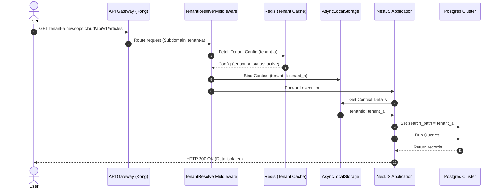

# Multi-Tenancy Architecture
## Purpose
This document specifies the multi-tenancy implementation patterns of the NewsOps Cloud digital publishing platform. It details how requests are routed based on subdomain hostnames or HTTP headers, how tenant contexts are resolved in NestJS middleware, and how dynamic schema switching is executed in the PostgreSQL database layer to ensure data isolation.

## Executive Summary
NewsOps Cloud is a multi-tenant software-as-a-service (SaaS) platform. To accommodate different customer requirements, it supports a hybrid tenant-isolation model. For Standard and Professional tier customers, data is logically isolated using separate database schemas on a shared PostgreSQL instance. For Enterprise tier customers, the platform supports routing to dedicated physical database instances. Multi-tenancy resolution is handled at the gateway and middleware levels, ensuring zero database leakage and developer-transparent connection routing.

## Vision
The long-term vision is to support a global multi-region deployment topology. As tenants scale, the routing layer will seamlessly direct requests to local regional clusters (e.g., EU, APAC, US) based on tenant residency rules. This transition will require no change to downstream domain modules, as all connection switching is handled dynamically at the infrastructure and middleware boundaries.

## Scope
This document covers:
- Subdomain and HTTP header tenant resolution strategies.
- NestJS middleware and request lifecycle hooks for tenant binding.
- Dynamic TypeORM data source factory configurations.
- Schema creation, migration pathways, and database isolation levels.
- Security frameworks for preventing cross-tenant leakage.

It does not cover front-end white-labeling configuration or individual billing plans.

## Goals
- **Absolute Data Segregation**: Guarantee zero data exposure or leakage between tenant domains.
- **Minimal Performance Overhead**: Dynamic database tenant switching must add less than 2 milliseconds of latency.
- **Automated Tenant Onboarding**: The dynamic schema initialization process must run in less than 30 seconds.
- **Developer Transparency**: Developers must not need to write explicit `WHERE tenant_id = x` SQL filters; connection routing must handle context automatically.

## Functional Requirements
- **Tenant Subdomain Resolver**: The system must extract the tenant identifier from incoming subdomains (e.g., `tenant-a.newsops.cloud`) or the `X-Tenant-ID` header.
- **Dynamic Migration Runner**: When a new tenant is created, the system must execute database migrations specifically targeting that tenant's newly created schema.
- **Connection Context Binder**: Dynamic database connections must be bound to the request thread using NestJS Request Scope or AsyncLocalStorage.

## Non-Functional Requirements
- **Resolution Overhead**: The tenant middleware resolver must resolve the tenant ID and fetch connection details in $< 2\text{ ms}$.
- **Connection Cache Hit Rate**: The TypeORM data source cache must maintain a hit rate of $\ge 98\%$ under standard workloads.
- **Scale Limits**: The tenant connection manager must support up to 1,000 active concurrent database connections across all schemas.

## Business Rules
- **Suspended Tenant Handling**: Requests targeting tenants with suspended accounts must be terminated at the middleware layer before any database connections are initialized.
- **Schema Name Sanitization**: Tenant identifiers must strictly match alphanumeric characters (`^[a-zA-Z0-9_]+$`) to prevent SQL Injection during dynamic schema mapping commands.
- **Administrative Access**: System-level administrative users are permitted to query cross-tenant statistics using custom analytics schemas that do not bypass access logs.

## Actors
- **Tenant Editor**: Enters content and accesses the platform via a tenant subdomain.
- **SaaS System Administrator**: Provisions tenants, executes global upgrades, and monitors isolation boundaries.
- **Dynamic Connection Manager**: The internal NestJS service that creates and caches PostgreSQL connections.

## User Stories
- **User Story 1**: As a SaaS System Administrator, I want to onboard a new news agency dynamically so that a dedicated Postgres schema is spawned and migrated automatically without service interruption.
- **User Story 2**: As a Tenant Editor, I want to log in through `sports-news.newsops.cloud` so that my content editor workspace is linked to our specific publishing databases automatically.
- **User Story 3**: As a Software Engineer, I want the system to bind the resolved tenant database connection to the active request context so that I do not accidentally query another customer's articles.

## Acceptance Criteria
- Dynamic schema creation must successfully execute all core migrations and return a success status within 30 seconds of receiving the onboarding command.
- If a request specifies a suspended or non-existent tenant ID, the middleware must respond with a 404/403 HTTP code and terminate the request cycle before database connection instantiation.
- Automated penetration testing suites must confirm that any direct SQL join or cross-schema table access between dynamic tenant schemas triggers database-level permission denials.

## Workflows
### Request Tenant Resolution Lifecycle
1. **Request Landing**: A user requests `/api/v1/articles` from their custom domain.
2. **Middleware Execution**: The NestJS `TenantResolverMiddleware` runs first in the execution pipeline.
3. **Extraction**: The middleware checks the hostname first. If it is `agency-xyz.newsops.cloud`, it extracts `agency-xyz`. If hosted on a custom domain, it checks the database-mapped custom domains list.
4. **Validation**: The system queries the cached administrative tenant catalog to verify the status is `ACTIVE`.
5. **Context Binding**: The middleware stores the tenant ID inside `AsyncLocalStorage` and passes control to the application guards.
6. **Connection Retrieval**: The service layer requests database access. The `TenantConnectionManager` resolves the tenant context from `AsyncLocalStorage`, looks up the connection cache, and returns the dedicated connection.
7. **Query Execution**: SQL queries execute specifically within the `agency_xyz` schema.
8. **Response Return**: Results are returned to the user, and the connection is returned to the pool.

## API Design
### Tenant Onboarding and Management API
Administrative endpoints used for provisioning.

* **URL**: `/api/v1/tenants/onboard`
* **Method**: `POST`
* **Headers**:
  * `Authorization: Bearer <ADMIN_JWT>`
* **Request Payload**:
```json
{
  "tenantName": "Daily Chronicle",
  "identifier": "daily_chronicle",
  "billingTier": "Enterprise",
  "databaseHostOverride": null
}
```
* **Response Payload (201 Created)**:
```json
{
  "tenantId": "c9284a1e-8e4a-4933-bf9b-3ee72465d8a9",
  "schema": "tenant_daily_chronicle",
  "subdomain": "daily-chronicle.newsops.cloud",
  "status": "active",
  "createdTimestamp": "2026-06-27T22:17:00Z"
}
```

## Database Design
To scale tenant routing, NewsOps Cloud uses a master administrative DB combined with dynamic schema routing inside primary DB servers:

```
                            [ PostgreSQL Primary ]
                                      |
         +----------------------------+----------------------------+
         | (Shared Admin DB)                                       | (Dynamic Application Schemas)
         v                                                         v
  [ public schema ]                                    +-----------+-----------+
  - Table: tenants                                     |                       |
    * tenant_id (UUID)                                 v                       v
    * name (VARCHAR)                             [ tenant_a schema ]     [ tenant_b schema ]
    * subdomain (VARCHAR, Unique Index)          - Table: articles       - Table: articles
    * schema_name (VARCHAR)                      - Table: users          - Table: users
    * status (VARCHAR)
```

### TypeORM Dynamic Connection Cache Factory
NestJS utilizes a dynamic provider that holds a map of active connections:
```typescript
interface ConnectionCache {
  [tenantId: string]: DataSource;
}
```
Connections are stored in memory with an inactive lease expiration of 15 minutes.

## UI Design
The SaaS Administrator dashboard consists of:
- **Tenant Registry List**: Displays all active, suspended, and pending tenant accounts.
- **Migration Status Indicators**: Renders the current database migration patch version across all dynamic schemas, with a one-click button to roll out updates to selected batches.
- **Storage Consumption Widgets**: Tracks active storage size in PostgreSQL and media upload volume in S3 bucket folders grouped by tenant prefix.

## Permissions
Access to tenant registration and schema migrations is limited to platform engineers:
- `tenants:read`: Grants rights to inspect tenant registries and monitoring details.
- `tenants:write`: Allows creation, suspension, and onboarding of tenant accounts.
- `tenants:migrate`: Authorizes executing database migration loops.

## Security
- **Dynamic SQL Mitigation**: Schema switching commands (`SET search_path TO ...`) must parameterize the schema string or match it against a strict database alphanumeric allowlist.
- **Tenant Isolation Verification**: In CI/CD runs, automated tests verify that queries run on a tenant connection cannot access other tables by attempting explicit schema prefixes (e.g., `SELECT * FROM tenant_b.articles` on tenant A's connection must fail).
- **Anti-Spoofing Headers**: Gateway proxies strip downstream custom client-supplied `X-Tenant-ID` headers to prevent header spoofing. Only subdomains validated by the ingress router are translated.

## Performance
- **Connection Cache Strategy**: Inactive dynamic database connections are closed and removed from the cache using a Least Recently Used (LRU) eviction algorithm when the cache exceeds 200 elements.
- **Resolution Overhead Limit**: The tenant resolver caching ensures database lookups are skipped by maintaining active subdomain-to-tenant-ID maps in Redis with a TTL of 2 hours.
- **Tenant Context Memory Overhead**: The allocation of `AsyncLocalStorage` contexts must be restricted to $< 5\text{ KB}$ per active request.

## Monitoring
- **Prometheus Metric**: `tenant_resolutions_total` (Counter tracking total requests successfully routed per tenant ID).
- **Prometheus Metric**: `tenant_connection_cache_evictions` (Counter monitoring connection cache invalidations).
- **Alert Trigger**: Trigger Slack warning if `tenant_connection_cache_evictions > 10` within a 1-minute window, indicating connection pool thrashing.

## Logging
Every log entry processed within a request lifecycle is injected with the resolved tenant context:
* **Log Pattern**: `{"timestamp": "%ISO8601%", "tenant_id": "daily_chronicle", "context": "ArticleService", "level": "INFO", "message": "Fetching article lists"}`
* **Error Level**: `CRITICAL` for connection failures during tenant schema switching.

## Error Handling
| Internal Multi-Tenancy Error | HTTP Status | Customer-Facing Action |
|:---|:---|:---|
| `TenantSuspendedException` | 403 Forbidden | Access denied: Your organization's workspace is suspended. |
| `InvalidTenantSubdomainException` | 404 Not Found | Workspace not found. Please verify the URL. |
| `SchemaNotFoundException` | 500 Internal Error | The workspace data schema is undergoing maintenance. Please retry in 5 minutes. |

## Edge Cases
- **Schema Migration Failures**: If a migration script fails halfway through a dynamic update on tenant schema #14, the migration transaction is rolled back, the tenant is flagged as `MAINTENANCE_LOCKED`, and an alarm notifies engineers to manually resolve the delta while other tenants continue running normally.
- **Dynamic Database Failovers**: Dynamic connections automatically inherit the retry-on-failure parameter from the TypeORM master config, reconnecting automatically during server failovers.

## Future Improvements
- **Autonomous Tenant Sharding**: Implement automated routing algorithms that assign new tenants to database server shards based on their storage size projections and geographic regions.
- **Zero-Downtime Migration Batches**: Support automated blue-green schema migration strategies, shifting read traffic to read-only schemas while migrations execute on active data tables.

## Mermaid Diagrams
### Dynamic Tenant Request Context Flow


## References
- System Topologies & Deployment: [system_architecture.md](./system_architecture.md)
- Event-Driven Queues: [event_driven_design.md](./event_driven_design.md)
- Architectural Map and Index: [index.md](./index.md)
