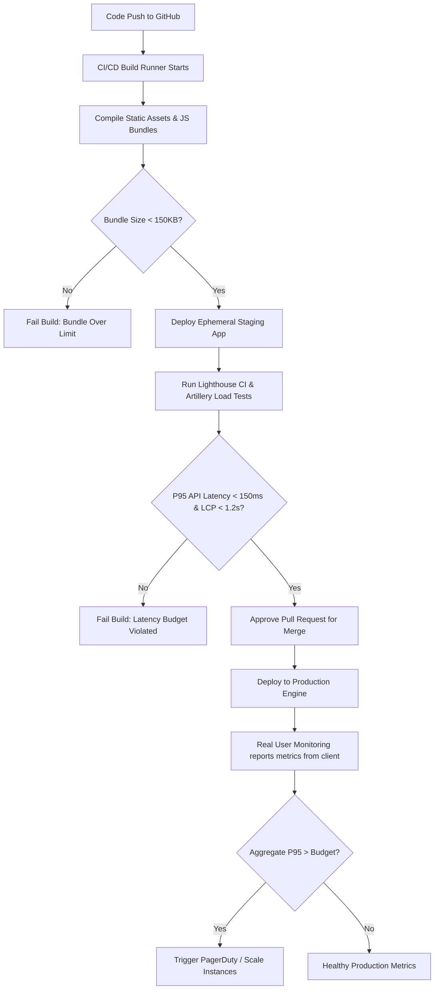

# Performance Budget and Latency Targets

## Purpose
This document establishes the absolute performance budgets, latency limits, and resource utilization thresholds for all layers of the NewsOps Cloud digital publishing platform. It defines targets for client-side load times, API response rates, database query executions, static page building, and container resource envelopes (CPU and memory).

## Executive Summary
For digital news platforms, performance directly impacts audience retention, search engine rankings (SEO), and conversion rates. NewsOps Cloud enforces a strict, multi-tiered performance budget. Any code change or API query that violates these thresholds is rejected in the CI/CD pipeline or throttled in production. This architecture document defines specific latency limits (P95 and P99), resource limits, and monitoring regimes to ensure that even at peak loads, the platform remains responsive and cost-effective.

## Vision
NewsOps Cloud aims to deliver a "zero-latency" editorial and reading experience. Editorial staff must be able to write and save changes in real-time, and readers must access article pages instantly on any device and network configuration. Performance is treated as a core product feature, not an afterthought.

## Scope
This design document defines targets across three architectural dimensions:
1. **Frontend / Client Experience**: Core Web Vitals (LCP, FID, CLS, INP) for reader-facing sites and administrative interfaces.
2. **Backend & Integration APIs**: Latency targets for GraphQL and REST APIs under variable tenant load profiles.
3. **Database & Infrastructure Resource Budgets**: Limits on database query execution times, background worker runtimes, static site building, and container hardware usage (CPU/Memory).

## Goals
- **Maintain a Core Web Vitals "Good" Rating**: Secure high SEO ranking by achieving LCP < 1.2 seconds on mobile 3G/4G connections.
- **Enforce API Latency Ceilings**: Ensure that P95 API responses are served under 150ms and P99 responses are served under 300ms.
- **Optimize Database Ingestion**: Keep database read/write queries below 30ms for standard transactional operations.
- **Ensure Ultra-Fast Builds**: Restrict Incremental Static Regeneration (ISR) and static page compilation times to under 100ms per article page.

## Functional Requirements
1. **CI/CD Latency Gatekeeper**: The deployment pipeline must run synthetic performance tests (Lighthouse CI and API load tests) and block merges if a pull request increases bundle size by > 5% or introduces latency regressions > 10%.
2. **Real User Monitoring (RUM) Ingress**: The frontend must collect and report anonymous Web Vitals metrics from actual readers' browsers back to a metrics gateway.
3. **Automated Query Analysis**: The database ORM (Prisma) middleware must inspect query runtimes and auto-log any query executing slower than 50ms as a performance warning.
4. **Adaptive Resource Limits**: The container scheduler (Kubernetes / Render) must scale container instances when sustained CPU usage exceeds 70% or memory utilization hits 80%.

## Non-Functional Requirements
1. **Target Concurrency (TPS)**: Standard configurations must sustain 10,000 public reader Transactions Per Second (TPS) and 500 concurrent administrative editorial sessions without exceeding latency targets.
2. **Network Resilience**: Client bundles must be optimized to render the critical path with less than 150 KB of initial JavaScript transfer size.
3. **Stateless Scalability**: No backend API node may persist local session state, allowing instant scale-out when latency budgets are compromised.

## Business Rules
1. **Tiered SLA Budgets**: Premium tenants receive guaranteed computing allocations. Free/Standard tenants are subject to strict rate limits and resource caps to prevent them from degrading performance for other tenants in a multi-tenant cluster.
2. **Performance Recovery Rule**: If a service's latency P95 exceeds its budget for more than 5 consecutive minutes, the monitoring service must trigger automated mitigation (e.g., auto-scale replicas or activate edge caching fallbacks).
3. **Static Priority**: The reader experience takes absolute priority. Editorial operations (e.g., generating reports, batch updates) must run as low-priority asynchronous background tasks so they do not consume resources reserved for delivery.

## Actors
- **Site Reader**: Accesses the published article pages, expecting sub-second load times.
- **Newsroom Editor**: Operates the collaborative CMS dashboard.
- **DevOps Engineer**: Configures infrastructure thresholds and analyzes monitoring metrics.
- **QA Automation Engineer**: Validates performance budgets within the CI/CD pipeline.

## User Stories
1. **Instant Article Rendering**: As a Site Reader on a mobile phone, I want pages to load instantly even on slow connections so that I do not abandon the page in frustration.
2. **Responsive Collaborative Editing**: As a Newsroom Editor working on a breaking story, I want my edits to auto-save and show up in the collaborative pane in under 200ms so that my colleagues and I do not overwrite each other.
3. **CI/CD Regression Prevention**: As a DevOps Engineer, I want the build pipeline to run performance profiling against our APIs so that we block any code update that degrades search query response times.

## Acceptance Criteria
1. **Reader Page Load (LCP)**: Under simulated network throttling (Slow 4G, 400ms Round-Trip-Time, 1.6 Mbps down), the Largest Contentful Paint (LCP) must not exceed `1.2 seconds` for 95% of test runs.
2. **Database Query Ceiling**: standard reads (e.g., fetch article by slug) must execute in under `30ms` (P95) and database writes (e.g., update session token) must execute in under `50ms` (P95) under a 1,000 queries-per-second load.
3. **Build Execution Time**: Regenerating an individual page using Next.js Incremental Static Regeneration (ISR) must complete within `100ms` from the trigger hook to CDN distribution.
4. **Container CPU Threshold**: Any Kubernetes pod executing core API routing must not exceed a CPU utilization limit of `70%` for more than `3 consecutive minutes` before triggering horizontal pod autoscaling (HPA).

## Workflows
1. **CI/CD Performance Verification Workflow**:
   - Developer pushes a code branch to the repository.
   - GitHub Actions runner initiates the build and compiles static assets.
   - The test runner deploys the application code to a staging ephemeral environment.
   - Lighthouse CI runs 5 iterations of performance scans on core pages (Home, Article, Editor).
   - Artillery load test dispatches 500 virtual users targeting API endpoints.
   - The system validates actual latencies against the Performance Budget limits.
   - If tests pass, the PR is approved for merge. If any metric fails (e.g., API latency rises to 200ms), the build is failed, and a notification is dispatched to the developer.

2. **Runtime Caching and Fallback Workflow**:
   - Reader requests an article page: `GET /articles/tech-breakthrough`.
   - The Edge CDN checks its cache.
   - **Cache Hit**: CDN serves the static HTML immediately (Latency < 20ms).
   - **Cache Miss**: CDN forwards the request to the Next.js serverless application.
   - The application checks Redis for cached query data.
     - *Redis Hit*: Renders the page markup (Latency < 120ms).
     - *Redis Miss*: Hits the primary Neon PostgreSQL Database, compiles the page, stores the output in Redis, updates the CDN cache, and serves the Reader (Latency < 250ms).

## API Design

### 1. Performance Metrics Report Ingest
- **Method**: `POST`
- **Path**: `/api/v1/metrics/performance/report`
- **Headers**:
  - `Content-Type`: `application/json`
  - `User-Agent`: (Client browser environment details)
- **Request Body (RUM Data)**:
```json
{
  "tenant_id": "tenant_uuid_12345",
  "page_url": "https://newsops.cloud/articles/tech-breakthrough",
  "connection_type": "4g",
  "metrics": {
    "lcp": 1150.5,
    "fid": 32.0,
    "cls": 0.04,
    "inp": 120.0,
    "ttfb": 180.2
  },
  "timestamp": "2026-06-27T16:50:00Z"
}
```
- **Response (200 OK)**:
```json
{
  "status": "success",
  "message": "Metrics ingested successfully"
}
```

### 2. Query System Health and Latencies
- **Method**: `GET`
- **Path**: `/api/v1/metrics/performance/system-health`
- **Headers**:
  - `Authorization`: `Bearer JWT_TOKEN`
- **Response (200 OK)**:
```json
{
  "status": "healthy",
  "timestamp": "2026-06-27T16:51:00Z",
  "services": {
    "api_gateway": {
      "p50_latency_ms": 12.5,
      "p95_latency_ms": 95.0,
      "p99_latency_ms": 140.0,
      "tps": 1200
    },
    "database": {
      "p50_query_time_ms": 4.2,
      "p95_query_time_ms": 28.5,
      "tps": 450
    },
    "static_builder": {
      "p95_isr_time_ms": 82.0,
      "pages_generated_last_hr": 1420
    }
  }
}
```

## Database Design

### Schema Design
To keep audit records of performance checks and budget configurations, the system uses two main tracking tables:

```sql
-- Performance Budget Configuration Table
CREATE TABLE performance_budgets (
    id UUID PRIMARY KEY DEFAULT gen_random_uuid(),
    service_name VARCHAR(100) UNIQUE NOT NULL, -- e.g. 'api_gateway', 'neon_db', 'static_builder'
    metric_key VARCHAR(50) NOT NULL, -- e.g. 'p95_latency_ms', 'memory_usage_pct'
    warning_threshold DECIMAL(10,2) NOT NULL, -- triggers alerts
    critical_threshold DECIMAL(10,2) NOT NULL, -- triggers CI/CD failure or auto-scaling
    updated_at TIMESTAMP WITH TIME ZONE DEFAULT CURRENT_TIMESTAMP
);

-- Real User Monitoring (RUM) Aggregate Table
CREATE TABLE rum_performance_aggregates (
    id UUID PRIMARY KEY DEFAULT gen_random_uuid(),
    tenant_id UUID NOT NULL,
    page_path VARCHAR(255) NOT NULL,
    device_category VARCHAR(50) NOT NULL, -- 'mobile', 'desktop', 'tablet'
    avg_lcp_ms INT NOT NULL,
    avg_fid_ms INT NOT NULL,
    avg_cls DECIMAL(5,4) NOT NULL,
    sample_count INT NOT NULL,
    aggregated_date DATE NOT NULL,
    CONSTRAINT unique_tenant_path_device_date UNIQUE (tenant_id, page_path, device_category, aggregated_date)
);

CREATE INDEX idx_rum_aggregates_tenant_date ON rum_performance_aggregates(tenant_id, aggregated_date);
```

## UI Design
The system status screen features a dedicated "Performance Budget Audit" tab in the Admin Console.

### Component Structure
1. **Core Web Vitals Matrix**: Shows real-time LCP, FID, and CLS scores for mobile vs. desktop formats. Values are color-coded (Green for good, Yellow for warning, Red for budget violation).
2. **Latency Distribution Graph**: Displays a histogram of API response times, separating P50, P95, and P99 boundaries.
3. **Database Performance Analyzer**: Highlights the top 5 slowest-running queries, indicating execution times, caller modules, and target SQL statements.
4. **CI/CD Build History Tracker**: Illustrates a trend line of static page build speeds and bundle sizes across the last 20 releases.

## Permissions
Performance metrics configurations and reviews require specific access levels:
- `DevOps Engineer / Super Administrator`:
  - `performance:read`
  - `performance:write` (Allows adjusting thresholds and budgets)
- `Newsroom Editor / Tenant Admin`:
  - `performance:read` (Only views the tenant-specific metrics dashboard)

## Security
1. **RUM Ingest Protection**: To prevent bad actors from flooding the performance ingest endpoint and skewing analytics, we enforce strict IP rate limiting (`20 requests per minute per IP`) and discard requests with invalid tenant IDs.
2. **Sanitizing Logs**: SQL queries highlighted in the slow database list are scrubbed to strip parameters (e.g., replacing actual user IDs, values, and tokens with `$1`, `$2` placeholders) to prevent sensitive data leak in log displays.
3. **CORS Hardening**: The RUM metrics reporting endpoint validates CORS headers to ensure data is only posted from authorized tenant domain names.

## Performance
*This section defines the infrastructure parameters to maintain the budget.*
- **Cache Strategy**: Implement stale-while-revalidate configurations at the CDN level. Static assets are served immediately, while the background generation updates the cache.
- **Database Connection Pooling**: Enforce connection pooling (using Neon Connection Pooling via PgBouncer) to restrict total connection creation times to less than `3ms`.
- **Node.js Garbage Collection**: Spin up Node tasks with flags `--max-old-space-size=1536` to limit memory growth and force garbage collection before memory saturation hits.

## Monitoring
We monitor compliance with performance budgets using these Prometheus gauges and histograms:
- `newsops_api_latency_seconds_bucket`: Logs response duration buckets for API endpoints.
- `newsops_db_query_duration_seconds_bucket`: Tracks database query processing intervals.
- `newsops_isr_generation_duration_seconds`: Tracks Next.js page construction intervals.
- `newsops_container_memory_bytes`: Compares actual container memory usage against constraints.

### Alert Triggers
- **P95 Latency Spike**: Alert fires if `newsops_api_latency_seconds` P95 exceeds `150ms` for > 3 minutes.
- **Memory Saturation**: Alert fires if `newsops_container_memory_bytes` exceeds `85%` of allocated limit, initiating immediate scaling warnings.

## Logging
Performance log structures are stored under the standard JSON layout:
```json
{
  "timestamp": "2026-06-27T16:53:00.987Z",
  "level": "WARN",
  "context": "database-performance-monitor",
  "query_execution_time_ms": 78.5,
  "sql_statement": "SELECT * FROM articles WHERE tenant_id = $1 AND status = $2 ORDER BY published_at DESC",
  "impacted_tenant": "tenant_uuid_12345",
  "message": "Database query exceeded performance budget threshold of 30ms."
}
```

## Error Handling

| Error Code | Source Component | HTTP Status | Customer-Facing Message |
| :--- | :--- | :--- | :--- |
| `ERR_LATENCY_EXCEEDED` | API Gateway / App Server | 504 Gateway Timeout | The system was unable to complete your request within the designated latency budget. |
| `ERR_OUT_OF_MEMORY` | Container Runtime | 503 Service Unavailable | The application node has run out of resources. Attempting failover. |
| `ERR_RATE_LIMIT_EXCEEDED`| Ingest Gateway | 429 Too Many Requests | Performance report submission limit exceeded. Please throttle client reporting events. |
| `ERR_BUILD_TIMEOUT` | Static Builder | 504 Gateway Timeout | Incremental static build exceeded its budget. Reverting to stale cache version. |

## Edge Cases
1. **Cache Stampede (Thundering Herd)**: When a high-traffic article cache expires, thousands of concurrent requests can hit the database. To prevent this, we use Redis distributed locks (Redlock). Only the first thread retrieves and rebuilds the page, while other requests await the lock or return the stale cache.
2. **Cold Starts in Serverless Environments**: Serverless functions can experience latencies of > 1 second on cold starts. NewsOps Cloud schedules "warming pings" every 4 minutes to keep key API and rendering endpoints active, ensuring cold starts do not impact live users.
3. **Database Lock Contention during Mass Updates**: Bulk publishes can block database reads. We enforce database read-replica routing for all reader-facing GET APIs, isolating transactional writes on the primary Neon database from read requests.

## Future Improvements
1. **Edge Rendering with Cloudflare Workers**: Move HTML page construction from central servers to the network edge (Vercel Edge/Cloudflare Workers) to reduce time-to-first-byte (TTFB) to under 30ms.
2. **Predictive Pre-Caching**: Analyze reader patterns via Machine Learning to pre-cache popular articles to edge endpoints before they are requested by users.
3. **Prisma to Raw SQL migration**: Convert high-throughput ORM queries to optimized raw SQL functions to save the 10-15ms serialization overhead introduced by ORM libraries.

## Mermaid Diagrams

### Performance Ingestion and Verification Flow



## References
- [System Architecture](../02-architecture/index.md)
- [Monetization Strategy](../01-business/monetization_strategy.md)
- [Zero Cost MVP Architecture](../02-architecture/zero_cost_mvp_architecture.md)
