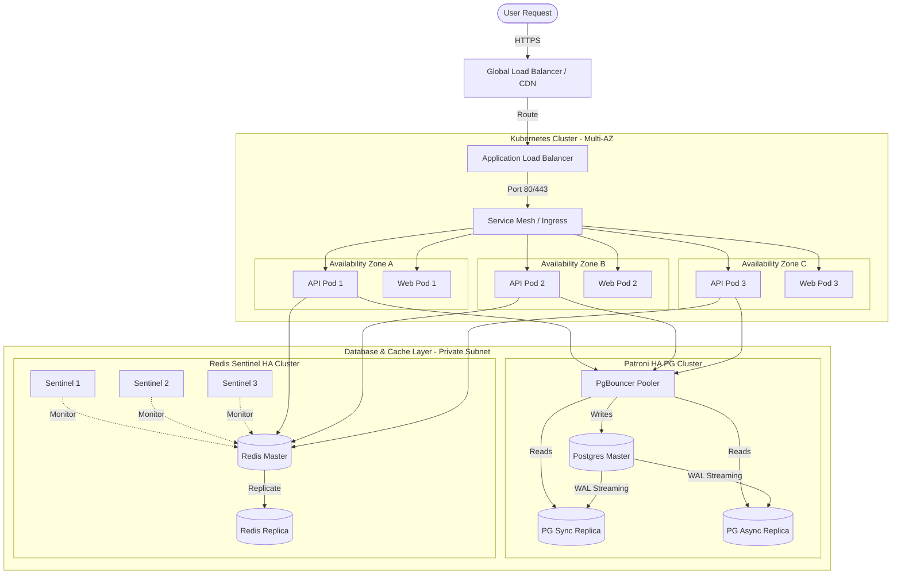

# Scaling and High Availability
## Purpose
This document specifies the infrastructure scaling strategies and high availability (HA) patterns for the NewsOps Cloud digital publishing platform. It defines the deployment models, autoscaling configurations, database replication architectures, and cache clustering rules required to build a resilient, self-healing infrastructure capable of handling large-scale traffic spikes without service degradation.

## Executive Summary
NewsOps Cloud is built on a containerized microservices model deployed across multiple Availability Zones (AZs) using Kubernetes. Horizontal autoscaling of API and web nodes is controlled by CPU and memory thresholds, as well as traffic request metrics. High availability for PostgreSQL is achieved using a primary-replica topology with PgBouncer connection pooling and fast-failover capabilities. Redis is deployed in a Sentinel cluster configuration for low-latency session and cache management, ensuring that single-node outages trigger automatic promotion of standby replicas within seconds.

## Vision
The vision is to establish a modern, cloud-native infrastructure that handles elastic traffic scaling transparently. The system must adapt dynamically to breaking news cycles, scaling up instances in minutes to handle massive read spikes, and scaling down during low-activity windows to control infrastructure costs, while ensuring zero data loss and minimal failover disruption.

## Scope
The scope of this scaling and high availability architecture covers:
1. **Container Deployment Structure**: Docker configurations and Kubernetes pod distributions.
2. **Horizontal Autoscaling (HPA)**: Metric limits, scaling steps, and cooldown durations.
3. **Database Scalability**: Master-replica replication, read/write division, and connection pooling.
4. **Cache & Session Clustering**: Redis Sentinel and Redis Cluster deployment patterns.
5. **Load Balancer Configuration**: Multi-AZ routing, health checks, and connection draining.

## Goals
- **Maximize Uptime**: Meet a 99.99% service availability target for reader-facing publishing routes.
- **Rapid Scaling Response**: Spin up new application pods and distribute traffic to them in <= 90 seconds from threshold breach.
- **Isolate Writes**: Offload 100% of read-only queries to replica nodes, preserving the primary database's performance for editorial writes.
- **Self-Healing Failover**: Automate the detection and failover of database and caching nodes with a recovery window of <= 15 seconds.

## Functional Requirements
- **Automated Container Orchestration**: The system must run within Docker containers orchestrated by Kubernetes across at least three distinct Availability Zones.
- **Dynamic Load Balancing**: The system must utilize an Application Load Balancer (ALB) to distribute requests evenly and automatically stop routing traffic to unhealthy containers.
- **Separate Read/Write Database Connections**: Application connection pools must distinguish between write queries (routed to the master DB) and read queries (routed to read replicas).
- **Graceful Connection Draining**: During scale-down actions or redeployments, containers must complete active requests (drain connections) for 30 seconds before terminating.

## Non-Functional Requirements
- **CPU Scaling Threshold**: Trigger horizontal scaling when average CPU utilization across pods exceeds 70% for 2 consecutive minutes.
- **Memory Scaling Threshold**: Trigger horizontal scaling when average memory usage exceeds 80% for 2 consecutive minutes.
- **Database Replication Lag Boundary**: System must raise alerts if the replication lag between primary and replica database nodes exceeds 2 seconds.
- **Target Peak Throughput (TPS)**: System must scale to support up to 25,000 transactions per second (TPS) on read endpoints and 1,000 TPS on write endpoints.

## Business Rules
- **Minimum Operational Instances**: The production environment must maintain a minimum of 3 active pods per microservice at all times, distributed across distinct zones.
- **Scale-Down Cooldown**: Set a scale-down cooldown of 300 seconds (5 minutes) to prevent cluster thrashing (repeatedly spinning up and shutting down pods).
- **Write Consistency Fallback**: If a replica database has a replication lag of > 5 seconds, read queries for critical subscriber checks must temporarily fall back to the primary database to prevent access synchronization issues.

## Actors
- **Application Load Balancer**: Directs traffic to healthy, active containers.
- **Kubernetes HPA Controller**: Monitors metrics and modifies deployment replica counts.
- **Postgres Primary Node**: Processes state-changing transactions and writes WAL (Write-Ahead Logs).
- **Postgres Read Replicas**: Process read-only queries and replicate the primary node.
- **Redis Sentinel**: Monitors Redis instances and orchestrates failovers.
- **DevOps Engineer**: Monitors infrastructure metrics and adjusts scaling profiles.

## User Stories
- **Story 1 - Traffic Spike**: As a Reader accessing the site during a major national election, I want the pages to load quickly even if millions of other users are concurrently viewing the feed, because the system has scaled up capacity automatically.
- **Story 2 - Node Recovery**: As a DevOps Engineer, I want the system to automatically decommission an unresponsive API container and spin up a healthy replacement in another zone, so that I do not need to wake up for routine hardware faults.
- **Story 3 - Read Replication**: As an Editor publishing articles in the CMS, I want my writing operations to be fast and unaffected by heavy traffic from readers, because reader queries are routed entirely to separate read-replicas.

## Acceptance Criteria
- **AC-1 (Scaling Time)**: When a traffic surge pushes CPU utilization to 85%, the Kubernetes HPA must register the breach, initiate container creation, pass readiness probes, and route traffic to new pods within 75 seconds.
- **AC-2 (Read/Write Splitting)**: Under test load, 100% of SQL `SELECT` operations generated from read-only controllers must execute on the read-replica database addresses, while `INSERT`, `UPDATE`, and `DELETE` execute on the primary.
- **AC-3 (Redis Failover)**: When the primary Redis master node is manually powered down, Redis Sentinel must elect a new master, update the DNS or proxy endpoint, and restore full caching read/write services within 12 seconds.
- **AC-4 (Connection Draining)**: During a rolling update, terminating pods must successfully finish 100% of in-flight HTTP requests that started before the shutdown signal, with no connection drops experienced by clients.

## Workflows
### Step-by-Step Horizontal Pod Autoscaling Workflow
1. **Metrics Ingestion**: The Prometheus server polls container metrics (CPU, Memory, Request Rate) from Kubernetes API endpoints.
2. **Threshold Breach**: CPU usage on the `editorial-api` microservice reaches 75% due to a surge in editorial activity.
3. **Trigger Scaling**: The Horizontal Pod Autoscaler (HPA) controller detects the 75% average utilization (breaching the 70% limit) lasting for 2 minutes.
4. **Calculate Replicas**: The HPA calculates the required number of pods: `DesiredReplicas = ceil(CurrentReplicas * (CurrentMetric / TargetMetric))`.
5. **Scale Up**: The HPA updates the replica count in the deployment manifest (e.g. from 3 to 6 pods).
6. **Pod Scheduling**: Kubernetes schedules 3 new pods across available physical nodes, prioritizing zones with fewer active pods.
7. **Readiness Probe Validation**:
   - The Application Load Balancer blocks traffic to the new pods until they pass health checks.
   - The new pods run their boot sequence. The system calls `/readyz` every 2 seconds.
   - Once `/readyz` returns `200 OK`, the pod is marked as healthy.
8. **Traffic Routing**: The ALB begins routing incoming requests to the new pods. Average CPU utilization drops back below the threshold.

### Step-by-Step Database Failover Workflow
1. **Failure Occurs**: The primary database server experiences a kernel panic or hardware failure.
2. **Health Check Failure**: The database monitoring system (e.g., Patroni / Consul) fails to get a heartbeat from the primary node.
3. **Initiate Failover**:
   - The standby leader election process begins.
   - The monitoring cluster selects the read replica with the most advanced log position (lowest WAL replication lag) to become the new primary.
4. **Promote Standby**:
   - The selected replica is promoted to primary (writable mode) by executing `pg_ctl promote`.
   - The application connection pool proxy (PgBouncer) updates its internal routing table, mapping the write pool host to the IP of the newly promoted node.
5. **Re-route Traffic**:
   - In-flight writes fail with temporary connection errors and are retried by the application.
   - Subsequent write requests are successfully routed to the new primary.
6. **Re-initialize Old Primary**: When the failed server recovers, the automation re-provisions it as a read replica of the new primary.

## API Design
### Kubernetes Health Check Endpoints
Microservices expose these endpoints for container health monitoring:

#### 1. Liveness Probe (Checks if container is dead and needs a restart)
- **Endpoint**: `GET /healthz`
- **Method**: `GET`
- **Response Payload (Success)**:
  ```json
  {
    "status": "healthy",
    "timestamp": "2026-06-27T22:20:00Z"
  }
  ```

#### 2. Readiness Probe (Checks if container is ready to receive traffic)
- **Endpoint**: `GET /readyz`
- **Method**: `GET`
- **Response (Success - Ready)**:
  - **HTTP Status**: `200 OK`
  - **Response Payload**:
    ```json
    {
      "status": "ready",
      "services": {
        "database_read_connection": "connected",
        "redis_connection": "connected",
        "rabbitmq_connection": "connected"
      }
    }
    ```
- **Response (Failure - Booting or Degraded)**:
  - **HTTP Status**: `503 Service Unavailable`
  - **Response Payload**:
    ```json
    {
      "status": "not_ready",
      "reason": "Database connection lost",
      "services": {
        "database_read_connection": "failed",
        "redis_connection": "connected",
        "rabbitmq_connection": "connected"
      }
    }
    ```

## Database Design
Cluster node status and replication lags are monitored via tracking tables updated by the infrastructure controller.

```sql
-- Database Instance Registry (for health tracking and service discovery)
CREATE TABLE public.database_nodes (
    id UUID PRIMARY KEY DEFAULT gen_random_uuid(),
    node_name VARCHAR(100) NOT NULL UNIQUE,
    ip_address VARCHAR(45) NOT NULL,
    role VARCHAR(20) NOT NULL,            -- 'PRIMARY', 'REPLICA_SYNC', 'REPLICA_ASYNC'
    status VARCHAR(20) NOT NULL,          -- 'ONLINE', 'OFFLINE', 'DEGRADED'
    replication_lag_bytes BIGINT DEFAULT 0,
    last_heartbeat TIMESTAMP WITH TIME ZONE NOT NULL DEFAULT NOW()
);

-- Index for scanning node roles
CREATE INDEX idx_db_nodes_role ON public.database_nodes(role);

-- Cluster Auto-scaling Events Log
CREATE TABLE public.infra_scaling_events (
    id UUID PRIMARY KEY DEFAULT gen_random_uuid(),
    service_name VARCHAR(100) NOT NULL,
    event_type VARCHAR(20) NOT NULL,      -- 'SCALE_UP', 'SCALE_DOWN'
    previous_replicas INT NOT NULL,
    new_replicas INT NOT NULL,
    trigger_metric VARCHAR(50) NOT NULL,  -- 'CPU_UTILIZATION', 'MEMORY_LIMIT', 'TPS_SPIKE'
    trigger_value VARCHAR(50) NOT NULL,
    created_at TIMESTAMP WITH TIME ZONE NOT NULL DEFAULT NOW()
);

CREATE INDEX idx_scaling_events_created ON public.infra_scaling_events(created_at DESC);
```

## UI Design
The system operators monitor container infrastructure via the **DevOps Orchestrator Console**.
1. **Component Layout**:
   - **Infrastructure Grid Map**: Renders an interactive map of Availabilities Zones (AZ-A, AZ-B, AZ-C). Nodes and active pods are displayed as colored blocks (Green = Ready, Blue = Provisioning, Red = Terminating/Failed).
   - **Performance Chart Row**:
     - *Chart 1*: Global Request Rate vs Container Replica Count over time.
     - *Chart 2*: CPU/Memory Average Utilization line graph.
     - *Chart 3*: Database replication lag (ms) line graph.
   - **Service Controls Panel**:
     - Auto-scaling toggle (Enable/Disable).
     - Manual override scale inputs: Number fields to set minimum/maximum pods directly.
     - "Trigger Failover Drill" button (launches validation popups).

2. **Actions**:
   - Toggling manual override allows operators to change replica settings instantly. Clicking "Save Changes" highlights a success alert.

3. **States**:
   - **Syncing State**: Shows spinning rings on pod maps when rolling out new container versions.
   - **Warning State**: Pods border turns yellow when utilization exceeds 90% before the HPA has finished launching replacements.

## Permissions
- `infra:read_metrics`: Allows access to operational dashboards.
- `infra:scale`: Allows manual adjustments of deployment replica bounds.
- `infra:trigger_failover`: Permits operators to manually force database primary rotations and Redis master updates.
- `infra:edit_configs`: Permits editing CPU/Memory autoscaling threshold rules.

## Security
- **Secure Pod Communications**: All pod-to-pod communications within the Kubernetes cluster must enforce mutual TLS (mTLS) using a service mesh (e.g., Istio or Linkerd).
- **VPC Separation**: Database nodes and Redis servers must run within a private subnet isolated from the public internet. Access is restricted to the Kubernetes cluster security groups.
- **Minimal Privilege Docker Images**: Use Docker distroless or Alpine-based images to build application containers, eliminating unnecessary shells and binaries to reduce attack vectors.
- **Kubernetes Secret Storage**: Sensitive environment keys (database passwords, API keys) must be stored in encrypted Kubernetes Secrets rather than plain-text environment files.

## Performance
- **Target Latencies**:
  - Load Balancer request dispatch: <= 2ms.
  - Pod scale up execution: <= 60 seconds.
  - Database primary failover resolution: <= 15 seconds.
- **Target Capacity Limits**:
  - Microservices must be configured with limits of: `cpu: 1.0` core and `memory: 2Gi`.
  - PgBouncer pools are restricted to a maximum of 250 connections per server node.

## Monitoring
Prometheus alerts tracking cluster metrics:
- `kube_deployment_status_replicas_available{deployment}`: Current active pod count.
- `container_cpu_usage_seconds_total`: Tracks CPU consumption rate.
- `pg_stat_replication_lag_seconds`: Database replication lag.
- `redis_sentinel_masters_healthy`: Number of Sentinel instances agreeing on master node health.

*Alert Trigger Rules*:
- **Trigger**: `pg_stat_replication_lag_seconds > 5` for 3 consecutive minutes.
  - *Action*: Alert critical: Database replication lag exceeds safety margins.
- **Trigger**: `redis_sentinel_masters_healthy < 2`
  - *Action*: Alert critical: Redis Sentinel cluster quorum lost.

## Logging
Structured JSON log configurations:
- **Info Level Log (Scale Up Event)**:
  ```json
  {"timestamp":"2026-06-27T22:21:00Z","level":"info","logger":"kubernetes_hpa","message":"Autoscaler triggered scale up","service":"editorial-api","current_replicas":3,"target_replicas":6,"reason":"CPU utilization at 78%"}
  ```
- **Warn Level Log (Replica Lag)**:
  ```json
  {"timestamp":"2026-06-27T22:21:05Z","level":"warning","logger":"db_monitor","message":"Database replication lag detected","replica_ip":"10.0.4.12","lag_seconds":3.4}
  ```
- **Error Level Log (Failover Action)**:
  ```json
  {"timestamp":"2026-06-27T22:21:10Z","level":"error","logger":"patroni_failover","message":"Primary node offline. Promoting standby node to primary","failed_node":"db-primary-0","promoted_node":"db-replica-1"}
  ```

## Error Handling
| Internal Error Code | Triggering Scenario | HTTP Status | Customer-Facing Message |
|:---|:---|:---|:---|
| `INFRA_CONTAINER_OOM` | Pod runs out of memory and is terminated by kernel | 502 Bad Gateway | "The server experienced a temporary resource limit. The page is reloading." |
| `DB_REPLICA_STALE` | Read replica query lag exceeds replication limits | 200 (Degraded) | "Serving cached page content; newer updates are syncing." (Falls back to primary) |
| `LB_DRAIN_TIMEOUT` | Terminating pod active tasks exceed 30s connection draining | 504 Gateway Timeout | "The request took too long to complete. Please try again." |
| `REDIS_CLUSTER_DOWN` | Partition split breaks Redis Cluster state | 503 Service Unavailable | "Cache cluster is currently rebuilding. Session data is temporarily unavailable." |

## Edge Cases
- **Split-Brain Scenarios (Database/Sentinel)**: Network partition cuts off communication, causing two nodes to assume the primary role simultaneously. *Mitigation*: Run an odd number of Consul/Patroni sentinel nodes (minimum 3) requiring a strict quorum (> 50%) to elect a master. If a primary is partitioned from the quorum, it is forced to demote itself to read-only status automatically.
- **Rapid Scaling Oscillations (Thrashing/Flapping)**: High-frequency workload spikes trigger rapid scale-ups and scale-downs. *Mitigation*: Adjust scale-down stabilization window to 5 minutes (`behavior.scaleDown.stabilizationWindowSeconds: 300` in HPA specs), forcing the cluster to remain scaled-out until traffic stabilizes.
- **Cascading Failure of Read Replicas**: If one read replica goes down, other replicas inherit its traffic, causing them to overload and fail sequentially. *Mitigation*: Implement active rate-limiting and query-concurrency throttling (using PgBouncer queues) to protect active nodes, returning HTTP 429 rather than allowing replicas to crash.

## Future Improvements
- **Multi-Region Active-Active Deployments**: Migrate to multi-region Kubernetes deployments using Global Load Balancing (GLB) and CockroachDB or active-active PostgreSQL configurations to survive complete cloud region failures.
- **Autoscaling by Machine Learning (Predictive Scaling)**: Integrate KEDA (Kubernetes Event-driven Autoscaling) with historical request data to scale up container pools 30 minutes before expected daily peak reading times.

## Mermaid Diagrams
### High Availability Deployment Topology


## References
- [Caching Strategy and Session Layout](../02-architecture/caching_strategy.md)
- [DevOps Container Configs](../11-devops/deployment_blueprints.md)
- [Disaster Recovery Architecture](../02-architecture/disaster_recovery.md)
