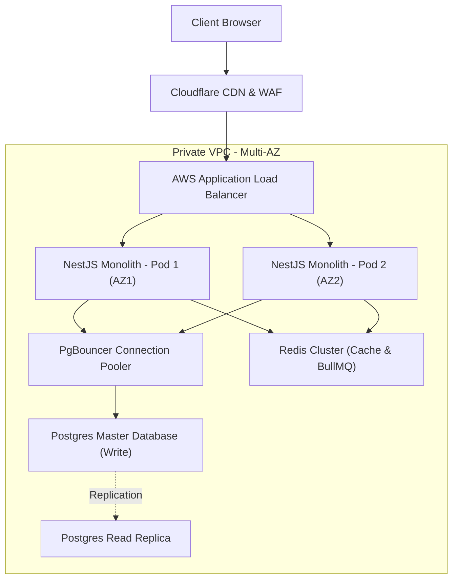

# System Architecture
## Purpose
This document details the system architecture of the NewsOps Cloud digital publishing platform. It outlines the NestJS modular monolith design, physical deployment layers, domain boundaries, shared and dedicated data stores, and the strategic roadmaps for scaling these components into a distributed microservice architecture.

## Executive Summary
NewsOps Cloud leverages a modular monolith architecture built on NestJS to combine code manageability with deployment simplicity. The application logic is segmented into self-contained domain modules that communicate via typed, asynchronous event streams rather than tightly coupled memory references. Physically, the application runs inside containerized environments (AWS ECS or EKS) behind an application load balancer, backed by a cluster of multi-tenant PostgreSQL databases and a highly available Redis cache cluster. This layout supports rapid initial development while establishing a standardized path to extract heavily loaded modules into independent microservices.

## Vision
The long-term vision is a distributed mesh of specialized microservices operating on a shared event backbone. As traffic volumes and team sizes grow, domain modules such as Content Publishing, Analytics, and Asset Delivery will be seamlessly migrated out of the NestJS monolith. The code structure, service registries, and messaging patterns are explicitly designed to ensure this transition can be executed with zero modifications to client-facing APIs.

## Scope
This document covers:
- The internal NestJS module structure and boundary enforcement rules.
- The physical infrastructure topology, including DNS routing, CDN layers, API Gateways, application tiers, and database layers.
- Shared and isolated data structures, specifically regarding PostgreSQL schemas and Redis cache instances.
- Concrete patterns for migrating a domain module to a microservice.

It does not cover local container setups, CI/CD pipeline scripts, or raw terraform modules (which are housed in infrastructure code repositories).

## Goals
- **High Modular Cohesion**: Every domain module must remain fully functional with all its internal controllers, services, and repositories contained in a single directory tree.
- **Dynamic Horizontal Scaling**: The monolith instances must scale horizontally based on CPU ($>70\%$) or Memory ($>85\%$) utilization.
- **Zero-Downtime Monolith-to-Service Transition**: The physical database partitioning must support moving schemas to separate DB instances without requiring system downtime.
- **Connection Efficiency**: Maintain low Postgres database connection overhead through pooled connection routing layers (e.g., PgBouncer).

## Functional Requirements
- **Runtime Dependency Auditing**: The application bootstrap must audit NestJS injections to verify that no forbidden modules cross-inject.
- **Tenant Routing Middleware**: The system must inspect request headers (e.g., `x-tenant-id` or subdomain hostnames) and bind the request to the correct PostgreSQL schema and Redis prefix.
- **Dynamic Configuration Updates**: System configuration parameters (database pool size, Redis timeouts) must be loaded dynamically from an external vault without requiring app restarts.

## Non-Functional Requirements
- **Internal Network Latency**: Internal inter-module memory-call latency must be $< 2\text{ ms}$.
- **API Response Target**: Web requests must maintain a $95\text{th}$ percentile latency of $< 120\text{ ms}$ for read requests and $< 250\text{ ms}$ for write requests.
- **High Availability**: The physical deployment must provide $99.99\%$ availability across multiple AWS Availability Zones (AZs).
- **Scale Capability**: The application architecture must support at least 15,000 requests per second (RPS) under normal peak load.

## Business Rules
- **Domain Data Isolation**: A NestJS module is only permitted to query database tables mapped to its own domain. Cross-domain queries must utilize API requests or event streams.
- **No Shared In-Memory State**: State must never be stored inside NestJS singleton services. All state must be externalized to Postgres or Redis to allow arbitrary horizontal scaling of monolith instances.
- **Deprecation Windows**: When a module boundary is updated, the old interfaces must remain active for a minimum of two major releases to prevent breaking client systems.

## Actors
- **Infrastructure Engineer**: Sets up AWS layers, handles PgBouncer, configurations, and scaling parameters.
- **Software Engineer**: Writes code, constructs NestJS modules, and manages domain boundaries.
- **Database Administrator**: Monitors SQL queries, designs schemas, manages indexes, and monitors locks.
- **Release Engineer**: Automates canary deployments and configures routing changes during microservice splits.

## User Stories
- **User Story 1**: As a Software Engineer, I want to add a new `Newsletter` domain module to the NestJS monolith so that I can write business logic without affecting the core `Article` publishing code.
- **User Story 2**: As an Infrastructure Engineer, I want to route traffic to independent database schemas based on tenant IDs so that our premium enterprise clients do not suffer performance degradation from noisy neighbors.
- **User Story 3**: As a Release Engineer, I want to extract the `AssetDelivery` module from the monolith and deploy it as a standalone container using Docker and EKS so that it can scale independently when media uploads spike.

## Acceptance Criteria
- Code compilation fails if a developer attempts to create a direct import dependency from a domain module to another domain module's internal repository.
- Under load testing, the dynamic schema resolver must route 10,000 requests per second across 50 simulated tenants without exceeding database connection pool limits.
- When extracting a microservice, routing rules must support split-traffic canary deployment (e.g., 90% monolith, 10% microservice) with zero loss of request telemetry or trace correlation.

## Workflows
### Request Processing Lifecycle Workflow
1. **Routing**: The client sends a request to `tenant-a.newsops.cloud/api/v1/articles`.
2. **CDN & WAF**: Cloudflare inspects the request, blocks threats, caches static assets, and forwards dynamic requests to the AWS Application Load Balancer (ALB).
3. **Load Balancing**: The ALB routes the request to an active NestJS container instance in a private subnet.
4. **Tenant Ingestion**: The NestJS Tenant Interceptor extracts the tenant context (`tenant-a`) from the subdomain hostname.
5. **Connection Mapping**: The database connection manager retrieves a pooled connection pointing specifically to the `tenant_a` schema in the PostgreSQL cluster.
6. **Execution**: The `ArticleModule` controller invokes its query handler, fetches data from the schema, and returns the response.

### Monolith to Microservice Extraction Workflow
1. **Analyze**: Identify the module to extract (e.g., `AnalyticsModule`).
2. **Isolate Database**: Migrate the module's database tables to a distinct logical schema or physical database.
3. **Decouple Code**: Replace all internal memory calls to this module with HTTP REST API calls or BullMQ messages.
4. **Deploy**: Build a container image containing only the `AnalyticsModule` bootstrapping logic and run it on AWS ECS/EKS.
5. **Update Routing**: Configure the API Gateway to route `/api/v1/analytics/*` traffic directly to the new service.
6. **Decommission**: Remove the `AnalyticsModule` code from the main monolith codebase.

## API Design
### System Boundaries Metadata API
To assist external gateway configurations and service meshes, the system exposes route-mapping meta-data.

* **URL**: `/api/v1/architecture/boundaries`
* **Method**: `GET`
* **Response Payload (200 OK)**:
```json
{
  "monolithVersion": "2.1.0",
  "routingTopology": {
    "gatewayType": "Kong",
    "routes": [
      {
        "pathPattern": "/api/v1/articles/**",
        "targetService": "Monolith",
        "dbSchemaScope": "tenant_schema",
        "status": "active"
      },
      {
        "pathPattern": "/api/v1/assets/**",
        "targetService": "AssetService",
        "dbSchemaScope": "shared_s3_bucket",
        "status": "extracted"
      }
    ]
  }
}
```

## Database Design
To handle high throughput without overloading Postgres, NewsOps Cloud relies on logical separation combined with connection pooling.

```
                        [ NestJS Monolith Pods ]
                                    |
                                    v
                               [ PgBouncer ]
                                    |
            +-----------------------+-----------------------+
            | (Read/Write)                                  | (Read-Only)
            v                                               v
   [ Postgres Writer ]                            [ Postgres Reader Replica ]
            |                                               |
  +---------+---------+                           +---------+---------+
  |                   |                           |                   |
  v                   v                           v                   v
[ tenant_1 schema ] [ tenant_2 schema ]         [ tenant_1 schema ] [ tenant_2 schema ]
```

### PostgreSQL Schema Strategies
- **Administrative Tables**: Housed in the `public` schema of the primary database (e.g., tenant configurations, billing details, global system settings).
- **Tenant Domains**: Each tenant owns a dedicated Postgres schema (e.g., `tenant_foo`, `tenant_bar`) containing copy-identical table structures for articles, media metadata, and user profiles.

### PgBouncer Connection Allocation
- **Mode**: Transaction Pooling (`pool_mode = transaction`).
- **Max Connections**: Configured to hold up to 2,000 backend connections.
- **Default Pool Size**: 50 per database/user combination.

## UI Design
While this is a system architecture document, visual monitoring dashboard specifications are defined below:
- **Topology Monitor Panel**: Displays live traffic volume overlaying the system node graphs. Nodes represent the Monolith, PgBouncer, Postgres primary, and Redis.
- **Latency Heatmap**: Renders request execution time distribution across the HTTP gateway, NestJS processing loop, database query executions, and outbound events.
- **Connection Pool Capacity Bar**: Displays real-time connection depletion percentages for PgBouncer and Postgres backend connections.

## Permissions
Access to modify infrastructural boundaries and routing matrices requires specific RBAC permissions:
- `infrastructure:configure`: Allows updating API Gateway route configurations.
- `database:migrate`: Grants rights to execute schema migrations across dynamic tenant databases.

## Security
- **Physical Network Isolation**: All application pods and database servers sit within private subnets. Direct access is blocked. External requests must pass through the CDN and ALB.
- **Database Secrets Management**: Database credentials are not stored in environmental variables. They are injected at container startup from AWS Secrets Manager.
- **Transport Encryption**: All internal communication (ALB to app, app to Redis, app to Postgres) is encrypted via TLS 1.3.

## Performance
- **Connection Pool Limit**: Maximum of 100 Postgres connection pools instantiated per NestJS pod.
- **Caching Pattern**: Dynamic cache-aside model using Redis. Cache hits must return in $< 5\text{ ms}$.
- **Concurrency Performance**: Monolith instance must process at least $1,500\text{ RPS}$ per CPU core at $< 80\%$ utilization.

## Monitoring
- **Prometheus Metric**: `postgres_pool_utilization_ratio` (Gauge - ratio of active connections to maximum pool limits).
- **Prometheus Metric**: `nestjs_event_propagation_latency_seconds` (Histogram - time taken for an event to propagate from publisher to subscriber).
- **Alert Trigger**: Raise critical PagerDuty alert if `postgres_pool_utilization_ratio > 0.90` for longer than 60 seconds.

## Logging
Logging utilizes standard W3C tracing contexts to track requests through the system architecture:
* **Log Pattern**: `{"timestamp": "%ISO8601%", "trace_id": "tr-49204-10a2", "span_id": "sp-29", "level": "INFO", "service": "monolith", "message": "Executing DB query on schema tenant_foo", "duration_ms": 14}`
* **Trace Propagation**: Express middleware extracts the `traceparent` header and binds it to the NestJS request context.

## Error Handling
| Internal Error Code | HTTP Status | Customer-Facing Message |
|:---|:---|:---|
| `ERR_DB_POOL_EXHAUSTED` | 503 Service Unavailable | The publishing system is experiencing high volume. Please retry in a few moments. |
| `ERR_TENANT_NOT_FOUND` | 404 Not Found | The requested workspace does not exist or has been suspended. |
| `ERR_ROUTING_TIMEOUT` | 504 Gateway Timeout | The application boundary failed to respond within the allocated time. |

## Edge Cases
- **Database Failover**: In the event of an AWS Aurora database primary crash, the secondary replica is promoted to primary. During the 15-30 second promotion window, PgBouncer queues incoming transactions, mitigating 500-errors on clients.
- **Redis Split-Brain**: If the Redis cluster encounters a partition network split, Sentinel triggers node reelection. Monolith instances automatically fall back to direct DB queries, bypass caching, and log warnings.

## Future Improvements
- **Service Mesh Implementation**: Introduce Istio/Envoy to manage secure inter-service communication when more than 5 microservices are extracted.
- **Globally Distributed Read Replicas**: Deploy read-replicas across multiple AWS regions (e.g., us-east-1, eu-west-1) to reduce read latencies for international media networks.

## Mermaid Diagrams
### Software Deployment & Physical Network Topology


## References
- Architectural Overview & Directory: [index.md](./index.md)
- NestJS Design Guidelines: [design_patterns.md](./design_patterns.md)
- BullMQ Redis Message Patterns: [event_driven_design.md](./event_driven_design.md)
- Dynamic Multitenancy and Routing: [multi_tenancy_architecture.md](./multi_tenancy_architecture.md)
