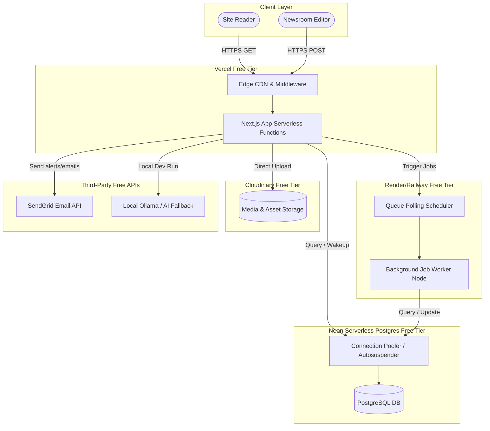

# Zero-Cost MVP Architecture

## Purpose
This document provides a comprehensive engineering guide for deploying and operating a fully functional NewsOps Cloud multi-tenant MVP environment entirely within the free-tier structures of modern cloud services. It outlines how components map to Neon, Vercel, Railway, Render, Cloudinary, and local development configurations, ensuring a $0.00/month baseline expense during initial validation.

## Executive Summary
Developing, testing, and launching a software-as-a-service (SaaS) product can incur significant initial hosting costs. NewsOps Cloud mitigates this burden by providing a formal "Zero-Cost MVP Architecture". By selecting specific serverless and developer-friendly platforms, the core digital publishing system can run with full database access, CDN distributions, collaborative editors, media optimization libraries, and background queue workers at no hosting expense. This blueprint details the integration mappings, resource boundaries, and limits that must be managed to maintain a free-tier operating posture.

## Vision
The vision of the NewsOps Cloud MVP architecture is to democratize digital publishing infrastructure. Independent journalists, small editorial teams, and bootstrapping developers should have access to enterprise-grade publishing tooling without financial barriers. As the audience and content scale, the platform is designed to transition to paid dedicated tiers.

## Scope
This architectural guide covers:
1. **Frontend Hosting**: Vercel Free Plan.
2. **Serverless Database**: Neon PostgreSQL Free Tier.
3. **Background Worker & API Hosting**: Render Free Instance or Railway Starter Credit Tier.
4. **Media and Asset Management**: Cloudinary Free Tier.
5. **Local Dev Environment**: Docker-compose setup utilizing Ollama/vLLM and local Redis.

This design excludes the setup of enterprise AWS/GCP Kubernetes clusters, high-availability multi-region replication, and paid commercial LLM APIs.

## Goals
- **Zero Financial Cost**: Maintain exactly $0.00/month hosting fees for up to 3 active tenants.
- **Production-Ready Core**: Ensure all functional CMS components (editor, auth, database, publishing queues) operate seamlessly.
- **Frictionless Migration**: Define clear environment variable mapping so that upgrading to paid plans requires only configuration changes, not code rewrite.
- **Resource Visibility**: Monitor free-tier usage metrics to prevent sudden account suspension due to quota exhaustion.

## Functional Requirements
1. **Database Autosuspension**: The database layer must handle Neon's auto-suspension behavior (database sleep state after 5 minutes of inactivity) and wake up within 3 seconds without causing application failures.
2. **Dynamic CDN Routing**: The frontend router (Vercel) must handle dynamic subdomain mapping (e.g., `tenant1.newsops.local` or custom domains) via middleware redirects.
3. **Asset Transform Optimization**: Media upload components must direct images to Cloudinary, specifying on-the-fly compression and resizing parameters to minimize bandwidth consumption.
4. **Queued Worker Ingestion**: Background synchronization and social queue workers must run within Render's free CPU minute quotas, sleep when idle, and spin up instantly upon queue insertion.

## Non-Functional Requirements
1. **Response Time Constraints**: Under awake conditions, the home page must load in under 1.5 seconds. Under cold-start conditions, the first request may take up to 6.0 seconds.
2. **Storage Allocation Cap**: Total database storage must be capped at 500 MB, and active Cloudinary media library storage must remain under 10 GB.
3. **Monthly Bandwidth Ceiling**: Keep client assets optimized to stay within Vercel's 100 GB/month bandwidth limit and Cloudinary's 25 Credits (25 GB transfer/transforms) limits.

## Business Rules
1. **Idle Resource Sleep**: Database compute nodes must be configured to automatically suspend after 5 minutes of idle time.
2. **Archival Policy**: For MVP tenants, articles older than 180 days with no traffic must be archived to plain markdown text files to save database tablespace.
3. **Local LLM Fallback**: In the local development environment, AI routing must fall back to local Ollama (Llama 3) models, avoiding external API token costs.

## Actors
- **MVP Developer**: Builds and tests features using local or free cloud services.
- **Independent Journalist**: Leverages the free cloud deployment to publish news content.
- **Platform System Operator**: Monitors usage limits across free-tier providers to prevent outages.

## User Stories
1. **Bootstrap Deployments**: As an Independent Journalist, I want to deploy a personal news channel without paying upfront hosting fees so that I can validate my audience before purchasing paid domains and databases.
2. **Local Machine Sandbox**: As an MVP Developer, I want to spin up the entire database, Redis cache, and an AI model locally using Docker so that I can work offline without relying on cloud services.
3. **Quota Alerts**: As a Platform System Operator, I want to receive notifications when our monthly Cloudinary bandwidth reaches 90% of the free credit limit so that we can prevent media load failures.

## Acceptance Criteria
1. **Monthly Invoice Cost**: The aggregated hosting bill for Neon, Vercel, Render/Railway, and Cloudinary must equal exactly `$0.00` USD at the end of the billing cycle.
2. **Database Wakeup Recovery**: If the Neon database is in an autosuspended sleep state, a client request to the website must wake up the database and render the page successfully within `4.0 seconds`.
3. **Asset Optimization Ratio**: Uploaded images must be automatically converted to `.webp` format and scaled to a maximum width of `1200px` at the client upload boundary, ensuring files remain under `200KB` on Cloudinary.
4. **Render Sleep Recovery**: The Render API background instance must wake up from sleep and handle the first request in less than `30 seconds` without dropping HTTP headers.

## Workflows
1. **Cold Start User Ingestion Workflow**:
   - Reader visits `https://mvp-tenant.newsops.cloud`.
   - Vercel Edge Middleware intercepts the request.
   - Vercel checks the database connectivity. If Neon database is suspended:
     - The database engine detects incoming TCP connection, triggers resume event.
     - Database wakes up (takes 2.5 - 3.5 seconds).
     - Next.js queries database, pulls tenant settings, renders home page markup.
   - Reader sees the page content. Subsequent reads are served from Vercel edge cache in < 50ms.

2. **Local Development Setup Workflow**:
   - Developer clones the code repository.
   - Developer copies `.env.example` to `.env.local` configured for local mock parameters.
   - Developer runs `docker compose -f docker-compose.local.yml up -d`.
   - Docker starts local PostgreSQL, Redis, and Ollama containers.
   - Developer runs `prisma db push` to generate database schema tables.
   - Developer runs `npm run dev` to start Next.js web application on `localhost:3000`.

## API Design

### 1. Retrieve MVP Resources and Limits
- **Method**: `GET`
- **Path**: `/api/v1/mvp/usage`
- **Headers**:
  - `Authorization`: `Bearer JWT_TOKEN`
- **Response (200 OK)**:
```json
{
  "status": "success",
  "billing_cycle": "June 2026",
  "monitored_services": {
    "neon_postgres": {
      "storage_bytes_used": 157286400,
      "storage_bytes_limit": 524288000,
      "utilization_pct": 30.0,
      "autosuspension_delay_seconds": 300
    },
    "cloudinary": {
      "credits_used": 12.4,
      "credits_limit": 25.0,
      "utilization_pct": 49.6,
      "images_stored": 2450
    },
    "vercel_hosting": {
      "bandwidth_bytes_used": 42949672960,
      "bandwidth_bytes_limit": 107374182400,
      "utilization_pct": 40.0
    },
    "render_workers": {
      "credits_used_hours": 320,
      "credits_limit_hours": 750,
      "utilization_pct": 42.6
    }
  }
}
```

### 2. Manual Archive Trigger (Free Tier Tablespace Recovery)
- **Method**: `POST`
- **Path**: `/api/v1/mvp/database/cleanup`
- **Headers**:
  - `Authorization`: `Bearer JWT_TOKEN`
  - `Content-Type`: `application/json`
- **Request Body**:
```json
{
  "tenant_id": "tenant_uuid_12345",
  "archive_before_date": "2025-12-31T00:00:00Z",
  "dry_run": false
}
```
- **Response (200 OK)**:
```json
{
  "status": "success",
  "tenant_id": "tenant_uuid_12345",
  "records_archived": 342,
  "freed_storage_kb": 15420.0,
  "current_storage_pct": 27.1
}
```

## Database Design

### Schema Design
To trace free tier quotas and log resource operations, we introduce a dedicated usage logging schema:

```sql
-- Resource Quota Meters Table
CREATE TABLE free_tier_resource_meters (
    id UUID PRIMARY KEY DEFAULT gen_random_uuid(),
    provider_name VARCHAR(100) NOT NULL, -- 'neon', 'cloudinary', 'vercel', 'render'
    metric_name VARCHAR(100) NOT NULL, -- e.g. 'storage_bytes', 'bandwidth_bytes'
    current_value DECIMAL(16,2) NOT NULL DEFAULT 0.00,
    max_limit DECIMAL(16,2) NOT NULL,
    warning_percent INT NOT NULL DEFAULT 90,
    last_checked_at TIMESTAMP WITH TIME ZONE DEFAULT CURRENT_TIMESTAMP
);

CREATE UNIQUE INDEX idx_provider_metric ON free_tier_resource_meters(provider_name, metric_name);

-- Dormant Tenant Log Table (Tracks Neon DB sleeps)
CREATE TABLE db_wake_events (
    id UUID PRIMARY KEY DEFAULT gen_random_uuid(),
    event_timestamp TIMESTAMP WITH TIME ZONE DEFAULT CURRENT_TIMESTAMP,
    wake_duration_ms INT NOT NULL, -- time taken to execute first query after sleep
    caller_ip VARCHAR(50)
);

CREATE INDEX idx_db_wake_events_time ON db_wake_events(event_timestamp);
```

## UI Design
The system contains a "Resource Monitors" page available strictly to Super Administrators.

### Component Structure
1. **Quota Gauge Cards**: A series of circular progress indicators displaying resource usage levels across Vercel, Neon, Cloudinary, and Render. Gauges turn Red if the values exceed the warning percentage.
2. **Database Wake Latency Chart**: A bar graph showing database wake-up latencies across the past week.
3. **Tablespace Optimizer Panel**: Allows the operator to trigger database cleanups manually, showing estimated tablespace recovery parameters.
4. **Local Engine Config Downloader**: Provides buttons to download `.env.local` files, Docker configuration scripts, and local developer startup packages.

## Permissions
Access to MVP configurations and resource metrics is limited to:
- `Super Administrator / Owner`:
  - `resources:read`
  - `resources:manage` (Allows modifying limits and running cleanup tasks)
- `Tenant Administrator`:
  - No access to cloud infrastructure metrics. Can view only their storage usage statistics.
    - `tenant_storage:read`

## Security
1. **Credential Safety**: Ensure all local `.env` files are added to `.gitignore` to prevent leaking service keys on GitHub.
2. **Neon Connection Safety**: All Neon connection strings must force SSL parameters by appending `?sslmode=require` to the connection url.
3. **Cloudinary Upload Presets**: Do not expose raw Cloudinary secret keys inside frontend client code. Instead, utilize unsigned upload presets coupled with size limits and file format whitelist verifications.
4. **Vercel Deployment Protection**: Enable Vercel environment verification filters to block search crawlers and public traffic from hitting dynamic staging urls (`*.vercel.app`) to save monthly bandwidth.

## Performance
- **Database Query Throttling**: Run client applications with a maximum database connection pool size of `5` (e.g., `?connection_limit=5`) to prevent crashing Neon's free compute limits.
- **Image Optimization API**: Cloudinary upload pipeline must utilize gravity auto-cropping and dynamic format selection parameters:
  `c_fill,g_auto,f_auto,q_auto` to ensure client images are served at the lowest size possible.
- **Static Re-generation (ISR)**: Configure Next.js static page generation revalidation interval to at least `3600 seconds` (1 hour) to reduce backend database queries.

## Monitoring
Since Prometheus systems are not natively hosted inside standard free-tier plans, we utilize a combination of SaaS tools:
- **Neon Analytics**: Track query duration statistics directly in the Neon console.
- **UpTimeRobot**: Set up HTTP pings every 5 minutes targeting `/api/v1/health` to keep Render/Railway workers active and monitor overall uptime.
- **Cron Jobs**: Run a serverless function once per day to collect Cloudinary resource values via the Cloudinary Admin API and update `free_tier_resource_meters`.

### Alert Triggers
- **Quota Warning Alert**: If any provider utilization reaches `90%`, trigger email notifications using a free SendGrid API token.

## Logging
Logging systems must direct JSON outputs to the console. Log collectors (e.g., Vercel Logs) capture these records:
```json
{
  "timestamp": "2026-06-27T17:02:00.321Z",
  "level": "INFO",
  "context": "database-connection-initiator",
  "neon_wake_duration_ms": 2840,
  "cold_start_detected": true,
  "message": "Neon PostgreSQL database woke up from auto-suspension."
}
```

## Error Handling

| System Error Code | Source Component | HTTP Status | Customer-Facing Message |
| :--- | :--- | :--- | :--- |
| `ERR_NEON_AUTOSUSPEND` | Neon Postgres DB | 503 Service Unavailable | The database is initializing. Please reload the page in a few seconds. |
| `ERR_RAILWAY_CREDITS_EXHAUSTED` | Railway API | 503 Service Unavailable | The backend worker engine has run out of computing allocations. |
| `ERR_CLOUDINARY_BANDWIDTH_LIMIT` | Cloudinary Storage | 403 Forbidden | Media assets are temporarily unavailable due to bandwidth quota limit hits. |
| `ERR_VERCEL_TIMEOUT` | Vercel Serverless | 504 Gateway Timeout | The application processing function took too long to complete. Please try again. |

## Edge Cases
1. **Neon Sleep State During Critical Writes**: If a webhook arrives while Neon is sleeping, the connection may fail. The Node database caller must execute retries (maximum of `3 retries` with `1.0s`, `2.0s`, and `4.0s` sleep delays) to ensure the database is awake before failing.
2. **Render Worker Quota Expiration**: If monthly Render/Railway credits run out, background workers halt. To handle this, the core CMS app must degrade gracefully, falling back to synchronous execution blocks for database updates while queuing social postings locally until the next month.
3. **Large Image Upload Crashes**: Users uploading massive 10MB JPEG files. We enforce client-side canvas-resizing in the browser before dispatching the payload to Cloudinary, ensuring raw bytes never exceed 2MB.

## Future Improvements
1. **Migrate to Fly.io Paid Database**: Upgrade to self-hosted Postgres containers on Fly.io starting at $5/month for continuous compute and larger storage space.
2. **Introduce Supabase Integration**: Leverage Supabase as an alternative free-tier provider, offering Postgres, Auth, and Storage in a unified console.
3. **AWS Free Tier Mapping**: Design an alternative Terraform script mapping all MVP requirements to AWS Free Tier resources (DynamoDB, Lambda, S3, CloudFront).

## Mermaid Diagrams

### Zero-Cost Architecture Mapping



## References
- [System Architecture](../02-architecture/index.md)
- [Performance Budget](../02-architecture/performance_budget.md)
- [Future Proofing Plan](../02-architecture/future_proofing_plan.md)
