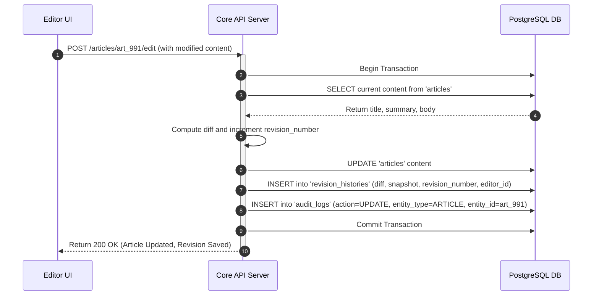
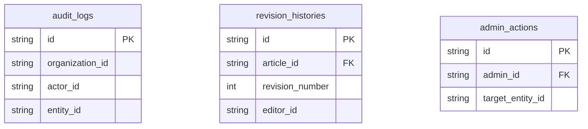

# Audit and History Schema

## Purpose
The purpose of the Audit and History Schema is to define the database architecture, constraints, and data layouts required to support comprehensive user action logs, administrative intervention history, and article version control systems. This schema functions as the system of record for compliance verification, editorial history restoration, security investigations, and general operational transparency.

## Executive Summary
For enterprise-grade news operations, traceability and verification of administrative actions and content edits are critical. This document details the PostgreSQL and Prisma design of the audit database, which includes `audit_logs`, `revision_histories`, and `admin_actions` tables. The architecture utilizes high-performance indexing, JSON diff structures, and read-optimized query patterns to ensure audit trials are unalterable, fast to query, and decoupled from primary database performance constraints.

## Vision
Our vision is to provide a complete, immutable timeline of every event within the NewsOps Cloud platform. Whether tracing an unauthorized setting change, restoring an article to its version from three days ago, or demonstrating SOC2 compliance regarding database administration access, this schema ensures complete auditing coverage without degrading transaction speeds in critical editorial paths.

## Scope
This schema covers:
- System-wide logging of all mutation actions on core business entities.
- Editorial version control history (revisions, diffs, snapshots).
- Privileged admin actions, including user access configuration, tenant tier modification, and infrastructure overrides.

It does not cover application-level diagnostics or tracing logs (e.g., debug messages, routing latency, system exceptions), which are streamed directly to application aggregators like Datadog or ELK stack.

## Goals
- Guarantee audit records are immutable at the application and database level (inserts only, no updates or deletes).
- Retrieve revision histories and restore previous content states in under 30ms.
- Support JSON-based field differences to optimize historical storage footprint.
- Record administrative system overrides separately from standard user actions for enhanced compliance reporting.

## Functional Requirements
- **System Auditing**: Automatically capture the who, what, when, and where of any entity creation, modification, or deletion.
- **Article Versioning**: Record exact text changes between content drafts, allowing editors to compare versions and rollback.
- **Diff Tracking**: Store field differences in a standard format (e.g., JSONB diff) to avoid duplication of large text blocks.
- **Privileged Actions Recording**: Log high-risk actions (e.g., plan overrides, IP whitelisting changes, tenant suspensions) in a dedicated secure table.
- **Context Logging**: Save context details like IP addresses, browser user agents, and authorization methods (API keys vs user sessions).

## Non-Functional Requirements
- **Write Optimization**: Audit logs should support burst writes of up to 2,000 logs/second without delaying user transactions.
- **Immutability Protection**: Prevent any UPDATE or DELETE operations on audit tables using database rules or row-level permissions.
- **Partitioning**: Ensure audit tables can be easily partitioned by month or quarter to allow archival of older logs.
- **Query Performance**: Read queries filtering audit records by `organization_id` or `entity_id` must use indexed B-Trees to guarantee sub-50ms latencies.

## Business Rules
1. Audit log entries (`audit_logs`) are strictly write-only. Database users must not be granted UPDATE or DELETE permissions on this table.
2. A revision history entry (`revision_histories`) must increment its `revision_number` sequentially starting at 1 for each article.
3. Every admin action (`admin_actions`) must specify a text `reason` field before the action is executed.
4. Changes to sensitive settings (permissions, keys) must log both the previous state and the new state in the JSON `changed_fields` block.

## Actors
- **Editor / Writer**: Modifies articles, creating revision histories. Compares versions to resolve content changes.
- **Security Auditor**: Reviews system audit logs to investigate anomalies or verify organization compliance.
- **System Administrator**: Executes configuration changes (recorded in admin actions) and manages tenant configurations.
- **Automated Security Service**: Monitors audit records to detect rapid setting shifts or brute-force pattern indications.

## User Stories
1. **As an Editor**, I want to view a side-by-side comparison of an article's current draft against a version saved yesterday so that I can identify and restore deleted paragraphs.
2. **As an Organization Admin**, I want to search the audit logs to find out which team member modified our external RSS ingestion source settings yesterday.
3. **As a Security Compliance officer**, I want to export an unalterable log of all admin panel actions from the past 90 days to prove that only authorized personnel updated billing plans.

## Acceptance Criteria
1. The database must reject any attempts to update or delete rows in `audit_logs` or `admin_actions` tables using SQL rules.
2. The `revision_histories` schema must store the content difference using a structured JSON pattern containing added/deleted segments.
3. In case of an article restore request, the system must reconstruct the article state from the requested `revision_number` snapshots.
4. Export queries of administrative actions for a specific range must execute in less than 200ms for volumes up to 500,000 logs.

## Workflows
1. **Article Edit Revision Logging**:
   - Writer edits article in UI, clicks "Save".
   - Application API starts transaction, reads the current active article record.
   - API calculates text difference, increments `revision_number` by 1.
   - API saves the new article draft in the `articles` table.
   - In parallel, API inserts a new record into `revision_histories` including the delta changes, title snapshot, and editor metadata.
   - API commits transaction, returning the new version ID.

2. **Compliance Review of Settings Alteration**:
   - Auditor logs into admin console, requests audit history for "Source Settings".
   - API queries `audit_logs` filtering by entity type (`SOURCE`) and target entity ID.
   - Database executes index search on `idx_audit_entity_search` and returns results.
   - UI renders a formatted timeline displaying the actor, timestamp, IP address, and details of the changes.



## API Design

### GET /api/v1/audit/logs
Retrieves general system audit logs scoped to the active tenant.
**Request Headers**:
- `Authorization: Bearer <JWT>`

**Request Query Parameters**:
- `entityType`: "SOURCE"
- `entityId`: "src_883011293"
- `limit`: 10

**Response Payload (200 OK)**:
```json
{
  "logs": [
    {
      "id": "aud_112938491",
      "action": "UPDATE",
      "entityType": "SOURCE",
      "entityId": "src_883011293",
      "actorId": "usr_77182901",
      "actorType": "USER",
      "ipAddress": "192.168.1.50",
      "changedFields": {
        "cronExpression": {
          "old": "0 */4 * * *",
          "new": "0 */2 * * *"
        }
      },
      "timestamp": "2026-06-27T22:20:00.000Z"
    }
  ],
  "pagination": {
    "total": 1,
    "limit": 10,
    "page": 1
  }
}
```

### GET /api/v1/articles/{id}/revisions
Retrieves the history of revisions for a specific article.
**Response Payload (200 OK)**:
```json
{
  "articleId": "art_9912",
  "revisions": [
    {
      "id": "rev_5501192",
      "revisionNumber": 2,
      "editorId": "usr_77182901",
      "titleSnapshot": "Breaking: Market Growth Surges",
      "summarySnapshot": "An overview of market fluctuations.",
      "contentDiff": {
        "added": ["Initial indicators show a 10% rise across indices."],
        "removed": ["Indicators show some rise."]
      },
      "createdAt": "2026-06-27T14:30:00.000Z"
    },
    {
      "id": "rev_5501180",
      "revisionNumber": 1,
      "editorId": "usr_77182901",
      "titleSnapshot": "Market Growth Surges",
      "summarySnapshot": "An overview.",
      "contentDiff": {},
      "createdAt": "2026-06-27T10:00:00.000Z"
    }
  ]
}
```

## Database Design

### Prisma Schema
```prisma
datasource db {
  provider = "postgresql"
  url      = env("DATABASE_URL")
}

generator client {
  provider = "prisma-client-js"
}

enum ActorType {
  USER
  API_KEY
  SYSTEM
}

enum AdminActionType {
  TENANT_SUSPENSION
  PLAN_OVERRIDE
  USER_DELETION
  SETTING_MUTATION
  DATABASE_MAINTENANCE
}

model AuditLog {
  id             String    @id @default(dbgenerated("concat('aud_', replace(gen_random_uuid()::text, '-', ''))")) @db.VarChar(50)
  organizationId String    @map("organization_id") @db.VarChar(50)
  actorId        String    @map("actor_id") @db.VarChar(50)
  actorType      ActorType @map("actor_type")
  action         String    @db.VarChar(100) // CREATE, UPDATE, DELETE, PUBLISH
  entityType     String    @map("entity_type") @db.VarChar(100) // ARTICLE, SOURCE, CONNECTION
  entityId       String    @map("entity_id") @db.VarChar(50)
  changedFields  Json?     @map("changed_fields") // JSON storing before/after details
  ipAddress      String?   @map("ip_address") @db.VarChar(45) // IPv4 or IPv6
  userAgent      String?   @map("user_agent") @db.VarChar(512)
  timestamp      DateTime  @default(now())

  @@index([organizationId])
  @@index([entityType, entityId])
  @@index([timestamp])
  @@map("audit_logs")
}

model RevisionHistory {
  id               String   @id @default(dbgenerated("concat('rev_', replace(gen_random_uuid()::text, '-', ''))")) @db.VarChar(50)
  articleId        String   @map("article_id") @db.VarChar(50)
  revisionNumber   Int      @map("revision_number")
  editorId         String   @map("editor_id") @db.VarChar(50)
  titleSnapshot    String   @map("title_snapshot") @db.VarChar(512)
  summarySnapshot  String?  @map("summary_snapshot") @db.Text
  contentSnapshot  String   @map("content_snapshot") @db.Text // Full snapshot or large diff
  contentDiff      Json     @map("content_diff") // Structured difference block
  createdAt        DateTime @default(now()) @map("created_at")

  @@unique([articleId, revisionNumber])
  @@index([articleId])
  @@map("revision_histories")
}

model AdminAction {
  id             String          @id @default(dbgenerated("concat('adm_', replace(gen_random_uuid()::text, '-', ''))")) @db.VarChar(50)
  adminId        String          @map("admin_id") @db.VarChar(50)
  actionType     AdminActionType @map("action_type")
  targetEntityId String          @map("target_entity_id") @db.VarChar(100)
  reason         String          @db.Text
  ipAddress      String?         @map("ip_address") @db.VarChar(45)
  metadata       Json?           @map("metadata")
  createdAt      DateTime        @default(now()) @map("created_at")

  @@index([adminId])
  @@index([actionType])
  @@index([createdAt])
  @@map("admin_actions")
}
```

### PostgreSQL DDL
```sql
-- Schema DDL setup for Auditing and Version History Module

CREATE TYPE actor_type AS ENUM ('USER', 'API_KEY', 'SYSTEM');
CREATE TYPE admin_action_type AS ENUM ('TENANT_SUSPENSION', 'PLAN_OVERRIDE', 'USER_DELETION', 'SETTING_MUTATION', 'DATABASE_MAINTENANCE');

-- System-wide Mutation Auditing
CREATE TABLE audit_logs (
    id VARCHAR(50) PRIMARY KEY DEFAULT concat('aud_', replace(gen_random_uuid()::text, '-', '')),
    organization_id VARCHAR(50) NOT NULL,
    actor_id VARCHAR(50) NOT NULL,
    actor_type actor_type NOT NULL,
    action VARCHAR(100) NOT NULL,
    entity_type VARCHAR(100) NOT NULL,
    entity_id VARCHAR(50) NOT NULL,
    changed_fields JSONB DEFAULT '{}',
    ip_address VARCHAR(45),
    user_agent VARCHAR(512),
    timestamp TIMESTAMP WITH TIME ZONE NOT NULL DEFAULT NOW()
);

CREATE INDEX idx_audit_org ON audit_logs(organization_id);
CREATE INDEX idx_audit_entity_search ON audit_logs(entity_type, entity_id);
CREATE INDEX idx_audit_time ON audit_logs(timestamp DESC);

-- PostgreSQL DB Rule to prevent Updates or Deletions (Immutability check)
CREATE RULE no_update_audit_logs AS ON UPDATE TO audit_logs DO INSTEAD NOTHING;
CREATE RULE no_delete_audit_logs AS ON DELETE TO audit_logs DO INSTEAD NOTHING;

-- Article Revision Control History
CREATE TABLE revision_histories (
    id VARCHAR(50) PRIMARY KEY DEFAULT concat('rev_', replace(gen_random_uuid()::text, '-', '')),
    article_id VARCHAR(50) NOT NULL,
    revision_number INT NOT NULL,
    editor_id VARCHAR(50) NOT NULL,
    title_snapshot VARCHAR(512) NOT NULL,
    summary_snapshot TEXT,
    content_snapshot TEXT NOT NULL,
    content_diff JSONB NOT NULL DEFAULT '{}',
    created_at TIMESTAMP WITH TIME ZONE NOT NULL DEFAULT NOW(),
    CONSTRAINT uq_article_revision UNIQUE (article_id, revision_number)
);

CREATE INDEX idx_revisions_article ON revision_histories(article_id);

-- System Administrator Action Audit
CREATE TABLE admin_actions (
    id VARCHAR(50) PRIMARY KEY DEFAULT concat('adm_', replace(gen_random_uuid()::text, '-', '')),
    admin_id VARCHAR(50) NOT NULL,
    action_type admin_action_type NOT NULL,
    target_entity_id VARCHAR(100) NOT NULL,
    reason TEXT NOT NULL,
    ip_address VARCHAR(45),
    metadata JSONB DEFAULT '{}',
    created_at TIMESTAMP WITH TIME ZONE NOT NULL DEFAULT NOW()
);

CREATE INDEX idx_admin_actions_id ON admin_actions(admin_id);
CREATE INDEX idx_admin_actions_type ON admin_actions(action_type);
CREATE INDEX idx_admin_actions_time ON admin_actions(created_at DESC);

-- DB Rule to enforce administrative audit immutability
CREATE RULE no_update_admin_actions AS ON UPDATE TO admin_actions DO INSTEAD NOTHING;
CREATE RULE no_delete_admin_actions AS ON DELETE TO admin_actions DO INSTEAD NOTHING;
```

## UI Design
- **Audit History Log Viewer**: Scoped dashboard for administrators displaying chronological lists of actions. Filter options allow sorting by date range, action type, user, or specific entity type. Clicking a row expands a code-block showing changed JSON attributes.
- **Article Version Control Dashboard**: A timeline slider displaying edits to an article. Includes a side-by-side diff renderer highlighting deleted characters in red and new edits in green, with a prominent "Rollback to this Version" button.
- **Admin Security Console**: Specialized high-security viewer showing entries in `admin_actions`. Displays a map IP location lookup, actor identity, action class, and reasons provided.

## Permissions
- `audit:logs:read` - Compliance Officer, Admin. Access standard user audit entries.
- `audit:admin_actions:read` - Compliance Officer, Security Lead. Access administrative audit entries.
- `audit:revisions:read` - Editor, Content Coordinator. View article modification timelines.
- `audit:revisions:rollback` - Editor, Chief of Content. Revert active article state to revision.

## Security
- **Immutability Enforcement**: The inclusion of native PostgreSQL `RULE` constraints ensures that even if application server keys are compromised, updates and deletions cannot be made to the audit table without access to database owner credentials.
- **PII Protection**: User Agents and IP Addresses must be parsed. If security logs contain sensitive personal info, it is masked in the response unless the user holds `security:pii:read` access.
- **Integrity Verification**: Future enhancements will generate signature hashes for audit entries using KMS keys to verify no database records have been mutated at the file systems level.

## Performance
- **Write Processing**: The application does not wait for audit insertions; log actions are written to an in-memory queue (e.g. RabbitMQ or BullMQ) and consumed asynchronously by log workers, preventing API write latency.
- **Log Index Size**: As auditing datasets grow massive, tables are partitioned monthly to ensure primary indexes remain within memory capacity.

## Monitoring
- `newsops_audit_records_written_total`: Counter tracking logs generated by entity type.
- `newsops_audit_write_queue_backlog`: Gauge tracking background task log queue length.
- **Alert Triggers**: Trigger high priority security alert if an administrative action fails, or if database log queues grow beyond 10,000 backlogged items.

## Logging
- **Log Format**: JSON log format.
- **Log Levels**: INFO for regular user modifications; WARN for admin operations; ERROR for replication failures or security integrity issues.
- **Log Context Example**:
  ```json
  {
    "timestamp": "2026-06-27T22:20:15.112Z",
    "level": "WARN",
    "context": "admin-auditing",
    "admin_id": "usr_9901",
    "action": "TENANT_SUSPENSION",
    "tenant_id": "org_912384912",
    "reason": "Outstanding invoice payment failures over 60 days.",
    "message": "Privileged administration override successfully completed and locked."
  }
  ```

## Error Handling
- `AUDIT_LOG_IMMUTABLE`: Code 403. HTTP Status 403 Forbidden. Message: "Audit logs are read-only and cannot be modified or deleted."
- `REVISION_NOT_FOUND`: Code 404. HTTP Status 404 Not Found. Message: "The requested revision number for this article does not exist."
- `INSUFFICIENT_AUDITOR_ACCESS`: Code 403. HTTP Status 403 Forbidden. Message: "You do not have the required permissions to view administrative audit records."

## Edge Cases
- **Simultaneous Article Revision Saves**: If two editors attempt to save changes at the same instant, database transaction locks enforce sequence ordering. The second editor receives a conflict message and is prompted to merge revisions.
- **System Failure During Log Persistence**: If the background log queue fails, backup file loggers write entries to local host disk logs. The local files are ingested once services recover.

## Future Improvements
- **Audit Blockchain Anchoring**: Implement periodic hash trees (Merkle Trees) of audit records and commit the root hash to a public blockchain or secure Ledger DB (like Amazon QLDB) for mathematically verifiable auditing.
- **Automatic Old Log Aggregation**: Configure automatic data pipelines to compress and move records older than 180 days to cold storage bucket targets (AWS S3 Glacier).

## Mermaid Diagrams


## References
- [System Architecture](../../docs/02-architecture/system_architecture.md)
- [Storage Architecture](../../docs/02-architecture/storage_architecture.md)
- [Monetization Strategy](../../docs/01-business/monetization_strategy.md)
