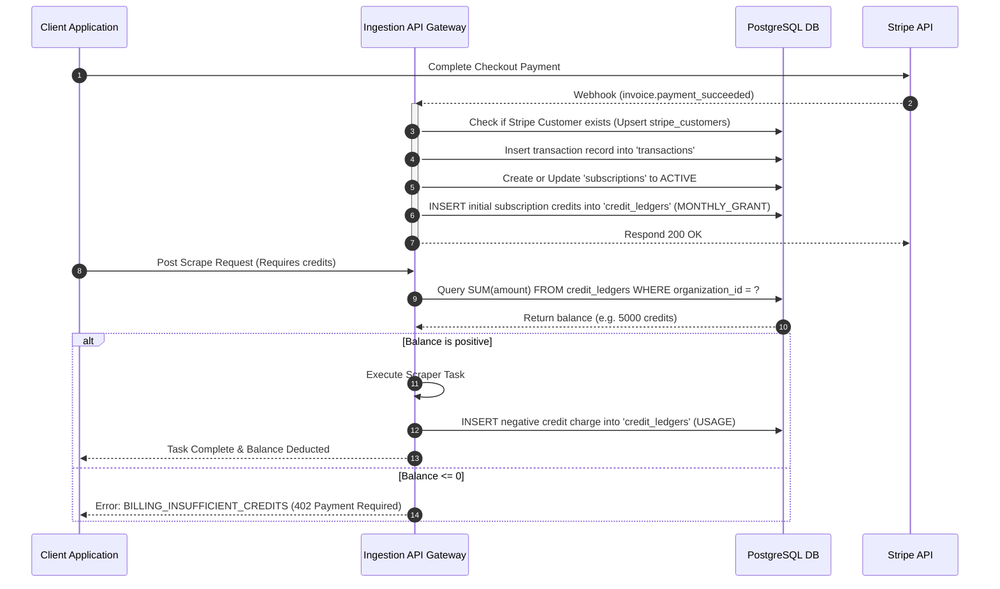
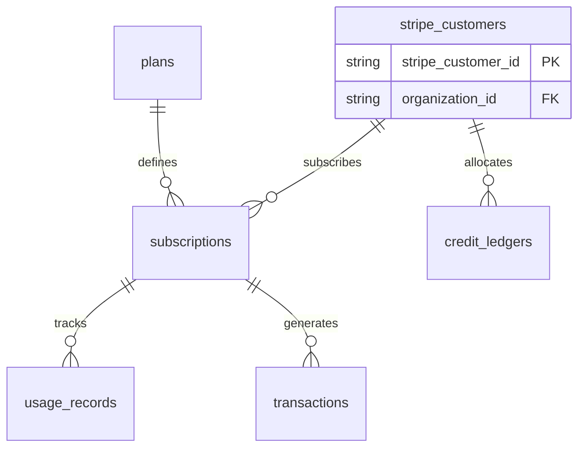

# Billing and Subscriptions Schema

## Purpose
The purpose of the Billing and Subscriptions Schema is to define the logical database model, relationship constraints, and transactional accounting ledger required to power subscription billing, usage charging, and credit tracking workflows for the NewsOps Cloud digital publishing platform. This schema enables integration with Stripe, maintains subscription states, records payment transactions, and tracks resource consumption credits.

## Executive Summary
The NewsOps Cloud platform employs a hybrid monetization strategy combining recurring tier-based subscription packages with a metered usage credit model (e.g., for AI content processing or high-frequency crawling). This document outlines a resilient, audit-friendly database architecture. It features schemas for `stripe_customers`, `plans`, `subscriptions`, `credit_ledgers`, `transactions`, and `usage_records`. It enforces financial audit trails, prevents overdrafts on computing resources, and aligns subscription states with external webhook events.

## Vision
Our vision is to build an automated, zero-touch billing infrastructure that scales dynamically with tenant resource usage. By utilizing double-entry bookkeeping properties in our credits ledger and storing detailed subscription checkpoints, the platform ensures correct invoice processing, eliminates billing discrepancies, and provides real-time cost-transparency to organization owners.

## Scope
This schema covers:
- Mapping internal tenant Organizations to Stripe Customer IDs.
- Core SaaS tier product plans and active subscription state tracking.
- System credit auditing (credits granted, bought, or consumed).
- Invoice-level payment transactions and status records.
- Ingestion metrics for metered billing charges.

It does not cover credit card number storage (which is entirely outsourced to Stripe's tokenized elements) or tax calculation models (handled by Stripe Tax services).

## Goals
- Maintain an accurate, immutable audit log of all balance changes using a strict credit ledger.
- Retrieve tenant subscription and credit balance statuses in under 10ms.
- Handle high-velocity usage metric logs (up to 500 events/second) without causing database bottlenecks.
- Support automated subscription synchronization via Stripe Webhooks with retry and validation safety.

## Functional Requirements
- **Stripe Customer Linkage**: Map each tenant organization to a unique Stripe customer profile.
- **Plan Management**: Configurable product structures representing features, limitations, prices, and monthly credit allocations.
- **Subscription Lifecycle**: Track billing states (`ACTIVE`, `PAST_DUE`, `CANCELED`, `UNPAID`) and renew periods automatically.
- **Credit Balance Accounting**: Ensure organizations cannot consume API or crawler actions if their credit ledger balance is zero or less.
- **Invoice Auditing**: Log every payment attempt, charge ID, reference invoice URL, and currency representation.
- **Usage Metering**: Log raw usage aggregates (e.g., number of AI requests, translation bytes) to calculate variable pricing.

## Non-Functional Requirements
- **Read Latency**: The system must verify subscription active status within 5ms at the gatekeeper/middleware layer.
- **Write Consistency**: Credit consumption operations must be executed in database transactions with strict serializable isolation or atomic balance updates.
- **Immutability**: Records in `credit_ledgers` and `transactions` must never be updated or deleted after insertion. Corrections must be handled via offset adjustments.
- **Precision**: Money amounts and credit balances must be stored in exact decimal and integer types (no floating-point values).

## Business Rules
1. An organization can have only one active subscription (`subscriptions`) at a time.
2. A plan's base price must be stored in the smallest currency unit (e.g., cents for USD).
3. The credit ledger balance of an organization is computed as the sum of all ledger amount logs. Direct editing of a balance field is prohibited.
4. If a subscription becomes `PAST_DUE`, the system enters a grace period of 7 days before suspending organization member writes.
5. Base monthly credit grants are applied on the first day of each billing cycle and expire at the end of the billing period unless designated as rollover credits.

## Actors
- **SaaS Customer / Organization Owner**: Views plans, subscribes, manages invoices, and purchases extra credits.
- **Stripe Webhook Handler**: Background system consumer that receives event payloads from Stripe and updates tables.
- **Platform Microservices**: Check credit ledger balance before initiating expensive tasks (e.g., AI summary generation).
- **Billing Administrator**: Manages plan catalogs and manually adjusts client credits for customer support resolution.

## User Stories
1. **As an Organization Owner**, I want to choose a subscription plan and pay via a secure Stripe checkout session so that my team gains immediate access to the premium scraper features.
2. **As a Crawler Service Instance**, I want to query the credit ledger to verify that a tenant organization has positive credit before executing a crawl job, avoiding unbilled resource usage.
3. **As a Customer Support Admin**, I want to grant a manual credit adjustment of 5,000 credits to an organization that suffered a service outage, leaving a clear trace for audit logs.

## Acceptance Criteria
1. The `credit_ledgers` table must enforce positive values for grants (`amount > 0`) and negative values for usage (`amount < 0`).
2. Calculations of customer balance using `SUM(amount)` must match the cached balance field in Redis with 100% consistency.
3. Stripe Webhook handling must support idempotent operations using the Stripe Event ID as a unique constraint.
4. Database money columns must use `DECIMAL(12, 2)` or `INT` representing cents to prevent rounding errors.

## Workflows
1. **Subscription Creation and Activation Workflow**:
   - Organization Owner selects "Starter Plan" in UI and starts checkout.
   - UI redirects to Stripe Checkout; Stripe handles credit card entry.
   - User pays successfully; Stripe fires `checkout.session.completed` webhook.
   - Webhook processor resolves customer tenant and inserts record to `stripe_customers`.
   - Webhook processor creates `subscriptions` record linked to the chosen `plans` entry.
   - Processor inserts positive transaction log into `transactions` and inserts initial credit grant into `credit_ledgers`.

2. **Metered Credit Consumption Workflow**:
   - Editor triggers "Generate AI Article Translation".
   - Application Gateway queries `credit_ledgers` sum for organization.
   - If sum <= 0, translation returns error code `BILLING_INSUFFICIENT_CREDITS`.
   - If sum > 0, translation executes.
   - Upon completion, the translation worker calculates the word count and determines the credit cost (e.g., 100 credits).
   - Worker inserts negative entry into `credit_ledgers` referencing the translation task ID.



## API Design

### GET /api/v1/billing/balance
Retrieves the real-time credit balance of the active tenant.
**Request Headers**:
- `Authorization: Bearer <JWT>`

**Response Payload (200 OK)**:
```json
{
  "organizationId": "org_912384912",
  "creditBalance": 4850,
  "lastUpdated": "2026-06-27T22:19:15.000Z",
  "status": "ACTIVE"
}
```

### POST /api/v1/billing/stripe-webhook
Processes webhook alerts from Stripe.
**Request Headers**:
- `Stripe-Signature: t=16123912,v1=91283921839...`

**Request Payload**:
```json
{
  "id": "evt_1N23891238",
  "type": "customer.subscription.updated",
  "data": {
    "object": {
      "id": "sub_stripe_8819",
      "customer": "cus_stripe_7712",
      "status": "past_due",
      "current_period_end": 1782633600
    }
  }
}
```

**Response Payload (200 OK)**:
```json
{
  "received": true,
  "processedId": "evt_1N23891238"
}
```

## Database Design

### Prisma Schema
```prisma
datasource db {
  provider = "postgresql"
  url      = env("DATABASE_URL")
}

generator client {
  provider = "prisma-client-js"
}

enum SubscriptionStatus {
  ACTIVE
  PAST_DUE
  CANCELED
  UNPAID
  TRIALING
}

enum LedgerTransactionType {
  MONTHLY_GRANT
  BONUS
  REFUND
  USAGE
  PURCHASE
}

enum TransactionStatus {
  SUCCESS
  FAILED
  REFUNDED
}

model StripeCustomer {
  id               String   @id @default(dbgenerated("concat('cus_', replace(gen_random_uuid()::text, '-', ''))")) @db.VarChar(50)
  organizationId   String   @unique @map("organization_id") @db.VarChar(50)
  stripeCustomerId String   @unique @map("stripe_customer_id") @db.VarChar(100)
  email            String   @db.VarChar(255)
  createdAt        DateTime @default(now()) @map("created_at")
  updatedAt        DateTime @updatedAt @map("updated_at")

  @@map("stripe_customers")
}

model Plan {
  id              String         @id @default(dbgenerated("concat('pln_', replace(gen_random_uuid()::text, '-', ''))")) @db.VarChar(50)
  name            String         @db.VarChar(100)
  stripeProductId String         @unique @map("stripe_product_id") @db.VarChar(100)
  stripePriceId   String         @unique @map("stripe_price_id") @db.VarChar(100)
  amount          Int            // Stored in cents
  currency        String         @default("usd") @db.VarChar(10)
  billingInterval String         @map("billing_interval") @db.VarChar(50) // monthly, yearly
  creditAllowance Int            @map("credit_allowance")
  maxUsers        Int            @map("max_users")
  features        Json           @map("features")
  isActive        Boolean        @default(true) @map("is_active")
  createdAt       DateTime       @default(now()) @map("created_at")
  updatedAt       DateTime       @updatedAt @map("updated_at")

  subscriptions   Subscription[]

  @@map("plans")
}

model Subscription {
  id                 String             @id @default(dbgenerated("concat('sub_', replace(gen_random_uuid()::text, '-', ''))")) @db.VarChar(50)
  organizationId     String             @map("organization_id") @db.VarChar(50)
  stripeSubscriptionId String           @unique @map("stripe_subscription_id") @db.VarChar(100)
  planId             String             @map("plan_id") @db.VarChar(50)
  status             SubscriptionStatus @default(TRIALING)
  currentPeriodStart DateTime           @map("current_period_start")
  currentPeriodEnd   DateTime           @map("current_period_end")
  cancelAtPeriodEnd  Boolean            @default(false) @map("cancel_at_period_end")
  trialStart         DateTime?          @map("trial_start")
  trialEnd           DateTime?          @map("trial_end")
  createdAt          DateTime           @default(now()) @map("created_at")
  updatedAt          DateTime           @updatedAt @map("updated_at")

  plan               Plan               @relation(fields: [planId], references: [id])
  usageRecords       UsageRecord[]

  @@index([organizationId])
  @@index([status])
  @@map("subscriptions")
}

model CreditLedger {
  id              String                @id @default(dbgenerated("concat('ldg_', replace(gen_random_uuid()::text, '-', ''))")) @db.VarChar(50)
  organizationId  String                @map("organization_id") @db.VarChar(50)
  amount          Int                   // Positive for additions, negative for consumption
  transactionType LedgerTransactionType @map("transaction_type")
  description     String                @db.VarChar(512)
  referenceId     String?               @map("reference_id") @db.VarChar(100) // Reference to job or charge ID
  createdAt       DateTime              @default(now()) @map("created_at")

  @@index([organizationId, createdAt])
  @@map("credit_ledgers")
}

model Transaction {
  id             String            @id @default(dbgenerated("concat('txn_', replace(gen_random_uuid()::text, '-', ''))")) @db.VarChar(50)
  organizationId String            @map("organization_id") @db.VarChar(50)
  stripeInvoiceId String?          @unique @map("stripe_invoice_id") @db.VarChar(100)
  stripeChargeId String?           @unique @map("stripe_charge_id") @db.VarChar(100)
  amount         Int               // Stored in cents
  currency       String            @default("usd") @db.VarChar(10)
  status         TransactionStatus @default(SUCCESS)
  invoicePdfUrl  String?           @map("invoice_pdf_url") @db.VarChar(2048)
  createdAt      DateTime          @default(now()) @map("created_at")

  @@index([organizationId])
  @@index([status])
  @@map("transactions")
}

model UsageRecord {
  id             String       @id @default(dbgenerated("concat('usg_', replace(gen_random_uuid()::text, '-', ''))")) @db.VarChar(50)
  subscriptionId String       @map("subscription_id") @db.VarChar(50)
  metricName     String       @map("metric_name") @db.VarChar(100) // AI_WORDS, SCRAPE_PAGES
  quantity       Int
  timestamp      DateTime     @default(now())

  subscription   Subscription @relation(fields: [subscriptionId], references: [id], onDelete: Cascade)

  @@index([subscriptionId, timestamp])
  @@map("usage_records")
}
```

### PostgreSQL DDL
```sql
-- Schema DDL setup for Billing and Subscriptions Module

CREATE TYPE subscription_status AS ENUM ('ACTIVE', 'PAST_DUE', 'CANCELED', 'UNPAID', 'TRIALING');
CREATE TYPE ledger_transaction_type AS ENUM ('MONTHLY_GRANT', 'BONUS', 'REFUND', 'USAGE', 'PURCHASE');
CREATE TYPE transaction_status AS ENUM ('SUCCESS', 'FAILED', 'REFUNDED');

-- Stripe Customers Mapping
CREATE TABLE stripe_customers (
    id VARCHAR(50) PRIMARY KEY DEFAULT concat('cus_', replace(gen_random_uuid()::text, '-', '')),
    organization_id VARCHAR(50) UNIQUE NOT NULL,
    stripe_customer_id VARCHAR(100) UNIQUE NOT NULL,
    email VARCHAR(255) NOT NULL,
    created_at TIMESTAMP WITH TIME ZONE NOT NULL DEFAULT NOW(),
    updated_at TIMESTAMP WITH TIME ZONE NOT NULL DEFAULT NOW()
);

-- SaaS Plans Table
CREATE TABLE plans (
    id VARCHAR(50) PRIMARY KEY DEFAULT concat('pln_', replace(gen_random_uuid()::text, '-', '')),
    name VARCHAR(100) NOT NULL,
    stripe_product_id VARCHAR(100) UNIQUE NOT NULL,
    stripe_price_id VARCHAR(100) UNIQUE NOT NULL,
    amount INT NOT NULL, -- in cents
    currency VARCHAR(10) NOT NULL DEFAULT 'usd',
    billing_interval VARCHAR(50) NOT NULL, -- monthly, yearly
    credit_allowance INT NOT NULL DEFAULT 0,
    max_users INT NOT NULL DEFAULT 1,
    features JSONB NOT NULL DEFAULT '{}',
    is_active BOOLEAN NOT NULL DEFAULT TRUE,
    created_at TIMESTAMP WITH TIME ZONE NOT NULL DEFAULT NOW(),
    updated_at TIMESTAMP WITH TIME ZONE NOT NULL DEFAULT NOW()
);

-- Subscriptions Table
CREATE TABLE subscriptions (
    id VARCHAR(50) PRIMARY KEY DEFAULT concat('sub_', replace(gen_random_uuid()::text, '-', '')),
    organization_id VARCHAR(50) NOT NULL,
    stripe_subscription_id VARCHAR(100) UNIQUE NOT NULL,
    plan_id VARCHAR(50) NOT NULL REFERENCES plans(id),
    status subscription_status NOT NULL DEFAULT 'TRIALING',
    current_period_start TIMESTAMP WITH TIME ZONE NOT NULL,
    current_period_end TIMESTAMP WITH TIME ZONE NOT NULL,
    cancel_at_period_end BOOLEAN NOT NULL DEFAULT FALSE,
    trial_start TIMESTAMP WITH TIME ZONE,
    trial_end TIMESTAMP WITH TIME ZONE,
    created_at TIMESTAMP WITH TIME ZONE NOT NULL DEFAULT NOW(),
    updated_at TIMESTAMP WITH TIME ZONE NOT NULL DEFAULT NOW(),
    CONSTRAINT chk_period_times CHECK (current_period_end >= current_period_start)
);

CREATE INDEX idx_subscriptions_org ON subscriptions(organization_id);
CREATE INDEX idx_subscriptions_status ON subscriptions(status);

-- Credit Ledger Table
CREATE TABLE credit_ledgers (
    id VARCHAR(50) PRIMARY KEY DEFAULT concat('ldg_', replace(gen_random_uuid()::text, '-', '')),
    organization_id VARCHAR(50) NOT NULL,
    amount INT NOT NULL, -- Positive for additions, negative for deductions
    transaction_type ledger_transaction_type NOT NULL,
    description VARCHAR(512) NOT NULL,
    reference_id VARCHAR(100),
    created_at TIMESTAMP WITH TIME ZONE NOT NULL DEFAULT NOW()
);

CREATE INDEX idx_ledger_org_time ON credit_ledgers(organization_id, created_at DESC);

-- Transaction Log Table
CREATE TABLE transactions (
    id VARCHAR(50) PRIMARY KEY DEFAULT concat('txn_', replace(gen_random_uuid()::text, '-', '')),
    organization_id VARCHAR(50) NOT NULL,
    stripe_invoice_id VARCHAR(100) UNIQUE,
    stripe_charge_id VARCHAR(100) UNIQUE,
    amount INT NOT NULL, -- in cents
    currency VARCHAR(10) NOT NULL DEFAULT 'usd',
    status transaction_status NOT NULL DEFAULT 'SUCCESS',
    invoice_pdf_url VARCHAR(2048),
    created_at TIMESTAMP WITH TIME ZONE NOT NULL DEFAULT NOW()
);

CREATE INDEX idx_transactions_org ON transactions(organization_id);
CREATE INDEX idx_transactions_status ON transactions(status);

-- Metered Usage Records
CREATE TABLE usage_records (
    id VARCHAR(50) PRIMARY KEY DEFAULT concat('usg_', replace(gen_random_uuid()::text, '-', '')),
    subscription_id VARCHAR(50) NOT NULL REFERENCES subscriptions(id) ON DELETE CASCADE,
    metric_name VARCHAR(100) NOT NULL,
    quantity INT NOT NULL CHECK (quantity >= 0),
    timestamp TIMESTAMP WITH TIME ZONE NOT NULL DEFAULT NOW()
);

CREATE INDEX idx_usage_sub_time ON usage_records(subscription_id, timestamp DESC);
```

## UI Design
- **Subscription Overview Dashboard**: Renders the tenant's current plan name, active status, billing cycle end-date, and credit balance bar. Contains action buttons for "Change Plan" or "Purchase Credits".
- **Billing History Table**: Lists past invoices (`transactions`) with dates, exact charge amounts, status chips (Success, Refunded), and direct PDF download links.
- **Credit Invoices and Logs**: A sub-tab inside settings displaying the credit transaction ledger history (`credit_ledgers`), allowing editors to see exactly how many credits each crawl job or AI task consumed.

## Permissions
- `billing:subscriptions:read` - All users in organization. View current plan details.
- `billing:subscriptions:write` - Organization Admin. Upgrade/cancel subscriptions, change credit cards.
- `billing:credits:read` - Editor, Organization Admin. View credit usage ledger.
- `billing:credits:adjust` - System Admin. Grant compensation credits.
- `billing:transactions:read` - Organization Admin. Download invoices.

## Security
- **Webhook Signature Validation**: The Stripe webhook endpoint must validate incoming request headers with Stripe's signing key (`webhook_secret`) before processing payload parameters to prevent falsified payments.
- **Row Locking on Charge**: When evaluating credit deductions, use transactional isolation or database updates like `UPDATE credit_cache SET balance = balance - 100 WHERE id = org` to prevent double-spending in multi-threaded workflows.
- **Isolation Scope**: All user actions regarding payment or credit logs must validate ownership by comparing the tenant payload context with the database `organization_id`.

## Performance
- **Credit Balance Retrieval**: Under 10ms. A cached value is kept in Redis and updated asynchronously as new entries are added to the database `credit_ledgers`.
- **Query Latency**: Index on `(organization_id, created_at)` in the ledger table ensures that fetching the historical ledger doesn't invoke sequential table scans.
- **Transactional Throughput**: Support 1,500 operations/sec on credit ledger tables during high volume crawl times.

## Monitoring
- `newsops_billing_invoice_success_total`: Counter tracking successful transactions.
- `newsops_billing_invoice_failed_total`: Counter tracking failed invoices.
- `newsops_billing_credit_balance_gauge`: Tracking the average credit reserves across premium tenants.
- **Alert Triggers**: Send high priority warning to Slack/PagerDuty if the Stripe webhook endpoint responds with `5xx` error codes or if webhook execution latency exceeds 1.5 seconds.

## Logging
- **Log Format**: JSON log format.
- **Log Levels**: INFO for successful webhook execution and plan switches; WARN for failed invoices or credit exhaustion warnings; ERROR for signature mismatches or DB schema locks during transaction execution.
- **Log Context Example**:
  ```json
  {
    "timestamp": "2026-06-27T22:19:35.789Z",
    "level": "INFO",
    "context": "billing-webhooks",
    "stripe_event_id": "evt_1N23891238",
    "organization_id": "org_912384912",
    "stripe_sub_id": "sub_stripe_8819",
    "message": "Subscription successfully transitioned to ACTIVE state."
  }
  ```

## Error Handling
- `BILLING_INSUFFICIENT_CREDITS`: Code 402. HTTP Status 402 Payment Required. Message: "Your organization does not have enough credits to perform this action. Please purchase more."
- `INVALID_WEBHOOK_SIGNATURE`: Code 401. HTTP Status 401 Unauthorized. Message: "The signature validation check for this webhook call failed."
- `SUBSCRIPTION_LOCK_CONFLICT`: Code 409. HTTP Status 409 Conflict. Message: "A subscription modification is currently in progress. Please retry in a few moments."
- `PLAN_NOT_FOUND`: Code 404. HTTP Status 404 Not Found. Message: "The specified plan pricing ID was not found in the catalog."

## Edge Cases
- **Duplicate Webhook Events**: Stripe may send the same event multiple times. The system ensures idempotency by storing processed event IDs and wrapping database calls in a transaction that fails on duplicate key constraint.
- **Network Failures mid Checkout**: If the Stripe payment goes through but the client disconnects, the asynchronous webhook endpoint ensures the database updates subscription status correctly even if the checkout session redirect fails.
- **Credit Balance Race Condition**: Multiple scraper tasks executing concurrently might read a positive balance, then write charges that exceed the limit. We handle this by verifying the balance inside a SERIALIZABLE transaction or using database triggers that roll back a write if `SUM(amount) < limit`.

## Future Improvements
- **Automatic Rollover Controls**: Add policy fields to plans to enable custom rules for credit rollover percentages at the end of each billing cycle.
- **Corporate Account Multi-Ledger**: Enable sub-organizations or separate workspace credits ledgers under a single master billing plan.

## Mermaid Diagrams


## References
- [System Architecture](../../docs/02-architecture/system_architecture.md)
- [Tenant Tiering Model](../../docs/01-business/tenant_tiering_model.md)
- [Monetization Strategy](../../docs/01-business/monetization_strategy.md)
