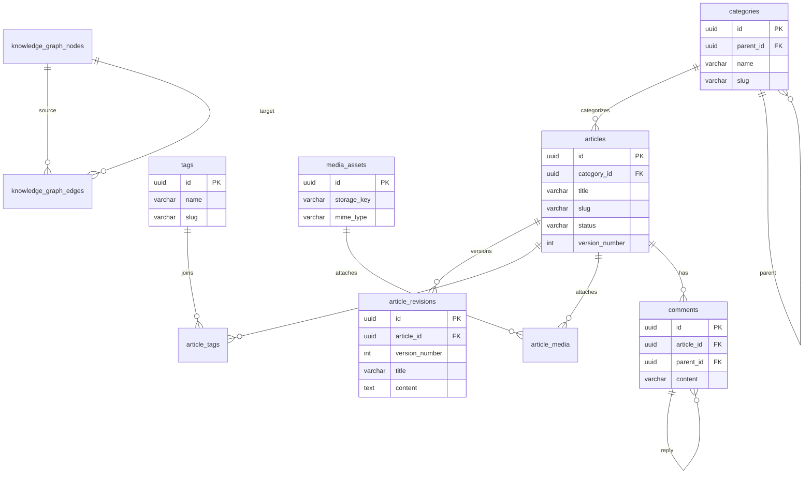

# Editorial and CMS Database Schema

## Purpose
This document details the relational database schemas and Prisma models for the Content Management System (CMS) and Editorial modules of NewsOps Cloud. It outlines tables, fields, indexes, relations, and semantic models for articles, revisions, taxonomies, media assets, comments, and knowledge graphs.

## Executive Summary
The CMS data layer is engineered to handle rich media ingestion, fast hierarchical content categorization, collaborative article version control, user discussions, and semantic tagging via a knowledge graph. Tables utilize UUIDv4 identifiers and strictly enforce the standards established in `schema_design_standards.md`. This schema balances relational integrity for historical audits (e.g., article revisions and user comments) with indexed query structures that support rapid public content delivery at scale.

## Vision
The editorial schema is designed to transition into a decentralized, high-performance publishing backend. By decoupling CMS schemas from Core Identity modules and structuring content objects for efficient JSON serialization, this schema guarantees that public-facing CDNs and GraphQL API layers can query and cache articles with near-zero database rendering latency.

## Scope
This schema design document details:
1. **Physical SQL Table Layouts**: Table definitions for `categories`, `tags`, `media_assets`, `articles`, `article_revisions`, `article_tags`, `article_media`, `comments`, `knowledge_graph_nodes`, and `knowledge_graph_edges`.
2. **Prisma ORM Models**: Complete Prisma definitions corresponding to the SQL schema, mapping relations, taxonomies, and graph models.
3. **Database Indexing Strategy**: Index configurations optimized for public feeds, category hierarchies, revision recovery, and comment threading.
4. **Relational Constraints**: Version control policies, self-referencing joins, and media asset reference rules.

It does not cover S3 file upload protocols or actual machine learning models used to generate knowledge graph tags.

## Goals
- **Immutability of Revisions**: Ensure article revisions are write-once to maintain audit integrity.
- **Hierarchical Categorization**: Support infinitely nested categories using self-referencing parent joins.
- **Fast Comment Tree Rendering**: Optimize comment retrieval pathing using material pathing or self-referencing index nodes.
- **Semantic Mapping**: Allow indexing and search engines to query semantic relationships using a relational Knowledge Graph model.

## Functional Requirements
- **Content Versioning**: Every modification to a published article must write a historical log into the `article_revisions` table.
- **Hierarchical Taxonomy**: Categories must support optional self-referencing parent category relations.
- **Flat Taxonomy Mapping**: Articles must support association with multiple tags via a join table.
- **Rich Media Association**: Support linking multiple media assets to an article, specifying their placement type (e.g. `PRIMARY_FEATURED`, `BODY_INLINE`).
- **Semantic Tagging**: Support attaching articles to semantic concepts represented by knowledge graph nodes and edges.

## Non-Functional Requirements
- **Article Load Latency**: Public SELECT requests retrieving an article with categories, tags, and media assets must execute in $< 8\text{ ms}$.
- **Revision Write Overhead**: Creating a revision must add $< 5\text{ ms}$ to the article update request thread.
- **Comment Tree Load Latency**: Fetching the top 100 comments for an article (nested up to 5 levels deep) must resolve in $< 12\text{ ms}$.

## Business Rules
- **Draft Versioning Exemption**: Revisions are only generated when saving changes to an article that is marked as `PUBLISHED` or `IN_REVIEW`.
- **Cascade Media Safety**: Deleting an article must never delete the referenced `media_assets` from the database. Instead, only the join associations in `article_media` are deleted.
- **Comment Moderation State**: Comments must transition through moderation states (`PENDING`, `APPROVED`, `FLAGGED`, `REJECTED`). Unapproved comments must be filtered from public queries.

## Actors
- **Editor**: Authors articles, edits content, and manages categories/tags.
- **Public Visitor**: Reads articles and publishes comments.
- **Semantic Engine Worker**: Automatically analyzes published text to extract entities and build knowledge graph edges.
- **Database Administrator (DBA)**: Optimizes index usage on content tables and manages database storage growth.

## User Stories
- **User Story 1**: As an Editor, I want to review previous versions of an article and revert to a draft from two days ago if necessary.
- **User Story 2**: As a Public Visitor, I want to view a fast-loading nested discussion tree beneath an article and post replies to other comments.
- **User Story 3**: As a Semantic AI Engine, I want to create nodes representing key people or locations found in an article and link them to establish structural metadata.

## Acceptance Criteria
- SQL schemas must use snake_case for all tables, columns, indexes, and keys.
- Unique constraints must use partial indexes (`WHERE deleted_at IS NULL`) to avoid conflict on soft-deleted slugs.
- Prisma models must map names correctly using `@map` and `@@map` declarations.
- Comment trees must use indexing on parent IDs to ensure hierarchical parsing is rapid.

## Workflows
### Version Control and Revision Workflow
1. **Save Action**: An editor edits a published article and hits "Save".
2. **Transaction Initiation**: The application begins a database transaction.
3. **Write Revision**: Before updating the main article row, the system writes the existing version's columns (`title`, `content`, `summary`, etc.) into `article_revisions`, incrementing the version counter.
4. **Update Article**: The system updates the primary row in `articles` with the new data, incrementing `version_number`.
5. **Commit**: The transaction commits, ensuring draft history is safely saved.

## API Design
### Article Retrieval (Public Endpoint)
Retrives a single article with taxonomy and media metadata.

* **URL**: `/api/v1/articles/:slug`
* **Method**: `GET`
* **Headers**:
  * `X-Tenant-ID: <Tenant-UUID>`
* **Response Payload (200 OK)**:
```json
{
  "id": "7fa23d4c-c049-43c7-9cfb-81d368e7b34e",
  "title": "NewsOps Cloud Launches Database Architecture",
  "slug": "newsops-cloud-launches-database-architecture",
  "summary": "This document maps the implementation details of the CMS database layer.",
  "content": "<p>NewsOps Cloud database structure is built on PostgreSQL...</p>",
  "status": "PUBLISHED",
  "versionNumber": 4,
  "publishedAt": "2026-06-27T22:17:28Z",
  "category": {
    "id": "e2646277-3e11-47fe-bbba-c39cb8a113a3",
    "name": "Engineering"
  },
  "tags": [
    { "id": "09cf7d93-3ea7-4e78-9e59-19cc7b233a01", "name": "PostgreSQL" },
    { "id": "3bb6277a-4c28-4991-b333-e39cb8221c99", "name": "Prisma" }
  ],
  "media": [
    {
      "id": "18cf7d93-3ea7-4e78-9e59-19cc7b233a02",
      "url": "https://cdn.newsops.cloud/assets/diagram.png",
      "altText": "Database Schema Diagram",
      "placementType": "PRIMARY_FEATURED"
    }
  ]
}
```

## Database Design
Below is the PostgreSQL SQL schema and the corresponding Prisma configuration.

### PostgreSQL SQL Schema Definitions
```sql
-- Schema: editorial_cms (CMS Module Schema)

-- 1. Categories Table (Hierarchical Taxonomy)
CREATE TABLE categories (
    id UUID PRIMARY KEY DEFAULT gen_random_uuid(),
    tenant_id UUID NOT NULL,
    parent_id UUID REFERENCES categories(id) ON DELETE SET NULL,
    name VARCHAR(100) NOT NULL,
    slug VARCHAR(100) NOT NULL,
    description VARCHAR(255),
    created_at TIMESTAMP WITH TIME ZONE DEFAULT CURRENT_TIMESTAMP NOT NULL,
    updated_at TIMESTAMP WITH TIME ZONE DEFAULT CURRENT_TIMESTAMP NOT NULL,
    deleted_at TIMESTAMP WITH TIME ZONE,
    created_by UUID,
    updated_by UUID
);
CREATE INDEX idx_categories_tenant ON categories(tenant_id);
CREATE INDEX idx_categories_parent ON categories(parent_id);
CREATE UNIQUE INDEX idx_categories_slug_tenant_active ON categories(tenant_id, slug) WHERE deleted_at IS NULL;

-- 2. Tags Table (Flat Taxonomy)
CREATE TABLE tags (
    id UUID PRIMARY KEY DEFAULT gen_random_uuid(),
    tenant_id UUID NOT NULL,
    name VARCHAR(100) NOT NULL,
    slug VARCHAR(100) NOT NULL,
    created_at TIMESTAMP WITH TIME ZONE DEFAULT CURRENT_TIMESTAMP NOT NULL,
    updated_at TIMESTAMP WITH TIME ZONE DEFAULT CURRENT_TIMESTAMP NOT NULL,
    deleted_at TIMESTAMP WITH TIME ZONE,
    created_by UUID,
    updated_by UUID
);
CREATE INDEX idx_tags_tenant ON tags(tenant_id);
CREATE UNIQUE INDEX idx_tags_slug_tenant_active ON tags(tenant_id, slug) WHERE deleted_at IS NULL;

-- 3. Media Assets Table
CREATE TABLE media_assets (
    id UUID PRIMARY KEY DEFAULT gen_random_uuid(),
    tenant_id UUID NOT NULL,
    filename VARCHAR(255) NOT NULL,
    storage_key VARCHAR(255) NOT NULL, -- S3 object key path
    mime_type VARCHAR(100) NOT NULL,
    file_size INT NOT NULL, -- in bytes
    alt_text VARCHAR(255),
    focal_point_x NUMERIC(5,2), -- coordinates for cropping
    focal_point_y NUMERIC(5,2),
    created_at TIMESTAMP WITH TIME ZONE DEFAULT CURRENT_TIMESTAMP NOT NULL,
    updated_at TIMESTAMP WITH TIME ZONE DEFAULT CURRENT_TIMESTAMP NOT NULL,
    deleted_at TIMESTAMP WITH TIME ZONE,
    created_by UUID,
    updated_by UUID
);
CREATE INDEX idx_media_assets_tenant ON media_assets(tenant_id);

-- 4. Articles Table
CREATE TABLE articles (
    id UUID PRIMARY KEY DEFAULT gen_random_uuid(),
    tenant_id UUID NOT NULL,
    organization_id UUID NOT NULL,
    category_id UUID REFERENCES categories(id) ON DELETE SET NULL,
    title VARCHAR(255) NOT NULL,
    slug VARCHAR(255) NOT NULL,
    summary TEXT,
    content TEXT NOT NULL, -- HTML or JSON block structure
    status VARCHAR(50) DEFAULT 'DRAFT' NOT NULL, -- DRAFT, IN_REVIEW, PUBLISHED, ARCHIVED
    version_number INT DEFAULT 1 NOT NULL,
    view_count INT DEFAULT 0 NOT NULL,
    published_at TIMESTAMP WITH TIME ZONE,
    scheduled_at TIMESTAMP WITH TIME ZONE,
    created_at TIMESTAMP WITH TIME ZONE DEFAULT CURRENT_TIMESTAMP NOT NULL,
    updated_at TIMESTAMP WITH TIME ZONE DEFAULT CURRENT_TIMESTAMP NOT NULL,
    deleted_at TIMESTAMP WITH TIME ZONE,
    created_by UUID,
    updated_by UUID
);
CREATE INDEX idx_articles_tenant ON articles(tenant_id);
CREATE INDEX idx_articles_org ON articles(organization_id);
CREATE INDEX idx_articles_category ON articles(category_id);
CREATE INDEX idx_articles_status_published ON articles(status, published_at DESC) WHERE deleted_at IS NULL;
CREATE UNIQUE INDEX idx_articles_slug_tenant_active ON articles(tenant_id, slug) WHERE deleted_at IS NULL;

-- 5. Article Revisions Table (Immutable Version Logging)
CREATE TABLE article_revisions (
    id UUID PRIMARY KEY DEFAULT gen_random_uuid(),
    article_id UUID NOT NULL REFERENCES articles(id) ON DELETE CASCADE,
    version_number INT NOT NULL,
    title VARCHAR(255) NOT NULL,
    summary TEXT,
    content TEXT NOT NULL,
    created_at TIMESTAMP WITH TIME ZONE DEFAULT CURRENT_TIMESTAMP NOT NULL,
    created_by UUID
);
CREATE INDEX idx_article_revisions_article ON article_revisions(article_id);
CREATE UNIQUE INDEX idx_article_revisions_version ON article_revisions(article_id, version_number);

-- 6. Article Tags Join Table (Many-to-Many)
CREATE TABLE article_tags (
    article_id UUID NOT NULL REFERENCES articles(id) ON DELETE CASCADE,
    tag_id UUID NOT NULL REFERENCES tags(id) ON DELETE CASCADE,
    PRIMARY KEY (article_id, tag_id)
);
CREATE INDEX idx_article_tags_tag ON article_tags(tag_id);

-- 7. Article Media Join Table (Many-to-Many with placement configuration)
CREATE TABLE article_media (
    article_id UUID NOT NULL REFERENCES articles(id) ON DELETE CASCADE,
    media_asset_id UUID NOT NULL REFERENCES media_assets(id) ON DELETE CASCADE,
    placement_type VARCHAR(50) DEFAULT 'BODY_INLINE' NOT NULL, -- PRIMARY_FEATURED, GALLERY, BODY_INLINE
    display_order INT DEFAULT 0 NOT NULL,
    PRIMARY KEY (article_id, media_asset_id, placement_type)
);
CREATE INDEX idx_article_media_asset ON article_media(media_asset_id);

-- 8. Comments Table (Nested Discussion Tree)
CREATE TABLE comments (
    id UUID PRIMARY KEY DEFAULT gen_random_uuid(),
    tenant_id UUID NOT NULL,
    article_id UUID NOT NULL REFERENCES articles(id) ON DELETE CASCADE,
    parent_id UUID REFERENCES comments(id) ON DELETE CASCADE,
    author_name VARCHAR(100), -- populated if public visitor
    author_email VARCHAR(255),
    user_id UUID, -- links to system user table if authenticated
    content TEXT NOT NULL,
    moderation_status VARCHAR(50) DEFAULT 'PENDING' NOT NULL, -- PENDING, APPROVED, FLAGGED, REJECTED
    created_at TIMESTAMP WITH TIME ZONE DEFAULT CURRENT_TIMESTAMP NOT NULL,
    updated_at TIMESTAMP WITH TIME ZONE DEFAULT CURRENT_TIMESTAMP NOT NULL,
    deleted_at TIMESTAMP WITH TIME ZONE
);
CREATE INDEX idx_comments_tenant ON comments(tenant_id);
CREATE INDEX idx_comments_article_active ON comments(article_id, moderation_status) WHERE deleted_at IS NULL;
CREATE INDEX idx_comments_parent ON comments(parent_id);

-- 9. Knowledge Graph Nodes (Semantic Metadata Entity)
CREATE TABLE knowledge_graph_nodes (
    id UUID PRIMARY KEY DEFAULT gen_random_uuid(),
    tenant_id UUID NOT NULL,
    name VARCHAR(150) NOT NULL,
    type VARCHAR(50) NOT NULL, -- PERSON, PLACE, ORGANIZATION, EVENT, TOPIC
    description TEXT,
    created_at TIMESTAMP WITH TIME ZONE DEFAULT CURRENT_TIMESTAMP NOT NULL,
    updated_at TIMESTAMP WITH TIME ZONE DEFAULT CURRENT_TIMESTAMP NOT NULL,
    deleted_at TIMESTAMP WITH TIME ZONE
);
CREATE INDEX idx_knowledge_graph_nodes_tenant ON knowledge_graph_nodes(tenant_id);
CREATE UNIQUE INDEX idx_kg_nodes_name_type_tenant_active 
ON knowledge_graph_nodes(tenant_id, name, type) 
WHERE deleted_at IS NULL;

-- 10. Knowledge Graph Edges (Semantic Relationship Map)
CREATE TABLE knowledge_graph_edges (
    id UUID PRIMARY KEY DEFAULT gen_random_uuid(),
    tenant_id UUID NOT NULL,
    source_node_id UUID NOT NULL REFERENCES knowledge_graph_nodes(id) ON DELETE CASCADE,
    target_node_id UUID NOT NULL REFERENCES knowledge_graph_nodes(id) ON DELETE CASCADE,
    relation_type VARCHAR(100) NOT NULL, -- MENTIONED_IN, LOCATED_AT, MEMBER_OF, RELATED_TO
    weight NUMERIC(3,2) DEFAULT 1.00 NOT NULL, -- confidence or strength index
    created_at TIMESTAMP WITH TIME ZONE DEFAULT CURRENT_TIMESTAMP NOT NULL,
    updated_at TIMESTAMP WITH TIME ZONE DEFAULT CURRENT_TIMESTAMP NOT NULL,
    deleted_at TIMESTAMP WITH TIME ZONE
);
CREATE INDEX idx_kg_edges_tenant ON knowledge_graph_edges(tenant_id);
CREATE INDEX idx_kg_edges_source ON knowledge_graph_edges(source_node_id);
CREATE INDEX idx_kg_edges_target ON knowledge_graph_edges(target_node_id);
CREATE UNIQUE INDEX idx_kg_edges_unique_relation 
ON knowledge_graph_edges(tenant_id, source_node_id, target_node_id, relation_type) 
WHERE deleted_at IS NULL;
```

### Prisma ORM Schema Definitions
```prisma
model Category {
  id          String         @id @default(dbgenerated("gen_random_uuid()")) @db.Uuid
  tenantId    String         @map("tenant_id") @db.Uuid
  parentId    String?        @map("parent_id") @db.Uuid
  name        String         @db.VarChar(100)
  slug        String         @db.VarChar(100)
  description String?        @db.VarChar(255)
  createdAt   DateTime       @default(now()) @map("created_at") @db.Timestamptz(6)
  updatedAt   DateTime       @default(now()) @updatedAt @map("updated_at") @db.Timestamptz(6)
  deletedAt   DateTime?      @map("deleted_at") @db.Timestamptz(6)
  createdBy   String?        @map("created_by") @db.Uuid
  updatedBy   String?        @map("updated_by") @db.Uuid

  parent      Category?      @relation("CategoryHierarchy", fields: [parentId], references: [id], onDelete: SetNull)
  children    Category[]     @relation("CategoryHierarchy")
  articles    Article[]

  @@unique([tenantId, slug, deletedAt])
  @@index([tenantId])
  @@index([parentId])
  @@map("categories")
}

model Tag {
  id        String       @id @default(dbgenerated("gen_random_uuid()")) @db.Uuid
  tenantId  String       @map("tenant_id") @db.Uuid
  name      String       @db.VarChar(100)
  slug      String       @db.VarChar(100)
  createdAt DateTime     @default(now()) @map("created_at") @db.Timestamptz(6)
  updatedAt DateTime     @default(now()) @updatedAt @map("updated_at") @db.Timestamptz(6)
  deletedAt DateTime?    @map("deleted_at") @db.Timestamptz(6)
  createdBy String?      @map("created_by") @db.Uuid
  updatedBy String?      @map("updated_by") @db.Uuid

  articles  ArticleTag[]

  @@unique([tenantId, slug, deletedAt])
  @@index([tenantId])
  @@map("tags")
}

model MediaAsset {
  id          String         @id @default(dbgenerated("gen_random_uuid()")) @db.Uuid
  tenantId    String         @map("tenant_id") @db.Uuid
  filename    String         @db.VarChar(255)
  storageKey  String         @map("storage_key") @db.VarChar(255)
  mimeType    String         @map("mime_type") @db.VarChar(100)
  fileSize    Int            @map("file_size")
  altText     String?        @map("alt_text") @db.VarChar(255)
  focalPointX Float?         @map("focal_point_x")
  focalPointY Float?         @map("focal_point_y")
  createdAt   DateTime       @default(now()) @map("created_at") @db.Timestamptz(6)
  updatedAt   DateTime       @default(now()) @updatedAt @map("updated_at") @db.Timestamptz(6)
  deletedAt   DateTime?      @map("deleted_at") @db.Timestamptz(6)
  createdBy   String?        @map("created_by") @db.Uuid
  updatedBy   String?        @map("updated_by") @db.Uuid

  articles    ArticleMedia[]

  @@index([tenantId])
  @@map("media_assets")
}

model Article {
  id             String            @id @default(dbgenerated("gen_random_uuid()")) @db.Uuid
  tenantId       String            @map("tenant_id") @db.Uuid
  organizationId String            @map("organization_id") @db.Uuid
  categoryId     String?           @map("category_id") @db.Uuid
  title          String            @db.VarChar(255)
  slug           String            @db.VarChar(255)
  summary        String?           @db.Text
  content        String            @db.Text
  status         String            @default("DRAFT") @db.VarChar(50)
  versionNumber  Int               @default(1) @map("version_number")
  viewCount      Int               @default(0) @map("view_count")
  publishedAt    DateTime?         @map("published_at") @db.Timestamptz(6)
  scheduledAt    DateTime?         @map("scheduled_at") @db.Timestamptz(6)
  createdAt      DateTime          @default(now()) @map("created_at") @db.Timestamptz(6)
  updatedAt      DateTime          @default(now()) @updatedAt @map("updated_at") @db.Timestamptz(6)
  deletedAt      DateTime?         @map("deleted_at") @db.Timestamptz(6)
  createdBy      String?           @map("created_by") @db.Uuid
  updatedBy      String?           @map("updated_by") @db.Uuid

  category       Category?         @relation(fields: [categoryId], references: [id], onDelete: SetNull)
  revisions      ArticleRevision[]
  tags           ArticleTag[]
  media          ArticleMedia[]
  comments       Comment[]

  @@unique([tenantId, slug, deletedAt])
  @@index([tenantId])
  @@index([organizationId])
  @@index([categoryId])
  @@index([status, publishedAt(sort: Desc)])
  @@map("articles")
}

model ArticleRevision {
  id            String   @id @default(dbgenerated("gen_random_uuid()")) @db.Uuid
  articleId     String   @map("article_id") @db.Uuid
  versionNumber Int      @map("version_number")
  title         String   @db.VarChar(255)
  summary       String?  @db.Text
  content       String   @db.Text
  createdAt     DateTime @default(now()) @map("created_at") @db.Timestamptz(6)
  createdBy     String?  @map("created_by") @db.Uuid

  article       Article  @relation(fields: [articleId], references: [id], onDelete: Cascade)

  @@unique([articleId, versionNumber])
  @@index([articleId])
  @@map("article_revisions")
}

model ArticleTag {
  articleId String  @map("article_id") @db.Uuid
  tagId     String  @map("tag_id") @db.Uuid

  article   Article @relation(fields: [articleId], references: [id], onDelete: Cascade)
  tag       Tag     @relation(fields: [tagId], references: [id], onDelete: Cascade)

  @@id([articleId, tagId])
  @@index([tagId])
  @@map("article_tags")
}

model ArticleMedia {
  articleId     String     @map("article_id") @db.Uuid
  mediaAssetId  String     @map("media_asset_id") @db.Uuid
  placementType String     @default("BODY_INLINE") @map("placement_type") @db.VarChar(50)
  displayOrder  Int        @default(0) @map("display_order")

  article       Article    @relation(fields: [articleId], references: [id], onDelete: Cascade)
  mediaAsset    MediaAsset @relation(fields: [mediaAssetId], references: [id], onDelete: Cascade)

  @@id([articleId, mediaAssetId, placementType])
  @@index([mediaAssetId])
  @@map("article_media")
}

model Comment {
  id               String    @id @default(dbgenerated("gen_random_uuid()")) @db.Uuid
  tenantId         String    @map("tenant_id") @db.Uuid
  articleId        String    @map("article_id") @db.Uuid
  parentId         String?   @map("parent_id") @db.Uuid
  authorName       String?   @map("author_name") @db.VarChar(100)
  authorEmail      String?   @map("author_email") @db.VarChar(255)
  userId           String?   @map("user_id") @db.Uuid
  content          String    @db.Text
  moderationStatus String    @default("PENDING") @map("moderation_status") @db.VarChar(50)
  createdAt        DateTime  @default(now()) @map("created_at") @db.Timestamptz(6)
  updatedAt        DateTime  @default(now()) @updatedAt @map("updated_at") @db.Timestamptz(6)
  deletedAt        DateTime? @map("deleted_at") @db.Timestamptz(6)

  article          Article   @relation(fields: [articleId], references: [id], onDelete: Cascade)
  parent           Comment?  @relation("CommentHierarchy", fields: [parentId], references: [id], onDelete: Cascade)
  replies          Comment[] @relation("CommentHierarchy")

  @@index([tenantId])
  @@index([parentId])
  @@index([articleId, moderationStatus])
  @@map("comments")
}

model KnowledgeGraphNode {
  id          String               @id @default(dbgenerated("gen_random_uuid()")) @db.Uuid
  tenantId    String               @map("tenant_id") @db.Uuid
  name        String               @db.VarChar(150)
  type        String               @db.VarChar(50)
  description String?              @db.Text
  createdAt   DateTime             @default(now()) @map("created_at") @db.Timestamptz(6)
  updatedAt   DateTime             @default(now()) @updatedAt @map("updated_at") @db.Timestamptz(6)
  deletedAt   DateTime?            @map("deleted_at") @db.Timestamptz(6)

  incomingEdges KnowledgeGraphEdge[] @relation("TargetNode")
  outgoingEdges KnowledgeGraphEdge[] @relation("SourceNode")

  @@unique([tenantId, name, type, deletedAt])
  @@index([tenantId])
  @@map("knowledge_graph_nodes")
}

model KnowledgeGraphEdge {
  id           String             @id @default(dbgenerated("gen_random_uuid()")) @db.Uuid
  tenantId     String             @map("tenant_id") @db.Uuid
  sourceNodeId String             @map("source_node_id") @db.Uuid
  targetNodeId String             @map("target_node_id") @db.Uuid
  relationType String             @map("relation_type") @db.VarChar(100)
  weight       Float              @default(1.00)
  createdAt    DateTime           @default(now()) @map("created_at") @db.Timestamptz(6)
  updatedAt    DateTime           @default(now()) @updatedAt @map("updated_at") @db.Timestamptz(6)
  deletedAt    DateTime?          @map("deleted_at") @db.Timestamptz(6)

  sourceNode   KnowledgeGraphNode @relation("SourceNode", fields: [sourceNodeId], references: [id], onDelete: Cascade)
  targetNode   KnowledgeGraphNode @relation("TargetNode", fields: [targetNodeId], references: [id], onDelete: Cascade)

  @@unique([tenantId, sourceNodeId, targetNodeId, relationType, deletedAt])
  @@index([tenantId])
  @@index([sourceNodeId])
  @@index([targetNodeId])
  @@map("knowledge_graph_edges")
}
```

## UI Design
The Editorial and CMS Workspace includes:
- **Article Writing Canvas**: Rich text editor dashboard displaying structural properties sidebars (Slug generation, Category picklist, Tag input tags, and Featured Media selectors).
- **History Comparison Slider**: Renders a side-by-side text diff window comparing the current draft with historical items in `article_revisions`.
- **Comment Moderation Queue**: Grid interface showing pending comments, author metadata, spam scores, and action selectors ("Approve", "Spam", "Delete").

## Permissions
Authoring and managing publication content is restricted based on editorial roles:
- `articles:write`: Create drafts, update existing configurations, and save revisions.
- `articles:publish`: Change article status to `PUBLISHED` and set publication dates.
- `comments:moderate`: Approve or block reader comments.
- `taxonomy:manage`: Create and nest categories, merge or delete tags.

## Security
- **Strict Content Sanitization**: Rich text inputs must be parsed and sanitized using a library like DOMPurify before execution of write hooks to eliminate XSS injections.
- **Media Access Integrity**: Storage keys reference files in S3 buckets configured for private read. Outbound APIs resolve temporary S3 pre-signed URLs to protect asset origins.
- **No Cascade Deletion of Assets**: Database configurations block the cascading deletion of media references from physical files when articles are removed.

## Performance
- **Partial Indexing Utility**: Index lookup uses partial indices (e.g. `idx_articles_status_published`) so that querying public feeds bypasses soft-deleted or draft records.
- **Replication Split**: Public reading API traffic (e.g., loading public article views) routes queries exclusively to PostgreSQL read-replicas.
- **Target Response Time**: Article retrieval by slug must execute in $< 5\text{ ms}$ on replica instances.

## Monitoring
- **Prometheus Metric**: `cms_published_articles_count` (Counter tracking total published files).
- **Prometheus Metric**: `cms_revision_write_duration_seconds` (Histogram tracking latency of revision records).
- **Alert Trigger**: Trigger automated notifications if revision writing latency exceeds $15\text{ ms}$ on 3 consecutive updates.

## Logging
Editorial changes and content updates must output clear telemetry:
* **Log Pattern**: `{"timestamp": "%ISO8601%", "level": "INFO", "tenant_id": "tenant-uuid", "context": "EditorialService", "message": "Article state changed to published", "metadata": {"articleId": "uuid-article", "title": "Database Architecture", "version": 4}}`
* **Error Level**: `WARN` for failed revision creation; `INFO` for normal article creation and moderation adjustments.

## Error Handling
| Internal Error Code | HTTP Status | Customer-Facing Message |
|:---|:---|:---|
| `ERR_SLUG_DUPLICATE` | 400 Bad Request | An article with the requested URL slug already exists. |
| `ERR_REVISION_FAILED` | 500 Internal Error | Failed to backup article history. Operation aborted. |
| `ERR_PARENT_CATEGORY_CYCLE` | 400 Bad Request | Creating this category relation introduces a hierarchy loop. |

## Edge Cases
- **Simultaneous Article Edits**: If two editors open the same article and hit save, the database checks version numbers. If `version_number` in the update payload does not match the database, a optimistic lock error `ERR_OUTOF_SYNC` is returned, preventing overwrites.
- **Deep Category Recursion**: If a query parses parent categories, a recursive CTE is executed. The API limits category nesting depth to 5 levels to block server recursion resource spikes.

## Future Improvements
- **Elasticsearch Integration**: Set up database CDC streams that automatically index published articles and tag structures into Elasticsearch for full-text search.
- **Database Graph Extension**: Transition the Knowledge Graph tables to a dedicated graph database service (e.g., Amazon Neptune) if entity relations exceed 10 million records.

## Mermaid Diagrams
### CMS Schema Relationships (Simplified)


## References
- Database Architecture Overview: [index.md](./index.md)
- Schema Design Standards: [schema_design_standards.md](./schema_design_standards.md)
- Tenant Isolation Database: [tenant_isolation_database.md](./tenant_isolation_database.md)
- Identity and Organization Schema: [identity_and_org_schema.md](./identity_and_org_schema.md)
