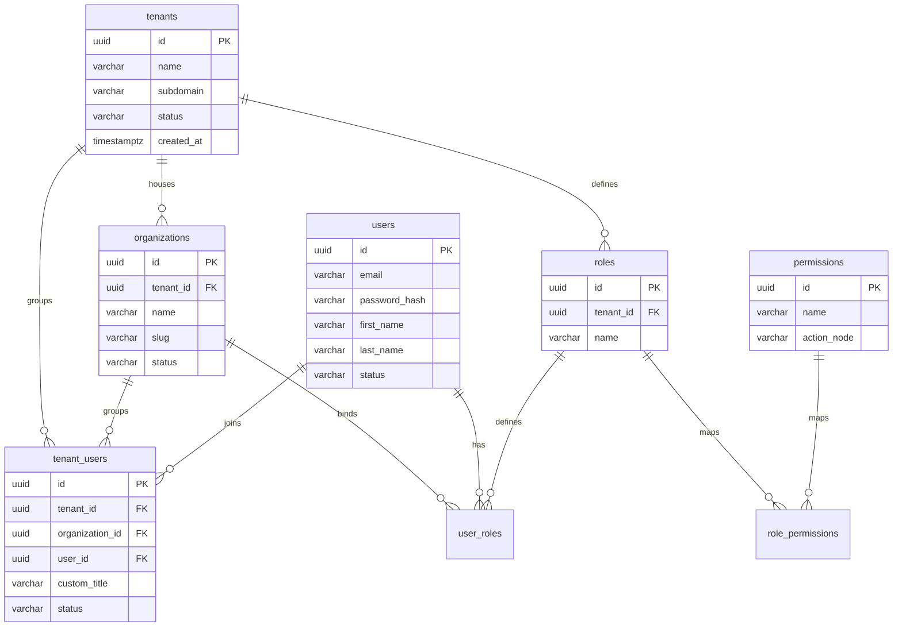

# Identity and Organization Database Schema

## Purpose
This document details the relational database schema and Prisma models for the Identity and Access Management (IAM) and Organization modules of NewsOps Cloud. It outlines tables, fields, constraints, indexes, and relations governing tenants, users, organizations, roles, permissions, and memberships.

## Executive Summary
The Identity and Organization database schema forms the foundation of authentication, authorization, multi-tenant grouping, and RBAC (Role-Based Access Control) in NewsOps Cloud. It maps global tenant boundaries, distinct organizational units (e.g., individual newsrooms, regional offices), user accounts, granular permissions, role definitions, and the intersecting join configurations that define access scopes. These structures conform strictly to the standards defined in `schema_design_standards.md` to ensure security, referential integrity, and high query speed.

## Vision
The IAM data layout is designed to support scalable hierarchical memberships and fine-grained access checks. As the platform transitions to a microservice topology, this schema will serve as the contract for the standalone Identity Service, allowing decoupled modules to evaluate user permissions in real time against highly optimized, indexed mapping tables.

## Scope
This schema design document details:
1. **Physical SQL Table Layouts**: Table definitions for `tenants`, `organizations`, `users`, `roles`, `permissions`, `role_permissions`, `user_roles`, and `tenant_users`.
2. **Prisma ORM Models**: Complete Prisma definitions corresponding to the SQL schema, utilizing appropriate mappings and relations.
3. **Database Indexing Strategy**: Index patterns optimized for login queries, role-based authorization lookups, and organizational boundary checks.
4. **Relational Constraints**: Cascading rules, unique constraints, and foreign key boundaries.

It does not cover dynamic JWT token sign-off or OAuth2 flow mechanisms (which are managed at application levels).

## Goals
- **Strict Tenant Separation**: Ensure every membership, role, and organization is bound to a tenant ID to prevent logical leaks.
- **Fast Authorization Resolution**: Resolve a user's full set of roles and permissions in $< 5\text{ ms}$ on authentication.
- **Relational Integrity**: Enforce foreign keys with clear cascade and nullification rules to avoid orphaned record states.
- **Audit-Compliant Records**: Maintain standard audit metadata columns on all tables.

## Functional Requirements
- **Tenant Isolation mapping**: Every user-organization association must be mapped to a specific tenant context.
- **Hierarchical Access Control**: Allow users to possess different roles in different organizations within the same tenant.
- **Granular Permission Checks**: Provide direct linkages between roles and permissions so that fine-grained capabilities can be verified at runtime.
- **Soft Deletion**: Support soft-delete hooks on users and organizations to prevent loss of referenced archival audit paths.

## Non-Functional Requirements
- **Query Performance Limit**: Reading a user's full profile and combined permission list must resolve in $< 4\text{ ms}$.
- **Write Performance Limit**: Inserting a new user and assigning initial memberships must resolve in $< 15\text{ ms}$.
- **Storage Constraints**: Indexes must be structured efficiently, not exceeding 30% of the total table storage size.

## Business Rules
- **Unique Username and Email**: User emails must be unique system-wide, subject to partial unique indexing on active accounts.
- **System Administrator Role**: The `SystemAdmin` role is reserved and cannot be modified or deleted by tenant admins.
- **Explicit Role Inheritance**: Users do not inherit tenant-level roles within an organization unless explicitly assigned to that organization.
- **Tenant-Organization Constraint**: An organization must belong to exactly one tenant.

## Actors
- **Backend Developer**: Writes authentication/authorization interceptors using this schema.
- **Database Administrator (DBA)**: Monitors performance of complex joins between users, roles, and permissions.
- **Security Auditor**: Verifies permissions schemas to ensure compliance with SOC2 access control policies.

## User Stories
- **User Story 1**: As an Administrator, I want to add a user to a specific organization with a "Reporter" role so that they can edit drafts only within that local newsroom.
- **User Story 2**: As a Security Officer, I want to verify that disabling a user's membership in a tenant immediately revokes their access to all child organizations.
- **User Story 3**: As a Software Engineer, I want to execute a query that returns all permissions for a user so that the API gateway can authorize or deny incoming requests.

## Acceptance Criteria
- SQL schemas must use snake_case for all tables, columns, indexes, and keys.
- Foreign keys must index referencing columns to prevent performance bottlenecks on joins.
- Prisma models must map names correctly using `@map` and `@@map` declarations.
- Relationships must explicitly handle cascade actions (e.g., deleting a tenant deletes associated organizations).

## Workflows
### Authorization Evaluation Workflow
1. **Ingress**: An API request reaches the Gateway with a JWT token containing `userId` and `tenantId`.
2. **Context Resolution**: The authorization middleware resolves the tenant and user context.
3. **Database Query**: The middleware queries the database to extract all active roles and associated permissions for the user:
   - Select permissions from `permissions` joined via `role_permissions` -> `roles` -> `user_roles` where `user_id = :userId` and `tenant_id = :tenantId`.
4. **Validation**: The system compares the action permission requirement (e.g., `articles:publish`) against the database list.
5. **Authorization Decision**: If the permission exists, the query continues; otherwise, a `403 Forbidden` response is thrown.

## API Design
### User Membership Management
Endpoint to assign a role to a user within an organization.

* **URL**: `/api/v1/admin/organizations/:orgId/members`
* **Method**: `POST`
* **Headers**:
  * `Authorization: Bearer <JWT>`
  * `X-Tenant-ID: <Tenant-UUID>`
* **Request Payload**:
```json
{
  "userId": "97e68cfb-d01c-43df-9755-fcece6f32e65",
  "roleId": "e2646277-3e11-47fe-bbba-c39cb8a113a3",
  "customTitle": "Senior Technical Journalist"
}
```
* **Response Payload (201 Created)**:
```json
{
  "membershipId": "09cf7d93-3ea7-4e78-9e59-19cc7b233a01",
  "userId": "97e68cfb-d01c-43df-9755-fcece6f32e65",
  "organizationId": "5fa23d4c-c049-43c7-9cfb-81d368e7b34e",
  "role": {
    "id": "e2646277-3e11-47fe-bbba-c39cb8a113a3",
    "name": "Reporter"
  },
  "customTitle": "Senior Technical Journalist",
  "status": "ACTIVE",
  "createdAt": "2026-06-27T22:17:28Z"
}
```

## Database Design
Below is the PostgreSQL SQL schema and the corresponding Prisma configuration.

### PostgreSQL SQL Schema Definitions
```sql
-- Schema: identity_cms (Common Tenant Schema)

-- 1. Tenants Table (Global context)
CREATE TABLE tenants (
    id UUID PRIMARY KEY DEFAULT gen_random_uuid(),
    name VARCHAR(150) NOT NULL,
    subdomain VARCHAR(100) NOT NULL,
    status VARCHAR(50) DEFAULT 'ACTIVE' NOT NULL,
    created_at TIMESTAMP WITH TIME ZONE DEFAULT CURRENT_TIMESTAMP NOT NULL,
    updated_at TIMESTAMP WITH TIME ZONE DEFAULT CURRENT_TIMESTAMP NOT NULL,
    deleted_at TIMESTAMP WITH TIME ZONE,
    created_by UUID,
    updated_by UUID
);
CREATE UNIQUE INDEX idx_tenants_subdomain_active ON tenants (subdomain) WHERE deleted_at IS NULL;

-- 2. Organizations Table
CREATE TABLE organizations (
    id UUID PRIMARY KEY DEFAULT gen_random_uuid(),
    tenant_id UUID NOT NULL REFERENCES tenants(id) ON DELETE CASCADE,
    name VARCHAR(150) NOT NULL,
    slug VARCHAR(100) NOT NULL,
    status VARCHAR(50) DEFAULT 'ACTIVE' NOT NULL,
    created_at TIMESTAMP WITH TIME ZONE DEFAULT CURRENT_TIMESTAMP NOT NULL,
    updated_at TIMESTAMP WITH TIME ZONE DEFAULT CURRENT_TIMESTAMP NOT NULL,
    deleted_at TIMESTAMP WITH TIME ZONE,
    created_by UUID,
    updated_by UUID
);
CREATE INDEX idx_organizations_tenant ON organizations(tenant_id);
CREATE UNIQUE INDEX idx_organizations_slug_tenant_active ON organizations(tenant_id, slug) WHERE deleted_at IS NULL;

-- 3. Users Table
CREATE TABLE users (
    id UUID PRIMARY KEY DEFAULT gen_random_uuid(),
    email VARCHAR(255) NOT NULL,
    password_hash VARCHAR(255) NOT NULL,
    first_name VARCHAR(100) NOT NULL,
    last_name VARCHAR(100) NOT NULL,
    status VARCHAR(50) DEFAULT 'ACTIVE' NOT NULL,
    created_at TIMESTAMP WITH TIME ZONE DEFAULT CURRENT_TIMESTAMP NOT NULL,
    updated_at TIMESTAMP WITH TIME ZONE DEFAULT CURRENT_TIMESTAMP NOT NULL,
    deleted_at TIMESTAMP WITH TIME ZONE,
    created_by UUID,
    updated_by UUID
);
CREATE UNIQUE INDEX idx_users_email_active ON users(email) WHERE deleted_at IS NULL;

-- 4. Permissions Table
CREATE TABLE permissions (
    id UUID PRIMARY KEY DEFAULT gen_random_uuid(),
    name VARCHAR(100) NOT NULL,
    action_node VARCHAR(100) NOT NULL, -- e.g., "articles:write", "users:invite"
    description VARCHAR(255),
    created_at TIMESTAMP WITH TIME ZONE DEFAULT CURRENT_TIMESTAMP NOT NULL,
    updated_at TIMESTAMP WITH TIME ZONE DEFAULT CURRENT_TIMESTAMP NOT NULL,
    deleted_at TIMESTAMP WITH TIME ZONE,
    created_by UUID,
    updated_by UUID
);
CREATE UNIQUE INDEX idx_permissions_action_active ON permissions(action_node) WHERE deleted_at IS NULL;

-- 5. Roles Table
CREATE TABLE roles (
    id UUID PRIMARY KEY DEFAULT gen_random_uuid(),
    tenant_id UUID NOT NULL REFERENCES tenants(id) ON DELETE CASCADE,
    name VARCHAR(100) NOT NULL,
    description VARCHAR(255),
    created_at TIMESTAMP WITH TIME ZONE DEFAULT CURRENT_TIMESTAMP NOT NULL,
    updated_at TIMESTAMP WITH TIME ZONE DEFAULT CURRENT_TIMESTAMP NOT NULL,
    deleted_at TIMESTAMP WITH TIME ZONE,
    created_by UUID,
    updated_by UUID
);
CREATE INDEX idx_roles_tenant ON roles(tenant_id);
CREATE UNIQUE INDEX idx_roles_name_tenant_active ON roles(tenant_id, name) WHERE deleted_at IS NULL;

-- 6. Role-Permissions Join Table (Many-to-Many)
CREATE TABLE role_permissions (
    role_id UUID NOT NULL REFERENCES roles(id) ON DELETE CASCADE,
    permission_id UUID NOT NULL REFERENCES permissions(id) ON DELETE CASCADE,
    PRIMARY KEY (role_id, permission_id)
);
CREATE INDEX idx_role_permissions_role ON role_permissions(role_id);
CREATE INDEX idx_role_permissions_permission ON role_permissions(permission_id);

-- 7. Tenant-Users Membership Table (Many-to-Many User/Tenant/Org Mapping)
CREATE TABLE tenant_users (
    id UUID PRIMARY KEY DEFAULT gen_random_uuid(),
    tenant_id UUID NOT NULL REFERENCES tenants(id) ON DELETE CASCADE,
    organization_id UUID REFERENCES organizations(id) ON DELETE CASCADE,
    user_id UUID NOT NULL REFERENCES users(id) ON DELETE CASCADE,
    custom_title VARCHAR(150),
    status VARCHAR(50) DEFAULT 'ACTIVE' NOT NULL,
    created_at TIMESTAMP WITH TIME ZONE DEFAULT CURRENT_TIMESTAMP NOT NULL,
    updated_at TIMESTAMP WITH TIME ZONE DEFAULT CURRENT_TIMESTAMP NOT NULL,
    deleted_at TIMESTAMP WITH TIME ZONE,
    created_by UUID,
    updated_by UUID
);
CREATE INDEX idx_tenant_users_tenant ON tenant_users(tenant_id);
CREATE INDEX idx_tenant_users_organization ON tenant_users(organization_id);
CREATE INDEX idx_tenant_users_user ON tenant_users(user_id);
CREATE UNIQUE INDEX idx_tenant_users_unique_membership 
ON tenant_users(tenant_id, organization_id, user_id) 
WHERE deleted_at IS NULL;

-- 8. User-Roles Join Table (Assign Roles to Users in Tenants)
CREATE TABLE user_roles (
    user_id UUID NOT NULL REFERENCES users(id) ON DELETE CASCADE,
    role_id UUID NOT NULL REFERENCES roles(id) ON DELETE CASCADE,
    organization_id UUID REFERENCES organizations(id) ON DELETE CASCADE, -- Scopes the role to specific org if set, else tenant-wide
    PRIMARY KEY (user_id, role_id, organization_id)
);
CREATE INDEX idx_user_roles_user ON user_roles(user_id);
CREATE INDEX idx_user_roles_role ON user_roles(role_id);
CREATE INDEX idx_user_roles_organization ON user_roles(organization_id);
```

### Prisma ORM Schema Definitions
```prisma
datasource db {
  provider = "postgresql"
  url      = env("DATABASE_URL")
}

generator client {
  provider = "prisma-client-js"
}

model Tenant {
  id          String         @id @default(dbgenerated("gen_random_uuid()")) @db.Uuid
  name        String         @db.VarChar(150)
  subdomain   String         @db.VarChar(100)
  status      String         @default("ACTIVE") @db.VarChar(50)
  createdAt   DateTime       @default(now()) @map("created_at") @db.Timestamptz(6)
  updatedAt   DateTime       @default(now()) @updatedAt @map("updated_at") @db.Timestamptz(6)
  deletedAt   DateTime?      @map("deleted_at") @db.Timestamptz(6)
  createdBy   String?        @map("created_by") @db.Uuid
  updatedBy   String?        @map("updated_by") @db.Uuid

  organizations Organization[]
  roles         Role[]
  tenantUsers   TenantUser[]

  @@unique([subdomain, deletedAt])
  @@map("tenants")
}

model Organization {
  id          String         @id @default(dbgenerated("gen_random_uuid()")) @db.Uuid
  tenantId    String         @map("tenant_id") @db.Uuid
  name        String         @db.VarChar(150)
  slug        String         @db.VarChar(100)
  status      String         @default("ACTIVE") @db.VarChar(50)
  createdAt   DateTime       @default(now()) @map("created_at") @db.Timestamptz(6)
  updatedAt   DateTime       @default(now()) @updatedAt @map("updated_at") @db.Timestamptz(6)
  deletedAt   DateTime?      @map("deleted_at") @db.Timestamptz(6)
  createdBy   String?        @map("created_by") @db.Uuid
  updatedBy   String?        @map("updated_by") @db.Uuid

  tenant      Tenant         @relation(fields: [tenantId], references: [id], onDelete: Cascade)
  tenantUsers TenantUser[]
  userRoles   UserRole[]

  @@unique([tenantId, slug, deletedAt])
  @@index([tenantId])
  @@map("organizations")
}

model User {
  id           String       @id @default(dbgenerated("gen_random_uuid()")) @db.Uuid
  email        String       @db.VarChar(255)
  passwordHash String       @map("password_hash") @db.VarChar(255)
  firstName    String       @map("first_name") @db.VarChar(100)
  lastName     String       @map("last_name") @db.VarChar(100)
  status       String       @default("ACTIVE") @db.VarChar(50)
  createdAt    DateTime     @default(now()) @map("created_at") @db.Timestamptz(6)
  updatedAt    DateTime     @default(now()) @updatedAt @map("updated_at") @db.Timestamptz(6)
  deletedAt    DateTime?    @map("deleted_at") @db.Timestamptz(6)
  createdBy    String?      @map("created_by") @db.Uuid
  updatedBy    String?      @map("updated_by") @db.Uuid

  tenantUsers  TenantUser[]
  userRoles    UserRole[]

  @@unique([email, deletedAt])
  @@map("users")
}

model Permission {
  id          String           @id @default(dbgenerated("gen_random_uuid()")) @db.Uuid
  name        String           @db.VarChar(100)
  actionNode  String           @map("action_node") @db.VarChar(100)
  description String?          @db.VarChar(255)
  createdAt   DateTime         @default(now()) @map("created_at") @db.Timestamptz(6)
  updatedAt   DateTime         @default(now()) @updatedAt @map("updated_at") @db.Timestamptz(6)
  deletedAt   DateTime?        @map("deleted_at") @db.Timestamptz(6)
  createdBy   String?          @map("created_by") @db.Uuid
  updatedBy   String?          @map("updated_by") @db.Uuid

  rolePermissions RolePermission[]

  @@unique([actionNode, deletedAt])
  @@map("permissions")
}

model Role {
  id          String           @id @default(dbgenerated("gen_random_uuid()")) @db.Uuid
  tenantId    String           @map("tenant_id") @db.Uuid
  name        String           @db.VarChar(100)
  description String?          @db.VarChar(255)
  createdAt   DateTime         @default(now()) @map("created_at") @db.Timestamptz(6)
  updatedAt   DateTime         @default(now()) @updatedAt @map("updated_at") @db.Timestamptz(6)
  deletedAt   DateTime?        @map("deleted_at") @db.Timestamptz(6)
  createdBy   String?          @map("created_by") @db.Uuid
  updatedBy   String?          @map("updated_by") @db.Uuid

  tenant      Tenant           @relation(fields: [tenantId], references: [id], onDelete: Cascade)
  rolePermissions RolePermission[]
  userRoles   UserRole[]

  @@unique([tenantId, name, deletedAt])
  @@index([tenantId])
  @@map("roles")
}

model RolePermission {
  roleId       String     @map("role_id") @db.Uuid
  permissionId String     @map("permission_id") @db.Uuid

  role         Role       @relation(fields: [roleId], references: [id], onDelete: Cascade)
  permission   Permission @relation(fields: [permissionId], references: [id], onDelete: Cascade)

  @@id([roleId, permissionId])
  @@index([roleId])
  @@index([permissionId])
  @@map("role_permissions")
}

model TenantUser {
  id             String        @id @default(dbgenerated("gen_random_uuid()")) @db.Uuid
  tenantId       String        @map("tenant_id") @db.Uuid
  organizationId String?       @map("organization_id") @db.Uuid
  userId         String        @map("user_id") @db.Uuid
  customTitle    String?       @map("custom_title") @db.VarChar(150)
  status         String        @default("ACTIVE") @db.VarChar(50)
  createdAt      DateTime      @default(now()) @map("created_at") @db.Timestamptz(6)
  updatedAt      DateTime      @default(now()) @updatedAt @map("updated_at") @db.Timestamptz(6)
  deletedAt      DateTime?     @map("deleted_at") @db.Timestamptz(6)
  createdBy      String?       @map("created_by") @db.Uuid
  updatedBy      String?       @map("updated_by") @db.Uuid

  tenant         Tenant        @relation(fields: [tenantId], references: [id], onDelete: Cascade)
  organization   Organization? @relation(fields: [organizationId], references: [id], onDelete: Cascade)
  user           User          @relation(fields: [userId], references: [id], onDelete: Cascade)

  @@unique([tenantId, organizationId, userId, deletedAt])
  @@index([tenantId])
  @@index([organizationId])
  @@index([userId])
  @@map("tenant_users")
}

model UserRole {
  userId         String        @map("user_id") @db.Uuid
  roleId         String        @map("role_id") @db.Uuid
  organizationId String        @map("organization_id") @db.Uuid

  user           User          @relation(fields: [userId], references: [id], onDelete: Cascade)
  role           Role          @relation(fields: [roleId], references: [id], onDelete: Cascade)
  organization   Organization  @relation(fields: [organizationId], references: [id], onDelete: Cascade)

  @@id([userId, roleId, organizationId])
  @@index([userId])
  @@index([roleId])
  @@index([organizationId])
  @@map("user_roles")
}
```

## UI Design
The User Management Console includes:
- **Membership Grid**: Lists all users within an organization, displaying their custom titles, status, and assigned roles. Action elements include "Revoke Membership", "Edit Role", and "Suspend User".
- **Role Creator Panel**: Allows admins to design a custom role by checking boxes representing individual permission nodes (e.g. checking `articles:write`, `articles:publish`).
- **Organization Hierarchy Tree**: Interactive tree-view illustrating the tenant root, branches (organizations), and number of active users inside each.

## Permissions
Modifying the identity structure is heavily controlled:
- `users:write`: Create users, edit basic profiles, and suspend user accounts.
- `roles:manage`: Create and delete tenant roles, associate permission nodes to roles.
- `memberships:manage`: Associate users with organizations and set organizational roles.

## Security
- **Salted Password Hashing**: Passwords must be hashed using `bcrypt` or `Argon2id` before saving to `users.password_hash`. Raw passwords must never be stored.
- **Index Segregation Check**: Every query retrieving roles must explicitly pass `tenant_id` to guarantee database constraints partition evaluation paths.
- **Cascading Safety**: Deleting a user must never execute a hard SQL delete default cascade on content. Instead, `tenant_users` entries are marked deleted, keeping authorship records clean via foreign key nullable configurations or soft delete checks.

## Performance
- **Indexed Joins**: Queries evaluating `user_roles` join paths must leverage indexes (`idx_user_roles_user`, `idx_user_roles_role`).
- **Query Caching**: Resolved permission arrays must be stored in Redis cache with a TTL of 15 minutes, invalidated immediately when roles or permissions are updated.
- **Target Latency**: User identification check must complete in $< 1\text{ ms}$ on indexed query structures.

## Monitoring
- **Prometheus Metric**: `iam_auth_evaluation_duration_seconds` (Histogram tracking latency of user permission lookups).
- **Prometheus Metric**: `iam_active_users_gauge` (Gauge counting online users).
- **Alert Trigger**: Trigger AlertManager warning if `iam_auth_evaluation_duration_seconds > 0.05` for longer than 60 seconds.

## Logging
Security events must be logged with high fidelity:
* **Log Pattern**: `{"timestamp": "%ISO8601%", "level": "WARN", "context": "IAMService", "message": "Role assignment modified", "metadata": {"actingUserId": "uuid-admin", "targetUserId": "uuid-user", "assignedRole": "Editor", "organizationId": "uuid-org"}}`
* **Error Level**: `WARN` for unauthorized access attempts; `INFO` for normal membership updates.

## Error Handling
| Internal Error Code | HTTP Status | Customer-Facing Message |
|:---|:---|:---|
| `ERR_EMAIL_DUPLICATE` | 400 Bad Request | Email is already registered in the system. |
| `ERR_ROLE_NOT_FOUND` | 404 Not Found | The requested role does not exist in this workspace. |
| `ERR_USER_NOT_MEMBER` | 403 Forbidden | User is not associated with the requested organization. |

## Edge Cases
- **Overlapping Roles**: If a user is assigned both "Editor" (tenant-wide) and "Reporter" (org-specific), the system merges permissions. The custom resolver handles overlapping permissions by mapping permissions to a Set container to avoid duplicates.
- **Orphaned Organization Owner**: A user cannot be soft-deleted or removed from an organization if they are the sole Administrator. The API service validates role counts, forcing the assignment of another Admin before removal.

## Future Improvements
- **Row-Level Security (RLS)**: Enforce PostgreSQL RLS on all IAM tables to provide database-level protection against tenant-crossing queries, even if application logic fails.
- **Federated Identities (SAML/OIDC)**: Expand the user table to support federated authentication providers (e.g. Okta, Azure AD) without breaking the core relational model.

## Mermaid Diagrams
### IAM Entity Relationship Diagram (ERD)


## References
- Database Architecture Overview: [index.md](./index.md)
- Schema Design Standards: [schema_design_standards.md](./schema_design_standards.md)
- Tenant Isolation Database: [tenant_isolation_database.md](./tenant_isolation_database.md)
- Multi-Tenancy Architecture Document: [../02-architecture/multi_tenancy_architecture.md](../02-architecture/multi_tenancy_architecture.md)
