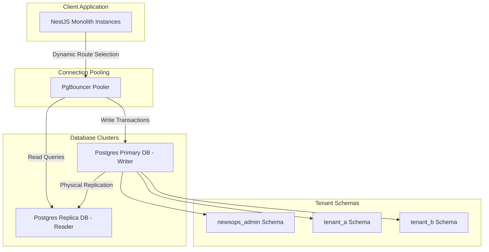

# Database Architecture Overview

## Purpose
This document serves as the primary entry point, index, and structural map for the `03-database` directory within the NewsOps Cloud digital publishing operating system's technical documentation. Its purpose is to present an overview of the database architecture, layout the schema design philosophy, define tenant isolation patterns, and map standard structures for core identity, organization, and CMS domains.

## Executive Summary
NewsOps Cloud employs a hybrid, multi-tenant database topology designed to scale to thousands of media brands while maintaining strict operational isolation and sub-millisecond read latencies. The data layer is centered around a PostgreSQL engine configured with Transaction-mode PgBouncer connection poolers. To balance operational cost against enterprise security, the platform supports both **Shared Database with Logical Schema Isolation** (for Standard/Professional tiers) and **Dedicated Database-per-Tenant** topologies (for Enterprise clients). This directory defines the coding conventions, database configurations, and specific database schemas required to operate the platform under load.

## Vision
The database layer envisions an autonomous, self-healing, and elastic data fabric. By combining NestJS middleware routing, dynamic runtime Prisma client generation, and schema isolation, the system will dynamically provision new tenants in seconds, automatically apply migrations without downtime, and scale query capacity globally through multi-region read replicas.

## Scope
This index and the accompanying sub-documents cover:
1. **Schema Design Standards** (`schema_design_standards.md`): PostgreSQL naming conventions (snake_case, plural tables), audit logs, soft deletes, and schema migration rules.
2. **Tenant Isolation Patterns** (`tenant_isolation_database.md`): Schema-level vs. database-level multi-tenancy, dynamic connection resolution, and NestJS datasource routing configurations.
3. **Identity and Organization Schema** (`identity_and_org_schema.md`): Relational mapping and SQL/Prisma schemas for tenants, organizations, users, roles, permissions, and memberships.
4. **Editorial and CMS Schema** (`editorial_and_cms_schema.md`): Relational schemas for articles, revisions, categories, tags, media assets, comments, and knowledge graphs.

It excludes raw configuration scripts for Cloud Databases (RDS, Cloud SQL), network routing tables (VPCs), and specific CI/CD deployment pipeline files.

## Goals
- **Structural Standardization**: Enforce 100% adherence to database standards (naming, audit tracking, primary keys) across all modules.
- **Robust Multi-Tenancy**: Maintain zero cross-tenant data leakage through automated runtime schema verification.
- **Schema Extensibility**: Ensure the database structure can evolve using backward-compatible, non-blocking migrations.
- **Traceability**: Audit every database mutation to satisfy strict regulatory compliance frameworks.

## Functional Requirements
- **Directory Mapping**: The index must map and link all database-related architectural sub-documents.
- **Dynamic Database Health Endpoint**: The system must expose an administrative endpoint to query the connection status and migration version of both shared and dedicated tenant databases.
- **Dynamic Migration Engine**: Support automatic schema migrations targeting dynamic schemas at runtime using Prisma/Liquibase.

## Non-Functional Requirements
- **Query Latency Targets**: 95% of database read operations must execute in $< 10\text{ ms}$; write operations must execute in $< 50\text{ ms}$.
- **High Availability**: The physical database instances must be deployed across at least two Availability Zones with automated failover capability ($< 30\text{ s}$ recovery window).
- **Scale Capacity**: The database architecture must handle up to $15,000\text{ read TPS}$ and $2,500\text{ write TPS}$ under peak load using read replicas and transaction pooling.

## Business Rules
- **No Shared Tables**: No database table may reside in a shared schema unless it is explicitly marked as a "Global Admin" table (e.g., `tenants`, `global_settings`).
- **Audit Requirement**: Every table containing user-authored content or identity metadata must include `created_at`, `updated_at`, `deleted_at`, `created_by`, and `updated_by` fields.
- **No Raw Delete Operations**: Data deletion must utilize the soft-delete pattern by default unless a hard delete is explicitly requested for GDPR compliance.

## Actors
- **Database Administrator (DBA)**: Monitors database health, manages connection pools, tunes indices, and audits migration scripts.
- **Backend Developer**: Writes Prisma schemas, writes queries, and ensures code adheres to naming standards.
- **SRE / DevOps Engineer**: Sets up PgBouncer, configures replica lag monitoring, and coordinates failovers.
- **Security Officer**: Conducts quarterly audits to verify that no cross-tenant queries are possible and that audit logs are untampered.

## User Stories
- **User Story 1**: As a Backend Developer, I want to access a central database index document so that I can quickly locate standards and tables for Identity and Editorial modules.
- **User Story 2**: As a Database Administrator, I want to verify that the index maps out the schema design standards so that our engineering team maintains uniform table layouts and index definitions.
- **User Story 3**: As a DevOps Engineer, I want to use a unified health check API to verify that all tenant schemas are correctly migrated and connected without manual scripting.

## Acceptance Criteria
- The index must contain relative links to all four sub-documents within the `03-database` directory.
- The health check API must return connection status, migration version, active connections count, and average query latency for all tenant databases.
- Any manual modification to a tenant database schema must fail CI if it does not conform to the standards detailed in `schema_design_standards.md`.

## Workflows
### Database Navigation and Exploration Workflow
1. **Developer Access**: A developer navigates to the database documentation index page.
2. **Standard Review**: The developer clicks `schema_design_standards.md` to review the table and column naming rules.
3. **Domain Lookup**: The developer navigates to `identity_and_org_schema.md` or `editorial_and_cms_schema.md` to copy the Prisma definitions or SQL schemas for their features.
4. **Tenant Configuration**: The developer references `tenant_isolation_database.md` to configure NestJS connection middleware locally.

### Schema Version Auditing Workflow
1. **System Startup**: The NestJS application bootstraps and queries the administrative schema to find all active tenants.
2. **Migration Validation**: The application queries the `schema_migrations` table in each tenant schema to compare it against the latest migrations in the source code.
3. **Out-of-Sync Detection**: If a tenant schema is out of sync, the system logs a warning and blocks traffic to that specific tenant until migrations are applied.

## API Design
### Administrative Database Health Check
Endpoint to monitor the status and replication lag of the active database clusters.

* **URL**: `/api/v1/admin/database/health`
* **Method**: `GET`
* **Headers**:
  * `Authorization: Bearer <JWT>`
  * `X-Tenant-ID: system`
* **Response Payload (200 OK)**:
```json
{
  "status": "healthy",
  "timestamp": "2026-06-27T22:17:28Z",
  "clusters": [
    {
      "name": "newsops-primary-cluster",
      "engine": "PostgreSQL 15.4",
      "role": "writer",
      "activeConnections": 142,
      "maxConnections": 2000,
      "avgLatencyMs": 4.2,
      "replicationLagMs": 0,
      "status": "online"
    },
    {
      "name": "newsops-replica-cluster",
      "engine": "PostgreSQL 15.4",
      "role": "reader",
      "activeConnections": 312,
      "maxConnections": 2000,
      "avgLatencyMs": 1.8,
      "replicationLagMs": 14,
      "status": "online"
    }
  ],
  "migrationSummary": {
    "totalTenants": 124,
    "fullyMigrated": 124,
    "outOfSync": 0
  }
}
```
* **Error Response (503 Service Unavailable)**:
```json
{
  "statusCode": 503,
  "message": "Database clusters are unreachable or exhibiting excessive latency.",
  "error": "Service Unavailable"
}
```

## Database Design
To support dynamic tenant management, the administrative database houses a global tracking table.

### `tenants` Table (Global Schema)
* `id`: UUID (Primary Key, Index)
* `name`: VARCHAR(100) (Unique, Index)
* `subdomain`: VARCHAR(100) (Unique, Index)
* `db_strategy`: VARCHAR(50) (e.g., 'SHARED_SCHEMA', 'DEDICATED_DB')
* `db_connection_url`: TEXT (Encrypted, Null if SHARED_SCHEMA)
* `status`: VARCHAR(30) (e.g., 'ACTIVE', 'SUSPENDED', 'PROVISIONING')
* `created_at`: TIMESTAMP WITH TIME ZONE
* `updated_at`: TIMESTAMP WITH TIME ZONE

### `schema_migrations` Table (Tenant/Shared Schemas)
* `id`: BIGSERIAL (Primary Key)
* `version`: VARCHAR(50) (Unique, Index)
* `name`: VARCHAR(255)
* `applied_at`: TIMESTAMP WITH TIME ZONE

## UI Design
The Database Administrator's Control Panel includes:
- **Cluster Status Dashboard**: Visual cards showing connection usage, replication lag, memory footprints, and CPU usage for writer and reader replica instances.
- **Tenant Migration Registry**: A tabular grid listing all tenants, their subdomains, deployment strategies, and active database migration versions. It features an "Apply Pending Migrations" trigger button.
- **Query Performance Monitor**: A real-time flame graph and query latency histogram mapping slow queries ($>100\text{ ms}$) with execution explain plans.

## Permissions
Access to the database structure and execution metrics requires administrative privileges:
- `database:read`: View database status, schemas, active queries, and performance indexes.
- `database:write`: Trigger dynamic migrations, rebuild indexes, and provision new database structures.

## Security
- **Encryption at Rest**: AWS RDS storage volumes are encrypted using AWS KMS keys.
- **Encryption in Transit**: Strict TLS 1.3 encryption is enforced for all client-to-database and replica-to-primary operations.
- **Secrets Management**: Connection URLs and credential files are fetched dynamically from AWS Secrets Manager using IAM role credentials.
- **Connection Isolation**: Shared schema databases utilize PostgreSQL Row Level Security (RLS) as a secondary defense layer where schemas are combined.

## Performance
- **Connection Pooling**: Implemented via PgBouncer in transaction pooling mode to allow thousands of concurrent client threads to share a lightweight pool of PostgreSQL backend connections.
- **Caching Layer**: Read queries are intercepted by a Redis cache-aside cluster, aiming for a $>85\%$ cache hit ratio to keep direct database query latency low.
- **Target TPS**: Built to sustain 15,000 transactions per second (TPS) on a standard RDS cluster size (`db.r6g.4xlarge`).

## Monitoring
- **Prometheus Metric**: `database_active_connections_count` (Gauge tracking open connections).
- **Prometheus Metric**: `database_replication_lag_seconds` (Gauge measuring replication delay of read replicas).
- **Prometheus Metric**: `database_query_duration_seconds` (Histogram measuring execution latency of SQL queries).
- **Alert Trigger**: Trigger PagerDuty alert if `database_replication_lag_seconds > 5` for longer than 3 minutes, or if `database_active_connections_count > 1800` for longer than 60 seconds.

## Logging
Logging utilizes structured JSON formats and masks all sensitive credentials:
* **Log Pattern**: `{"timestamp": "%ISO8601%", "level": "INFO", "context": "DatabaseManager", "message": "Executing migration on tenant schema", "metadata": {"tenantId": "tenant-uuid-1234", "migrationVersion": "20260627_add_tags", "durationMs": 84}}`
* **Error Level**: `ERROR` for migration failures or connection loss; `WARN` for slow queries ($>100\text{ ms}$) or high replication lag.

## Error Handling
| Internal Error Code | HTTP Status | Customer-Facing Message |
|:---|:---|:---|
| `ERR_DATABASE_UNREACHABLE` | 503 Service Unavailable | The database service is temporarily unavailable. Please retry. |
| `ERR_MIGRATION_PENDING` | 503 Service Unavailable | The requested workspace is undergoing a database upgrade. |
| `ERR_QUERY_TIMEOUT` | 504 Gateway Timeout | The query took too long to execute. Try refining your filters. |

## Edge Cases
- **Database Partition Split**: During active replication failovers, pg_is_in_recovery() checks identify the new primary. The application holds write queries for up to 10 seconds before failing.
- **Pool Exhaustion**: When active connection counts approach physical limits, PgBouncer queues requests. If a request is queued for $>5000\text{ ms}$, it throws a `ERR_DATABASE_UNREACHABLE` to prevent cascading gateway timeouts.

## Future Improvements
- **Automated Read-Only Routing**: Enhance the Prisma middleware to inspect queries at runtime and automatically route `SELECT` operations to read-replicas while keeping updates on the primary.
- **Dynamic Sharding**: Develop a sharding engine to spread tenant schemas across multiple physical PostgreSQL clusters as the platform grows beyond 1,000 tenants.

## Mermaid Diagrams
### Database Topology & Layout Architecture


## References
- Schema Design Standards: [schema_design_standards.md](./schema_design_standards.md)
- Tenant Isolation Architecture: [tenant_isolation_database.md](./tenant_isolation_database.md)
- Identity and Org Schema: [identity_and_org_schema.md](./identity_and_org_schema.md)
- Editorial and CMS Schema: [editorial_and_cms_schema.md](./editorial_and_cms_schema.md)
