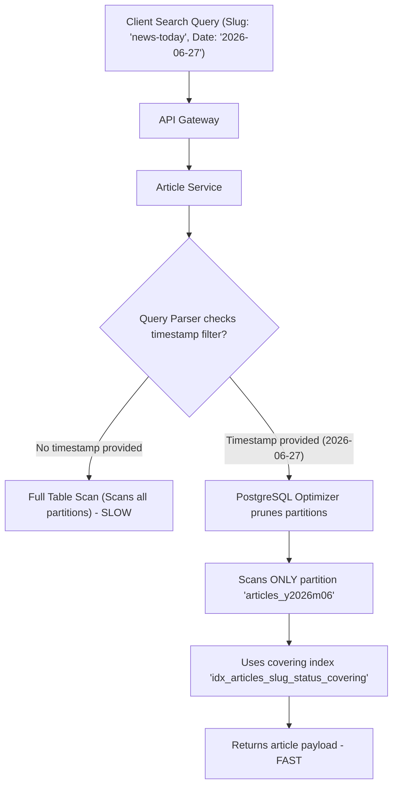

# Indexes and Partitioning Strategy

## Purpose
This document defines the database indexing policies, covering index designs, and date-based database partitioning strategies for the NewsOps Cloud digital publishing platform. It details how the platform optimizes high-throughput read operations for active news content and mitigates storage bottlenecking for massive datasets like historical articles and analytics logs using PostgreSQL.

## Executive Summary
As NewsOps Cloud handles millions of active article reads, thousands of editorial writes, and high-frequency telemetry analytics logs daily, standard indexing strategies become inefficient. This document introduces a dual-strategy optimization:
1. **Covering Indexes and Composite Indexes**: Tailored for the most critical read query paths (e.g., published article lookups by slug, search indexing, and tag filtering) to eliminate heap fetches (Index-Only Scans).
2. **Date-Based Partitioning**: Implemented via declarative partitioning in PostgreSQL, managed dynamically using `pg_partman`. The `articles` table is partitioned monthly, and the `analytics_logs` table is partitioned daily. This prevents index bloat, reduces query search space via partition pruning, and simplifies archiving.

## Vision
To establish a database architecture that scales horizontally and vertically, sustaining sub-millisecond query performance at a scale of 100,000 requests per minute, while lowering infrastructure costs by automatically lifecycle-managing historical data.

## Scope
The scope of this design covers:
- Core database indexing guidelines (PostgreSQL B-Tree, GIN, and BRIN indexes).
- Design and deployment of covering indexes for critical entities (Articles, Users, Comments).
- Declarative partitioning specifications for the `articles` (monthly) and `analytics_logs` (daily) tables.
- Automated partition maintenance scripts and tools (`pg_partman` configuration and cron triggers).
- Schema migrations involving partitioned tables using Prisma and raw SQL.

## Goals
- Achieve a query latency of less than 20ms for 95% of active reader queries.
- Limit index sizes to under 30% of the raw table size for core transaction tables.
- Automate partition lifecycle operations (creation, index maintenance, and tablespace migration).
- Ensure zero-downtime partitioning migrations on high-traffic environments.

## Functional Requirements
- **Query Routing and Partition Pruning**: The query planner must isolate scans to specific partitions automatically based on date boundaries.
- **Dynamic Partition Provisioning**: The system must automatically provision database partition tables 7 days in advance of the target month or day.
- **Text Search Optimization**: Full-text searching of historical articles must utilize optimized Generalized Inverted Indexes (GIN) on pre-computed tsvector columns.
- **Telemetry Ingestion Offloading**: High-volume telemetry logs must write to write-optimized partition segments with Block Range Indexes (BRIN) to minimize write amplification.

## Non-Functional Requirements
- **Read Latency**: Index-only scans on covering indexes must execute within 10ms.
- **Write Throughput**: The partitioning design for analytics logs must support up to 5,000 write TPS (Transactions Per Second) without lock escalation.
- **Storage Efficiency**: Historic partition compression must achieve a minimum of 40% storage reduction using columnar tablespaces or filesystem compression.
- **Data Availability**: Read and write queries spanning partition boundaries must not trigger deadlock situations.

## Business Rules
- **Active Window**: Articles modified within the last 18 months must reside in fast transactional NVMe storage partitions.
- **Retention Period**: Analytics logs older than 90 days must be automatically detached, archived to cold object storage, and dropped from the active database.
- **Query Restrictions**: Queries requesting logs must supply a date range filter limiting the query scope to a maximum of 31 days to enforce partition pruning.

## Actors
- **Database Administrator (DBA)**: Configures partition parameters, runs cleanup routines, and monitors index bloat.
- **Platform Engineer**: Develops and deploys database schemas, migration code, and connection configurations.
- **Data Analyst**: Queries partitioned tables for historical reporting and telemetry data.

## User Stories
1. **As an editorial director**, I want to fetch archived articles written in 2021 without degrading the response times of the current breaking newsroom dashboard.
2. **As a digital marketing analyst**, I want to run aggregated pageview reports for the previous calendar week and have the database prune unnecessary data segments, returning the result in under 2 seconds.
3. **As a DevOps engineer**, I want database partitions to be generated automatically before each new month starts so that application writes never fail due to missing partition boundaries.

## Acceptance Criteria
- **AC-1**: Queries fetching articles by slug and status must trigger an `Index Only Scan` using the composite index `idx_articles_slug_status_covering` with 0 page fetches from heap.
- **AC-2**: A query targeting `analytics_logs` with a `WHERE timestamp >= '2026-06-01' AND timestamp < '2026-06-02'` must execute plans scanning only the partition `analytics_logs_y2026m06d01`.
- **AC-3**: The automated partition manager must successfully verify the existence of partitions for `T+7` days ahead and raise a critical alert to PagerDuty if they are missing.
- **AC-4**: Columnar storage archiving scripts must convert daily partitions older than 90 days into compressed parquet files and upload them to AWS S3.

## Workflows
### Partition Creation and Ingestion Flow
```
[Application Logger] -- Writes telemetry event (timestamp: '2026-06-27T22:00:00Z')
         |
         v
[PostgreSQL Query Router] 
         |-- Evaluates partitioning boundary on 'timestamp' column
         |-- Identifies active partition: 'analytics_logs_y2026m06d27'
         v
[Partition Table (analytics_logs_y2026m06d27)]
         |-- Evaluates BRIN index on 'timestamp'
         |-- Writes row directly to disk block
```

### Partition Maintenance Workflow (Daily Cron)
1. **Scheduler Trigger**: A daily CronJob starts at 01:00 UTC.
2. **Partition Verification**: Invokes `pg_partman.run_maintenance()` to pre-allocate tables for `T+7` (days) and `T+2` (months).
3. **Old Data Identification**: Queries catalog to find partitions with boundary ranges older than the retention threshold (e.g., 90 days for logs).
4. **Data Export**: Calls the archiving task, streaming raw rows to a temporary CSV/Parquet buffer.
5. **AWS S3 Upload**: Writes the compressed data to `s3://newsops-database-archives/analytics/`.
6. **Partition Drop**: Issues `DROP TABLE analytics_logs_y2026m06d27_old` safely after S3 verification.

## API Design

### 1. Partition Administration Endpoint
Allows manual checking, pre-creation, or diagnostics of partition tables.

- **URL**: `/api/v1/admin/database/partitions`
- **Method**: `POST`
- **Headers**:
  - `Content-Type: application/json`
  - `Authorization: Bearer <JWT>`
- **Request Body**:
```json
{
  "tableName": "analytics_logs",
  "action": "PRE_CREATE",
  "daysAhead": 14
}
```
- **Response (200 OK)**:
```json
{
  "success": true,
  "tableName": "analytics_logs",
  "partitionsCreated": [
    "analytics_logs_y2026m07d04",
    "analytics_logs_y2026m07d05",
    "analytics_logs_y2026m07d06"
  ],
  "timestamp": "2026-06-27T22:17:29Z"
}
```

### 2. Database Index Bloat Diagnostics
Retrieves index bloat statistics for DBA evaluation.

- **URL**: `/api/v1/admin/database/metrics/bloat`
- **Method**: `GET`
- **Headers**:
  - `Authorization: Bearer <JWT>`
- **Response (200 OK)**:
```json
{
  "timestamp": "2026-06-27T22:17:29Z",
  "indexes": [
    {
      "tableName": "articles",
      "indexName": "idx_articles_slug_status_covering",
      "tableSize": "42 GB",
      "indexSize": "8.5 GB",
      "bloatSize": "1.2 GB",
      "bloatRatio": 14.1,
      "recommendAction": "REINDEX_CONCURRENTLY"
    },
    {
      "tableName": "analytics_logs",
      "indexName": "idx_analytics_logs_timestamp_brin",
      "tableSize": "195 GB",
      "indexSize": "140 MB",
      "bloatSize": "0 MB",
      "bloatRatio": 0.0,
      "recommendAction": "NONE"
    }
  ]
}
```

## Database Design

Here is the DDL schema implementation using PostgreSQL for partitioned structures and optimizations.

```sql
-- Enable pg_partman if not already enabled
CREATE SCHEMA IF NOT EXISTS partman;
CREATE EXTENSION IF NOT EXISTS pg_partman SCHEMA partman;

-- 1. ARTICLES TABLE: PARTITIONED BY RANGE ON created_at
CREATE TABLE public.articles (
    id UUID NOT NULL,
    organization_id UUID NOT NULL,
    title VARCHAR(255) NOT NULL,
    slug VARCHAR(255) NOT NULL,
    content TEXT NOT NULL,
    status VARCHAR(50) NOT NULL,
    author_id UUID NOT NULL,
    created_at TIMESTAMP WITH TIME ZONE NOT NULL,
    updated_at TIMESTAMP WITH TIME ZONE NOT NULL,
    PRIMARY KEY (id, created_at)
) PARTITION BY RANGE (created_at);

-- Create template table for default indexes and constraints
CREATE TABLE public.articles_template (
    id UUID NOT NULL,
    organization_id UUID NOT NULL,
    title VARCHAR(255) NOT NULL,
    slug VARCHAR(255) NOT NULL,
    content TEXT NOT NULL,
    status VARCHAR(50) NOT NULL,
    author_id UUID NOT NULL,
    created_at TIMESTAMP WITH TIME ZONE NOT NULL,
    updated_at TIMESTAMP WITH TIME ZONE NOT NULL
);

-- Covering index on template (will be duplicated to partitions)
-- Covers: Searching active articles by slug & status, retrieving author, title, and organization
CREATE UNIQUE INDEX idx_articles_slug_status_covering 
ON public.articles_template (slug, status, created_at) 
INCLUDE (id, title, author_id, organization_id);

-- GIN Index on template for Full-Text Search
CREATE INDEX idx_articles_fts_template 
ON public.articles_template USING gin (to_tsvector('english', title || ' ' || content));


-- 2. ANALYTICS LOGS TABLE: PARTITIONED BY RANGE ON timestamp
CREATE TABLE public.analytics_logs (
    id UUID NOT NULL,
    article_id UUID,
    visitor_id UUID NOT NULL,
    event_type VARCHAR(100) NOT NULL,
    referrer VARCHAR(512),
    user_agent VARCHAR(512),
    ip_address INET,
    timestamp TIMESTAMP WITH TIME ZONE NOT NULL,
    PRIMARY KEY (id, timestamp)
) PARTITION BY RANGE (timestamp);

-- BRIN Index for timestamp range mapping (highly efficient for linear dates)
-- Block range index uses minimal space and is ideal for logs ordered by write time
CREATE INDEX idx_analytics_logs_timestamp_brin 
ON public.analytics_logs USING brin (timestamp) WITH (pages_per_range = 128);

-- Composite Index on visitor & timestamp for session tracking
CREATE INDEX idx_analytics_logs_visitor_time 
ON public.analytics_logs (visitor_id, timestamp DESC);
```

### Prisma Configuration Workaround
Because Prisma does not natively manage partitioned table structures out-of-the-box, we bypass standard migration controls for partitioned tables using raw SQL migration scripts (`migration.sql`) and tell Prisma to view them as simple views or unmanaged tables.

```prisma
// prisma/schema.prisma snippet
model Article {
  id             String   @db.Uuid
  organizationId String   @map("organization_id") @db.Uuid
  title          String
  slug           String
  content        String
  status         String
  authorId       String   @map("author_id") @db.Uuid
  createdAt      DateTime @map("created_at") @db.Timestamptz
  updatedAt      DateTime @map("updated_at") @db.Timestamptz

  @@id([id, createdAt])
  @@map("articles")
}

model AnalyticsLog {
  id        String   @db.Uuid
  articleId String?  @map("article_id") @db.Uuid
  visitorId String   @map("visitor_id") @db.Uuid
  eventType String   @map("event_type")
  referrer  String?
  userAgent String?  @map("user_agent")
  ipAddress String?  @map("ip_address")
  timestamp DateTime @db.Timestamptz

  @@id([id, timestamp])
  @@map("analytics_logs")
}
```

## UI Design
The system database control panel allows administrators to inspect partition generation:

- **Dashboard Layout**:
  - **Upper Row**: Database Size (GB), Partition Counts (Active vs. Historical), Average Query Latency, Cache Hit Rate.
  - **Middle Row**: Partition Grid for `articles` and `analytics_logs` showing tables name, size, range, and disk block metrics.
  - **Lower Row**: Index Bloat Analysis Panel with dynamic `REINDEX` triggers.
- **Actions**:
  - `Reindex Index`: Fires a concurrent index rebuild.
  - `Create Next Partition`: Forces immediate manual creation of the next period.
  - `Archive Partition`: Manually detaches a partition, triggers compressed upload, and deletes it.

## Permissions
- `database:read`: Allows developers to run EXPLAIN plans and inspect schemas.
- `database:write`: Allows developers to execute indexes and schema adjustments.
- `database:admin`: Required to execute partitioning, drops, table-space adjustments, and `pg_partman` setup.

## Security
- **Parameter Validation**: All date range filters must be structured via strict validation schemas (ISO 8601 validation) to prevent raw injection.
- **Isolation of Commands**: User-supplied input must never be used directly in database commands (e.g., dynamic partition queries).
- **Access Control**: Read-only analytic replicas must be utilized for broad queries, preventing expensive queries from saturating the primary write database.

## Performance
- **Query Target**: 99% of slug-lookup queries must execute within < 5ms.
- **Index-Only Execution**: The database must utilize the covering indexes, removing the need to fetch tuples from main table blocks (Heap fetches).
- **Target Writes**: Telemetry event inserts must execute in less than 5ms under a load of 5,000 TPS on standard instances.

## Monitoring
- **Prometheus Metrics**:
  - `newsops_db_index_bloat_ratio_percent`: Percentage of index structure containing unused deleted space.
  - `newsops_db_partition_missing_alert`: Tracks if current time is within 3 days of partition boundary end without a subsequent partition existing.
  - `newsops_db_slow_queries_count`: Counters representing queries taking over 250ms.
- **Alert Triggers**:
  - **Warning**: Bloat ratio > 35%. Action: Reindex concurrently scheduled.
  - **Critical**: Missing partition for `T+3` days. Action: PagerDuty dispatcher alerts DBA immediately.

## Logging
Database logs follow structured JSON formatting to log operations cleanly:

```json
{
  "timestamp": "2026-06-27T22:17:29.102Z",
  "level": "INFO",
  "logger": "db.partition_manager",
  "message": "Successfully generated monthly partition articles_y2026m07",
  "context": {
    "table": "articles",
    "range_start": "2026-07-01T00:00:00Z",
    "range_end": "2026-08-01T00:00:00Z",
    "duration_ms": 142
  }
}
```

```json
{
  "timestamp": "2026-06-27T22:18:05.412Z",
  "level": "WARN",
  "logger": "db.query_monitor",
  "message": "Slow query detected (no partition pruning)",
  "context": {
    "query": "SELECT COUNT(*) FROM analytics_logs WHERE visitor_id = $1",
    "duration_ms": 1420,
    "scanned_partitions": 90,
    "recommendation": "Add a timestamp filter to limit the query scope to a single partition."
  }
}
```

## Error Handling
| DB Error Code | HTTP Status | Customer-Facing Message | Internal Description |
|---|---|---|---|
| `P2002` | 409 | "The slug must be unique within this publish date." | Composite index violation on slug and date boundary. |
| `ERR_PARTITION_MISSING` | 500 | "Database capacity error. Please contact support." | Data insert fell outside all existing partition boundaries. |
| `ERR_LOCK_TIMEOUT` | 408 | "Request timed out. Please try again." | Couldn't acquire exclusive lock to partition or reindex. |
| `ERR_INVALID_DATE_RANGE` | 400 | "Query date range exceeds the maximum limit of 31 days." | Failed API query validation rule for telemetry logs. |

## Edge Cases
- **Partition Boundary Drift**: If the server timezone shifts, writes could hit boundaries that are not yet created. The `pg_partman` system is configured to run in UTC and pre-creates 7 days in advance to cushion timezone drifts.
- **Reindexing Large Partitions**: Running `REINDEX` locks tables. All index maintenance must use `CONCURRENTLY` to avoid blocking writes to active partitions.
- **Cross-Partition Updates**: Moving an article's `created_at` date to a different month. PostgreSQL handles this by deleting the row from the old partition and inserting it into the new one. Ensure transactions encapsulate this to prevent data duplication.

## Future Improvements
- **ClickHouse Migration**: Scale analytics telemetry by shifting `analytics_logs` from PostgreSQL to ClickHouse, keeping PostgreSQL exclusively for transactional content.
- **Automatic Partition Compression**: Implement timescaledb or postgres-columnar extensions for compressing partitions older than 30 days automatically.

## Mermaid Diagrams

### Partition Query Selection Flow



## References
- [System Architecture Specification](../02-architecture/system_architecture.md)
- [Database Overview Schema](./README.md)
- [Backup and Retention Strategy](./backup_and_retention.md)
