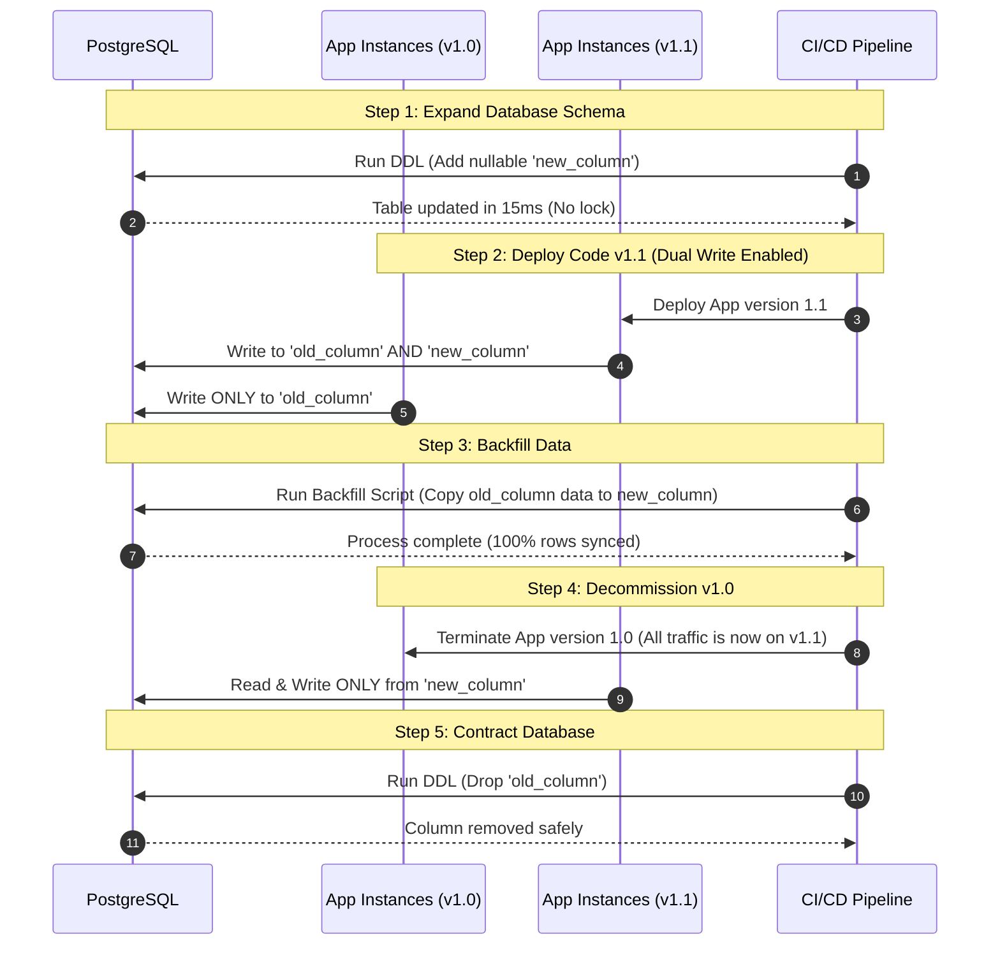

# Database Migration and Zero-Downtime Strategy

## Purpose
This document establishes the standard operational policies, engineering workflows, and deployment patterns for database schema migrations and data backfilling within the NewsOps Cloud digital publishing platform. It defines how to perform structural database updates using Prisma and raw SQL without introducing downtime or resource starvation in the production PostgreSQL cluster.

## Executive Summary
In a high-availability publishing environment, dropping columns, renaming tables, or adding non-nullable columns directly can lock tables, block transactions, and cause site downtime. NewsOps Cloud mandates the **Expand and Contract** design pattern for all database migrations. By breaking down structural database changes into multiple safe phases, the system ensures compatibility with both old and new application instances running concurrently. Furthermore, data backfills must be run asynchronously, capped by throughput, and decoupled from raw schema execution.

## Vision
To enable continuous deployment of database schema changes, ensuring that migrations never require maintenance windows, do not block read/write publishing operations, and can be fully rolled back at any stage.

## Scope
- Prisma migration workflows (`prisma migrate` CLI and pipeline hooks).
- Multi-step zero-downtime migration design (Expand and Contract pattern).
- High-volume data backfilling scripts and execution policies.
- Database locks, timeouts, and replication lag prevention.
- Rollback strategies for migrations and backfills.

## Goals
- Achieve zero system downtime (0 minutes) during schema changes.
- Ensure SQL table lock durations never exceed 1.0 second.
- Protect database replicas by keeping replication lag under 5.0 seconds during massive backfill operations.
- Automate migration checks within the CI/CD pipeline.

## Functional Requirements
- **Migration Versioning**: Every schema change must be documented as an incremental, versioned migration script.
- **Dual Writing**: During column migrations, the application must read from the legacy field while writing to both legacy and new fields to maintain synchronization.
- **Asynchronous Backfilling**: Legacy data must be migrated using separate execution workers that do not block application web servers.
- **State Checkpointing**: Backfill scripts must record their progress in a persistent state table, enabling clean resumption after interruptions.

## Non-Functional Requirements
- **Lock Timeout**: All database migrations must execute under a strict lock timeout constraint of `1000ms`.
- **Rollback Time**: A rollback plan must be executable and complete within 5 minutes of a failed release.
- **Throughput Limit**: Backfill scripts must not exceed 500 updates per second (TPS) on a single database instance to prevent CPU saturation.

## Business Rules
- **No Destructive Operations in Release**: Destructive actions (dropping columns, changing constraints) are forbidden during the initial deployment of a feature. They are postponed until the subsequent deployment cycle.
- **Staging Verification**: Every migration must run on a staging database containing a representative load test dataset before production application.
- **Approvals**: Production migrations that require locks on tables exceeding 5,000,000 rows must be approved by the DBA team.

## Actors
- **Platform Engineer**: Develops Prisma schemas and writes dual-writing application code.
- **Database Administrator (DBA)**: Reviews raw SQL generated by Prisma, monitors performance metrics during deployment, and manages locks.
- **CI/CD Pipeline Agent**: Validates migrations against a clean DB state and applies migrations during deployment.

## User Stories
1. **As a Platform Engineer**, I want to split a user's full name into `first_name` and `last_name` without interrupting active editor logins or user registrations.
2. **As a Database Administrator**, I want to populate a new column with values from an old column across 10 million rows without causing replication lag that delays the failover replica.
3. **As a Release Manager**, I want a failed database migration to abort immediately without locking the table and to allow the previous version of the code to run unmodified.

## Acceptance Criteria
- **AC-1**: Direct execution of migrations must set `lock_timeout = '1s'` at the session level before executing DDL.
- **AC-2**: The backfill script must include a configurable sleep interval (e.g., `sleepMs: 100`) between batch execution cycles.
- **AC-3**: Application code must dual-write to both target fields for the duration of the transition phase.
- **AC-4**: A automated CI test must run `prisma migrate dev --create-only` and fail if any auto-generated migration introduces immediate breaking drops (detected by parsing for `DROP COLUMN` or `ALTER COLUMN TYPE`).

## Workflows
### The Expand & Contract Pattern Sequence
To rename a column from `original_name` to `new_name`:

```
Phase 1: EXPAND (Deploy 1)
  - DB: Create new column 'new_name' (nullable).
  - Code: Read from 'original_name'; write to 'original_name' AND 'new_name' (Dual-Write).

Phase 2: BACKFILL (Asynchronous Task)
  - Script: Read batches of rows where 'new_name' is null and copy data from 'original_name' to 'new_name'.

Phase 3: TRANSITION (Deploy 2)
  - Code: Read from 'new_name'; write to 'original_name' AND 'new_name'. (Ensures rollback capability).

Phase 4: CONTRACT (Deploy 3)
  - Code: Read and write ONLY to 'new_name'. Remove references to 'original_name'.
  - DB: Drop column 'original_name' (Safe to drop as no code references it).
```

## API Design

### 1. Trigger Data Backfill Job
Instructs the background system to start a backfill task.

- **URL**: `/api/v1/admin/database/backfill`
- **Method**: `POST`
- **Headers**:
  - `Content-Type: application/json`
  - `Authorization: Bearer <JWT>`
- **Request Body**:
```json
{
  "jobName": "backfill-article-author-name",
  "tableName": "articles",
  "sourceColumn": "author_name",
  "targetColumn": "author_display_name",
  "batchSize": 1000,
  "sleepMs": 200,
  "startId": "00000000-0000-0000-0000-000000000000"
}
```
- **Response (202 Accepted)**:
```json
{
  "jobId": "bf_job_998877",
  "status": "RUNNING",
  "message": "Backfill job started asynchronously.",
  "startedAt": "2026-06-27T22:17:29Z"
}
```

### 2. Get Backfill Job Status
Enables checking execution metrics.

- **URL**: `/api/v1/admin/database/backfill/bf_job_998877`
- **Method**: `GET`
- **Headers**:
  - `Authorization: Bearer <JWT>`
- **Response (200 OK)**:
```json
{
  "jobId": "bf_job_998877",
  "jobName": "backfill-article-author-name",
  "status": "PROCESSING",
  "processedRows": 450000,
  "totalRowsToProcess": 1250000,
  "percentComplete": 36.0,
  "currentIdCheckpoint": "84c8a810-745a-4b2a-a92c-e366fd2f3b92",
  "avgDurationPerBatchMs": 145,
  "replicationLagMs": 120
}
```

## Database Design

To track backfills reliably, we utilize a migrations audit table:

```sql
CREATE TABLE public.backfill_checkpoints (
    job_id VARCHAR(100) NOT NULL,
    job_name VARCHAR(255) NOT NULL,
    table_name VARCHAR(100) NOT NULL,
    last_processed_id UUID NOT NULL,
    processed_count INT NOT NULL DEFAULT 0,
    total_count INT NOT NULL,
    is_completed BOOLEAN NOT NULL DEFAULT FALSE,
    updated_at TIMESTAMP WITH TIME ZONE NOT NULL,
    CONSTRAINT pk_backfill_checkpoints PRIMARY KEY (job_id)
);
```

### Raw SQL Migration Script Example (Phase 1: Expand)
Executed via Prisma's `migration.sql` override functionality.

```sql
-- migration.sql
-- Set local transaction timeouts
SET statement_timeout = 5000;
SET lock_timeout = 1000;

-- Add new nullable column
ALTER TABLE public.articles ADD COLUMN author_display_name VARCHAR(255);

-- Create backfill tracking metrics stub
INSERT INTO public.backfill_checkpoints (
    job_id, 
    job_name, 
    table_name, 
    last_processed_id, 
    processed_count, 
    total_count, 
    is_completed, 
    updated_at
) VALUES (
    'bf_job_article_author_display_name',
    'backfill-article-author-name',
    'articles',
    '00000000-0000-0000-0000-000000000000',
    0,
    (SELECT count(*) FROM public.articles),
    FALSE,
    NOW()
);
```

### Node.js Backfill Job Implementation
Runs as an operational worker task:

```typescript
// scripts/backfill-worker.ts
import { PrismaClient } from '@prisma/client';
const prisma = new PrismaClient();

async function runBackfill() {
  const jobId = 'bf_job_article_author_display_name';
  const batchSize = 500;
  const sleepMs = 150;

  // Retrieve progress from database checkpoint
  const checkpoint = await prisma.backfillCheckpoint.findUnique({
    where: { jobId }
  });

  if (!checkpoint || checkpoint.isCompleted) {
    console.log('Backfill job already completed or not configured.');
    return;
  }

  let lastId = checkpoint.lastProcessedId;
  let processedCount = checkpoint.processedCount;
  let hasMore = true;

  while (hasMore) {
    // 1. Fetch next batch ordered by ID to avoid random page reads
    const records = await prisma.article.findMany({
      take: batchSize,
      cursor: lastId === '00000000-0000-0000-0000-000000000000' ? undefined : { id: lastId },
      skip: lastId === '00000000-0000-0000-0000-000000000000' ? 0 : 1,
      orderBy: { id: 'asc' },
      select: { id: true, authorName: true }
    });

    if (records.length === 0) {
      hasMore = false;
      break;
    }

    // 2. Process updates in a single transaction sequence
    await prisma.$transaction(
      records.map(record =>
        prisma.article.update({
          where: { id: record.id },
          data: { authorDisplayName: record.authorName } // copy field
        })
      )
    );

    processedCount += records.length;
    lastId = records[records.length - 1].id;

    // 3. Update checkpoint state
    await prisma.backfillCheckpoint.update({
      where: { jobId },
      data: {
        lastProcessedId: lastId,
        processedCount,
        updatedAt: new Date()
      }
    });

    console.log(`Processed: ${processedCount} / ${checkpoint.totalCount}`);

    // 4. Rate-limit wait to prevent database exhaustion & replica lag
    await new Promise(resolve => setTimeout(resolve, sleepMs));
  }

  // Mark completion
  await prisma.backfillCheckpoint.update({
    where: { jobId },
    data: { isCompleted: true, updatedAt: new Date() }
  });
  console.log('Backfill job completed successfully.');
}

runBackfill().catch(err => {
  console.error('Backfill execution failed', err);
  process.exit(1);
});
```

## UI Design
Platform Engineers monitor migrations via an operations panel:

- **Migration Progress Grid**: Lists migration directory names, status (Applied, Pending), execution time, and raw SQL source.
- **Backfill Panel**: Shows running jobs, percentage charts, database CPU meters, replication lag delay meters (sec), and buttons for Pause/Resume.

## Permissions
- `database:migrate`: Restriced to CI/CD pipeline runners and DBA users.
- `database:backfill`: Required to run or configure batch scripts.

## Security
- **Role Isolation**: The application database user must not have `SUPERUSER` or `OWNER` privileges. DDL migrations must execute under a specialized deployment user role.
- **SQL Sanitization**: Schema migrations must be strictly local static SQL files. Dynamically constructed database schema statements are banned.
- **Token Checks**: All backfill control APIs are locked behind multi-factor JWT administrator authorization requirements.

## Performance
- **DDL Execution Limit**: Schema updates must complete in less than 5 seconds.
- **Backfill Throttle**: Database CPU must remain below 70% and replication lag under 2 seconds.

## Monitoring
- **Prometheus Metrics**:
  - `newsops_db_migration_duration_seconds`: Total time taken by the latest migration.
  - `newsops_db_replication_lag_seconds`: Master-replica sync lag.
  - `newsops_db_backfill_tps`: Count of rows processed per second by background workers.
- **Alert Triggers**:
  - `ReplicationLagAlert`: If `newsops_db_replication_lag_seconds > 5.0` for 2 minutes. Actions: Automatically pauses running backfill jobs.
  - `MigrationTimeoutAlert`: If migration execution exceeds 5 seconds.

## Logging
Backfill activities generate detailed audit trails:

```json
{
  "timestamp": "2026-06-27T22:17:29.412Z",
  "level": "INFO",
  "logger": "db.backfill.engine",
  "message": "Processed backfill batch successfully",
  "context": {
    "job_id": "bf_job_article_author_display_name",
    "batch_size": 500,
    "last_processed_id": "84c8a810-745a-4b2a-a92c-e366fd2f3b92",
    "duration_ms": 112,
    "current_lag_ms": 82
  }
}
```

## Error Handling
| DB Error Code | HTTP Status | Customer-Facing Message | Internal Description |
|---|---|---|---|
| `55P03` | 408 | "Database upgrade timed out. Retrying." | Lock acquisition failed (Lock timeout hit). |
| `ERR_DUAL_WRITE_FAIL` | 500 | "An error occurred writing configuration data." | Code failed to dual write to new column. |
| `ERR_BACKFILL_ABORT` | 500 | "Data sync interrupted. Resuming from checkpoint." | Backfill worker script crashed during processing loop. |

## Edge Cases
- **Unique Constraint Additions**: Adding a unique constraint to an existing column fails if duplicates exist. Implement a deduplication script prior to applying constraints.
- **Application Crash During Migration**: If the deployment fails midway, Postgres rolls back the transaction. The database state remains clean.
- **Pre-existing Code Compatibility**: If new code reads the new column before the backfill finishes, it will see nulls. Use a default value or code fallbacks (`article.new_col ?? article.old_col`) until backfill verification completes.

## Future Improvements
- **Automated Schema Analysis**: Integration of `gh-ost` or `pg-online-schema-change` to manage structural alterations on massive tables without native postgres locking blocks.
- **Declarative DB Checkers**: Pre-deployment scripts analyzing database locks prior to applying migration steps.

## Mermaid Diagrams

### Zero-Downtime Deployment Sequence (Expand/Contract)



## References
- [Indexes and Partitioning Strategy](./indexes_and_partitioning.md)
- [Backup and Retention Strategy](./backup_and_retention.md)
- [Unified ERD](./unified_erd.md)
