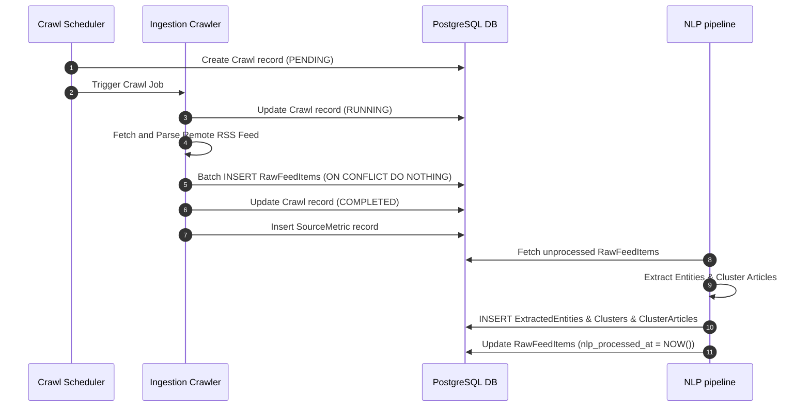
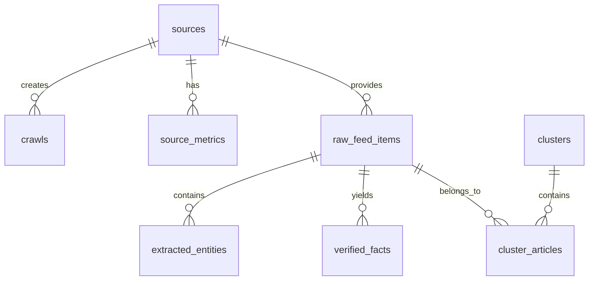

# News Intelligence Schema

## Purpose
The purpose of the News Intelligence Schema is to define the structured data model, ingestion storage, clustering associations, natural language entities, and verification states for the NewsOps Cloud digital publishing platform's intelligence module. This schema acts as the storage architecture supporting high-frequency ingestion of news feeds, AI-driven content clustering, semantic entity extraction, and fact-checking workflows.

## Executive Summary
The News Intelligence module is designed to aggregate unstructured or semi-structured news items from external feeds, parse them into a standardized format, run them through an analytical pipeline, and generate structured intelligence feeds. This document provides the complete PostgreSQL DDL and Prisma schemas for managing ingestion sources, crawl execution logs, raw feed items, article clusters, extracted named entities, verified facts, and performance/uptime metrics of sources. The database design is optimized for high insert rates, fast text searching, and complex relational clustering.

## Vision
Our vision is to build a highly responsive, automated ingest-to-intelligence pipeline that reads from thousands of global RSS, Atom, and custom API feeds, extracts actionable news clusters, labels entities with high confidence, verifies factual statements, and monitors feed health. This system serves as the foundational data source for automated newsletter generation, breaking news alerts, and editor-curated publications.

## Scope
This schema covers:
- External content sources, RSS feed descriptors, and custom scrapers.
- Crawling executions, run-times, health states, and error captures.
- Ingested feed items including raw contents, sanitization hashes, and source URLs.
- Machine-learning driven clustering structures, representing events and topics.
- Semantic and named entity extractions (People, Places, Organizations) linked to ingested articles.
- Verification tables for claims, veracity status, and confidence levels.
- Timeseries-oriented aggregation tables for source performance metrics.

It does not cover core user identity, payment subscriptions, or tenant profiles (which are handled in the Billing/Tenant schemas), although it references tenant organization IDs for multi-tenancy.

## Goals
- Achieve ingestion support for up to 100 raw feed items per second.
- Maintain a query latency under 50ms for entity searches and cluster listings.
- Ensure strict multi-tenant isolation where crawling sources and custom rules are partitionable by organization.
- Support deduplication at the database level using unique content hashes.
- Automatically track source-level reliability and latency metrics for system observability.

## Functional Requirements
- **Source Management**: Admin and Editor users must be able to create, read, update, and delete RSS/API sources.
- **Crawl Logging**: The crawler service must record the start time, end time, status, item counts, and raw error messages for every crawl cycle.
- **Deduplication**: The database must reject duplicate articles from the same or different feeds based on a SHA-256 fingerprint hash.
- **Entity Extraction & Search**: Store named entities with confidence scores and allow indexing for rapid entity-based filtering.
- **Fact Verification**: Support fact-checking claims by saving the verification status, explanation, and verifier identity.
- **Source Health Monitoring**: Compute and query daily/hourly aggregation metrics of crawl success rates and latency.

## Non-Functional Requirements
- **Concurrency**: Support up to 50 concurrent crawl workers writing to the database simultaneously.
- **Data Integrity**: Enforce foreign keys and cascade deletes on temporary crawl logs while protecting ingested feed items.
- **Indexing**: All queries filtering by `organization_id`, `published_at`, `status`, or `hash` must utilize B-Tree indexes. Full-text search must use GIN indexes on the title and description fields.
- **Scalability**: Support partitioning tables like `raw_feed_items` or `extracted_entities` by range (e.g., monthly) if volume grows past 50 million records.

## Business Rules
1. A news source (`sources`) must belong to an Organization.
2. A crawl log (`crawls`) must link to a valid source. If a source is deleted, its crawls must be deleted via cascade.
3. Raw feed items (`raw_feed_items`) must be unique across the platform based on the `fingerprint_hash`.
4. A cluster (`clusters`) must have at least one representing article (`cluster_articles`).
5. Extracted entities must have a confidence score between 0.00 and 1.00.
6. A verified fact must map to the specific raw feed item where the claim was made.

## Actors
- **Ingestion Daemon / Crawler**: Automated background worker that reads feed records, runs crawl jobs, and writes raw feed items.
- **NLP / Enrichment Pipeline**: AI worker that processes raw articles, extracts entities, performs clustering, and writes fact-verification records.
- **System Administrator**: Configures scraper sources, schedules, and reviews source metrics.
- **Editor**: Accesses clusters and verified facts to generate editorial content.

## User Stories
1. **As a Crawler Worker**, I want to register a new crawl run, update its status to "RUNNING", and record the resulting items and latencies so that the platform can monitor operational performance.
2. **As an NLP Processing Agent**, I want to scan ingested raw feed items, write extracted entities with confidence levels, and link them to their source items without locking the table.
3. **As an Editorial Curator**, I want to view automatically generated clusters of raw feed items sorted by relevance and publication density so that I can quickly write a summary newsletter.

## Acceptance Criteria
1. The `sources` table must include a valid `cron_expression` checked using a standard regex pattern.
2. Deduplication check must fail gracefully with a unique constraint error on `fingerprint_hash` without causing transaction rollback of unrelated records.
3. Soft deletes must be implemented for `clusters` using a `deleted_at` timestamp.
4. Average execution time of the query listing clusters and their representative articles must be under 35ms with 1,000 concurrent active clusters.

## Workflows
1. **Source Discovery and Crawling**:
   - Ingestion Scheduler identifies an active `Source` due for a crawl based on its `cron_expression`.
   - Scheduler creates a `Crawl` record with state `PENDING`.
   - Ingestion Daemon claims the crawl, updates status to `RUNNING`.
   - Daemon fetches remote XML/JSON, processes articles, calculates SHA-256 hashes.
   - For each new article, Daemon inserts into `raw_feed_items` (handling conflicts on `fingerprint_hash` by doing nothing).
   - Daemon updates `Crawl` status to `COMPLETED` and registers execution metrics in `source_metrics`.

2. **AI Analysis and Clustering**:
   - NLP pipeline polls `raw_feed_items` where `nlp_processed_at` is null.
   - NLP extracts named entities, inserts them into `extracted_entities`.
   - NLP groups articles, creates a new `Cluster` or updates an existing one, writing the association to `cluster_articles`.
   - AI evaluates factual claims, generates `verified_facts` entries for claims with high confidence.
   - NLP pipeline updates `nlp_processed_at` on the processed `raw_feed_items`.



## API Design

### POST /api/v1/intelligence/sources
Creates a new ingestion source.
**Request Headers**:
- `Authorization: Bearer <JWT>`
- `Content-Type: application/json`

**Request Payload**:
```json
{
  "name": "TechCrunch Main Feed",
  "url": "https://techcrunch.com",
  "feedUrl": "https://techcrunch.com/feed/",
  "type": "RSS",
  "cronExpression": "0 */4 * * *",
  "organizationId": "org_912384912"
}
```

**Response Payload (201 Created)**:
```json
{
  "id": "src_883011293",
  "name": "TechCrunch Main Feed",
  "url": "https://techcrunch.com",
  "feedUrl": "https://techcrunch.com/feed/",
  "type": "RSS",
  "cronExpression": "0 */4 * * *",
  "status": "ACTIVE",
  "organizationId": "org_912384912",
  "createdAt": "2026-06-27T16:48:00.000Z",
  "updatedAt": "2026-06-27T16:48:00.000Z"
}
```

### GET /api/v1/intelligence/clusters
Retrieves latest active clusters with pagination.
**Request Query Parameters**:
- `page`: 1
- `limit`: 10
- `category`: "technology"

**Response Payload (200 OK)**:
```json
{
  "data": [
    {
      "id": "clust_77192834",
      "title": "Global Semiconductor Supply Chains Stabilize",
      "summary": "Major semiconductor fabrication plants report normalized lead times as consumer electronics demand softens.",
      "representativeEntity": "Taiwan Semiconductor Manufacturing Company",
      "category": "technology",
      "status": "PUBLISHED",
      "articleCount": 18,
      "createdAt": "2026-06-27T12:00:00.000Z"
    }
  ],
  "pagination": {
    "total": 1,
    "page": 1,
    "limit": 10,
    "totalPages": 1
  }
}
```

## Database Design

### Prisma Schema
```prisma
datasource db {
  provider = "postgresql"
  url      = env("DATABASE_URL")
}

generator client {
  provider = "prisma-client-js"
}

enum SourceType {
  RSS
  ATOM
  SCRAPER
  API
}

enum SourceStatus {
  ACTIVE
  INACTIVE
  RATE_LIMITED
  FAILED
}

enum CrawlStatus {
  PENDING
  RUNNING
  COMPLETED
  FAILED
}

enum EntityType {
  PERSON
  ORGANIZATION
  LOCATION
  PRODUCT
  EVENT
  OTHER
}

enum VeracityStatus {
  VERIFIED
  REFUTED
  UNVERIFIED
  CONTRADICTORY
}

model Source {
  id             String        @id @default(dbgenerated("concat('src_', replace(gen_random_uuid()::text, '-', ''))")) @db.VarChar(50)
  organizationId String        @map("organization_id") @db.VarChar(50)
  name           String        @db.VarChar(255)
  url            String        @db.VarChar(2048)
  feedUrl        String        @unique @map("feed_url") @db.VarChar(2048)
  type           SourceType    @default(RSS)
  status         SourceStatus  @default(ACTIVE)
  cronExpression String        @map("cron_expression") @db.VarChar(50)
  createdAt      DateTime      @default(now()) @map("created_at")
  updatedAt      DateTime      @updatedAt @map("updated_at")

  crawls        Crawl[]
  sourceMetrics SourceMetric[]
  rawFeedItems  RawFeedItem[]

  @@index([organizationId])
  @@index([status])
  @@map("sources")
}

model Crawl {
  id          String      @id @default(dbgenerated("concat('crl_', replace(gen_random_uuid()::text, '-', ''))")) @db.VarChar(50)
  sourceId    String      @map("source_id") @db.VarChar(50)
  status      CrawlStatus @default(PENDING)
  startedAt   DateTime    @default(now()) @map("started_at")
  finishedAt  DateTime?   @map("finished_at")
  itemsFound  Int         @default(0) @map("items_found")
  itemsSaved  Int         @default(0) @map("items_saved")
  errorMessage String?     @map("error_message") @db.Text
  rawLog      String?     @map("raw_log") @db.Text

  source Source @relation(fields: [sourceId], references: [id], onDelete: Cascade)

  @@index([sourceId])
  @@index([status])
  @@index([startedAt])
  @@map("crawls")
}

model RawFeedItem {
  id              String       @id @default(dbgenerated("concat('itm_', replace(gen_random_uuid()::text, '-', ''))")) @db.VarChar(50)
  sourceId        String       @map("source_id") @db.VarChar(50)
  crawlId         String       @map("crawl_id") @db.VarChar(50)
  title           String       @db.VarChar(512)
  description     String?      @db.Text
  content         String       @db.Text
  url             String       @map("url") @db.VarChar(2048)
  author          String?      @db.VarChar(255)
  publishedAt     DateTime     @map("published_at")
  ingestedAt      DateTime     @default(now()) @map("ingested_at")
  nlpProcessedAt  DateTime?    @map("nlp_processed_at")
  fingerprintHash String       @unique @map("fingerprint_hash") @db.VarChar(64)
  language        String       @default("en") @db.VarChar(10)
  sentimentScore  Decimal?     @map("sentiment_score") @db.Decimal(5, 2)

  source      Source            @relation(fields: [sourceId], references: [id])
  entities    ExtractedEntity[]
  facts       VerifiedFact[]
  clusters    ClusterArticle[]

  @@index([sourceId])
  @@index([publishedAt])
  @@index([nlpProcessedAt])
  @@map("raw_feed_items")
}

model Cluster {
  id                   String           @id @default(dbgenerated("concat('cls_', replace(gen_random_uuid()::text, '-', ''))")) @db.VarChar(50)
  title                String           @db.VarChar(255)
  summary              String           @db.Text
  representativeEntity String?          @map("representative_entity") @db.VarChar(255)
  category             String           @db.VarChar(100)
  status               String           @default("DRAFT") @db.VarChar(50)
  createdAt            DateTime         @default(now()) @map("created_at")
  updatedAt            DateTime         @updatedAt @map("updated_at")
  deletedAt            DateTime?        @map("deleted_at")

  articles ClusterArticle[]

  @@index([category])
  @@index([status])
  @@index([createdAt])
  @@map("clusters")
}

model ClusterArticle {
  clusterId     String   @map("cluster_id") @db.VarChar(50)
  rawFeedItemId String   @map("raw_feed_item_id") @db.VarChar(50)
  relevanceScore Decimal  @map("relevance_score") @db.Decimal(5, 4)
  isRepresentative Boolean @default(false) @map("is_representative")
  addedAt       DateTime @default(now()) @map("added_at")

  cluster     Cluster     @relation(fields: [clusterId], references: [id], onDelete: Cascade)
  rawFeedItem RawFeedItem @relation(fields: [rawFeedItemId], references: [id], onDelete: Cascade)

  @@id([clusterId, rawFeedItemId])
  @@index([rawFeedItemId])
  @@map("cluster_articles")
}

model ExtractedEntity {
  id              String     @id @default(dbgenerated("concat('ent_', replace(gen_random_uuid()::text, '-', ''))")) @db.VarChar(50)
  rawFeedItemId   String     @map("raw_feed_item_id") @db.VarChar(50)
  name            String     @db.VarChar(255)
  type            EntityType @default(OTHER)
  confidenceScore Decimal    @map("confidence_score") @db.Decimal(5, 4)
  mentionCount    Int        @default(1) @map("mention_count")
  metadata        Json?      @map("metadata")

  rawFeedItem RawFeedItem @relation(fields: [rawFeedItemId], references: [id], onDelete: Cascade)

  @@index([rawFeedItemId])
  @@index([name])
  @@index([type])
  @@map("extracted_entities")
}

model VerifiedFact {
  id              String         @id @default(dbgenerated("concat('fct_', replace(gen_random_uuid()::text, '-', ''))")) @db.VarChar(50)
  rawFeedItemId   String         @map("raw_feed_item_id") @db.VarChar(50)
  claim           String         @db.VarChar(1024)
  explanation     String         @db.Text
  status          VeracityStatus @default(UNVERIFIED)
  verifier        String         @db.VarChar(255)
  confidenceScore Decimal        @map("confidence_score") @db.Decimal(5, 4)
  verificationSource String?     @map("verification_source") @db.VarChar(2048)
  verifiedAt      DateTime       @default(now()) @map("verified_at")

  rawFeedItem RawFeedItem @relation(fields: [rawFeedItemId], references: [id], onDelete: Cascade)

  @@index([rawFeedItemId])
  @@index([status])
  @@map("verified_facts")
}

model SourceMetric {
  id               String   @id @default(dbgenerated("concat('mtr_', replace(gen_random_uuid()::text, '-', ''))")) @db.VarChar(50)
  sourceId         String   @map("source_id") @db.VarChar(50)
  timestamp        DateTime @default(now())
  uptimeRatio      Decimal  @map("uptime_ratio") @db.Decimal(5, 4)
  averageLatencyMs Int      @map("average_latency_ms")
  errorRate        Decimal  @map("error_rate") @db.Decimal(5, 4)
  articleCount     Int      @map("article_count")

  source Source @relation(fields: [sourceId], references: [id], onDelete: Cascade)

  @@index([sourceId, timestamp])
  @@map("source_metrics")
}
```

### PostgreSQL DDL
```sql
-- Schema DDL setup for News Intelligence Module

CREATE TYPE source_type AS ENUM ('RSS', 'ATOM', 'SCRAPER', 'API');
CREATE TYPE source_status AS ENUM ('ACTIVE', 'INACTIVE', 'RATE_LIMITED', 'FAILED');
CREATE TYPE crawl_status AS ENUM ('PENDING', 'RUNNING', 'COMPLETED', 'FAILED');
CREATE TYPE entity_type AS ENUM ('PERSON', 'ORGANIZATION', 'LOCATION', 'PRODUCT', 'EVENT', 'OTHER');
CREATE TYPE veracity_status AS ENUM ('VERIFIED', 'REFUTED', 'UNVERIFIED', 'CONTRADICTORY');

-- Ingestion Sources Table
CREATE TABLE sources (
    id VARCHAR(50) PRIMARY KEY DEFAULT concat('src_', replace(gen_random_uuid()::text, '-', '')),
    organization_id VARCHAR(50) NOT NULL,
    name VARCHAR(255) NOT NULL,
    url VARCHAR(2048) NOT NULL,
    feed_url VARCHAR(2048) UNIQUE NOT NULL,
    type source_type NOT NULL DEFAULT 'RSS',
    status source_status NOT NULL DEFAULT 'ACTIVE',
    cron_expression VARCHAR(50) NOT NULL,
    created_at TIMESTAMP WITH TIME ZONE NOT NULL DEFAULT NOW(),
    updated_at TIMESTAMP WITH TIME ZONE NOT NULL DEFAULT NOW()
);

CREATE INDEX idx_sources_organization ON sources(organization_id);
CREATE INDEX idx_sources_status ON sources(status);

-- Crawl Logs Table
CREATE TABLE crawls (
    id VARCHAR(50) PRIMARY KEY DEFAULT concat('crl_', replace(gen_random_uuid()::text, '-', '')),
    source_id VARCHAR(50) NOT NULL REFERENCES sources(id) ON DELETE CASCADE,
    status crawl_status NOT NULL DEFAULT 'PENDING',
    started_at TIMESTAMP WITH TIME ZONE NOT NULL DEFAULT NOW(),
    finished_at TIMESTAMP WITH TIME ZONE,
    items_found INT NOT NULL DEFAULT 0,
    items_saved INT NOT NULL DEFAULT 0,
    error_message TEXT,
    raw_log TEXT,
    CONSTRAINT chk_crawl_times CHECK (finished_at IS NULL OR finished_at >= started_at)
);

CREATE INDEX idx_crawls_source ON crawls(source_id);
CREATE INDEX idx_crawls_status ON crawls(status);
CREATE INDEX idx_crawls_started ON crawls(started_at);

-- Raw Feed Items Table (Core parsed output from RSS/Scraping)
CREATE TABLE raw_feed_items (
    id VARCHAR(50) PRIMARY KEY DEFAULT concat('itm_', replace(gen_random_uuid()::text, '-', '')),
    source_id VARCHAR(50) NOT NULL REFERENCES sources(id) ON DELETE RESTRICT,
    crawl_id VARCHAR(50) NOT NULL,
    title VARCHAR(512) NOT NULL,
    description TEXT,
    content TEXT NOT NULL,
    url VARCHAR(2048) NOT NULL,
    author VARCHAR(255),
    published_at TIMESTAMP WITH TIME ZONE NOT NULL,
    ingested_at TIMESTAMP WITH TIME ZONE NOT NULL DEFAULT NOW(),
    nlp_processed_at TIMESTAMP WITH TIME ZONE,
    fingerprint_hash VARCHAR(64) UNIQUE NOT NULL,
    language VARCHAR(10) NOT NULL DEFAULT 'en',
    sentiment_score DECIMAL(5,2) CHECK (sentiment_score >= -1.00 AND sentiment_score <= 1.00)
);

CREATE INDEX idx_raw_items_source ON raw_feed_items(source_id);
CREATE INDEX idx_raw_items_published ON raw_feed_items(published_at);
CREATE INDEX idx_raw_items_nlp_processed ON raw_feed_items(nlp_processed_at) WHERE nlp_processed_at IS NULL;
CREATE INDEX idx_raw_items_gin_text ON raw_feed_items USING gin(to_tsvector('english', title || ' ' || coalesce(description, '')));

-- Clusters Table (Grouping representing topics/events)
CREATE TABLE clusters (
    id VARCHAR(50) PRIMARY KEY DEFAULT concat('cls_', replace(gen_random_uuid()::text, '-', '')),
    title VARCHAR(255) NOT NULL,
    summary TEXT NOT NULL,
    representative_entity VARCHAR(255),
    category VARCHAR(100) NOT NULL,
    status VARCHAR(50) NOT NULL DEFAULT 'DRAFT',
    created_at TIMESTAMP WITH TIME ZONE NOT NULL DEFAULT NOW(),
    updated_at TIMESTAMP WITH TIME ZONE NOT NULL DEFAULT NOW(),
    deleted_at TIMESTAMP WITH TIME ZONE
);

CREATE INDEX idx_clusters_category ON clusters(category);
CREATE INDEX idx_clusters_status ON clusters(status);
CREATE INDEX idx_clusters_created ON clusters(created_at) WHERE deleted_at IS NULL;

-- Cluster Articles (Join table between Clusters and RawFeedItems)
CREATE TABLE cluster_articles (
    cluster_id VARCHAR(50) NOT NULL REFERENCES clusters(id) ON DELETE CASCADE,
    raw_feed_item_id VARCHAR(50) NOT NULL REFERENCES raw_feed_items(id) ON DELETE CASCADE,
    relevance_score DECIMAL(5,4) NOT NULL CHECK (relevance_score >= 0.0000 AND relevance_score <= 1.0000),
    is_representative BOOLEAN NOT NULL DEFAULT FALSE,
    added_at TIMESTAMP WITH TIME ZONE NOT NULL DEFAULT NOW(),
    PRIMARY KEY (cluster_id, raw_feed_item_id)
);

CREATE INDEX idx_cluster_articles_item ON cluster_articles(raw_feed_item_id);

-- Extracted Entities Table
CREATE TABLE extracted_entities (
    id VARCHAR(50) PRIMARY KEY DEFAULT concat('ent_', replace(gen_random_uuid()::text, '-', '')),
    raw_feed_item_id VARCHAR(50) NOT NULL REFERENCES raw_feed_items(id) ON DELETE CASCADE,
    name VARCHAR(255) NOT NULL,
    type entity_type NOT NULL DEFAULT 'OTHER',
    confidence_score DECIMAL(5,4) NOT NULL CHECK (confidence_score >= 0.0000 AND confidence_score <= 1.0000),
    mention_count INT NOT NULL DEFAULT 1,
    metadata JSONB
);

CREATE INDEX idx_entities_item ON extracted_entities(raw_feed_item_id);
CREATE INDEX idx_entities_name ON extracted_entities(name);
CREATE INDEX idx_entities_type ON extracted_entities(type);

-- Verified Facts Table
CREATE TABLE verified_facts (
    id VARCHAR(50) PRIMARY KEY DEFAULT concat('fct_', replace(gen_random_uuid()::text, '-', '')),
    raw_feed_item_id VARCHAR(50) NOT NULL REFERENCES raw_feed_items(id) ON DELETE CASCADE,
    claim VARCHAR(1024) NOT NULL,
    explanation TEXT NOT NULL,
    status veracity_status NOT NULL DEFAULT 'UNVERIFIED',
    verifier VARCHAR(255) NOT NULL,
    confidence_score DECIMAL(5,4) NOT NULL CHECK (confidence_score >= 0.0000 AND confidence_score <= 1.0000),
    verification_source VARCHAR(2048),
    verified_at TIMESTAMP WITH TIME ZONE NOT NULL DEFAULT NOW()
);

CREATE INDEX idx_facts_item ON verified_facts(raw_feed_item_id);
CREATE INDEX idx_facts_status ON verified_facts(status);

-- Source Aggregated Metrics Table
CREATE TABLE source_metrics (
    id VARCHAR(50) PRIMARY KEY DEFAULT concat('mtr_', replace(gen_random_uuid()::text, '-', '')),
    source_id VARCHAR(50) NOT NULL REFERENCES sources(id) ON DELETE CASCADE,
    timestamp TIMESTAMP WITH TIME ZONE NOT NULL DEFAULT NOW(),
    uptime_ratio DECIMAL(5,4) NOT NULL CHECK (uptime_ratio >= 0.0000 AND uptime_ratio <= 1.0000),
    average_latency_ms INT NOT NULL,
    error_rate DECIMAL(5,4) NOT NULL CHECK (error_rate >= 0.0000 AND error_rate <= 1.0000),
    article_count INT NOT NULL DEFAULT 0
);

CREATE INDEX idx_metrics_source_time ON source_metrics(source_id, timestamp DESC);
```

## UI Design
- **Source Configuration Panel**: Admin views a grid list of ingestion sources, displaying name, type, feed URL, state toggle, and last crawl status. Adding a source presents a modal with URL validation and a cron selector.
- **Intelligence Dashboard**: Editors browse active article clusters. The page has a left sidebar list of categories and a main dashboard displaying cluster cards (showing title, summary snippet, number of items, representative entity, and fact status indicators).
- **Fact Verification View**: Inside a single cluster, editors review extracted claims. Each claim card displays the source sentence, its truth verification score, and options to "Override Status" or "View Primary Source Article".

## Permissions
- `intelligence:sources:create` - Admin role. Create scraper sources.
- `intelligence:sources:read` - Reader, Editor, Admin roles. View sources and metrics.
- `intelligence:sources:update` - Admin role. Modify cron expressions, enable/disable sources.
- `intelligence:sources:delete` - Admin role. Remove source (cascades logs).
- `intelligence:clusters:read` - Editor, Admin. Browse generated clusters.
- `intelligence:clusters:write` - Editor, Admin. Modify cluster labels, merge clusters, publish summaries.
- `intelligence:facts:verify` - Editor, Fact Checker. Verify/reject claims.

## Security
- **Input Validation**: URLs for sources must be validated against a whitelist of valid schema patterns (HTTPS only). Cron expressions must be parsed and verified on the server side before insertion.
- **SQL Injection Safeguards**: All raw SQL queries in the ingestion process must use parameter binding. No string concatenations of URL parameters.
- **JWT Authorization**: All client requests to the intelligence API endpoints require valid JWT headers with tenant claims matching the `organization_id` of the target records.

## Performance
- **Max Query Latency**: <50ms for reading the dashboard view containing clusters and entity lists.
- **Caching**: Cache RSS feed definitions and list of active sources in Redis with a TTL of 1 hour to prevent constant DB reads from the crawl scheduler.
- **Target Ingestion TPS**: Support up to 100 insertions/sec on the `raw_feed_items` table under high concurrency using native PostgreSQL `ON CONFLICT DO NOTHING`.

## Monitoring
- `newsops_intelligence_crawls_total`: Counter tracking total crawl attempts by source and status (success, error).
- `newsops_intelligence_crawl_duration_seconds`: Histogram tracking feed crawl request durations.
- `newsops_intelligence_duplicates_dropped_total`: Counter tracking items discarded due to hash collision.
- **Alert Triggers**: Send high priority PagerDuty alerts if a source status is set to `FAILED` continuously for 3 runs, or if database transaction CPU usage exceeds 85% for 5 minutes.

## Logging
- **Log Format**: JSON log format.
- **Log Levels**: INFO for successful crawls and cluster generation, WARN for connection timeouts or invalid feed parsing, ERROR for database failures and write locks.
- **Log Context Example**:
  ```json
  {
    "timestamp": "2026-06-27T16:48:15.112Z",
    "level": "INFO",
    "context": "newsops-crawler",
    "source_id": "src_883011293",
    "crawl_id": "crl_991823719",
    "message": "Crawl job completed successfully. Parsed 25 items, stored 4 new items, 21 duplicates dropped."
  }
  ```

## Error Handling
- `DB_DUPLICATE_SOURCE`: Code 409. HTTP Status 409 Conflict. Message: "An ingestion source with this feed URL already exists."
- `INVALID_CRON_EXPRESSION`: Code 400. HTTP Status 400 Bad Request. Message: "The cron schedule provided is invalid."
- `CRAWL_TIMEOUT`: Code 504. HTTP Status 504 Gateway Timeout. Message: "The remote news feed failed to respond within the 10-second limit."
- `ENTITY_NOT_FOUND`: Code 404. HTTP Status 404 Not Found. Message: "The requested cluster or raw item does not exist."

## Edge Cases
- **Upstream Feed Redirect Loops**: If an RSS URL redirects multiple times, the crawler terminates the request after 3 redirects to prevent stack overflow/timeout.
- **Write Deadlocks during NLP extraction**: Concurrent NLP processes scanning identical elements might update the same raw items. To avoid, pipeline processes partition the `raw_feed_items` keyspace by using a modular offset of the `id` hash.
- **System Rate Limits**: In the event that a feed enforces a strict rate limit, the crawler intercepts `429` responses and updates the source state to `RATE_LIMITED` for a cool-down period of 1 hour.

## Future Improvements
- **Table Partitioning**: Implementing declarative partitioning on the `raw_feed_items` and `extracted_entities` tables on a monthly partition key to maintain indexes within RAM limits.
- **Vector Extensions**: Integrating `pgvector` into PostgreSQL to store embeddings of titles/descriptions directly inside `raw_feed_items` to allow vector-similarity clustering instead of strict categorical mappings.

## Mermaid Diagrams


## References
- [System Architecture](../../docs/02-architecture/system_architecture.md)
- [Storage Architecture](../../docs/02-architecture/storage_architecture.md)
- [Event Driven Design](../../docs/02-architecture/event_driven_design.md)
