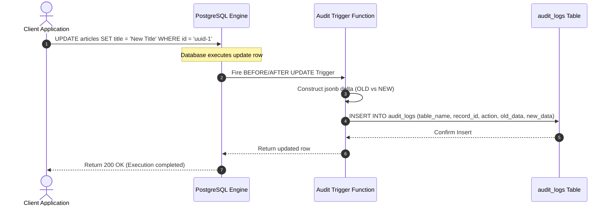

# Schema Design Standards

## Purpose
This document establishes the official database naming conventions, coding standards, migration protocols, audit logging requirements, and soft-delete design patterns for all PostgreSQL and Prisma schema architectures within the NewsOps Cloud digital publishing platform.

## Executive Summary
To ensure high performance, maintainability, and consistent data modeling across multiple developers and modules, NewsOps Cloud mandates a rigid set of database standards. All tables must use snake_case, pluralized naming, UUID primary keys, and support standardized tracking metadata. Audit logging is handled through custom triggers and database-level tracking tables, while logical soft deletion is implemented via dedicated `deleted_at` fields backed by partial indexes to maximize query performance on active data.

## Vision
The vision for our schema standards is compile-time and migration-time validation. By utilizing automated linting (e.g., via Prisma-lint or SQLFluff) integrated into the CI/CD pipeline, every schema alteration will automatically verify adherence to primary key formats, indexing rules, audit hooks, and tenancy constraints, eliminating design inconsistencies before code reaches staging or production.

## Scope
This document details:
1. **Naming Conventions**: Guidelines for tables, columns, constraints, foreign keys, and indexes.
2. **Data Type Standards**: Rules on using UUIDv4, TIMESTAMPTZ, JSONB, and VARCHAR vs TEXT.
3. **Audit Logging Framework**: Database triggers, schema requirements, and target JSON formats.
4. **Soft-Delete Architecture**: Implementation patterns, query interceptors, and partial index construction.
5. **Migration Standards**: Safe schema evolution patterns, non-blocking DDL commands, and backward compatibility constraints.

It does not cover high-level multi-tenancy routing or physical cluster configurations (covered in `tenant_isolation_database.md`).

## Goals
- **Consistency**: Achieve 100% uniformity in database object names and structures across all domain modules.
- **Auditability**: Ensure all changes to core publishing and identity models are logged with user and timestamp telemetry.
- **Zero-Downtime Migration**: Enforce strict constraints on schema changes so that migrations never lock tables during active user traffic.
- **Optimal Read Performance**: Guarantee that soft-deleted records do not degrade performance for normal system operations.

## Functional Requirements
- **Naming Enforcement**: All tables, columns, indexes, constraints, and foreign keys must follow `snake_case` patterns. Table names must be pluralized (e.g., `articles`, not `article`).
- **Standard Audit Tracking**: All core tables must implement standard columns: `created_at`, `updated_at`, `deleted_at`, `created_by`, and `updated_by`.
- **Soft-Delete Handling**: Deleting a record must default to setting `deleted_at = NOW()` instead of hard removal, unless explicit GDPR purging is executed.
- **Partial Indexing**: Unique constraints on fields that support soft deletion must use partial indexes (`WHERE deleted_at IS NULL`) to prevent conflicts on soft-deleted values.

## Non-Functional Requirements
- **Migration Execution Window**: Any DDL schema migration must complete in under $5\text{ seconds}$ on production-scale tables without table-level write locks.
- **Audit Logging Overhead**: Writing to the audit log table via database triggers must not add more than $3\text{ ms}$ of latency to write transactions.
- **Query Interception Latency**: NestJS/Prisma middleware routing must intercept queries and inject soft-delete filters in $< 1\text{ ms}$.

## Business Rules
- **No Shared Entities in Primary Keys**: Cross-module entity relations must rely on synthetic UUIDs, never composite natural keys that couple schemas.
- **Default Database Time Zone**: All timestamp columns must use `TIMESTAMP WITH TIME ZONE` (TIMESTAMPTZ) and default to `UTC`.
- **GDPR Hard Delete Rule**: When a GDPR deletion request is received, a hard delete command must execute, clearing the physical row and zeroing its references in the audit logs.
- **Index Constraints**: Every foreign key column must be accompanied by an index to optimize joins and cascading checks.

## Actors
- **Database Administrator (DBA)**: Reviews migration scripts and enforces performance and index standards.
- **Backend Developer**: Writes Prisma schema schemas and constructs database-backed services.
- **Security Officer**: Reviews the audit log tables to verify user activities and data access paths.

## User Stories
- **User Story 1**: As a Backend Developer, I want to define a new `newsletter_subscribers` table with standard audit columns so that my feature complies with system auditability rules automatically.
- **User Story 2**: As a Database Administrator, I want to ensure unique email constraints are indexed using partial indexes so that users can sign up again with an email that was previously soft-deleted.
- **User Story 3**: As a Security Officer, I want to review the audit log records to track exactly which user updated the publishing status of a high-profile news article.

## Acceptance Criteria
- All table names must be lowercase, plural, and separated by underscores.
- Schema validation in the CI/CD pipeline must fail if any table lacks a UUID primary key or does not contain the five standard audit columns.
- Unique constraints must use a partial index check (e.g., `CREATE UNIQUE INDEX ON users (email) WHERE deleted_at IS NULL`).
- Trigger-based audit logs must capture the exact changed delta in a JSONB field.

## Workflows
### Soft-Delete Lifecycle Workflow
1. **Request to Delete**: An editor requests the deletion of an article (`DELETE /api/v1/articles/:id`).
2. **Interception**: The NestJS application intercepts the delete command through Prisma middleware.
3. **Mutation**: Instead of running a physical SQL `DELETE` query, the middleware mutates the statement into an `UPDATE` setting `deleted_at = NOW()` and `updated_by = current_user_id`.
4. **Execution**: The database executes the update.
5. **Partial Index Integrity**: If another article is created with the same slug, the partial index `CREATE UNIQUE INDEX ON articles (slug) WHERE deleted_at IS NULL` allows it since the deleted record has a non-null `deleted_at` value.

### Schema Migration Review Workflow
1. **Schema Change**: A developer alters the Prisma schema file (e.g., adding a column to `users`).
2. **Drafting Migration**: The developer generates a migration script using `prisma migrate dev`.
3. **CI Validation**: The CI pipeline scans the SQL script with SQLFluff to check for naming violations and table locks.
4. **DBA Approval**: For production deployments, the DBA inspects the script, verifying that any `ALTER TABLE` statements do not hold long-running locks.
5. **Execution**: The migration is applied using a migration runner at the beginning of the deployment process.

## API Design
### Schema Linter Validation API
This administrative API allows developers and CI/CD tools to check if a custom SQL schema script meets the database standards before applying it.

* **URL**: `/api/v1/admin/database/validate-schema`
* **Method**: `POST`
* **Headers**:
  * `Authorization: Bearer <JWT>`
  * `Content-Type: application/json`
* **Request Payload**:
```json
{
  "schemaName": "editorial_cms",
  "sqlScript": "CREATE TABLE editorial_cms.posts (id UUID PRIMARY KEY, title VARCHAR(255) NOT NULL, body TEXT, tenant_id UUID);"
}
```
* **Response Payload (200 OK - Validation Failed)**:
```json
{
  "isValid": false,
  "errors": [
    {
      "ruleId": "DB_STD_TABLE_PLURAL",
      "severity": "ERROR",
      "message": "Table name 'posts' is correct, but 'posts' is missing standard audit columns.",
      "missingColumns": ["created_at", "updated_at", "deleted_at", "created_by", "updated_by"]
    },
    {
      "ruleId": "DB_STD_UUID_DEFAULT",
      "severity": "WARNING",
      "message": "Primary key 'id' in table 'posts' should default to gen_random_uuid()."
    }
  ]
}
```
* **Response Payload (200 OK - Validation Succeeded)**:
```json
{
  "isValid": true,
  "errors": []
}
```

## Database Design
To illustrate schema standards, we provide standard SQL and Prisma definitions.

### Base Audit Columns (SQL Template)
Every standardized table must include these exact column definitions:
```sql
CREATE TABLE example_table (
    id UUID PRIMARY KEY DEFAULT gen_random_uuid(),
    -- Domain specific columns go here --
    created_at TIMESTAMP WITH TIME ZONE DEFAULT CURRENT_TIMESTAMP NOT NULL,
    updated_at TIMESTAMP WITH TIME ZONE DEFAULT CURRENT_TIMESTAMP NOT NULL,
    deleted_at TIMESTAMP WITH TIME ZONE,
    created_by UUID,
    updated_by UUID
);

-- Partial index for soft deletes and unique constraints
CREATE UNIQUE INDEX idx_example_unique_active 
ON example_table (id) 
WHERE deleted_at IS NULL;
```

### Prisma Schema Base Template
In Prisma, the standard fields must be defined on models representing auditable entities:
```prisma
model Article {
  id         String    @id @default(dbgenerated("gen_random_uuid()")) @db.Uuid
  title      String    @db.VarChar(255)
  slug       String
  content    String    @db.Text
  
  // Standard Audit Fields
  createdAt  DateTime  @default(now()) @map("created_at") @db.Timestamptz(6)
  updatedAt  DateTime  @default(now()) @updatedAt @map("updated_at") @db.Timestamptz(6)
  deletedAt  DateTime? @map("deleted_at") @db.Timestamptz(6)
  createdBy  String?   @map("created_by") @db.Uuid
  updatedBy  String?   @map("updated_by") @db.Uuid

  @@unique([slug, deletedAt])
  @@index([deletedAt])
  @@map("articles")
}
```

### Global Database Audit Log Table
All triggers forward mutation details to this centralized audit table:
```sql
CREATE TABLE audit_logs (
    id UUID PRIMARY KEY DEFAULT gen_random_uuid(),
    table_name VARCHAR(100) NOT NULL,
    record_id UUID NOT NULL,
    action VARCHAR(10) NOT NULL, -- INSERT, UPDATE, DELETE
    old_data JSONB,
    new_data JSONB,
    changed_by UUID,
    changed_at TIMESTAMP WITH TIME ZONE DEFAULT CURRENT_TIMESTAMP NOT NULL
);

CREATE INDEX idx_audit_logs_table_record ON audit_logs(table_name, record_id);
CREATE INDEX idx_audit_logs_changed_at ON audit_logs(changed_at DESC);
```

### PostgreSQL Audit Trigger Function
The function below automatically writes delta changes to `audit_logs` on insert, update, or delete:
```sql
CREATE OR REPLACE FUNCTION process_audit_log()
RETURNS TRIGGER AS $$
BEGIN
    IF (TG_OP = 'DELETE') THEN
        INSERT INTO audit_logs(table_name, record_id, action, old_data, new_data, changed_by)
        VALUES (TG_TABLE_NAME, OLD.id, 'DELETE', to_jsonb(OLD), NULL, current_setting('request.jwt.claim.sub', true)::uuid);
        RETURN OLD;
    ELSIF (TG_OP = 'UPDATE') THEN
        INSERT INTO audit_logs(table_name, record_id, action, old_data, new_data, changed_by)
        VALUES (TG_TABLE_NAME, NEW.id, 'UPDATE', to_jsonb(OLD), to_jsonb(NEW), current_setting('request.jwt.claim.sub', true)::uuid);
        RETURN NEW;
    ELSIF (TG_OP = 'INSERT') THEN
        INSERT INTO audit_logs(table_name, record_id, action, old_data, new_data, changed_by)
        VALUES (TG_TABLE_NAME, NEW.id, 'INSERT', NULL, to_jsonb(NEW), current_setting('request.jwt.claim.sub', true)::uuid);
        RETURN NEW;
    END IF;
    RETURN NULL;
END;
$$ LANGUAGE plpgsql;
```

## UI Design
The Developer Console Schema Compliance tab includes:
- **Standards Score Card**: A dashboard panel displaying compliance percentage (e.g., 98% table compliance across the database).
- **Rule Violation Table**: Lists all tables/columns violating conventions (e.g., table `media` lacks standard audit logs, table `roles` contains natural primary keys).
- **Auto-Fix Command Generator**: Generates appropriate DDL statements (`ALTER TABLE`, trigger setup) to update non-compliant tables with a single click.

## Permissions
Access to validate and check database schemas is controlled via RBAC:
- `database:validate`: Access schema compliance metrics and validate scripts.
- `database:alter`: Execute DDL schema upgrades and configure audit triggers.

## Security
- **No Natural Primary Keys**: Avoid using serial integers, usernames, or emails as primary keys to mitigate enumeration attacks. All identifiers must use UUIDv4.
- **Read-Only Audit Logs**: The `audit_logs` table must restrict updates and deletes. Only `INSERT` privileges are granted to the application database user.
- **SQL Injection Prevention**: Schema validations must use parameterization and parsed Abstract Syntax Trees (AST) to prevent running malicious commands during linter checks.

## Performance
- **Partial Indexing**: Ensure that partial indexes are utilized for soft deletes (e.g., `WHERE deleted_at IS NULL`). This prevents indexing dead/deleted records and reduces overall database index sizes.
- **Audit Table Partitioning**: The `audit_logs` table must be partitioned by month (`RANGE (changed_at)`) to ensure writing and reading audits remains fast over years of operations.

## Monitoring
- **Prometheus Metric**: `database_audit_writes_duration_seconds` (Histogram tracking latency of the audit logging triggers).
- **Prometheus Metric**: `database_non_compliant_tables_count` (Gauge listing count of active tables violating design standards).
- **Alert Trigger**: Trigger Slack and Sentry warning alerts if `database_non_compliant_tables_count > 0` on staging/production environments.

## Logging
Database logs must track execution plans of slow queries and migration timelines:
* **Log Pattern**: `{"timestamp": "%ISO8601%", "level": "WARN", "context": "DatabaseStandards", "message": "Slow query detected on table with soft-deletes", "metadata": {"tableName": "articles", "durationMs": 142, "query": "SELECT * FROM articles WHERE slug = $1 AND deleted_at IS NULL"}}`
* **Error Level**: `ERROR` for audit logging failures; `WARN` for schema standards violation alerts.

## Error Handling
| Internal Error Code | HTTP Status | Customer-Facing Message |
|:---|:---|:---|
| `ERR_SCHEMA_VIOLATION` | 400 Bad Request | The schema modification does not comply with system database standards. |
| `ERR_AUDIT_LOG_FAILED` | 500 Internal Error | A database operation failed due to audit tracking issues. Please contact support. |
| `ERR_PRIMARY_KEY_REQUIRED` | 400 Bad Request | All tables must declare a single primary key named 'id' of type UUID. |

## Edge Cases
- **Auditing Bulk Operations**: Standard database triggers fire per-row. Under bulk insert actions (e.g., importing 10,000 articles), trigger checks can add overhead. The system uses session configurations to disable row triggers temporarily and write a single bulk audit record.
- **Resolving Soft-Deleted Unique Conflicts**: If a user is deleted and a new user signs up with the same email, database-level unique checks will fail if not using partial indexes. The partial index pattern addresses this by filtering out non-active accounts from the unique constraint.

## Future Improvements
- **Database Schema Auto-Linter CI GitHub Action**: Create a reusable GitHub Action that validates Prisma schemas against naming, type, and index requirements on every pull request.
- **CDC Integration**: Migrate trigger-based audit logs to a Change Data Capture (CDC) system (e.g., Debezium + Kafka) to offload the audit writing overhead from PostgreSQL to external worker processes.

## Mermaid Diagrams
### Trigger-based Audit Log Flow


## References
- Database Architecture Overview: [index.md](./index.md)
- Multi-Tenancy Architecture: [../02-architecture/multi_tenancy_architecture.md](../02-architecture/multi_tenancy_architecture.md)
- Storage Architecture: [../02-architecture/storage_architecture.md](../02-architecture/storage_architecture.md)
- Identity and Organization Schema: [identity_and_org_schema.md](./identity_and_org_schema.md)
