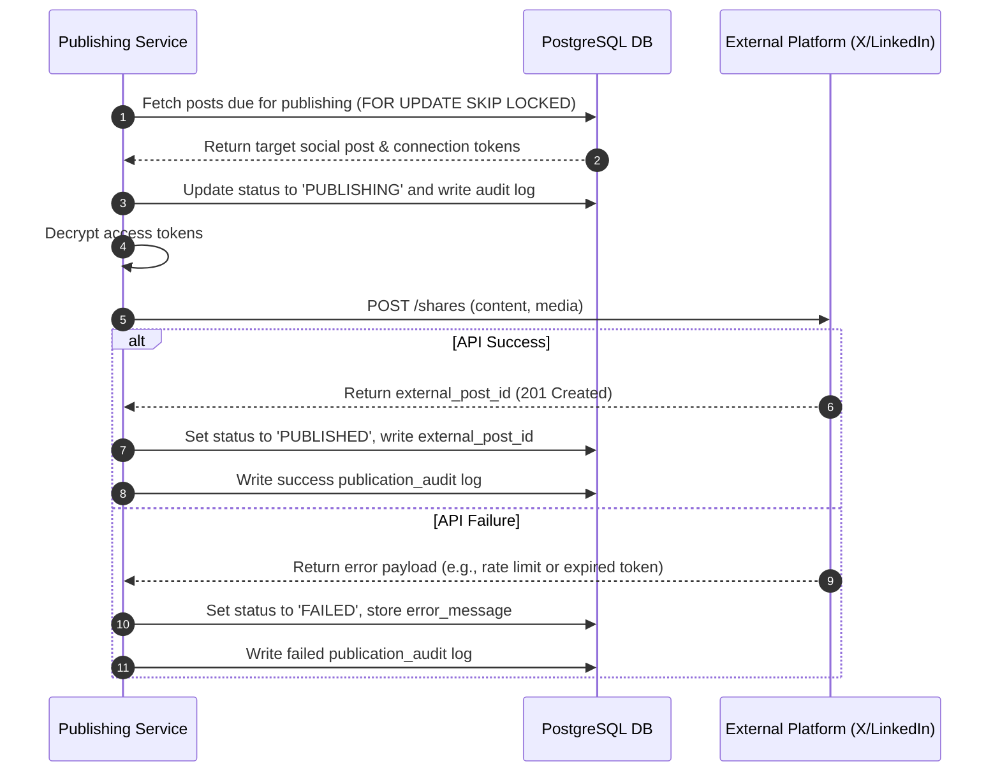
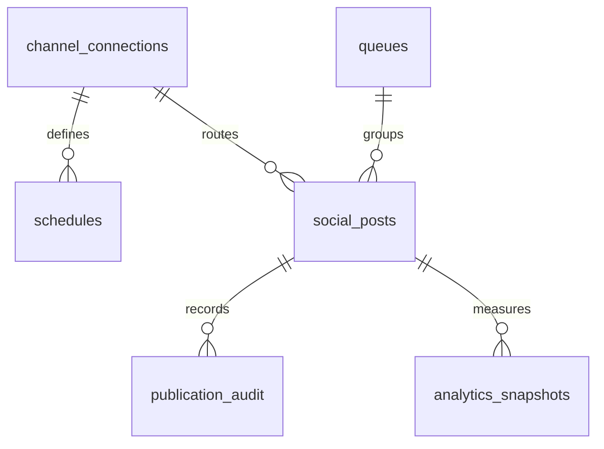

# Social Publishing Schema

## Purpose
The purpose of the Social Publishing Schema is to define the database schema, states, relationships, and data contracts that drive multi-channel social distribution within the NewsOps Cloud digital publishing platform. This schema manages connection tokens for third-party platforms, defines scheduled slots, structures publishing queues, stores social media post variations, audit trails, and tracks engagement performance metrics over time.

## Executive Summary
The Social Publishing module coordinates the distribution of news articles to social platforms (e.g., Twitter/X, LinkedIn, Facebook, Instagram, Slack). This document presents a PostgreSQL and Prisma schema design featuring tables for `channel_connections`, `schedules`, `queues`, `social_posts`, `publication_audit`, and `analytics_snapshots`. It handles token security, automatic queue prioritization, publication log state machines, and timeseries social performance tracking.

## Vision
Our vision is to provide newsrooms with a single, highly automated dashboard to compose, schedule, preview, and review posts across all major social networks. By storing structured posting slots and temporal analytics, the database facilitates AI-driven optimizations that publish posts at maximum engagement windows and auto-recycle evergreen content.

## Scope
The Social Publishing schema is limited to:
- Social media platform connection settings and encrypted OAuth tokens.
- Publishing queues and scheduling slot systems.
- Social media post content, media attachments, and lifecycle states.
- Auditing logs for user operations on social media assets.
- Periodic analytics snapshots for engagement reporting.

It does not handle the media transcoding pipeline itself, nor the raw Webhooks from social networks (which are processed in memory and aggregated prior to writing to `analytics_snapshots`).

## Goals
- Securely store OAuth credentials using field-level encryption attributes.
- Ensure that the automated publishing scheduler can retrieve post queues in under 15ms.
- Support scheduled publication times with minute-level resolution.
- Track social post analytics (likes, shares, clicks) at flexible snapshots (1h, 24h, 7d, 30d).

## Functional Requirements
- **Channel Connection**: Support OAuth2 integrations for Twitter, LinkedIn, Facebook, Instagram, and Slack.
- **Queue System**: Provide a FIFO queue that can be paused, reordered, or associated with specific post types.
- **Posting Schedule**: Support weekly recurring slots (e.g., every Monday at 10:00 AM) that automatically pull from the active queue.
- **Auditing**: Log all human changes (creation, edit, manual trigger, deletion) and machine transitions (queued, posting, success, fail).
- **Analytics Accumulation**: Support delta snapshots for tracking external platform engagement numbers over time.

## Non-Functional Requirements
- **Security**: OAuth tokens must be stored in encrypted text columns.
- **Concurrency**: Prevent duplicate publishing of the same scheduled post by locking the queue item row during API execution.
- **Read/Write Scalability**: Handle up to 1,000 active post updates per minute during viral events or major news days.
- **Relational Integrity**: Enforce foreign keys so that removing a channel connection halts scheduling and cascades to schedules and queues, while preserving historical analytics.

## Business Rules
1. A post must have a state transition path of: `DRAFT` -> `QUEUED` or `SCHEDULED` -> `PUBLISHING` -> `PUBLISHED` or `FAILED`.
2. OAuth tokens (`channel_connections`) must be verified at least 24 hours before expiration; otherwise, the connection changes status to `EXPIRED`.
3. A post in `PUBLISHING` state must not be modified by editors or another scheduler process.
4. Any change to a post's status or content must generate a new entry in `publication_audit`.

## Actors
- **Social Media Editor**: Authors posts, links them to articles, configures schedules, and resolves posting failures.
- **Publishing Worker**: Cron-driven microservice that polls scheduled queues, posts content to external APIs, and updates state.
- **Analytics Ingest Service**: Background service that fetches external metrics (likes, clicks) and records snapshots.
- **Admin**: Connects corporate channels and manages organization-wide queues.

## User Stories
1. **As a Social Media Editor**, I want to link our corporate Twitter account using OAuth so that I can schedule posts without sharing raw passwords.
2. **As an Editor**, I want to drop an article link into a channel-specific queue and have it publish automatically at the next available scheduled slot.
3. **As a Chief of Content**, I want to see the performance of a social post over a 7-day period so that I can evaluate its ROI and viral coefficients.

## Acceptance Criteria
1. The `channel_connections` table must encrypt `access_token` and `refresh_token` before saving to disk.
2. Post scheduler query must fetch items using a `SELECT ... FOR UPDATE SKIP LOCKED` query to ensure no duplicate publishing occurs.
3. Post state must reject invalid transitions (e.g. updating direct from `DRAFT` to `PUBLISHED` without passing through `PUBLISHING`).
4. Average response time for generating daily analytics aggregate reports must remain under 120ms for up to 100,000 post records.

## Workflows
1. **Social Publishing Flow**:
   - Worker runs every minute, queries `social_posts` where `status` is `QUEUED` or `SCHEDULED` and `scheduled_at <= NOW()`.
   - Worker uses row-level locking (`FOR UPDATE SKIP LOCKED`) on matching records, setting status to `PUBLISHING`.
   - Worker calls external APIs (e.g. LinkedIn API) with the decrypted `access_token` from `channel_connections`.
   - On success, Worker stores external post ID, sets status to `PUBLISHED`, sets `published_at = NOW()`, and writes success audit log.
   - On error, Worker increments retries, writes error message to post, updates status to `FAILED` (or back to `QUEUED` if under retry limit), and logs audit event.

2. **Metrics Collection Flow**:
   - Collector task polls all `PUBLISHED` posts that are less than 30 days old.
   - For each post, Collector calls the platform API to fetch current likes, reposts, comments, and clicks.
   - Collector inserts a record into `analytics_snapshots`.
   - System updates aggregation tables for the dashboard charts.



## API Design

### POST /api/v1/social/posts
Creates and queues a new social post.
**Request Headers**:
- `Authorization: Bearer <JWT>`
- `Content-Type: application/json`

**Request Payload**:
```json
{
  "channelConnectionId": "con_3320119",
  "queueId": "que_440918",
  "content": "Check out our latest investigative piece on digital privacy in 2026! https://newsops.cloud/articles/privacy-2026",
  "mediaUrls": ["https://newsops.cloud/static/privacy-banner.jpg"],
  "scheduledAt": "2026-06-27T23:00:00.000Z"
}
```

**Response Payload (201 Created)**:
```json
{
  "id": "pst_77182901",
  "channelConnectionId": "con_3320119",
  "queueId": "que_440918",
  "content": "Check out our latest investigative piece on digital privacy in 2026! https://newsops.cloud/articles/privacy-2026",
  "mediaUrls": ["https://newsops.cloud/static/privacy-banner.jpg"],
  "status": "SCHEDULED",
  "scheduledAt": "2026-06-27T23:00:00.000Z",
  "createdAt": "2026-06-27T22:18:00.000Z"
}
```

### GET /api/v1/social/posts/{id}/analytics
Retrieves historical performance data for a social post.
**Response Payload (200 OK)**:
```json
{
  "postId": "pst_77182901",
  "platform": "LINKEDIN",
  "currentMetrics": {
    "likes": 142,
    "reposts": 28,
    "comments": 12,
    "clicks": 490
  },
  "snapshots": [
    {
      "timestamp": "2026-06-27T12:00:00.000Z",
      "likes": 50,
      "reposts": 10,
      "comments": 2,
      "clicks": 150
    },
    {
      "timestamp": "2026-06-27T18:00:00.000Z",
      "likes": 142,
      "reposts": 28,
      "comments": 12,
      "clicks": 490
    }
  ]
}
```

## Database Design

### Prisma Schema
```prisma
datasource db {
  provider = "postgresql"
  url      = env("DATABASE_URL")
}

generator client {
  provider = "prisma-client-js"
}

enum PlatformType {
  TWITTER
  LINKEDIN
  FACEBOOK
  INSTAGRAM
  SLACK
}

enum ConnectionStatus {
  ACTIVE
  EXPIRED
  REVOKED
}

enum PostStatus {
  DRAFT
  QUEUED
  SCHEDULED
  PUBLISHING
  PUBLISHED
  FAILED
}

model ChannelConnection {
  id             String           @id @default(dbgenerated("concat('con_', replace(gen_random_uuid()::text, '-', ''))")) @db.VarChar(50)
  organizationId String           @map("organization_id") @db.VarChar(50)
  platform       PlatformType
  accountName    String           @map("account_name") @db.VarChar(255)
  accessToken    String           @map("access_token") @db.Text // Encrypted field
  refreshToken   String?          @map("refresh_token") @db.Text // Encrypted field
  expiresAt      DateTime?        @map("expires_at")
  status         ConnectionStatus @default(ACTIVE)
  createdAt      DateTime         @default(now()) @map("created_at")
  updatedAt      DateTime         @updatedAt @map("updated_at")

  schedules      Schedule[]
  socialPosts    SocialPost[]

  @@index([organizationId])
  @@index([status])
  @@map("channel_connections")
}

model Queue {
  id             String       @id @default(dbgenerated("concat('que_', replace(gen_random_uuid()::text, '-', ''))")) @db.VarChar(50)
  organizationId String       @map("organization_id") @db.VarChar(50)
  name           String       @db.VarChar(255)
  status         String       @default("ACTIVE") @db.VarChar(50)
  createdAt      DateTime     @default(now()) @map("created_at")
  updatedAt      DateTime     @updatedAt @map("updated_at")

  socialPosts    SocialPost[]

  @@index([organizationId])
  @@map("queues")
}

model Schedule {
  id                  String            @id @default(dbgenerated("concat('sch_', replace(gen_random_uuid()::text, '-', ''))")) @db.VarChar(50)
  channelConnectionId String            @map("channel_connection_id") @db.VarChar(50)
  dayOfWeek           Int               @map("day_of_week") @db.SmallInt // 0 (Sunday) to 6 (Saturday)
  timeOfDay           String            @map("time_of_day") @db.VarChar(5) // HH:MM string format
  createdAt           DateTime          @default(now()) @map("created_at")
  updatedAt           DateTime          @updatedAt @map("updated_at")

  channelConnection   ChannelConnection @relation(fields: [channelConnectionId], references: [id], onDelete: Cascade)

  @@unique([channelConnectionId, dayOfWeek, timeOfDay])
  @@map("schedules")
}

model SocialPost {
  id                  String            @id @default(dbgenerated("concat('pst_', replace(gen_random_uuid()::text, '-', ''))")) @db.VarChar(50)
  organizationId      String            @map("organization_id") @db.VarChar(50)
  channelConnectionId String            @map("channel_connection_id") @db.VarChar(50)
  queueId             String?           @map("queue_id") @db.VarChar(50)
  content             String            @db.Text
  mediaUrls           String[]          @map("media_urls") @db.VarChar(2048)
  status              PostStatus        @default(DRAFT)
  scheduledAt         DateTime?         @map("scheduled_at")
  publishedAt         DateTime?         @map("published_at")
  externalPostId      String?           @map("external_post_id") @db.VarChar(512)
  errorMessage        String?           @map("error_message") @db.Text
  retryCount          Int               @default(0) @map("retry_count")
  createdAt           DateTime          @default(now()) @map("created_at")
  updatedAt           DateTime          @updatedAt @map("updated_at")

  channelConnection   ChannelConnection @relation(fields: [channelConnectionId], references: [id])
  queue               Queue?            @relation(fields: [queueId], references: [id], onDelete: SetNull)
  audits              PublicationAudit[]
  snapshots           AnalyticsSnapshot[]

  @@index([organizationId])
  @@index([status, scheduledAt])
  @@index([queueId])
  @@map("social_posts")
}

model PublicationAudit {
  id           String     @id @default(dbgenerated("concat('adt_', replace(gen_random_uuid()::text, '-', ''))")) @db.VarChar(50)
  socialPostId String     @map("social_post_id") @db.VarChar(50)
  userId       String     @map("user_id") @db.VarChar(50)
  action       String     @db.VarChar(100) // CREATE, UPDATE, STATE_CHANGE, POST_PUBLISH
  metadata     Json?      @map("metadata")
  timestamp    DateTime   @default(now())

  socialPost   SocialPost @relation(fields: [socialPostId], references: [id], onDelete: Cascade)

  @@index([socialPostId])
  @@index([userId])
  @@map("publication_audit")
}

model AnalyticsSnapshot {
  id           String     @id @default(dbgenerated("concat('snp_', replace(gen_random_uuid()::text, '-', ''))")) @db.VarChar(50)
  socialPostId String     @map("social_post_id") @db.VarChar(50)
  timestamp    DateTime   @default(now())
  impressions  Int        @default(0)
  engagements  Int        @default(0)
  clicks       Int        @default(0)
  rawMetrics   Json       @map("raw_metrics") // Custom payload depending on platform API response

  socialPost   SocialPost @relation(fields: [socialPostId], references: [id], onDelete: Cascade)

  @@index([socialPostId, timestamp])
  @@map("analytics_snapshots")
}
```

### PostgreSQL DDL
```sql
-- Schema DDL setup for Social Publishing Module

CREATE TYPE platform_type AS ENUM ('TWITTER', 'LINKEDIN', 'FACEBOOK', 'INSTAGRAM', 'SLACK');
CREATE TYPE connection_status AS ENUM ('ACTIVE', 'EXPIRED', 'REVOKED');
CREATE TYPE post_status AS ENUM ('DRAFT', 'QUEUED', 'SCHEDULED', 'PUBLISHING', 'PUBLISHED', 'FAILED');

-- Channel Connections Table
CREATE TABLE channel_connections (
    id VARCHAR(50) PRIMARY KEY DEFAULT concat('con_', replace(gen_random_uuid()::text, '-', '')),
    organization_id VARCHAR(50) NOT NULL,
    platform platform_type NOT NULL,
    account_name VARCHAR(255) NOT NULL,
    access_token TEXT NOT NULL, -- Encrypted string values
    refresh_token TEXT,          -- Encrypted string values
    expires_at TIMESTAMP WITH TIME ZONE,
    status connection_status NOT NULL DEFAULT 'ACTIVE',
    created_at TIMESTAMP WITH TIME ZONE NOT NULL DEFAULT NOW(),
    updated_at TIMESTAMP WITH TIME ZONE NOT NULL DEFAULT NOW()
);

CREATE INDEX idx_channel_connections_org ON channel_connections(organization_id);
CREATE INDEX idx_channel_connections_status ON channel_connections(status);

-- Queues Table
CREATE TABLE queues (
    id VARCHAR(50) PRIMARY KEY DEFAULT concat('que_', replace(gen_random_uuid()::text, '-', '')),
    organization_id VARCHAR(50) NOT NULL,
    name VARCHAR(255) NOT NULL,
    status VARCHAR(50) NOT NULL DEFAULT 'ACTIVE',
    created_at TIMESTAMP WITH TIME ZONE NOT NULL DEFAULT NOW(),
    updated_at TIMESTAMP WITH TIME ZONE NOT NULL DEFAULT NOW()
);

CREATE INDEX idx_queues_org ON queues(organization_id);

-- Schedules (Recurring Posting Slots) Table
CREATE TABLE schedules (
    id VARCHAR(50) PRIMARY KEY DEFAULT concat('sch_', replace(gen_random_uuid()::text, '-', '')),
    channel_connection_id VARCHAR(50) NOT NULL REFERENCES channel_connections(id) ON DELETE CASCADE,
    day_of_week SMALLINT NOT NULL CHECK (day_of_week >= 0 AND day_of_week <= 6),
    time_of_day VARCHAR(5) NOT NULL CHECK (time_of_day ~ '^[0-2][0-9]:[0-5][0-9]$'),
    created_at TIMESTAMP WITH TIME ZONE NOT NULL DEFAULT NOW(),
    updated_at TIMESTAMP WITH TIME ZONE NOT NULL DEFAULT NOW(),
    CONSTRAINT uq_channel_slot UNIQUE (channel_connection_id, day_of_week, time_of_day)
);

-- Social Posts Table
CREATE TABLE social_posts (
    id VARCHAR(50) PRIMARY KEY DEFAULT concat('pst_', replace(gen_random_uuid()::text, '-', '')),
    organization_id VARCHAR(50) NOT NULL,
    channel_connection_id VARCHAR(50) NOT NULL REFERENCES channel_connections(id) ON DELETE RESTRICT,
    queue_id VARCHAR(50) REFERENCES queues(id) ON DELETE SET NULL,
    content TEXT NOT NULL,
    media_urls VARCHAR(2048)[] DEFAULT '{}',
    status post_status NOT NULL DEFAULT 'DRAFT',
    scheduled_at TIMESTAMP WITH TIME ZONE,
    published_at TIMESTAMP WITH TIME ZONE,
    external_post_id VARCHAR(512),
    error_message TEXT,
    retry_count INT NOT NULL DEFAULT 0,
    created_at TIMESTAMP WITH TIME ZONE NOT NULL DEFAULT NOW(),
    updated_at TIMESTAMP WITH TIME ZONE NOT NULL DEFAULT NOW(),
    CONSTRAINT chk_post_publish_times CHECK (published_at IS NULL OR scheduled_at IS NULL OR published_at >= scheduled_at)
);

CREATE INDEX idx_posts_org ON social_posts(organization_id);
CREATE INDEX idx_posts_sched_status ON social_posts(status, scheduled_at) WHERE status IN ('QUEUED', 'SCHEDULED');
CREATE INDEX idx_posts_queue ON social_posts(queue_id) WHERE queue_id IS NOT NULL;

-- Publication Audit Table
CREATE TABLE publication_audit (
    id VARCHAR(50) PRIMARY KEY DEFAULT concat('adt_', replace(gen_random_uuid()::text, '-', '')),
    social_post_id VARCHAR(50) NOT NULL REFERENCES social_posts(id) ON DELETE CASCADE,
    user_id VARCHAR(50) NOT NULL,
    action VARCHAR(100) NOT NULL,
    metadata JSONB,
    timestamp TIMESTAMP WITH TIME ZONE NOT NULL DEFAULT NOW()
);

CREATE INDEX idx_audit_post ON publication_audit(social_post_id);
CREATE INDEX idx_audit_user ON publication_audit(user_id);

-- Analytics Snapshots Table
CREATE TABLE analytics_snapshots (
    id VARCHAR(50) PRIMARY KEY DEFAULT concat('snp_', replace(gen_random_uuid()::text, '-', '')),
    social_post_id VARCHAR(50) NOT NULL REFERENCES social_posts(id) ON DELETE CASCADE,
    timestamp TIMESTAMP WITH TIME ZONE NOT NULL DEFAULT NOW(),
    impressions INT NOT NULL DEFAULT 0,
    engagements INT NOT NULL DEFAULT 0,
    clicks INT NOT NULL DEFAULT 0,
    raw_metrics JSONB NOT NULL
);

CREATE INDEX idx_snapshots_post_time ON analytics_snapshots(social_post_id, timestamp DESC);
```

## UI Design
- **Channel Dashboard**: Shows icons for Twitter, Facebook, LinkedIn with connected profiles, user handles, connection status, token lifespan indicators, and "Re-authenticate" links.
- **Composer and Queue Planner**: Split layout where the left panel is a post composer (character count, preview block, scheduling toggle), and the right panel displays a drag-and-drop chronological timeline of the posting queue.
- **Analytics Visualizer**: Graphical chart plotting likes, impressions, and click-through rates (CTR) over time. Displays comparative indicators showing whether the post is performing above or below the channel's baseline.

## Permissions
- `social:connections:write` - Admin, Social Manager roles. Create, delete and renew channel OAuth connections.
- `social:posts:create` - Editor, Contributor, Social Manager roles. Compose and queue drafts.
- `social:posts:approve` - Editor, Social Manager roles. Transition posts from DRAFT to QUEUED.
- `social:posts:publish` - Worker Service. Trigger immediate API publishing.
- `social:analytics:read` - Reader, Editor, Admin. View post analytics graphs.

## Security
- **OAuth Cryptography**: Token credentials in `channel_connections` must be encrypted using AES-256-GCM. The key must be retrieved from AWS Secret Manager or local environment during startup and must never be exposed via logging or REST APIs.
- **Access Control Isolation**: The API controllers must enforce organization scoping. Ensure `where: { organizationId }` queries match the user token payload.
- **CSRF Defense**: All state changing requests (creating/updating connections and schedules) must include CSRF validation tokens.

## Performance
- **Queue Polling Latency**: Less than 15ms. The database indexes on `(status, scheduled_at)` ensure search queries do not perform table scans.
- **Caching**: Channel settings and schedule intervals must be cached in Redis. Post status fields bypass cache to ensure atomic state representation.
- **Target Ingest Rate**: Snapshots can scale to 5,000 writes/hour during peak processing without slowing down API performance.

## Monitoring
- `newsops_social_publish_attempts_total`: Counter by channel and post status (success, failure).
- `newsops_social_token_expiry_days`: Gauge of remaining validity of connected tokens.
- `newsops_social_queue_backlog_count`: Gauge tracking scheduled posts whose time has passed but status remains un-published.
- **Alert Triggers**: Generate a warning alert if a channel's token is within 3 days of expiration. Generate a critical PagerDuty alert if a post remains in `PUBLISHING` status for more than 15 minutes.

## Logging
- **Log Format**: JSON log format.
- **Log Levels**: INFO for schedule checks and updates; WARN for posting retries and OAuth token expiration warnings; ERROR for API network errors and DB transactions.
- **Log Context Example**:
  ```json
  {
    "timestamp": "2026-06-27T22:18:30.405Z",
    "level": "ERROR",
    "context": "social-publishing-worker",
    "post_id": "pst_77182901",
    "channel_id": "con_3320119",
    "error": "LinkedIn API returned 401 Unauthorized. Access token expired.",
    "action": "PUBLISH_TO_PLATFORM"
  }
  ```

## Error Handling
- `OAUTH_EXPIRED`: Code 401. HTTP Status 401 Unauthorized. Message: "The connection to this social media account has expired. Please re-authenticate."
- `POST_CONTENT_TOO_LONG`: Code 400. HTTP Status 400 Bad Request. Message: "The post text exceeds the character limits of the target platform."
- `LOCKED_BY_WORKER`: Code 409. HTTP Status 409 Conflict. Message: "This social post is currently being processed by the system scheduler."
- `QUEUE_PAUSED`: Code 403. HTTP Status 403 Forbidden. Message: "The destination publication queue is currently paused."

## Edge Cases
- **Simultaneous Worker Polling**: If two worker tasks run concurrently, row-level locks using `SELECT FOR UPDATE SKIP LOCKED` prevent double-posting.
- **API Timeout During Post Request**: If the external API takes too long to respond, the worker times out after 30 seconds, releases the lock, increments `retry_count`, and marks the post as `QUEUED` (for a retry in the next minute) or `FAILED` (if max retries of 3 is reached).
- **Post Deleted From Queue Mid-Publishing**: If an editor deletes a post record from the UI while the worker is actively posting it, the database cascade delete will either be blocked if a transaction lock is active, or safe cleanup will handle the aftermath gracefully by catching foreign key violations in the worker thread.

## Future Improvements
- **Automated Copy Variation Generator**: Add AI support columns to generate platform-tailored copy strings based on target demographics (e.g., emojis for Twitter, professional summary for LinkedIn).
- **Event-Driven Webhook Analytics**: Transition metric collection from a poll-based model to event-driven webhooks from Twitter/Facebook API events to record engagements in near real-time.

## Mermaid Diagrams


## References
- [System Architecture](../../docs/02-architecture/system_architecture.md)
- [Multi Tenancy Architecture](../../docs/02-architecture/multi_tenancy_architecture.md)
- [Event Driven Design](../../docs/02-architecture/event_driven_design.md)
