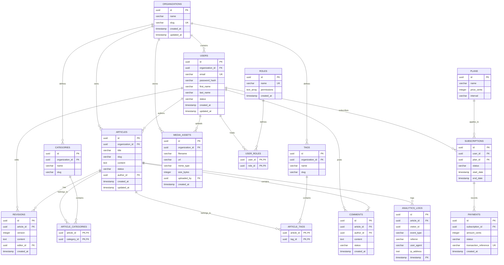

# Unified Entity Relationship Diagram (ERD)

## Purpose
This document provides the definitive, comprehensive structural design of the NewsOps Cloud digital publishing platform database. It includes the unified Entity Relationship Diagram (ERD) mapping the core entities (multitenancy, user identity, article publishing, taxonomy, commenting, media, analytics, and subscriptions), their structural relationships, field definitions, indexes, and foreign key constraints.

## Executive Summary
The NewsOps Cloud platform employs a relational PostgreSQL model designed to support strict multitenancy, high-speed publishing, and secure subscriber transaction flows. The schema is organized into distinct logical zones:
1. **Core Multitenancy & Identity**: Managed via `organizations`, `users`, `roles`, and `user_roles`.
2. **Publishing & Content Lifecycle**: Managed via `articles`, `revisions`, `categories`, `tags`, and relationship junction tables.
3. **Engagement & Media**: Managed via `comments` and `media_assets`.
4. **Telemetry**: High-volume pageview and interaction tracking via `analytics_logs`.
5. **Subscriptions & Monetization**: Managed via `plans`, `subscriptions`, and `payments`.

This document acts as the database blueprint for all engineers when creating tables, writing queries, and building APIs.

## Vision
To establish a normalized, highly performant, and self-documenting data model that ensures strong referential integrity, absolute data isolation between organizations, and seamless extensibility for future media features.

## Scope
- Complete logical database schema representations.
- Primary key, foreign key, and unique constraint definitions.
- Detailed field data types mapped to PostgreSQL naming structures.
- Structural relations with accurate Mermaid cardinality indicators.

## Goals
- Provide developers with an unambiguous model mapping all table boundaries.
- Ensure 100% adherence to multitenant separation rules.
- Minimize database write amplification by detailing optimal relations.
- Keep documentation in sync with current database state.

## Functional Requirements
- **Visual Entity Mapping**: Provide a rendered, interactive Mermaid ERD detailing tables, keys, and cardinalities.
- **Data Isolation**: Map `organization_id` keys to all tenant-scoped structures (Articles, Users, Media, Categories, Tags).
- **Audit Trails**: Define creation and update tracking timestamps for auditing modifications.
- **Integrity Constraints**: Specify cascade rules (e.g. `ON DELETE CASCADE` or `RESTRICT`) for database operations.

## Non-Functional Requirements
- **Third Normal Form (3NF)**: Maintain transactional data structure consistency to prevent write anomalies.
- **Index-Friendly Design**: Ensure foreign keys are indexed automatically to fast-track relational lookups.
- **Diagram Readability**: Organize the ERD layout to render cleanly on standard markdown viewers.

## Business Rules
- **Multitenancy**: Under no circumstances can data from one `organization_id` be retrieved or mutated by an actor belonging to a different `organization_id`.
- **Identity Integrity**: A user must possess at least one role to interact with non-public administrative APIs.
- **Transactional Consistency**: Subscription activations must always associate with a successful corresponding invoice payment log.

## Actors
- **Database Administrator (DBA)**: Manages constraint updates, optimizes indexes, and oversees schemas.
- **Backend Engineer**: Consumes the ERD to write ORM mappings (Prisma) and queries.
- **Security Auditor**: Verifies that user PII (Passwords, Profiles) maps to highly protected tables.

## User Stories
1. **As a Backend Engineer**, I want to inspect the relationship between payments, subscriptions, and users, so that I can write code that automatically deactivates subscriptions when a payment fails.
2. **As a DBA**, I want to identify which tables depend on the `users` table via foreign keys, so that I can prevent orphan record creations during user account deletions.
3. **As a Product Owner**, I want to see how articles map to categories and tags, so that I can plan features for taxonomy-based content recommendation engines.

## Acceptance Criteria
- **AC-1**: The Mermaid schema syntax must compile and render without error.
- **AC-2**: The ERD must include data types for every defined table attribute.
- **AC-3**: Mappings must clearly indicate relationship cardinalities (e.g., zero-or-more `0{`, one-to-many `|{`, exactly-one `||`).
- **AC-4**: Foreign keys must have clear annotations pointing to their originating primary tables.

## Workflows
### Schema Modification & ERD Update Process
1. **Change Identification**: Developer proposes a database schema update (e.g. adding a new table for push notifications).
2. **Prisma Update**: Developer modifies `schema.prisma` and runs local validation checks.
3. **DDL Generation**: Runs `prisma migrate dev --create-only` to output the migration SQL.
4. **ERD Update**: Developer updates the `erDiagram` block in `unified_erd.md` to reflect the new structure.
5. **Code Review**: PR is submitted containing both the SQL migration, Prisma schema, and updated `unified_erd.md`.
6. **DBA Approval**: DBA checks for compliance (e.g., indexing, constraint checks) and merges to main.

## API Design

### 1. Retrieve Current DB Schema Representation
Enables metadata extraction for automated client-side validators.

- **URL**: `/api/v1/admin/database/schema`
- **Method**: `GET`
- **Headers**:
  - `Authorization: Bearer <JWT>`
- **Response (200 OK)**:
```json
{
  "version": "1.4.2",
  "lastUpdated": "2026-06-27T22:17:29Z",
  "tables": [
    {
      "name": "organizations",
      "columns": 5,
      "primaryKey": ["id"],
      "foreignKeys": []
    },
    {
      "name": "users",
      "columns": 9,
      "primaryKey": ["id"],
      "foreignKeys": [
        {
          "column": "organization_id",
          "references": "organizations.id",
          "onDelete": "CASCADE"
        }
      ]
    }
  ]
}
```

## Database Design

### Full SQL DDL Schema Mapping
Below is the PostgreSQL syntax representing the database layout visualized in the ERD.

```sql
-- Core Multitenancy & Identity
CREATE TABLE public.organizations (
    id UUID PRIMARY KEY,
    name VARCHAR(255) NOT NULL,
    slug VARCHAR(255) UNIQUE NOT NULL,
    created_at TIMESTAMP WITH TIME ZONE NOT NULL DEFAULT NOW(),
    updated_at TIMESTAMP WITH TIME ZONE NOT NULL DEFAULT NOW()
);

CREATE TABLE public.users (
    id UUID PRIMARY KEY,
    organization_id UUID NOT NULL REFERENCES public.organizations(id) ON DELETE CASCADE,
    email VARCHAR(255) UNIQUE NOT NULL,
    password_hash VARCHAR(255) NOT NULL,
    first_name VARCHAR(100),
    last_name VARCHAR(100),
    status VARCHAR(50) NOT NULL DEFAULT 'ACTIVE',
    created_at TIMESTAMP WITH TIME ZONE NOT NULL DEFAULT NOW(),
    updated_at TIMESTAMP WITH TIME ZONE NOT NULL DEFAULT NOW()
);

CREATE TABLE public.roles (
    id UUID PRIMARY KEY,
    name VARCHAR(100) UNIQUE NOT NULL,
    permissions TEXT[] NOT NULL,
    created_at TIMESTAMP WITH TIME ZONE NOT NULL DEFAULT NOW()
);

CREATE TABLE public.user_roles (
    user_id UUID NOT NULL REFERENCES public.users(id) ON DELETE CASCADE,
    role_id UUID NOT NULL REFERENCES public.roles(id) ON DELETE CASCADE,
    PRIMARY KEY (user_id, role_id)
);

-- Publishing & Content Lifecycle
CREATE TABLE public.articles (
    id UUID PRIMARY KEY,
    organization_id UUID NOT NULL REFERENCES public.organizations(id) ON DELETE CASCADE,
    title VARCHAR(255) NOT NULL,
    slug VARCHAR(255) NOT NULL,
    content TEXT NOT NULL,
    status VARCHAR(50) NOT NULL DEFAULT 'DRAFT',
    author_id UUID NOT NULL REFERENCES public.users(id),
    created_at TIMESTAMP WITH TIME ZONE NOT NULL DEFAULT NOW(),
    updated_at TIMESTAMP WITH TIME ZONE NOT NULL DEFAULT NOW()
);

CREATE TABLE public.revisions (
    id UUID PRIMARY KEY,
    article_id UUID NOT NULL REFERENCES public.articles(id) ON DELETE CASCADE,
    version INT NOT NULL,
    content TEXT NOT NULL,
    editor_id UUID NOT NULL REFERENCES public.users(id),
    created_at TIMESTAMP WITH TIME ZONE NOT NULL DEFAULT NOW()
);

CREATE TABLE public.categories (
    id UUID PRIMARY KEY,
    organization_id UUID NOT NULL REFERENCES public.organizations(id) ON DELETE CASCADE,
    name VARCHAR(100) NOT NULL,
    slug VARCHAR(100) NOT NULL,
    CONSTRAINT unique_org_category_slug UNIQUE (organization_id, slug)
);

CREATE TABLE public.article_categories (
    article_id UUID NOT NULL REFERENCES public.articles(id) ON DELETE CASCADE,
    category_id UUID NOT NULL REFERENCES public.categories(id) ON DELETE CASCADE,
    PRIMARY KEY (article_id, category_id)
);

CREATE TABLE public.tags (
    id UUID PRIMARY KEY,
    organization_id UUID NOT NULL REFERENCES public.organizations(id) ON DELETE CASCADE,
    name VARCHAR(100) NOT NULL,
    slug VARCHAR(100) NOT NULL,
    CONSTRAINT unique_org_tag_slug UNIQUE (organization_id, slug)
);

CREATE TABLE public.article_tags (
    article_id UUID NOT NULL REFERENCES public.articles(id) ON DELETE CASCADE,
    tag_id UUID NOT NULL REFERENCES public.tags(id) ON DELETE CASCADE,
    PRIMARY KEY (article_id, tag_id)
);

-- Engagement & Media
CREATE TABLE public.comments (
    id UUID PRIMARY KEY,
    article_id UUID NOT NULL REFERENCES public.articles(id) ON DELETE CASCADE,
    author_id UUID REFERENCES public.users(id) ON DELETE SET NULL,
    content TEXT NOT NULL,
    status VARCHAR(50) NOT NULL DEFAULT 'PENDING',
    created_at TIMESTAMP WITH TIME ZONE NOT NULL DEFAULT NOW()
);

CREATE TABLE public.media_assets (
    id UUID PRIMARY KEY,
    organization_id UUID NOT NULL REFERENCES public.organizations(id) ON DELETE CASCADE,
    filename VARCHAR(255) NOT NULL,
    url VARCHAR(512) NOT NULL,
    mime_type VARCHAR(100) NOT NULL,
    size_bytes INT NOT NULL,
    uploaded_by UUID REFERENCES public.users(id) ON DELETE SET NULL,
    created_at TIMESTAMP WITH TIME ZONE NOT NULL DEFAULT NOW()
);

-- Telemetry Logs (Partitioned dynamically in production)
CREATE TABLE public.analytics_logs (
    id UUID NOT NULL,
    article_id UUID REFERENCES public.articles(id) ON DELETE SET NULL,
    visitor_id UUID NOT NULL,
    event_type VARCHAR(100) NOT NULL,
    referrer VARCHAR(512),
    user_agent VARCHAR(512),
    ip_address INET,
    timestamp TIMESTAMP WITH TIME ZONE NOT NULL,
    PRIMARY KEY (id, timestamp)
);

-- Subscriptions & Monetization
CREATE TABLE public.plans (
    id UUID PRIMARY KEY,
    name VARCHAR(100) NOT NULL,
    price_cents INT NOT NULL,
    interval VARCHAR(50) NOT NULL DEFAULT 'MONTHLY'
);

CREATE TABLE public.subscriptions (
    id UUID PRIMARY KEY,
    user_id UUID NOT NULL REFERENCES public.users(id) ON DELETE CASCADE,
    plan_id UUID NOT NULL REFERENCES public.plans(id),
    status VARCHAR(50) NOT NULL DEFAULT 'INACTIVE',
    start_date TIMESTAMP WITH TIME ZONE NOT NULL,
    end_date TIMESTAMP WITH TIME ZONE NOT NULL
);

CREATE TABLE public.payments (
    id UUID PRIMARY KEY,
    subscription_id UUID NOT NULL REFERENCES public.subscriptions(id) ON DELETE CASCADE,
    amount_cents INT NOT NULL,
    status VARCHAR(50) NOT NULL,
    transaction_reference VARCHAR(255) UNIQUE NOT NULL,
    created_at TIMESTAMP WITH TIME ZONE NOT NULL DEFAULT NOW()
);
```

## UI Design
The unified database structure is visualized inside the Developer Portal:
- **Graph Canvas**: Interactive nodes showing all tables. Hovering over a table highlights foreign keys.
- **Sidebar Details**: Clicking a node reveals database details (DDL schema script, active indexes, volume of rows, and relation mappings).

## Permissions
- `schema:read`: View the ERD, run DB analyzer, fetch schema JSON profiles.
- `schema:write`: Apply DDL adjustments (Admin access only).

## Security
- **PII Flagging**: Fields storing identity metrics (e.g. `users.email`, `users.password_hash`, `analytics_logs.ip_address`) are flagged as "PII" in diagram schemas to ensure special monitoring and obfuscation rules apply when loading analytics exports.
- **Hashing**: All credential keys (`password_hash`) must run modern key derivation mechanisms (e.g. Argon2id) inside application layers before writing.

## Performance
- **Indexed Paths**: All foreign key fields mapped in relationships must possess corresponding B-Tree indices to prevent sequential scan locks during joins.
- **Denormalization Limits**: Highly hit analytical paths utilize caching stores (Redis) rather than introducing denormalized columns that compromise structural sanity.

## Monitoring
- **Schema Drift Detection**: Periodic runs comparing Prisma schemas vs production schemas.
- **Foreign Key Sync Alerts**: High alert triggers if any new table is added without an indexed foreign key connector.

## Logging
Schema change metadata logging:

```json
{
  "timestamp": "2026-06-27T22:17:29.992Z",
  "level": "INFO",
  "logger": "db.schema_registry",
  "message": "Validated database entity relationship constraints",
  "context": {
    "tables_registered": 16,
    "relationships_verified": 19,
    "missing_fk_indexes": 0
  }
}
```

## Error Handling
| DB Error Code | HTTP Status | Customer-Facing Message | Internal Description |
|---|---|---|---|
| `23503` | 409 | "This operation violates relational constraints." | Foreign key violation. Attempted to link a child to a non-existent parent. |
| `23505` | 409 | "This record already exists." | Unique constraint violation (e.g. email/slug duplication). |
| `23502` | 400 | "Missing mandatory input fields." | Not null constraint violation. |

## Edge Cases
- **Self-Referential User Mappings**: Users owning tables while being referencing nodes in other tables. Enforce strict sequential deletions to avoid cascade lock loops.
- **Partitioned Table Joins**: Running joins on `analytics_logs` tables without filtering dates. The optimizer will loop through every partition. Code queries must pass date thresholds to target single partitions.

## Future Improvements
- **Schema Federation**: De-coupling telemetry tables (`analytics_logs`) and subscriptions (`payments`) into separate micro-service DB clusters as traffic volume scales.

## Mermaid Diagrams

### Unified Entity Relationship Diagram (ERD)



## References
- [Database Indexes and Partitioning](./indexes_and_partitioning.md)
- [Database Migration Strategy](./migration_strategy.md)
- [Backup and Retention Strategy](./backup_and_retention.md)
