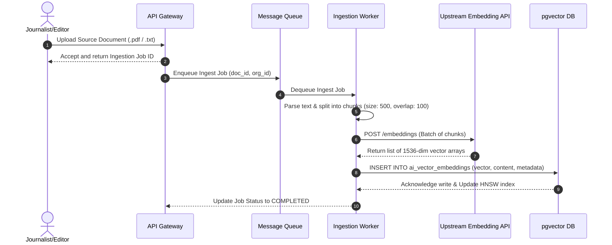

# AI Memory Architecture
## Purpose
This document specifies the technical design for the AI Context and Memory Management System of the NewsOps Cloud digital publishing platform. It details the mechanisms for short-term rolling context memory and long-term vector-based Retrieval-Augmented Generation (RAG) workflows, ensuring context-aware, hyper-personalized, and cost-efficient editorial agent interactions.

## Executive Summary
NewsOps Cloud employs a multi-tiered memory architecture to empower AI-driven publication services, editorial assistants, and localized agents. This design balances real-time low-latency response requirements with long-term retention of organization style guides, editor guidelines, user preferences, and source documentation. By utilizing in-memory caching (Redis) for short-term session state and PostgreSQL with pgvector for long-term semantic storage, the system ensures data isolation, strict tenant segregation, high semantic retrieval relevance, and cost-optimized token utilization.

## Vision
The vision is to establish an AI memory fabric that allows editors and newsrooms to interact with digital agents that have deep, contextual knowledge of past articles, preferred styles, and internal source documents. The memory architecture serves as the foundation for the "NewsOps Brain," turning generic LLM interactions into highly specialized, organizational intelligence systems that improve in relevance over time.

## Scope
The scope of this system covers:
1. **Short-Term Memory**: Management of sliding context windows, token counting, and temporary session state storage in Redis.
2. **Long-Term Memory**: Document ingestion, chunking pipelines, embedding generation, vector indexing using PostgreSQL `pgvector` with HNSW, and hybrid metadata filtering.
3. **Data Lifecycle**: Automatic session summary generation, memory consolidation, and soft/hard deletion workflows compliant with GDPR/CCPA.
4. **Integration**: REST APIs, database schemas, monitoring, and error fallback paths.

## Goals
- **Context Retrieval Latency**: Semantic search and metadata filter query execution in under 80 milliseconds (99th percentile).
- **Tenant Isolation**: Guarantee zero cross-tenant memory leakage at the database, query, and cache levels.
- **Token Efficiency**: Optimize context injection to keep LLM context window payloads under defined cost-threshold boundaries.
- **System Availability**: Maintain 99.9% uptime for the memory retrieval services.

## Functional Requirements
1. **Dynamic Chunking Engine**: Ingest and parse source documents (PDFs, TXT, DOCX, JSON) using semantic or character-based sliding-window chunking algorithms.
2. **Vector Generation and Storage**: Generate 1536-dimension embeddings using OpenAI's `text-embedding-3-small` (or 3072-dimension/768-dimension local fallbacks) and store them with custom JSONB metadata in PostgreSQL.
3. **Short-Term Sliding Context**: Capture user prompts and LLM completions, maintain a rolling token window, and prune or summarize historical interactions when limits are reached.
4. **Metadata-Filtered Semantic Search**: Enable retrieval of long-term memories restricted by Organization ID, User ID, and tags.
5. **Memory Consolidation Pipeline**: Periodically (cron-triggered) scan completed sessions and summarize key facts to write back into the long-term vector database.
6. **Hard Deletion (GDPR/CCPA)**: Provide endpoints to purge all memories, vectors, and session history associated with a specific user or tenant.

## Non-Functional Requirements
1. **Vector Dimensions**: Support variable dimensions (768, 1536, 3072) based on active embedding model configurations.
2. **Query Latency**: In-memory Redis operations must resolve in < 5ms; pgvector queries using HNSW indexes must resolve in < 80ms under 500 concurrent connections.
3. **Scalability**: Support horizontal scaling of ingestion workers and database read replicas.
4. **Storage Durability**: Embeddings and metadata must be backed up daily along with standard transactional tables.

## Business Rules
1. **Strict Organization Boundaries**: Every database and cache query must filter explicitly by `organization_id`. Any query missing this identifier or containing an mismatch with the user session must be aborted.
2. **Cache Expiration**: Inactive short-term memory sessions must be flushed from Redis after 2 hours. If dirty, a summary must be generated and pushed to long-term database storage before deletion.
3. **Storage Quotas**: Free-tier tenants are limited to 100MB of vector storage (approx. 50,000 chunks); Enterprise tenants have unlimited storage subject to overage pricing models.
4. **Consent Control**: User-opt-out settings for AI tracking must bypass long-term memory accumulation and operate only in-memory (short-term) or disabled entirely.

## Actors
1. **Journalist**: Creates articles, uploads research documents, and interacts with writing assistant agents.
2. **Editor**: Reviews articles, manages localized style guides, and configures long-term team policies.
3. **System Administrator**: Monitored vector usage, triggers index rebuilds, and manages storage limits.
4. **AI Context Agent**: Internal system actor that manages token count, calls embedding APIs, and reformulates queries.

## User Stories (At least 3 specific stories)
1. **Style and Context Preservation**: As a Journalist, I want the writing assistant to remember my specific writing tone and vocabulary from past articles, so that the AI-generated drafts require minimal editing.
2. **Source Document Fact Retrieval**: As an Editor, I want to upload a 200-page local source document or investigation transcript, so that when I ask the AI helper questions, it retrieves highly accurate references and quotes from the file.
3. **GDPR Account Erasure**: As a User who has requested account deletion, I want all vectors, semantic memories, and conversation transcripts associated with my profile to be completely purged, so that my personal data is not stored in the system's long-term memory.

## Acceptance Criteria (At least 3-5 criteria with clear thresholds)
1. **Embedding and Indexing**: Uploaded articles must be chunked and indexed in the PostgreSQL vector database within 5 seconds, verifying that the HNSW index updates successfully.
2. **Retrieval Precision and Latency**: Semantic query execution returning Top-K vectors must complete within 80ms, maintaining a vector relevance cosine distance threshold >= 0.72.
3. **Memory Isolation**: A simulated query using an invalid `organization_id` must return an HTTP 403 Forbidden and log a high-priority security event.
4. **Rolling Token Constraint**: When the short-term context token count exceeds 80% of the target model's maximum context limit (e.g., 32,768 tokens), the system must automatically execute the summarization routine and clear the detailed cache window down to 20%.

## Workflows (Step-by-step description of system and user interactions)
### Document Ingestion and Vector Indexing Workflow
1. **Upload**: User uploads a document or publishes a new article.
2. **Chunking**: The document processing worker segments the text into blocks of 500 characters with a 100-character overlap.
3. **Embedding**: The worker sends chunks in batches of 32 to the configured embedding service (OpenAI or Local fallbacks).
4. **Database Write**: The returned vectors and metadata (tenant, user, tags, document reference) are saved in the `ai_vector_embeddings` table.
5. **Index Maintenance**: The PostgreSQL engine dynamically inserts the vector into the HNSW index.

### RAG Retrieval and Context Window Injection Workflow
1. **Prompt Entry**: The Journalist types a prompt.
2. **Query Expansion**: The Context Agent reformulates the query by retrieving recent short-term messages from Redis.
3. **Vector Query**: The Context Agent calls pgvector using cosine distance (`<=>`), filtering by the user's `organization_id` and semantic threshold.
4. **Prompt Assembly**: The retrieved chunks are appended to the system instructions, followed by the short-term history, followed by the current prompt.
5. **LLM Execution**: The assembled prompt payload is dispatched to the LLM.

## API Design (Provide actual REST endpoints, method, request/response JSON payloads, or GraphQL schemas)
### Create Memory Session
- **Endpoint**: `POST /api/v1/ai/memory/sessions`
- **Headers**:
  - `Content-Type: application/json`
  - `Authorization: Bearer <JWT>`
- **Request Body**:
```json
{
  "organization_id": "org_987654321",
  "user_id": "usr_11223344",
  "metadata": {
    "module": "cms_assistant",
    "article_id": "art_abc123"
  }
}
```
- **Response Body (201 Created)**:
```json
{
  "session_id": "mem_sess_55667788",
  "organization_id": "org_987654321",
  "user_id": "usr_11223344",
  "status": "active",
  "created_at": "2026-06-27T22:20:00Z"
}
```

### Append Interaction to Session
- **Endpoint**: `POST /api/v1/ai/memory/sessions/{sessionId}/interactions`
- **Headers**:
  - `Content-Type: application/json`
  - `Authorization: Bearer <JWT>`
- **Request Body**:
```json
{
  "role": "user",
  "content": "Make sure to write this story following our local house style for breaking news, emphasizing quick facts and a direct tone.",
  "token_count": 24
}
```
- **Response Body (200 OK)**:
```json
{
  "interaction_id": "int_77889900",
  "session_id": "mem_sess_55667788",
  "current_token_count": 1420,
  "sliding_window_active": true,
  "created_at": "2026-06-27T22:20:10Z"
}
```

### Search Long-Term Vector Memory
- **Endpoint**: `POST /api/v1/ai/memory/search`
- **Headers**:
  - `Content-Type: application/json`
  - `Authorization: Bearer <JWT>`
- **Request Body**:
```json
{
  "query": "What guidelines did we write for localized spelling and branding in French-speaking regions?",
  "limit": 3,
  "similarity_threshold": 0.75,
  "filters": {
    "organization_id": "org_987654321",
    "tags": ["style-guide", "brand-assets"]
  }
}
```
- **Response Body (200 OK)**:
```json
{
  "results": [
    {
      "vector_id": "vec_998877",
      "doc_id": "doc_style_fr_01",
      "content": "For our French localized versions, capitalize all proper nouns matching standard Parisian conventions. Ensure 'NewsOps' is not translated as 'Opérations Nouvelles'.",
      "similarity": 0.842,
      "metadata": {
        "tags": ["style-guide", "french"],
        "author_id": "usr_9988"
      }
    }
  ]
}
```

### Ingest Chunks Manually
- **Endpoint**: `POST /api/v1/ai/memory/documents`
- **Headers**:
  - `Content-Type: application/json`
  - `Authorization: Bearer <JWT>`
- **Request Body**:
```json
{
  "document_id": "doc_style_fr_01",
  "organization_id": "org_987654321",
  "chunks": [
    {
      "chunk_index": 0,
      "content": "For our French localized versions, capitalize all proper nouns matching standard Parisian conventions.",
      "metadata": {
        "tags": ["style-guide", "french"],
        "author_id": "usr_9988"
      }
    }
  ]
}
```
- **Response Body (202 Accepted)**:
```json
{
  "job_id": "job_chunk_334455",
  "document_id": "doc_style_fr_01",
  "status": "queued"
}
```

## Database Design (Identify schema tables, fields, and indexes relevant to this feature)
### PostgreSQL Tables

```sql
-- Extension requirements
CREATE EXTENSION IF NOT EXISTS "uuid-ossp";
CREATE EXTENSION IF NOT EXISTS "vector";

-- Short-term memory sessions metadata table
CREATE TABLE ai_memory_sessions (
    session_id UUID PRIMARY KEY DEFAULT uuid_generate_v4(),
    organization_id VARCHAR(50) NOT NULL,
    user_id VARCHAR(50) NOT NULL,
    context_summary TEXT,
    created_at TIMESTAMP WITH TIME ZONE DEFAULT CURRENT_TIMESTAMP NOT NULL,
    updated_at TIMESTAMP WITH TIME ZONE DEFAULT CURRENT_TIMESTAMP NOT NULL
);

-- Interactions within a session (mirrors Redis backup persistence)
CREATE TABLE ai_memory_interactions (
    interaction_id UUID PRIMARY KEY DEFAULT uuid_generate_v4(),
    session_id UUID NOT NULL REFERENCES ai_memory_sessions(session_id) ON DELETE CASCADE,
    role VARCHAR(20) NOT NULL CHECK (role IN ('user', 'assistant', 'system')),
    content TEXT NOT NULL,
    token_count INTEGER NOT NULL DEFAULT 0,
    created_at TIMESTAMP WITH TIME ZONE DEFAULT CURRENT_TIMESTAMP NOT NULL
);

-- Long-term vector embeddings table
CREATE TABLE ai_vector_embeddings (
    vector_id UUID PRIMARY KEY DEFAULT uuid_generate_v4(),
    organization_id VARCHAR(50) NOT NULL,
    doc_id VARCHAR(100) NOT NULL,
    chunk_index INTEGER NOT NULL,
    content TEXT NOT NULL,
    embedding VECTOR(1536) NOT NULL, -- Configured for OpenAI text-embedding-3-small
    metadata JSONB DEFAULT '{}'::jsonb NOT NULL,
    created_at TIMESTAMP WITH TIME ZONE DEFAULT CURRENT_TIMESTAMP NOT NULL
);

-- Database indexes for performance
CREATE INDEX idx_ai_mem_sessions_org ON ai_memory_sessions(organization_id);
CREATE INDEX idx_ai_mem_interactions_sess ON ai_memory_interactions(session_id);
CREATE INDEX idx_ai_vectors_org ON ai_vector_embeddings(organization_id);
CREATE INDEX idx_ai_vectors_doc ON ai_vector_embeddings(doc_id);
CREATE INDEX idx_ai_vectors_metadata ON ai_vector_embeddings USING gin (metadata);

-- HNSW Vector index using cosine distance
CREATE INDEX idx_ai_vectors_hnsw ON ai_vector_embeddings USING hnsw (embedding vector_cosine_ops) WITH (m = 16, ef_construction = 64);
```

## UI Design (Describe component structure, layouts, actions, and states)
### Memory Administration Console
The user interface provides administrators and team editors with a Dashboard to configure, view, and purge memories.

#### 1. Panel Layout
- **Left Panel**: Navigation hierarchy (Sessions List, Source Files, Search Playground, System Statistics).
- **Center Canvas**: Details of the selected entity.
  - *Sessions View*: List of running agent session instances, displaying active token usage gauges and a timeline of interactions.
  - *Source Files View*: Document uploads, chunk statuses, and total stored vectors count.
  - *Vector Playground*: Search text bar, similarity threshold slider, and target retrieval list with detailed raw vector metrics.

#### 2. Key UI Actions & Components
- **Upload Source File**: Triggered via drag-and-drop or select button. Visualizes file uploads in a tabular list with loading spinners representing "Chunking," "Embedding," and "Indexed" states.
- **Purge Tenant Memory**: A danger button that prompts with a confirmation modal requiring the user to type the tenant ID to initiate hard-deletion.
- **Playground Query Input**: Executes mock semantic queries directly against the vector database, highlighting matched text and showing the similarity confidence index.

#### 3. Visual States
- **Empty State**: Displays when no files have been uploaded. Offers quick-start template examples.
- **Index Rebuilding Indicator**: Displays a warning banner indicating that pgvector indexes are rebuilding, during which search latency might momentarily increase.

## Permissions (Specify RBAC permissions required, e.g., organizations:read, articles:write)
Access control is implemented via Role-Based Access Control (RBAC):
- `ai:memory:read`: Query long-term vector embeddings and view chat logs.
- `ai:memory:write`: Ingest documents, add interactions, edit metadata.
- `ai:memory:delete`: Soft-delete or hard-delete vector entries and session records.
- `ai:memory:admin`: Alter threshold parameters, rebuild HNSW indexes, set tenant quotas.

## Security (Detail security considerations, e.g., input validation, CSRF, JWT validation)
- **Row-Level Security (RLS)**: Enforce PostgreSQL security policies to automatically append `WHERE organization_id = current_setting('app.current_organization_id')` to all operations.
- **Input Sanitization**: Clean source documents to prevent prompt injection payloads containing instructions designed to override base system prompts when retrieved as context.
- **JWT Authentication**: Validate JWT tokens for all API actions, validating matching tenant claims with database parameters.
- **Encryption at Rest**: Encrypt the vector database storage volumes (AES-256) and Redis instances.

## Performance (State latency limits, caching requirements, target TPS)
- **Query Latency Limit**: Max 80ms for vector retrieval.
- **Write Processing**: Under 200ms queue insertion time.
- **Caching**: Short-term interactions stored in Redis with an LRU policy. Cache TTL is strictly limited to 2 hours of inactivity.
- **Throughput target**: 200 TPS (Transactions Per Second) for vector lookups and 500 TPS for short-term memory reads.

## Monitoring (Detail Prometheus metrics names, alert triggers)
- **Prometheus Metrics**:
  - `newsops_ai_vector_search_latency_seconds` (Histogram tracking pgvector read performance)
  - `newsops_ai_vector_ingestion_seconds` (Histogram tracking upload-to-index completion time)
  - `newsops_ai_embedding_failures_total` (Counter tracking upstream API failures)
  - `newsops_ai_memory_active_sessions` (Gauge showing concurrent Redis session tracks)
- **Alert Triggers**:
  - `HighVectorLatency`: Fire warning alert if `99th percentile of search latency` > 150ms for 5 minutes.
  - `EmbeddingAPIFailures`: Fire critical alert if `embedding failure rate` > 5% in a 1-minute window.

## Logging (Specify log formats, error levels, log contexts)
- **Format**: JSON structured logging.
- **Fields**: `timestamp`, `log_level`, `organization_id`, `user_id`, `session_id`, `action`, `duration_ms`, `token_count`.
- **Level Conventions**:
  - `INFO`: Document uploaded, session initiated, chunking complete.
  - `WARN`: Session approaching maximum token context, cache evictions.
  - `ERROR`: Upstream embedding API timeout, DB transaction rollbacks.

## Error Handling (Map input/system error codes to HTTP status and customer-facing messages)
| Error Code | HTTP Status | Customer-Facing Message | System Trigger Context |
|---|---|---|---|
| `ERR_VECTOR_DB_UNAVAILABLE` | 503 Service Unavailable | The search service is temporarily offline. | pgvector connection pool exhausted or database down. |
| `ERR_CONTEXT_LIMIT_EXCEEDED` | 400 Bad Request | Maximum session limits reached. Summarizing and restarting window. | Interaction payload exceeds absolute context capacity. |
| `ERR_EMBEDDING_API_FAILED` | 502 Bad Gateway | Failed to extract semantic meaning from input. | Upstream provider returns 5xx error or rate limit hit. |
| `ERR_UNAUTHORIZED_MEM_ACCESS` | 403 Forbidden | Access denied to requested data. | User attempts to read memories with mismatched organization ID. |

## Edge Cases (Handle race conditions, rate limit hits, upstream timeouts)
- **Upstream Rate Limit Hits**: When generating embeddings, if the provider returns HTTP 429 (Rate Limit), route requests to a secondary backoff queue, or switch the embedding provider to a local model (e.g. HuggingFace TEI server).
- **HNSW Index Rebuild Deadlocks**: During index regeneration, the database table may block updates. Mitigation: run `CONCURRENTLY` builds on HNSW indexes to preserve read-write availability.
- **Race Condition in Session Updates**: Two parallel prompts from the same user updates the Redis context. Mitigation: implement Redis distributed locks (`Redlock`) on the `session_id`.

## Future Improvements (Provide long-term scaling, architecture refactor paths)
- **Hybrid Lexical-Semantic Search**: Integrate BM25 traditional keyword indexing with pgvector semantic similarity to resolve specific entities (e.g. date strings or exact names) that vector search occasionally misses.
- **Cross-Encoder Re-ranking**: Use a fast local re-ranker model (e.g. BGE-Reranker) to evaluate the Top-20 retrieved vectors, reducing it down to the Top-5 most relevant chunks to decrease input token noise.

## Mermaid Diagrams (Include at least one high-quality diagram: flowchart, sequence, or ERD)


## References (Reference other related files in the repository using standard relative markdown links, e.g., '../02-architecture/system_architecture.md')
- [System Architecture Specification](../02-architecture/system_architecture.md)
- [Storage Architecture Design](../02-architecture/storage_architecture.md)
- [Caching Strategy](../02-architecture/caching_strategy.md)
- [News Intelligence Database Schema](../03-database/news_intelligence_schema.md)
