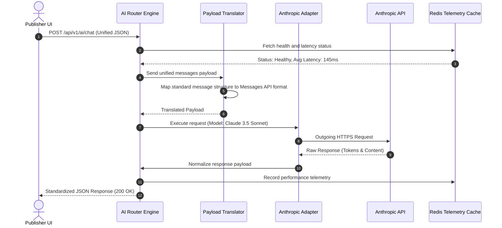

# AI Orchestration Architecture

## Purpose
This document details the software architecture, payload structures, and routing components of the multi-provider AI Orchestration layer for NewsOps Cloud. Its purpose is to define how the system abstracts calls to OpenAI, Google Gemini, Anthropic, NVIDIA NIM, and self-hosted model engines (vLLM, Ollama), facilitating seamless failover, unified message formatting, and strict telemetry logging.

## Executive Summary
The AI Orchestration layer provides a unified interface that isolates the core NewsOps publishing application from the differences in various LLM vendor APIs. The architecture uses the Adapter and Strategy design patterns to normalize inputs and outputs, manage streaming connections via Server-Sent Events (SSE), and handle complex multi-turn chats. The system supports on-premises deployment structures via NVIDIA NIM and vLLM, and public clouds via API integrations, providing a cost-effective, high-throughput gateway.

## Vision
To establish a decoupled cognitive routing layer where models are treated as dynamic, swappable utilities. The application writes against a single semantic contract, and the router decides at runtime which model is best suited, most cost-effective, and currently available to perform the work.

## Scope
This document covers:
1. Unified message payloads and translation middleware.
2. Provider-specific adapter specifications (OpenAI, Gemini, Anthropic, NVIDIA NIM, and local vLLM).
3. Streaming response routing and chunk normalization.
4. Failover logic and dynamic load-balancing routing topologies.

It excludes the logic of cost-latency computation (defined in `cost_latency_routing.md`) and the encryption methods for keys (defined in `byo_ai_model.md`).

## Goals
- **Zero API Coupling**: No application code outside the orchestrator should reference vendor-specific SDKs.
- **Sub-Second Failover**: Switch to backup providers within 350ms of detecting target model degradation.
- **High Concurrency**: Support up to 5,000 concurrent streaming operations with less than 1% packet loss.
- **Local Sovereignty**: Provide a zero-egress routing option that forces confidential publishing tasks to run only on self-hosted vLLM servers.

## Functional Requirements
- **Unified Chat completions API**: Accept a standard chat-payload format containing an array of system/user messages.
- **Format Normalization Middleware**: Dynamically map the standard payload into OpenAI's JSON format, Anthropic's Messages format, Gemini's Content format, or raw text prompts for legacy models.
- **Server-Sent Events (SSE) Wrapper**: Receive diverse chunk structures from external streams and wrap them into a single, standardized JSON SSE format.

## Non-Functional Requirements
- **Routing Overhead**: The orchestration proxy must process routing calculations in under 8ms.
- **Memory Footprint**: Streaming proxies must maintain a maximum memory allocation of 24KB per connection stream.
- **Data Locality Compliance**: Honor tenant geographic rules by routing to endpoints located in specific regions (e.g., EU-only endpoints).

## Business Rules
- **GDPR Egress Rules**: Articles marked as "Sensitive Draft" or "Geographically Isolated" must never be routed to public, non-EU endpoints.
- **Token Tracking**: Every response (streaming or block) must return actual token usage metrics, either parsed from the response metadata or estimated via local tokenizers (e.g., Tiktoken).
- **Mandatory Traceability**: Every request routed through the system must carry an `X-NewsOps-Trace-ID` header.

## Actors
- **Content Writer**: Generates summaries, outlines, or headlines in the UI.
- **Platform Developer**: Integrates new model versions or writes new adapter plugins.
- **DevOps / SRE Engineer**: Monitors the scaling of local vLLM instances and configures network paths.
- **Compliance Officer**: Restricts specific models from processing confidential content.

## User Stories
- **User Story 1**: As a Content Writer, I want my drafting assistant to generate text seamlessly, even if OpenAI is down, by routing behind the scenes to Anthropic or local models without interruption.
- **User Story 2**: As a Platform Developer, I want to use a unified schema to call LLMs so that I do not need to change our application code when Google releases a new version of the Gemini API.
- **User Story 3**: As a Compliance Officer, I want to configure the router to force all sensitive corporate newsletters to bypass public cloud APIs and use local NVIDIA NIM instances exclusively.

## Acceptance Criteria
- The routing gateway must handle calls to OpenAI, Anthropic, Gemini, NVIDIA NIM, and vLLM through a single API endpoint `/api/v1/ai/chat`.
- The API must accept a standardized JSON format containing a list of role-based messages (`system`, `user`, `assistant`).
- When the `stream: true` flag is set, the gateway must stream tokens to the client using standard Server-Sent Events, wrapping provider-specific tokens into a uniform NewsOps data chunk structure.
- Dynamic failover must occur automatically when an upstream provider returns a 5xx error or connection timeout (configurable threshold, default 3 seconds).

## Workflows
### Chat Execution and Adapter Routing Workflow
1. **Client Request**: The CMS editor sends a unified JSON chat request to `/api/v1/ai/chat`.
2. **Route Resolution**: The Router determines the target model, checks if the tenant has custom keys registered, and selects the matching adapter.
3. **Payload Translation**: The Adapter translates the standard schema into the specific model's API format.
4. **API Invocation**: The Adapter sends the request to the upstream endpoint (e.g., OpenAI API or local vLLM).
5. **Response Translation**: The Adapter captures the response, maps token usages, and returns a unified JSON output to the client.

### Streaming SSE Proxy Workflow
1. **Stream Initiation**: The client sends a request to `/api/v1/ai/chat` with `stream: true`.
2. **Stream Connection**: The router opens a persistent SSE connection to the client and initiates a streaming request to the provider.
3. **Chunk Mapping**: As chunks arrive from the provider, the router intercepts them, parses the content, and formats them to the standard NewsOps chunk format.
4. **Transmission**: The standardized chunk is immediately sent to the client.
5. **Stream Close**: The router sends a final metadata block containing token usage statistics and closes the connection.

## API Design
### Unified Chat Completion Endpoint
Provides standard block or streaming response generation.

* **URL**: `/api/v1/ai/chat`
* **Method**: `POST`
* **Headers**:
  * `Content-Type: application/json`
  * `Authorization: Bearer <JWT>`
  * `X-Tenant-ID: tenant-uuid-555`
* **Request Payload**:
```json
{
  "provider": "anthropic",
  "model": "claude-3-5-sonnet",
  "messages": [
    {
      "role": "system",
      "content": "You are a professional copyeditor."
    },
    {
      "role": "user",
      "content": "Improve this headline: 'Local team wins game'"
    }
  ],
  "temperature": 0.5,
  "max_tokens": 100,
  "stream": false
}
```
* **Response Payload (200 OK - Non-streaming)**:
```json
{
  "id": "chat-msg-abc123xyz",
  "provider": "anthropic",
  "model": "claude-3-5-sonnet",
  "choices": [
    {
      "message": {
        "role": "assistant",
        "content": "Victory at Home: Local Team Clinches Historic Win"
      },
      "finish_reason": "stop"
    }
  ],
  "usage": {
    "prompt_tokens": 28,
    "completion_tokens": 12,
    "total_tokens": 40
  },
  "latencyMs": 420
}
```
* **Response Stream (200 OK - Streaming - `text/event-stream`)**:
```
data: {"id":"chat-msg-abc123xyz","choice":{"delta":{"content":"Victory"}}}

data: {"id":"chat-msg-abc123xyz","choice":{"delta":{"content":" at Home"}}}

data: {"id":"chat-msg-abc123xyz","choice":{"delta":{"content":":"}}}

data: {"id":"chat-msg-abc123xyz","usage":{"prompt_tokens":28,"completion_tokens":12,"total_tokens":40}}

event: done
data: [DONE]
```

## Database Design
The routing engine references system-level model records and active adapters.

### `ai_model_configs` Table (Global Schema)
* `id`: UUID (Primary Key)
* `provider_name`: VARCHAR(50) (e.g., 'anthropic', 'openai', 'nvidia-nim')
* `model_identifier`: VARCHAR(100) (e.g., 'claude-3-5-sonnet', 'gpt-4o', 'meta/llama3-70b')
* `endpoint_url`: TEXT
* `api_version`: VARCHAR(30)
* `is_local`: BOOLEAN (True for vLLM/NIM, False for external SaaS APIs)
* `max_context_window`: INTEGER
* `created_at`: TIMESTAMP WITH TIME ZONE

### `ai_provider_adapters` Table (Global Schema)
* `id`: UUID (Primary Key)
* `provider_name`: VARCHAR(50) (Unique)
* `adapter_class`: VARCHAR(100) (e.g., 'AnthropicAdapter', 'OpenAIAdapter')
* `is_enabled`: BOOLEAN (Default: true)
* `timeout_ms`: INTEGER (Default: 5000)

## UI Design
The AI settings panel in the admin console features:
- **Provider Connection Grid**: Tabular lists of active provider routes, target URLs, and checkmarks indicating if the adapter uses custom keys.
- **Model Router Mapper**: Dropdown arrays mapping workspace actions (e.g., "Auto-Headline", "Translation") to fallback priority list structures.
- **API Playground**: Split screen where operators choose a model, type a prompt, and view the raw translated payload alongside the standard response.

## Permissions
- `ai:chat:execute`: Permission to issue chat completions and call LLMs.
- `ai:models:read`: Read-only access to system model profiles and settings.
- `ai:models:write`: Modify adapter routes, update endpoints, and swap priority trees.

## Security
- **Data Scrubbing**: Middleware scan strings to prevent leakage of credentials or API paths within prompts.
- **Server-Side Request Forgery (SSRF) Protection**: The system resolves outgoing endpoint URLs against strict IP address allow-lists; private IPs are banned unless they belong to the local on-premises network.
- **Tenant Header Injection**: Ensure the `X-Tenant-ID` is verified at the gateway and injected into downstream database logs.

## Performance
- **Connection Reuse**: Keep HTTP connections open to vendor APIs via pool configurations (`keepAlive: true`, `maxSockets: 100`).
- **SSE Chunk Buffer Minimization**: The router disables compression or buffers for `text/event-stream` context to ensure immediate transmission.
- **Target Overhead**: Built to sustain 1,000 transactions per second (TPS) on the router orchestration layer.

## Monitoring
- **Prometheus Metric**: `ai_adapter_execution_duration_seconds` (Histogram measuring processing time inside the adapter code).
- **Prometheus Metric**: `ai_active_streams` (Gauge tracking open Server-Sent Events streams).
- **Alert Trigger**: Trigger Slack warning if `ai_active_streams > 3500` or if latency overhead in adapters exceeds 20ms.

## Logging
* **Log Pattern**: `{"timestamp": "%ISO8601%", "level": "INFO", "context": "AIAdapter", "message": "Invoking upstream provider", "metadata": {"traceId": "t-1234", "provider": "anthropic", "endpoint": "https://api.anthropic.com/v1/messages", "timeoutMs": 5000}}`
* **Error Level**: `ERROR` for connection failures or parsing mismatch.

## Error Handling
| Upstream Error Code | NewsOps Status Code | HTTP Status | Customer-Facing Message |
|:---|:---|:---|:---|
| `401 Unauthorized` | `ERR_AI_INVALID_KEY` | 400 Bad Request | Configuration error: Invalid API key registered for this provider. |
| `429 Rate Limit` | `ERR_AI_RATE_LIMIT` | 429 Too Many Requests | The provider is rate limiting requests. Swapping to fallback... |
| `503 Unavailable` | `ERR_AI_PROVIDER_DOWN` | 502 Bad Gateway | Upstream model is down. Swapping to fallback... |

## Edge Cases
- **Upstream Stream Stalls**: If the stream connection hangs without returning data for >5 seconds, the router aborts the connection, sends an SSE error frame, and connects the user's secondary channel to the fallback model.
- **Token Discrepancies**: If a local tokenizer calculates 10% more tokens than the provider bills, the system logs the discrepancy but records the provider's official billed tokens for credit accounting.

## Future Improvements
- **Semantic Routing Cache**: Implement Redis Vector Search to detect duplicate requests and return previously generated text instantly, saving API token fees.
- **Automatic Context Shrinkage**: Implement a middleware that truncates the oldest chat history items automatically if the total messages array approaches the model's context limit.

## Mermaid Diagrams
### Flow Sequence of Multi-Provider Routing


## References
- Database schema directory: [../03-database/index.md](../03-database/index.md)
- Core System Architecture: [../02-architecture/system_architecture.md](../02-architecture/system_architecture.md)
- Dynamic Routing Config: [cost_latency_routing.md](./cost_latency_routing.md)
- BYO Model Storage Rules: [byo_ai_model.md](./byo_ai_model.md)
