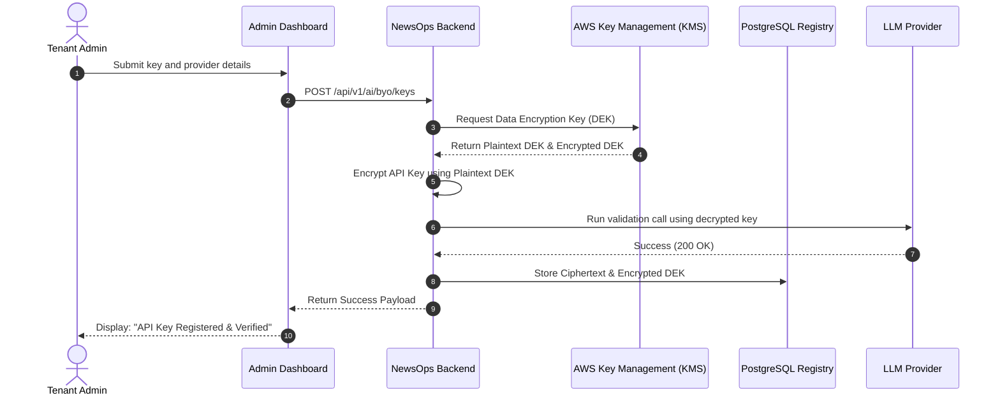

# Bring-Your-Own AI Model (BYO-AI)

## Purpose
This document details the architectural design, security profiles, billing integrations, and database schemas for the Bring-Your-Own AI (BYO-AI) capability within NewsOps Cloud. Its purpose is to guide developers in implementing custom API key registration, key vault storage, token usage ledgers, and self-hosted model integrations.

## Executive Summary
To support enterprise publishing clients, NewsOps Cloud provides a Bring-Your-Own-AI (BYO-AI) framework. This feature allows tenants to register their own API keys for services like OpenAI, Anthropic, Google Gemini, or custom self-hosted inference servers (e.g., local vLLM instances). By providing custom keys, tenants bypass platform-wide token billing and run requests under their own vendor agreements, paying NewsOps a flat orchestration and platform service fee. All keys are encrypted at the envelope level using AWS KMS and stored in HashiCorp Vault or AWS Secrets Manager. Usage is logged to a write-optimized database ledger to ensure accurate billing and reporting.

## Vision
To establish an open, flexible AI integration layer where enterprise clients maintain full control over their models, API agreements, data sovereignty, and security policies, without sacrificing the benefits of the NewsOps editing workspace.

## Scope
This document covers:
1. Secure customer key registration and verification pipelines.
2. Envelope encryption schemes and key storage structures.
3. Custom endpoint configuration rules (for self-hosted vLLM and NVIDIA NIM servers).
4. The token usage ledger database design.
5. Platform credits billing mapping structures.

It excludes the pricing calculator logic (defined in `cost_latency_routing.md`) and the standard prompt engineering templates (defined in `prompt_engineering_standards.md`).

## Goals
- **Secure Secret Management**: Deliver zero-leak security of customer API keys using industry-standard KMS-backed envelope encryption.
- **Direct Contracting Billing**: Allow tenants to use their own model contract pricing, shifting API costs off the platform balance sheet.
- **Support Private Deployments**: Enable routing to on-premises or private cloud LLM instances via secure, custom endpoints.
- **Orchestration Audit**: Provide real-time logging of token usages for platform fee calculations.

## Functional Requirements
- **Key Registration Interface**: Expose endpoints to add, test, rotate, and delete tenant-specific provider keys.
- **Key Verification Engine**: Test keys immediately upon registration by executing a lightweight, zero-token chat request to the provider.
- **Dynamic Endpoint Routing**: Allow overriding the default API endpoints with custom URLs (e.g., private endpoints like `https://llm.tenant.com/v1`).
- **Token Usage Ledger**: Record token usage records for all API requests executed via BYO keys.

## Non-Functional Requirements
- **Decryption Overhead**: Resolving and decrypting keys at request runtime must add less than 12ms of latency.
- **Key Storage Isolation**: Store credentials using tenant-specific KMS key rings to prevent cross-tenant key access.
- **Ledger Performance**: The usage ledger must sustain up to 1,500 token logging transactions per second (TPS).

## Business Rules
- **Envelope Encryption**: Raw keys must never be saved to the database. They must be encrypted immediately at the application edge.
- **Flat Service Fees**: Requests executed using BYO keys are charged a flat platform orchestration fee (e.g., $0.0001 per call or flat monthly subscriptions).
- **SSL Enforcement**: All custom endpoints must support TLS 1.3, with invalid or self-signed SSL certificates rejected by default.

## Actors
- **Tenant Administrator**: Registers, tests, and rotates corporate API keys and endpoints.
- **AI Router Proxy**: Decrypts keys at runtime and signs requests to the target provider.
- **Billing Manager**: Aggregates token usage data from the ledger and creates monthly invoices.

## User Stories
- **User Story 1**: As a Tenant Administrator, I want to register our corporate Anthropic API key in the NewsOps panel so that our staff can generate content without depleting our platform-provided credits.
- **User Story 2**: As a Tenant Administrator, I want to route all translation traffic to our secure, private vLLM server on AWS VPC so that our articles remain completely inside our corporate network.
- **User Story 3**: As a Billing Manager, I want to access the token usage ledger for BYO calls so that I can bill our tenants for the monthly orchestration overhead they generate.

## Acceptance Criteria
- Keys must be encrypted using AES-256-GCM envelope encryption with AWS KMS before saving to the database.
- The API key verification endpoint must perform a test connection to the provider and return a success/fail response.
- Ledgers must record: `tenant_id`, `provider`, `model`, `prompt_tokens`, `completion_tokens`, and `billing_type` ('BYO_KEY' vs 'PLATFORM').
- Custom endpoints must pass connection tests before they are set to active.

## Workflows
### Key Registration and Verification Workflow
1. **Key Input**: Tenant Administrator inputs an API key (e.g., OpenAI API Key) and selects the provider in the settings UI.
2. **KMS Request**: The application backend sends the key to the encryption engine.
3. **Envelope Encryption**: The engine requests a data encryption key (DEK) from AWS KMS, encrypts the API key using AES-256-GCM, and packages it.
4. **Validation Call**: The engine uses the key to run a simple completion test (e.g., `ping` prompt) against OpenAI.
5. **Storage**: On verification success, the encrypted payload is stored in the database, and the user receives a success notification.

### Request Routing with BYO Keys Workflow
1. **Client Call**: A user triggers an AI rewrite task.
2. **Key Retrieval**: The AI Router checks if the tenant has registered a custom key for the selected provider.
3. **Decryption**: If a custom key exists, the router retrieves the encrypted payload, requests KMS to decrypt the DEK, and decrypts the provider key in memory.
4. **Execution**: The router sends the request to the provider (using the custom key and custom endpoint, if configured).
5. **Ledger Update**: After receiving the response, the router writes a token consumption record to the ledger, flagging it as `BYO_KEY`.

## API Design
### BYO Key Management API
Provides endpoints to register, view, and delete custom keys.

* **URL**: `/api/v1/ai/byo/keys`
* **Method**: `POST`
* **Headers**:
  * `Content-Type: application/json`
  * `Authorization: Bearer <JWT>`
  * `X-Tenant-ID: tenant-uuid-555`
* **Request Payload**:
```json
{
  "provider": "openai",
  "api_key": "sk-proj-1234567890abcdefghijklmnopqrstuvwxyz",
  "custom_endpoint": "https://api.openai.com/v1"
}
```
* **Response Payload (201 Created)**:
```json
{
  "id": "byo-key-uuid-111",
  "tenant_id": "tenant-uuid-555",
  "provider": "openai",
  "custom_endpoint": "https://api.openai.com/v1",
  "status": "active",
  "verified_at": "2026-06-27T22:20:19Z"
}
```

* **URL**: `/api/v1/ai/byo/keys`
* **Method**: `GET`
* **Response Payload (200 OK)**:
```json
[
  {
    "id": "byo-key-uuid-111",
    "provider": "openai",
    "custom_endpoint": "https://api.openai.com/v1",
    "status": "active",
    "last_used_at": "2026-06-27T22:15:00Z"
  }
]
```

## Database Design
The BYO-AI schema consists of configuration tables and a billing ledger.

### `ai_tenant_keys` Table (Global Schema)
* `id`: UUID (Primary Key)
* `tenant_id`: UUID (Index)
* `provider`: VARCHAR(50) (Index, e.g., 'openai', 'anthropic')
* `encrypted_key_payload`: TEXT (AES-256-GCM cipher string containing the encrypted key)
* `key_arn`: TEXT (KMS Key Identifier used for decryption)
* `custom_endpoint`: TEXT (Null if default public API is used)
* `status`: VARCHAR(20) (e.g., 'active', 'inactive', 'revoked')
* `created_at`: TIMESTAMP WITH TIME ZONE
* `updated_at`: TIMESTAMP WITH TIME ZONE
* **Indexes**: Unique index on (`tenant_id`, `provider`) to prevent duplicate keys for a single provider.

### `ai_token_usage_ledger` Table (Global Schema - Partitioned)
* `id`: BIGSERIAL (Primary Key)
* `tenant_id`: UUID (Index)
* `provider`: VARCHAR(50)
* `model`: VARCHAR(100)
* `prompt_tokens`: INTEGER
* `completion_tokens`: INTEGER
* `billing_type`: VARCHAR(20) (e.g., 'PLATFORM_CREDITS', 'BYO_KEY')
* `orchestration_fee_usd`: NUMERIC(10,6) (Calculated platform fee)
* `timestamp`: TIMESTAMP WITH TIME ZONE (Partition Key, Index)
* **Partitioning**: Partitioned monthly by `timestamp`.

## UI Design
The Key Management UI panel includes:
- **Provider Cards**: Actionable cards representing OpenAI, Anthropic, Gemini, and Custom options. Each card features state indicators ("Connected", "Not Configured", "Failed").
- **Endpoint Settings Panel**: Text fields to enter custom API base URLs alongside advanced timeout configuration inputs.
- **Consumption Grid**: Data tables displaying daily API requests, token volume, and calculated platform fees.

## Permissions
- `ai:byo:read`: View registered key profiles (masked formats) and status values.
- `ai:byo:write`: Create, test, and update keys and custom endpoints.
- `ai:byo:delete`: Revoke keys and wipe credentials from secrets storage.
- `ai:ledger:read`: Read token utilization ledger records and billing statements.

## Security
- **Envelope Encryption Pattern**: When encrypting, the app generates a local Data Encryption Key (DEK) via KMS, encrypts the data, stores the ciphertext alongside the encrypted DEK, and discards the plaintext DEK.
- **Secrets Isolation**: Keys are stored in AWS Secrets Manager using tenant-scoped folders with access limited via IAM policies.
- **Log Scrubbing**: Loggers intercept variables, ensuring that no request strings matching `sk-` or containing headers with credentials are printed.

## Performance
- **Ephemeral Cache**: Decrypted keys are cached in-memory using an encrypted Redis cache with a 5-minute TTL to avoid hitting KMS on every API request.
- **Asynchronous Ledger Writes**: Token consumption logs are written asynchronously using Kafka or RabbitMQ pipelines, isolating the billing registry from model execution latencies.
- **Target Overhead**: Key decryption resolves under 12ms.

## Monitoring
- **Prometheus Metric**: `byo_key_decrypt_duration_seconds` (Histogram measuring key lookup and decryption speed).
- **Prometheus Metric**: `byo_key_failures_total` (Counter tracking decryption or connection check failures).
- **Alert Trigger**: Trigger Slack warning if `byo_key_failures_total > 5` in 1 minute, indicating expired customer credentials or KMS issues.

## Logging
* **Log Pattern**: `{"timestamp": "%ISO8601%", "level": "INFO", "context": "BYOKeyManager", "message": "API key successfully rotated", "metadata": {"tenantId": "t-55", "provider": "openai", "keyId": "byo-key-111"}}`
* **Error Level**: `ERROR` for KMS decryption failures; `WARN` for upstream provider credential rejections.

## Error Handling
| Internal Error Code | HTTP Status | Customer-Facing Message |
|:---|:---|:---|
| `ERR_BYO_DECRYPTION_FAILED` | 500 Internal Server Error | Failed to decrypt credentials. Please contact support. |
| `ERR_BYO_INVALID_KEY` | 400 Bad Request | Upstream verification failed: The API key provided is invalid. |
| `ERR_BYO_ENDPOINT_UNREACHABLE` | 502 Bad Gateway | Connection failed: Custom endpoint did not respond to the health check. |

## Edge Cases
- **Key Expiration Mid-Execution**: If a tenant's key expires during an active generation, the router captures the 401 error, falls back to the default platform billing engine temporarily, and flags the tenant's key as degraded.
- **KMS Service Outage**: If AWS KMS is temporarily offline, the router reads cached credentials. If the cache is expired, requests fail with `ERR_BYO_DECRYPTION_FAILED` to prevent unencrypted key transmissions.

## Future Improvements
- **Third-Party Vault Integrations**: Support direct, runtime credential loading from customer-managed Vault instances (e.g., tenant's HashiCorp Vault), keeping key ownership completely off NewsOps servers.
- **Automated Key Expiration Warners**: Expose automatic alerts notifying administrators when keys approach their configured expiration windows.

## Mermaid Diagrams
### Key Registration and Request Routing Pipeline


## References
- Database Design Standards: [../03-database/index.md](../03-database/index.md)
- Multi-Provider Adapter Layouts: [ai_orchestration_architecture.md](./ai_orchestration_architecture.md)
- Prompt Engineering Standards: [prompt_engineering_standards.md](./prompt_engineering_standards.md)
- Cost Latency Optimization: [cost_latency_routing.md](./cost_latency_routing.md)
