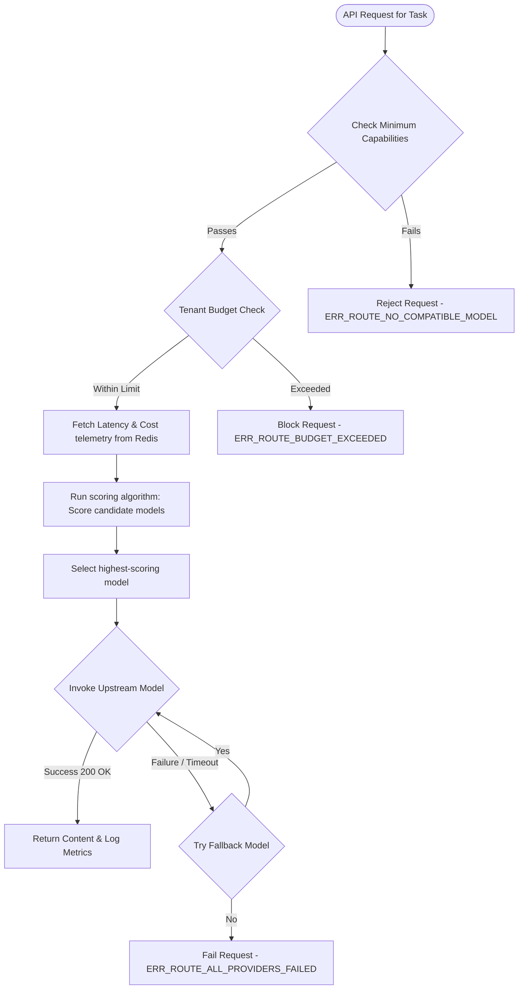

# Cost-Latency Routing

## Purpose
This document details the cost-latency routing algorithm, real-time performance telemetry tracking, model capabilities matrices, and fallback execution systems for NewsOps Cloud. Its purpose is to guide developers, DevOps engineers, and architects in implementing a self-optimizing LLM routing gateway that minimizes platform operational costs while enforcing tenant latency requirements.

## Executive Summary
To minimize platform expenses and maintain a highly responsive user experience, the NewsOps AI Orchestrator uses a dynamic routing algorithm. For every incoming prompt, the system scores all candidate models across three dimensions: capabilities required for the task, dynamic cost profiles, and recent response latencies (measured using an Exponential Moving Average in Redis). The router selects the highest-scoring model, executes the query, and triggers automatic fallbacks to alternative models if the primary model fails or times out.

```
Score = (w_capability * S_capability) - (w_cost * S_cost) - (w_latency * S_latency)
```

## Vision
To build a self-healing and cost-optimizing cognitive routing engine. The system automatically shifts traffic to the most efficient and responsive models, adapting to upstream model price changes, API degradation, and localized outages in real-time.

## Scope
This document covers:
1. The mathematical routing scoring formula and parameter weights.
2. Model capabilities definitions and task mapping.
3. Exponential Moving Average (EMA) latency tracking via telemetry caches.
4. Fallback loops, circuit-breaker configurations, and retry rules.

It excludes raw token counting rules (defined in `prompt_engineering_standards.md`) and HSM credential security configurations (defined in `byo_ai_model.md`).

## Goals
- **Cost Savings**: Achieve an average reduction in model pricing of 40% compared to static routing patterns.
- **Latency Containment**: Ensure 95% of interactive editorial tasks return first-byte streaming chunks in under 600ms.
- **Timeout Mitigation**: Reduce overall system API timeouts to less than 0.05% of total calls.
- **Enforced Budgets**: Guarantee that no tenant exceeds their daily or monthly credit limits.

## Functional Requirements
- **Dynamic Task Classification**: Map workspace tasks (e.g., SEO, drafting, proofreading, translation) to minimum required model capability thresholds.
- **EMA Latency Tracking**: Record response roundtrip times dynamically and update model latencies in a Redis-backed telemetry matrix.
- **Automated Fallback Chaining**: Execute secondary and tertiary models in the routing chain if the primary model returns errors or times out.

## Non-Functional Requirements
- **Routing Overhead**: The routing evaluation mathematical function must execute in under 3ms.
- **Telemetry Read Latency**: Redis telemetry lookups must resolve in under 1ms.
- **Target TPS**: The routing calculator must scale to handle 10,000 transactions per second (TPS).

## Business Rules
- **Capability Compliance**: Cheaper models can only be selected if their capability rating meets or exceeds the task's required threshold.
- **Budget Thresholds**: If a tenant has consumed 100% of their daily budget, the router must block all outgoing requests unless they register custom API keys.
- **Minimum Model redundancy**: Every task must have at least one fallback model configured.

## Actors
- **Content Writer**: Generates articles, expecting rapid responses.
- **Tenant Administrator**: Configures routing priorities (e.g., "Fastest Response" vs. "Lowest Cost") and monitors billing credits.
- **AI Routing Engine**: Performs real-time scoring and coordinates failovers.
- **Telemetry Monitor**: Background service that updates latency tables.

## User Stories
- **User Story 1**: As a Tenant Administrator, I want to route all background translation jobs to the lowest-cost model that is capable of language processing, so that I can conserve our API budget.
- **User Story 2**: As a Content Writer, I want my interactive rewrite tool to use the fastest responsive model during peak hours, so that I do not experience delays while writing.
- **User Story 3**: As the AI Routing Engine, I want to detect if OpenAI's API latency increases to over 4 seconds and instantly reroute traffic to Google Gemini, so that the editorial workspace remains operational.

## Acceptance Criteria
- The scoring algorithm must combine capability score, cost score, and latency score into a final ranking score using tenant-configurable weights.
- Fallback chains must list at least 2 alternate models.
- Real-time latency tracking must use an Exponential Moving Average (EMA) with a smoothing factor ($\alpha = 0.2$).
- The system must block requests immediately if a tenant's token budget is exceeded, returning a `402 Payment Required` status code.

## Workflows
### Model Scoring and Route Selection Workflow
1. **Request Intake**: Client issues a request with a task identifier (e.g., `article_summarize`) and routing priority policy.
2. **Capability Filtering**: The router queries the registry to find models that meet the minimum capability rating for `article_summarize` (e.g., score $\ge 6.0$).
3. **Telemetry Fetching**: The router pulls current EMA latency and cost-per-million-token metrics for the candidate models from Redis.
4. **Scoring Calculation**: The router computes the final routing score for each model based on the active routing policy.
5. **Execution**: The model with the highest score is selected and invoked.

### Upstream Timeout and Fallback Workflow
1. **Primary Timeout**: The router invokes the primary selected model (e.g., `gpt-4o`) with a task-specific timeout (e.g., 2.5 seconds).
2. **Breaker Trigger**: The upstream model fails to respond within the timeout, or returns a 503 error.
3. **Telemetry Update**: The router logs the failure, updates the model's latency profile to maximum penalty in Redis, and increments the provider's error counter.
4. **Fallback Invocation**: The router selects the second-ranked model in the candidate list (e.g., `claude-3-5-sonnet`) and forwards the payload.
5. **Success Delivery**: The fallback model responds successfully within 1.2 seconds, and the content is delivered to the client.

## API Design
### Route Evaluation API
Allows developers and administrators to simulate model choices and review active routing scores for a task.

* **URL**: `/api/v1/ai/routes/evaluate`
* **Method**: `POST`
* **Headers**:
  * `Authorization: Bearer <JWT>`
  * `X-Tenant-ID: tenant-uuid-555`
* **Request Payload**:
```json
{
  "task": "article_translation",
  "routing_policy": "balanced",
  "input_char_count": 4500
}
```
* **Response Payload (200 OK)**:
```json
{
  "selected_route": {
    "provider": "anthropic",
    "model": "claude-3-5-sonnet",
    "final_score": 8.42
  },
  "candidate_scores": [
    {
      "provider": "anthropic",
      "model": "claude-3-5-sonnet",
      "capability_score": 9.0,
      "estimated_latency_ms": 780,
      "estimated_cost_usd": 0.0135,
      "final_score": 8.42
    },
    {
      "provider": "openai",
      "model": "gpt-4o",
      "capability_score": 9.2,
      "estimated_latency_ms": 1150,
      "estimated_cost_usd": 0.0135,
      "final_score": 7.95
    },
    {
      "provider": "local-vllm",
      "model": "meta/llama3-70b",
      "capability_score": 8.0,
      "estimated_latency_ms": 250,
      "estimated_cost_usd": 0.0005,
      "final_score": 7.82
    }
  ]
}
```

## Database Design
The routing tables track capabilities, pricing details, and tenant budgets.

### `ai_model_capabilities` Table (Global Schema)
* `id`: UUID (Primary Key)
* `model_identifier`: VARCHAR(100) (Unique, Index)
* `task_type`: VARCHAR(50) (e.g., 'summarize', 'translation', 'reasoning')
* `capability_score`: NUMERIC(3,1) (Rating from 0.0 to 10.0)
* `updated_at`: TIMESTAMP WITH TIME ZONE

### `ai_model_prices` Table (Global Schema)
* `id`: UUID (Primary Key)
* `model_identifier`: VARCHAR(100) (Unique, Index)
* `input_token_cost_usd_pm`: NUMERIC(10,4) (Cost per million input tokens)
* `output_token_cost_usd_pm`: NUMERIC(10,4) (Cost per million output tokens)
* `last_sync`: TIMESTAMP WITH TIME ZONE

### `ai_tenant_budgets` Table (Global Schema)
* `id`: UUID (Primary Key)
* `tenant_id`: UUID (Unique, Index)
* `daily_budget_limit`: NUMERIC(12,4)
* `daily_budget_consumed`: NUMERIC(12,4)
* `monthly_budget_limit`: NUMERIC(12,4)
* `monthly_budget_consumed`: NUMERIC(12,4)
* `updated_at`: TIMESTAMP WITH TIME ZONE

## UI Design
The Cost & Performance panel contains:
- **Routing Strategy Panel**: Selector controls enabling administrators to set weights ($w_{capability}, w_{cost}, w_{latency}$) via simple slider controls.
- **Real-Time Latency Chart**: Live area charts detailing the response latency of all providers.
- **Budget Alerts Configurator**: Text boxes to define budget limits and set webhook URLs for Slack/Discord alerts when thresholds are reached.

## Permissions
- `ai:routing:read`: View routing scores, pricing tables, and model capability matrices.
- `ai:routing:write`: Modify capability scores, change strategy weights, and adjust timeout parameters.
- `ai:budgets:write`: Modify tenant billing limits and reset daily usage logs.

## Security
- **Algorithm Protection**: Weights must be locked and require multi-factor authorization (MFA) to modify, preventing malicious actors from routing all traffic to expensive, controlled endpoints.
- **Budget Integrity**: The middleware checks budget limits against memory-locked redis variables before routing to prevent race conditions from bypassing ceilings.
- **No Private IP Fallbacks**: Ensure fallback endpoints resolve to public addresses or authorized private networks; reject loopback redirects.

## Performance
- **Exponential Moving Average Calculation**: Telemetry averages are computed on-the-fly inside Redis using Lua scripts:
  $$EMA_{new} = (\alpha \times Latency_{current}) + ((1 - \alpha) \times EMA_{previous})$$
- **Low latency math**: Float operations are calculated in local server memory, keeping latency to under 3ms.
- **Target Overhead**: Built to sustain 10,000 transactions per second (TPS).

## Monitoring
- **Prometheus Metric**: `ai_model_latency_seconds_ema` (Gauge recording current model latencies).
- **Prometheus Metric**: `ai_router_fallback_activations` (Counter tracking failover events).
- **Alert Trigger**: Trigger Slack warning if `ai_router_fallback_activations > 15` in a 5-minute period.

## Logging
* **Log Pattern**: `{"timestamp": "%ISO8601%", "level": "INFO", "context": "CostLatencyRouter", "message": "Model routing selected", "metadata": {"tenantId": "t-88", "task": "translation", "selected": "claude-3-5-sonnet", "score": 8.42, "costUsd": 0.0135}}`
* **Error Level**: `ERROR` if all target models are unreachable or fail.

## Error Handling
| Internal Error Code | HTTP Status | Customer-Facing Message |
|:---|:---|:---|
| `ERR_ROUTE_BUDGET_EXCEEDED` | 402 Payment Required | The monthly AI budget for this tenant has been reached. |
| `ERR_ROUTE_NO_COMPATIBLE_MODEL` | 400 Bad Request | No registered model possesses the capabilities required for this task. |
| `ERR_ROUTE_ALL_PROVIDERS_FAILED` | 502 Bad Gateway | All available LLM models failed to respond. Please try again. |

## Edge Cases
- **Simultaneous Rate-Limiting**: If all providers return HTTP 429 simultaneously, the router returns `ERR_ROUTE_ALL_PROVIDERS_FAILED` and prompts the user's dashboard to queue the draft for asynchronous generation.
- **Zero Token Input**: If an input contains no characters (0 tokens), the router bypasses LLMs entirely and returns an empty JSON output, avoiding unnecessary API charges.

## Future Improvements
- **Reinforcement Learning Router**: Implement contextual bandit algorithms that observe user edit patterns (e.g., if a user edits an AI-generated headline) to dynamically adjust model capability scores.
- **Cold-Start Detection**: Automatically bypass local models (vLLM) if they have had 0 traffic for 1 hour, avoiding the first-query latency penalty.

## Mermaid Diagrams
### Dynamic Routing Engine Decision Workflow


## References
- Database Design Indexes: [../03-database/index.md](../03-database/index.md)
- Multi-Provider Adapter Layouts: [ai_orchestration_architecture.md](./ai_orchestration_architecture.md)
- Prompt Engineering Standards: [prompt_engineering_standards.md](./prompt_engineering_standards.md)
- Bring Your Own AI Key Registry: [byo_ai_model.md](./byo_ai_model.md)
