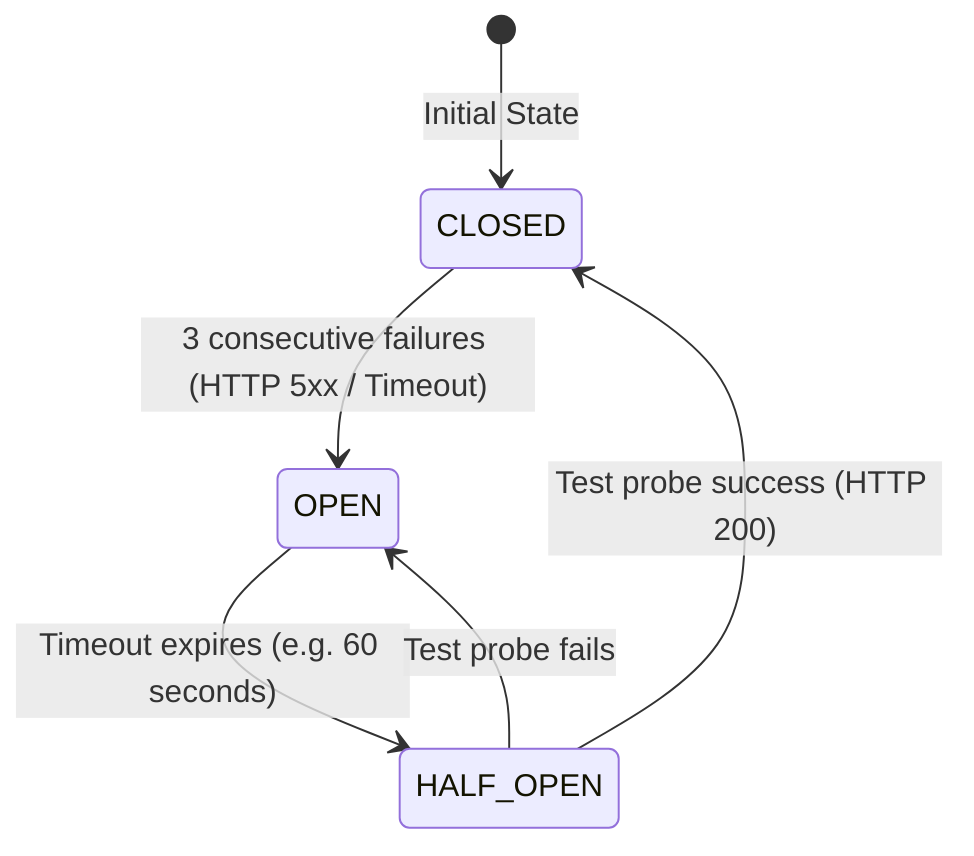
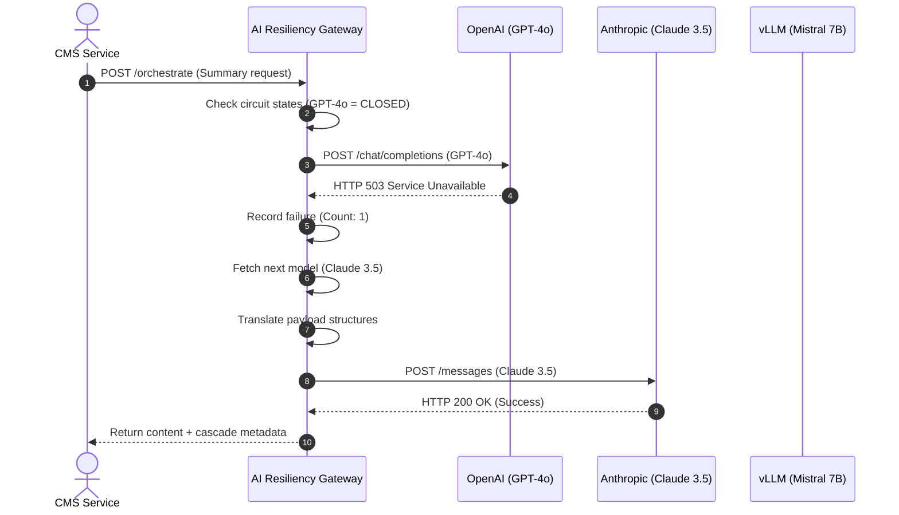

# AI Fallback Policies and Resiliency
## Purpose
This document specifies the technical design, configuration details, and execution logic of the AI Orchestration Fallback and Resiliency Gateway in the NewsOps Cloud digital publishing platform. It details circuit breakers, provider failovers, exponential retries, rate limit header parsing, and local model fallback executions to guarantee high system availability.

## Executive Summary
Generative AI tasks in NewsOps Cloud must be highly resilient to upstream API outages, rate limits, and latency spikes. The AI Gateway orchestrates LLM traffic, using a failover cascade chain (e.g., GPT-4o -> Claude 3.5 Sonnet -> Gemini 1.5 Pro -> Local Mistral). It implements a stateful Circuit Breaker pattern to avoid wasting resources on failing backends. Built-in rate limit recovery inspects return headers dynamically and routes requests into delayed retry queues or alternative models.

## Vision
The vision is to establish a zero-downtime AI inference gateway. By treating third-party models as transient commodities, the system routes editorial tasks dynamically based on live provider health statistics, costs, and availability, keeping editorial workflows active during global API failures.

## Scope
The scope of this resiliency model covers:
1. **Dynamic Cascade Router**: Logic for moving requests down a prioritized model list based on failures.
2. **Stateful Circuit Breakers**: Monitoring of upstream HTTP codes (5xx, 429) to trip routes into `OPEN`, `CLOSED`, or `HALF_OPEN` states.
3. **Rate Limit Recovery**: Real-time parsing of headers (`X-RateLimit-*`) and scheduling delayed retries.
4. **Local Model execution**: Local failover server management via vLLM or similar platforms (Mistral-7B / Llama-3-8B).
5. **Administration Control**: APIs and dashboards to configure policies and monitor breaker health.

## Goals
- **System Uptime**: 99.99% availability of core AI text generation and processing.
- **Failover Transition Time**: Gateway cascade shift triggered and executed in under 20 milliseconds.
- **Quota Protection**: Optimize routing to prevent exceeding daily token/cost boundaries.
- **System Transparency**: Maintain a complete audit trail of active circuit states and API route decisions.

## Functional Requirements
1. **Circuit Breaker Monitoring**: Periodically track upstream call success rates. If errors exceed the configured threshold, immediately trip the circuit.
2. **Cascade Failover Router**: Automatically dispatch prompts to the next active provider in the chain if the primary provider fails.
3. **Header-Based Rate Limit Tracker**: Parse rate-limiting headers returned by OpenAI, Anthropic, and Google, and adjust throttling rates in Redis.
4. **Local Model Fallback Activator**: Maintain connection to local inference nodes (running Mistral/Llama via vLLM) as the ultimate failover node.
5. **Configuration APIs**: Allow administrators to live-edit model chains, cost parameters, and retry rules without restarting services.

## Non-Functional Requirements
- **Gateway Overhead**: Gateway routing evaluation must execute in <= 10ms.
- **Failover Compatibility**: Prompts must be dynamically translated or wrapped in provider-specific schemas (e.g., converting OpenAI Chat Completion schema to Anthropic Messages schema) during failover.
- **Isolation**: Outages on one tenant's keys must not trip the circuit breaker for other tenants sharing the system infrastructure.

## Business Rules
1. **Tier-Based Fallbacks**:
   - **Enterprise Tenants**: Route GPT-4o -> Claude 3.5 Sonnet -> Gemini 1.5 Pro. Use highest performance models.
   - **Standard Tenants**: Route GPT-4o-mini -> Claude 3.5 Haiku -> Gemini 1.5 Flash -> Local Mistral.
2. **Budget Limits**: If an organization's monthly AI spending cap is reached, automatically downgrade all requests to the local model fallback to avoid additional cost generation.
3. **Trip Threshold**: Trip circuit to `OPEN` after 3 consecutive failures (HTTP 5xx, 429, or Timeouts) within a rolling 60-second window.

## Actors
1. **System Administrator**: Configures fallback routes, updates API keys, and sets circuit parameters.
2. **Gateway Orchestrator Router**: Evaluates incoming request tiers, tracks circuit states, and handles failovers.
3. **Local Inference Worker**: Hosts local LLM infrastructure and handles ultimate fallback traffic.
4. **Client Services (CMS/NewsIntelligence)**: Consumes AI services via the gateway without needing to handle upstream errors.

## User Stories (At least 3 specific stories)
1. **Upstream API Outage**: As an Editor publishing breaking news, I want the AI summary assistant to fall back to Anthropic Claude automatically if OpenAI is experiencing a global outage, so that my publishing schedule is not delayed.
2. **Rate Limit Protection**: As a Journalist running bulk translations, I want the system to parse rate limits and route overflow traffic to Google Gemini, so that my processing pipeline does not throw 429 errors.
3. **Cost-Cap Enforcement**: As a Newsroom Manager, I want the AI gateway to fallback to local Mistral models when my monthly API budget is 95% consumed, so that my operational costs remain within limits.

## Acceptance Criteria (At least 3-5 criteria with clear thresholds)
1. **Circuit Breaker Tripping**: The orchestrator gateway must trip a model's route to `OPEN` when 3 consecutive 5xx errors or timeouts occur, rejecting immediately subsequent requests for that model without executing HTTP network calls.
2. **Dynamic Schema Translation**: During a failover from OpenAI to Anthropic, the gateway must translate the payload structure (e.g., transforming `response_format: { type: "json_object" }` to system instructions) with 100% compliance.
3. **Backoff Execution**: Failed requests must retry using exponential backoff with jitter: $T_{backoff} = 2^{attempt} \times 100ms \pm Jitter$, maxing out at 5 retries.
4. **Local Node Fallback**: When all public APIs in the cascade fail, the request must successfully resolve through the local vLLM endpoint, returning the generation within 15 seconds.

## Workflows (Step-by-step description of system and user interactions)
### Failover Cascade Routing Workflow
1. **Client Request**: CMS sends prompt payload to Gateway.
2. **Tenant Policy Check**: Gateway checks tenant tier and active cascade chain.
3. **Model Selection**: Gateway identifies the primary model.
4. **Circuit Check**: Gateway verifies the primary model's circuit state is `CLOSED`.
5. **API Dispatch**: Gateway calls primary API (e.g. OpenAI GPT-4o).
6. **Error Detection**:
   - If call succeeds: Gateway returns response, resets failure counts.
   - If call fails (Timeout / 503 / 429): Gateway increments failure count.
7. **Cascade Trigger**: Gateway checks failure threshold. If tripped, marks circuit `OPEN`.
8. **Next Route**: Gateway fetches next model in cascade chain (e.g. Claude 3.5 Sonnet).
9. **Translation**: Gateway adapts prompt schema to the new provider requirements.
10. **Fallback Execution**: Gateway calls secondary API. Returns response on success.

## API Design (Provide actual REST endpoints, method, request/response JSON payloads, or GraphQL schemas)
### Orchestrated Inference Dispatch
- **Endpoint**: `POST /api/v1/ai/orchestrate`
- **Headers**:
  - `Content-Type: application/json`
  - `Authorization: Bearer <JWT>`
- **Request Body**:
```json
{
  "task_type": "article_summarization",
  "organization_id": "org_554433",
  "messages": [
    {
      "role": "user",
      "content": "Summarize this article in 2 bullet points: [Article Text]"
    }
  ],
  "temperature": 0.3
}
```
- **Response Body (200 OK - showing metadata of actual provider used)**:
```json
{
  "generation_id": "gen_8877_xyz",
  "content": "- Breaking news of local election changes.\n- Direct voter feedback highlights shifts in demographics.",
  "routing_metadata": {
    "primary_model_attempted": "gpt-4o",
    "actual_model_served": "claude-3-5-sonnet",
    "cascade_triggered": true,
    "fallback_reason": "gpt-4o returned HTTP 503 Service Unavailable",
    "provider_latency_ms": 1280
  }
}
```

### Get Circuit Breakers Status
- **Endpoint**: `GET /api/v1/ai/router/status`
- **Headers**:
  - `Authorization: Bearer <JWT>`
- **Response Body (200 OK)**:
```json
{
  "system_time": "2026-06-27T22:20:19Z",
  "circuits": [
    {
      "provider": "openai",
      "model": "gpt-4o",
      "state": "OPEN",
      "consecutive_failures": 3,
      "last_failed_at": "2026-06-27T22:19:45Z",
      "recovery_attempt_at": "2026-06-27T22:20:45Z"
    },
    {
      "provider": "anthropic",
      "model": "claude-3-5-sonnet",
      "state": "CLOSED",
      "consecutive_failures": 0,
      "last_failed_at": null,
      "recovery_attempt_at": null
    },
    {
      "provider": "local",
      "model": "mistral-7b-vllm",
      "state": "CLOSED",
      "consecutive_failures": 0,
      "last_failed_at": null,
      "recovery_attempt_at": null
    }
  ]
}
```

### Update Routing Policy
- **Endpoint**: `POST /api/v1/ai/router/config`
- **Headers**:
  - `Content-Type: application/json`
  - `Authorization: Bearer <JWT>`
- **Request Body**:
```json
{
  "policy_id": "pol_enterprise_default",
  "organization_id": "org_554433",
  "cascade_chain": [
    "gpt-4o",
    "claude-3-5-sonnet",
    "gemini-1-5-pro",
    "local-mistral"
  ],
  "max_cost_limit_usd": 250.00,
  "circuit_trip_count": 3,
  "recovery_timeout_seconds": 60
}
```
- **Response Body (200 OK)**:
```json
{
  "policy_id": "pol_enterprise_default",
  "status": "active",
  "updated_at": "2026-06-27T22:20:30Z"
}
```

## Database Design (Identify schema tables, fields, and indexes relevant to this feature)
### PostgreSQL Resiliency Tables

```sql
-- Upstream providers list
CREATE TABLE llm_providers (
    provider_id VARCHAR(50) PRIMARY KEY,
    name VARCHAR(100) NOT NULL,
    base_url VARCHAR(255) NOT NULL,
    is_active BOOLEAN DEFAULT true NOT NULL
);

-- State parameters for circuits
CREATE TABLE llm_circuit_states (
    state_id UUID PRIMARY KEY DEFAULT uuid_generate_v4(),
    provider_id VARCHAR(50) NOT NULL REFERENCES llm_providers(provider_id),
    model_name VARCHAR(100) NOT NULL,
    current_state VARCHAR(20) DEFAULT 'CLOSED' CHECK (current_state IN ('CLOSED', 'OPEN', 'HALF_OPEN')),
    consecutive_failures INTEGER DEFAULT 0 NOT NULL,
    last_failed_at TIMESTAMP WITH TIME ZONE,
    updated_at TIMESTAMP WITH TIME ZONE DEFAULT CURRENT_TIMESTAMP NOT NULL,
    CONSTRAINT unique_provider_model UNIQUE (provider_id, model_name)
);

-- Routing configurations mapped to organization tiers
CREATE TABLE llm_routing_policies (
    policy_id UUID PRIMARY KEY DEFAULT uuid_generate_v4(),
    organization_id VARCHAR(50) NOT NULL,
    tier VARCHAR(20) NOT NULL CHECK (tier IN ('free', 'standard', 'enterprise')),
    cascade_chain TEXT[] NOT NULL, -- Array of model identifiers: ['gpt-4o', 'claude-3-5-sonnet']
    max_cost_limit NUMERIC(10,2) NOT NULL DEFAULT 100.00,
    created_at TIMESTAMP WITH TIME ZONE DEFAULT CURRENT_TIMESTAMP NOT NULL,
    updated_at TIMESTAMP WITH TIME ZONE DEFAULT CURRENT_TIMESTAMP NOT NULL
);

-- Audit logs of routing events
CREATE TABLE llm_routing_audit (
    audit_id UUID PRIMARY KEY DEFAULT uuid_generate_v4(),
    organization_id VARCHAR(50) NOT NULL,
    task_type VARCHAR(50) NOT NULL,
    model_requested VARCHAR(100) NOT NULL,
    model_used VARCHAR(100) NOT NULL,
    cascade_occurred BOOLEAN DEFAULT false NOT NULL,
    error_message TEXT,
    cost_estimated NUMERIC(8,6) DEFAULT 0.000000,
    created_at TIMESTAMP WITH TIME ZONE DEFAULT CURRENT_TIMESTAMP NOT NULL
);

-- Indexes for monitoring queries
CREATE INDEX idx_llm_circuits_state ON llm_circuit_states(current_state);
CREATE INDEX idx_llm_policies_org ON llm_routing_policies(organization_id);
CREATE INDEX idx_llm_audit_org ON llm_routing_audit(organization_id, created_at DESC);
```

## UI Design (Describe component structure, layouts, actions, and states)
### AI Gateway Status and Routing Configuration
The UI provides system administrators with detailed visibility and control over model traffic routing.

#### 1. Panel Layout
- **Upstream Health Indicators (Card Grids)**: Represents each LLM provider. Displays a visual beacon status indicator: Green (`CLOSED` / Healthy), Red (`OPEN` / Tripped), Yellow (`HALF_OPEN` / Testing). Displays current error counts and last failure timestamps.
- **Routing Rules Configurator**: An interactive table showing organization tiers and their associated model arrays. Rows can be drag-ordered to rearrange fallback priority.
- **Real-Time Traffic Stream Graph**: A multi-line graph detailing target TPS, provider latency profiles, and error occurrences over time.

#### 2. Visual States
- **Tripped Circuit Warning Box**: Flashes a prominent amber banner identifying which model is suspended, showing a countdown timer to the next `HALF_OPEN` diagnostic probe attempt.
- **Manual Override Button**: Provides administrators a mechanism to click "Force Reset" to force an `OPEN` circuit back to `CLOSED` state.

## Permissions (Specify RBAC permissions required, e.g., organizations:read, articles:write)
- `ai:router:read`: View circuit configurations, provider status, and routing audits.
- `ai:router:write`: Modify cascade configs, adjust cost limits, trigger manual overrides.
- `ai:router:admin`: Manage upstream endpoints, encrypt API credentials, register new local model instances.

## Security (Detail security considerations, e.g., input validation, CSRF, JWT validation)
- **API Credential Protection**: Store provider keys encrypted inside key managers (Vault or AWS Secrets Manager). The Gateway decodes keys in memory and never logs values.
- **Token Validation**: Strictly check JWT organizational structures to enforce organization budget checks inside the gateway.
- **Isolation of tenant credentials**: Ensure fallback routing policies utilize keys provided either by the system (with usage quotas) or organization-specific credentials.

## Performance (State latency limits, caching requirements, target TPS)
- **Gateway Overhead**: Less than 10 milliseconds logic processing time.
- **Concurrently Managed Connections**: 2,000 requests per second sustained throughput.
- **Failover Payload Translation**: < 5ms processing time per translation attempt.

## Monitoring (Detail Prometheus metrics names, alert triggers)
- **Prometheus Metrics**:
  - `newsops_llm_provider_requests_total` (Counter tracking calls partitioned by provider, model, status)
  - `newsops_circuit_breaker_state_changes` (Counter tracking transitions of circuit states)
  - `newsops_llm_estimated_cost_usd` (Counter tracking overall expenditure trends)
- **Alert triggers**:
  - `ProviderCircuitTripped`: Fire warning alert immediately when a provider circuit trips to `OPEN`.
  - `CascadeFailureAllProviders`: Fire critical alert if all providers in a cascade chain fail, routing to local model execution.

## Logging (Specify log formats, error levels, log contexts)
- **Log Context**: JSON structure matching:
  ```json
  {"timestamp": "2026-06-27T22:20:19Z", "level": "WARN", "org_id": "org_554433", "circuit": "gpt-4o", "event": "circuit_tripped", "error": "HTTP 503 Service Unavailable"}
  ```
- **Conventions**:
  - `INFO`: State check successful, response processed.
  - `WARN`: Model failure recorded, retry triggered, fallback executed.
  - `ERROR`: Cascade route exhausted, local connection down.

## Error Handling (Map input/system error codes to HTTP status and customer-facing messages)
| Error Code | HTTP Status | Customer-Facing Message | System Trigger Context |
|---|---|---|---|
| `ERR_GATEWAY_CIRCUIT_OPEN` | 503 Service Unavailable | The primary AI provider is experiencing issues. Routing path suspended. | Request received while the target model circuit state is set to OPEN. |
| `ERR_CASCADE_EXHAUSTED` | 502 Bad Gateway | All available translation engines failed to respond. | Every fallback provider in the cascade path returned failure codes. |
| `ERR_BUDGET_EXCEEDED` | 402 Payment Required | Organization AI budget exceeded. Please review subscription tiers. | Tenant has hit their configured monthly spending cap. |

## Edge Cases (Handle race conditions, rate limit hits, upstream timeouts)
- **Cascading Failure Loop**: When all providers fail in quick succession due to a shared dependency (e.g. localized network latency). Mitigation: The gateway terminates cascade checks after testing 4 options, immediately routing requests to the local vLLM server instance which runs entirely within the private cloud boundaries.
- **Prompt Format Incompatibility**: Some newer models do not support older prompt features (such as functional tool calling or structural output parameters). Mitigation: The gateway translates parameters or removes unsupported schemas before routing to fallback models.
- **Rate Limit Response Variances**: Upstream providers return rate limits using differing headers. Mitigation: The gateway includes dedicated parser blocks for OpenAI (`x-ratelimit-reset-requests`), Anthropic (`retry-after`), and Google API responses to standardize recovery wait calculations.

## Future Improvements (Provide long-term scaling, architecture refactor paths)
- **Predictive Latency Routing**: Use moving-average latency tracking to automatically route requests to the fastest available model, bypassing models experiencing lag before errors occur.
- **Dynamic Cost Optimization**: Automatically route non-critical requests (e.g. background tag generation) to lower-cost providers when token rates change in the industry.

## Mermaid Diagrams (Include at least one high-quality diagram: flowchart, sequence, or ERD)
### Circuit Breaker State Transition


### Cascade Failover Router Sequence


## References (Reference other related files in the repository using standard relative markdown links, e.g., '../02-architecture/system_architecture.md')
- [System Architecture Specification](../02-architecture/system_architecture.md)
- [Cost Estimation Model](../01-business/cost_estimation_model.md)
- [Integration Patterns & Resilience Plan](../02-architecture/integration_patterns.md)
- [Tenant Tiering Model Configurations](../01-business/tenant_tiering_model.md)
