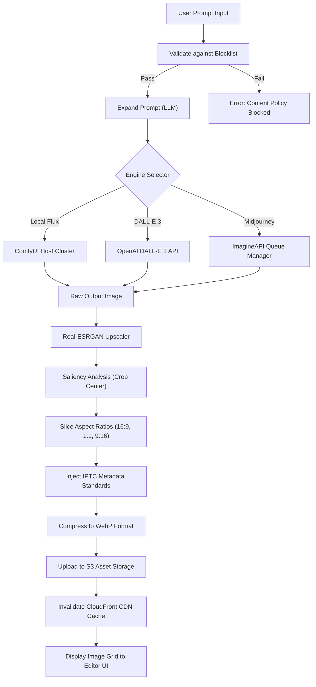

# Image Generation Pipeline
## Purpose
This document details the functional specifications, architecture, and deployment patterns of the NewsOps Cloud Image Generation Pipeline. This system allows editorial staff to programmatically and interactively create high-quality, copyright-safe, context-relevant illustrations, headers, and social media thumbnails directly from their workspace utilizing state-of-the-art text-to-image models (Stable Diffusion / Flux via ComfyUI, DALL-E 3, and Midjourney API integrations).

## Executive Summary
Visual content is vital for audience engagement, but licensing stock photography is expensive and sourcing custom illustrations introduces bottlenecks in fast-paced news cycles. The NewsOps Image Generation Pipeline provides a centralized, multi-tenant media generation service that integrates with both commercial and self-hosted text-to-image engines. 

The pipeline automates:
1.  **Context-Aware Prompt Expansion**: Transforming short editorial suggestions into highly descriptive prompts using an LLM.
2.  **Model Routing**: Directing jobs to the most cost-efficient or style-appropriate model.
3.  **Post-Processing & Standardization**: Scaling, upscaling, watermarking, injecting standard metadata, and generating multiple aspect-ratio thumbnails automatically for social publishing platforms.

## Vision
To build a seamless, click-to-illustrate workflow within the NewsOps CMS that empowers journalists to generate professional, brand-aligned visual assets in seconds, while maintaining zero risk of copyright infringement and strict compliance with ethical AI labeling standards.

## Scope
The scope of this pipeline includes:
- Prompt expansion logic translating article abstracts into rich artistic prompts.
- API bridges to DALL-E 3 (OpenAI), Flux/Stable Diffusion (ComfyUI self-hosted endpoints), and Midjourney (via ImagineAPI or similar REST endpoints).
- Image post-processing workers (resizing, face restoration using GFPGAN, upscaling via Real-ESRGAN, format conversion to WebP).
- Automated creation of metadata profiles, embedding metadata indicating AI authorship (IPTC Photo Metadata Standard compliance).
- Dynamic multi-size thumbnail creation and caching on CDN.

The following are explicitly out of scope:
- Fine-tuning base diffusion models from scratch (pre-training).
- Direct hosting of interactive WebUI tools (e.g., AUTOMATIC1111) for end-users; all access must be mediated by the API.
- Generative video rendering (this is covered in the video scripting and voiceover engine).

## Goals
- **Turnaround Time**: Complete prompt expansion, generation, upscaling, and thumbnail slicing in less than 20 seconds for 90% of requests.
- **Cost Minimization**: Utilize local, self-hosted Flux/Stable Diffusion engines for at least 70% of generation requests, saving external API costs.
- **Sizing Completeness**: Generate and deliver 4 standard editorial aspect ratios (16:9, 4:3, 1:1, 9:16) from a single generation trigger.
- **Labeling Rigor**: Maintain 100% compliance with digital transparency standards by embedding cryptographic watermark metadata in every asset.

## Functional Requirements
- **Automated Prompt Expansion**: The system must accept an article's draft text or brief description and use a local model (e.g., Llama-3) to expand it into an optimized, descriptive prompt specifying art style, lighting, composition, and negative prompt fields.
- **Multi-Engine API Integration**:
  - *Stable Diffusion / Flux*: Connect to ComfyUI REST endpoints using JSON-based workflow execution.
  - *DALL-E 3*: Connect to OpenAI API completion requests.
  - *Midjourney*: Connect via ImagineAPI, passing prompt parameters and waiting for webhook completions.
- **Aspect Ratio & Framing Control**: The user must be able to specify the target layout aspect ratio. The system must adapt generation resolution accordingly (e.g., 1024x1024 for 1:1, 1344x768 for 16:9).
- **Post-Processing & Enhancements**:
  - Image upscaling to print quality (at least 300 DPI or 3840x2160 resolution).
  - Automated face restoration when human figures are detected.
  - Asset watermarking with publication logos or transparency badges.
- **Metadata Tagging**: Automatically write IPTC tags including `DigitalSourceType: trainedAlgorithmicMedia` and `Creator: NewsOps AI Engine` into the EXIF profile of the generated WebP file.

## Non-Functional Requirements
- **High Throughput Handling**: The system must queue and run up to 30 concurrent generations globally per GPU node without crashing or blocking.
- **Storage Durability**: Generated media must be stored in private S3 buckets with lifecycle policies (move raw inputs to Glacier, keep optimized WebP on active S3).
- **Scalability**: ComfyUI worker nodes must be containerized and scale-out horizontally based on GPU queue depth metrics monitored by the worker controller.

## Business Rules
- **Editorial Gatekeeping**: All AI-generated images must be explicitly marked as `Draft / Pending Review` in the CMS media library and cannot be embedded in active public articles until approved by an editor with `media:publish` credentials.
- **Brand Consistency Rules**: Tenants can define a mandatory "Style Preset" (e.g., "Minimalist Vector Illustration", "Cinematic Photojournalism"). If set, the prompt expander will automatically append these style constraints to all prompts.
- **Copyright Prevention**: Prompts containing references to copyrighted characters, public celebrities, or trademarked brand names must be automatically blocked by the validation layer.

## Actors
- **Content Writer**: Initiates image generation from the CMS editor sidebar.
- **Lead Art Editor**: Reviews, crops, approves, or rejects generated drafts in the Media Registry.
- **Media Ingestion Worker**: The automated system daemon that coordinates API requests, applies upscaling, crops aspect ratios, and uploads output files to S3.

## User Stories (At least 3 specific stories)
### Story 1: Writer Needs an Editorial Header Image
As a technology writer drafting an article about quantum computing, I want the system to read my draft and generate a high-quality 16:9 abstract vector illustration that visually represents quantum qubits, so that I can insert an engaging header without waiting for the graphic design department.
*   **Trigger**: Writer clicks "Generate Header Illustration" in the CMS editor.
*   **System Action**: The system analyzes the draft, expands the prompt to describe a clean abstract concept, generates it via Flux on the local GPU, and returns a 16:9 WebP image within 12 seconds.

### Story 2: Editor Approving and Branding Assets
As the lead editor, I want to review all newly generated image assets in the media queue, confirm they contain the mandatory AI disclosure tag, and automatically apply our publication's logo watermark before moving them to the active assets catalog.
*   **Trigger**: Editor opens the Media Approval dashboard.
*   **System Action**: The editor clicks "Approve & Brand"; the system applies the watermarking layer, injects the metadata signature, and publishes the image to the CDN.

### Story 3: Social Media Automation Slicing Multi-Platform Thumbnails
As a social media manager, I want the system to generate three specific aspect-ratio thumbnails (1:1 for Instagram, 1.91:1 for Twitter, and 9:16 for Mobile Stories) of an approved image, ensuring the main subject of the image is correctly centered and not cropped out.
*   **Trigger**: An article is scheduled for multi-platform social release.
*   **System Action**: The media processing worker detects the main subject using a saliency-bounding-box model, crops the image around this subject into the three target dimensions, and saves them to the CDN cache.

## Acceptance Criteria (At least 3-5 criteria with clear thresholds)
- **AC 1 (Prompt Expansion Speed)**: The LLM prompt expander must process the article context and yield the expanded visual description prompt in less than 1.2 seconds.
- **AC 2 (Scale and Convert Latency)**: Post-processing tasks (resizing, format conversion, and watermarking) must complete in less than 2.0 seconds from the moment the raw model finishes generation.
- **AC 3 (Aspect Ratio Fidelity)**: The system must enforce precise pixel sizes within a ±2px margin of target dimensions (e.g., exactly 1344x768 for 16:9 layouts).
- **AC 4 (Ethical Label Insertion)**: 100% of generated images must have the `IPTC:DigitalSourceType` tag set to `http://cv.iptc.org/newscodes/digitalsourcetype/trainedAlgorithmicMedia` in their file headers.

## Workflows (Step-by-step description of system and user interactions)
The sequence of processes from the initial prompt request to final CDN caching is represented below:

```
[CMS Sidebar UI] --(Draft Title + Short Input)--> [AI Media Gateway]
                                                           |
  +--------------------------------------------------------+
  |
  v
[Prompt Expansion Engine (LLM)]
  |
  +---> 1. Expand to detailed artistic description (Style, Lighting, Detail).
  +---> 2. Apply Negative Prompt (e.g., "ugly, duplicate, low-res").
  |
  v
[Model Router & Selector]
  |
  +---> [Option A: Local GPU Cluster] ----> ComfyUI API (Flux/SDXL Workflow JSON)
  +---> [Option B: OpenAI API] ----------> DALL-E 3 Completion (Standard/HD)
  +---> [Option C: Midjourney API] -------> ImagineAPI Queue -> Webhook Callback
  |
  v
[Raw Image Output (PNG/TIF)]
  |
  v
[Image Post-Processing Worker]
  |
  +---> 1. Upscale (Real-ESRGAN to high resolution).
  +---> 2. Subject detection (Saliency-based bounding box).
  +---> 3. Slice multi-aspect thumbnails (16:9, 1:1, 9:16).
  +---> 4. Inject metadata (IPTC Digital Source Type tags).
  +---> 5. Compress to WebP.
  |
  v
[S3 Bucket Storage] -> [CloudFront CDN] -> [Approved Editorial Assets Catalog]
```

## API Design (Provide actual REST endpoints, method, request/response JSON payloads, or GraphQL schemas)
### 1. Request Image Generation
Initiate an image generation job.
*   **Method**: `POST`
*   **Path**: `/api/v1/media/image/generate`
*   **Headers**:
    *   `Content-Type: application/json`
    *   `Authorization: Bearer <JWT>`

**Request Body**:
```json
{
  "article_id": "art-09a823f4-1122-4982-8bc1-678912ef00aa",
  "style_preset": "flat_vector",
  "base_description": "A cybersecurity expert looking at data screens in a server room.",
  "aspect_ratio": "16:9",
  "engine": "flux-local",
  "apply_watermark": true,
  "negative_prompt": "photorealistic, noisy, text signatures, hands with extra fingers"
}
```

**Response Body (HTTP 202 Accepted)**:
```json
{
  "job_id": "imgjob-9018c1b2-1323-49fa-981d-b873cdac11e2",
  "status": "queued",
  "estimated_duration_seconds": 15,
  "callback_url": "/api/v1/media/image/jobs/imgjob-9018c1b2-1323-49fa-981d-b873cdac11e2"
}
```

### 2. Check Generation Job Status
Track progress of the generation, upscaling, and crop workflow.
*   **Method**: `GET`
*   **Path**: `/api/v1/media/image/jobs/{job_id}`
*   **Headers**:
    *   `Authorization: Bearer <JWT>`

**Response Body (HTTP 200 OK - Job Finished)**:
```json
{
  "job_id": "imgjob-9018c1b2-1323-49fa-981d-b873cdac11e2",
  "status": "completed",
  "original_prompt": "Flat vector illustration of a cybersecurity expert analyzing data flows on multiple digital screens inside a clean blue server room. Minimalist design, bold shapes, professional editorial style.",
  "engine_used": "flux-local",
  "assets": {
    "original": "https://cdn.newsops.cloud/media/2026/06/imgjob-9018c1b2_orig.webp",
    "landscape_16_9": "https://cdn.newsops.cloud/media/2026/06/imgjob-9018c1b2_16_9.webp",
    "square_1_1": "https://cdn.newsops.cloud/media/2026/06/imgjob-9018c1b2_1_1.webp",
    "vertical_9_16": "https://cdn.newsops.cloud/media/2026/06/imgjob-9018c1b2_9_16.webp"
  },
  "metadata": {
    "iptc_source_type": "trainedAlgorithmicMedia",
    "dimensions": "1920x1080",
    "file_size_bytes": 450123
  }
}
```

## Database Design (Identify schema tables, fields, and indexes relevant to this feature)
To store image generation metadata, queue status, and cropped asset paths, the following tables are defined.

```sql
-- Track individual image generation job pipeline execution states.
CREATE TABLE image_generation_jobs (
    job_id UUID PRIMARY KEY DEFAULT gen_random_uuid(),
    tenant_id UUID NOT NULL,
    user_id UUID NOT NULL,
    article_id UUID, -- NULL if generated outside article context
    status VARCHAR(50) NOT NULL, -- 'queued', 'generating', 'processing', 'completed', 'failed'
    engine VARCHAR(50) NOT NULL, -- 'flux-local', 'dalle3', 'midjourney'
    original_input_text TEXT NOT NULL,
    expanded_prompt TEXT,
    negative_prompt TEXT,
    aspect_ratio_requested VARCHAR(10) NOT NULL DEFAULT '16:9',
    error_message TEXT,
    created_at TIMESTAMP WITH TIME ZONE DEFAULT CURRENT_TIMESTAMP,
    updated_at TIMESTAMP WITH TIME ZONE DEFAULT CURRENT_TIMESTAMP
);

-- Store final cropped and published asset variants linked to the parent job.
CREATE TABLE generated_images_catalog (
    asset_id UUID PRIMARY KEY DEFAULT gen_random_uuid(),
    job_id UUID REFERENCES image_generation_jobs(job_id) ON DELETE CASCADE,
    tenant_id UUID NOT NULL,
    is_approved BOOLEAN NOT NULL DEFAULT FALSE,
    approved_by UUID,
    approved_at TIMESTAMP WITH TIME ZONE,
    raw_s3_uri VARCHAR(512) NOT NULL,
    cdn_optimized_url VARCHAR(512) NOT NULL,
    aspect_ratio VARCHAR(10) NOT NULL, -- '16:9', '1:1', '9:16', '4:3'
    width INT NOT NULL,
    height INT NOT NULL,
    file_size_bytes INT NOT NULL,
    iptc_metadata JSONB NOT NULL DEFAULT '{}'::jsonb,
    created_at TIMESTAMP WITH TIME ZONE DEFAULT CURRENT_TIMESTAMP
);

-- Style presets for specific tenants to enforce brand rules.
CREATE TABLE tenant_media_style_presets (
    preset_id UUID PRIMARY KEY DEFAULT gen_random_uuid(),
    tenant_id UUID NOT NULL UNIQUE,
    preset_name VARCHAR(100) NOT NULL,
    positive_style_modifiers TEXT NOT NULL, -- "minimalist vector, vector art, editorial flat color"
    negative_style_modifiers TEXT NOT NULL, -- "photorealistic, 3d render, shadows"
    created_at TIMESTAMP WITH TIME ZONE DEFAULT CURRENT_TIMESTAMP
);

-- Indexing for quick lookups
CREATE INDEX idx_img_jobs_tenant ON image_generation_jobs(tenant_id, status);
CREATE INDEX idx_catalog_job ON generated_images_catalog(job_id);
```

## UI Design (Describe component structure, layouts, actions, and states)
The image generation controls are embedded in the CMS Article Editor sidebar under the **AI Media Assets** panel.

### Component Structure
1.  **AI Image Studio Sidebar**:
    *   Textarea for "Visual Idea or Theme".
    *   Dropdown for style selector (loads values from `tenant_media_style_presets`).
    *   Aspect Ratio Selector (Row of buttons: 16:9 landscape, 1:1 square, 9:16 vertical).
    *   "Generate Drafts" action button.
2.  **Interactive Crop & Preview Grid**:
    *   Displays 2 generated options.
    *   Clicking an option opens a modal showing cropped previews for 16:9, 1:1, and 9:16 simultaneously.
    *   A drag-and-position bounding box allows the editor to adjust target focal points.
3.  **Approval Component**:
    *   Checkbox: "Confirm AI-transparency labelling is embedded".
    *   "Publish to Media Library" button.

### Interface States
*   **Generating State**: A skeleton placeholder overlaying the sidebar with a dynamic progress bar (*"Generating visual concept on local server..."*).
*   **Error State**: Red outline around the prompt text area displaying: *"Content filter triggered. Prompts referencing celebrities are blocked."*

## Permissions (Specify RBAC permissions required, e.g., organizations:read, articles:write)
Access control uses these RBAC permissions:
- `media:generate:create` - Permits submitting prompts and requesting raw generations.
- `media:generate:approve` - Permits reviewing generated files and signing off for publication.
- `media:presets:manage` - Permits administrators to define the corporate branding rules and style presets.

## Security (Detail security considerations, e.g., input validation, CSRF, JWT validation)
- **Prompt Content Filter**: Input text must be checked against an internal blocklist containing trademarked characters, real-world political personalities, and toxic terminology before transmission to the generation engines.
- **Payload Sanitization**: The ComfyUI server is highly sensitive to workflow injection vectors. Dynamic workflow JSON payloads must be hardcoded inside the gateway server, only injecting the text prompt and resolution parameters into clean, validated strings.
- **S3 Pre-signed URL Protection**: The raw, unapproved images are stored in a private bucket accessible only via pre-signed, temporary URLs (15-minute expiration) to prevent public leakage of raw designs.

## Performance (State latency limits, caching requirements, target TPS)
- **Target Metrics**:
  - **Generation Latency**: 12 seconds max for Flux on a local NVIDIA RTX 4090 GPU (50 steps, Euler sampler).
  - **Upscaling Execution**: < 3 seconds using Real-ESRGAN x2.
  - **Total Delivery**: < 18 seconds from click to UI layout injection.
- **Caching**:
  - Cache identical prompt strings within a 5-minute window to prevent duplicate generations by multiple editors working on the same news desk.
  - Slicing and resizing are completed in-memory using Libvips via Node.js sharp or Python Pillow before writing output files to disk.

## Monitoring (Detail Prometheus metrics names, alert triggers)
Prometheus endpoints track pipeline statistics:
- `newsops_image_generation_duration_seconds`: Histogram of total generation workflow execution times.
- `newsops_image_generation_errors`: Counter of failures categorized by type (`EngineTimeout`, `ContentBlocked`, `S3UploadError`).
- `newsops_gpu_generation_queue`: Gauge of currently queued tasks in ComfyUI.

**Alert triggers**:
- **Critical Alert**: `newsops_image_generation_errors > 5` in 10 minutes. Trigger: "Image generation engine failure rate high, check ComfyUI pod health."

## Logging (Specify log formats, error levels, log contexts)
Logs are formatted in structured JSON:
```json
{
  "timestamp": "2026-06-27T22:20:19.981Z",
  "level": "INFO",
  "context": {
    "tenant_id": "c6a12b91-efd5-4ad9-a790-db0e87b7a13d",
    "user_id": "usr-5512-abc",
    "job_id": "imgjob-9018c1b2-1323-49fa-981d-b873cdac11e2"
  },
  "message": "Image generation job completed successfully. Initiating crop slicing.",
  "engine": "flux-local",
  "execution_metrics": {
    "total_generation_time_ms": 11450,
    "upscale_time_ms": 2100
  }
}
```

## Error Handling (Map input/system error codes to HTTP status and customer-facing messages)
The mapping of pipeline failures to HTTP codes and messages:

| System Error Code | HTTP Status | Target Customer-Facing Message | Rationale |
| :--- | :--- | :--- | :--- |
| `CONTENT_POLICY_VIOLATION` | 400 | "Your request was flagged by content safety rules. Avoid names of public figures or protected brands." | Prompt failed the pre-validation blocklist scan. |
| `MODEL_ENGINE_TIMEOUT` | 504 | "The image generation engine did not respond in time. We are retry-queuing your request." | The ComfyUI or Midjourney API did not return a response within 30 seconds. |
| `CDN_UPLOAD_FAILED` | 502 | "Image generated successfully, but could not be uploaded to the CDN. Re-trying..." | Network issue during S3 destination upload phase. |
| `UNSUPPORTED_ASPECT_RATIO` | 400 | "The requested aspect ratio is not supported by the selected engine." | Attempting to generate a non-standard aspect ratio. |

## Edge Cases (Handle race conditions, rate limit hits, upstream timeouts)
- **Subject Off-Centering in Vertical Crops**: When cutting a 16:9 image to a 9:16 vertical view, the subject may get cropped in half. *Resolution*: Saliency-based bounding box detection is executed before cropping. If the saliency mapping detects important objects on extreme sides, cropping is blocked, and the editor is prompted to adjust the crop region manually in the UI.
- **Midjourney Discord Gateways Congestion**: Midjourney API calls can experience multi-minute delays during peak hours. *Resolution*: If the Midjourney job exceeds 60 seconds, the gateway automatically kicks off an alternative Flux generation job locally, alerting the UI to show both options when available.
- **GPU Resource Depletion**: Under a breaking news surge, 100 image requests could hit the ComfyUI cluster at once. *Resolution*: Implement strict user throttling: maximum 2 active generation requests per user, holding others in a FIFO queue.

## Future Improvements (Provide long-term scaling, architecture refactor paths)
- **Custom SDXL/Flux LoRAs for Brand Guidelines**: Deploy fine-tuned style LoRAs matching each publication's style book, ensuring generated illustrations have a cohesive color palette.
- **Vector Graphic Exports**: Integrate SVG generation nodes to support lossless resolution scaling for editorial print applications.
- **Automatic Alt-Text Generation**: Connect generated visual assets to a vision LLM to automatically output high-accuracy alt-text captions, enhancing web accessibility compliance.

## Mermaid Diagrams (Include at least one high-quality diagram: flowchart, sequence, or ERD)
### Workflow Execution Flowchart
This flowchart shows the detail of processing an image request, routing it, upscaling, metadata injection, and CDN storage.



## References (Reference other related files in the repository using standard relative markdown links, e.g., '../02-architecture/system_architecture.md')
- [Storage Architecture Specification](../02-architecture/storage_architecture.md)
- [Editorial Schema Design](../03-database/editorial_and_cms_schema.md)
- [Local Model Integration Specifications](./local_model_integration.md)
