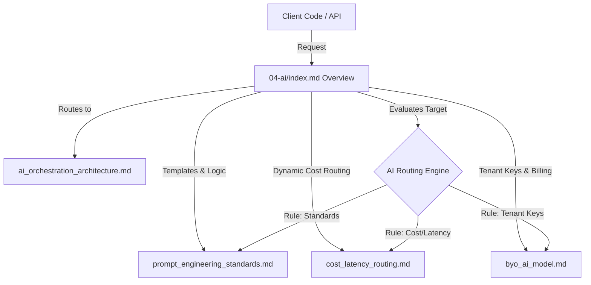

# AI Orchestrator Directory Overview

## Purpose
This document serves as the primary entry point, index, and structural map for the `04-ai` directory within the NewsOps Cloud digital publishing operating system's technical documentation. Its purpose is to lay out the AI Orchestration layer design, map directory contents, define the architectural framework for multi-provider routing, standard prompts, cost-latency routing engines, and Bring-Your-Own (BYO) AI models.

## Executive Summary
The NewsOps Cloud AI Orchestrator is a production-grade, multi-tenant AI gateway that translates, routes, and optimizes LLM requests. By providing a unified interface over OpenAI, Google Gemini, Anthropic, NVIDIA NIM, and self-hosted vLLM/Ollama models, the Orchestrator eliminates single-provider lock-in. It optimizes performance and cost through a dynamic cost-latency routing engine while allowing enterprise tenants to secure their workflows with custom API keys. This document indexes all sub-documents and defines the core architecture mapping the directory.

## Vision
The AI Orchestration layer envisions a completely provider-agnostic, low-latency, and cost-controlled intelligence layer. Every editorial workspace, translation queue, SEO engine, and summarization workflow interacts with a standard interface, allowing the platform to dynamically run models depending on real-time prices, rate limits, latency profiles, and compliance requirements.

## Scope
This index and the accompanying sub-documents cover:
1. **AI Orchestration Architecture** (`ai_orchestration_architecture.md`): Detailed routing patterns, middleware translators, and provider adapters.
2. **Prompt Engineering Standards** (`prompt_engineering_standards.md`): Schema for templates, system prompts, versioning, and database storage.
3. **Cost-Latency Routing** (`cost_latency_routing.md`): Dynamic model evaluation, fallback trees, and real-time telemetry.
4. **Bring Your Own AI Model** (`byo_ai_model.md`): Tenant key vaults, usage ledgers, and platform billing integrations.

It excludes model training code, custom weight adjustments, vector databases hosting scripts, and specific deployment configurations for Kubernetes clusters.

## Goals
- **Unified Interface**: Provide a single API payload schema that wraps all supported model providers.
- **Cost Minimization**: Deliver an automated cost-saving ratio of at least 35% through capabilities-based model downgrades.
- **Provider Redundancy**: Implement sub-second failovers across model providers to guarantee 99.99% uptime of AI-assisted features.
- **Key Isolation**: Protect corporate API keys with hardware-level security modules (HSM) and strict RBAC isolation.

## Functional Requirements
- **Directory Indexing**: Provide clear, direct access pathways to all AI Orchestration design specifications.
- **Global Provider Health Registry**: Expose status endpoints tracking active, degraded, or offline statuses for LLM API backends.
- **Unified Schema Translators**: Support real-time conversion of standardized system/user prompt payloads to provider-specific formats (e.g., Anthropic Messages API vs. OpenAI Chat Completions API).

## Non-Functional Requirements
- **Gateway Overhead**: The AI router must introduce less than 15ms of latency to request routing before model execution.
- **Scale Capability**: Support up to 5,000 concurrent LLM routing requests per second (RPS) under peak publishing loads.
- **Secret Encryption**: Encrypt customer-provided credentials using AES-256-GCM, with keys rotated every 90 days.

## Business Rules
- **No Direct Calls**: NewsOps code must never invoke external model APIs directly; all requests must flow through the AI Orchestrator router.
- **Prompt Immutability**: Once a prompt version is published, it cannot be modified; modifications require a new version ID.
- **Strict Budget Caps**: Dynamic cost routing must honor tenant-configured daily and monthly budget ceilings.

## Actors
- **Content Editor / Journalist**: Interacts with the CMS editor, initiating requests for summaries, rewrites, and translations.
- **Editorial Admin**: Manages prompt templates, tests model behavior, and reviews performance dashboards.
- **Platform Developer**: Integrates new models, sets up custom system variables, and monitors routing rules.
- **Tenant Billing Administrator**: Registers corporate API keys, monitors credit consumptions, and configures budget limits.

## User Stories
- **User Story 1**: As an Editorial Admin, I want to view the AI orchestrator index so that I can find detailed schemas for templates, cost-latency routing rules, and BYO models.
- **User Story 2**: As a Platform Developer, I want a provider-agnostic system prompt format so that I can update translation prompts without releasing separate code blocks for different LLMs.
- **User Story 3**: As a Tenant Billing Administrator, I want to access the BYO configuration specifications so that I can ensure our keys are isolated and billed against our internal corporate accounts.

## Acceptance Criteria
- The index page must contain clickable relative links to `ai_orchestration_architecture.md`, `prompt_engineering_standards.md`, `cost_latency_routing.md`, and `byo_ai_model.md`.
- The global status API must report response times, active status, and billing metrics for all primary engines.
- The repository must map the database designs and security profiles matching the requirements of the directory.

## Workflows
### Directory Exploration and Design Review Workflow
1. **Architect Review**: An integration architect opens the `04-ai/index.md` document.
2. **Navigation**: Selects `ai_orchestration_architecture.md` to review the multi-provider routing patterns.
3. **Standards Check**: Opens `prompt_engineering_standards.md` to verify versioning standards.
4. **Implementation Planning**: Navigates to the cost routing and BYO specifications to copy code schemas.

### AI Provider Status Retrieval Workflow
1. **Health Agent Query**: The system's background worker calls `/api/v1/ai/status`.
2. **Ping Execution**: The AI router checks connection pools and recent latency figures from its telemetry cache.
3. **Data Return**: Returns active providers, latency ranges, and flags any providers currently in fallback mode.

## API Design
### Global Provider Status API
Exposes the status and real-time latency of all registered AI engines.

* **URL**: `/api/v1/ai/status`
* **Method**: `GET`
* **Headers**:
  * `Authorization: Bearer <JWT>`
  * `X-Tenant-ID: system-admin`
* **Response Payload (200 OK)**:
```json
{
  "status": "operational",
  "timestamp": "2026-06-27T22:20:19Z",
  "providers": [
    {
      "provider": "openai",
      "status": "healthy",
      "pingMs": 112,
      "rateLimitRemaining": 9850,
      "fallbackActive": false
    },
    {
      "provider": "anthropic",
      "status": "healthy",
      "pingMs": 145,
      "rateLimitRemaining": 4850,
      "fallbackActive": false
    },
    {
      "provider": "gemini",
      "status": "degraded",
      "pingMs": 850,
      "rateLimitRemaining": 1200,
      "fallbackActive": true
    },
    {
      "provider": "local-vllm",
      "status": "healthy",
      "pingMs": 22,
      "rateLimitRemaining": 99999,
      "fallbackActive": false
    }
  ]
}
```
* **Error Response (500 Internal Server Error)**:
```json
{
  "statusCode": 500,
  "message": "AI Orchestration layer fails to communicate with connection registry.",
  "error": "Internal Server Error"
}
```

## Database Design
To orchestrate dynamic providers and track settings, the system relies on global configuration tables.

### `ai_providers` Table (Global Schema)
* `id`: UUID (Primary Key)
* `name`: VARCHAR(50) (Unique Index, e.g., 'openai', 'anthropic')
* `endpoint_url`: TEXT
* `is_active`: BOOLEAN (Default: true)
* `weight_factor`: NUMERIC(4,3) (Used for load balancing)
* `created_at`: TIMESTAMP WITH TIME ZONE
* `updated_at`: TIMESTAMP WITH TIME ZONE

### `ai_router_telemetry` Table (Global Schema)
* `id`: BIGSERIAL (Primary Key)
* `provider_id`: UUID (Foreign Key -> `ai_providers.id`)
* `latency_ms`: INTEGER
* `status_code`: INTEGER
* `is_fallback_triggered`: BOOLEAN
* `timestamp`: TIMESTAMP WITH TIME ZONE (Partition Index)

## UI Design
The AI orchestrator interface contains:
- **Provider Status Board**: Real-time cards representing connection latency, error rates, and active models.
- **Routing Engine Configurator**: Visual dropdown selector to set primary, secondary, and fallback models globally or per workspace.
- **Token Budget Metrics**: Area charts showing daily token consumption mapped against tenant ceilings.

## Permissions
- `ai:providers:read`: View status and configuration maps of AI providers.
- `ai:providers:write`: Register, modify, or delete AI provider endpoints and weighting rules.
- `ai:telemetry:read`: Review system logs, response times, and routing metrics.

## Security
- **Credential Storage**: Provider keys are stored in AWS Secrets Manager or HashiCorp Vault.
- **IP White-listing**: Outgoing requests to self-hosted models (NVIDIA NIM, local vLLM) must route through dedicated NAT gateways with static IPs.
- **Input Sanitization**: Block prompt injection attempts by checking strings against block-lists before forwarding to the router.

## Performance
- **Connection Reuse**: Keep-alive HTTP connections are maintained to external model APIs via HTTP connection pooling.
- **Telemetry Cache**: Latency metrics are cached in Redis with a 10-second TTL to avoid database write bottlenecks.
- **Target TPS**: Built to sustain 1,000 transactions per second (TPS) on the router orchestration layer.

## Monitoring
- **Prometheus Metric**: `ai_router_request_duration_seconds` (Histogram tracking routing latency overhead).
- **Prometheus Metric**: `ai_provider_errors_total` (Counter tracking upstream API failures by provider name).
- **Alert Trigger**: Trigger PagerDuty alert if `ai_provider_errors_total` increases by >10 within 1 minute for a primary provider.

## Logging
* **Log Pattern**: `{"timestamp": "%ISO8601%", "level": "INFO", "context": "AIRouter", "message": "Routing request to target provider", "metadata": {"tenantId": "tenant-uuid-444", "provider": "openai", "model": "gpt-4o", "latencyMs": 425}}`
* **Error Level**: `ERROR` for connection timeouts; `WARN` for triggering fallbacks.

## Error Handling
| Internal Error Code | HTTP Status | Customer-Facing Message |
|:---|:---|:---|
| `ERR_AI_PROVIDER_DOWN` | 502 Bad Gateway | The intelligence module is temporarily unresponsive. |
| `ERR_AI_RATE_LIMIT` | 429 Too Many Requests | Rate limit exceeded. Try again in a few moments. |
| `ERR_AI_BAD_PROMPT` | 400 Bad Request | The input prompt contains invalid formatting characters. |

## Edge Cases
- **Simultaneous Outages**: If both OpenAI and Anthropic go offline, the router falls back to the self-hosted vLLM instance automatically, sacrificing generation quality to maintain operational uptime.
- **Rate Limit Hits**: On HTTP 429 responses, the router instantly retries the query against the secondary provider, bypassing the rest of the current request queue.

## Future Improvements
- **Semantic Prompt Caching**: Store model outputs against vector embeddings of prompt requests to return cached outputs instantly for identical prompts.
- **Multimodal Routing**: Dynamic routing based on media inputs (images, audio, video) to prioritize specialized models.

## Mermaid Diagrams
### AI Orchestration Directory Flow & Routing Layer


## References
- System Architecture Design: [../02-architecture/system_architecture.md](../02-architecture/system_architecture.md)
- Multi-Tenancy Architecture: [../02-architecture/multi_tenancy_architecture.md](../02-architecture/multi_tenancy_architecture.md)
- News Intelligence Schema: [../03-database/news_intelligence_schema.md](../03-database/news_intelligence_schema.md)
- Identity and Org Schema: [../03-database/identity_and_org_schema.md](../03-database/identity_and_org_schema.md)
