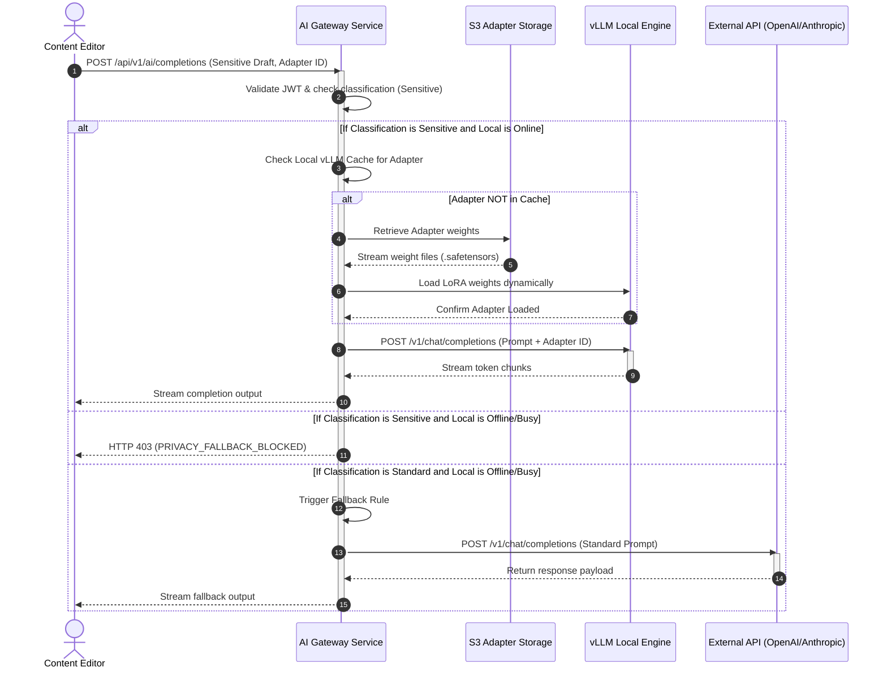

# Local Model Integration
## Purpose
This document specifies the technical design, deployment strategies, and orchestration mechanisms for integrating self-hosted, open-source large language models (LLMs) within the NewsOps Cloud digital publishing platform. It details the utilization of Ollama for development environments, vLLM for production-grade inference, and HuggingFace PEFT (Parameter-Efficient Fine-Tuning) adapters for tenant-specific content style personalization, minimizing operational costs and ensuring complete data privacy.

## Executive Summary
NewsOps Cloud requires a robust, cost-effective, and secure artificial intelligence engine to support automated editorial workflows, content translation, metadata tag generation, and research assistance. Relying exclusively on commercial proprietary APIs introduces high operational costs and risks data leakage of sensitive or embargoed journalistic content. 

This design establishes a hybrid AI gateway that defaults to high-throughput, low-latency local inference engines (vLLM on dedicated GPUs) for standard text operations while keeping commercial APIs (e.g., Anthropic, OpenAI) as secondary fallback channels. By utilizing HuggingFace adapters, the system supports dynamic, tenant-specific model tuning without the overhead of maintaining distinct, fully-parameterized models for each publisher.

## Vision
To establish NewsOps Cloud as an industry leader in secure, cost-controlled, and highly customized newsroom AI automation by delivering an enterprise-ready, open-source model integration framework. This framework guarantees absolute data sovereignty, zero-cost scaling of inference operations on tenant-owned or private-cloud hardware, and sub-second response times for news editors.

## Scope
The scope of this integration includes:
- Deployment and management configurations for **vLLM** (Production) and **Ollama** (Local Development and Staging).
- Dynamic routing and loading of HuggingFace PEFT/LoRA adapters based on tenant and publication context.
- Fallback strategies and circuit breaker patterns to transition workloads between local engines and external SaaS APIs.
- API gateway abstraction layers presenting unified OpenAI-compatible endpoints to the application core.
- Resource allocation plans defining minimum GPU hardware requirements, VRAM partitioning, and execution scheduling.

The following are explicitly out of scope:
- Training foundational models from scratch (pre-training).
- Hosting public-facing non-news consumer chat systems.
- Hosting models on edge client devices (e.g., running models locally on an editor's web browser).

## Goals
- **Cost Reduction**: Route at least 85% of total text processing tokens through self-hosted open-source models, achieving an 80% reduction in API licensing costs.
- **Latency Containment**: Limit Time-To-First-Token (TTFT) to less than 250ms for standard generation requests up to 2048 input tokens.
- **Data Sovereignty**: Provide a zero-leakage guarantee for embargoed investigative reporting by keeping all processing local to the tenant's private VPC.
- **Dynamic Adaptability**: Support dynamic swap of tenant-specific LoRA weights on the fly with a swap latency of less than 1.5 seconds.

## Functional Requirements
- **Unified Gateway Interface**: The system must expose an OpenAI-compatible REST API (`/v1/chat/completions`) that abstracts the underlying engine (vLLM, Ollama, or external fallback API).
- **Dynamic Adapter Routing**: The routing layer must intercept incoming requests, inspect the tenant and model identifiers, download the corresponding LoRA weights from the S3 storage bucket if not cached, and pass the adapter reference to the vLLM engine.
- **Automated Fallback and Failover**: If the local GPU cluster becomes unresponsive, experiences out-of-memory errors, or the inference queue exceeds 50 concurrent requests, the gateway must transparently route the request to a preconfigured commercial API backup.
- **Strict Context Isolation**: Prompt and response contents must not be stored in shared caches. The system must clear GPU context variables immediately after the output stream terminates.
- **Model Registry Management**: Administrators must have a portal to register, deprecate, and configure hardware profiles for foundational models (e.g., Llama-3-8B-Instruct, Mistral-7B-Instruct-v0.2) and their corresponding LoRA adapters.

## Non-Functional Requirements
- **Availability**: The local inference gateway cluster must maintain 99.9% uptime.
- **Scalability**: Under peak load, the local model orchestration layer must support auto-scaling of vLLM worker replicas across a Kubernetes cluster via KEDA (Kubernetes Event-driven Autoscaling) using GPU metrics.
- **Hardware Efficiency**: Support PagedAttention within vLLM to optimize VRAM utilization, enabling a minimum batch size of 32 concurrent requests on a single NVIDIA A100 (80GB) GPU.
- **Portability**: The local inference container images must be engine-independent, wrapping Ollama and vLLM inside standardized Docker configurations capable of running on AWS ECS, GCP GKE, or bare-metal local servers.

## Business Rules
- **Privacy Enforcement**: Any article marked as `Classification: Sensitive` or `Classification: Embargoed` must never be sent to external commercial APIs under any circumstances. If the local model infrastructure is unavailable, the request must fail with a descriptive privacy policy error code rather than falling back.
- **Tenant Quotas**: Free-tier tenants are restricted to shared foundational models without LoRA adapters. Premium-tier tenants may upload up to five custom style adapters.
- **Priority Routing**: Breaking news desks are allocated a guaranteed minimum GPU capacity slice, preempting low-priority task executions (like historical archive tagging).

## Actors
- **Content Editor**: Initiates text summarization, style matching, headline variations, and translations.
- **NewsOps System Administrator**: Registers base models, manages GPU cluster allocations, configures fallback keys, and uploads PEFT adapters.
- **Local Inference Agent**: The internal microservice that schedules jobs, monitors GPU temperatures/memory, and controls vLLM/Ollama processes.

## User Stories (At least 3 specific stories)
### Story 1: Investigative Editor Summarizing Leaked Documents
As an investigative editor, I want to upload a highly sensitive, leaked draft of a government report to the local summarization service so that I can draft an article outline without risking the disclosure of the documents to third-party commercial LLM providers.
*   **Trigger**: Editor highlights document text and clicks "Summarize Securely".
*   **System Action**: The system routes the prompt to the vLLM engine deployed on private infrastructure, ensuring no external calls are made.

### Story 2: Sports Desk Personalization using Custom LoRA Adapter
As a regional sports editor, I want my automated post-game drafts to match the historical writing tone of our publication's senior reporters so that our brand voice remains consistent across all programmatic coverage.
*   **Trigger**: An automated ingest pipeline finishes compiling game stats and requests a match summary.
*   **System Action**: The AI gateway maps the regional sports tenant ID to the `regional-sports-tone-v1` LoRA adapter, loads the weights onto the base Mistral model in vLLM, and generates the article draft.

### Story 3: System Administrator Implementing Fallback Policies
As a NewsOps system administrator, I want to configure the AI Gateway to automatically route summarization tasks to a commercial fallback API when local GPU memory utilization reaches 98% and queue delays exceed 5 seconds, ensuring the newsroom editors experience no interruptions.
*   **Trigger**: Heavy breaking news load triggers concurrent editing tasks across 20 newsrooms.
*   **System Action**: The AI Gateway checks model sensitivity tags, filters out embargoed items, and redirects the eligible general-purpose tasks to Anthropic Claude via API while preserving local GPU slices for sensitive tasks.

## Acceptance Criteria (At least 3-5 criteria with clear thresholds)
- **AC 1 (Time-to-First-Token)**: The local vLLM cluster must deliver the first token within 200 milliseconds (ms) for a request containing up to 1000 input tokens.
- **AC 2 (Adapter Swap Delay)**: A dynamic request requiring a non-cached LoRA adapter must start execution in less than 2.0 seconds, including the time required to fetch weights from internal S3 storage and load them into vLLM active memory.
- **AC 3 (Strict Fallback Execution)**: When the local GPU queue depth exceeds 50, standard requests must failover to the external SaaS backup within 500ms, whereas sensitive/embargoed requests must return a `403 Forbidden` response labeled `LOCAL_ONLY_POLICY_VIOLATED` within 100ms.
- **AC 4 (Memory Limits)**: The vLLM server must enforce a hard limit of 95% GPU memory consumption (using PagedAttention) to prevent Out-Of-Memory (OOM) kernel panics.

## Workflows (Step-by-step description of system and user interactions)
The sequence of execution for processing an inference request with dynamic adapter application and potential external fallback is described below:

```
[User/Editor] -> (Triggers Text Action)
      |
      v
[AI Gateway Service]
      |
      +---> 1. Validate permissions and inspect classification (Sensitive / Standard).
      |
      +---> 2. Retrieve model configuration for the target Tenant.
      |
      +---> 3. Check health and queue depth of local vLLM/Ollama pool.
      |
      +---> [Scenario A: Local Available & Class: Sensitive or Standard]
      |         |
      |         +---> Determine if LoRA adapter is needed.
      |         +---> Check local vLLM adapter cache. If missing, fetch from S3.
      |         +---> Issue vLLM request: `POST /v1/chat/completions` with `--model base_model` and `--adapter adapter_id`.
      |         +---> Stream response chunks back to [User/Editor].
      |
      +---> [Scenario B: Local Overloaded / Offline & Class: Standard]
      |         |
      |         +---> Trigger fallback circuit breaker.
      |         +---> Map parameters to commercial API (e.g., Anthropic Claude).
      |         +---> Route request to commercial API gateway.
      |         +---> Log fallback event to Prometheus metrics.
      |         +---> Stream response chunks back to [User/Editor].
      |
      +---> [Scenario C: Local Overloaded / Offline & Class: Sensitive]
                |
                +---> Block request. Do not fall back.
                +---> Return 503 Service Unavailable with "INSUFFICIENT_SECURE_CAPACITY".
```

## API Design (Provide actual REST endpoints, method, request/response JSON payloads, or GraphQL schemas)
### 1. Unified AI Completions Endpoint
Unified gateway interface that wraps local and external inference.
*   **Method**: `POST`
*   **Path**: `/api/v1/ai/completions`
*   **Headers**:
    *   `Content-Type: application/json`
    *   `Authorization: Bearer <JWT>`
    *   `X-Tenant-ID: <UUID>`

**Request Body**:
```json
{
  "model_identifier": "newsops-llama3-8b-editorial",
  "prompt": "Rewrite the following lead paragraph to match a professional journalistic tone: 'Yesterday some guys stole money from the main bank.'",
  "system_instruction": "You are a professional editor at a major newspaper. Adhere to AP style rules.",
  "classification": "sensitive",
  "temperature": 0.3,
  "max_tokens": 150,
  "stream": true,
  "lora_adapter_id": "tenant-ap-style-modifier-v2"
}
```

**Successful Stream Response Chunk (HTTP 200 OK - `text/event-stream`)**:
```text
data: {"id": "chatcmpl-local-89123", "object": "chat.completion.chunk", "created": 1719526800, "model": "newsops-llama3-8b-editorial", "choices": [{"index": 0, "delta": {"content": "Armed"}, "finish_reason": null}]}

data: {"id": "chatcmpl-local-89123", "object": "chat.completion.chunk", "created": 1719526800, "model": "newsops-llama3-8b-editorial", "choices": [{"index": 0, "delta": {"content": " suspects"}, "finish_reason": null}]}

data: {"id": "chatcmpl-local-89123", "object": "chat.completion.chunk", "created": 1719526800, "model": "newsops-llama3-8b-editorial", "choices": [{"index": 0, "delta": {}, "finish_reason": "stop"}]}
```

### 2. Local Model Registry Management
Endpoint to register foundational models deployed on local GPU infrastructure.
*   **Method**: `POST`
*   **Path**: `/api/v1/ai/admin/models`
*   **Headers**:
    *   `Content-Type: application/json`
    *   `Authorization: Bearer <JWT>`

**Request Body**:
```json
{
  "name": "Mistral-7B-Instruct-v0.2",
  "engine_type": "vllm",
  "hf_repo_id": "mistralai/Mistral-7B-Instruct-v0.2",
  "quantization": "AWQ",
  "min_vram_gb": 12,
  "paged_attention_block_size": 16,
  "max_model_len": 8192,
  "gpu_memory_utilization": 0.90
}
```

**Response Body (HTTP 201 Created)**:
```json
{
  "model_id": "mod-89f41b31-3142-4912-bb9a-0044efc192bb",
  "name": "Mistral-7B-Instruct-v0.2",
  "registered_at": "2026-06-27T22:20:19Z",
  "status": "configured"
}
```

## Database Design (Identify schema tables, fields, and indexes relevant to this feature)
To manage models, dynamic adapters, and tenant assignments, the following PostgreSQL relational schemas are utilized.

```sql
-- Represents base models downloaded and available on the local inference hosts.
CREATE TABLE ai_base_models (
    model_id UUID PRIMARY KEY DEFAULT gen_random_uuid(),
    name VARCHAR(255) NOT NULL UNIQUE,
    engine_type VARCHAR(50) NOT NULL, -- 'vllm', 'ollama'
    hf_repo_id VARCHAR(255) NOT NULL,
    quantization VARCHAR(50) DEFAULT 'none',
    max_context_len INT NOT NULL DEFAULT 4096,
    gpu_allocation_ratio DECIMAL(3, 2) NOT NULL DEFAULT 1.0, -- fraction of GPU allocated
    is_active BOOLEAN NOT NULL DEFAULT TRUE,
    created_at TIMESTAMP WITH TIME ZONE DEFAULT CURRENT_TIMESTAMP,
    updated_at TIMESTAMP WITH TIME ZONE DEFAULT CURRENT_TIMESTAMP
);

-- Represents tenant-specific LoRA adapters stored in the internal S3 storage bucket.
CREATE TABLE ai_lora_adapters (
    adapter_id UUID PRIMARY KEY DEFAULT gen_random_uuid(),
    tenant_id UUID NOT NULL, -- references tenants table
    base_model_id UUID REFERENCES ai_base_models(model_id) ON DELETE CASCADE,
    name VARCHAR(255) NOT NULL,
    s3_storage_uri VARCHAR(512) NOT NULL,
    rank INT NOT NULL DEFAULT 8,
    alpha INT NOT NULL DEFAULT 16,
    checksum_sha256 VARCHAR(64) NOT NULL,
    created_at TIMESTAMP WITH TIME ZONE DEFAULT CURRENT_TIMESTAMP,
    CONSTRAINT unique_tenant_adapter_name UNIQUE (tenant_id, name)
);

-- Logs the performance and fallback outcome of inference requests.
CREATE TABLE ai_inference_logs (
    log_id UUID PRIMARY KEY DEFAULT gen_random_uuid(),
    tenant_id UUID NOT NULL,
    request_id VARCHAR(100) NOT NULL UNIQUE,
    base_model_id UUID REFERENCES ai_base_models(model_id),
    adapter_id UUID REFERENCES ai_lora_adapters(adapter_id),
    classification VARCHAR(50) NOT NULL, -- 'standard', 'sensitive', 'embargoed'
    tokens_input INT NOT NULL,
    tokens_output INT NOT NULL,
    time_to_first_token_ms INT NOT NULL,
    total_duration_ms INT NOT NULL,
    engine_used VARCHAR(50) NOT NULL, -- 'vllm', 'ollama', 'fallback_openai', 'fallback_anthropic'
    was_fallback BOOLEAN NOT NULL DEFAULT FALSE,
    error_code VARCHAR(100),
    created_at TIMESTAMP WITH TIME ZONE DEFAULT CURRENT_TIMESTAMP
);

-- Indexes for fast performance reporting and billing compilation.
CREATE INDEX idx_inference_tenant_date ON ai_inference_logs(tenant_id, created_at DESC);
CREATE INDEX idx_lora_base_model ON ai_lora_adapters(base_model_id);
```

## UI Design (Describe component structure, layouts, actions, and states)
The local model configuration interface is embedded within the NewsOps Admin Console under the **AI Engines & Privacy Settings** menu.

### Component Structure & Layouts
1.  **AI Engine Status Dashboard**:
    *   Top panel shows real-time GPU indicators (Active GPU instances, VRAM utilization, Queue Depth, Tokens/Sec).
    *   Visual alert indicators that turn amber/red if GPU temperatures exceed thresholds or if fallbacks are active.
2.  **Base Model Manager**:
    *   Table listing active foundational models.
    *   "Deploy New Model" action button opening a modal with fields for HuggingFace Repo ID, Engine Type (vLLM/Ollama), and Max Context tokens.
3.  **Tenant Adapter Assignments**:
    *   Dropdown to select Tenant Org.
    *   List of uploaded LoRA style profiles with options to run test completions or swap active profiles.
4.  **Privacy Rule Matrix**:
    *   Toggle grid setting fallback permissions based on classification tags (e.g., `Embargoed` -> "Enforce Local Only" vs "Allow Fallback under SLA").

### Interface Mockup States
*   **Normal State**: Local GPU engines operating at 45% VRAM capacity, 0 queued tasks. All traffic routed to internal vLLM cluster.
*   **Failover State**: Red flashing warning banner at top of editor screen for Administrators: *"Local inference engines overloaded. general-purpose AI tasks temporarily redirected to commercial API cluster. Sensitive and Embargoed generation tasks are paused."*
*   **OOM Recover State**: A recovery dialog for Admins allowing single-click restart of vLLM process or target GPU partition purging.

## Permissions (Specify RBAC permissions required, e.g., organizations:read, articles:write)
Access control is implemented via Role-Based Access Control (RBAC) scopes:
- `ai:models:read` - Allows viewing active base models and configurations (Editors, Admins).
- `ai:models:write` - Allows registering new models, loading PEFT adapters, and configuring GPU settings (System Administrators only).
- `ai:inference:execute` - Allows submitting prompt queries to the completions endpoint (Editors, API keys).
- `ai:privacy:admin` - Allows defining the fallback behavior and classification limits (Chief Editors, Compliance Officers).

## Security (Detail security considerations, e.g., input validation, CSRF, JWT validation)
- **Data Isolation**: Multi-tenant context safety is maintained by setting separate memory channels in vLLM. Each generation request is mapped to a distinct session context window that is zeroed out by vLLM's PagedAttention allocator upon completion.
- **Payload Verification**: S3 URIs containing LoRA adapter weights must undergo SHA-256 checksum validation before execution by vLLM to prevent model injection attacks (where malicious weights execute arbitrary code during execution).
- **Network Segmentation**: The vLLM and Ollama execution containers run within a isolated VPC subnet. External internet ingress is entirely blocked. The application gateway is the sole authorized bridge to communicate with these engines.
- **Strict Input Validation**: Prompt requests are validated against regex profiles looking for common injection sequences (e.g., "Ignore previous instructions") before hitting the local engine.

## Performance (State latency limits, caching requirements, target TPS)
- **Target Metrics**:
  - **Latency Limit**: TTFT < 200ms; Max inter-token latency < 25ms.
  - **Throughput**: Target 120 Tokens/Second per GPU stream.
  - **Target TPS (Transactions Per Second)**: 50 concurrent completions streams across a standard base-tier node (dual NVIDIA RTX 6000 Ada GPUs).
- **Caching**:
  - Prompt prefix caching enabled in vLLM to prevent reprocessing repetitive system instructions (AP style guides, background context templates).
  - LoRA adapters are cached in local SSD storage (`/opt/newsops/adapters/`) to avoid pulling from S3 on every request. A Least-Recently-Used (LRU) pruning scheme is enforced when cache storage exceeds 100GB.

## Monitoring (Detail Prometheus metrics names, alert triggers)
The system exposes a Prometheus scraper endpoint at `:9090/metrics`. Key custom metrics tracked include:
- `newsops_local_inference_latency_seconds`: Histogram of latency grouped by model and tenant.
- `newsops_inference_fallback_count`: Counter incremented whenever traffic falls back to commercial API providers, labeled by provider name.
- `newsops_adapter_swap_time_seconds`: Summary tracking the duration of dynamic PEFT weight loading.
- `vllm_gpu_utilization_ratio`: Gauge reflecting current VRAM allocation.

**Alert Triggers**:
- **Critical Alert**: `vllm_gpu_utilization_ratio > 0.98` for more than 2 minutes. Trigger alert: "Inference Engine GPU memory threshold exceeded, risk of OOM."
- **Warning Alert**: `newsops_inference_fallback_count > 10` within 5 minutes. Trigger notification: "Local model infrastructure experiencing high latency, fallback API engaged."

## Logging (Specify log formats, error levels, log contexts)
All logs are emitted to standard output in structured JSON format:
```json
{
  "timestamp": "2026-06-27T22:20:19.452Z",
  "level": "INFO",
  "context": {
    "tenant_id": "c6a12b91-efd5-4ad9-a790-db0e87b7a13d",
    "request_id": "req-980123-abc",
    "model_id": "mod-89f41b31-3142-4912-bb9a-0044efc192bb"
  },
  "message": "Local inference request initiated using dynamic adapter.",
  "adapter": "tenant-ap-style-modifier-v2",
  "classification": "sensitive",
  "perf": {
    "tokens_input": 512,
    "time_to_first_token_ms": 184
  }
}
```
If an error occurs, it is categorized:
```json
{
  "timestamp": "2026-06-27T22:20:20.102Z",
  "level": "ERROR",
  "context": {
    "tenant_id": "c6a12b91-efd5-4ad9-a790-db0e87b7a13d",
    "request_id": "req-980123-abc"
  },
  "message": "Local inference execution failed: GPU Out Of Memory.",
  "error_code": "INFERENCE_GPU_OOM",
  "stack_trace": "RuntimeError: CUDA out of memory. Tried to allocate 4.20 GiB..."
}
```

## Error Handling (Map input/system error codes to HTTP status and customer-facing messages)
The following table defines the HTTP mappings and message specifications for inference errors.

| System Error Code | HTTP Status | Target Customer-Facing Message | Rationale |
| :--- | :--- | :--- | :--- |
| `LOCAL_MODEL_OFFLINE` | 503 | "Local AI translation and synthesis engine is temporarily offline. Our engineers have been alerted." | vLLM/Ollama socket is closed or host is unresponsive. |
| `INFERENCE_QUEUE_FULL` | 429 | "The AI request queue is currently saturated. Please try your request again in 30 seconds." | Max concurrent requests exceeded, and fallback was blocked due to sensitivity settings. |
| `ADAPTER_LOAD_FAILED` | 400 | "The requested tenant writing style adapter could not be loaded. Please verify your settings." | Adapter weights are corrupt or incompatible with the base model weights. |
| `PRIVACY_FALLBACK_BLOCKED` | 403 | "This document is marked as sensitive/embargoed and cannot be processed using third-party AI APIs." | Attempt to fallback to external API when local engine is offline for a sensitive file. |
| `PROMPT_INJECTION_DETECTED` | 400 | "Your input contains content that violates model processing guardrails." | Input validation regex matched malicious system instructions override attempts. |

## Edge Cases (Handle race conditions, rate limit hits, upstream timeouts)
- **Simultaneous Adapter Swaps**: If 10 requests hit a single GPU model worker for 10 different tenant adapters concurrently, vLLM performance drops due to thrashing. *Resolution*: Implement an adapter queuing manager in the gateway that groups requests by active adapter, executing them in micro-batches to avoid loading/unloading weights repeatedly.
- **GPU Driver Lockups**: Occasionally under extreme memory pressure, NVIDIA GPU drivers can hang without throwing a clean OOM exception. *Resolution*: Configure the Local Inference Agent to send heartbeats. If no response is received for 10 seconds, the agent executes a graceful pod restart in Kubernetes and switches the traffic router to fallback mode.
- **Partial Stream Terminations**: If the client disconnects halfway through a long token stream, resources remain occupied. *Resolution*: Bind client HTTP request termination to the vLLM cancellation hook to immediately stop generation on the worker.

## Future Improvements (Provide long-term scaling, architecture refactor paths)
- **TensorRT-LLM Integration**: Transition production base models from vLLM to NVIDIA TensorRT-LLM to achieve a further 2x throughput optimization on H100 hardware.
- **Decentralized Model Swarms**: Allow regional news bureaus to share idle workstation GPUs via a secure internal tailscale overlay network to absorb breaking news traffic peaks.
- **Automatic Quantization Tiering**: Automatically fall back to a smaller, more highly quantized model version (e.g., 4-bit instead of AWQ 8-bit) if request queue begins to build, prioritizing throughput over slight accuracy drops.

## Mermaid Diagrams (Include at least one high-quality diagram: flowchart, sequence, or ERD)
### System Architecture and Routing Sequence
This sequence diagram shows the flow of a completion request from the editor client through the AI Gateway, determining the model classification, dynamically retrieving the LoRA adapter, executing inference on vLLM, and returning the result.



## References (Reference other related files in the repository using standard relative markdown links, e.g., '../02-architecture/system_architecture.md')
- [System Architecture Specification](../02-architecture/system_architecture.md)
- [Multi-Tenancy Database Design](../02-architecture/multi_tenancy_architecture.md)
- [News Intelligence Schema Design](../03-database/news_intelligence_schema.md)
