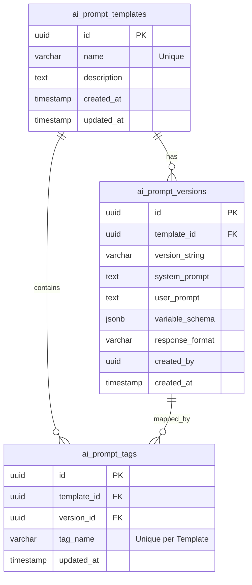

# Prompt Engineering Standards

## Purpose
This document establishes the prompt engineering standards, structured templating systems, and database models for NewsOps Cloud. Its purpose is to guarantee stable LLM behaviors, prevent prompt injection, define structured variables, and establish version control logic for prompts equivalent to software code.

## Executive Summary
Generative AI applications in modern newsrooms require reliable, structured, and auditable prompt execution. NewsOps Cloud addresses this by implementing a centralized Prompt Registry. Prompts are stored in PostgreSQL as versioned assets with defined JSON schemas for their input variables. At runtime, prompt templates are compiled using a Handlebars-like engine, validated against their variable contracts, and combined with system rules before execution. This design guarantees consistent outputs, eases model testing, and provides clear audit records.

## Vision
To treat prompt engineering as a first-class software engineering discipline. Every prompt is structured, typed, versioned, tested, and tracked, ensuring that LLM integrations are reliable, safe, and easily reproducible.

## Scope
This document covers:
1. Structured prompt template layout rules.
2. Injected variables, schema validation, and fallback values.
3. SemVer versioning and environment promotion workflows.
4. Database tables for prompt storage and evaluation.
5. UI standards for the Prompt Editor Control Panel.

It excludes the routing logic of models (covered in `ai_orchestration_architecture.md`) and the specific pricing formulas (covered in `cost_latency_routing.md`).

## Goals
- **Zero Raw Prompts**: Eliminate hardcoded strings in backend code; all prompts must be retrieved from the Prompt Registry.
- **Input Type-Safety**: Validate 100% of injected variables against their JSON schema definitions prior to API execution.
- **100% Auditability**: Maintain full traceability showing which prompt version generated a specific piece of publishing output.
- **Zero Downtime Updates**: Enable rolling releases and A/B testing of prompt variations without redeploying application code.

## Functional Requirements
- **JSON Schema Validation**: Reject requests to render a template if the provided variables fail to match the template's required variables schema.
- **Environment Tagging**: Promote prompt versions through tags (`development`, `staging`, `production`) to isolate active versions.
- **Unified Variables Interpolation**: Parse variables using double braces syntax `{{variable_name}}` and support conditional rendering blocks.

## Non-Functional Requirements
- **Render Overhead**: Compiling templates and validating variable inputs must complete in under 2ms.
- **Cache Read Latency**: Retrieve active production prompts from Redis cache in under 1ms.
- **Storage Limits**: Support templates of up to 100KB in character volume.

## Business Rules
- **SemVer Conformity**: Prompt modifications must increment versions using standard Semantic Versioning guidelines.
- **Structure Enforcement**: Every template must define three roles: `system` context, `user` instruction, and `response_schema` format constraints.
- **No Direct Mutation**: Published versions of prompt templates must be read-only; revisions must generate a new version entry.

## Actors
- **Prompt Engineer / Developer**: Builds templates, defines schemas, and tests completions.
- **Editorial Lead**: Approves prompt edits and controls deployment promotions to production workspaces.
- **AI Router Middleware**: Resolves, compiles, and sends prompts to upstream model endpoints.

## User Stories
- **User Story 1**: As a Prompt Engineer, I want to edit the "Article SEO Optimizer" prompt and specify that the variable `target_keyword` is a required string, so that the API fails early if the CMS client omits it.
- **User Story 2**: As an Editorial Lead, I want to check a diff between prompt versions `v2.1.0` and `v2.2.0` in the admin console so that I can confirm no compliance guidelines were removed.
- **User Story 3**: As a Platform Developer, I want to invoke `article_summary:production` from my service code so that I get the latest approved summary template without tracking specific version numbers.

## Acceptance Criteria
- Prompt templates must be stored with a JSON schema defining all injection variables.
- All prompt execution calls must validate variables against the schema and throw a `400 Bad Request` if parameters are missing or incorrect.
- Prompts must support fallback text blocks to prevent empty variable rendering.

## Workflows
### Prompt Editing and Testing Workflow
1. **Developer Access**: The prompt developer opens the Prompt Panel, selects a template (e.g., `article_translator`), and clones it to create a draft.
2. **Editing**: The developer edits the system instructions, adds a new variable (e.g., `formal_tone`), and updates the schema mapping.
3. **Sandbox Testing**: Runs executions in a test playground, providing values for `formal_tone` and verifying model responses.
4. **Saving**: Saves the draft, which generates a minor/patch version increment in the registry.

### Prompt Promotion and Tagging Workflow
1. **Evaluation**: An Editorial Lead selects a draft version `v1.4.0` currently tagged as `development`.
2. **Promotion to Staging**: Promotes the tag `staging` to point to `v1.4.0`. Content creators run tests in staging workspaces.
3. **Production Rollout**: After testing, the lead updates the `production` tag to point to `v1.4.0`. The Redis cache is updated instantly.

## API Design
### Prompt Template Registration API
Creates a new prompt template or registers a new version.

* **URL**: `/api/v1/ai/prompts`
* **Method**: `POST`
* **Headers**:
  * `Content-Type: application/json`
  * `Authorization: Bearer <JWT>`
* **Request Payload**:
```json
{
  "name": "article_seo_metadata",
  "description": "Generates optimized titles and descriptions for news articles.",
  "system_prompt": "You are a senior SEO specialist. Optimize metadata for: {{publication_name}}. Target keywords: {{keywords}}.",
  "user_prompt": "Article Body: {{article_body}}.\n\nGenerate: Title (max 60 chars) and Description (max 160 chars).",
  "variable_schema": {
    "type": "object",
    "properties": {
      "publication_name": { "type": "string" },
      "keywords": { "type": "string" },
      "article_body": { "type": "string", "minLength": 50 }
    },
    "required": ["publication_name", "article_body"]
  },
  "response_format": "json_object"
}
```
* **Response Payload (201 Created)**:
```json
{
  "id": "prompt-tmpl-888999",
  "name": "article_seo_metadata",
  "version": "1.0.0",
  "tags": ["development"],
  "created_by": "user-uuid-876",
  "created_at": "2026-06-27T22:20:19Z"
}
```

### Prompt Execution (Render) API
Compiles a template with variables and returns the raw structured prompt payload.

* **URL**: `/api/v1/ai/prompts/article_seo_metadata/render`
* **Method**: `POST`
* **Request Payload**:
```json
{
  "version_or_tag": "production",
  "variables": {
    "publication_name": "NewsOps Daily",
    "keywords": "politics, election, senate",
    "article_body": "Today the senate voted on the new bill after hours of intense debate..."
  }
}
```
* **Response Payload (200 OK)**:
```json
{
  "rendered_payload": {
    "messages": [
      {
        "role": "system",
        "content": "You are a senior SEO specialist. Optimize metadata for: NewsOps Daily. Target keywords: politics, election, senate."
      },
      {
        "role": "user",
        "content": "Article Body: Today the senate voted on the new bill after hours of intense debate...\n\nGenerate: Title (max 60 chars) and Description (max 160 chars)."
      }
    ],
    "response_format": { "type": "json_object" }
  },
  "version_used": "1.0.0"
}
```

## Database Design
The Prompt Engineering module uses three relational tables.

### `ai_prompt_templates` Table (Global Schema)
* `id`: UUID (Primary Key)
* `name`: VARCHAR(100) (Unique, Index)
* `description`: TEXT
* `created_at`: TIMESTAMP WITH TIME ZONE
* `updated_at`: TIMESTAMP WITH TIME ZONE

### `ai_prompt_versions` Table (Global Schema)
* `id`: UUID (Primary Key)
* `template_id`: UUID (Foreign Key -> `ai_prompt_templates.id`, Index)
* `version_string`: VARCHAR(20) (e.g., '1.0.0', '1.1.0')
* `system_prompt`: TEXT
* `user_prompt`: TEXT
* `variable_schema`: JSONB
* `response_format`: VARCHAR(50) (e.g., 'json_object', 'text')
* `created_by`: UUID (Index)
* `created_at`: TIMESTAMP WITH TIME ZONE

### `ai_prompt_tags` Table (Global Schema)
* `id`: UUID (Primary Key)
* `template_id`: UUID (Foreign Key -> `ai_prompt_templates.id`)
* `version_id`: UUID (Foreign Key -> `ai_prompt_versions.id`)
* `tag_name`: VARCHAR(50) (e.g., 'production', 'staging', 'development')
* `updated_at`: TIMESTAMP WITH TIME ZONE
* **Indexes**: Unique index on (`template_id`, `tag_name`) to ensure a tag maps to exactly one version per template.

## UI Design
The Prompt Studio interface contains:
- **Template Selector**: Sidebar list showing all templates, with tags (`PROD`, `STG`) highlighting live configurations.
- **Dual Prompts Panel**: Custom text editors with syntax highlighting that identifies `{{variable_names}}` dynamically in real-time.
- **Variables Configurator**: Side panel that lists variables, automatically rendering form inputs based on the variable schema.
- **Version Diff Tool**: Visual block comparisons showing additions in green and deletions in red between two selected versions.

## Permissions
- `ai:prompts:read`: View available templates, history, and schemas.
- `ai:prompts:write`: Create templates and save new draft versions.
- `ai:prompts:publish`: Assign environment tags (`production`, `staging`) to specific prompt versions.

## Security
- **Variable Verification**: Validate all user-supplied variables against the defined schema to ensure no executable control characters are added.
- **HTML Escaping**: Escape variables by default unless explicitly marked as safe, preventing the execution of hidden scripts.
- **Model Isolation**: When running prompts marked as `confidential`, redact all tenant PII (emails, names) using a local scrubbing proxy before sending the payload.

## Performance
- **Pre-Compilation**: Templates are pre-compiled and stored in Redis caches as parsed Abstract Syntax Trees (AST) to bypass string parsing limits.
- **Cache Invalidations**: When a version tag is updated, a Redis pub/sub event is triggered to clear the local server caches within 50ms.
- **Target Overhead**: Built to sustain 1,000 transactions per second (TPS) on the router orchestration layer.

## Monitoring
- **Prometheus Metric**: `ai_prompt_render_duration_seconds` (Histogram measuring compile and schema verification latency).
- **Prometheus Metric**: `ai_prompt_schema_violations_total` (Counter tracking validation rejections by template name).
- **Alert Trigger**: Trigger warning if `ai_prompt_schema_violations_total` exceeds 5% of requests for any prompt template.

## Logging
* **Log Pattern**: `{"timestamp": "%ISO8601%", "level": "INFO", "context": "PromptRegistry", "message": "Prompt rendered successfully", "metadata": {"templateName": "article_seo_metadata", "version": "1.0.0", "tagUsed": "production", "durationMs": 1.1}}`
* **Error Level**: `ERROR` for template parsing faults; `WARN` for schema validation failures.

## Error Handling
| Internal Error Code | HTTP Status | Customer-Facing Message |
|:---|:---|:---|
| `ERR_PROMPT_INVALID_VARIABLES` | 400 Bad Request | The variables provided do not match the required prompt structure. |
| `ERR_PROMPT_NOT_FOUND` | 404 Not Found | The requested prompt template or version could not be found. |
| `ERR_PROMPT_RENDER_FAILED` | 500 Internal Server Error | An internal error occurred while generating the prompt message. |

## Edge Cases
- **Circular References**: If a developer embeds a variable block that attempts to import itself (e.g., nested parameters), the rendering engine caps rendering depth at 3 levels, throwing an error on exceedance.
- **JSON Format Mismatches**: If a prompt specifies `response_format: json_object` but the upstream model fails to return valid JSON, the parser captures the parsing exception and executes a retry with a system prompt that explicitly repeats JSON compliance constraints.

## Future Improvements
- **Automated Prompt Optimization**: Implement genetic prompt engineering pipelines that continuously run mutations on user prompts and evaluate success ratios against publishing engagement metrics.
- **Zero-Shot Evaluation Testing**: Run automated regression suites using secondary model evaluators to verify that editing a prompt does not degrade output quality.

## Mermaid Diagrams
### Database Schema for Prompts & Versioning


## References
- Database Architecture Schema: [../03-database/index.md](../03-database/index.md)
- Multi-Provider Adapter Layouts: [ai_orchestration_architecture.md](./ai_orchestration_architecture.md)
- Dynamic Routing Config: [cost_latency_routing.md](./cost_latency_routing.md)
- BYO Model Key Storage: [byo_ai_model.md](./byo_ai_model.md)
