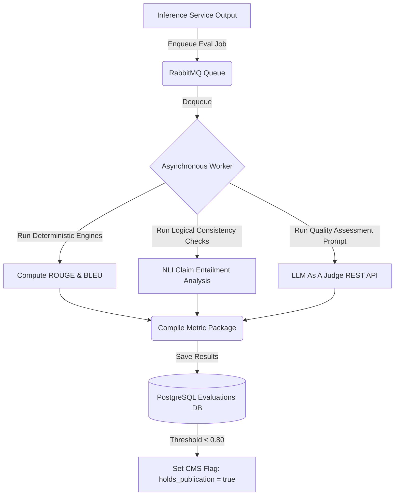

# AI Quality Evaluation Framework
## Purpose
This document specifies the technical design and execution guidelines for the AI Quality Evaluation Framework in the NewsOps Cloud digital publishing platform. It details automated evaluation pipelines, LLM-as-a-judge scoring patterns, deterministic metrics (ROUGE/BLEU), factuality validation logic, and user feedback integration loops.

## Executive Summary
To maintain professional journalism standards, NewsOps Cloud evaluates all AI-generated outputs (summaries, translations, metadata tagging) using automated quality tracking systems. The framework implements a dual-evaluation approach: real-time deterministic metrics (ROUGE, BLEU, edit distance) for immediate comparison, alongside asynchronous LLM-as-a-judge evaluators to verify factuality, alignment, and formatting compliance. Editors interact with inline rating controls, feeding human-in-the-loop corrections directly back into training and regression test datasets.

## Vision
The vision is to establish a self-optimizing publishing assistant. By continuously calculating factuality and linguistic metrics, the system detects hallucinations before publication and provides data scientists with high-quality datasets to execute automated model fine-tuning runs.

## Scope
The scope of this quality framework covers:
1. **Deterministic Quality Engine**: Core algorithms to compute ROUGE-1, ROUGE-2, ROUGE-L, BLEU, and Levenshtein Edit Distance.
2. **LLM-As-A-Judge Pipeline**: Automated prompt templates and JSON schemas to assess factuality and adherence to brand guidelines.
3. **Factuality Validation Pipeline**: Entailment and NLI (Natural Language Inference) models to detect hallucinated statements.
4. **User Feedback Collection**: Database records, UI modules, and APIs for thumbs rating and segment corrections.
5. **Regression Benchmarking**: Automated pipelines to compare prompt iterations against static ground-truth test sets.

## Goals
- **Factuality Accuracy**: Maintain accuracy of >= 92% in detecting hallucinations compared to manual human audit datasets.
- **Evaluation Latency**: Asynchronous calculations complete and write to the database in under 3 seconds.
- **User Engagement**: Capture editor correction data for at least 80% of rejected generation segments.
- **Continuous Alignment**: Track longitudinal quality performance trends across model releases.

## Functional Requirements
1. **Linguistic Metrics Processor**: A python-based worker service that compares generated text against reference text, outputting standard ROUGE and BLEU indexes.
2. **Structured LLM Evaluator**: An automated judge service that sends the generated output, input context, and reference criteria to a secondary model, receiving a structured evaluation report.
3. **Hallucination Detection Engine**: Segment text into claims, comparing each claim against the source document using an NLI schema to verify logical entailment.
4. **Feedback Logging System**: Intercept editor modifications in the CMS, compute the Levenshtein distance between the AI output and final version, and save the transaction.
5. **Dashboard Analytics Reporter**: Compile metrics by team, article type, and active model, generating dashboards for team editors.

## Non-Functional Requirements
- **Out-of-Band Calculation**: The evaluation processor must run asynchronously via message queues (Celery/RabbitMQ) to prevent blocking the user UI.
- **Data Protection**: Automatically strip personally identifiable information (PII) from evaluation logs before sending data to third-party LLMs for judging.
- **Scalability**: Support analysis of up to 10,000 evaluations per hour.

## Business Rules
1. **Low Quality CMS Hold**: Any generated article with a factuality score below 0.80 must be placed on CMS hold and cannot be published without manual review.
2. **Review Priority**: If an editor flags an article as "Inaccurate," the system must enqueue the article for QA verification.
3. **Ground-Truth Preservation**: Only entries corrected by verified Chief Editors or Admins are marked as `ground_truth = true` for training datasets.

## Actors
1. **Editor**: Generates content, provides thumbs rating, and makes inline corrections.
2. **QA Analyst**: Reviews performance trends, inspects low-scoring outputs, and updates prompt configurations.
3. **Automated Evaluator Service**: Calculates metrics, triggers NLI classification, and queries the judge model.
4. **Data Scientist**: Exports ground-truth datasets for fine-tuning.

## User Stories (At least 3 specific stories)
1. **Submitting Performance Feedback**: As an Editor reviewing a translated segment, I want to click a "thumbs-down" button and type a correction, so that the AI engineering team receives the data needed to fix the translation prompt.
2. **Automatic Quality Hold**: As a Chief Editor, I want the system to block publishing of an AI-generated summary if the factuality check detects a hallucination, so that inaccurate statistics are never published.
3. **Evaluating Prompt Iterations**: As a QA Analyst, I want to run a test suite comparing prompt template v1 to prompt template v2 across 200 reference articles, so that I can see which version achieves higher ROUGE scores.

## Acceptance Criteria (At least 3-5 criteria with clear thresholds)
1. **Judge JSON Response**: The LLM-as-a-judge endpoint must return a structured JSON response containing `factuality_score` (numeric float between 0.0 and 1.0), `hallucinations_detected` (array of objects with claim and explanation), and `style_alignment_score` (float).
2. **Metric Latency**: ROUGE and BLEU calculation for a 500-word paragraph must finish in less than 50ms on standard worker nodes.
3. **Entailment Classification**: The factuality verification pipeline must accurately classify known contradictions in test suites with a precision score >= 0.90.
4. **Audit DB Ingestion**: User feedback operations must write to the database and invalidate cached metrics in under 150ms.

## Workflows (Step-by-step description of system and user interactions)
### Post-Generation Quality Evaluation Workflow
1. **Content Generated**: LLM completes a generation task (e.g. summary).
2. **Metric Enqueue**: Gateway writes the output and enqueues a Celery task.
3. **Linguistic Metric Calculation**: Worker calculates BLEU and ROUGE against the source context.
4. **NLI Claim Verification**:
   - Worker splits generated text into sentences (claims).
   - Worker queries NLI model to classify relationship (Entailment, Neutral, Contradiction).
5. **LLM-As-A-Judge Call**:
   - Worker formats evaluation prompt with source, generated text, and guidelines.
   - Worker calls secondary evaluation model with strict JSON schema response requirements.
6. **Database Write**: Metrics are compiled and saved in the `ai_evaluations` table.
7. **Quality Alert**: If scores fall below limits, CMS hold flag is set to true.

## API Design (Provide actual REST endpoints, method, request/response JSON payloads, or GraphQL schemas)
### Submit Evaluation Task
- **Endpoint**: `POST /api/v1/ai/evaluations`
- **Headers**:
  - `Content-Type: application/json`
  - `Authorization: Bearer <JWT>`
- **Request Body**:
```json
{
  "task_id": "art_task_8877",
  "model_name": "gpt-4o",
  "input_context": "The company reported profits of $45M this quarter, up from $40M last quarter.",
  "generated_text": "The company reported profits of $54M this quarter, representing positive growth.",
  "reference_text": "The company reported quarterly profits of $45M, up from $40M."
}
```
- **Response Body (202 Accepted)**:
```json
{
  "eval_id": "eval_88990011",
  "task_id": "art_task_8877",
  "status": "processing",
  "created_at": "2026-06-27T22:20:19Z"
}
```

### Get Evaluation Results
- **Endpoint**: `GET /api/v1/ai/evaluations/{evalId}`
- **Headers**:
  - `Authorization: Bearer <JWT>`
- **Response Body (200 OK)**:
```json
{
  "eval_id": "eval_88990011",
  "task_id": "art_task_8877",
  "status": "completed",
  "metrics": {
    "rouge_1": 0.88,
    "rouge_2": 0.80,
    "rouge_l": 0.85,
    "bleu": 0.78,
    "edit_distance": 8
  },
  "judge_report": {
    "factuality_score": 0.20,
    "hallucinations_detected": [
      {
        "claim": "profits of $54M",
        "reference": "$45M this quarter",
        "explanation": "The AI transposed the digits 4 and 5, resulting in an incorrect profit statement."
      }
    ],
    "style_alignment_score": 0.90,
    "verdict": "fail"
  },
  "created_at": "2026-06-27T22:20:22Z"
}
```

### Save User Feedback
- **Endpoint**: `POST /api/v1/ai/evaluations/{evalId}/feedback`
- **Headers**:
  - `Content-Type: application/json`
  - `Authorization: Bearer <JWT>`
- **Request Body**:
```json
{
  "rating": 1, 
  "corrected_text": "The company reported profits of $45M this quarter, representing positive growth.",
  "categories": ["factual_error", "number_transposition"]
}
```
- **Response Body (200 OK)**:
```json
{
  "feedback_id": "feed_77665544",
  "eval_id": "eval_88990011",
  "edit_distance_corrected": 2,
  "status": "processed",
  "created_at": "2026-06-27T22:20:45Z"
}
```

## Database Design (Identify schema tables, fields, and indexes relevant to this feature)
### Quality and Feedback Schema

```sql
-- Main Evaluations table
CREATE TABLE ai_evaluations (
    eval_id UUID PRIMARY KEY DEFAULT uuid_generate_v4(),
    task_id VARCHAR(50) NOT NULL,
    model_name VARCHAR(100) NOT NULL,
    input_prompt TEXT NOT NULL,
    output_text TEXT NOT NULL,
    reference_text TEXT,
    rouge_scores JSONB DEFAULT '{}'::jsonb NOT NULL, -- {rouge_1: 0.8, rouge_2: 0.7}
    bleu_score NUMERIC(4,3),
    judge_score NUMERIC(3,2) NOT NULL DEFAULT 1.00,
    judge_reason TEXT,
    hallucinations_list JSONB DEFAULT '[]'::jsonb NOT NULL,
    created_at TIMESTAMP WITH TIME ZONE DEFAULT CURRENT_TIMESTAMP NOT NULL
);

-- User Feedback table
CREATE TABLE ai_user_feedback (
    feedback_id UUID PRIMARY KEY DEFAULT uuid_generate_v4(),
    eval_id UUID REFERENCES ai_evaluations(eval_id) ON DELETE CASCADE,
    user_id VARCHAR(50) NOT NULL,
    rating INTEGER NOT NULL CHECK (rating IN (-1, 0, 1)), -- -1 = thumbs down, 1 = thumbs up
    corrected_text TEXT,
    edit_distance INTEGER,
    categories TEXT[] DEFAULT '{}'::text[] NOT NULL,
    is_ground_truth BOOLEAN DEFAULT false NOT NULL,
    created_at TIMESTAMP WITH TIME ZONE DEFAULT CURRENT_TIMESTAMP NOT NULL
);

-- Target regression test suite configurations
CREATE TABLE ai_eval_test_suites (
    suite_id UUID PRIMARY KEY DEFAULT uuid_generate_v4(),
    name VARCHAR(100) NOT NULL,
    description TEXT,
    created_at TIMESTAMP WITH TIME ZONE DEFAULT CURRENT_TIMESTAMP NOT NULL
);

-- Single test suite case mapping
CREATE TABLE ai_eval_test_cases (
    case_id UUID PRIMARY KEY DEFAULT uuid_generate_v4(),
    suite_id UUID NOT NULL REFERENCES ai_eval_test_suites(suite_id) ON DELETE CASCADE,
    input_context TEXT NOT NULL,
    target_reference TEXT NOT NULL,
    expected_assertions JSONB DEFAULT '[]'::jsonb NOT NULL -- array of criteria checks
);

-- Database indexes
CREATE INDEX idx_eval_task ON ai_evaluations(task_id);
CREATE INDEX idx_eval_score ON ai_evaluations(judge_score);
CREATE INDEX idx_feedback_eval ON ai_user_feedback(eval_id);
CREATE INDEX idx_feedback_truth ON ai_user_feedback(is_ground_truth) WHERE is_ground_truth = true;
CREATE INDEX idx_test_cases_suite ON ai_eval_test_cases(suite_id);
```

## UI Design (Describe component structure, layouts, actions, and states)
### Quality Analytics Dashboard and Feedback Interface
The system provides a quality analytics panel and a human correction widget.

#### 1. Panel Layout
- **Quality Console (Dashboard View)**: Shows aggregates of system accuracy. Graphs show Average Factuality Score (line chart), Error Classifications (pie chart of tags like "factual_error", "unnatural_phrasing"), and feedback counts.
- **Prompt Benchmarking Panel**: Allows comparison of prompt runs. Select two runs side-by-side to compare BLEU scores, evaluation timelines, and detailed test case comparison tables.
- **CMS Translation/Summary Inline Reviewer**: Displays the generated text. Clicking the thumb icons triggers the prompt overlay. Thumbs-down triggers a textarea to input the correct phrasing.

#### 2. Visual States
- **Hallucination Red Flag Warning**: Highlight generated text inline in red when `judge_score` < 0.70, with a hovercard displaying the judge's reasoning.
- **Dataset Export Ready Toast**: Triggers once enough corrections are collected. Shows "200 verified ground-truth cases collected. [Export Fine-Tuning JSON]".

## Permissions (Specify RBAC permissions required, e.g., organizations:read, articles:write)
- `ai:eval:read`: Access metrics dashboards, test reports, and audit details.
- `ai:eval:write`: Trigger evaluation runs, submit feedback ratings, and add test cases.
- `ai:eval:admin`: Delete evaluation run history, manage regression suites, export fine-tuning sets.

## Security (Detail security considerations, e.g., input validation, CSRF, JWT validation)
- **Data Anonymization Filter**: Run regex masking on inputs to replace email addresses, names, and phone numbers before dispatching to external LLMs for evaluation.
- **Secure Feedback API**: Enforce rate-limits on the feedback submission endpoint (max 60 feedback submits/minute per user) to prevent spamming database metrics.

## Performance (State latency limits, caching requirements, target TPS)
- **Queue Latency**: Calculation of deterministic scores must complete within 2 seconds of enqueueing.
- **Concurrent Evaluator Runs**: System capacity permits testing 100 concurrent test cases in under 1 minute.
- **Storage Strategy**: Large source texts are saved to S3 and referenced in the DB using URIs to prevent database bloat.

## Monitoring (Detail Prometheus metrics names, alert triggers)
- **Prometheus Metrics**:
  - `newsops_ai_factuality_score_average` (Gauge tracking rolling average evaluation scores)
  - `newsops_ai_feedback_count` (Counter tracking thumbs up/down partitioned by rating)
  - `newsops_evaluator_queue_backlog` (Gauge tracking pending analysis tasks)
- **Alert triggers**:
  - `FactualityDropWarning`: Fire warning alert if 1-hour average factuality score falls below 0.85.
  - `EvaluatorQueueLag`: Fire warning alert if Celery queue backlog stays > 500 cases for over 10 minutes.

## Logging (Specify log formats, error levels, log contexts)
- **Log Context**: JSON structure matching:
  ```json
  {"timestamp": "2026-06-27T22:20:19Z", "level": "INFO", "eval_id": "eval_88990011", "judge_verdict": "fail", "score": 0.20, "hallucinations_count": 1}
  ```
- **Conventions**:
  - `INFO`: Metric calculated, LLM-as-a-judge completes, feedback recorded.
  - `WARN`: Low score warning issued, NLI verification returns contradiction.
  - `ERROR`: Evaluation job execution failure, database storage timeout.

## Error Handling (Map input/system error codes to HTTP status and customer-facing messages)
| Error Code | HTTP Status | Customer-Facing Message | System Trigger Context |
|---|---|---|---|
| `ERR_EVAL_TARGET_EMPTY` | 400 Bad Request | Cannot run analysis on empty text fields. | Input target or reference text is empty or missing. |
| `ERR_JUDGE_MODEL_TIMEOUT` | 504 Gateway Timeout | Quality analysis took too long. Running validation checks. | The evaluator LLM did not respond within the 5-second deadline. |
| `ERR_INVALID_FEEDBACK_RATING` | 422 Unprocessable Entity | Feedback rating must be -1, 0, or 1. | Input rating values outside the permitted range. |

## Edge Cases (Handle race conditions, rate limit hits, upstream timeouts)
- **Adversarial Feedback Poisoning**: A user consistently flags valid translations as inaccurate. Mitigation: Track user correction patterns. If a user's average edit distance is < 2 characters but rating is consistently negative, mark user feedback as low confidence and exclude from ground-truth training exports.
- **Judge Hallucination**: The evaluation model itself hallucinating when assessing factuality. Mitigation: Implement strict few-shot prompt schemas, requiring the judge model to quote matching lines from the reference context for every negative claim.
- **Out of Context Vocabulary**: Reference text lacks key background info needed by the judge. Mitigation: The gateway appends historical semantic context from the vector database to the evaluation prompt structure.

## Future Improvements (Provide long-term scaling, architecture refactor paths)
- **Self-Improving Prompts (DSPy)**: Implement automated prompt optimization loops where low-scoring metrics automatically trigger prompt variations to find the configuration with the highest average BLEU score.
- **RLAIF Integration**: Deploy automated feedback logs directly to an offline alignment training pipeline, reducing dependency on human manual evaluations.

## Mermaid Diagrams (Include at least one high-quality diagram: flowchart, sequence, or ERD)
### Evaluation Execution Pipeline


## References (Reference other related files in the repository using standard relative markdown links, e.g., '../02-architecture/system_architecture.md')
- [Editorial and CMS Schema Specification](../03-database/editorial_and_cms_schema.md)
- [Audit and History Database Schema](../03-database/audit_and_history_schema.md)
- [Event-Driven Architecture Integration Patterns](../02-architecture/event_driven_design.md)
- [AI Memory Context Management Design](../04-ai/ai_memory_architecture.md)
