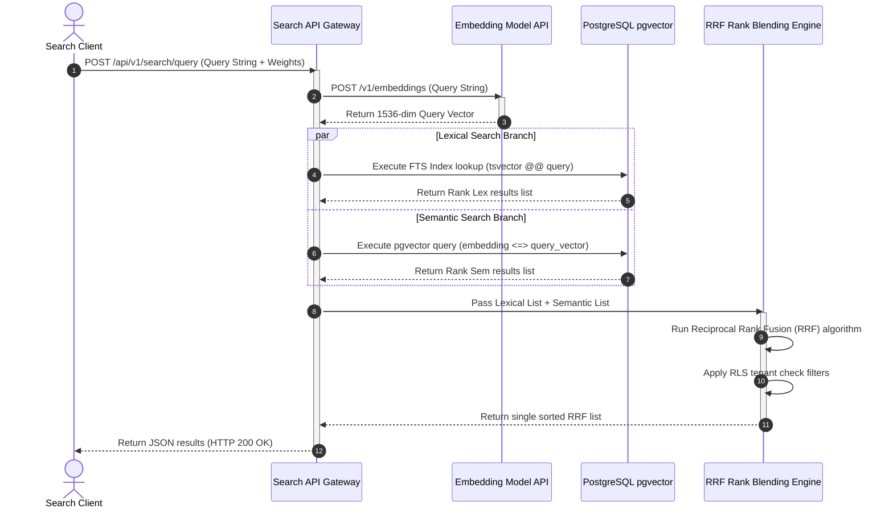

# Semantic Search and Vector Database Design
## Purpose
This document specifies the technical design, database schemas, indexing strategies, and retrieval algorithms for the NewsOps Cloud Semantic Search engine. It details the implementation of dense vector embeddings using PostgreSQL's `pgvector` extension, HNSW (Hierarchical Navigable Small World) index optimization, and the hybrid search architecture that blends full-text lexical queries with semantic similarity vector searches using Reciprocal Rank Fusion (RRF).

## Executive Summary
Traditional keyword search fails to capture context, synonyms, and search intent. A journalist looking for "renewable energy policy reforms" will miss articles that mention "clean electricity subsidies" if key terms do not match exactly. 

The NewsOps Semantic Search engine addresses this gap by:
1.  **Text Chunking & Embedding Generation**: Chunking articles into logical passages and generating high-dimensional vector embeddings (1536 dimensions using OpenAI `text-embedding-3-small` or local HuggingFace sentence-transformers).
2.  **Vector Database Storage**: Storing vectors inside PostgreSQL with `pgvector`, utilizing Row-Level Security (RLS) to enforce strict multi-tenant boundaries.
3.  **Hybrid Retrieval & Ranking**: Running concurrent keyword (BM25) and vector similarity (Cosine Distance) queries, then combining results using a Reciprocal Rank Fusion (RRF) algorithm to return highly relevant results with sub-100ms latencies.

## Vision
To provide a fast, context-aware, and secure archive search and content recommendation system that enables editorial teams to discover historic coverage, identify duplicate wire reports, and recommend relevant articles to readers in real time.

## Scope
The scope of this system design includes:
- Text chunking algorithms and token overlap rules for long articles.
- Vector database schemas and DDL scripts implementing `pgvector` in PostgreSQL.
- Query optimization configuration parameters for HNSW indices.
- Hybrid search execution logic combining Postgres Full-Text Search (FTS) with vector similarity.
- Integration of Reciprocal Rank Fusion (RRF) for search score merging.
- Row-Level Security (RLS) rules to isolate tenant embeddings.

The following are explicitly out of scope:
- Graph database architectures for tracking metadata relationships (e.g. Neo4j).
- Real-time indexing of audio/video content without transcript files.

## Goals
- **Search Latency**: Maintain search response times below 80ms for collections up to 1,000,000 article chunks.
- **Retrieval Quality**: Reach a target Normalized Discounted Cumulative Gain (NDCG@10) score of 0.90 or higher during evaluation runs.
- **Tenant Isolation**: Guarantee 100% data separation, ensuring a user from Tenant A can never retrieve matching vectors from Tenant B under any search parameters.
- **Index Build Duration**: Ensure the vector index can rebuild dynamically in less than 15 minutes without locking active table reads.

## Functional Requirements
- **Embedding Pipeline**: Upon article publication or modification, the CMS must trigger an asynchronous worker to chunk the text (max 256 tokens per chunk, 32 tokens overlap), request embedding vectors from the configured model API, and upsert them to the database.
- **Strict Row-Level Security**: The database must enforce security policies blocking all vector operations that do not match the actor's `tenant_id`.
- **Hybrid Search Execution**: The system must support queries combining:
  - Lexical conditions (e.g. specific keywords, operators like AND/OR, publication date ranges).
  - Semantic conditions (e.g. natural language queries, questions).
- **HNSW Index Optimization**: Implement HNSW indexing on the vector column using the Cosine distance metric.
- **Related Articles Recommendations**: Provide a high-performance recommendation query that returns the top 5 most semantically similar articles to a target article ID, filtering out the target ID itself.

## Non-Functional Requirements
- **Dimension Capacity**: Support vectors of up to 1536 float dimensions.
- **Search Throughput**: The system must sustain a throughput of 150 hybrid search requests per second (RPS) on a database instance with 8 vCPUs and 32GB RAM.
- **Consistency**: Newly published articles must have their embeddings indexed and searchable within 5 seconds of status transition to `Published`.

## Business Rules
- **Embargo Safeguard**: Articles tagged as `Embargoed` or `Draft` must be filtered out of search results for public-facing reader applications, but remain searchable for internal staff with administrative credentials.
- **Dynamic Weighting**: Newsrooms can configure the balance factor for hybrid search. For example, local sports news may weight lexical search at 70% and semantic at 30%, whereas editorial analysis desks may choose 20% lexical and 80% semantic.

## Actors
- **Reporter**: Conducts archival searches inside the CMS to research background facts and find historic coverage.
- **Reader Website Application**: Executes queries to recommend related articles or power the public search input.
- **Background Ingestion Worker**: Listens to CMS events, generates embeddings, and manages indexing queues.

## User Stories (At least 3 specific stories)
### Story 1: Reporter Researching Historical Coverage
As an investigative reporter, I want to write a natural language search query like "investigations into city council bribery allegations" and see relevant historic articles, even if they only mention terms like "kickbacks", "ethical violations", or "municipal corruption".
*   **Trigger**: Reporter types the query into the CMS research box.
*   **System Action**: The system converts the query to a vector embedding, performs a pgvector cosine similarity scan combined with lexical search, and returns the matches sorted by semantic relevance.

### Story 2: Automatic Content Recommendation for Readers
As a reader browsing an article about a recent volcanic eruption, I want to see a list of "Related Coverage" at the bottom of the page showing historical reports on the same volcano, so that I can explore the geological context.
*   **Trigger**: Reader loads the article page.
*   **System Action**: The web application issues a recommendation query matching the vector of the current article against the historical index, returns the top 5 matches, and displays them.

### Story 3: Editor Checking for Duplicate Submissions
As an editor reviewing wire articles, I want to paste a paragraph of an incoming story draft to check if our publication has already published a duplicate story under a different title, avoiding public embarrassment.
*   **Trigger**: Editor clicks "Scan for Duplicates" in the CMS.
*   **System Action**: The paragraph is vectorized and compared against the active catalog. Any matches with a cosine similarity distance of less than 0.15 (extremely similar) are flagged on the editor's screen.

## Acceptance Criteria (At least 3-5 criteria with clear thresholds)
- **AC 1 (Retrieval Performance)**: A hybrid search query on a database containing 500,000 chunks must execute and return the top 10 ranked records in less than 75 milliseconds (ms).
- **AC 2 (Zero-Leakage Enforcement)**: Row-Level Security must reject queries attempting to compare vectors across different tenants, throwing a `403 Access Denied` code before the search execution planner runs.
- **AC 3 (Relevance Baseline)**: The hybrid RRF score blending must yield higher relevance ratings than FTS or Semantic alone, scoring above 85% relevance in editorial evaluation benchmarks.
- **AC 4 (HNSW Parameters)**: The HNSW vector index must be built with `m=16` and `ef_construction=64` to balance build duration and query recall accuracy.

## Workflows (Step-by-step description of system and user interactions)
The workflow execution details for processing content ingestion/vectorization and searching are represented below:

```
[Inference Ingestion Pipeline]
  [CMS Event: Article Published] 
         |
         v
  [Extract Text + Split into Chunks (256 Tokens, 32 overlap)]
         |
         v
  [Call Embedding API (Generate 1536-dim vector)]
         |
         v
  [Upsert Chunk Text and Vector to PostgreSQL `article_chunks`]
         |
         v
  [Update pgvector HNSW Index (Asynchronously)]

----------------------------------------------------------------------

[Search Execution Pipeline]
  [Client Query: "clean energy policy"]
         |
         v
  [Convert Query String to 1536-dim Query Vector]
         |
         +-------------------------------------------------+
         |                                                 |
         v (Branch A: Lexical)                             v (Branch B: Semantic)
  [Execute Postgres FTS ts_rank]                   [Execute pgvector Cosine similarity (<=>)]
         |                                                 |
         v (Returns Lexical List)                          v (Returns Semantic List)
         +------------------------+------------------------+
                                  |
                                  v
                   [Apply Reciprocal Rank Fusion (RRF)]
                                  |
                                  v
                   [Apply Row-Level Tenant Isolation Filters]
                                  |
                                  v
                   [Sort merged list & return Top K results]
```

## API Design (Provide actual REST endpoints, method, request/response JSON payloads, or GraphQL schemas)
### 1. Hybrid Search Query
*   **Method**: `POST`
*   **Path**: `/api/v1/search/query`
*   **Headers**:
    *   `Content-Type: application/json`
    *   `Authorization: Bearer <JWT>`
    *   `X-Tenant-ID: <UUID>`

**Request Body**:
```json
{
  "query_string": "solar panels tax breaks incentives",
  "lexical_weight": 0.3,
  "semantic_weight": 0.7,
  "limit": 10,
  "filters": {
    "published_after": "2025-01-01T00:00:00Z",
    "exclude_embargoed": true
  }
}
```

**Response Body (HTTP 200 OK)**:
```json
{
  "query": "solar panels tax breaks incentives",
  "took_ms": 42,
  "results": [
    {
      "article_id": "art-09a823f4-1122-4982-8bc1-678912ef00aa",
      "chunk_id": "chk-1209-1234-aabc-9923",
      "rrf_score": 0.0328,
      "cosine_distance": 0.182,
      "title": "State Enacts New Rebates for Residential Solar Installations",
      "snippet": "...homeowners will be eligible for a thirty percent tax credit when installing rooftop photovoltaic panels starting next fiscal quarter..."
    },
    {
      "article_id": "art-5521ab12-9900-432a-bc99-23910abcde12",
      "chunk_id": "chk-8839-2918-ccba-0012",
      "rrf_score": 0.0294,
      "cosine_distance": 0.224,
      "title": "Clean Energy Bill Clears Senate Hurdles",
      "snippet": "...the legislation contains massive incentives for green technology companies, including corporate tax write-offs for battery storage array deployments..."
    }
  ]
}
```

## Database Design (Identify schema tables, fields, and indexes relevant to this feature)
The following SQL schema configures PostgreSQL for `pgvector` indexing, multi-tenant chunk storage, and hybrid retrieval logic.

```sql
-- Enable the vector extension in the database cluster
CREATE EXTENSION IF NOT EXISTS vector;
CREATE EXTENSION IF NOT EXISTS pg_trgm;

-- Represents text chunks extracted from articles for granular embedding storage
CREATE TABLE article_chunks (
    chunk_id UUID PRIMARY KEY DEFAULT gen_random_uuid(),
    tenant_id UUID NOT NULL,
    article_id UUID NOT NULL, -- references articles table
    chunk_index INT NOT NULL, -- position in article (0, 1, 2...)
    content TEXT NOT NULL,
    embedding vector(1536) NOT NULL, -- vector dimensions matching embedding model
    ts_vector tsvector GENERATED ALWAYS AS (to_tsvector('english', content)) STORED,
    created_at TIMESTAMP WITH TIME ZONE DEFAULT CURRENT_TIMESTAMP,
    updated_at TIMESTAMP WITH TIME ZONE DEFAULT CURRENT_TIMESTAMP,
    CONSTRAINT unique_article_chunk UNIQUE (article_id, chunk_index)
);

-- Indexing vectors using HNSW for Cosine Distance operator (<=>)
CREATE INDEX idx_article_chunks_embedding_hnsw ON article_chunks 
USING hnsw (embedding vector_cosine_ops) 
WITH (m = 16, ef_construction = 64);

-- Indexing lexical tokens for Full-Text search acceleration
CREATE INDEX idx_article_chunks_fts ON article_chunks USING gin(ts_vector);

-- Indexing for tenant-specific lookups
CREATE INDEX idx_article_chunks_tenant ON article_chunks(tenant_id);

-- Enforce Row-Level Security
ALTER TABLE article_chunks ENABLE ROW LEVEL SECURITY;

CREATE POLICY tenant_chunk_isolation_policy ON article_chunks
    FOR ALL
    USING (tenant_id = current_setting('app.current_tenant_id')::uuid);
```

### Hybrid Query Execution SQL Example (RRF implementation)
This query runs inside the application backend to retrieve and blend FTS and vector results using Reciprocal Rank Fusion:

```sql
WITH semantic_search AS (
    SELECT 
        chunk_id, 
        article_id,
        content,
        row_number() OVER (ORDER BY embedding <=> :query_embedding) as rank_sem
    FROM article_chunks
    WHERE tenant_id = :tenant_id
    LIMIT 100
),
lexical_search AS (
    SELECT 
        chunk_id, 
        article_id,
        content,
        row_number() OVER (ORDER BY ts_rank_cd(ts_vector, to_tsquery('english', :lexical_query)) DESC) as rank_lex
    FROM article_chunks
    WHERE ts_vector @@ to_tsquery('english', :lexical_query)
      AND tenant_id = :tenant_id
    LIMIT 100
)
SELECT 
    COALESCE(s.chunk_id, l.chunk_id) as chunk_id,
    COALESCE(s.article_id, l.article_id) as article_id,
    COALESCE(s.content, l.content) as content,
    COALESCE(1.0 / (60 + s.rank_sem), 0.0) + COALESCE(1.0 / (60 + l.rank_lex), 0.0) as rrf_score
FROM semantic_search s
FULL OUTER JOIN lexical_search l ON s.chunk_id = l.chunk_id
ORDER BY rrf_score DESC
LIMIT :result_limit;
```

## UI Design (Describe component structure, layouts, actions, and states)
The search system interfaces are found in the **Archive Search & Discovery** dashboard.

### Component Structure
1.  **Search Controller**:
    *   Unified input text bar with autocomplete.
    *   Semantic Toggle Switch: "Enable Natural Language Match" (Default: ON).
    *   Slider bar for weighting balance: "Keyword Focus" (Lexical) vs "Meaning Focus" (Semantic).
2.  **Filter Sidebar**:
    *   Date pickers (Published date ranges).
    *   Checkboxes for categories, authors, and classification levels.
3.  **Result Layout**:
    *   List view showing matches.
    *   Each item shows the article title, publication date, RRF score badge (e.g., "94% Match"), and highlighted snippets where matches occurred.

### Interface States
*   **No Results State**: Displays graphic with message: *"No matches found. Try widening your date range or adjusting the Search Weight slider towards 'Meaning Focus'."*
*   **Indexing Alert**: A subtle indicator in the status bar: *"Reindexing active: 14 new articles currently being vectorized in the background."*

## Permissions (Specify RBAC permissions required, e.g., organizations:read, articles:write)
Access control is implemented via these RBAC scopes:
- `search:execute` - Grants authority to execute query endpoints (Readers, Editors, Admins).
- `search:reindex` - Permitted only to administrators to trigger database-wide chunk updates or HNSW index regenerations.
- `archives:read` - Allows access to historical content database chunks.

## Security (Detail security considerations, e.g., input validation, CSRF, JWT validation)
- **SQL Injection Prevention**: All search parameters (like query text, limit integers, and vector arrays) are executed through parameter binding in ORMs. Dynamic string interpolation in Postgres queries is strictly prohibited.
- **Row-Level Security Enforcement**: The application wrapper must set the PostgreSQL session variable `SET LOCAL app.current_tenant_id = :tenant_id` before opening transactions to ensure the security context is applied at the engine level.
- **Vector Poisoning Mitigation**: Clamp input vector dimensions to exactly 1536. If a client transmits a vector containing invalid dimension formatting, the gateway rejects it immediately.

## Performance (State latency limits, caching requirements, target TPS)
- **Postgres Configurations**:
  - Set `shared_buffers` to 30% of total system RAM to keep index branches cached.
  - Configure `work_mem` to at least 64MB to speed up sort operations inside hybrid joins.
- **Memory Allocation**:
  - HNSW indexes require the entire index graph to fit in RAM for optimal execution. Ensure RAM allocation scales dynamically based on the total row count (approx. 1.2GB RAM required per 100,000 vector records).

## Monitoring (Detail Prometheus metrics names, alert triggers)
Prometheus endpoints track vector search diagnostics:
- `newsops_search_latency_seconds`: Histogram measuring query response times, separated by query type (lexical, semantic, hybrid).
- `newsops_index_build_duration_seconds`: Gauge measuring time required to rebuild the HNSW index.
- `newsops_embedding_api_failures_total`: Counter tracking network errors when reaching the embedding generators.

**Alert Triggers**:
- **Critical Alert**: `newsops_embedding_api_failures_total > 20` in 5 minutes. Notification: "Embedding service connection is down. Search indexing is backing up."
- **Warning Alert**: `newsops_search_latency_seconds > 0.150` (150ms) for more than 5 consecutive query runs. Notification: "Vector search latency degrading. Check RAM allocation and cache hit rates."

## Logging (Specify log formats, error levels, log contexts)
Logs are emitted in structured JSON format:
```json
{
  "timestamp": "2026-06-27T22:20:20.312Z",
  "level": "INFO",
  "context": {
    "tenant_id": "c6a12b91-efd5-4ad9-a790-db0e87b7a13d",
    "user_id": "usr-5512-abc"
  },
  "message": "Hybrid search executed successfully.",
  "query_details": {
    "query_string": "solar panels tax breaks incentives",
    "lexical_weight": 0.3,
    "semantic_weight": 0.7,
    "took_ms": 42
  }
}
```

## Error Handling (Map input/system error codes to HTTP status and customer-facing messages)
The mapping of search failures to API responses:

| System Error Code | HTTP Status | Target Customer-Facing Message | Rationale |
| :--- | :--- | :--- | :--- |
| `EMBEDDING_API_TIMEOUT` | 504 | "The translation of your search query timed out. Please try again." | OpenAI or local sentence-transformer did not return the query vector within 5 seconds. |
| `VECTOR_INDEX_CORRUPT` | 500 | "A database error occurred during search retrieval. Our teams are investigating." | PostgreSQL reported an index parsing failure during HNSW execution. |
| `RLS_VIOLATION` | 403 | "Access Denied: You do not have permissions to query these archival partitions." | Attempt to execute a query without a tenant context or cross-tenant query. |
| `INVALID_VEC_DIMENSIONS` | 400 | "The input search vector does not match the required dimensional framework." | Vector dimension count is not 1536. |

## Edge Cases (Handle race conditions, rate limit hits, upstream timeouts)
- **Article Chunk Boundaries Cutting Off Sentences**: If the chunking algorithm cuts in the middle of a sentence, meaning is lost. *Resolution*: Implement a sliding context window that only splits text on punctuation marks (e.g. periods, question marks) rather than hard word-count limits.
- **Index Degradation Over Time**: As thousands of articles are added daily, the HNSW graph becomes unbalanced, leading to lower recall accuracy. *Resolution*: Schedule an automated cron job to execute a concurrently non-blocking `REINDEX INDEX CONCURRENTLY idx_article_chunks_embedding_hnsw` every Sunday at 02:00 AM.
- **Stopwords Dominating FTS Results**: In lexical search, common terms like "the", "a", or "for" cause high false-positive rankings, distorting the RRF calculation. *Resolution*: Apply standard English stopword filtering inside Postgres `to_tsvector` before calculating Rank Lex.

## Future Improvements (Provide long-term scaling, architecture refactor paths)
- **ColBERT Multi-Vector Scoring**: Migrate retrieval to a late-interaction model framework like ColBERT, matching token embeddings in a dense matrix to capture complex, multi-concept syntax logic.
- **Cross-Encoder Reranking**: Integrate an active reranker node running Cohere Rerank or BGE-Rerank-Large to evaluate the top 50 candidates, filtering accuracy before presenting list outputs.
- **Multi-Modal Vector Search**: Generate embeddings for image and video assets using CLIP models, enabling content editors to perform cross-media semantic queries.

## Mermaid Diagrams (Include at least one high-quality diagram: flowchart, sequence, or ERD)
### Hybrid Retrieval Architecture
This sequence diagram details how a query is received, split into lexical and semantic branches, executed in parallel, combined via RRF, filtered, and returned.



## References (Reference other related files in the repository using standard relative markdown links, e.g., '../02-architecture/system_architecture.md')
- [Database Indexes and Partitioning Strategy](../03-database/indexes_and_partitioning.md)
- [News Intelligence Schema Specifications](../03-database/news_intelligence_schema.md)
- [System Architecture Document](../02-architecture/system_architecture.md)
