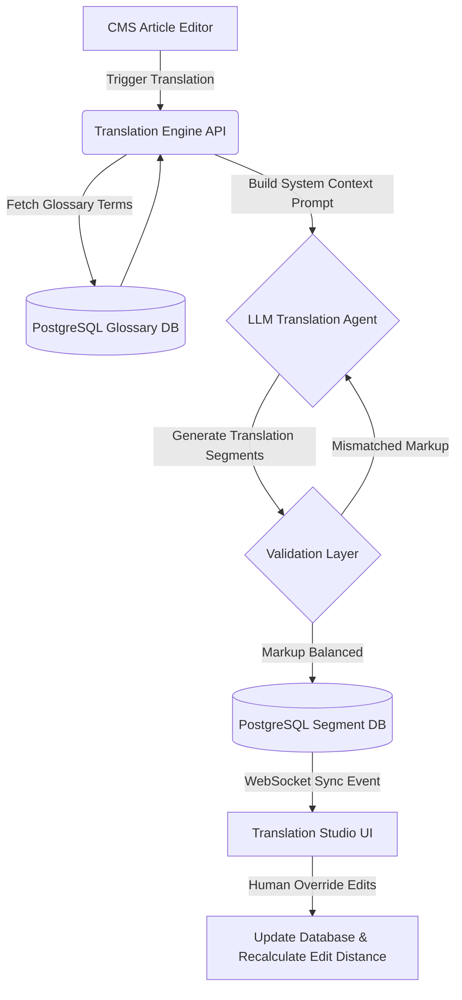

# AI Translation Engine
## Purpose
This document details the architectural design and functional specifications for the AI Translation Engine (AI Translation Studio) within the NewsOps Cloud digital publishing platform. It describes context-aware translation pathways, terminology glossaries, style controls, real-time collaboration syncing, and databases to manage cross-lingual publishing.

## Executive Summary
The AI Translation Engine provides newsrooms with a comprehensive suite to localize articles quickly and accurately across 40+ languages. Instead of raw, literal translations, the engine combines advanced LLMs with organization-scoped glossaries and custom tone adjustments. It supports a real-time side-by-side translation editor that synchronizes edits dynamically and preserves structural markup (HTML/Markdown).

## Vision
The vision is to democratize global publishing by allowing journalists to instantly write in their native language and publish worldwide, maintaining brand identity, proper localized terminology, and specific editorial voices without the delay of traditional, manual translation workflows.

## Scope
The translation studio encompasses:
1. **Dynamic Translation Engine**: Translates content with formatting preservation and context enrichment.
2. **Deterministic Glossary System**: Injects specific term overrides during translation processing.
3. **Style and Tone Presets**: Adjusts stylistic options (Formal, Conversational, Sensational, Technical).
4. **Side-by-Side Synced Storage**: Maintains alignments between source segments and target edits.
5. **Real-time Synchronization**: Synchronizes edits via WebSockets to enable collaborative review.

## Goals
- **Translation Fidelity**: 99.8% adherence to uploaded glossaries.
- **Processing Speed**: Less than 1.5 seconds latency per article page (approx. 500 words).
- **Format Integrity**: Zero broken Markdown syntax or misplaced HTML tags in the translated text.
- **Collaborative Sync**: Keep editor side-by-side view synced with database state under 200ms delay.

## Functional Requirements
1. **Context-Aware Translation**: The orchestrator must parse source articles, preserve block elements (headers, tables, links), and translate paragraph text contextually.
2. **Glossary Matching and Substitution**: Match pre-defined terminology overrides (case-insensitive) and instruct the translation model to follow them strictly.
3. **Tone and Style Adaptation**: Adjust target translation outputs based on predefined editorial personas.
4. **Sentence-Level Alignment**: Map sentences of the original text to sentences of the translated text, enabling a linked side-by-side editing layout.
5. **Human-in-the-Loop Post-Editing**: Allow translators to modify generated segments manually, tracking edit distances to refine future automatic models.

## Non-Functional Requirements
1. **Internationalization (i18n)**: Support major global language locales using BCP 47 language tags (e.g. `en-US`, `es-MX`, `ar-EG`).
2. **Scalability**: Handle parallel translation requests up to 100 concurrent requests without service degradation.
3. **High Fidelity Markup**: Prevent LLMs from translating or altering content inside markdown code blocks, URLs, or HTML attributes.

## Business Rules
1. **Glossary Isolation**: Glossaries are strictly bounded to the organization tier. Cross-organization reading or writing of glossaries is forbidden.
2. **Publication Quality Control**: Any AI-translated article must be flagged as `under_review` in the CMS and cannot be published until a certified editor clicks the "Approve Translation" button.
3. **Rate Limits by Tier**: Free organizations are limited to 50,000 translated words per month; Enterprise organization allocations are adjustable via administrative configurations.

## Actors
1. **Journalist**: Initiates translations from the CMS and reviews initial drafts.
2. **Translator/Editor**: Reviews side-by-side views, adjusts terminology, and overrides specific phrases.
3. **System Translation Engine**: Calls external APIs, enforces glossaries, and manages structural alignment.
4. **Administrator**: Uploads CSV glossaries and defines style guide rules.

## User Stories (At least 3 specific stories)
1. **Terminology Glossary Enforcement**: As a Translator, I want to upload our official brand glossary, so that company names and product features (e.g., "NewsOps Cloud" or "NewsIntelligence") are not literally translated by the AI in localized publications.
2. **Real-Time Translation Alignment**: As an Editor, I want a side-by-side editor view where clicking on a paragraph in the English version highlights and aligns with the French translation, so that I can audit sentences quickly.
3. **Preserving Rich Formatting**: As a Journalist, I want to translate an article containing hyperlinked text and bullet points, and have the output preserve the identical links and structure in Spanish without manual re-formatting.

## Acceptance Criteria (At least 3-5 criteria with clear thresholds)
1. **Glossary Adherence**: In a test translation run of 1,000 words containing 10 glossary terms, the output translation must use the specified glossary targets in 100% of instances.
2. **Markup Preservation**: The parser must ensure that the number of HTML tags or Markdown structures (e.g., `**bold**`, `[link](url)`) in the output matches the input structure exactly, rejecting the translation if tag counts are mismatched.
3. **Latency Threshold**: For articles under 1,500 words, translation generation and database write must take <= 2.5 seconds.
4. **WebSocket Sync Latency**: Collaborative changes in the editor text area must broadcast to other editors in the same session with a latency of <= 150ms.

## Workflows (Step-by-step description of system and user interactions)
### AI-Assisted Translation Job Workflow
1. **Submit Job**: The user requests a translation in the UI.
2. **Glossary Query**: The Engine retrieves active glossary terms for the organization.
3. **Segment Mapping**: The Engine breaks the text into numbered segments (typically paragraphs or sentences).
4. **Prompt Engineering**: The Engine constructs the payload injecting context:
   - Source text segment.
   - Glossary rules mapping `[source_term -> target_term]`.
   - Target tone/style parameters.
5. **Execution**: The LLM processes the payload.
6. **Validation**: The validation layer checks HTML/Markdown balance.
7. **Storage**: The segments are written to the database side-by-side.
8. **UI Sync**: WebSocket events update the Translator's screen.

## API Design (Provide actual REST endpoints, method, request/response JSON payloads, or GraphQL schemas)
### Submit Translation Job
- **Endpoint**: `POST /api/v1/ai/translate`
- **Headers**:
  - `Content-Type: application/json`
  - `Authorization: Bearer <JWT>`
- **Request Body**:
```json
{
  "article_id": "art_88776655",
  "source_language": "en",
  "target_language": "de",
  "style_preset": "conversational",
  "glossary_ids": ["glo_1122", "glo_3344"],
  "options": {
    "preserve_links": true,
    "temperature": 0.2
  }
}
```
- **Response Body (202 Accepted)**:
```json
{
  "job_id": "job_tx_990011",
  "article_id": "art_88776655",
  "status": "processing",
  "estimated_duration_seconds": 3,
  "created_at": "2026-06-27T22:20:25Z"
}
```

### Get Job Status and Alignments
- **Endpoint**: `GET /api/v1/ai/translate/jobs/{jobId}`
- **Headers**:
  - `Authorization: Bearer <JWT>`
- **Response Body (200 OK)**:
```json
{
  "job_id": "job_tx_990011",
  "status": "completed",
  "source_language": "en",
  "target_language": "de",
  "segments": [
    {
      "segment_index": 0,
      "source_text": "Welcome to NewsOps Cloud, the digital publishing operating system.",
      "target_text_ai": "Willkommen bei NewsOps Cloud, dem digitalen Publishing-Betriebssystem.",
      "target_text_human": null,
      "glossary_applied": ["NewsOps Cloud"]
    },
    {
      "segment_index": 1,
      "source_text": "Publish stories with speed and precision.",
      "target_text_ai": "Veröffentlichen Sie Geschichten mit Schnelligkeit und Präzision.",
      "target_text_human": "Veröffentlichen Sie Stories mit Schnelligkeit und Präzision.",
      "glossary_applied": []
    }
  ]
}
```

### Save Human Correction
- **Endpoint**: `PUT /api/v1/ai/translate/jobs/{jobId}/segments/{segmentIndex}`
- **Headers**:
  - `Content-Type: application/json`
  - `Authorization: Bearer <JWT>`
- **Request Body**:
```json
{
  "target_text_human": "Veröffentlichen Sie Storys mit Schnelligkeit und Präzision.",
  "editor_user_id": "usr_7766"
}
```
- **Response Body (200 OK)**:
```json
{
  "job_id": "job_tx_990011",
  "segment_index": 1,
  "target_text_human": "Veröffentlichen Sie Storys mit Schnelligkeit und Präzision.",
  "edit_distance": 2,
  "updated_at": "2026-06-27T22:20:45Z"
}
```

## Database Design (Identify schema tables, fields, and indexes relevant to this feature)
### Schema Layout

```sql
-- Active Translation Jobs table
CREATE TABLE translation_jobs (
    job_id UUID PRIMARY KEY DEFAULT uuid_generate_v4(),
    organization_id VARCHAR(50) NOT NULL,
    article_id VARCHAR(50) NOT NULL,
    source_language VARCHAR(10) NOT NULL,
    target_language VARCHAR(10) NOT NULL,
    style_preset VARCHAR(30) DEFAULT 'neutral' NOT NULL,
    status VARCHAR(20) DEFAULT 'pending' CHECK (status IN ('pending', 'processing', 'completed', 'failed')),
    created_at TIMESTAMP WITH TIME ZONE DEFAULT CURRENT_TIMESTAMP NOT NULL,
    updated_at TIMESTAMP WITH TIME ZONE DEFAULT CURRENT_TIMESTAMP NOT NULL
);

-- Glossaries table
CREATE TABLE translation_glossaries (
    glossary_id UUID PRIMARY KEY DEFAULT uuid_generate_v4(),
    organization_id VARCHAR(50) NOT NULL,
    name VARCHAR(100) NOT NULL,
    description TEXT,
    created_at TIMESTAMP WITH TIME ZONE DEFAULT CURRENT_TIMESTAMP NOT NULL
);

-- Glossary items details table
CREATE TABLE translation_glossary_terms (
    term_id UUID PRIMARY KEY DEFAULT uuid_generate_v4(),
    glossary_id UUID NOT NULL REFERENCES translation_glossaries(glossary_id) ON DELETE CASCADE,
    source_term VARCHAR(255) NOT NULL,
    target_term VARCHAR(255) NOT NULL,
    context_hint TEXT,
    created_at TIMESTAMP WITH TIME ZONE DEFAULT CURRENT_TIMESTAMP NOT NULL,
    CONSTRAINT unique_glossary_source UNIQUE (glossary_id, source_term)
);

-- Sentence-aligned translations segments table
CREATE TABLE translation_segments (
    segment_id UUID PRIMARY KEY DEFAULT uuid_generate_v4(),
    job_id UUID NOT NULL REFERENCES translation_jobs(job_id) ON DELETE CASCADE,
    segment_index INTEGER NOT NULL,
    source_text TEXT NOT NULL,
    target_text_ai TEXT NOT NULL,
    target_text_human TEXT,
    glossaries_matched JSONB DEFAULT '[]'::jsonb NOT NULL,
    last_edited_by VARCHAR(50),
    updated_at TIMESTAMP WITH TIME ZONE DEFAULT CURRENT_TIMESTAMP NOT NULL,
    CONSTRAINT unique_job_segment UNIQUE (job_id, segment_index)
);

-- Indexes for lightning fast fetches
CREATE INDEX idx_tx_jobs_org ON translation_jobs(organization_id, article_id);
CREATE INDEX idx_tx_glossary_org ON translation_glossaries(organization_id);
CREATE INDEX idx_tx_terms_glossary ON translation_glossary_terms(glossary_id);
CREATE INDEX idx_tx_segments_job ON translation_segments(job_id, segment_index);
```

## UI Design (Describe component structure, layouts, actions, and states)
### Translation Studio Interface
The interface allows users to perform translation tasks within a split-screen canvas layout.

#### 1. Component Structure
- **Top Bar**: Job Status Indicator (e.g. "Completed"), Target Language Dropdown, Style Preset Dropdown, "Save Draft" & "Publish Localized Article" buttons.
- **Left Panel (Source Text Editor)**: Read-only editor with individual segments highlighted in grey. Clicking a paragraph highlights it.
- **Right Panel (Target Text Editor)**: Editable interactive text zones representing corresponding segments. Highlights concurrently with the left panel. If the user edits a segment, a small "Edited" tag appears beside it.
- **Bottom Draw (Glossary Drawer)**: Displays active glossaries and highlights terms that were matched in the currently focused segment, allowing editors to add terms inline.

#### 2. Visual States
- **Translating State**: Split-screen showing skeleton loading cards on the right pane with a progress percentage bar in the top control panel.
- **Error State**: Displays a red banner at the top with "Failed to translate segment 4: Markup mismatch. [Retry Segment]".

## Permissions (Specify RBAC permissions required, e.g., organizations:read, articles:write)
- `ai:translation:create`: Run translation jobs.
- `ai:translation:edit`: Access the Side-by-Side editor and update human segment values.
- `ai:translation:approve`: Approve translated articles and change status to `ready_for_publish`.
- `ai:glossary:write`: Add, edit, or delete terminology glossary databases.

## Security (Detail security considerations, e.g., input validation, CSRF, JWT validation)
- **Input Filtering**: Sanitize HTML fields inside source articles to prevent XSS and nested prompt injections.
- **WebSocket Verification**: Validate JWT session payloads when opening WS channels for editing synchronizations.
- **Strict Tenant RLS**: Ensure database schema enforcement blocks database segment edits if the user does not possess permissions matching the job's organizational metadata.

## Performance (State latency limits, caching requirements, target TPS)
- **Throughput target**: Handles translation of 50,000 words per minute across active jobs.
- **WebSocket update broadcast**: Latency < 100ms.
- **API Response Time**: Non-LLM REST operations must resolve in < 120ms.

## Monitoring (Detail Prometheus metrics names, alert triggers)
- **Prometheus Metrics**:
  - `newsops_translation_duration_seconds` (Histogram tracking generation times)
  - `newsops_glossary_hits_total` (Counter tracking matches)
  - `newsops_markup_validation_failures_total` (Counter tracking rejected structural translation attempts)
- **Alert triggers**:
  - `HighTranslationFailureRate`: Trigger warning alert if > 10% of translation segments fail validation or upstream calls within 5 minutes.
  - `WebSocketLag`: Trigger alert if average WS message delivery latency exceeds 500ms.

## Logging (Specify log formats, error levels, log contexts)
- **Log Context**: JSON format:
  ```json
  {"timestamp": "2026-06-27T22:20:25Z", "level": "INFO", "org_id": "org_987", "job_id": "job_tx_99", "action": "segment_edit", "user_id": "usr_77", "edit_distance": 4}
  ```
- **Convention**:
  - `INFO`: Translation job created, glossary matches compiled, segment edited.
  - `WARN`: LLM validation error resolved with retry.
  - `ERROR`: Core translation failure, WebSocket broadcast drops.

## Error Handling (Map input/system error codes to HTTP status and customer-facing messages)
| Error Code | HTTP Status | Customer-Facing Message | System Trigger Context |
|---|---|---|---|
| `ERR_MARKUP_CORRUPTED` | 422 Unprocessable Entity | The translation could not preserve formatting. Please inspect paragraphs. | Target text generated by LLM has unbalanced brackets or tags. |
| `ERR_GLOSSARY_DUPLICATE` | 409 Conflict | A translation rule for this term already exists. | Creating terms that violate unique database constraints. |
| `ERR_TRANSLATION_TIMEOUT` | 504 Gateway Timeout | The translation engine took too long. Retrying process. | Upstream translation APIs timed out during response wait. |

## Edge Cases (Handle race conditions, rate limit hits, upstream timeouts)
- **Overlapping Glossary Rules**: E.g., glossaries define "Cloud Operations" -> "Cloud Operations" and "Operations" -> "Betrieb". The substitution engine resolves this by executing matches in descending order of string length to prevent nested replacements.
- **LLM Stripping HTML Elements**: When translating text mixed with markup (e.g. `<a>Click here</a>`), LLMs might drop closing tags. The validation layer automatically compares regex balances and triggers self-correction loops.
- **Simultaneous Collaborative Edits**: Two users editing the exact same translation segment. Resolved using Optimistic Concurrency Control (OCC) using the segment's `updated_at` timestamp.

## Future Improvements (Provide long-term scaling, architecture refactor paths)
- **Local Model Translation (MarianMT)**: Deploy localized open-source translation models in containers to bypass API dependency costs for simple target language pairs.
- **Automatic Glossary Discovery**: Analyze post-edited translator corrections to suggest new glossary words when a correction is made consistently across multiple articles.

## Mermaid Diagrams (Include at least one high-quality diagram: flowchart, sequence, or ERD)


## References (Reference other related files in the repository using standard relative markdown links, e.g., '../02-architecture/system_architecture.md')
- [Editorial and CMS Schema Specification](../03-database/editorial_and_cms_schema.md)
- [System Architecture Integration Patterns](../02-architecture/integration_patterns.md)
- [Caching Strategy for Collaborative Workspaces](../02-architecture/caching_strategy.md)
