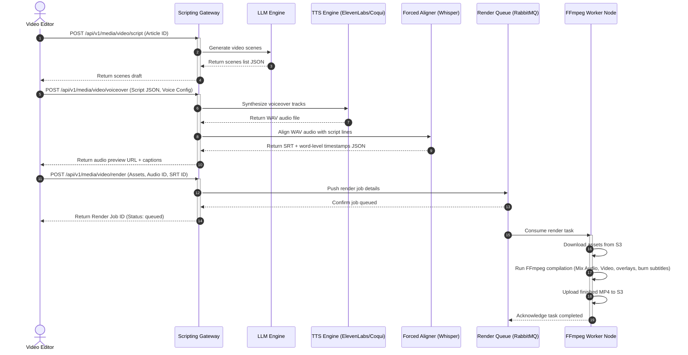

# Video Scripting and Voiceover Engine
## Purpose
This document specifies the technical design, processing pipelines, and deployment architecture for the NewsOps Cloud Video Scripting and Voiceover Engine. This system enables journalists and editors to automatically transform text-based articles into professional, short-form video scripts, generate realistic narration using advanced Text-to-Speech (TTS) APIs, establish word-level timestamp alignments for subtitles, and queue final video compilation via an automated rendering pipeline.

## Executive Summary
Audiences consume news increasingly through short-form video (e.g., TikTok, YouTube Shorts, Instagram Reels). Sourcing editors to manually rewrite articles, record voiceovers, and time subtitles is slow and expensive. 

The NewsOps Video Scripting and Voiceover Engine automates this workflow:
1.  **AI Script Generation**: Summarizes long articles into a series of visual scene suggestions and accompanying narration scripts.
2.  **Voice Synthesis**: Renders narration using OpenAI TTS, ElevenLabs, or local Coqui TTS models.
3.  **Forced Alignment**: Evaluates audio outputs to map words to exact millisecond timestamps, outputting high-fidelity SRT/WebVTT subtitles.
4.  **Distributed Video Rendering Queue**: Passes the script, audio tracks, and templates to a worker pool running FFmpeg to assemble the final video.

## Vision
To establish an automated, zero-touch media conversion pipeline that allows publishers to output high-quality, synchronized video digests alongside every text article, boosting reach and engagement across digital media channels.

## Scope
The scope of this engine includes:
- LLM prompt configurations for converting news articles to structured, scene-by-scene video scripts.
- Integration wrapper for ElevenLabs API, OpenAI TTS API, and local containerized Coqui TTS.
- Millisecond-precision speech-to-text alignment (using Whisper or Montreal Forced Aligner) to generate word-level timestamp tables.
- Subtitle file generator (SRT, WebVTT, and JSON styles).
- Distributed task queue management (Celery/RabbitMQ) for managing FFmpeg video rendering nodes.

The following are explicitly out of scope:
- Interactive video-cutting tools (non-programmatic multi-track timeline editing).
- Generating fully synthesized 3D virtual anchor avatars (video tracks will use article photos, video clips, or motion graphics templates).

## Goals
- **Narration Speed**: Synthesize high-quality audio tracks within 5 seconds for a typical 90-second script (approx. 180 words).
- **Subtitling Accuracy**: Achieve 100% synchronization accuracy where visual text highlights match spoken words within a 30ms window.
- **Rendering Performance**: Render a 60-second 1080p MP4 summary video in less than 45 seconds on standard compute worker instances.
- **Error Resiliency**: Implement auto-retries and fallback voices to maintain a task success rate greater than 99.5%.

## Functional Requirements
- **Script Generation**: An LLM-based service must read a news article, extract key talking points, and structure them into a JSON array of scenes. Each scene contains `scene_number`, `visual_description`, and `narration_text`.
- **Speech Synthesis (TTS)**: The gateway must convert narration text into a 44.1kHz high-quality audio file. It must support multiple voice profiles (e.g., Male News Anchor, Female Reporter) and allow custom pronunciation parameters.
- **Subtitle Alignment Engine**: The system must process the audio file and narration text through a forced alignment pipeline, generating a transcript file containing the exact start and end times for every single word.
- **Subtitle Output**: Programmatic generation of subtitle formats:
  - Standard `.srt` files for platform upload.
  - Standard `.vtt` files for web players.
  - Nested frame coordinate data for rendering burned-in captions onto the video.
- **FFmpeg Assembly Queue**: The rendering queue must take visual assets (stills, video clips, overlays), the generated voiceover MP3 track, and subtitle files, compiling them into a final H.264 MP4 video based on configured aspect ratio presets (e.g., 9:16 vertical, 16:9 widescreen).

## Non-Functional Requirements
- **Audio Output Parameters**: Audio must be rendered at 128kbps stereo MP3/AAC.
- **Video Output Codecs**: Standardize on H.264 video codec and AAC audio codec for universal compatibility.
- **Scalability**: The FFmpeg rendering workers must run as stateless Docker containers on autoscaling Kubernetes nodes, scaling out during heavy editorial activity.
- **Storage**: Audio tracks, subtitles, and draft videos must be stored in a secure bucket (`s3://newsops-media-pipeline/video/`) with a 14-day automatic expiration lifecycle to control storage costs.

## Business Rules
- **Voice Usage Controls**: Premium voices (e.g., ElevenLabs high-fidelity cloned voices) are reserved for top-tier tenants and breaking news articles. General summaries must use local Coqui TTS.
- **Pronunciation Dictionaries**: Every publication can register custom word mappings (e.g., "NewsOps" mapped to "News Ops", complex local town names mapped to phonetic representations) to prevent TTS mispronunciations.
- **Credits Tracking**: Track and charge characters utilized in TTS calls to the corresponding tenant's billing profile.

## Actors
- **Editor**: Triggers video summary generation from the CMS, edits script text, and selects voice options.
- **Video Rendering Worker**: The background daemon that processes media tasks, compiles tracks, and burns subtitles.
- **TTS Provider API**: External endpoints (ElevenLabs, OpenAI) or local Coqui TTS containers.

## User Stories (At least 3 specific stories)
### Story 1: Reporter Generating a Social Video Digest
As a digital reporter, I want to convert my finished breaking news article into a 60-second video script and generate a voiceover using a professional voice, so that I can publish a synchronized video summary to our TikTok and Instagram feeds simultaneously.
*   **Trigger**: Reporter clicks "Convert to Video Summary" inside the CMS.
*   **System Action**: The system drafts a 4-scene script, generates narration audio, outputs the SRT captions, and passes it to the rendering queue.

### Story 2: Editor Correcting Pronunciation in Script
As an editor, I want to listen to the generated voiceover draft and adjust the phonetic spelling of a politician's name in a custom dictionary, so that the corrected pronunciation is permanently used in all future voice outputs.
*   **Trigger**: Editor detects a mispronounced name in the preview player, edits the Pronunciation Dictionary, and clicks "Regenerate Audio".
*   **System Action**: The system updates the lookup map, reruns the TTS generation for that specific sentence, aligns the timestamps, and refreshes the preview.

### Story 3: Video Producer Slicing Multi-Language Captions
As a global video producer, I want to generate a single video summary with three separate subtitle track options (English, Spanish, French) with word-level timing offsets so that the same video asset can be served to international viewers with native language captions.
*   **Trigger**: Producer selects "Generate Multilingual Subtitles".
*   **System Action**: The translation worker translates the script, synthesizes local localized audio tracks, creates aligned SRT outputs for each language, and merges them into a multi-track WebM container.

## Acceptance Criteria (At least 3-5 criteria with clear thresholds)
- **AC 1 (Script Segment Bounds)**: Script generation prompts must constrain visual scene lengths. No visual scene text may exceed 160 characters (to avoid visual crowding when subtitles are burned onto 9:16 mobile screens).
- **AC 2 (Forced Alignment Precision)**: The generated word-level start/end timestamps must match the actual speech waveforms with a maximum deviation threshold of 30 milliseconds.
- **AC 3 (Queue Auto-Retry)**: If a rendering worker crashes due to an out-of-memory or FFmpeg exit code, the task orchestrator must retry the render on a different host, up to 3 times, before changing status to `failed`.
- **AC 4 (Audio Sample Rates)**: All output voice synthesis files must be normalized to exactly 44,100 Hz sample rate and 16-bit depth mono PCM before being mixed into FFmpeg.

## Workflows (Step-by-step description of system and user interactions)
The sequence of processes from text-to-video scripting to queue rendering is mapped below:

```
[CMS Editor UI] --(Select Article + Choose Voice)--> [Video Scripting Gateway]
                                                              |
    +---------------------------------------------------------+
    |
    v
[LLM Script Compiler]
    |
    +---> 1. Summarize article into Scene Array.
    +---> 2. Structure Output: {scene_num, visual_prompt, narration}.
    |
    v
[TTS Orchestrator]
    |
    +---> 1. Consult Tenant Pronunciation Map.
    +---> 2. Route narration text to target TTS Engine (ElevenLabs/Coqui/OpenAI).
    +---> 3. Receive raw WAV audio stream.
    |
    v
[Whisper Alignment Worker]
    |
    +---> 1. Process WAV file + narration text.
    +---> 2. Run forced alignment.
    +---> 3. Generate Word-Level Timestamp JSON and SRT/WebVTT tracks.
    |
    v
[FFmpeg Rendering Queue (Celery/RabbitMQ)]
    |
    +---> 1. Retrieve visual assets (images/video segments) from S3.
    +---> 2. Assemble visual tracks with transitions.
    +---> 3. Layer TTS audio narration and background ambient loop.
    +---> 4. Burn subtitles dynamically using SRT file.
    +---> 5. Render final MP4 output.
    |
    v
[Storage & CDN] ---> [Notify User / Update CMS status to Ready]
```

## API Design (Provide actual REST endpoints, method, request/response JSON payloads, or GraphQL schemas)
### 1. Generate Video Script from Article
*   **Method**: `POST`
*   **Path**: `/api/v1/media/video/script`
*   **Headers**:
    *   `Content-Type: application/json`
    *   `Authorization: Bearer <JWT>`

**Request Body**:
```json
{
  "article_id": "art-09a823f4-1122-4982-8bc1-678912ef00aa",
  "target_duration_seconds": 60,
  "scene_count": 4,
  "style": "dramatic_news"
}
```

**Response Body (HTTP 200 OK)**:
```json
{
  "script_id": "vscr-8902-1242-aa88-9018cda12ef0",
  "article_id": "art-09a823f4-1122-4982-8bc1-678912ef00aa",
  "scenes": [
    {
      "scene_number": 1,
      "visual_description": "Close up of servers with blinking blue LEDs, cybersecurity overlays fading in.",
      "narration_text": "A massive cyber attack has targeted the central banking network."
    },
    {
      "scene_number": 2,
      "visual_description": "Pan across empty trading floor, stocks ticker showing red declines.",
      "narration_text": "Markets reacted instantly, with index levels dropping over two percent within minutes."
    }
  ]
}
```

### 2. Synthesize Narration and Aligned Subtitles
*   **Method**: `POST`
*   **Path**: `/api/v1/media/video/voiceover`
*   **Headers**:
    *   `Content-Type: application/json`
    *   `Authorization: Bearer <JWT>`

**Request Body**:
```json
{
  "script_id": "vscr-8902-1242-aa88-9018cda12ef0",
  "voice_profile_id": "eleven-voice-news-anchor-male",
  "tts_provider": "elevenlabs",
  "pronunciation_overrides": {
    "NewsOps": "News-Ops"
  }
}
```

**Response Body (HTTP 200 OK)**:
```json
{
  "voiceover_track_id": "vtrack-9012-ff12-a12b-3cd4ef12",
  "audio_url": "https://cdn.newsops.cloud/audio/2026/vtrack-9012-ff12.mp3",
  "subtitles": {
    "srt_url": "https://cdn.newsops.cloud/audio/2026/vtrack-9012-ff12.srt",
    "webvtt_url": "https://cdn.newsops.cloud/audio/2026/vtrack-9012-ff12.vtt",
    "words_alignment": [
      {"word": "A", "start_ms": 120, "end_ms": 200},
      {"word": "massive", "start_ms": 210, "end_ms": 580},
      {"word": "cyber", "start_ms": 600, "end_ms": 950},
      {"word": "attack", "start_ms": 980, "end_ms": 1340}
    ]
  }
}
```

### 3. Queue Video Compilation Job
*   **Method**: `POST`
*   **Path**: `/api/v1/media/video/render`
*   **Headers**:
    *   `Content-Type: application/json`
    *   `Authorization: Bearer <JWT>`

**Request Body**:
```json
{
  "script_id": "vscr-8902-1242-aa88-9018cda12ef0",
  "voiceover_track_id": "vtrack-9012-ff12-a12b-3cd4ef12",
  "aspect_ratio": "9:16",
  "resolution": "1080x1920",
  "burn_subtitles": true,
  "visual_media_mappings": [
    {
      "scene_number": 1,
      "image_url": "https://cdn.newsops.cloud/media/2026/06/cyber_security_servers.webp",
      "motion_effect": "zoom_in"
    },
    {
      "scene_number": 2,
      "image_url": "https://cdn.newsops.cloud/media/2026/06/stock_market_fall.webp",
      "motion_effect": "pan_right"
    }
  ]
}
```

**Response Body (HTTP 202 Accepted)**:
```json
{
  "render_job_id": "rnd-4402a11b-9023-49ca-bb2a-0012cda34ee5",
  "status": "processing",
  "queue_position": 2,
  "estimated_time_remaining_seconds": 38
}
```

## Database Design (Identify schema tables, fields, and indexes relevant to this feature)
Relational database schemas for script models, voice tracks, alignments, and background rendering jobs are detailed below.

```sql
-- Represents the primary video summary script metadata
CREATE TABLE video_scripts (
    script_id UUID PRIMARY KEY DEFAULT gen_random_uuid(),
    tenant_id UUID NOT NULL,
    article_id UUID NOT NULL, -- references articles table
    created_by UUID NOT NULL,
    style VARCHAR(50) NOT NULL,
    total_duration_sec INT NOT NULL DEFAULT 60,
    created_at TIMESTAMP WITH TIME ZONE DEFAULT CURRENT_TIMESTAMP,
    updated_at TIMESTAMP WITH TIME ZONE DEFAULT CURRENT_TIMESTAMP
);

-- Contains the individual visual scenes and voice lines of a script
CREATE TABLE script_scenes (
    scene_id UUID PRIMARY KEY DEFAULT gen_random_uuid(),
    script_id UUID REFERENCES video_scripts(script_id) ON DELETE CASCADE,
    scene_number INT NOT NULL,
    visual_description TEXT NOT NULL,
    narration_text TEXT NOT NULL,
    created_at TIMESTAMP WITH TIME ZONE DEFAULT CURRENT_TIMESTAMP,
    CONSTRAINT unique_script_scene_num UNIQUE (script_id, scene_number)
);

-- Records information about the synthesized voice narration tracks
CREATE TABLE voiceover_tracks (
    voiceover_track_id UUID PRIMARY KEY DEFAULT gen_random_uuid(),
    script_id UUID REFERENCES video_scripts(script_id) ON DELETE CASCADE,
    voice_profile_id VARCHAR(100) NOT NULL,
    tts_provider VARCHAR(50) NOT NULL, -- 'elevenlabs', 'openai', 'coqui'
    audio_s3_uri VARCHAR(512) NOT NULL,
    srt_s3_uri VARCHAR(512) NOT NULL,
    words_alignment_json JSONB NOT NULL, -- stores the millisecond offsets
    character_cost INT NOT NULL DEFAULT 0,
    created_at TIMESTAMP WITH TIME ZONE DEFAULT CURRENT_TIMESTAMP
);

-- Tracks rendering worker assignments and execution states
CREATE TABLE video_render_jobs (
    render_job_id UUID PRIMARY KEY DEFAULT gen_random_uuid(),
    tenant_id UUID NOT NULL,
    script_id UUID REFERENCES video_scripts(script_id) ON DELETE RESTRICT,
    voiceover_track_id UUID REFERENCES voiceover_tracks(voiceover_track_id) ON DELETE RESTRICT,
    aspect_ratio VARCHAR(10) NOT NULL, -- '9:16', '16:9'
    resolution VARCHAR(15) NOT NULL, -- '1080x1920', '1920x1080'
    status VARCHAR(50) NOT NULL, -- 'queued', 'downloading', 'rendering', 'completed', 'failed'
    output_video_url VARCHAR(512),
    worker_node_id VARCHAR(100),
    attempt_count INT NOT NULL DEFAULT 0,
    error_log TEXT,
    created_at TIMESTAMP WITH TIME ZONE DEFAULT CURRENT_TIMESTAMP,
    updated_at TIMESTAMP WITH TIME ZONE DEFAULT CURRENT_TIMESTAMP
);

-- Indexes for performance monitoring and fast API status polling
CREATE INDEX idx_video_script_article ON video_scripts(article_id);
CREATE INDEX idx_render_job_status ON video_render_jobs(status, tenant_id);
```

## UI Design (Describe component structure, layouts, actions, and states)
The scripting dashboard resides in the **Video Digest Studio** module of the NewsOps CMS.

### Component Structure
1.  **Script Editor Panel**:
    *   Vertically stacked list of scene cards. Each scene displays editable text fields for Visual Description (left) and Narration (right).
    *   "Add Scene" and "Delete Scene" helper options.
2.  **Voice Configuration Sidebar**:
    *   Dropdown showing available voice samples (with audio play buttons next to each).
    *   Volume, Pitch, and Speed sliders.
    *   Pronunciation Dictionary popover tool.
3.  **Timeline Preview Canvas**:
    *   Displays draft video rendering status.
    *   Audio waveform track shown beneath the video player, displaying visual spikes corresponding to generated timestamps.
    *   Clicking a word on the subtitle preview jumps the playhead to that exact millisecond.

### Interface States
*   **Processing State**: Timeline area disabled, displaying: *"Synthesizing voice track and aligning captions..."*
*   **Error State**: Scene narration field highlighted in amber if character count exceeds limit, with warning message: *"Warning: Text too long for scene length. May cause subtitle cutoff."*

## Permissions (Specify RBAC permissions required, e.g., organizations:read, articles:write)
The following RBAC permissions govern the video scripting and rendering service:
- `video:script:write` - Grants permission to generate, modify, and delete video summary drafts.
- `video:voiceover:create` - Permits synthesizing speech audio tracks (monitored for billing cost tracking).
- `video:render:execute` - Permits pushing tasks to the FFmpeg rendering queue.
- `video:pronunciation:manage` - Permits adding terms to the custom pronunciation dictionary.

## Security (Detail security considerations, e.g., input validation, CSRF, JWT validation)
- **API Key Containment**: Credentials for ElevenLabs and OpenAI are stored in Vault. The client application never accesses these keys directly; all requests route through the internal gateway which injects authorization headers.
- **FFmpeg Execution Isolation**: FFmpeg command strings are dangerous vectors for Shell Injection. The rendering worker must never evaluate raw user-submitted text directly as bash command arguments. Instead, the parameters are passed to FFmpeg programmatically via node-fluent-ffmpeg or python-ffmpeg wrappers with inputs sanitized.
- **Rate Limiting**: Apply an IP and user token rate limit to `/api/v1/media/video/voiceover` (maximum 10 voice requests per minute) to prevent Denial of Wallet attacks targeting premium TTS endpoints.

## Performance (State latency limits, caching requirements, target TPS)
- **Target Metrics**:
  - **TTS Synthesis Duration**: < 3.5 seconds.
  - **Alignment Extraction Time**: < 1.5 seconds.
  - **FFmpeg Assembly Speed**: Output render time must not exceed 0.8x of video play duration (e.g., a 60s video must render in less than 48s).
- **Caching**:
  - Cache synthesized audio clips of individual sentences. If an editor changes only Scene 3 of a 5-scene script, the system should only regenerate the audio block for Scene 3, then stitch the cached MP3 parts of Scenes 1, 2, 4, and 5 together.

## Monitoring (Detail Prometheus metrics names, alert triggers)
The system tracks pipeline activities via these Prometheus metrics:
- `newsops_tts_latency_seconds`: Histogram of voice synthesis duration, labeled by provider and voice ID.
- `newsops_render_duration_seconds`: Histogram of video compilation durations.
- `newsops_render_failures_total`: Counter tracking total compilation crashes, labeled by error codes.
- `newsops_tts_characters_billed_total`: Counter tracking consumed characters for external provider bills.

**Alert Triggers**:
- **Critical Alert**: `newsops_render_failures_total > 15` in 1 hour. Trigger message: "FFmpeg rendering worker queue experiencing critical failures."
- **Warning Alert**: Average queue wait time in RabbitMQ exceeds 2 minutes. Trigger alert: "Render tasks queuing up, increase worker scaling."

## Logging (Specify log formats, error levels, log contexts)
Logs are structured as JSON:
```json
{
  "timestamp": "2026-06-27T22:20:20.115Z",
  "level": "INFO",
  "context": {
    "tenant_id": "c6a12b91-efd5-4ad9-a790-db0e87b7a13d",
    "script_id": "vscr-8902-1242-aa88-9018cda12ef0",
    "render_job_id": "rnd-4402a11b-9023-49ca-bb2a-0012cda34ee5"
  },
  "message": "FFmpeg video assembly initiated.",
  "render_settings": {
    "aspect_ratio": "9:16",
    "resolution": "1080x1920",
    "burn_subtitles": true
  }
}
```

## Error Handling (Map input/system error codes to HTTP status and customer-facing messages)
The mapping of scripting and voiceover engine failures:

| System Error Code | HTTP Status | Target Customer-Facing Message | Rationale |
| :--- | :--- | :--- | :--- |
| `TTS_SERVICE_UNAVAILABLE` | 502 | "The premium voice generator is offline. Falling back to standard reporting voice." | API timeout or failure when reaching ElevenLabs. |
| `TIMING_ALIGNMENT_FAILED` | 500 | "Audio generation completed, but caption synchronization failed. Please regenerate." | Whisper/MFA alignment failed to converge text with the waveform. |
| `FFMPEG_RENDER_CRASH` | 500 | "An error occurred during final video stitching. Please check your asset formats." | FFmpeg exited with non-zero code due to corrupted assets or format mismatch. |
| `DICTIONARY_COMPILATION_ERROR`| 400 | "The custom pronunciation dictionary contains invalid phonetic syntax." | Invalid phonetic characters submitted by user. |

## Edge Cases (Handle race conditions, rate limit hits, upstream timeouts)
- **Dynamic Names in Breaking News**: A newly relevant foreign diplomat's name is read incorrectly by the TTS engine. *Resolution*: Allow phoneme input formatting (e.g., IPA symbols) in the Pronunciation Dictionary, which overrides default dictionary synthesis logic.
- **Empty Audio Output segments**: If the LLM generates a scene containing only punctuation or numbers (e.g. "Scene 3: ..."), the TTS engine may generate a zero-byte audio file, causing the alignment pipeline to crash. *Resolution*: Pre-validate narration text strings, converting numerical values to spoken words (e.g., "100" -> "one hundred") and rejecting empty inputs.
- **Network Interruptions During Asset Pulling**: Large image files or video assets might fail to download from S3 during FFmpeg assembly. *Resolution*: Implement a caching layer on rendering workers that pre-downloads assets, verifying sizes before invoking the FFmpeg command.

## Future Improvements (Provide long-term scaling, architecture refactor paths)
- **AI Talking Avatars**: Interface with synthesizers like HeyGen or local avatar pipelines to render photorealistic talking anchors dynamically matched to the audio track.
- **Dynamic B-Roll Selection**: Connect the video script engine with the image generation pipeline and archival media library to dynamically compile and overlay related video clips and photos as contextual B-roll.
- **Instant Translation & Dubbing**: Package voice translation adapters that translate the script and re-synthesize localized voice tracks matched to the source voice's baseline characteristics.

## Mermaid Diagrams (Include at least one high-quality diagram: flowchart, sequence, or ERD)
### Media Compilation Pipeline Sequence
This sequence details how a video script is compiled into audio, aligned, structured, and rendered.



## References (Reference other related files in the repository using standard relative markdown links, e.g., '../02-architecture/system_architecture.md')
- [Storage Architecture Specification](../02-architecture/storage_architecture.md)
- [Social Publishing Schema](../03-database/social_publishing_schema.md)
- [Image Generation Pipeline Specifications](./image_generation_pipeline.md)
